# 【量化交易完全可自学教程】2024B站最完整的Python金融分析与量化交易实战教程分享！知名博士通俗易懂的解释，学量化交易真的不难！ - P33：34.34.策略任务概述(Av1302064773,P34) - AI知识库 - BV1YT42117B5

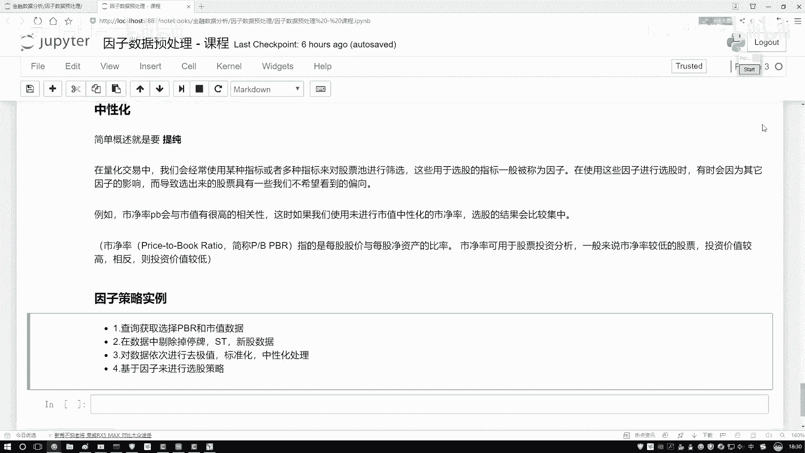

行了，那给大家说一说吧，哎你说提纯这件事啊，我该怎么去做，比如说现在我这样，我说我有一个因子啊，说这个PB它就是我的一个因子行吧，然后呢我说这个因子当中啊，有一些我不想要的成分谁呀。

那比如说现在我发现了这个市净率啊，跟这个市值啊，它关系挺大的，然后呢，在市净率当中包括了一些跟市值相关的东西，那我既然要提纯，那是不是说现在唉我说这是我的一个因子啊，表示我的一个市净率。

然后呢这个它是一个市值是吧，我是不是说想在这里诶，我把蓝色这个东西给他清出去啊，是不是做这样一件事儿啊，那怎么清啊，你是不是得先知道市值诶，比如说我说因子，我说因子现在是个整体。

我们是不是想看一看市值啊，解释了这个因子当中的哪一部分，我把这一部分找到，然后呢，我做一个减法，做完减法之后，我剩下的是不是。

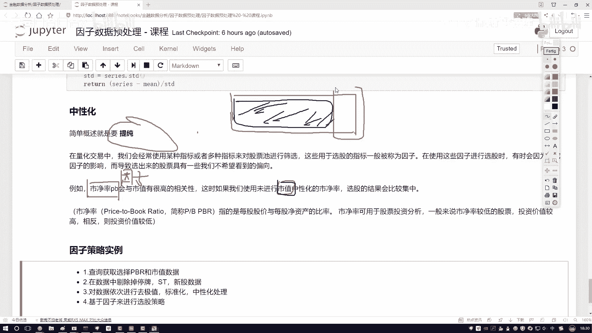

就是我中心化之后的一个结果啊，那怎么做呢，我说这样先大家举个例子，我说我做一个方程，这个方程当中啊，大家一定要注意啊，就是谁等于谁啊，我说我现在做这个因子啊，就好比是我的一个实用率啊，我说这个因子啊。

刚才你不是说了吗，跟谁相关的，跟我这个市值相关，那我说这样吧，我说这个市值啊，我写出来这里我说有一个市值市值跟它相关啊，那是不是得有一定的关联程度啊，那给我感觉好像这样。

就像是一个Y等于这个WX加上一个B的过程，好了，我说这块是指你再给我乘上一个W，再加上一个B行吧，我说有这样的关系，既然你说市值占因子当中一部分，那我把他俩列出这个式子没问题吧，诶那大家来想。

那现在我们要干什么，我是不是要找到因子当中市值占了多少，那说白了我要干一件什么事啊，这个东西叫什么，这东西叫什么，它是不是唉就是一个回归方程啊，如果说我能把这个回归方程给他解出来，什么叫解出来。

我知道W是什么，知道B是什么，我是不是就能知道了，哎呦这个市值啊，占我因子当中多大的一个成分了，哎是不是这样一件事啊，但是我问大家一件事啊，我们之前还在讲线性回归的时候，在经济学课程当中，我经常会讲七。

我都是先讲线性回归，那我问大家一件事，我说现在啊当你得到了这个W，得到了这个B之后，你跟市值啊，就是W乘上市值，再加上B之后，你还原回去得到什么，我们一般情况下管这东西叫什么，是不是叫做一个预测值啊。

唉当前我说现在我拿绿色框起来这个东西。

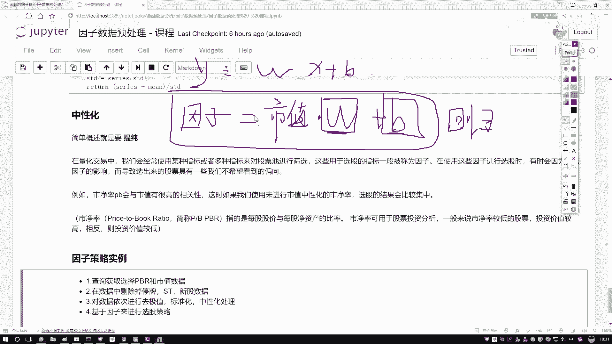

我说这个东西啊叫做什么，叫做一个预测值，唉这有没有什么问题啊，没问题吧，然后呢。

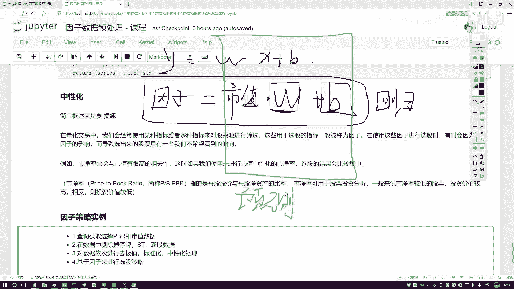

我说现在我这块是不是还列了一个Y，这个Y是什么，我说这个东西啊。

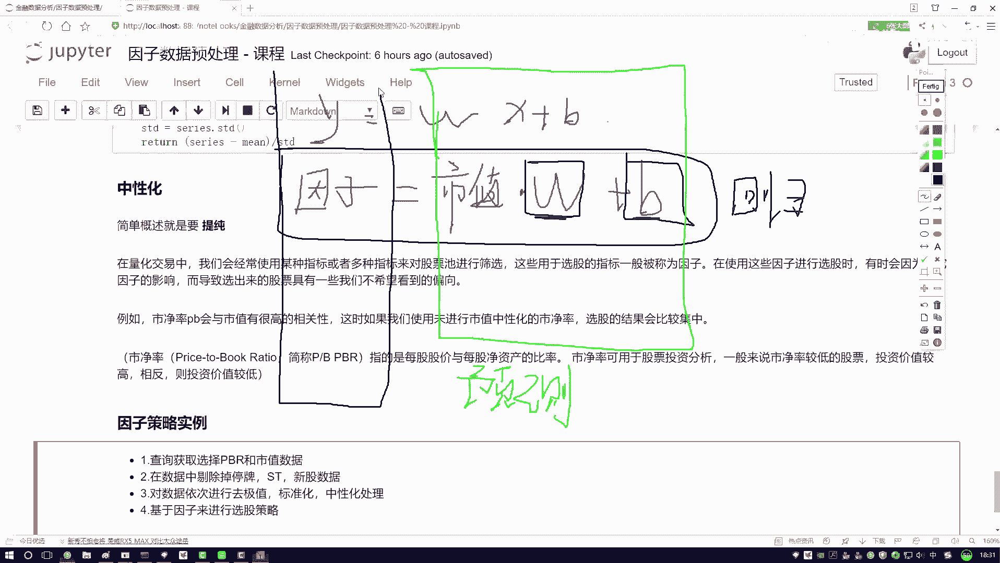

它是什么，它是我的一个真实值吧，是不是我的一个真实值啊。

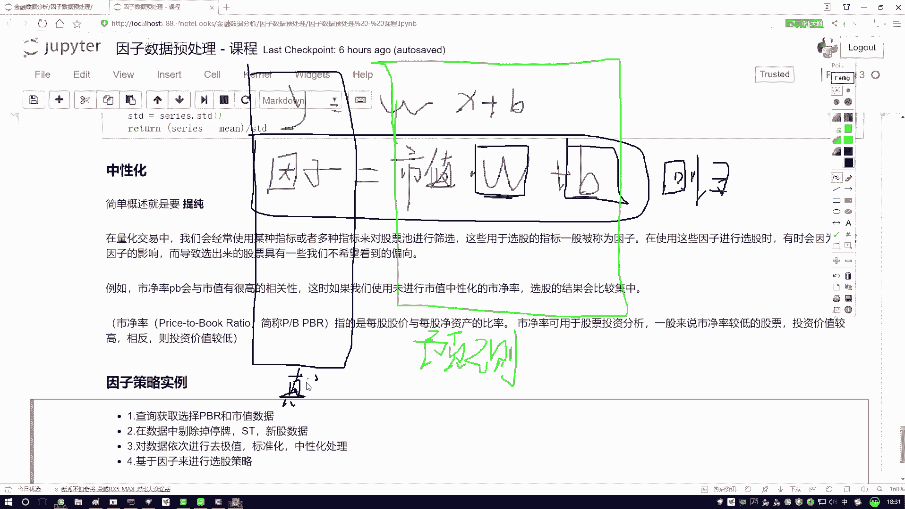

那现在大家看哎，你说这块我们列了是一个等式，但实际当中你真能得到一个等式吗，在线回归当中你真能得到这个等式吗。

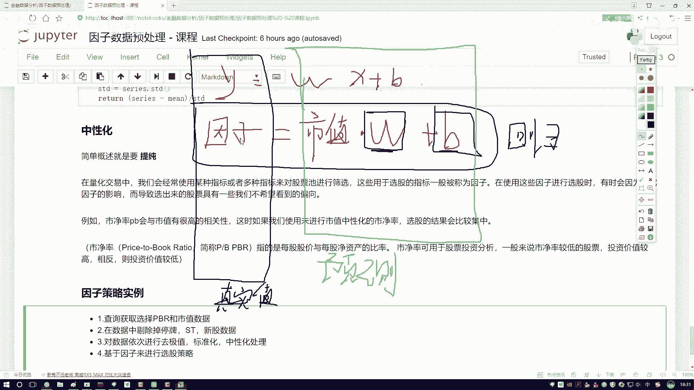

不一定吧，我们得到什么是一个近似解吧，实际当中那表示什么意思。

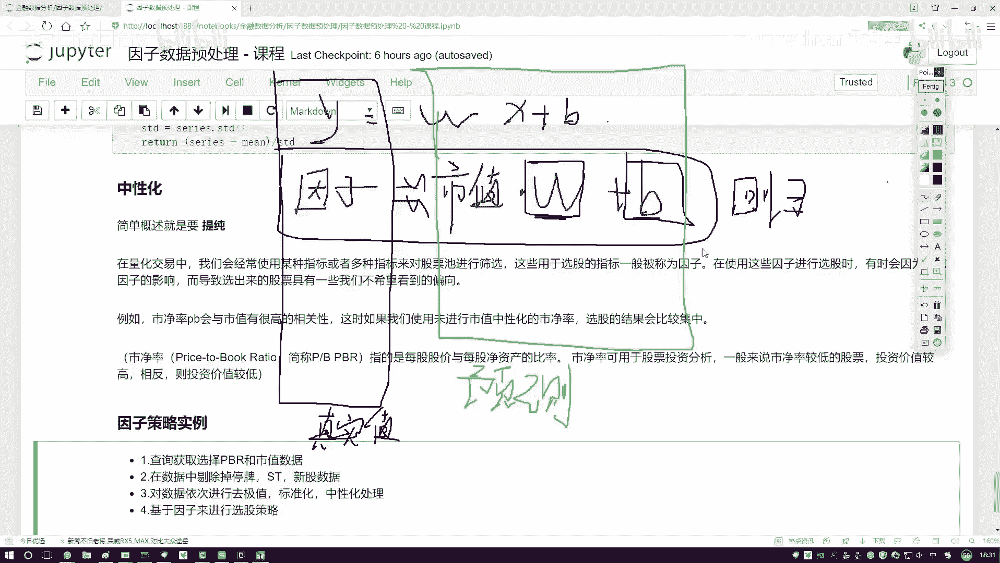

好像说这样一件事啊，哎我做一个回归方程用啊，我的一个Y。

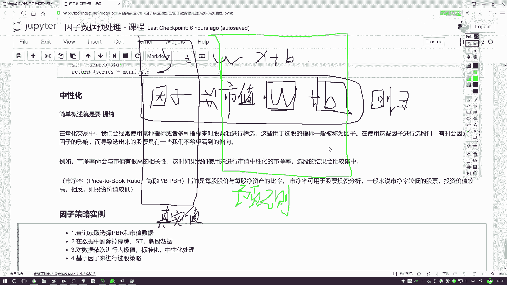

或者说用我的一个标签表示我的因子，用的是指表示我的输入数据，我现在就想看一看。

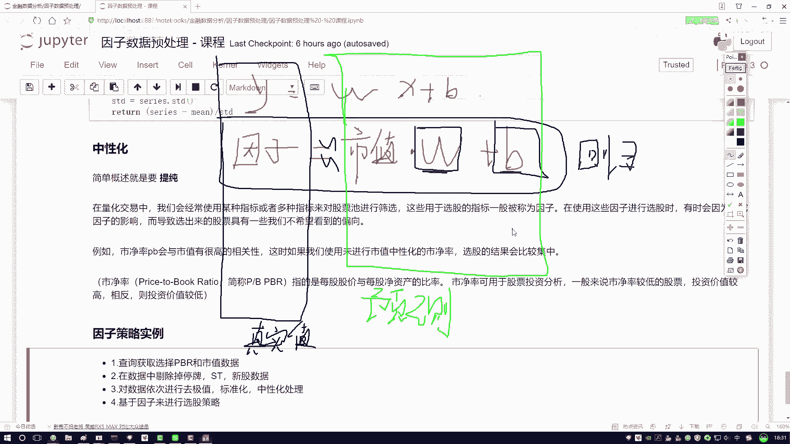

我是指解释了因子当中多大一部分，我做了这样一个回归方程，得到了W和B吧，然后呢我说这样W和B哎呦，还原回去W尝试值，再加上B之后得到这个东西叫预测值吧，那预测值和真实值之间是不是会有一个差异。

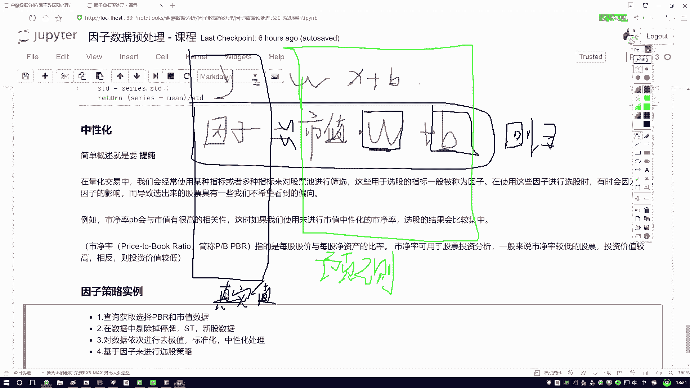

哎预测值和真实值之间肯定会存在一个差异吧，我们一般情况下叫做这个误差项，为什么会猜差异呢，为什么会才差异啊，我们现在这个预测是什么意思啊，我要看啊，有因子当中多大一部分能被市值所解释。

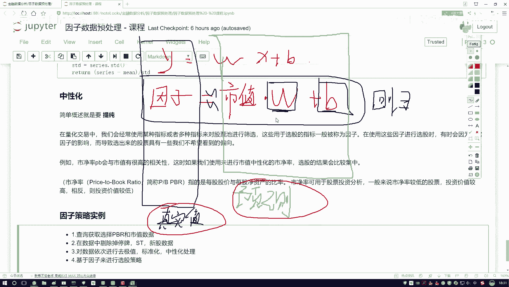

它们之间的一个差异代表什么，他们之间差异诶。

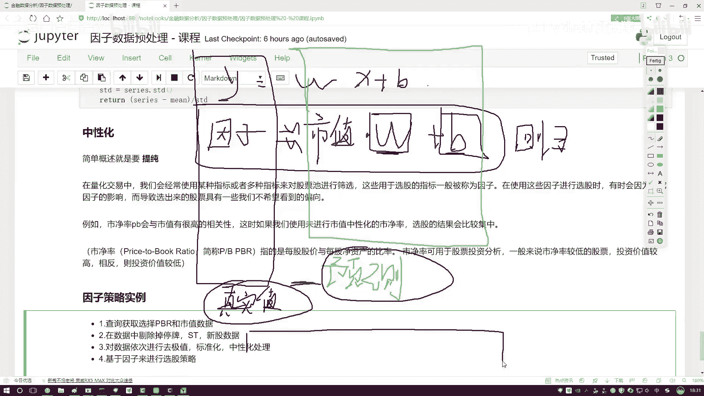

画这个图当中是不是这样，我说现在啊有这个啊，重新画这个图，在在这儿来画吧，在这画也行，就是在接下来这画得了，换个颜色。

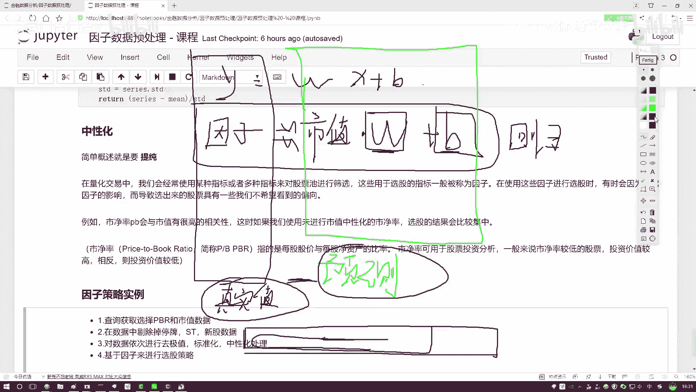

我说这个图啊，它本来是个红色的，然后呢是指解释了其中蓝色这一部分，那它们的差异代表什么差异，在哪儿啊，是不是我现在画圈的这一部分。

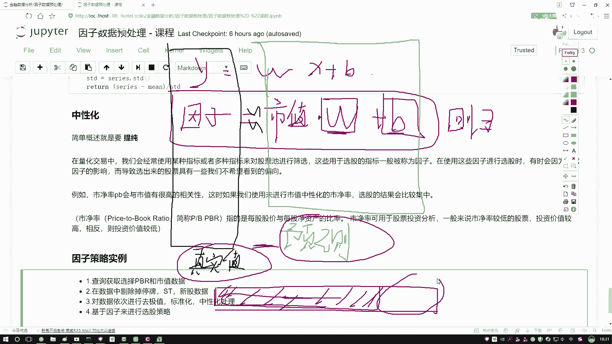

这一部分代表着我当前的一个差异啊，什么意思啊，真实值和预测值之间必然存在一个差异，这个差异就是市值，你解释不了因子的那一部分，可以吧，说白了回归范围当中我们建立了一个联系，建立联系的意思。

我就找到了市值在因子当中多大的一部分。

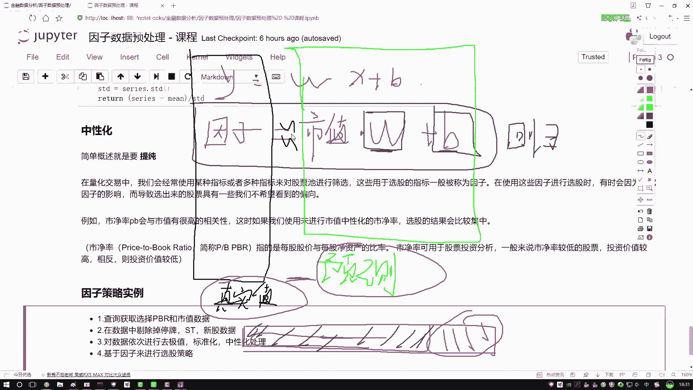

或者说市值能解释因子当中多大一部分，一旦我做一个减法，用真实值减去我的预测值，我能得到什么，是不是就是我想干的一件什么事儿啊，就是提纯的这一件事儿吧。

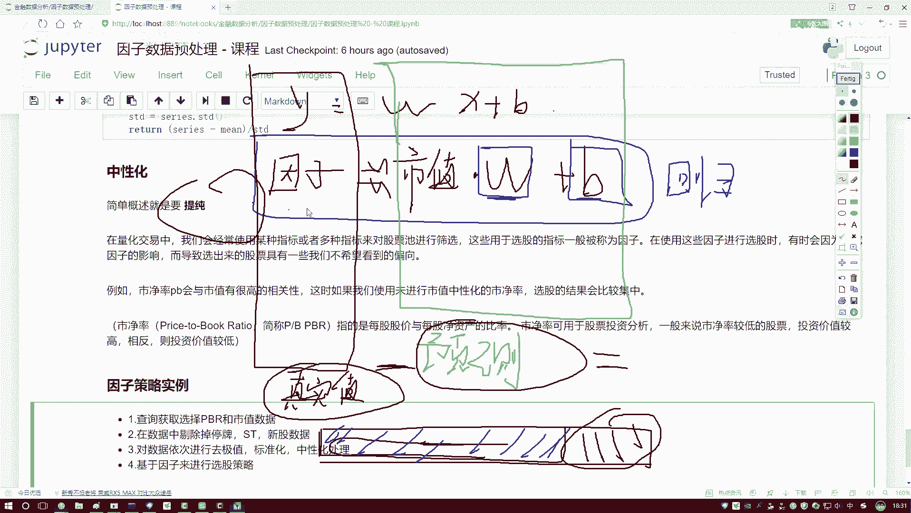

好了，咱们来总结一下，一会儿我们该怎么去做，第一步好，我们要建立回归方程，建立回归方程的过程当中啊，一定要注意诶，谁当歪诶，谁当Y是把因子当Y吧，好了注意点，我是把因子当歪了啊，你想剔除谁的影响。

把谁当做一个X吧，要做这样一件事好了，第一步求解回归方程当中的一个W和B，W和B减完之后，我有了一个X，我是不是趁现在我手里有因子实际的值，用因子实际的值哎比如这个Y减去什么，你的一个预测值吧。

大家不要，大家以前如果说对机器学习不熟悉啊，你看我这边写个等号，不是说他俩就是一定相等，我是说这里要建立回归方程来，尽可能去估计W和B啊这样一件事，所以说现在我给大家解释了一下，咱们该怎么去求。

那一会儿呢，中心化的做法都为大家现在也猜到了，第一步建立回归方程，第二步呢用回归方程当中的真，就用回归方程得到的结果被谁捡去啊，被你的一个因子实际当中值减去，这相当于在因子当中刨除了哎。

我一些我的跟其他的呃，就是你想刨除掉的哪些对你有影响的，这样咱们做一个减法得到，剩下的是不是就是因此实际该有的一些信息了，我们把这个过程就叫做一个提纯，说的挺复杂呀，哎我天说的是不是挺复杂。

但是其实做起来是不是挺简单诶，就是在我印象当中减去啊，不能被你当前的一些指啊，比如说比如说在市盈率当中减去，不能被咱们的一个市值所解释的那一部分。

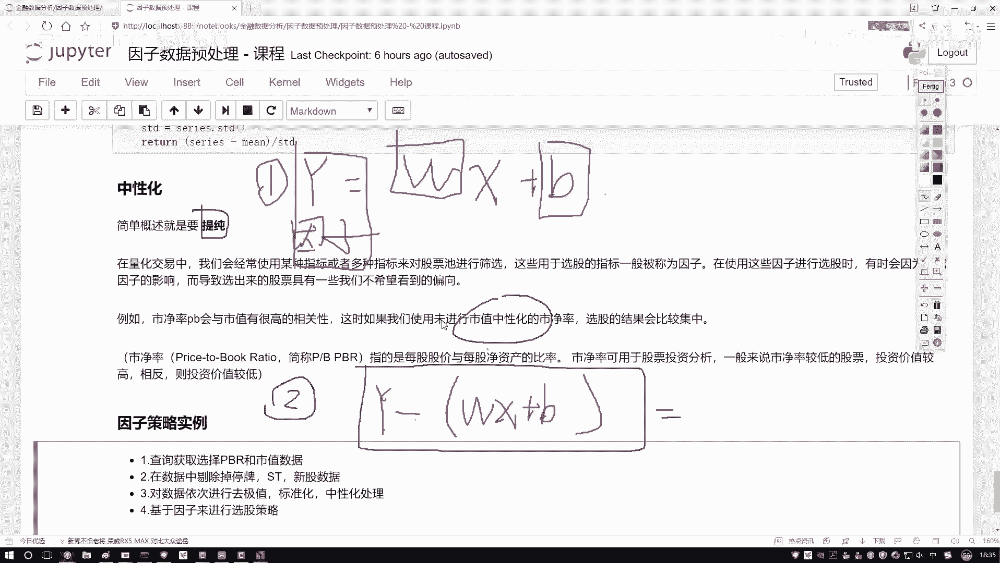

剩下的就是我要的一个存档，这个意思啊，说的有点绕，大家自己来理解一下。

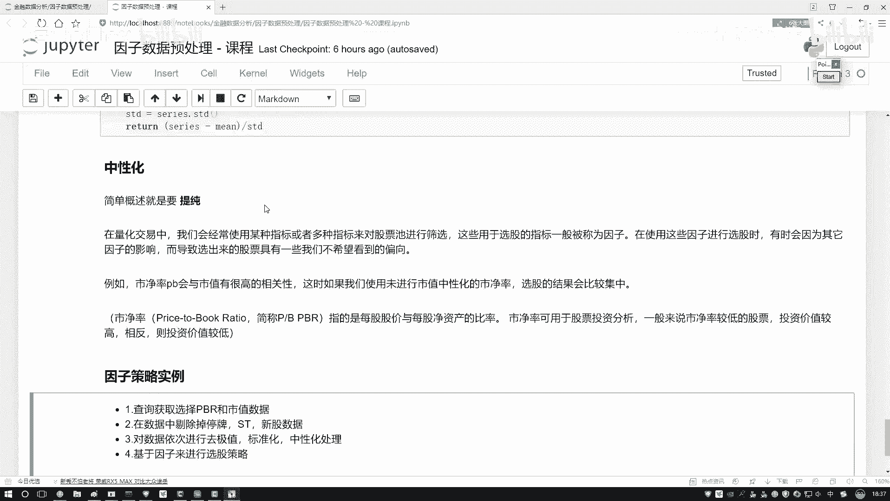

看一看是不是我们说的回归方程诶，这样一个意思行了。

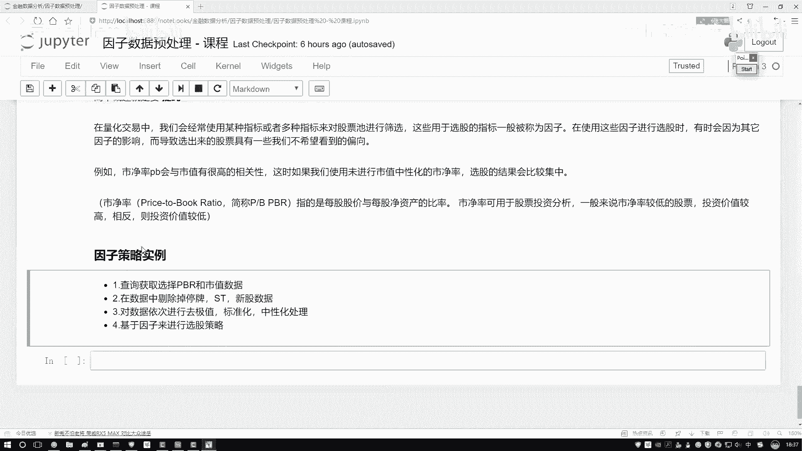

最后我们要做一个因子的一个策略啊，现在大家说一说呃，咱们这个策略啊。

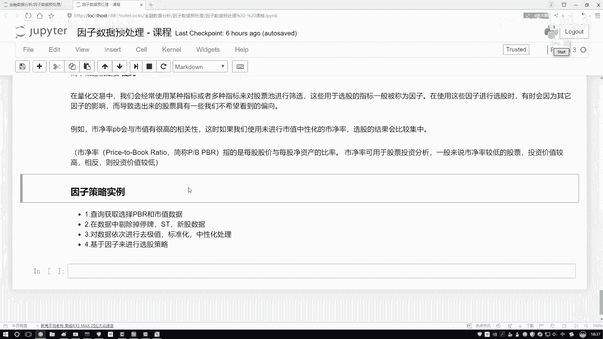

然后要怎么去做啊，是这样一件事，我先把这个过程写完，一会儿呢咱们来写这个策略。

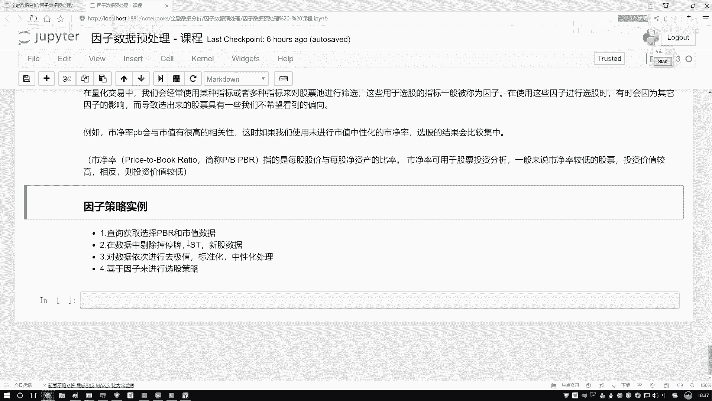

不是这样，现在既然我们提到了啊，有两个指标，一个PPR是吧，我们的市净率还有个市值行了，把他俩指标先拿出来，一会儿你不是要干什么吗。

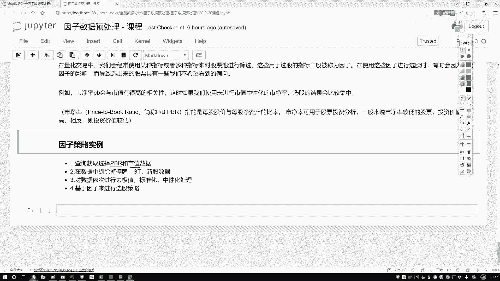

你不要去玩这个那个什么中中心化是吧，哎咱一会来这两只来给大家举个例子啊。

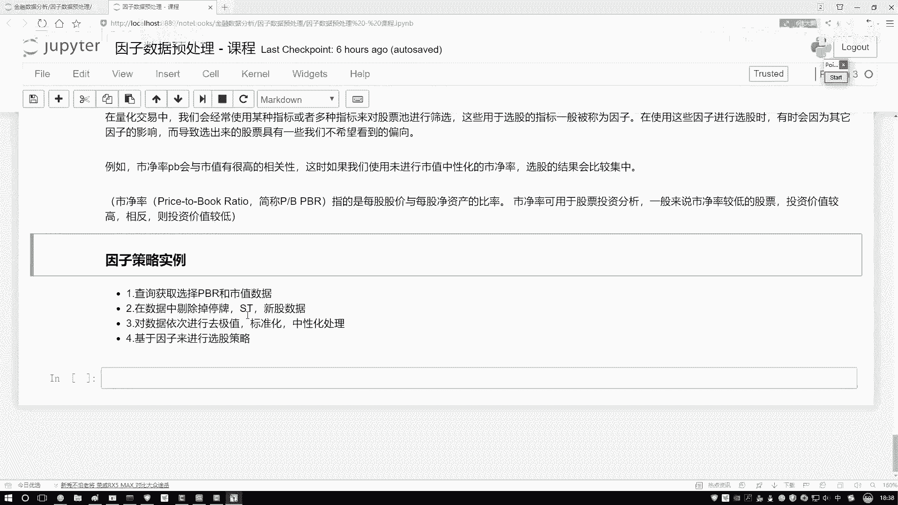

然后哎对这里我说这个中心化其实忘了说一点，我们现在说的是什么因子要做中性化吧，其实在实际一些量化当中啊，不光因此做这做这个中性化，一些行业是不是也能做中性化啊，其实能做的事蛮多啊。

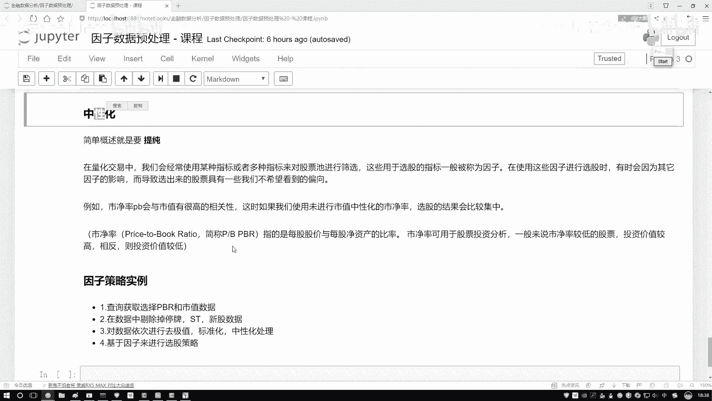

这些咱先不给大家做延伸啊，大家后续可以自己去看资料，能做的东西还蛮多的。

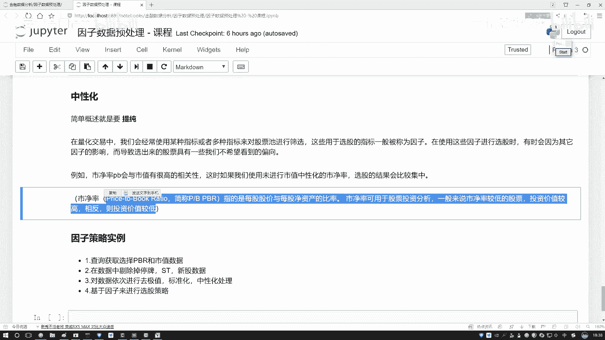

咱就先拿因子来给大家举个例子，在这个pr和事实数据我先拿到手的一些指标，然后呢在数据当中啊，我要做一个剔除的操作啊。

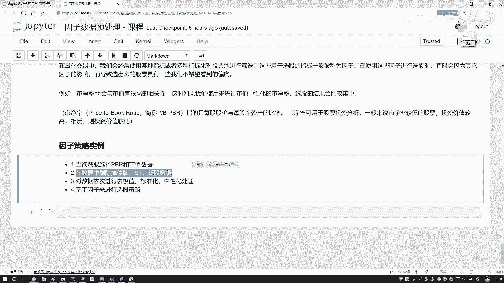

比如说现在股票池里边，我要剔除一些我不喜欢的，或者说剔除一些垃圾吧，什么垃圾啊，停牌的呀，s st股啊，还有一些新上市的呀，比如说小于半年半年之内上市的，我可以先都不管，剔除掉一些我不想要的股票。

然后呢依次对我们数据要做处理，哎，按照咱顺序啊去极值啊，标准化中性化，然后我们处理完处理完之后呢，我们要做这样一件事啊，考虑干什么，基于我处理后的结果来去选股了。

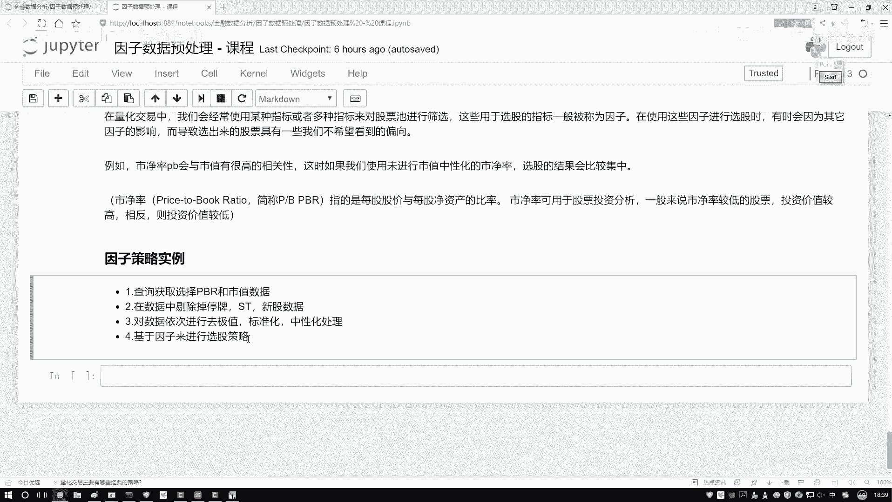

比如说现在我说这个市净率啊，我说他现在小于0。2的，我认为是我比较喜欢的，我说把所有小店R结果也拿出来，基于这个策略来选股是不行啊，说白了就是一个基于因子来去选择，股票池当中啊，哪些我要买。

哪些我要卖啊，这样一件事，这个是一会儿啊。

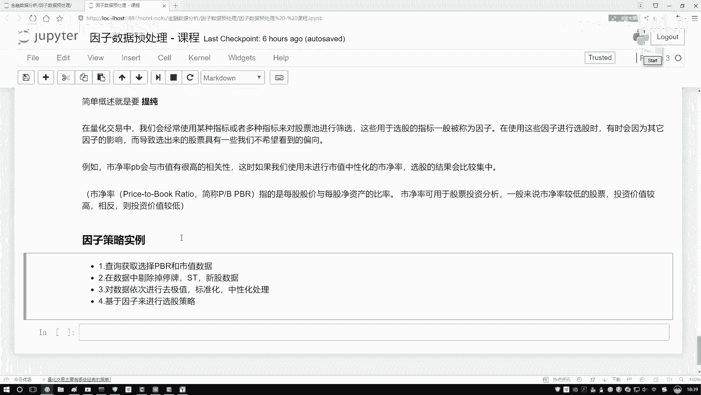

咱们要完成的一个任务啊，中心化，咱在这个策略当中给大家一步去写吧。

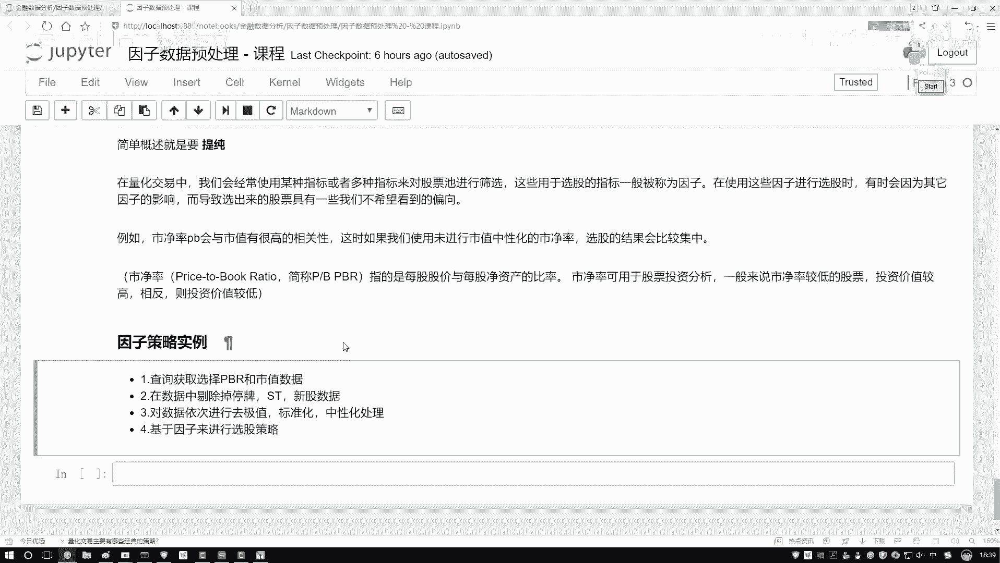

萝卜当中咱不看了。

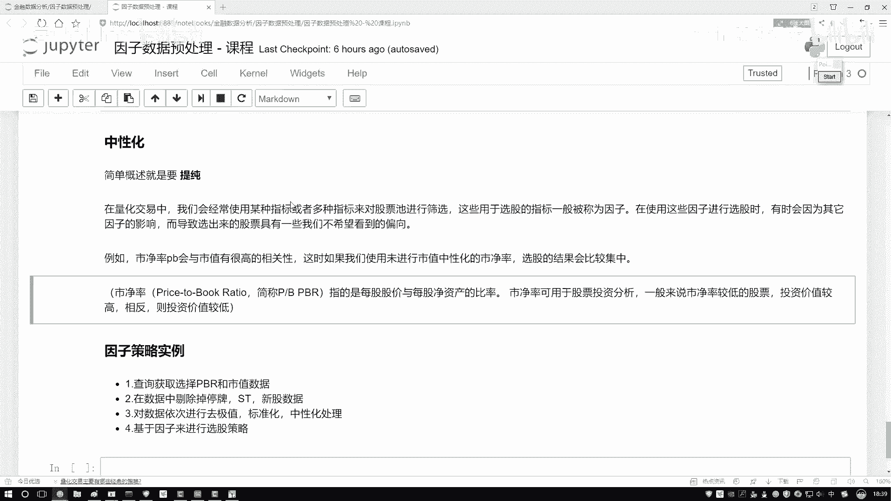