# 【量化交易完全可自学教程】2024B站最完整的Python金融分析与量化交易实战教程分享！知名博士通俗易懂的解释，学量化交易真的不难！ - P76：24. 23.25.2-基于百分位去极值实例P25 - AI知识库 - BV1YT42117B5

接下来咱们要完成这样一个操作，我说现在这个数据啊，它的一个范围我就不管了，我说现在那Q1我们能算Q3，我也能算，我说小于这个Q1的，那就都等于Q1吧，大于这个Q3的，咱就全等于Q3，不行啊，相当于数据。

你给它规范到一定的范围当中吧，我们要做这样一件事好了。

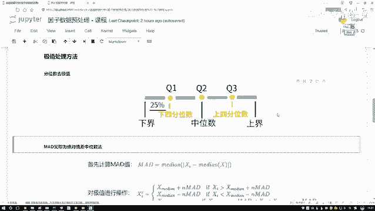

咱们来看一下吧，怎么样去做，首先我先指定列名啊，对哪个列执行这样的操作。

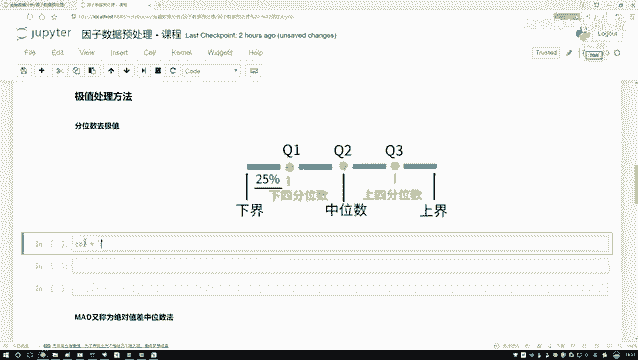

我随便选一个，咱们只是举例子，也不选什么因子了，随便选择一个列好了，别选了，那接下来我说要写个函数了，这个函数啊帮我去做了，我们当前的一个过滤操作，会操作谁呢，是不是说我们现在啊对我的这个极值来去执行。

咱们当前的一个按照什么百分比吧，其实这里啊，我说的是一个按照一个Q1还是Q3，那你说按照一个别的百分比，咱能不能去做呀，是不是也行啊。

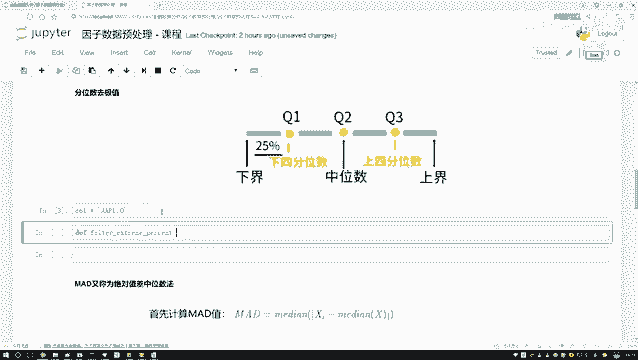

哎这是我们写的函数，在这里我们要过滤，那一会儿呢我会传下数据啊。

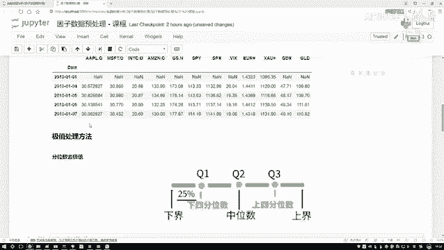

数据这是一个data data当中我们选了一地，是不是选了一列啊。

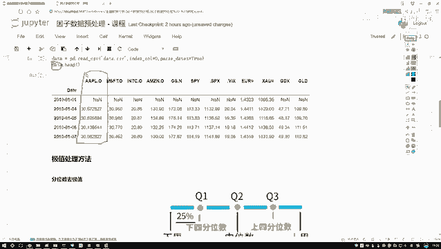

一会儿那一列是什么一列，它是不是一个series结构啊，所以说我传进来的就是一个series，然后呢你还得告诉我什么，哎哟你的一个最小诶，你想保留的是一个百分之多少呢，可以比如说这个Q1拿25%可以吧。

一会你可以自己改这个参数，然后再来个参数，我说最大你想保留多少呢，这个任务当中，咱是不是就是一个75%吧。

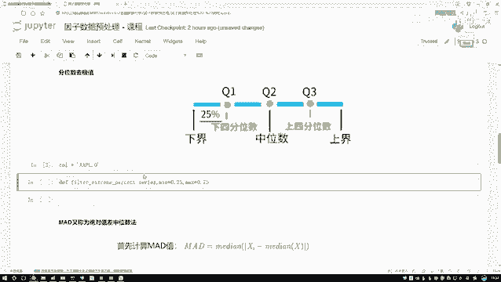

好了，在这里我们来写一下写吧，第一步干什么。

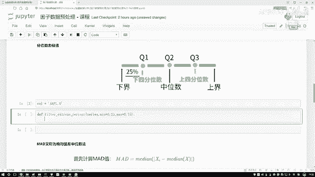

哎你说数据，你看一开始数据啊都是有大有小，有大有小的，不一定吧，那你说当我们去做这个中位数的时候。

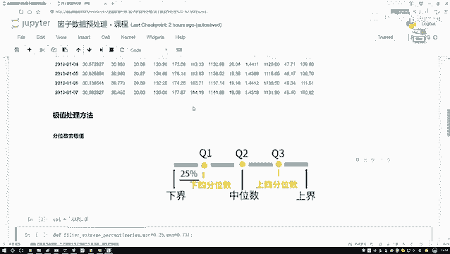

那数据怎么样，那是不是得按照从小到大。

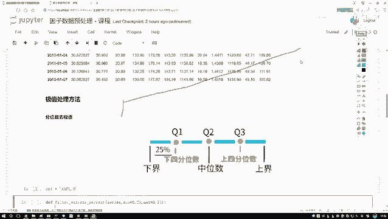

你得做一个排序啊，所以说第一步，咱们要对数值来完成这样一个排序的操作，因为只有你的一个排序完了，你才能去算诶。

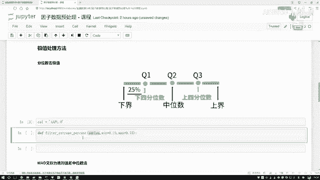

中间那个是哪25%是哪，75%是哪吧，好了，对我来说，我说呀，我说对他做一个排序，sort value一下SVALUES，那就默认它就是一个从小到大排序的THEOS，等于它当前的一个排序结果。

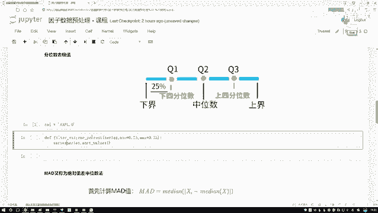

这个是我对咱们当前这一列数据啊，重新做排序了，重新排序完之后啊，然后你是不是得告诉我哎，现在你这里边，你只给我传输一个，25%和75%，哎我说我是不是得知道啊，这个25%是等于哪个数啊。

75%是等于哪个数，我一会儿好做对比诶，小于这个数的都得这个数大于那个数的哎，都得最就都得那个大于那个数，是不是，我得把这个最小和这个最大两个数算出来的吧，行老师这里啊，咱说我现在有一个Q吧。

Q就是我的一个哦，这里边存的就是我一会儿的一个，最小的和最大的好了，把这个series s拿到手，唉这里咱可以直接有个函数啊，帮我们去完成这样一个计算的操作，呃，挺简单的，就是在这个panda当中。

很多函数都可以直接用起来，这个函数意思是这样，就是当前啊你往这里面输进来了一个序列。

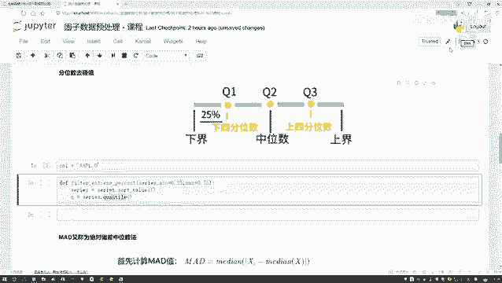

然后呢你跟我输入了两个参数，比如说你输入一个0。25和一个0。75，他有实际帮你算一下哎。

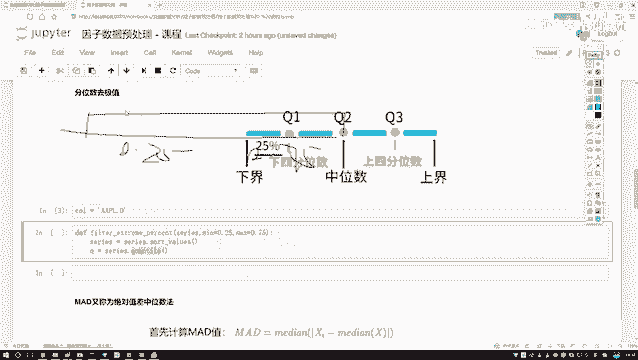

在这在在这个Q1和Q3位置，它的值分别是多少，所以这块我把这个最小值一个哎，这块儿里边里边你传进来，就是传进来的是一个list list当中，你说你要把数据当中你算哪些个值，我说算最小的ADR5。

这个再算一个最大的0。75。

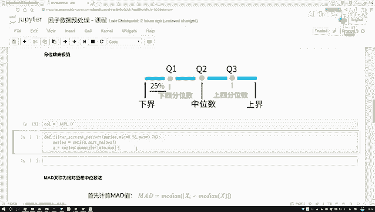

这个行了，然后呢我说我写一个返回值吧，现在我是不是个最小有了最大有了，那接下来我是不是说得对我数据干什么了，做一个规范吧，这个南派这个函数是这样一个意思啊，就是呃这里边比如说你现在有一个呃。

133579，然后十一十三吧，然后这一块你要创建三个参数，第一个参数就是你这个序列啊，像咱们直接一会把这个series创建就行，然后第二个参数就是你希望这个序列当中啊，一个最小值是多少，一个M。

然后第三个参数就是你希望这个序列当中，最大的一个值诶，它是多少哦，我们要写三个参数，然后比如说你最小值它是等于三的，最大值是等于一个11的，那它会返回什么，返回的也是一个序列啊。

只不过这个序列我拿来策划这个序列，它就变成这样了，你看第一个值小于三吧，会变成什么小于三的哎，都变成三了，只有三三，然后2357页11，最后什么也是一个11吧，啊相当于把所有数据啊做了一个规范在这里诶。

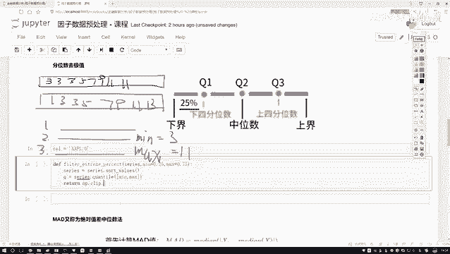

我们有三个参数，第一个参数我的一个series啊，我们当前的这个序列，第二个参数呢在这个Q当中啊，它会有两个返回值啊，反位置，第一个就是它的一个最小，因为这个序列当中我不是传进两个吗。

所以说它里面就会有这么两个值，那最小值我LC一下，它就是一个零是吧，要接下来Q再点IOC下，然后第二个值最大值它就是一个一好了，这样我们就把当前这个函数给他写完了吧，相当于哎我们第一种方法。

这个方法呢按照我传进来一个就是一个series啊，一组数对这组数啊，我选了哎最小多少，最大多少，然后呢，你按照我当前这个比例，把我的数据做一个规范啊，这样我们就可以完成一个去极值的操作吧。

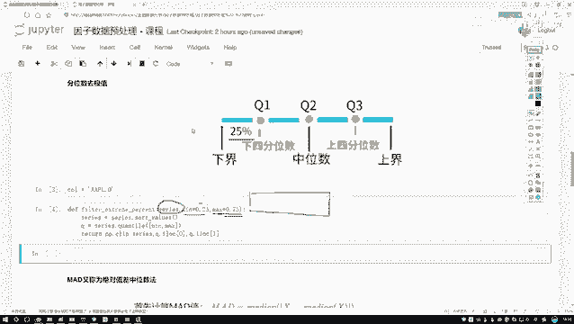

好了，这里啊咱们先把我们的一个函数给它写完了。

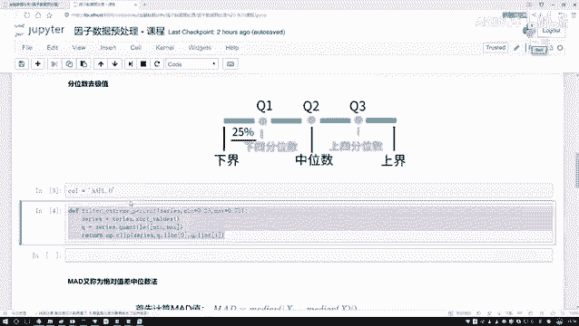

这个代码啊，咱们是写完了，那接下来看一看它去将极值的一个效果吧，在这里我们来去执行一下，执行这个函数，然后呢就这个函数就都有数据做操作吧。

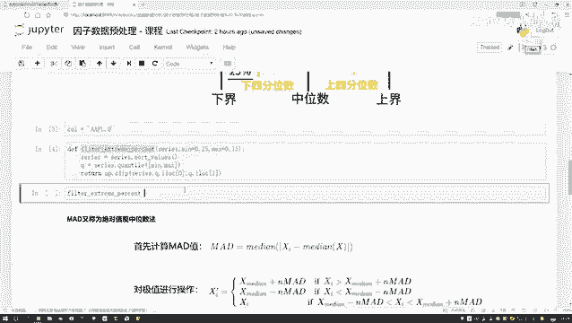

然后我数据就是啊咱直接写吧，数据就是data对数据当中的某一列，我把这个列名传进去啊，这就完事了，这样咱就完成了一个基本的按照百分位啊，去一个啊去极值这个操作行了，那我们去玩了一个极值诶。

咱们给他指定一个返回值，对于这个返回值来说呀，那咱们来给它画图看一看啊，现在这个结果它能长什么样子。

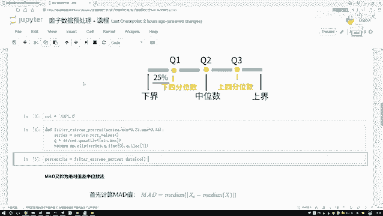

呃，换一个图就是点一下好了，这里我说啊，哎直接对我们这个结果吧，哎直接对这个结果对我当前的这个结果，我说给他点一下，普通投完之后诶，这是第一步，先做一个哎呀，这样不行，这里边我们得画两个图。

一个是原始的。

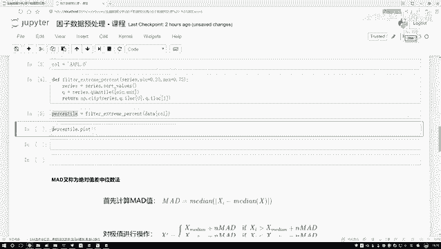

一个是咱们做完之后的吧，好了我们就画两个，第一个就是一个原始的原始图啊，就是原始的一个数据，我去点一下数就行了，然后一个新的，就是我刚才做完了我的一个规范之后。

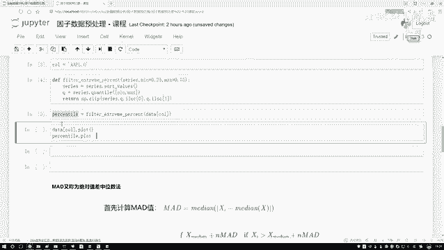

咱们再点一下看一下吧，呃看这个结果有点奇怪，我们来检查一下，没有什么问题啊，第一步在这里，我说我是对我们当前的原始数据啊，做了这样一个操作，第二步呢是我现在啊执行了一个规范化之后。

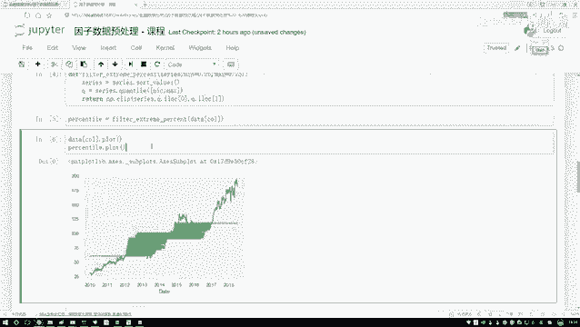

然后对我这个数据咱又执行了一个操作，从这个图上来看，基本上就是逻辑上没有什么问题啊，因为他已经把他的一个范围给大家画出来了，但是这个呃它会有一些重叠，这个重叠看起来不是特别好看。

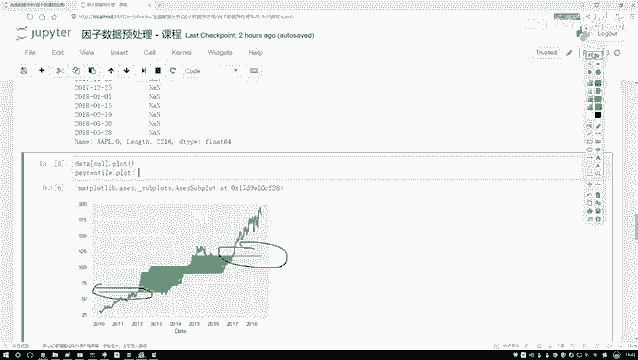

这样吧，我在把这个放到下面，把这个放到上面给它加顺序。

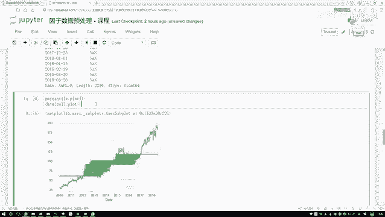

这样大家能够看的会更明显一些，他就是说呃这块它出现了一些什么唉，它有一些比这个当前这个值可能是60左右，比它小的，那应该等于是个蓝色的，这块呢有些大的，有些大的应该等于什么。

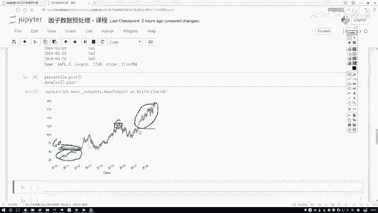

也应该是等于蓝色的，这个是给大家先从图上，咱简单点就行了。

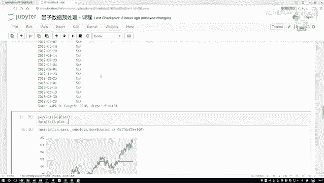

主要是说哎咱们的一个流程该怎么去做啊，这我给他打印了一下，给他删掉行了。

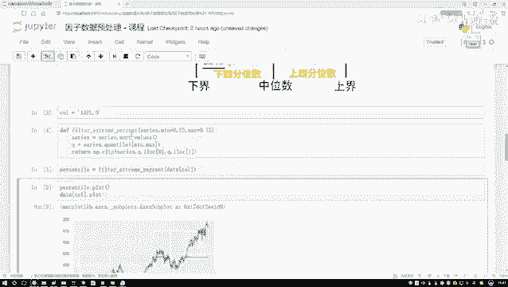

这样我们完成第一步就是我们的第一种方法啊，在极值数据当中。

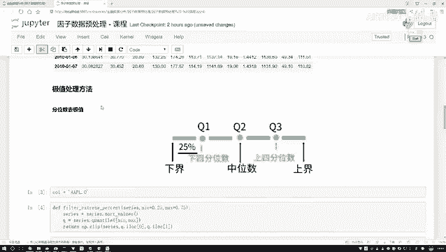

怎么样根据一个分位数去去这个极值，可能在实际操作当中啊。

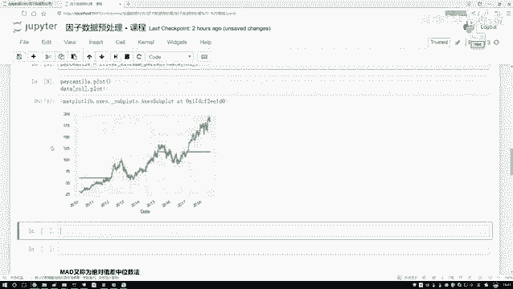

啊不可能说你指定个这么大一个值，0。250。75，这个相对来说有点太大了，你把绝对多数值都当做是一个异常点了，可能在很多印子当中啊，我们可能什么样，0。025，0。975是吧。

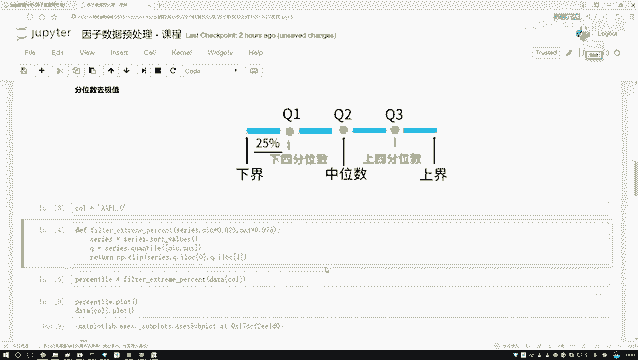

这两个值可能是会更常用一些，但是我们今天例子点为给大家展示的明显一点。

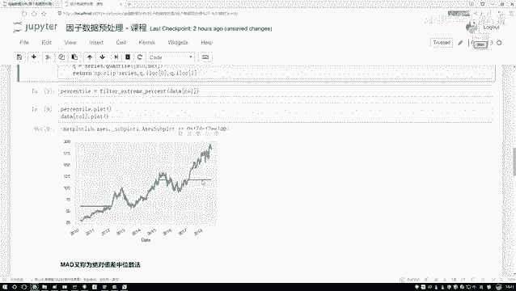

所以说啊我把这个值可能在有些地方在于它啊。

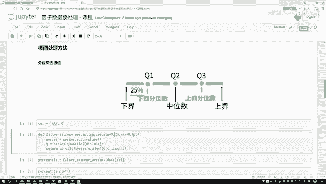

稍微的放大了一点啊，大家明白这个意思就行，实际当中我们的范围应该会更小一些啊。

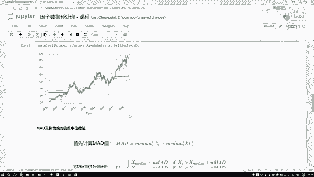