# 【量化交易完全可自学教程】2024B站最完整的Python金融分析与量化交易实战教程分享！知名博士通俗易懂的解释，学量化交易真的不难！ - P85：33. 32.34.4-股票池筛选P34 - AI知识库 - BV1YT42117B5

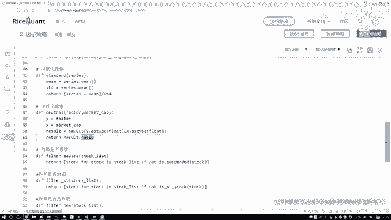

好了，那咱们现在就是这个中性化操作，我们也写完了，在这里回头来看一下吧。

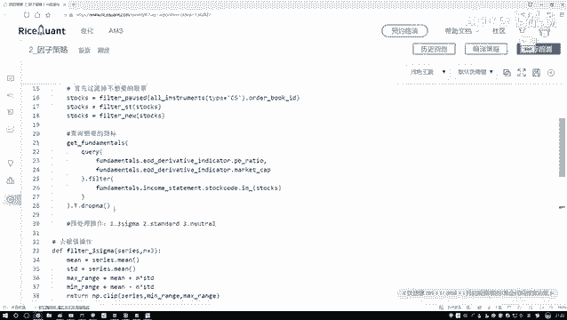

现在我们是不是在这块就可以去执行诶，咱们刚才写了几个操作了。

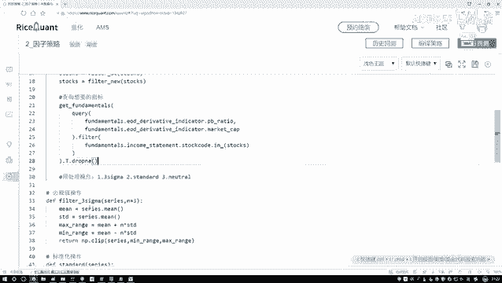

好了一个来执行吧，啊在在在这里啊。

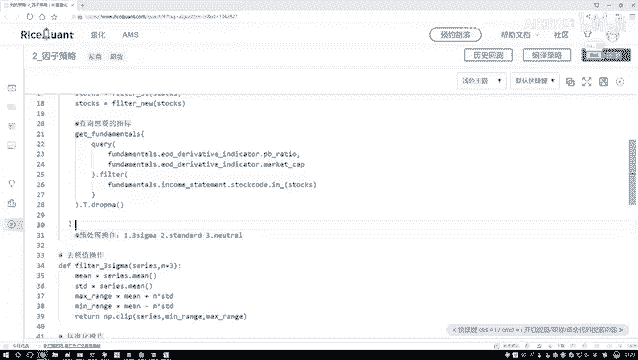

改写了预处理操作，预处理操作当中，咱们来写第一个，第一个就是咱们去啊做一个SC格码，30码当中我们要传进来什么，哎对谁做呀，哎对我的设置做还是对有因子做啊，对因子做吧，好了，把我们的因子拿到手呃。

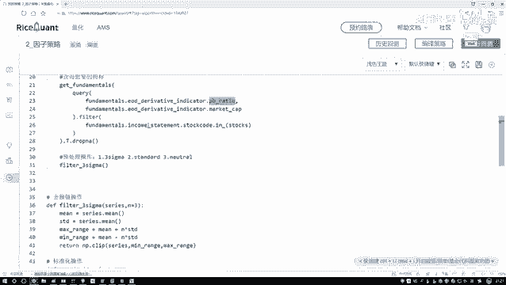

这里边这里边的一个结果还没有个返回值，我给他个返回值吧，在这块哦，我说咱们现在得到一个返回值，把它复制过来。

把它复制过来，放MAL呃，fundamental当中，它指定一个名字吧，Fundamental，然后做data frame就行了，然后在这个data frame当中就有我们需要的啊。

我们想要的这个指标了，好了，把它拿过来，Fundamental，然后对其中谁操作呀，是不是咱们之前写好的，我们当前的一个试镜，试镜这个东西好了，把它传进来，然后这样咱们做的第一步就是我的一个啊。

去我们的一个离群值确立认知之后啊，然后咱们写一下吧，就是现在呃现在我这个指标就是没有什么，没有我的一个极值了，咱们现在做了一个没有极值的，做完没有进去之后还没完，我们还得再做什么。

是不是说再做下一个操作，做一个标准化的一个操作呀，好了，把咱们当前这个结果传进去，下面我做了一个标准化的操作，相当于呃相当于一个标准化的操作，就是这个东西吧，直接把它拿过来，然后再点上一个DDER呃。

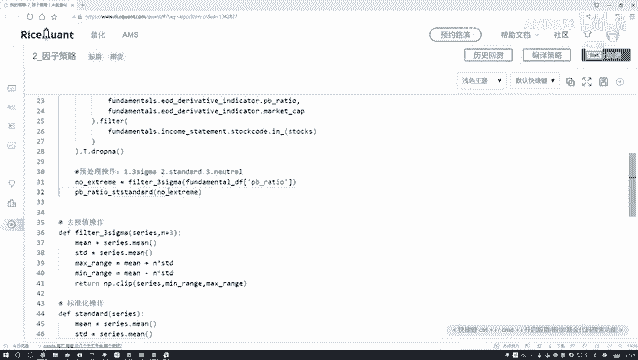

DA等于当前的结果行了，这是我做了一个标准化的一个操作。

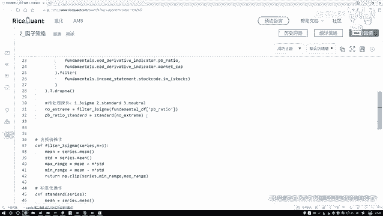

做完咱们的标准化操作之后，接下来还有什么，还有一个中性化操作吧，好了再给他复制过来。

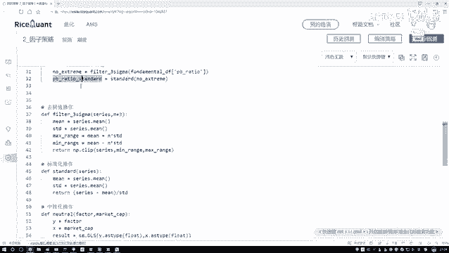

在复制过来之后说他就叫这个名字得了，他就就叫做预处理完之后杠这个东西。

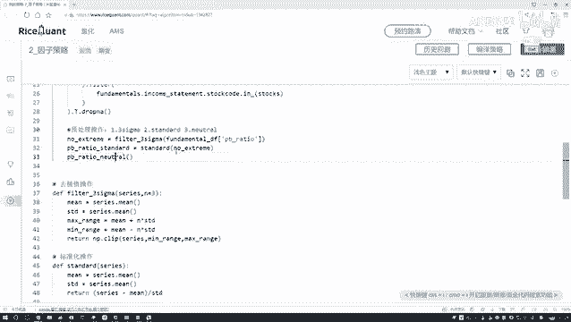

然后等于咱的这个结果好了。

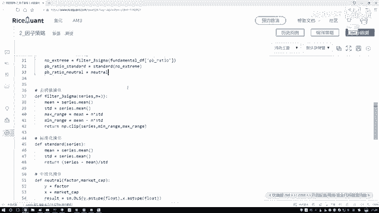

等于我们这个结果，然后把上面这个值再传进来，是不是就可以了。

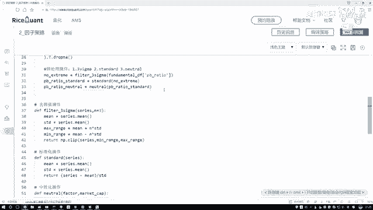

那现在我们就完成了，咱们所需要的所有的预处理操作了。

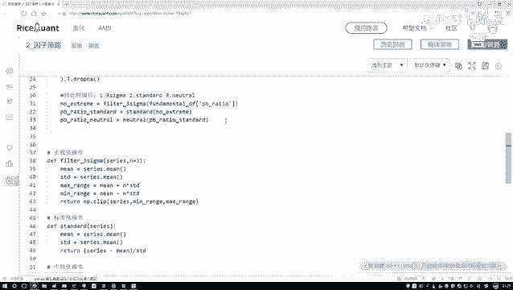

那接下来呢那接下来是不是说我现在啊哎呦，我要对这个因子做一些筛选了好了，咱们来指定一下哦，对因子啊，不是对因子基于因子啊，对池子对咱们的股票池子做做一个筛选。

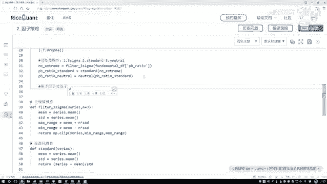

或者做一个调仓，做筛选吧，做一个筛选操作，筛选操作，咱们来想一想怎么去做啊，是不是这里哎你得给我指定一个指标啊，比如说我这个QQ当中呢啊，你说是小于这个因子是小点好还是大点好啊，咱们之前不是说小点好吗。

所以说我对当前这个指标我看一下吧，他的呃比如说从小到大就是20%的时候，它是等于多少，就是我们希望选出来前20%最小的，可以吧，还在这里我们来指定一下，切一下吧，咱们来选多少个，那我就选这么呃0。

2个吧。

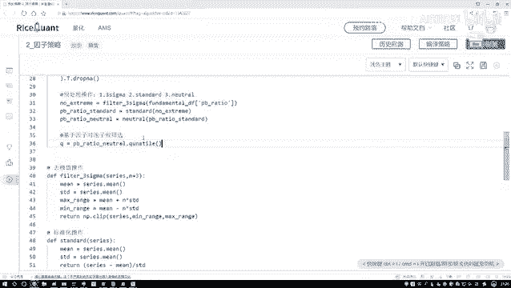

相当于选了20%，然后呢这里这是我做了一个因子策略，然后接下来接下来是不是说我要去选股了，那好了，现在我们要选股，在这个选股过程当中，我需要再怎么样，我们看一下当前当前我得到这个结果。

这个是我的一个因子。

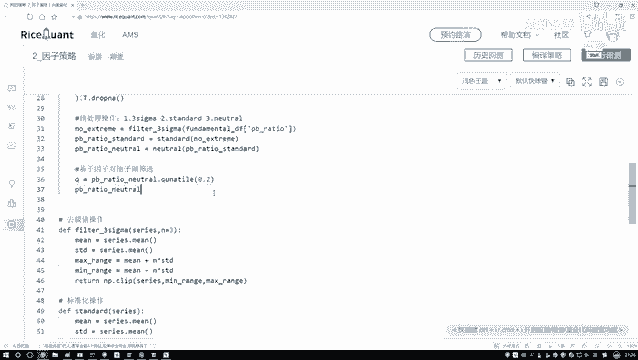

对我的因子当中，我要做一个所有的股票当中都有这个因子是吧。

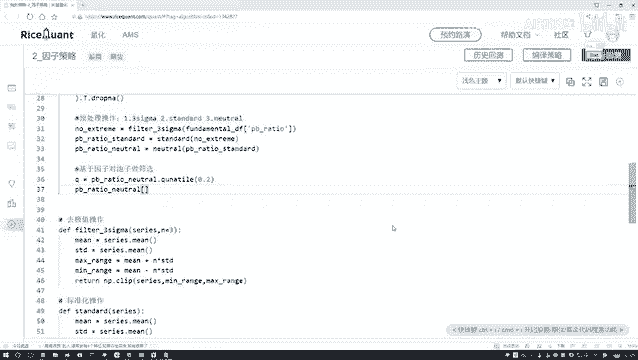

那所以说我现在可以做判断吧，做一个筛选吧，在这里哎我说现在啊如果说啊它的一些值啊，如果说他的指标怎么样，没有满足我的要求，没有满足什么，咱刚才不是说了吗。

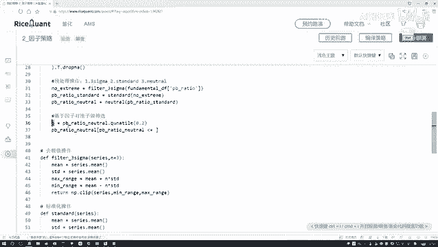

我们自己来指定一个范围，通常就是我们这个市净率啊，我希望它不是小一点的时候，能怎么样能使得咱的一个收益，或者说我们的期望收益吧可能会更大一点吧，就这里哎咱们说小于等于一个零，小于等于一个20%那个值啊。

是不是就行了，我们现在先来选小一点的那一些，然后呢我需要把这些股票找到手，点点death一下，这是不是呃，这个东西判断是基于值去判断的，趋势，判断完之后，咱们现在相当于传进来。

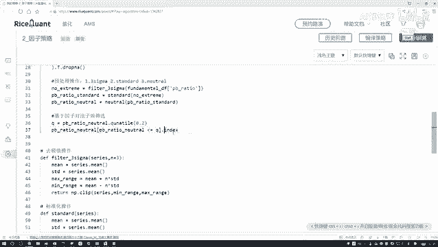

所以我得到什么所有的股票吧，好了，那这这这这是什么股票，这是不是说我这是我现在想要的这个股票，判断完的，我想要的这批股票好了。

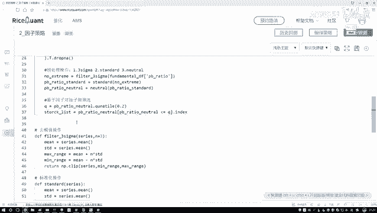

我们拿到这个股票呃，一会儿咱要对这股票做一些做一些交易操作。

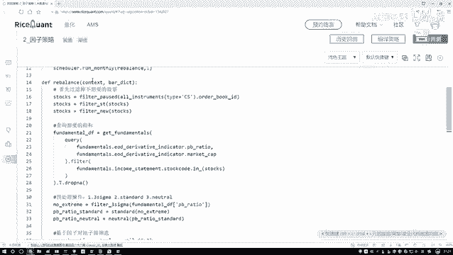

我们先把它传到这个contest当中，contest当中呃，stock list等于一下我当前的一个结果啊，这块不改了，直接把它传过来就行好了。

这是我们现在有了一个stylist，然后接下来呢就是我们要干什么。

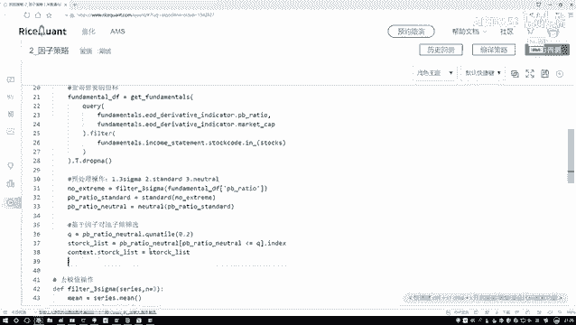

我们要执行一些调仓，还有买进买出的一些操作了哦，在这里就是我们要做买进买出啊，那你是不是说你得知道哎呀买什么，或者说你把哪些要删除出去啊，然后剩下的是在股票池子当中去选吧，那首先我得看一看一会儿啊。

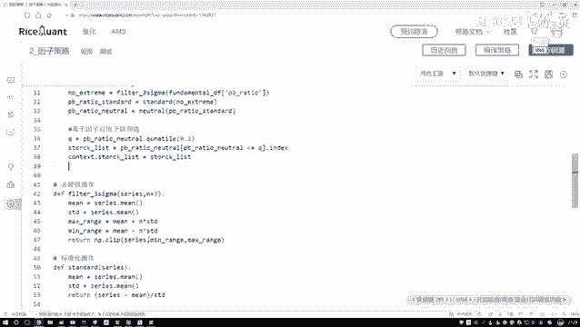

有哪些不在这个池子，我得写一下啊，删掉删掉不在当前啊。

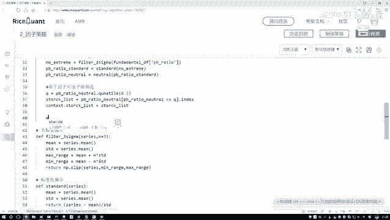

当前那个因此选中的池子中的股票啊。

咱们要做一个删除。

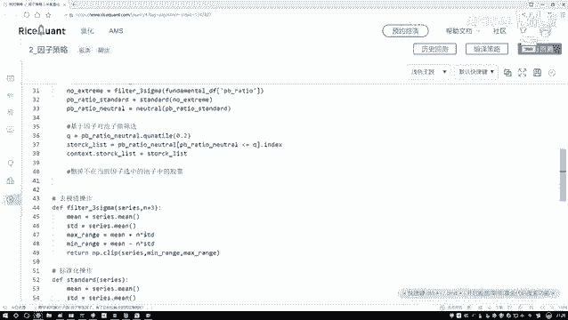

删除怎么写呢，来写一下吧，呃删除我是不是得把这些股票啊给它删一下。

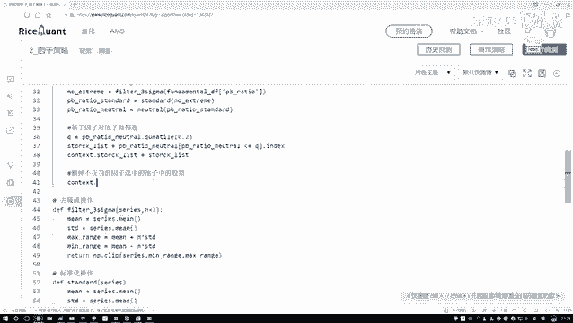

删完之后呢，我也知道你删了什么东西啊，好了，这是一个返回值，返回值啊，当中就包括了所有我要删的，那你想一想吧。

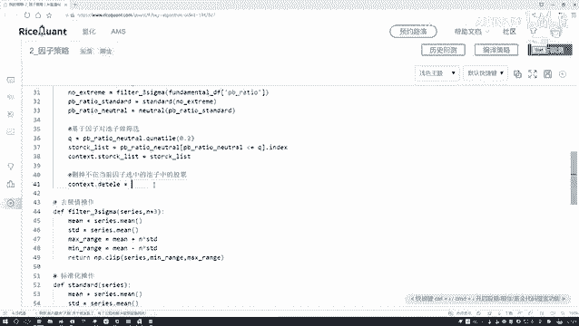

哪些诶是我要去删的，那肯定是之前咱有的啊。

并且跟我当前池子是不一样的，这个是我当前的我的一个池子吧，好了，我把它复制过来，这是我当前的一个池子，我先给它括号括起来。

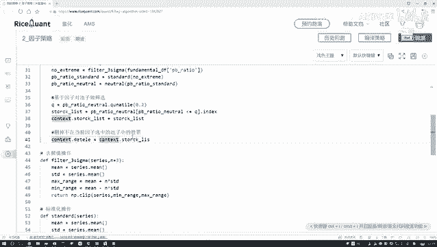

那我们要看的那肯定就是哎呀，现在手里有的股票跟我们当前池子那不一样的，我就有一个操作呃，电ff牙印C，操作好了。

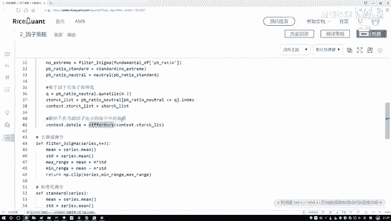

这是对谁啊，是不是说现在我手里有的这些那好了，那我们先拿到手里有的吧。

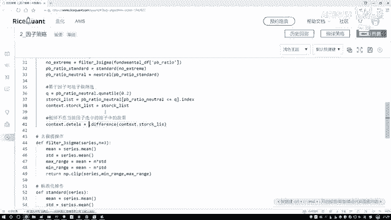

这块咱们还在写一下，就是拿到拿到手里。

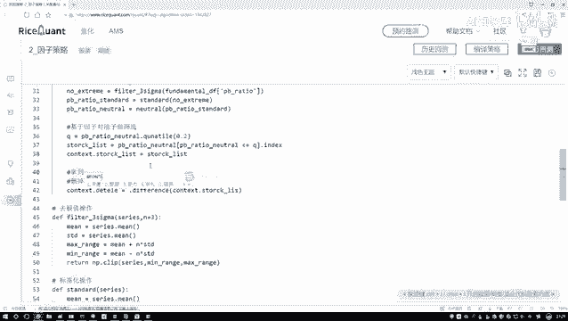

有的拿到手里，有的咱们也指定一下，在这个context当中把这个不用复制上面的。

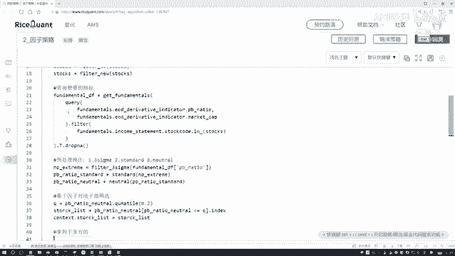

咱这也有在这个context当中，我们要找谁呀。

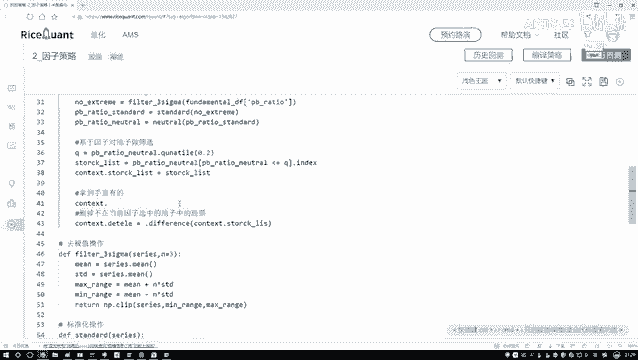

是不是找我们现在哎，我的一些账户的一些信息啊，在账户信息当中我要看什么。

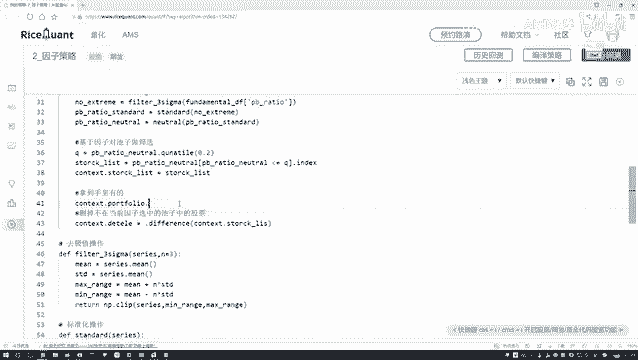

我持有什么东西吧，position诶，没有啊，这是position，找一下呃，看一下，在我只有这是一个IO是吧。

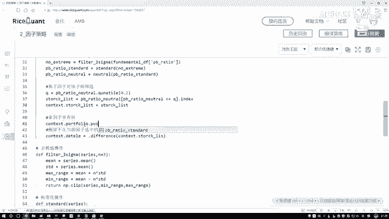

哎没什么问题啊，他怎么没有这个东西，position再试一下吧，一会看一看这个API有没有问题。

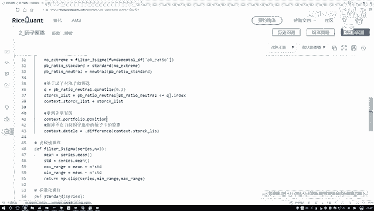

有问题的改，我记得他是一个positions好了，这是我现在手里用的吧，咱这也拿到手啊，然后这个名字这个就是我的一个context点儿啊，咱们最后一次手里有的啊，咱指定一下。

我们最后一次手里有的这些个股票吧，就叫做这个股票得了好了。

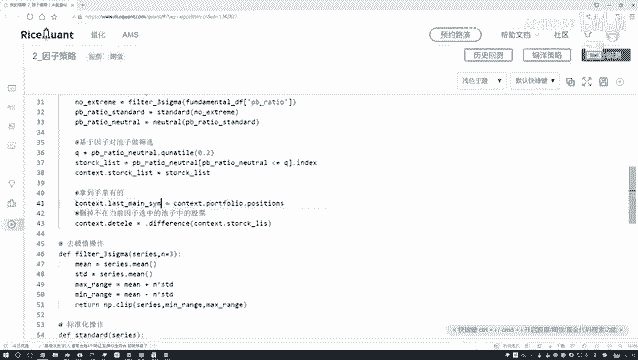

然后呢，我是不是用现在手里有这个东西啊。

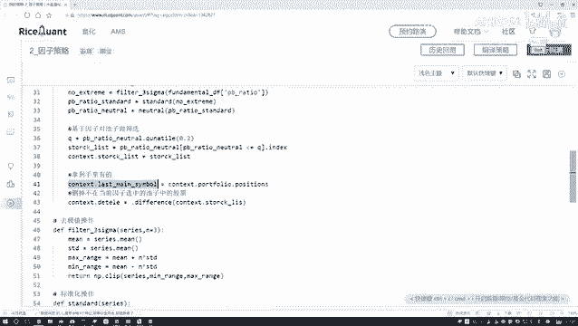

跟我当前池子的诶，跟我当前这个池子的做一个判断。

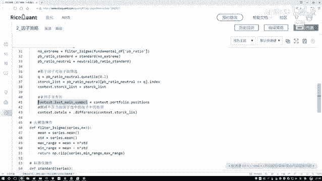

判断完之后，difference什么意思啊，那就是说当前你手里有这些股票。

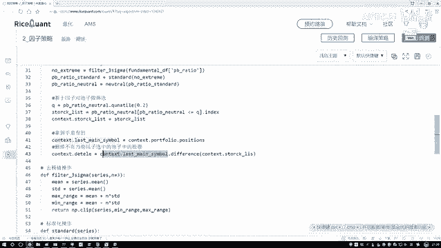

不在你池子里边的，哎这是difference吧，咱把这些股票给他拿到手吧。

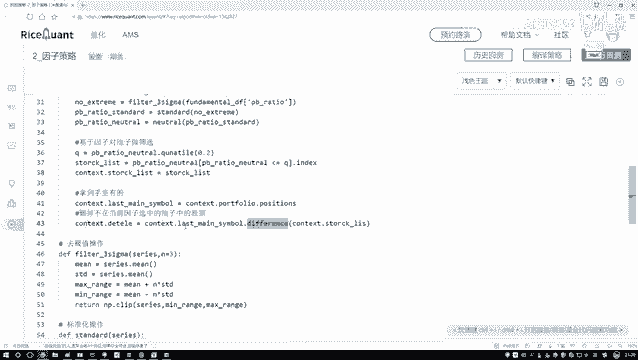

啊是这个意思，然后这个这个我把这个前面就得给他复制一下，好了就完事了，这个就是咱们当前啊完成一件事好了。

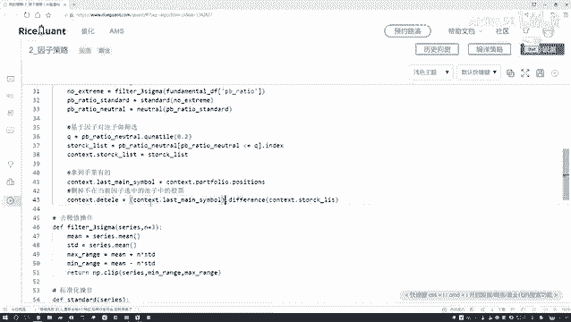

来点set一下吧。