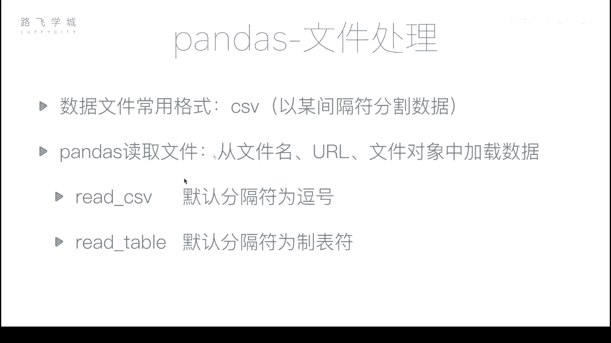
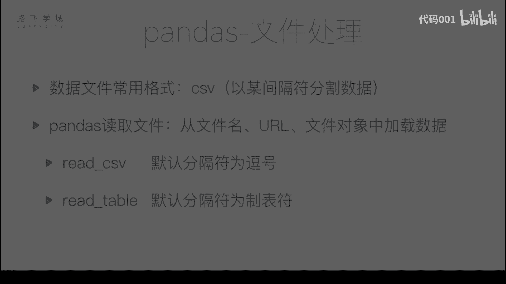
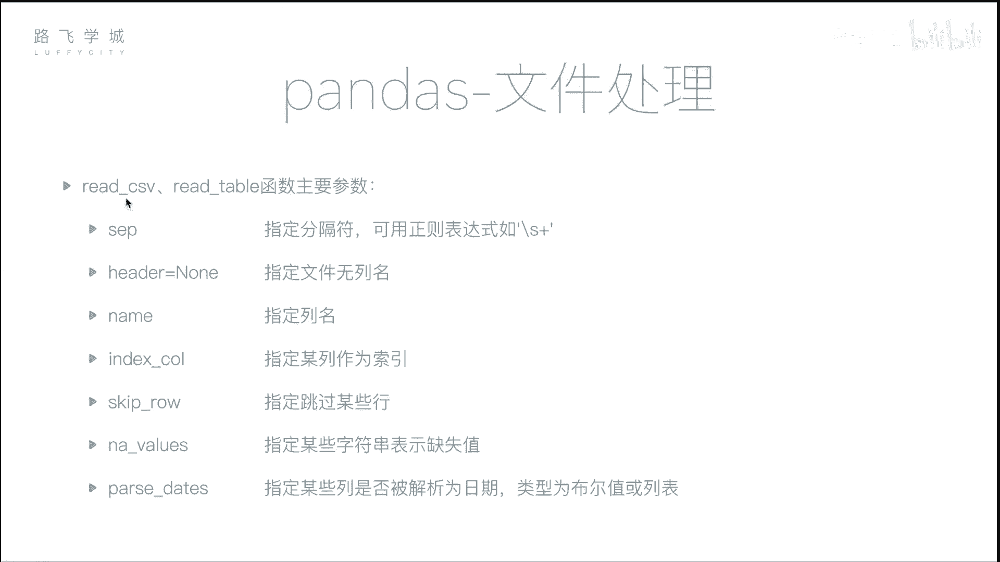

# 【量化交易教程】全100集（完整版）清华大佬耗时一月讲完的系统python金融分析与量化交易实战课程，包含基础教程，进阶学习，项目实战案例讲解，存下吧，比啃书好 - P29：30 文件读取 - 代码001 - BV17563YeEAE

好同学们，到现在为止，我们的pandas as的一些功能方面的啊，就是包括我们怎么样支持灵活的操作，怎么样数据对齐啊，包括我们的这个缺失数据处理，什么时间序列等等，都讲完了。

我们还剩最后一部分就是文件处理啊，因为我之前说过，我们的在日常我们的编程中，并不是说呃，我们都是手动的输入一些data frame对象，来创建一些简单的我们需要的真实的数据。

那这些数据我们一般存在文件里不对，那我怎么样通过啊，文件来读取到文件的这个数据，和像文件这个写数据，那最开始我们讲到了这个数据文件，最常用的格式是CSV，啊CSV数据的CSV文件其实就是一个文本文件。

它是每一行逗号隔开啊，逗号隔开就是一个相当于是一个单元格，就相当于我们的excel的一个格子，把一个逗号隔开，两个逗号之间的部分，就是一个格子里存的数据好，那read csv这个函数啊。

就可以把CSV文件的内容读取进来。

好我们来看一下，这里有一个文件，啊这是我下载的啊，某号股票在从这个07年3月1号，一直到一到17年2017年11月左右啊，比较长，11啊，11月10号的所有的行情数据啊，它有一些他这些列，还有一些列。

它的列分别是，第一个是序号啊，第二个时间开盘价，收盘价，最高价，最低价，这是成交量和这个股票代码，当然股票代码都是一样的，好，那我们现在用read csv文，这个read csv函数把它读取进来。

pd点read csv函数，什么参数都不加，直接读取进来啊，不可能什么参数都不加，你要加文件名，好我们可以看到首先读取键啊，大部分数据都读进来，没有问题啊，他有人同学想问，可能这为什么换行呢。

是因为它这这相当于他认为这些行太多了，他这一个斜杠表示就在下边输出了啊，他把这一列单独输出在下边，好我们可以看到，但是虽然读取进来，但是有几点我们不喜欢，比如说第一点。

你看我这个0123456本来是读取进来的，对不对，但是他又给我创建了一个0123456，789十，拿这个作为索引，它把我的0123456789十，读成了一列一列，而且因为我这个0123456789十。

最上面那个格是空的，大家看到了，这对他给起了一个名叫安name的零啊，那如果说我想指定某一列作为什么呢，作为我的行索引，那怎么办，那这里就是有一些参数了啊，Index c o l，等于D0列。

如果等于零，我们可以看到它会把第零列，也就是就边上那一列当做索引啊，你可以传数字，也可以传列名，当然零列没有列表，所以我们只能传数字，比如说我传date，是不是我们把时间作为。

把它的日期作为索引更好一点，嗯好我们可以看到选择date的话，那这个date这一列就作为了索引啊，它所谓的索引，但是还有就是如果拿date这一列作为索引的话，我们还有一点不满意的是。

我们可以看到虽然啊把它保存一下，现在这个时间看起来是做了作业，但是它其实不是时间对象，我们是看一下DF点index，比如说零它是个字符串，嗯啊没有零的话，你可以看到它是个index，如果是时间序列的话。

是不是daytime index嗯，对不对，所以因为它默认我们读进来的整个都是字符串，所以他就解释成了字符串，那怎么把它变成一个时间序列，也就是把它解释成一个时间对象的。

这就需要read csv函数里另一个参数叫pup pass pass，Pass pass date，Date，好，这个参数可以有两种传递方式，第一个你可以传一个布尔值啊，你传一个true。

传一个true，他就会把这个表里所有能解释成时间序列的列，都解出来，嗯啊当然我们这可以可以看到执行完了之后啊，当然DF保存一下，再看DF点index就是daytime index了。

好那当然这个还这个参数，你也可以传一个列表啊，这个列表里存的就是你的列表，第几列对你可以指定哪些列，让它给你给我priest掉啊，比如说我们这里就是date里，看一下它的index啊。

也是同样变成data index，所以两种方式啊，把这个文件的额这个日期一列变成时间对象，嗯好那还有没有其他问题，有比如说我们的文件没有第一行没有列名，它是从数据开始，那怎么办呢，比如说我把这里删除掉。

我们保存一下啊，如果我还按照之前的写法啊，不行了，因为什么，因为我们没有date了，我们把这些参数删掉，因为没有列名了嘛，所以不知道date是谁，把这些删掉，我们来看啊，可以看到似乎没有问题。

但是这一行，不是数值，是行列索引列，也就是说对列名列名，他会把第一行就固定解释成列列名，所以你你你应该必须要有店名是吗，所以不，所以如果我的数据就是没有列名列表，我想自己你让他从我，我懒得再去加了。

就不就没有列名，这个文件打开很费，很复杂，可能好大，那我想在程序上搞怎么搞呢，这个参数叫做，叫什么来着，叫做header，header参数对，等于那它就会，自动生成器里面看就是1234567啊。

那如果我不想让它自动分到列表，你还可以指定，还可以应该是一个name names，等于一个列表啊，比如说我们这有几列，我简单起见，我不写那么多了，数学12345678列是吧。

A b c d e f g h，我把它我用一个啊头积小的方法，不想写那么多逗号了，OK吧，这也是一个长度为八的列表，对不对，好，我们看一下对他就是每个列表的名，但是你不要像我这么写，你写一个列表。

然后写一个写上字符串，就是每一页的名字啊，这样就可以做到OK好，那除此之外啊，我们的这个除了read csv函数，还有一个函数叫做read table函数啊。

这个函数其实和read csv没有太大的区别，唯一的区别就是read csv，它默认的分隔符是逗号嗯，read table默认的分隔符是一个制表符，也是斜杠T就是那个键盘上的一个tab键，对啊。

那在read csv read table里，你同样还就是还有参数，还可以指定分隔符，嗯啊SEP参数可以指定分隔符，默认是逗号啊，你可以指定冒号空格，什么都可以，还可以是一个正则表达式啊。

这个SEP可以传一个正则表达式，比如说你传这个斜杠S加表示什么，表示任意长度的空字符嗯，对斜杠X是空字符，对不对，加时任意对，所以说你如果两个之间你可能有几个空格，有几个tab键。

OK那你这个也可以试着说，好啊啊，header参数我们讲过了，指定文件没有列名，第一行不解释为列名，你如果没有传name，它就自动生成一个012345的列名，如果你传入了内幕啊，内幕四他就指定一个列表。

好，index c o l我们刚才讲过了，指定某一列作为我们的行索引啊，你可以传一个编号，比如0123就是第几列，你也可以传这个列子店名嗯，好skip roll，这个我没有讲。

因为不是经常用到skip roll，可以指定我可以指定跳过键，就是SK肉应该也可以写条件吧，就是我跳过哪些条件的行啊不行，skip roll4啊，你可以等于一个列表，比说123他就少了三行。

你看一应该没有零吗，我们零没有删，一完了之后就到七了，中间少了三本，来一后面应该是256，对对对，就是跳过来的，当然这个不是很常用啊，我们可以读进来之后再删也没有问题，那还有一个就是什么呢。

我的数据里有可能有缺失值，对不对，但是我的数据来源可能各种各样，我的缺失值不一定长什么样子，比如说我在这里写一个它的缺失值，我给他写成一个NAN啊，如果这样写，我不要改这一列了，我看看我改这一列吧。

好我再读进来，我保存了，哦我skip了，好可以看到这个是识别成功了的啊，他是NN，我们可以看一下啊，这个，啊第二列，不好意思，没有引号，第二列它的类型是浮点数，也就是说它整个识别了的NN是没有问题的。

但是如果你这个地方不是N，这个数据有可能是别的地方来的呀，还有可能定义成别的，定义成一个N啊，如果是，那我们来看一下，这会有一些我们不喜欢出现的结果，好看似没有什么问题啊，第二列这个地方就是NB。

但是获取一下这个DFDF2，我们看到它的d tab变成了啥，Object，不是float，因为什么，因为这里有一个now啊啊我们再看二第二列，第啊看看这是第零行，看它的值变成了一个字符串嗯。

为什么变成了一个字符串呢，这是因为我们说，是不是一个电台分布对象的一列，要是一个类型的对，那这里有一个N值，这个N值又不能解释为浮点数啊，你的NAN是一个浮点数，没说过，但是N值不是。

它不能解释为浮点数，所以它就会连累这一列都跟它变成字符串嗯，那如果有这种情况，我们怎么办，我们就需要用到n a value几个参数啊，也就是，所谓这个n a value参数。

也就是指定哪些字符串被解释为NAN嗯，如果我们这指定一个，那好我们可以看到这个地方也就变成NNN，也就是他把所有的N字符串都解释为缺失值啊，当然说如果你这个列表，这个表表格来自于好几个地方。

你里边可能有NN，可能有什么这个NAN啊，可能有一些奇奇怪怪的东西，你就写在里面啊，他就给你解释成缺失值好，这是n a values啊，prey state参数，刚才我们参数刚才我们也说过了。

这里也不展开啊，就是把某些列解释为日期，可以是布尔型或列表好，那现在这个read csv或者read table函数的一些。

主要的参数。