# 【量化交易教程】全100集（完整版）清华大佬耗时一月讲完的系统python金融分析与量化交易实战课程，包含基础教程，进阶学习，项目实战案例讲解，存下吧，比啃书好 - P32：32. 32.32.标准化处理方法(Av1302064773,P32) - ML与DL - BV1gGSbYwEWn

接下来啊咱们来说这个标准化操作啊，其实标准化啊方法和原理也都是非常简单的。

咱们先来看这个图啊，我为大家解释解释在标准化当中啊。

咱们完成了一件什么事啊，这张图啊对就这张图就行了，我们来看一下吧，这里有这样一件事，那好比说我现在有一个数据，这个数据当中呢有不同的一些指标，你看这里我画了一个X轴，还有一个Y轴吧。

这一块我说是一个X轴，然后我说这一块它是一个Y轴，哎我们这个数据那好这样一件事啊，别说XY了，就说一个X1X2吧，我这X1这X2，那大家来看，你说这个X1和X2取值范围一样吗，取值范围是一样的吗。

感觉来说肯定不是吧，X1它的取值范围稍大一点吧，它能从这里取到一个这里吧，但是你再看X2呢，它是从这儿取到一个这儿的，感觉什么我们的取值范围可能不同吧，所以说啊做标准化，我们有这样一个出发点。

为了使得呀我们的一些因子吧，或者说为了使得诶，咱们一些指标，在各个维度上取值范围尽可能相同，哎我用同样的眼光去观察它们，别在数值层面上产生一些差异，对结果造成一些影响吧，所以我们要做这个标准化。

标准化怎么做呢，我先给大家写下公式啊，公式就是一个X减去一个缪，比上我当前的啊，这什么比上一个标准差就行了，那大家可能会问啊，这个公式是什么意思啊，给大家解释解释啊，是这样，你看我们的数据啊。

一开始的数据肯定不是以原点为中心对称的吧，那如果咱们执行一个去均值操作，能够使得我们数据怎么样，你看这玩意写了以零为中心进行对称吧，好了，这个是我们把标准化公式分解完了，第一步哎叫做一个去均值。

目的呢是让我们数据啊，在各个维度上都是以零为中心哎，有这样一个对称的好了，这是个对称，但是啊你看对称完之后还没完，我的两个坐标轴啊，它的取值范围怎么样了，还是不一样啊，我去了一个均值。

只能让它以零哎为原点做对称，但是呢没有改变各个维度的取值范围不同，这样一个问题，那咋办啊，那我问大家一件事吧，哎你说这个取值范围大的数据啊，什么叫取值范围大，我说我这样吧，我说列列两个小组吧。

列两个小组，我说这是第一组，然后这是第二组，对于第一组来说，哎第一组来说有些人就是我啊，就是我我我说我就写我吧，我然后呢还有我的一个同学A，还有我的一个同学B，还有我的一个同学C，那感觉都是我同学。

那你说以后啊，就是咱们几个那工资来说，那你说我们的差异性会很大吗，就不会很大吧，好了，那你说差异性不会很大，前提下我们算它的一个标准差诶，或者说咱说算方差，方差或者标准差会比较大，还是比较小啊。

会比较小吧，就说这样一件事，哎呀我们的取值范围都比较小，都是一两万左右的，大概这样一个数值，所以说呢我们算出来一个标准差也会比较小，那如果第二组呢，第二组还有我，然后呢我说不是我ABC3个同学了。

我说有几个几个几个比较牛的人吧，我说把这个马云哎，还有把这个马化腾他们几个都放到一起，哎呦你说把我们仨放一起，那大家可能觉得把我放有点多余，是不是，那如果说把我们仨放一起了，那我这可能是个1万的。

然后呢这是个2000亿的啊，这这是个2000亿的，然后呢这个东西它是个3000亿的，那你说我们现在在一起什么会比较大呀，我们的标准差怎么样会非常大吧，因为我们的数值取值范围，从这个1万到这个300亿啊。

这里取值范围可能只是从1万到2万啊，哦我是1万，只有2万的，其他都在中间可以吧，那咱们来看这样一件事，取值范围小的，如果说我除上一个小的标准差可以吧，那取值范围大的呢，我要除上一个什么大的标准差。

那什么意思啊，取值范围本来就大了，再除上再除上一个比较大的标准差，能让它的取值范围稍微小一点吧，那取值范围本来比较小的呢，再除了小的标准差，是不是这样指得我们近似的一个取值范围，能怎么样做一个近似吧。

哦你看这里有做这样一件事，去完均值之后啊，各个维度注意点各个维度哦，X1这个维度，X2这个维度分别计算它的标准差，然后呢做一个除标准差的操作，这样使得我们的数据计算完之后怎么样了。

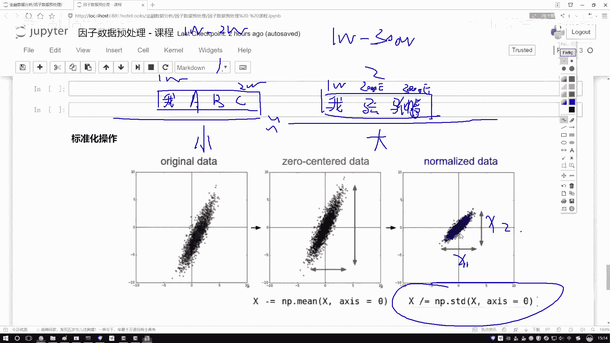

你看它的取值范围就近乎的相同了吧，哦这样有这样一个事啊。

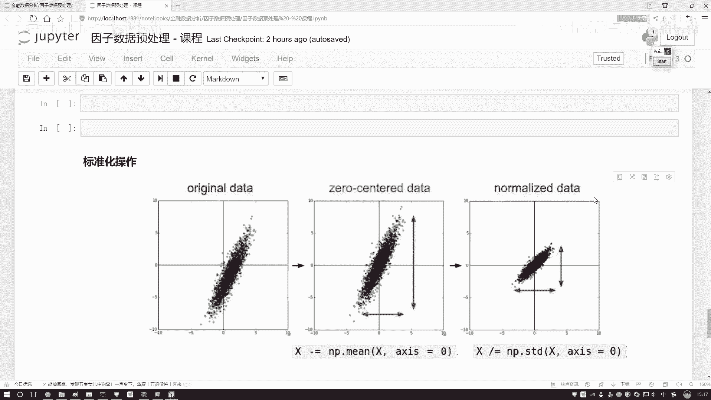

叫做一个哎我们的标准化，标准化在那个数据挖掘啊，或者是一些机器学问题当中啊，咱用的是非常非常多的，基本上拿到一个数据来了，哎你都什么都不用想，你都可以去执行这样一个标准化的操作啊，写一下吧。

写一下我们的一个呃标准化的一个操作，标准化的操作，然后对于我的一个series传进去。

这里也不用什么参数了，首先要计算两个值，什么图当中给你画出来了吧。

一个min，一个s std来写一下吧，这里哎不用写了，咱之前上面是不是有啊。

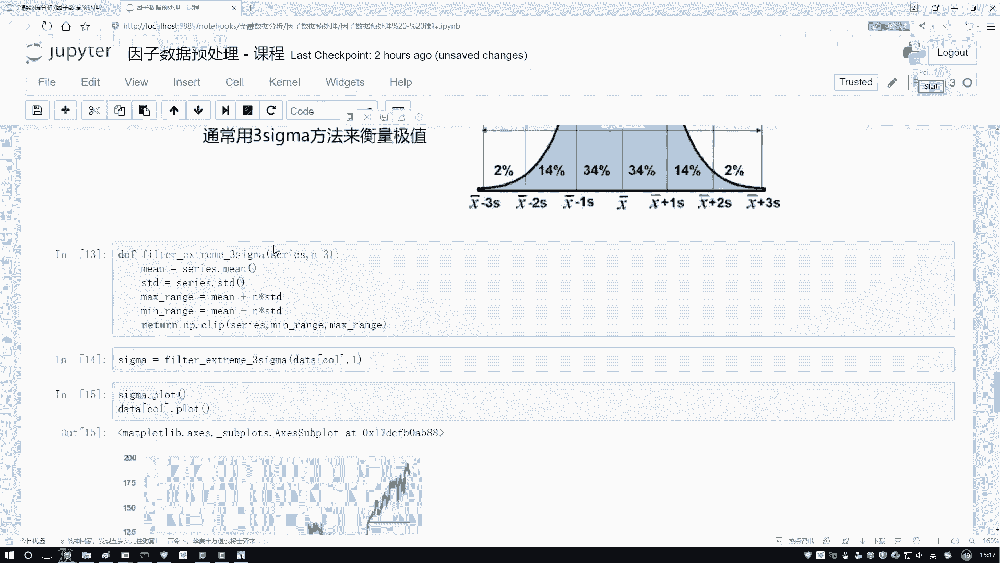

这把这个复制过来得了，一样的，也是需要一个均值和一个标准差，然后呢我说啊对我的一个数据怎么样，对我的数据做一个去均值，那就是减啊，return一下return这点，然后减去一个均值，再比上谁啊。

再比上当前这个s std数不就完事了。

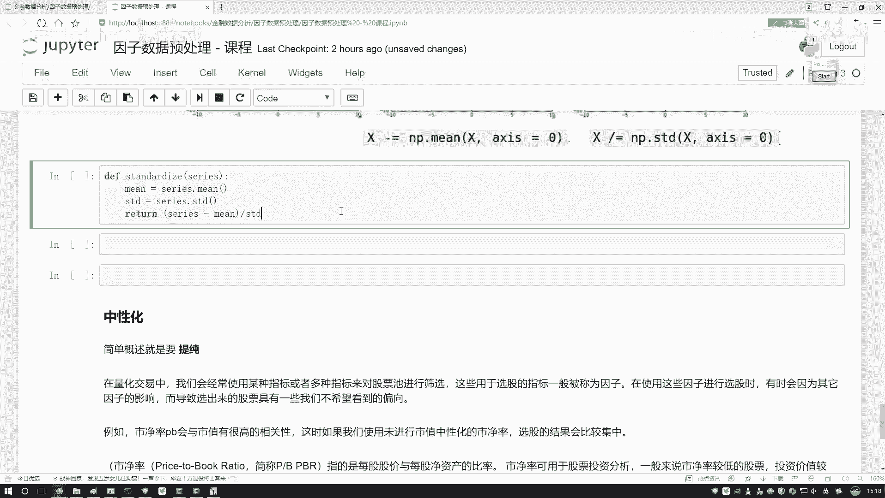

代码数非常简单，咱就可以去做呀，那其实今天就给大家说几种方法。

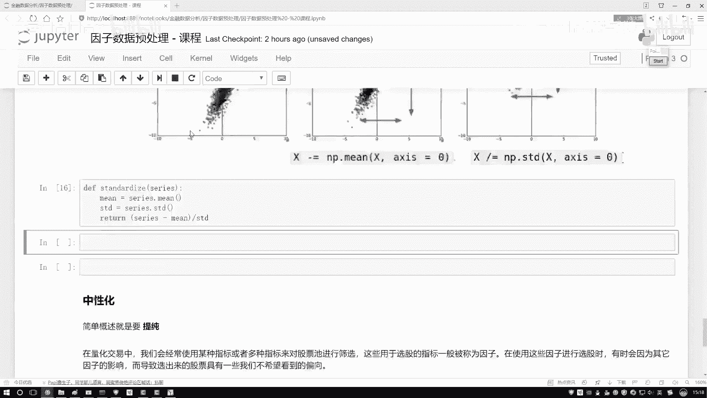

大家可能觉着哎呦，这些方法有没有一些直接的函数。

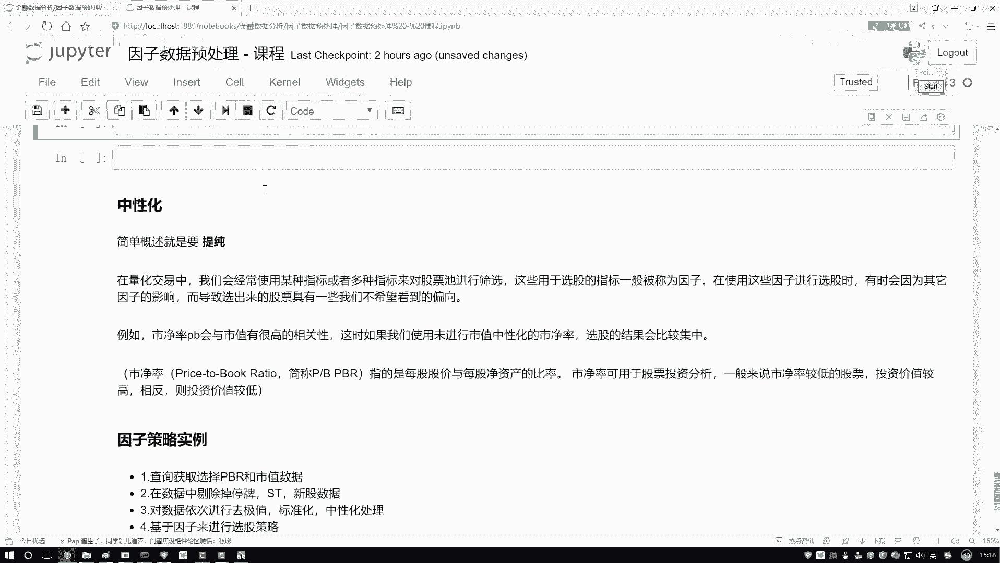

一行能帮我调用呢，其实也有啊，这个当中啊就是有一些工具包，像是sk learn当中啊，一些机器学习工具包里边，它都会有一些数据预处理模块啊，数据预判处，数据预处理模当中，你直接啊把人家API调下来。

一行代码也能解决，如果大家想用sk learn去做，你就是上sk learn官网，然后你在API当中搜一下啊。

搜一下这个standard这个东西，它就有啊一行代码能帮你去啊，完成这样一个事行，咱也写完了，写完之后这个不给大家画图了，这个也画不出来什么图。

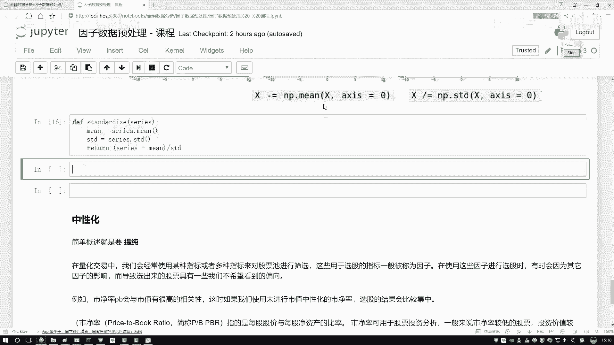

咱们来试一试吧，对于我们当前data，我先呃看原始数据。

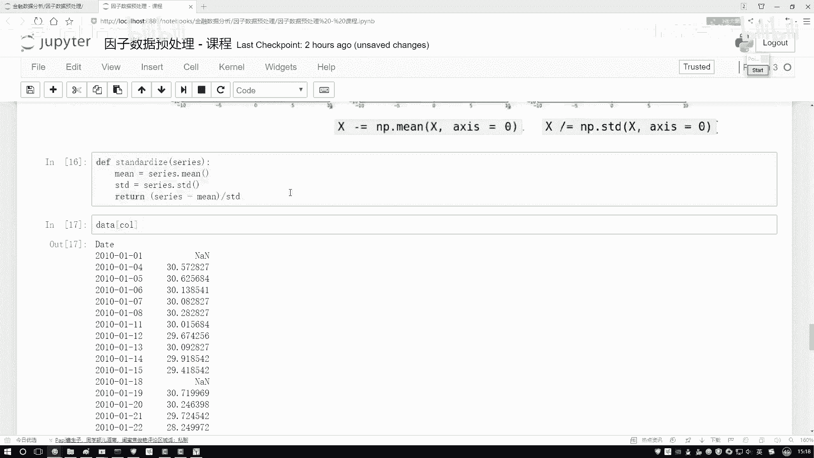

这是原始数据啊，你看有30多的，20多的，100多的范围，取值范围比较大的吧。

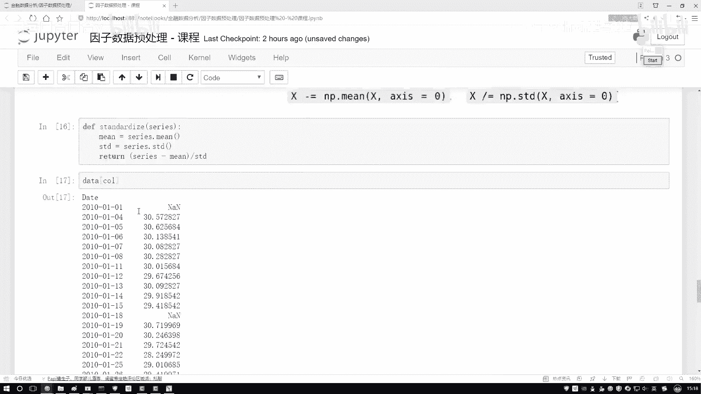

好了让我们再来看一下，做完咱们这个数据操作之后的。

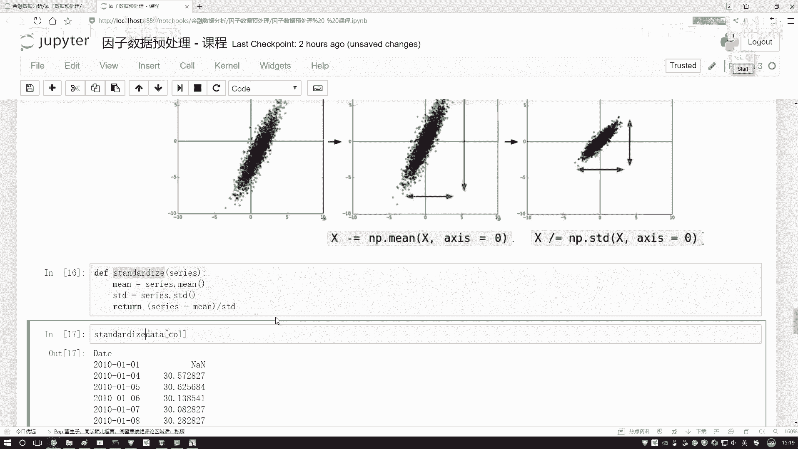

那就是把它传进来，然后我看下这个结果呗，你看怎么样都是变成了数值。

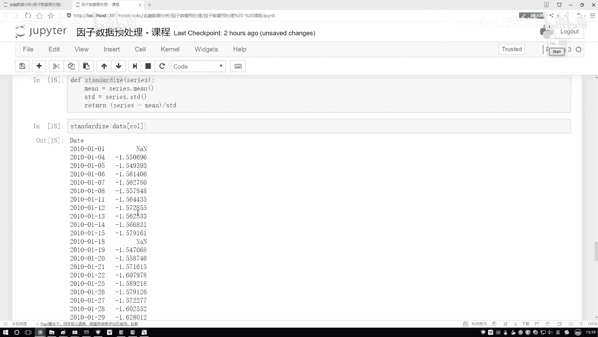

取值范围相对啊，在较小的一个区间当中的一个数值了吧。

啊这个就是一个标准化操作方法，还是挺简单的。

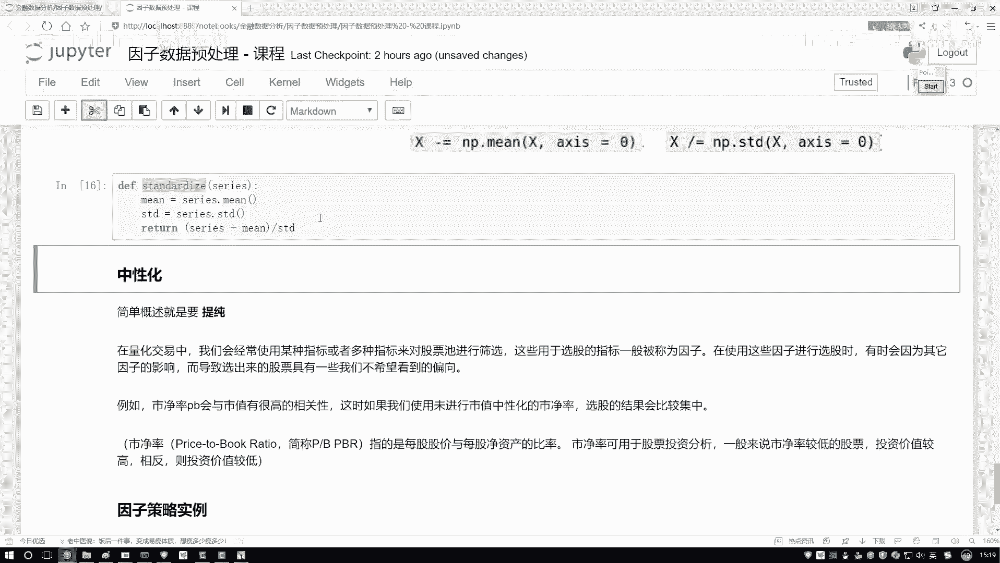

就是确均值哎，再比上标准差，让数据啊第一点以零为中心做对称。

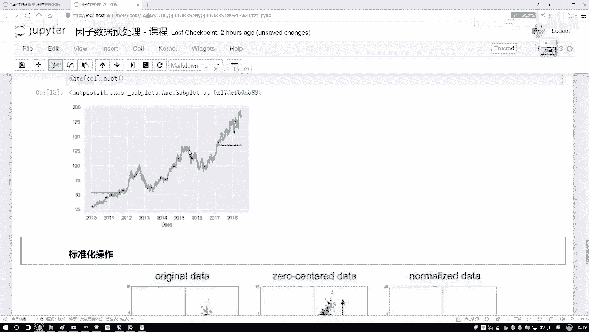

第二点呢使得我们数据啊各个维度取值范围啊，都在一个较小的区间当中啊。

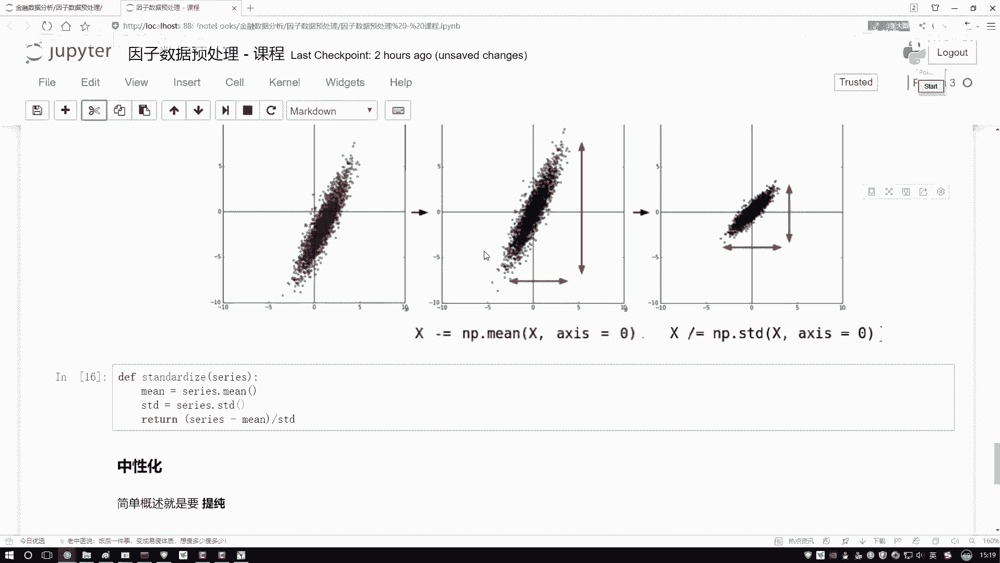