# 【量化交易教程】全100集（完整版）清华大佬耗时一月讲完的系统python金融分析与量化交易实战课程，包含基础教程，进阶学习，项目实战案例讲解，存下吧，比啃书好 - P44：44. 44.44.数据格式转换(Av1302064773,P44) - ML与DL - BV1gGSbYwEWn

现在虽然啊我们已经把数据给他搞定了，但是还有点问题，我们一会儿要什么。

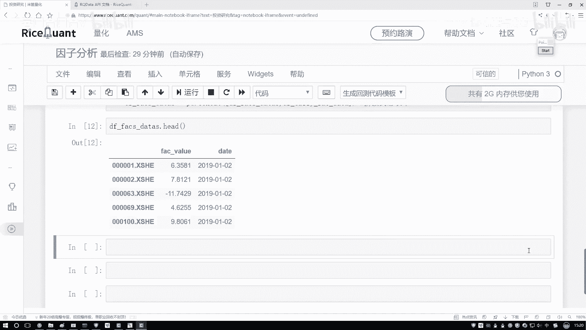

要用阿尔法learns那个包吧，那个包当中它需要我们的一个数据格式，跟咱们现在的可不太一样，我不给大家看文档了，太麻烦了，我这对大家来说，人家要的什么格式，它要求你的数据格式这样，比如现在你看啊。

就是你这个这是数据，这都是一个呃data，它都是一天的吧，他不是那样，他是这样一个指标，他说哎呀现在这个data我给大家直接画啊，他说现在这个data得这样，比如说呃咱们就拿有五只股票吧。

那每天都有这五只股票吧，那好了，比如第一天他是2019年，然后这样一个杠零一杠零一，然后呢接下来这块它会有五只股票，就是A股票，B股票，C股票，D股票，E股票是吧，然后具体有一些值。

然后这个value就不写了，1。3啊，一点几，二点多，三点多，四点多好了，这是什么，这是他说现在这是一个2019年1月1号的，然后呢接下来它的数据是这样的，接下来是这个2019年它的一个零一，再杠什么。

再杠一个零二，还是这五只股票吧，第一天，第二天，第三天，第四天，第五天还是这些指标值吧，接下来2019年1月1号，第三天，那你看人家要求的数据格式跟咱们现在要做的，你说一样吗，那肯定不一样吧。

我是不是得把这个格式稍微的给它改一改啊，改成什么，按照咱们这个格式要求来去写吧，那怎么去办这件事呢，咱们来看吧，在这里啊，我们得写一下好了，按照我们的要求，我们得去重新哎，大家来看一看。

首先首先啊咱别的不用说，你要把谁当做索引啊，肯定是我date这个东西吧，所以说我们得需要重新的设置下索引。

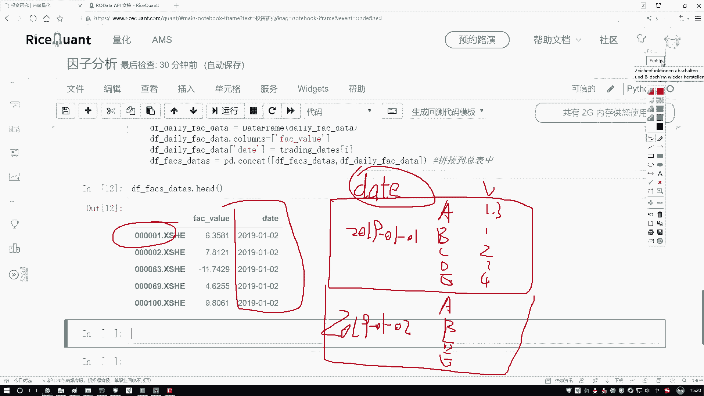

把数据啊转换成我需要的这种格式呃。

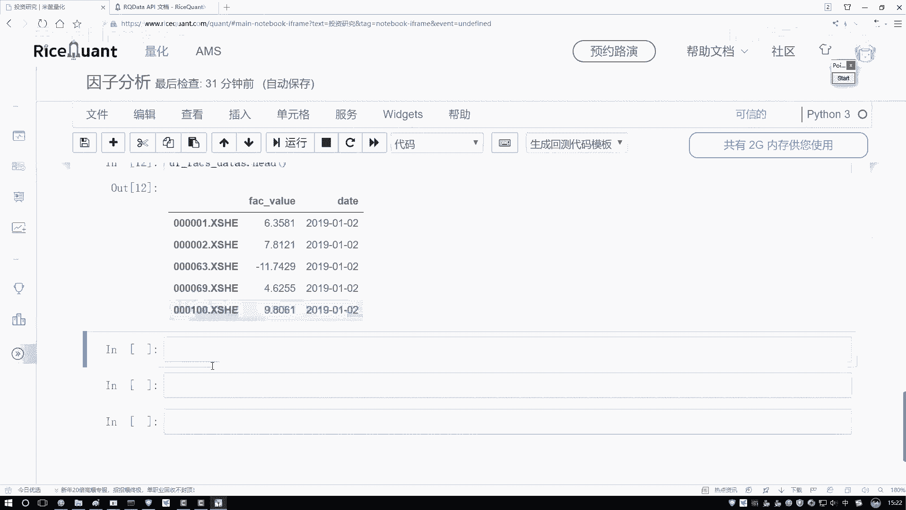

来执行一下吧，对于当前我的data frame做一点改变，对它呢，我说现在啊你得去呃重新设置一下索引了，设置这个索引当中啊，我得是拿谁当索引，那肯定我得是拿这个date，当做我当前的一个索引吧。

好然后我们来执行一下，然后这里就是重新的，我说我在执行这样一个赋值，哎不还还没完，这里不光我要是要指定一个date。

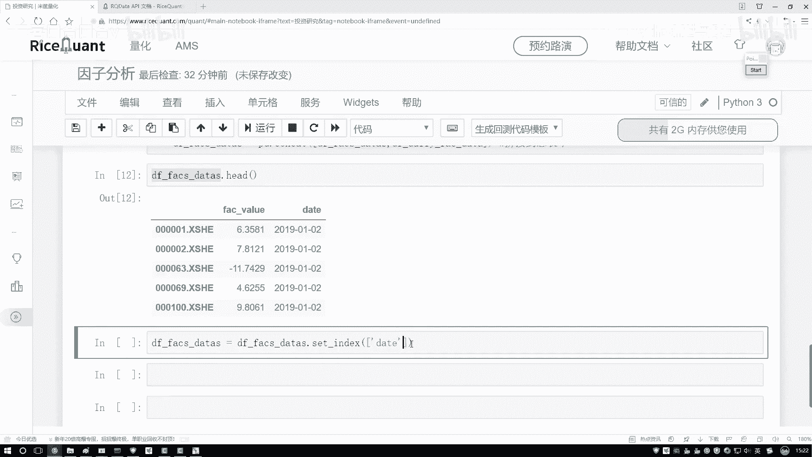

还要指定我们的一个就是data，我也找一找当下咱们的一个data。

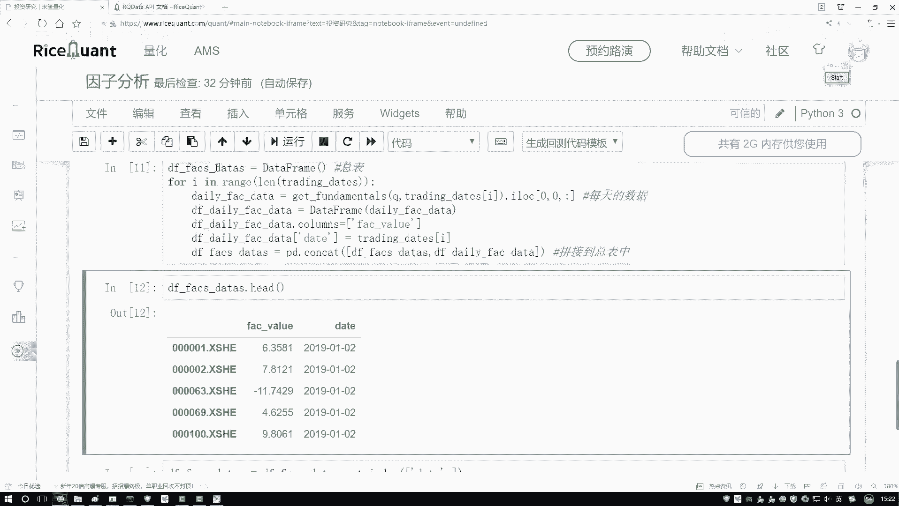

把这个data不要忘记把他的一个点index也拿到手，这是我们的一个实际数据啊，他的一个索引，这是一个股票吧，好了那这回是什么，第一个维度哎，就是我们说的一个刚才说的一个日期吧，然后第二个呢。

咱们是不是这个是我们的一个股票股票点index，你不是股票，就是股票指标指标当中的索引是什么，是不是一个股票一个指标，一个股票一个指标啊，那指标的索引是不是就是股票它的一个编号啊，就这个东西吧。

哎这个就是咱们现在说的这个呃指标，它的一个index，咱是不是该画图了，是先是一个data，然后再是一个股票它的名字，然后接下来再是它的一个实际的一个定，为什么它的一个值吧，啊相当于设置索引索引当中。

第一个是date，第二个是它的名字，然后值只有一个就是指标，实际它是什么值来执行一下吧，执行完之后点HIIT一下，来听我说，好像挺啰嗦的。

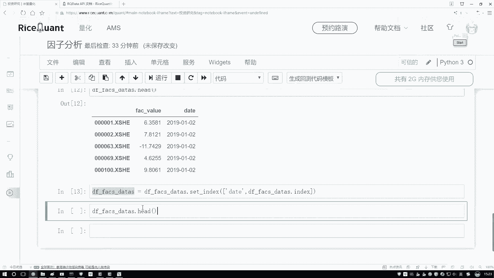

看这个结果是不是跟咱们想要的是一样的，这个是我的一个日期哎，2019，那这看的太少了，哎看的太多也没法看了，因为这个数据某一天数据实在太多了，就看这么看得了，这个是我的第一个date是吧。

这个是我的什么，我指标点index是我股票的名字吧，这是股票名字，那我的value是什么，value只有一个了，就是当前这个指标值它等于多少吧，那好了，现在我们基本上把咱们要做的事都做出来了吧。

拿到什么了，已经拿到了咱们现在想要的一份输入数据了。

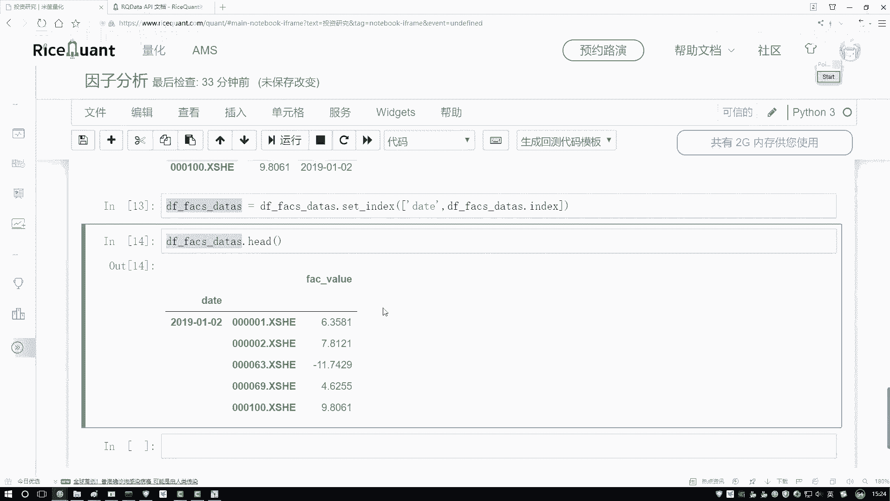

那一会儿呢咱们就能拿这个阿尔法learns啊，来去执行啊，我们的一个就是统计的操作哎。

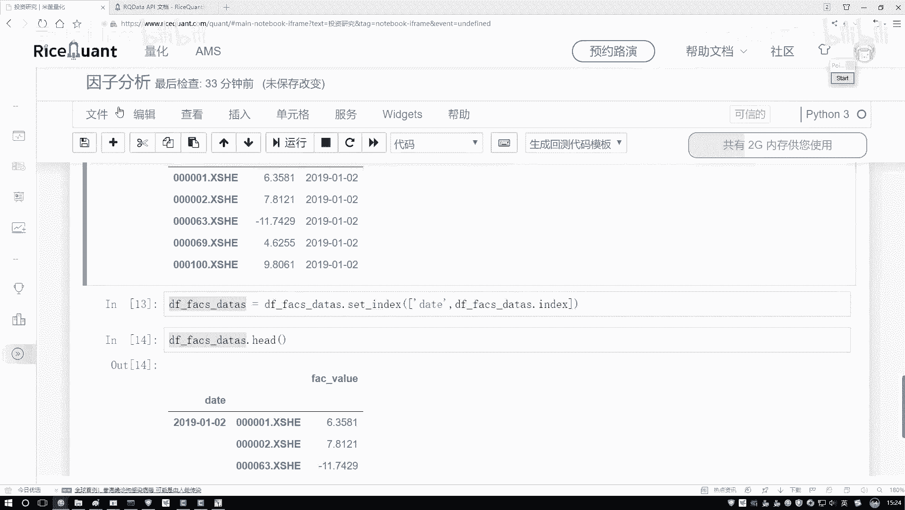

不就是计算R那个IC值那个操作这块我写一下，就是格式转换呃，格式转换呃，没有，为什么就是为了满足，为了满足工具包要求，人家这么定的。

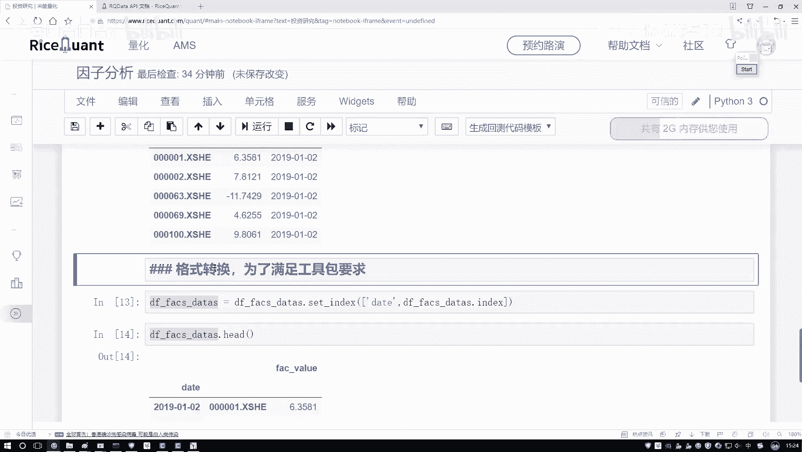

所以我也不知道为什么人家那么定的啊，但但是我们必须得去这么去做啊。

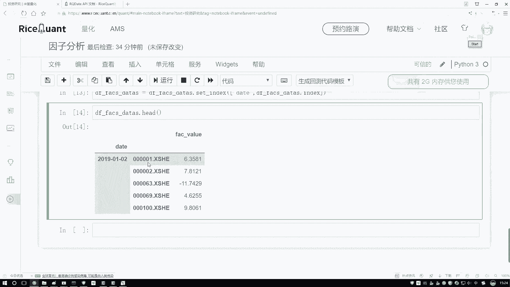

用人工具包咱也没得选，必须转换成当前这种格式，你上面那种格式人家不会自动帮你去转啊。

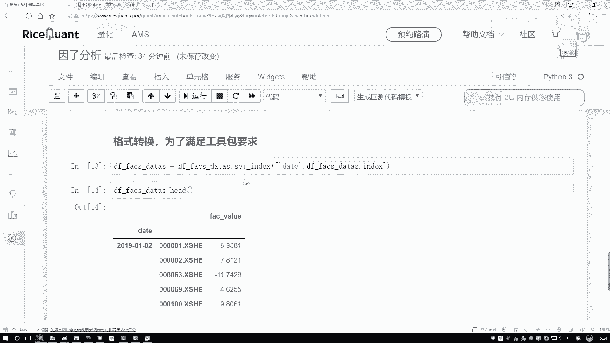

好了，那现在我们拿到这个指标了，然后呢在这个data a当中啊，再把这个series拿一下，再把它的一个实际的一个值给它取下啊，因为一会儿咱们可能在某些计算过程当中，会用到啊，它的这个值啊。

我们的一个指标，然后指定个值吧，然后呃series series是我的一个呃指标，然后它的一个DAS等于我当前这个结果，然后点head看一下，看有没有什么问题。

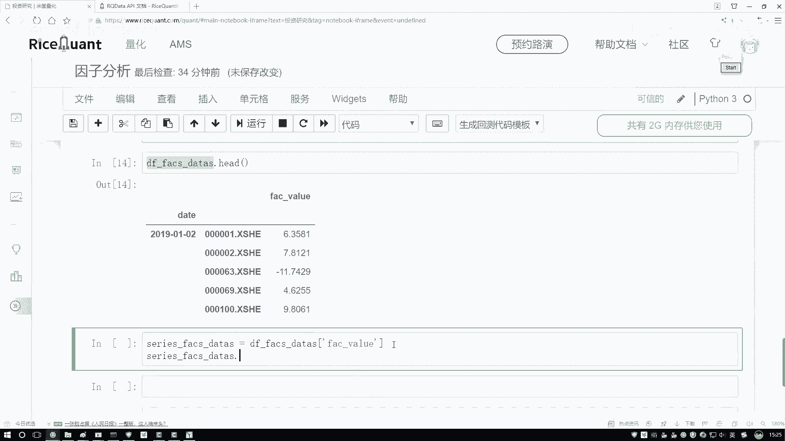

当前拿到这一列行，这一列没问题吧，好了，咱把单独这个数据拿到手了，那接下来啊咱们还有另外一个操作，还有一个叫做呃，除去我们的一个异常值，还有咱们的一个标准化的操作吧，这个啊在这里呃。

咱因为跟之前啊都是一样的，我就不给大家一个一个去说了，直接把这个复制过来就可以了。

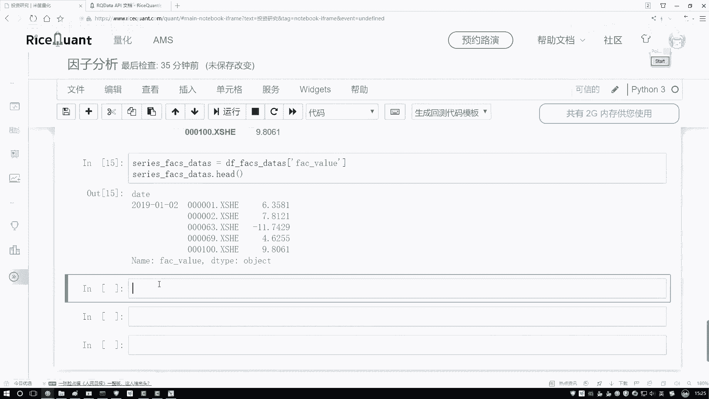

这块就是它的一个预处理操作啊，咱们就是啊做一个聚集值，还有这样一个标准化操作就行，方法比较简单，这个都不用给他去去给大家一个去看了，指定好你的一个上限和下限，然后去判断当前你的一个上限。

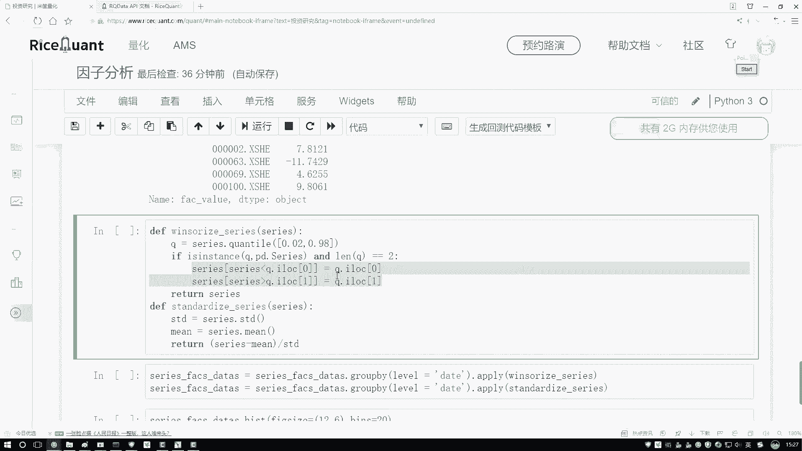

下限是不满足要求，不满足要求，给它做一个规范化吧，然后呢，标准化就是呃我的一个X解密比STD水，完事了，接下来是不是要对我所有的数据哎，每一天都需要去执行什么，每一天都要去执行咱的一个标准化。

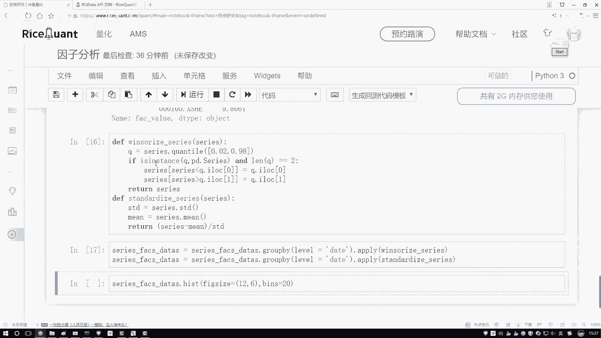

还有咱们的一个归一化这个操作吧，然后如果说啊大家想把这个它的一个分布情况。

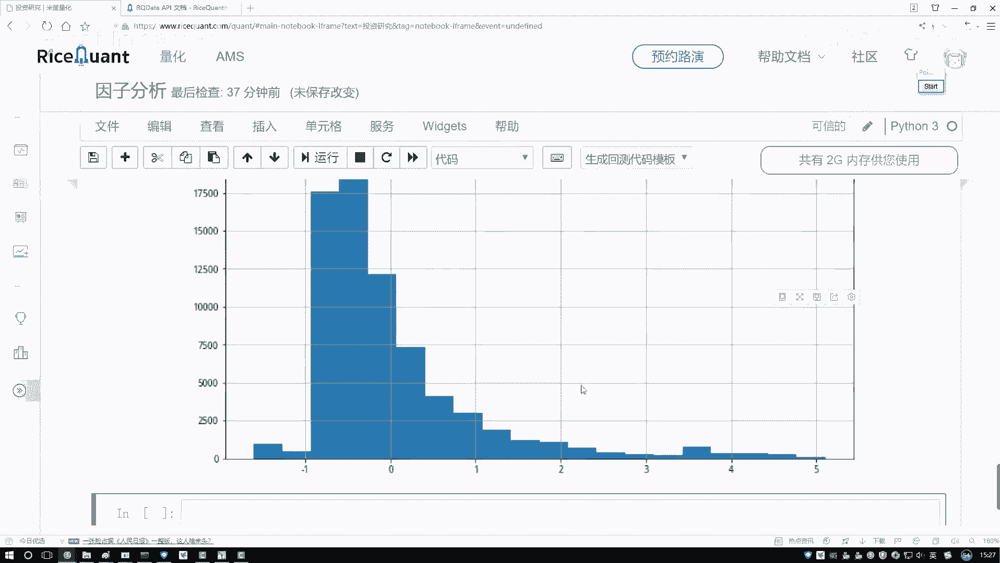

把这个图画出来，这块又给你画了直方图，可以简单的做一些观察啊，这个是一些基本操作，咱之前都给大家看过了，所以这里哎我们就一部不。

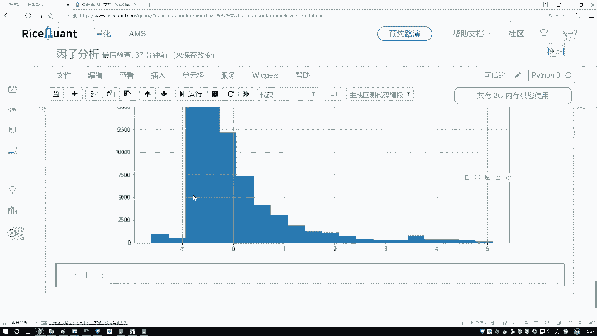

咱们自这里啊，咱们就不一个去看了。