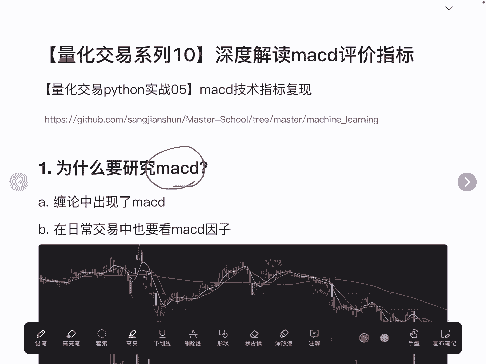
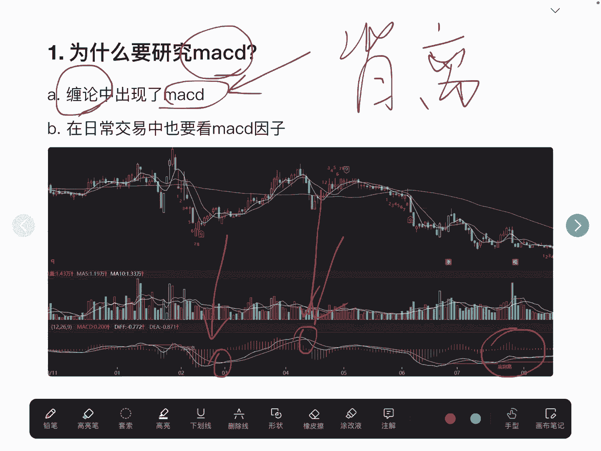
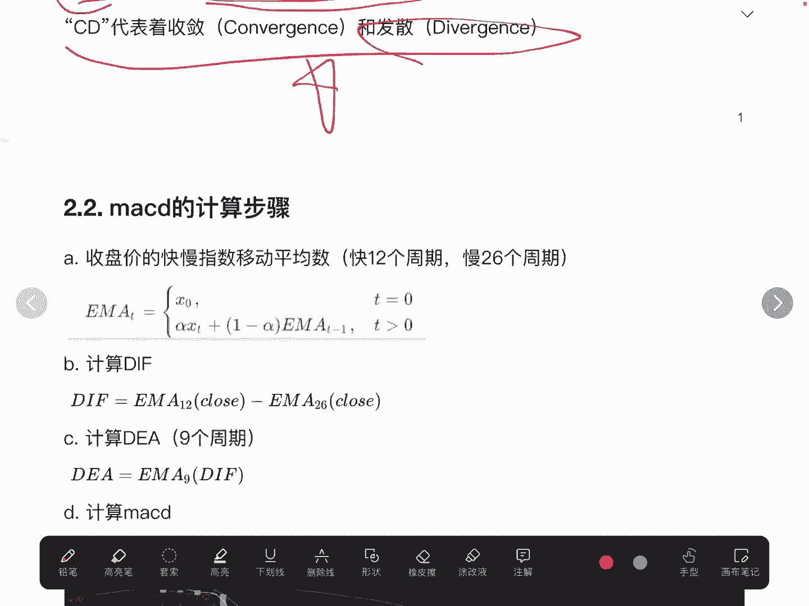
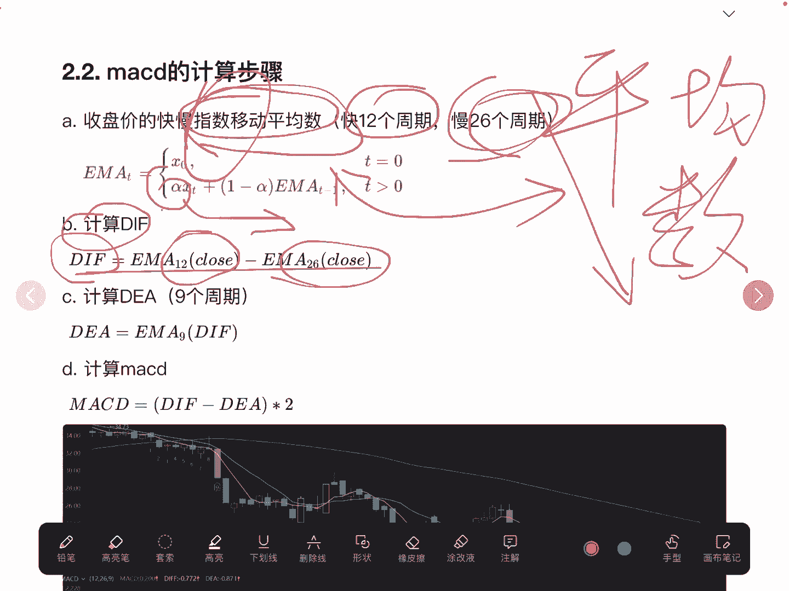
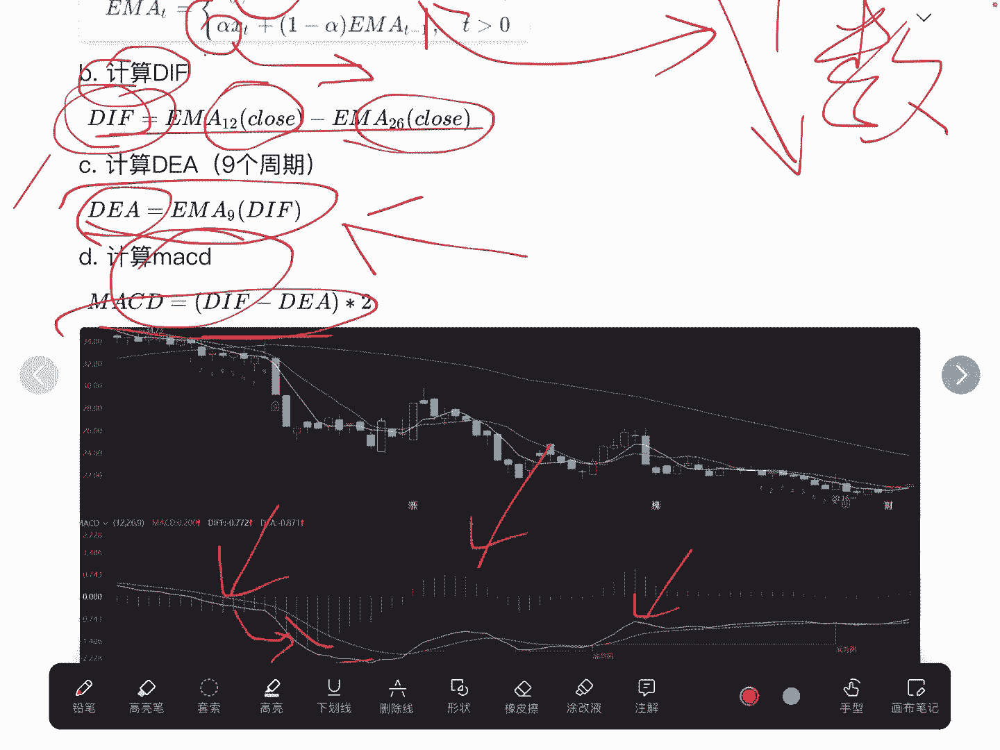
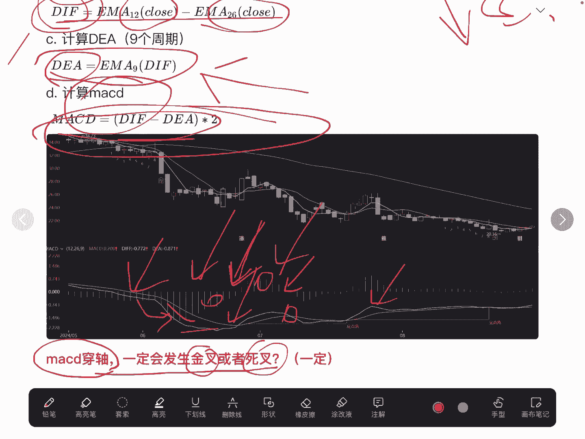
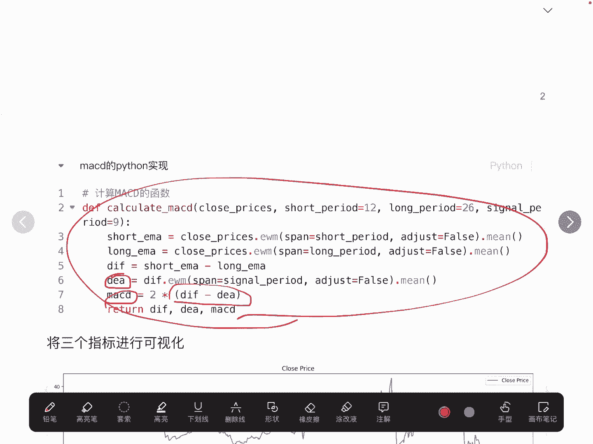
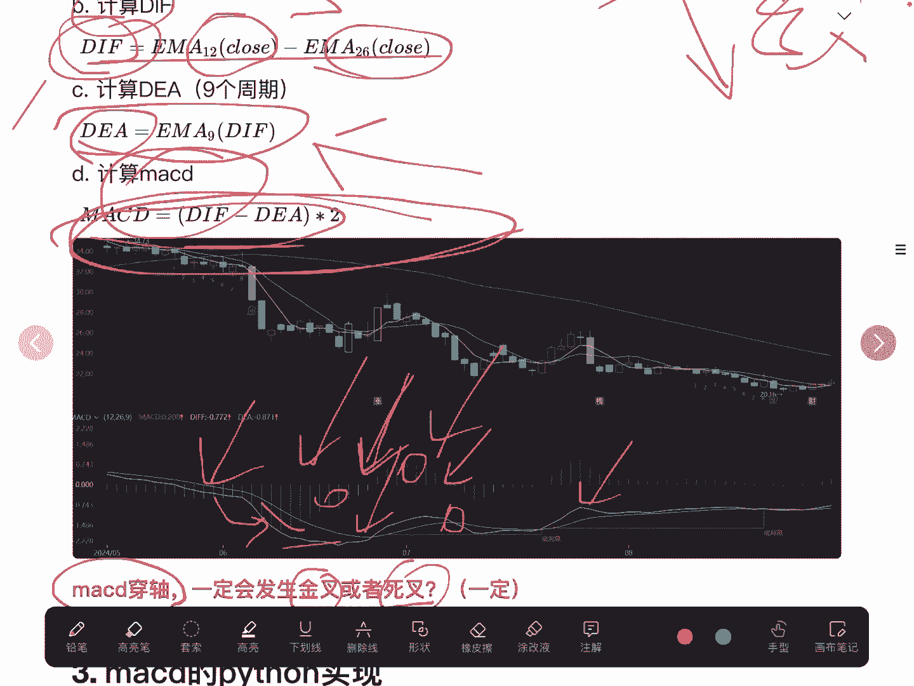
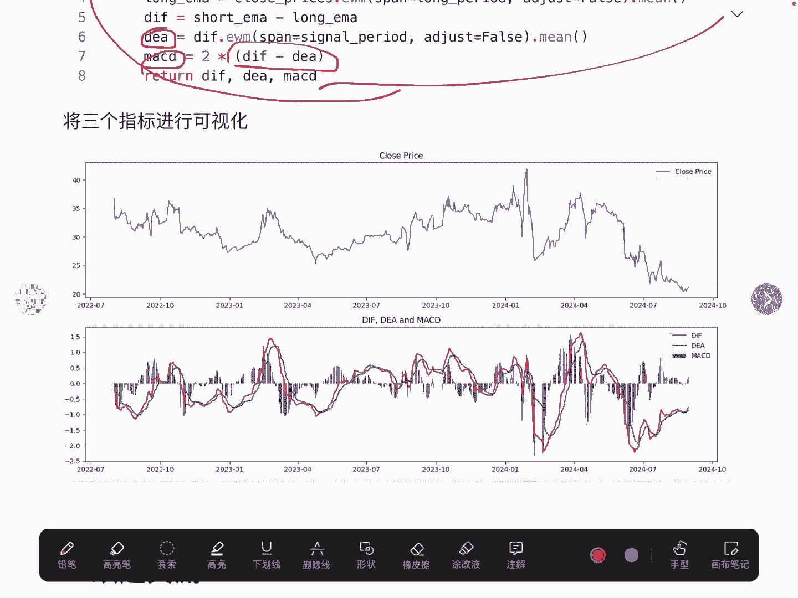
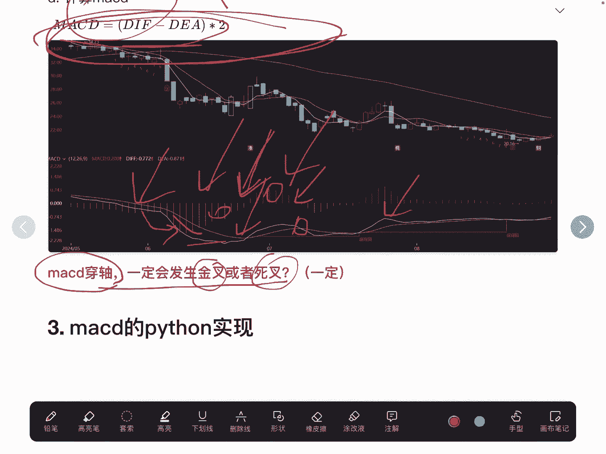

# 【量化交易系列10】深度解读macd评价指标（量化交易python实战05）macd技术指标复现 - P1 - master学堂 - BV1nnH1ekEUf

大家好，欢迎来到master学堂，今天我们来聊一聊ACD，我相信对于大多数有实盘经验的人来说呢，其实并不陌生，那我们很多人都会去看MACD这个因子，MACD啊，他其实跟均线因子很类似啊。

都是用来刻画一个票的一些属性的，那既然如此。

我们为什么还要来看MACD这个因子啊，最近我在研究缠论啊，缠论里面也提到了MACD，它通过使用MACD去判断一个股票是否有背离，这样一个趋势，如果有背离，说明有很大概率是反转的。

那么MACD呢其实很多人他都会用一些规则，比如说什么金叉死叉呀，比如金叉就应该买入，指差就应该卖出啊，看起来好像也没什么问题啊，那如果说我们只知道这种金叉，死叉是不是就可以了呢。

我觉得还是需要去深入MACD它的一个计算，它的底层逻辑是什么，那我们才能更好的去理解这个指标，那么用起来会更加的得心应手，所以我决定啊去看一下MCAD，它的底层的计算是怎样的。

尝试用Python去复现一下它的计算逻辑，看跟我们的这个证券体现的这个MACD，是否是一致的，首先呢我们就要去看MACD它是怎么定义的。

那MSDN呢，顾名思义啊，MA它就代表的是一个移动平均线，AD就代表收敛和发散，这个了解一下就可以了，我们去看一下它的计算。

MACD的计算一共分成了四个步骤，第一步我们需要去了解一下什么叫指数，移动平均数啊，如果大家对这个不是很理解的话，大家其实在一定程度上可以去等价于平均数啊，可以认为是一种均线的一个平均数。

那么只不过呢指数移动平均数呢，它是有一个权重的，而这个权重呢就相当于是，我们本来计算平均数呢，它每一个元素它是均值权重，也就是它的权重是相等的，比如说有十个数，那么它计算平均数。

每一个数它的权重都是1/10，而指数移动平均数呢它会基于这个时间，也就是把最近的收盘价呢赋予更高的权重，就是让我们的注意力更集中到，最近的这些股票的价格，所以这一块就是跟平均数的一个差异啊。

如果大家有需要的，可以去研究一下，比较简单啊，这我就不详细展开了，我们要去计算一个长周期，一个短周期在这里啊，12个周期我们认为是一个快周期吧，那么26个周期我们认为是慢周期啊。

首先我们第二步要去计算DIF值，DIF值呢就是用快周期的这个指数，移动平均数减去慢周期的指数移动平均数，那得到了这个DF以后，那我们再去计算DE这块DEA我等会说啊。

这个DIF大家可以看到啊，其实在我们的这个问SAD线里面呢，它是一个快的，就相当于是什么5日均线啊，这种第二一个呢要去计算DEA，而这个DEA呢它是用DIF，然后用九个周期去计算它的一个移动平均数。

最终得到DEA，那么DEA就相当于是比这个DIF，更加的平滑，也可以看到这个黄色的线，要比白色的线会更加的平滑一些，它的波动不会那么突兀，最后再计算MACD，MACD就是用这两个值相减，然后再乘以二。

这就是整体的MACD的计算，MACD就是啊这个柱子的一个值，这个柱子如果是大于零轴了，就是正数，如果是小于零轴了。

负数好的，这儿我给大家提一个问题啊，有的人说我们在死叉的时候买入，有的时候说我们这个MACD这个值呢它是穿轴，比如说它是由负半轴到正半轴穿轴的时候买入，大家想一下这两者是不是等价的了。

也就是说MACD穿轴是一定会发生金叉或者死叉吗，比如在这里也穿轴了，是不是看起来好像是的，那我可以告诉大家啊，它其实就是必然的，这两者是等价的，大家可以想一下，为什么可以基于这样一个公式。

大家想一下为什么这两个是等价的。

我们使用Python去实现呢，就非常的简单了，第一步啊，我们使用这样一个EWM，就是pandas自带的一个函数啊，通过它去计算指数移动平均数啊，首先我们计算一个短周期的指数移动平均数。

第二个计算长周期的移动平均数，然后再计算他们两个的差值，这个差值就是DIF，那同样我们可以去计算得到DEA，最终他们两个相减乘以二就是MAC地址，这个实现起来还是比较简单的。

但现在也可以用一些第三方的包啊。

可以直接计算MACD啊，我们就以这一个股票为例子。

这一个股票给他算得到我们这三个指标，这里我们对它进行一个可视化，可以看到的是啊，这个可视化的结果啊。

跟我们前面看到的这个结果是一致的啊，大家可以看一下啊，啊怎么来看是一致的呢，就比如说在这里大概是5月份到6月份的时候。

穿轴了嘛，我们来看一下这个图，是不是也是在5月份或者6月份的时候，是不是也穿走了，其实是一致的啊，算出来好，最后欢迎大家通过搜索，我们一起来交流。

