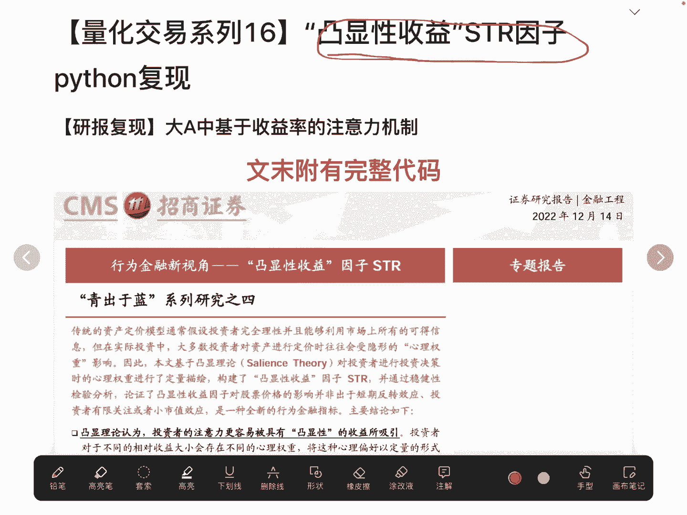
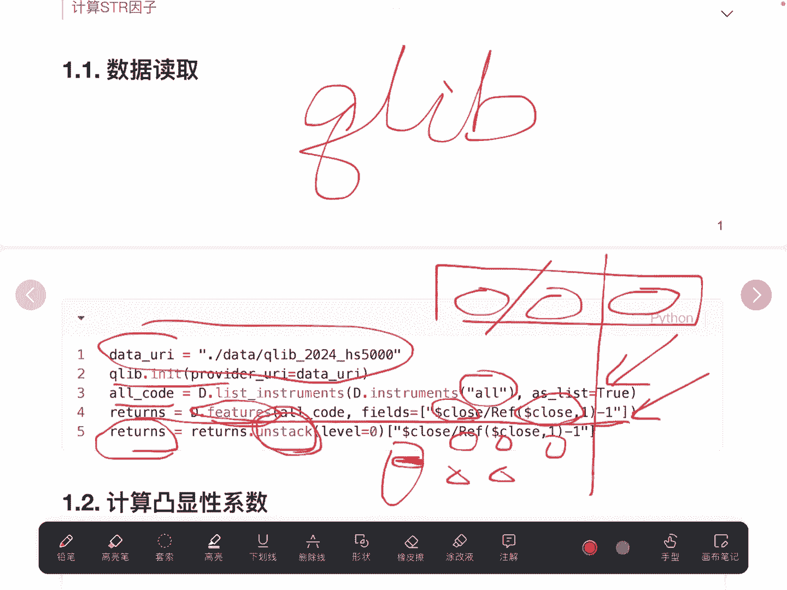
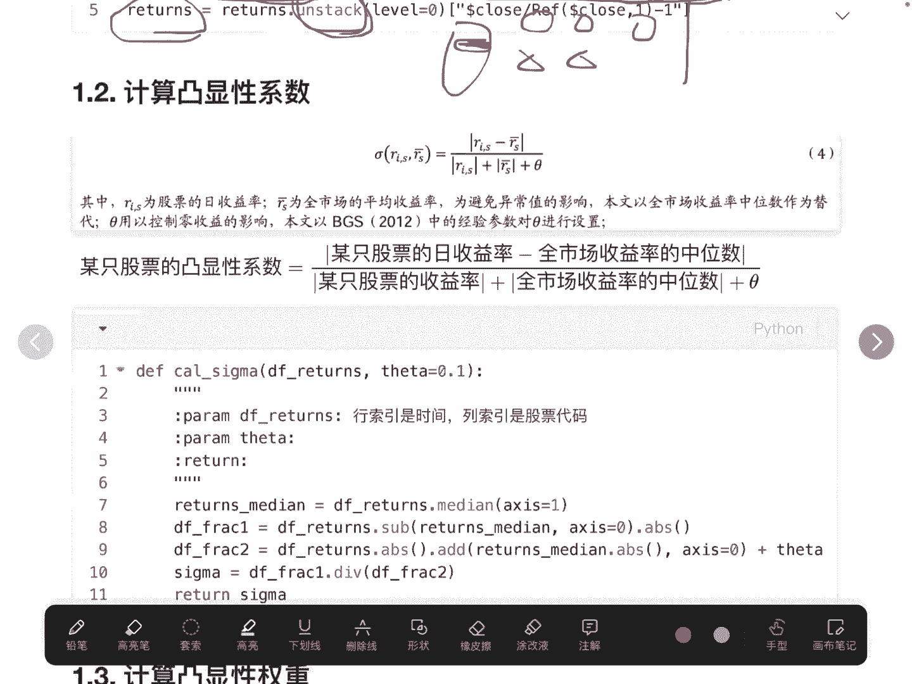
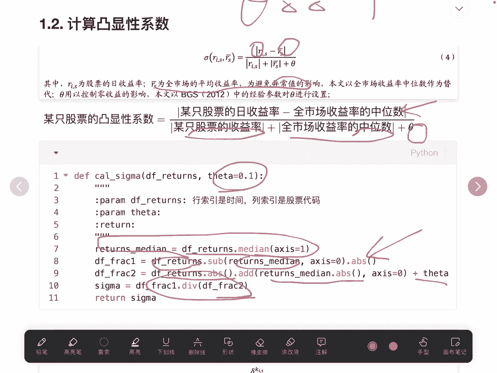
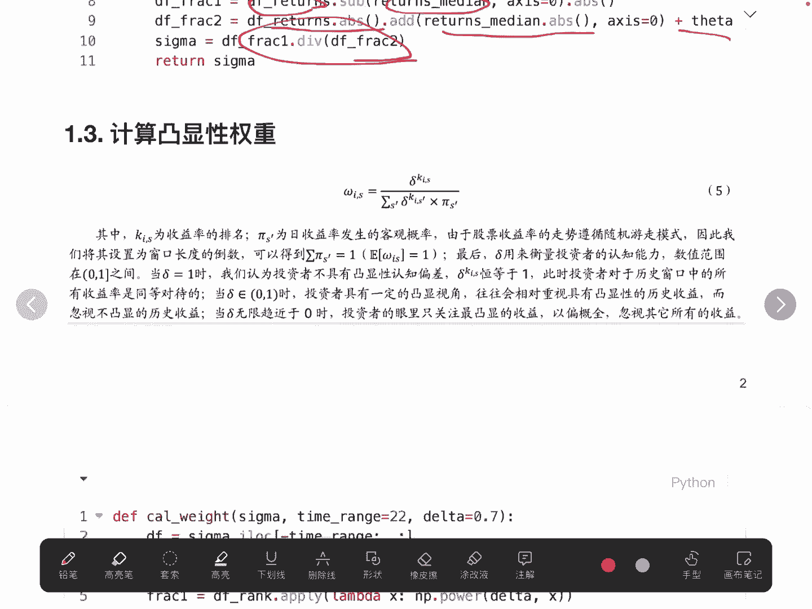
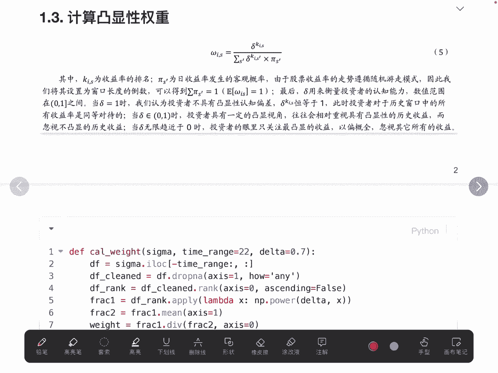
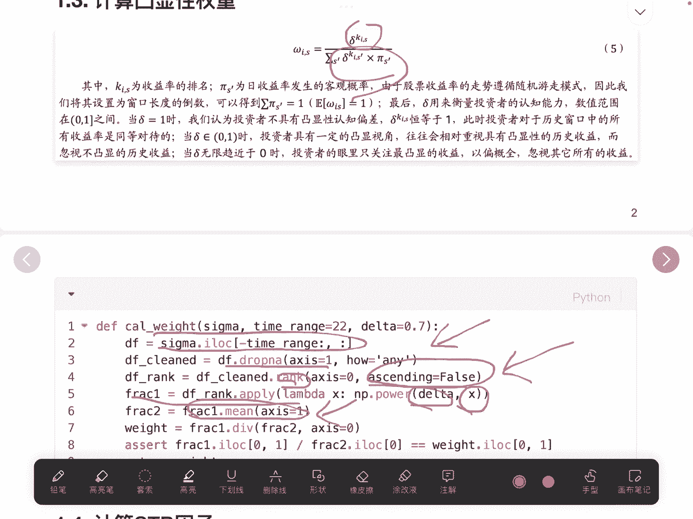
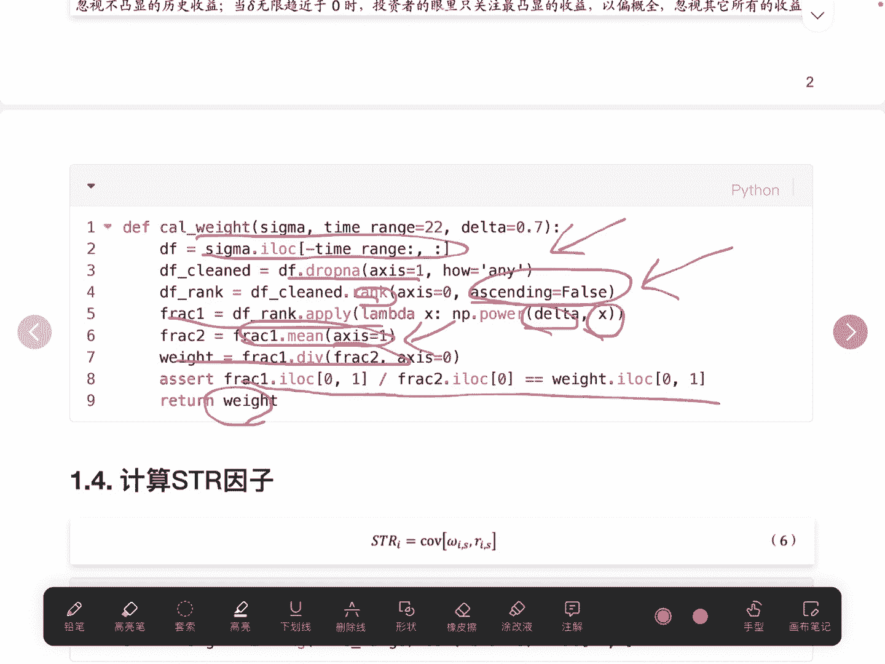
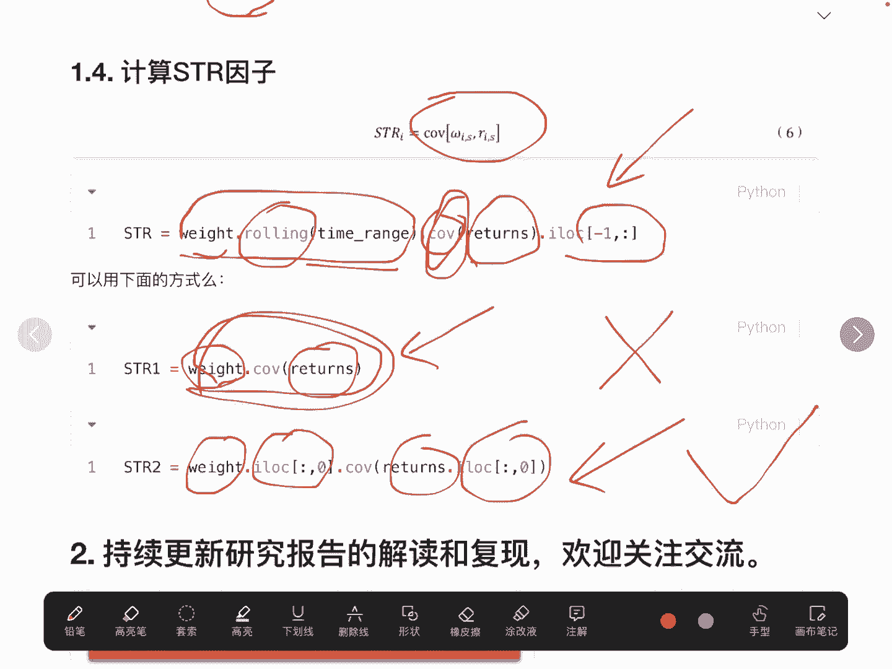
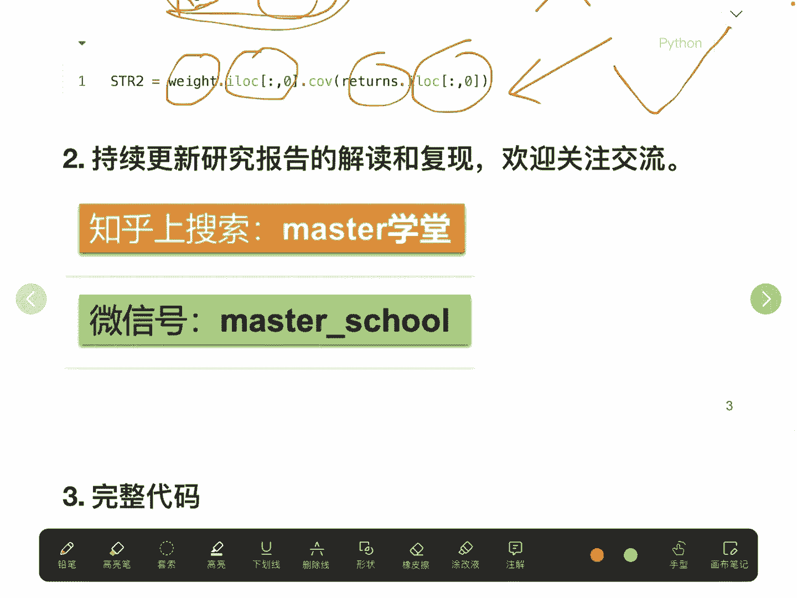

# 【量化交易系列16】凸显性STR因子 python复现【研报复现】大A中基于收益率的注意力机制（文末附代码） - P1 - master学堂 - BV1LJsve5Eso

大家好，欢迎来到master学堂，在上一个视频，我们详细阐述了凸显性收益，STR因子的计算原理，那在这个视频里面呢，我们来看一下怎么用Python去计算STR因子。

在这个文档里面，它的最后是附有完整的代码的，好的不多说，我们直接来看怎么去实现，那第一步我们就要去读取原始的数据，我们使用前面讲解的，微软开放的q lab这个量化平台进行读取。

当然前提是我们已经爬取好了数据，给它存在我们这个文件目录下面，初始化，初始化完成以后，我们要获取整个集合里面的股票代码，我们使用or这个标识来获取，最终这个all code其实是一个list。

是一个list，那获取到了完整代码以后呢，我们在使用features是这样一个API，去读取里面的列，而这里的链我们有一个小小的处理，我们用收盘价除以头一天的收盘价，再减去一这样一个计算的。

最终的一个结果也是当天的收益率，在这里计算得到的收益率，它是一个多重索引，它的索引是时间，还有一个是他的股票的代码元素是收益率，那得到这种索引，我们需要把它进行展开的方式，也就是索引变成时间。

然后列名变成股票的代码，比这是股票一股票二，股票三，那这一个位置存放的就是第一只股票，他在这一天的收益率，再一个就是第二只股票在这一天的收益率，我们使用UNSTACK这样一个API进行展开，那展开之后。

我们其实就得到了一个收益率的一个data frame，它的索引是时间列名，是所有的股票，得到这样一个data frame以后。

我们需要去计算凸显性系数，凸显性系数按照我们上一个视频讲解的。

用收益率去减去，当天整个市场的收益率的平均值，而为了鲁棒，就是避免一些异常值，我们使用中位数，再除以每只股票的收益率的绝对值，加上整个市场中位数的绝对值，再加上一个theta，在这里我们C它取0。1。

这里是一个经验值，我们来看第一步，我们是计算收益率的中位数，这样就可以得到每一天，这个股票在整个市场里面的收益率，中位数是多少，得到了中位数以后，就用每一只股票的收益率减去中位数。

最终求绝对值就得到了分子分母，就用每只股票的绝对值加上中位数的绝对值，再加theta，然后两次相除就计算得到凸显性系数西格玛。

第二步，基于西格玛，我们要去计算凸显性权重。

凸显性权重第一步是用德尔塔作为底。

K4代表的是排序，而这个排序就是按照西格玛去做排序，那我们来看一下我们具体怎么去实现，我们取过去一个月，大概就是22个交易日，作为我们要排序的对象，使用IOC获取我们要操作的data frame。

去掉空值，因为我们去跑历史数据的时候，有可能有的股票它没有上市，使用rank API，rank这个API我们在前面的视频其实也讲过，rank的使用，注意这是要设置这个参数为false的，千万要小心。

否则就会得到相反的结论，我们就计算得到分子，所谓的分子呢就是排序作为指数，德尔塔作为底进行指数运算，就得到分子，分母看起来比较复杂，其实我们上一个视频也讲到了，它其实就是分子按照每一天的平均数。

这里千万要注意啊，是每一天的平均数，不是每一列，就是股票的平均数，如果股票的平均数大，每一只股票它的平均数都是一样的，因为他的排序都是1~22之间的。

唯一性的权重就是分子除以分母，这里有一个简单的验证，看是不是我们的这个值是OK的，最终返回我们的凸显性权重weight。

计算完凸显性权重以后呢，直接调用协方差进行计算，得到SSTR因子，在pandas里面它有一个API是协方差的，我们使用了rolling这样一个API，拿到权重的这样一个指数据集。

只不过这个子数据集其实跟我们的time，瑞GE是一样的，只是22个字，跟我们的收益率进行求协方差，然后取最后一行，这儿我其实研究了很久，主要是涉及到这个协方差的计算，大家可以去看一下。

能不能直接使用weight点c o v returns，这是第一个做法，直接用这个data frame。

点com与另一个data fra计算它们的协方差，第二种做法呢是用我们的这个权重只取第一列，与我们的收益率只取第一类，这种方法可不可以，这块我先抛一个结论，这一个方法是可以的，只不过我们需要写一个循环。

而这个方法是不行的啊，大家可以去试一下，想一下是为什么啊，这块如果大家有疑问的话，我也可以在下一个视频进行一些讲解，为什么这个不行好了，以上就是整体计算STR因子的所有的过程。

也欢迎大家进行交流。

文墨是最终的完整代码，希希望感兴趣的朋友也可以去算一下。

是T2因子，好的。