# 【量化交易系列22研报复现】RSRS牛市择时因子python复现（如何计算一只股票的RSRS因子） - P1 - master学堂 - BV1pPyfYHEEi

大家好，欢迎来到master学堂，在上一个视频里面，我们分享了光大证券的这篇研究报告，基于主力支撑相对强度，也就是rs rs因子，这篇研究报告构建了一个基础版的rs rs指标。

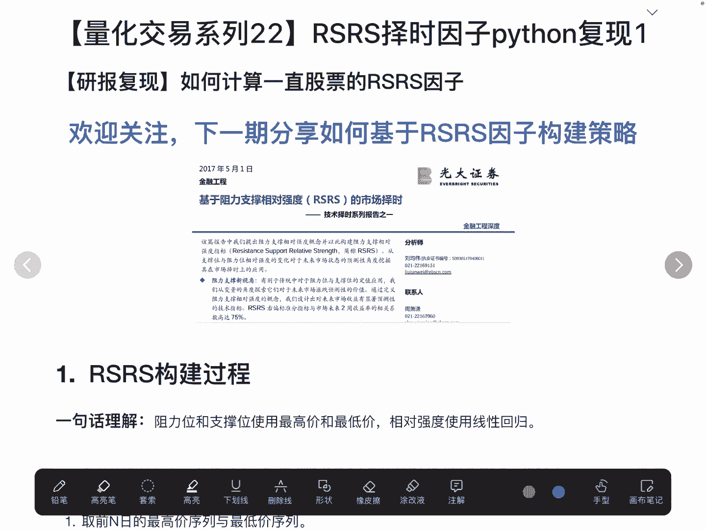

基于这个基础版的rs rs指标，提出了三种优化的方案，第一种是斜率进行标准化，第二种是基于标准化的指标再进一步做优化，第三种是做了一个右偏标准分。

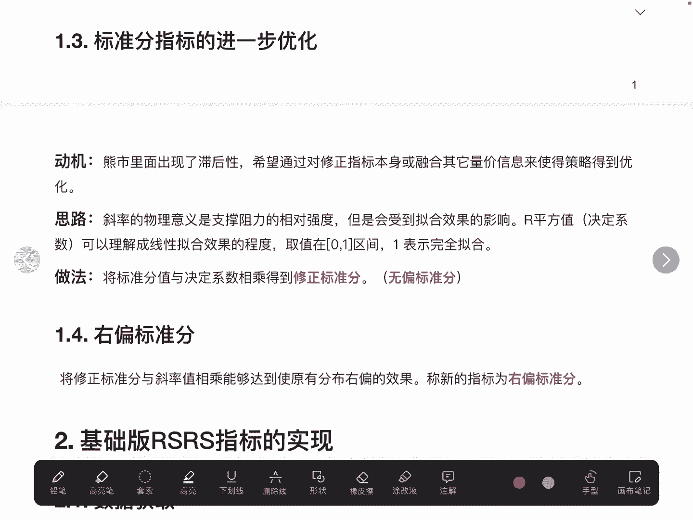

今天在这个视频呢，我们将要分享怎么去计算一只股票的rs rs因子，在下一个视频，我们将会分享怎么基于构建好的RSRC因子。

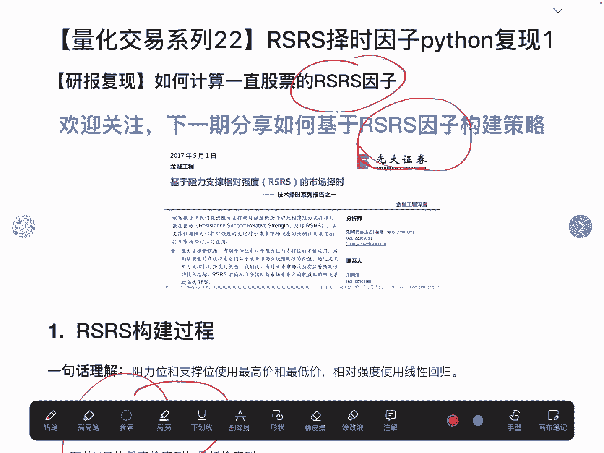

去构建我们自己的择时策略，好了话不多说，我们直接看代码。

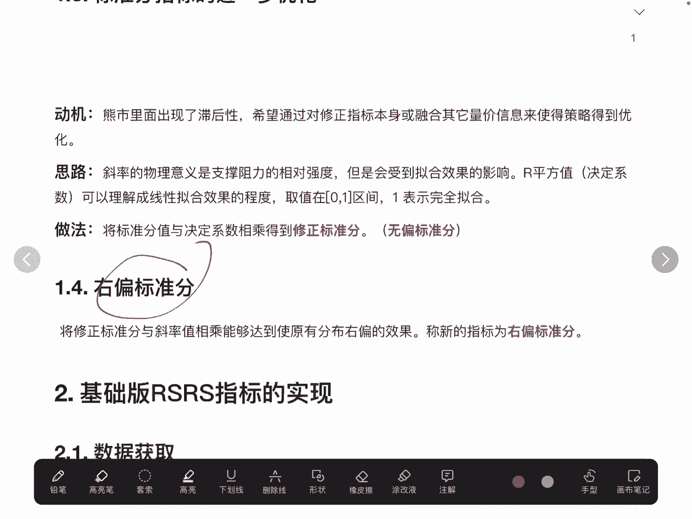

这个视频主要讲的是基础版rs rs指标的实现，首先是读取数据，这个读取数据呢，我们主要是使用沪深300这个ETF，我们将基于沪深300ETF去构建rs rs因子，读取数据的过程比较简单。

主要是利用我们前面讲过的q lab这样一个包，当然是我们线下自己已经把数据，存到这个q lab平台里面的，最终读取好的数据是一个data frame，它的索引是股票和时间的两级索引，列名一个是最高价。

一个是最低价，因为我们在做RSRC因子的时候呢，是用的是最高价和最低价这两个指标。

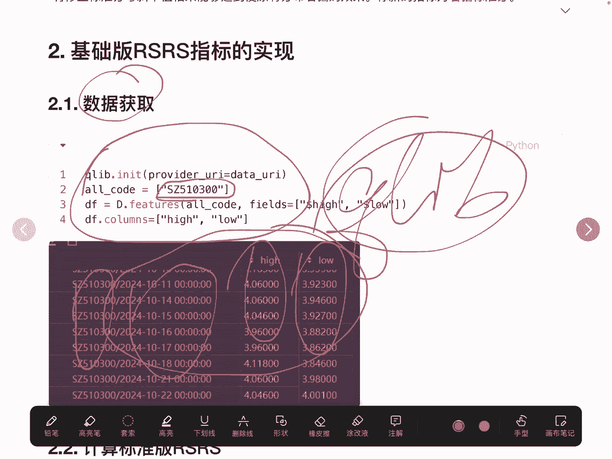

拿到数据之后，我们直接去计算标准版的rs rs因子这块。

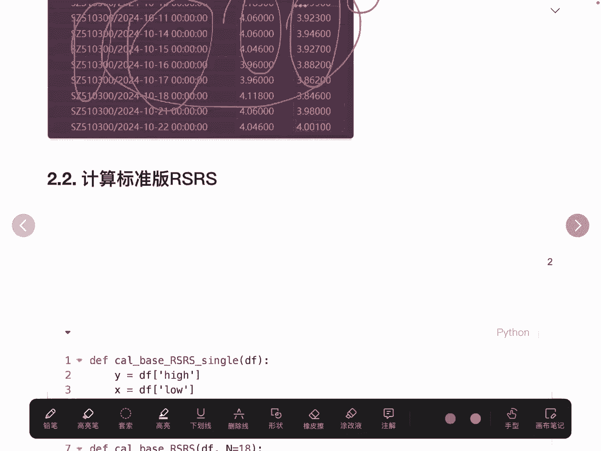

我要说一下，它的核心其实就是获取最低价使用线性拟合，而这个线性礼盒的斜率就是rs24因子，核心的代码其实只有这简单的几行，那么在这里，我们为了让整个rs rs因子的计算高效呢。

我们使用了Python里面的pl的这个多进程处理，这块，其实前面我们也讲过，我们来看一下怎么去做的啊，首先我们拿到的是过去18天的数据，进行线性拟合，这块大家要熟悉这个rolling的用法。

它相当于是从第零条数据到第17条数据，这是一个组，第一条到18条，这是第二个组，第二条到第19条，这是第三个组，所以每个组它其实是有18个数据的，由于它这个rolling最开始它是数据是不足18的。

所以我们在这里做了一个判断，也就是如果说我们拿到了这个group的长度，是小于18，我们将会传一个空值，这个是合理的，如果数据太少了，我们就不去计算拟合的斜率了，那当我们的长度满足18之后。

我们就使用多进程去计算这个斜率，拿到这个斜率的值result，这要注意，如果我们要获取这个斜率的值，要使用result点git这个API获取真实的斜率，当然我们把股票的代码以及时间给它。

存到三个元素的元组里面，最终这个base rsrs就是我们去计算得到的，沪深300的每一天的rs rs因子，它的列名我们重新命名一下。

叫instrument data time和base rs rs因子，这个rs rs因子就是我们要求解的这个因子，我们把索引设置为两级索引。

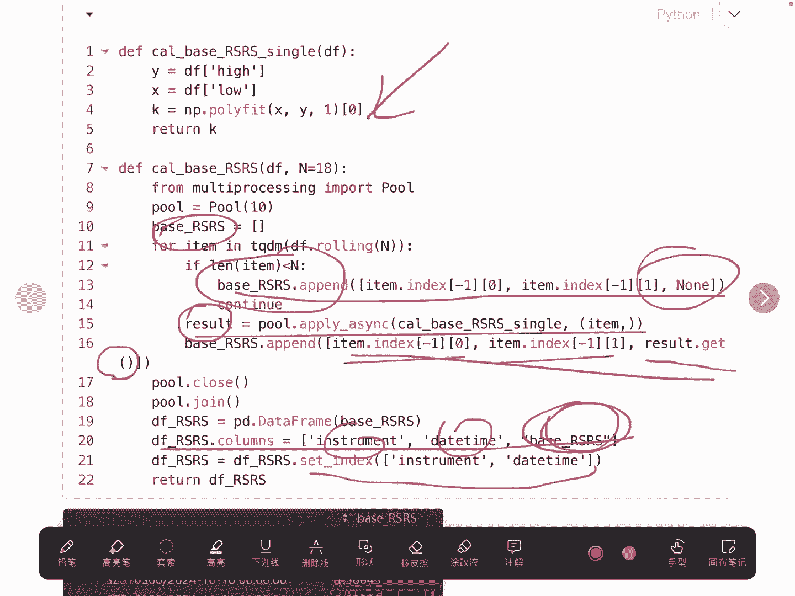

大家看一下啊，这就是我们最终的一个结果，每一天都是利用的，它过去18天数据的一个礼盒，这就是10月22号的这个rs r c因子，是1。18，在计算得到rs r c因子以后。

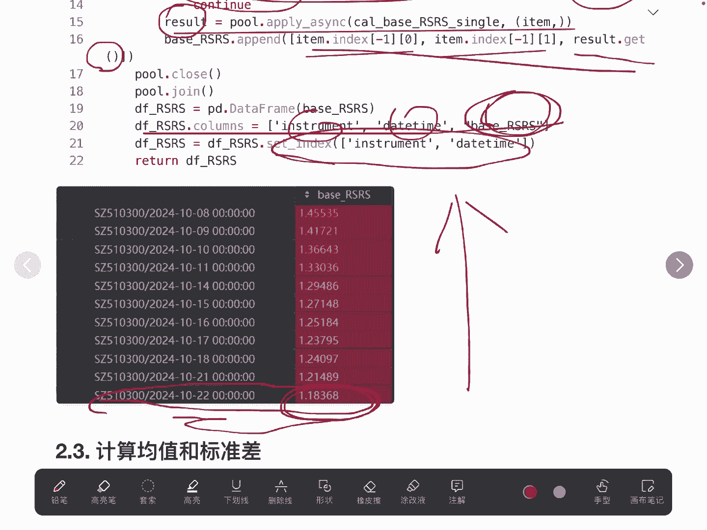

我们要去计算一个均值和标准差，大家想一下，为什么我们要计算均值和标准差，因为我们的策略也就是基于rs rs因子的，择时的策略，或者叫开仓或者清仓的策略，都要用到这个均值和标准差。

所以我们要去计算一下沪深300，它的历史数据的均值和标准差，在这里我们需要记住一个是0。9，标准差是0。12，这两个数据啊，我们将会在下一个视频上策略的时候使用到。

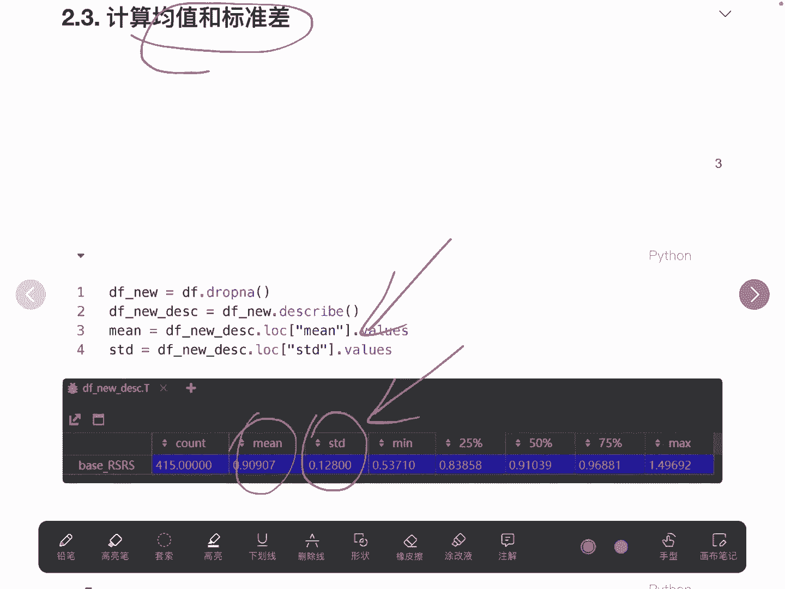

我们将计算得到的RSRC因子进行可视化。

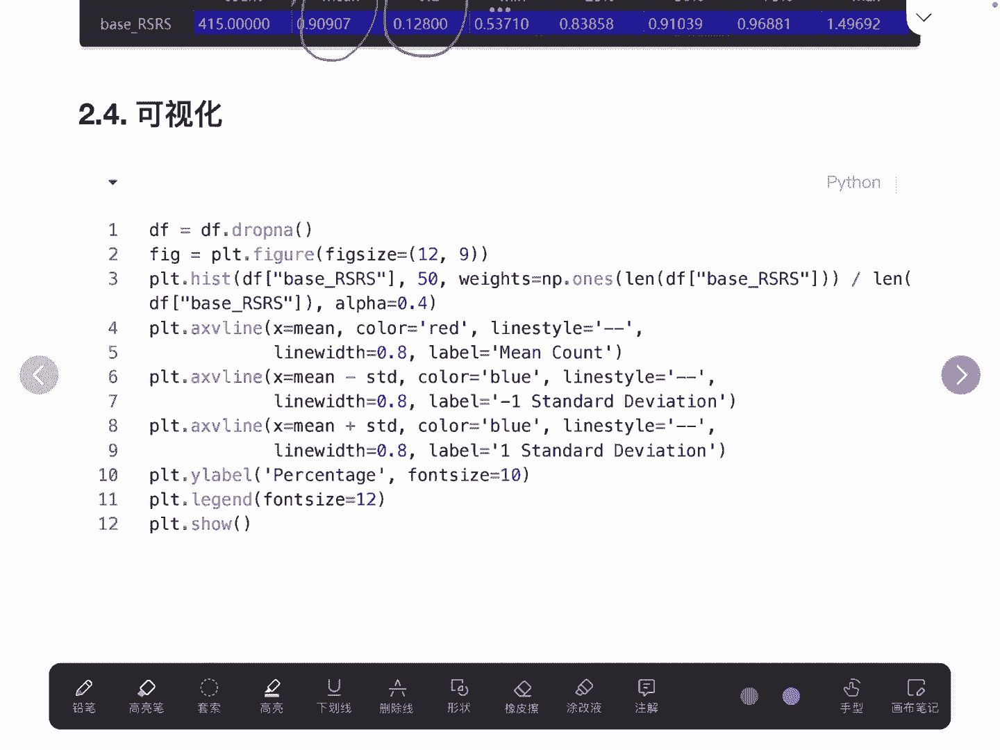

可以看到它其实是一个正态分布啊，这就是我们计算得到的均值，这是减去一个标准差，这是加上一个标准差的两条线，这是整体的rs rs因子的一个分布。

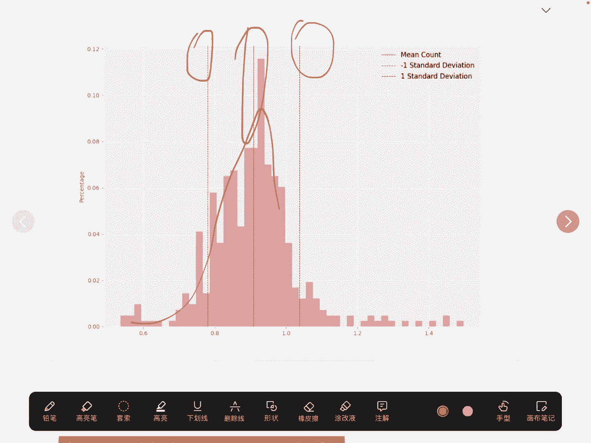

差不多是一个正态分布的样子，好的，今天这个视频，主要是教会大家怎么去计算RSR因子。

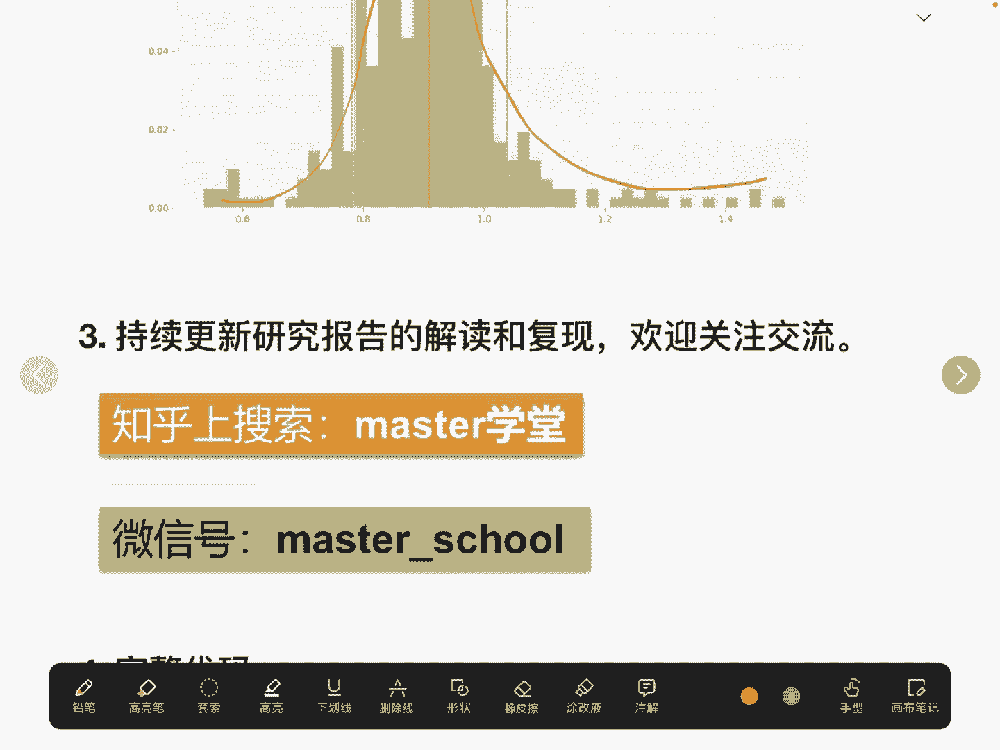

下面是完整的代码，如果大家有什么问题的话。

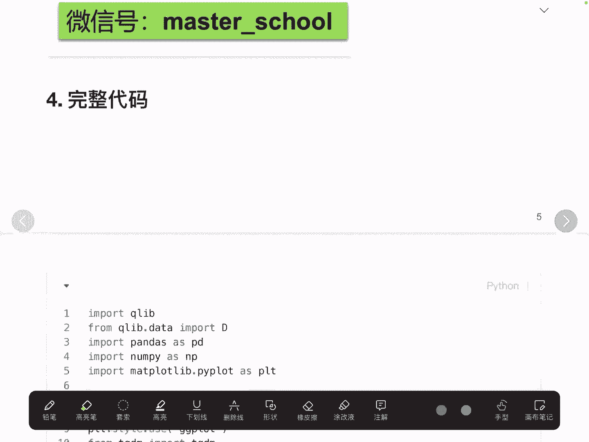

欢迎大家进行关注交流，好的。

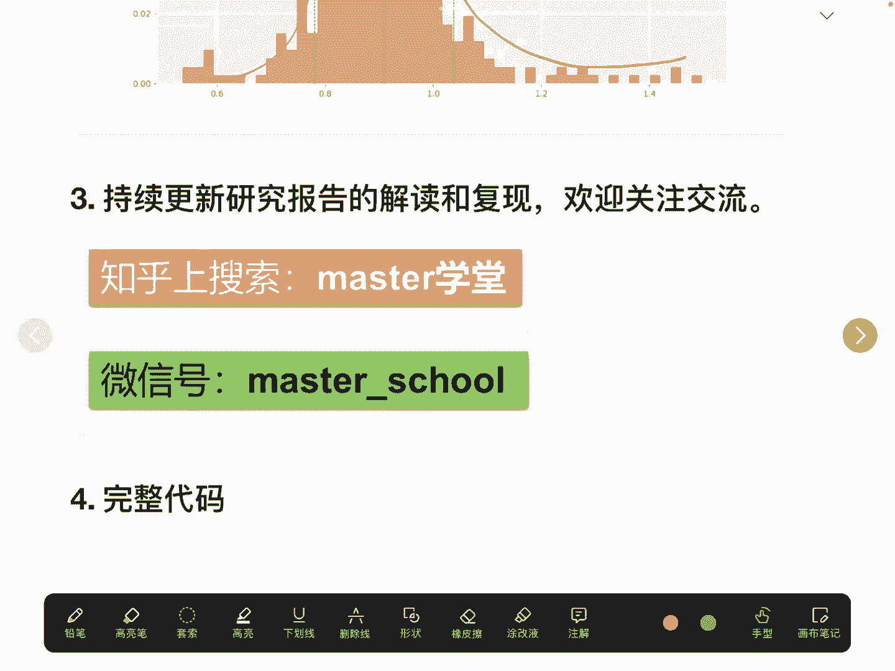