# 【量化交易系列23研报复现】对RSRS因子的改进python复现（稳稳的幸福，代码详看个人动态） - P1 - master学堂 - BV1p71EYVEan

大家好，欢迎来到master的学堂，今天我们继续分享，对RSR因子改进的Python代码实现，那么下一篇，我们将会去对所有的rs rs因子进行回测，看他们的表现到底有什么差异。

那么为什么我们要这么浓墨重彩的去讲，这个rs rs因子呢，因为我觉得这个因子还是有一点效果的，我最近有一个策略也是基于rs rs因子在做实盘，有一定的效果，它比较的稳，那我们简单的回顾一下rs rs。

在光大证券这篇研究报告里面，它有哪几种改进方式，那基础版的RSRS我们就不再展开了，首先第一个是对斜率进行标准化，这个斜率其实就是基础版的rs rs，他怎么做，他去取前面这个斜率时间序列做标准化。

假设有600个rs r c因子，针对这600个因子呢，我们可以去求它的平均数，也可以去求它的标准差，那针对当天的rs2因子呢，减去平均数，再除以标准差，就是这篇研究报告，对斜率进行标准化的优化方案。

文章也发现这种优化在做回测的时候，发现它具有一些滞后性，作者希望通过去修正这种指标，来让他减缓这种滞后性，或者减轻这种滞后性，它使用了决定系数，这样一个礼盒的评价指标，将1。2里面的标准分乘能。

与拟合过程计算得到的决定系数，去得到修正标准分，大家可以理解一下，如果说拟合的非常好，那么决定系数就是一那一乘以标准分，还是他自己，如果你合的比较差，那么这个决定系数是无限接近于零的。

它会对这个标准分进行打压，那最终得到的标准分呢，我们认为是叫无偏标准分，在做数据分析的过程当中，作者发现标准分在正半轴效果是比较好的，也就是我们需要想办法让标准分都大于零，所以第四种优化方案。

将修正的标准分去乘以原有分布的这个rs rs，为什么这样操作就可以了，你可以这样去理解它们两个相乘，相当于是标准分这个rs rs的平方，所以它可以把很多的这个因子，转变成右半轴的这个因子。

那我们认为这里的标准分就叫右偏标准分，那我们接下来就看一下，怎么去实现这三种优化方案，因为标准的rs2我们在上个视频已经讲解过了。

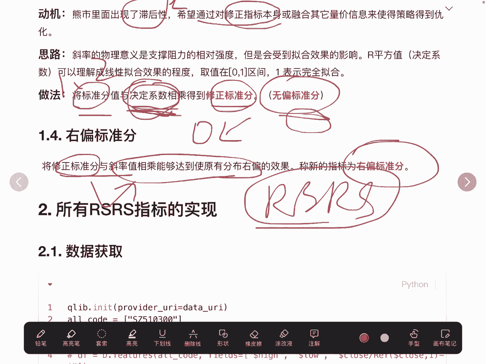

我们来看一下啊，第一步是拉取数据，这里跟上一个视频很相似，但是我们这里有一个小的变化是什么呢，我们去取了收盘价除以当天的收盘价，也就是去预计算第二天的收益率，为什么要这样操作呢。

是因为我们在下一个视频做回测的时候，需要知道他第二天的收益率是多少，注意这里不要用第一天的收益率，因为如果使用第一天的收益率，或者叫当天的收益率，它其实是有未来函数在里面的。

因为我们在计算rs rs的时候，用了当天的最高价和最低价，这里要注意，我们来看一下我们最终获取的数据，尾部的这几行符合预期的，10月25号。

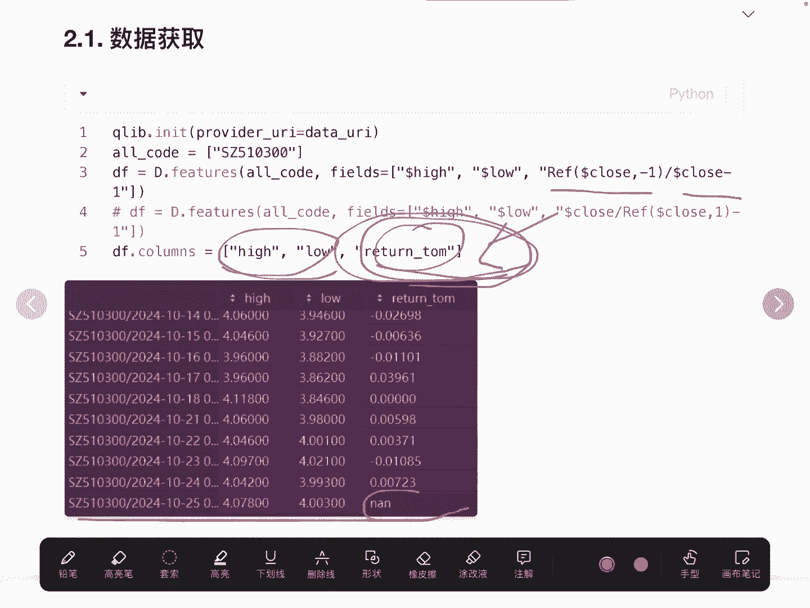

他没有12天的数据，所以这里是空值，符合预期，第二个是标准的rs rs这块我们就不讲了。

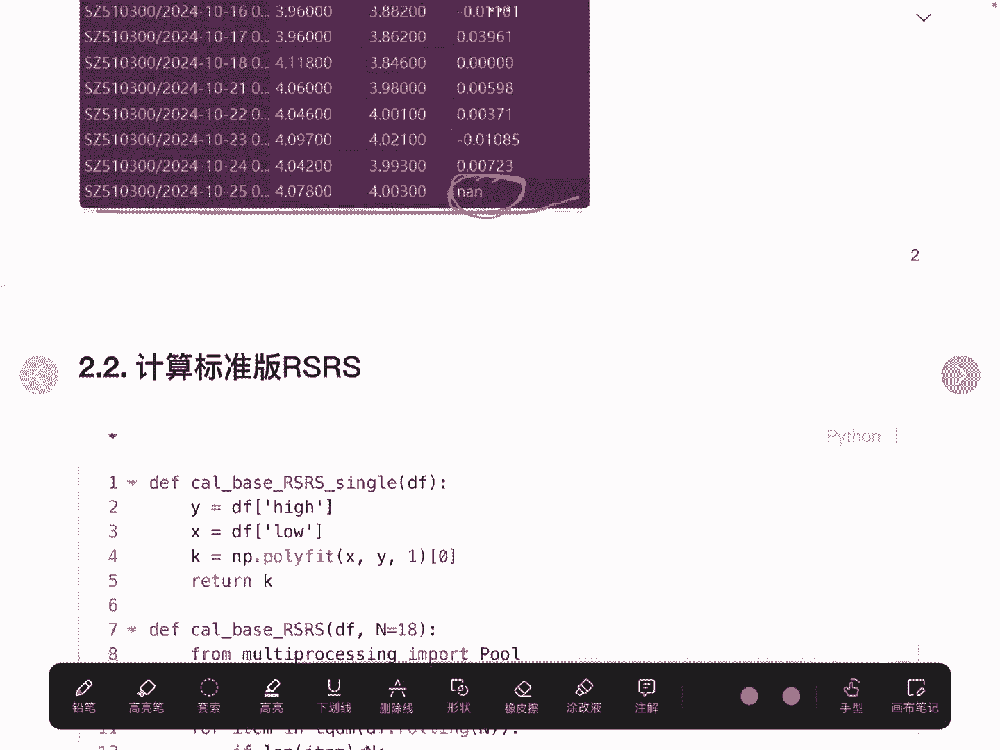

其实直接调这个接口。

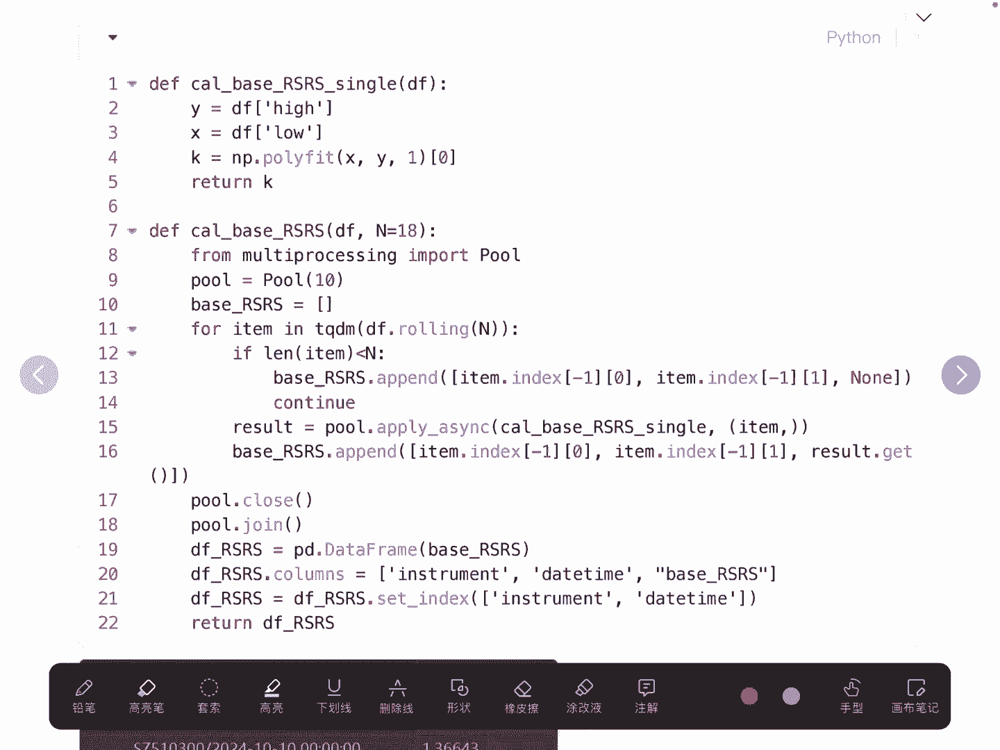

就可以去计算得到标准的rs rs值，这是得到每一天它标准的rs rs值是多少，但我们在这里还是用的沪深300的这个ETF啊。

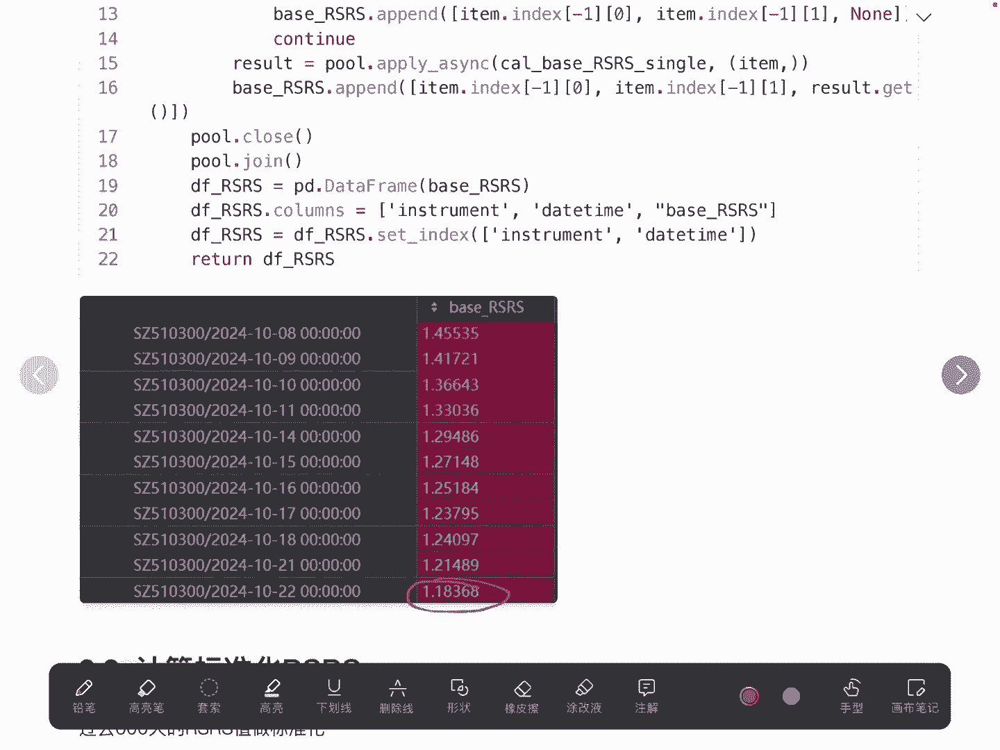

第一个优化是去计算标准化的rs rs，那怎么去做呢，首先我们要去计算得到基础版的rs rs，那这里就是基础版的rs，也就这一个字段里面它都是基础版的rs rs，我们去减去过去，这里我们取600天。

过去600天的rs rs的均值，然后再除以过去这600天的ISS的标准差，就得到了标准化的rs rs，这就是第一个优化版的rs2S，再看第二个，他去做了一个修正，那这里的修正呢它是用决定系数相乘得到。

我们来看一下，我们在这里使用了state model里面的这个模pi，首先我们要去计算标准化的rs rs，前面18行复制为空，我们在这里做了一个礼盒，我们前面在做基础版的rs rs的时候。

我们使用的是NP点poly fit，大家可以看一下这一个API跟这一个API。

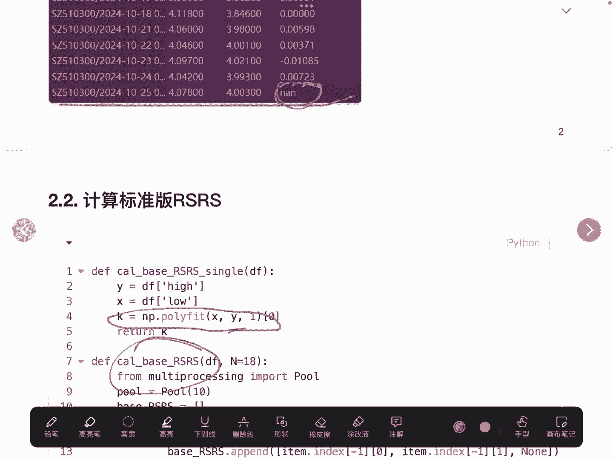

他们其实做的是一个事情，那为什么我们在这里要使用这个AAPI呢，因为我们可以直接去获取他的决定系数，或者叫它拟合的程度，我们记为R，这就是它的决定系数，那我们把决定系数记录下来。

最终用决定系数乘以标准化的rs rs，就得到了修正版的rs rs因子，这就是第二个优化版的rs rs。

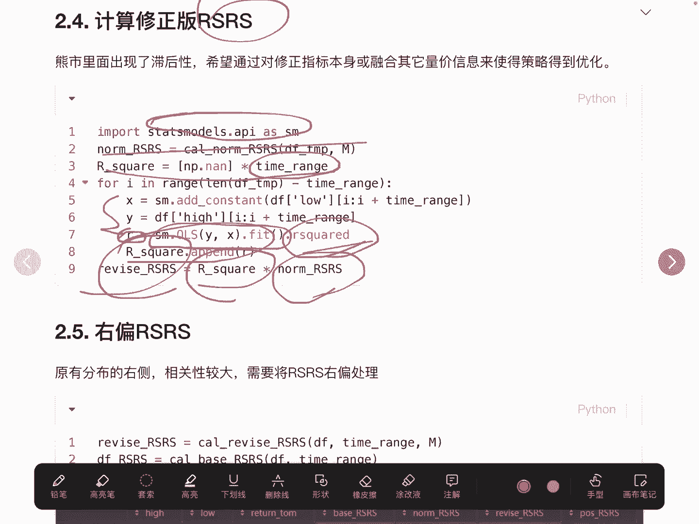

我们再来看最后一个rs它怎么做的呢，他需要将2。4里面的修正版rs乘以，最开始我们技术的基础版的rs，这两者相乘就得到了右偏rs rs因子，这块也是比较简单的好。

我们最终把所有的rs rs因子给他展现出来，第一类是基础版，标准化修正版以及右偏的rs rs因子一共有四个，rs2是因子。

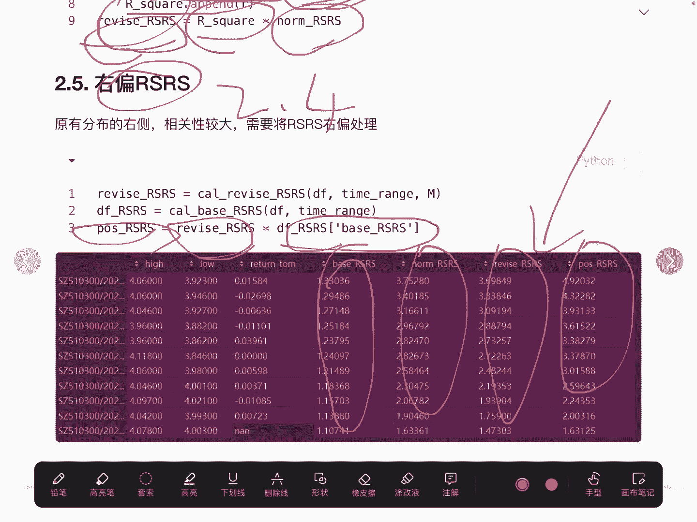

好的，我们计算完成这个因子以后呢，接下来就要去看这四个因子，它具体的表现，也就是通过回车以及做一些相关性，行进一步的论证，这几种因子它的表现到底是怎么样子的，好的以上今天我要给大家分享完整代码。

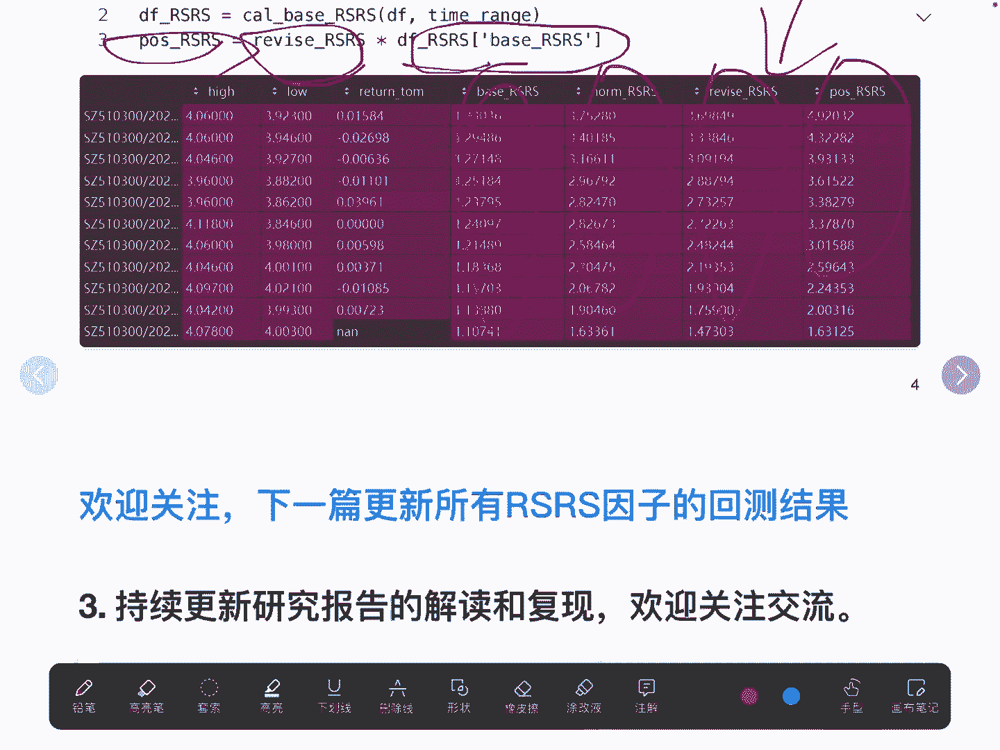

都在文章的下方。

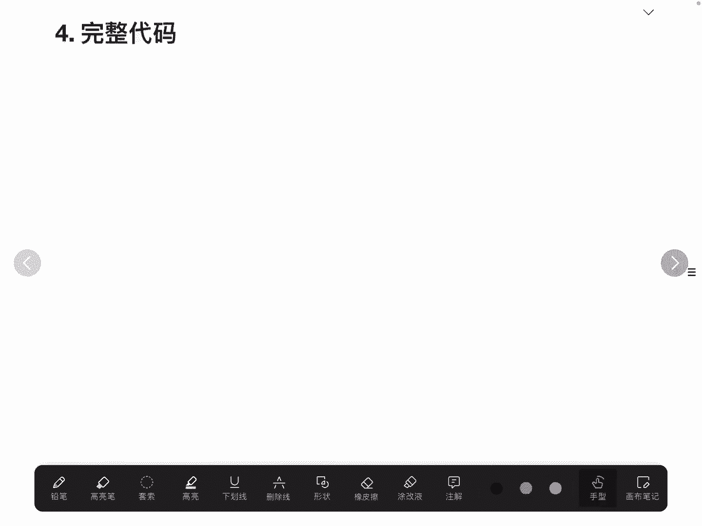

有需要的朋友可以在我的动态里面获取。

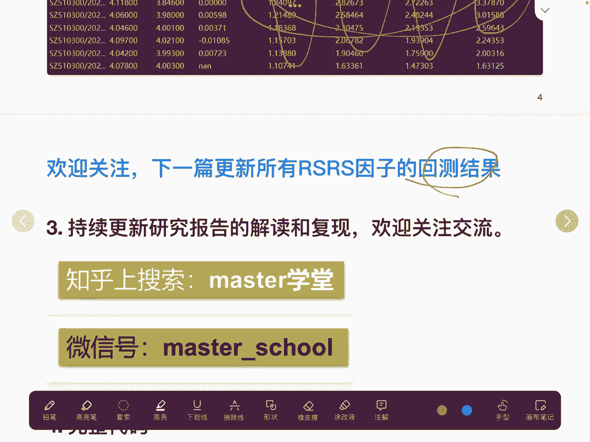