# 【量化交易系列25研报精读】基于CCK模型的股票市场羊群效应研究（大市值表现优异的羊群效应识别模型）下期分享python实现 - P1 - master学堂 - BV1GjDNYNEDq

大家好，欢迎来到master学堂，今天我来给大家分享，国泰君安证券发表的，基于CCK模型的股票市场羊群效应研究，这篇研究报告，这篇研究报告发布的羊群效应识别模型，在大市值里面表现还是不错的。

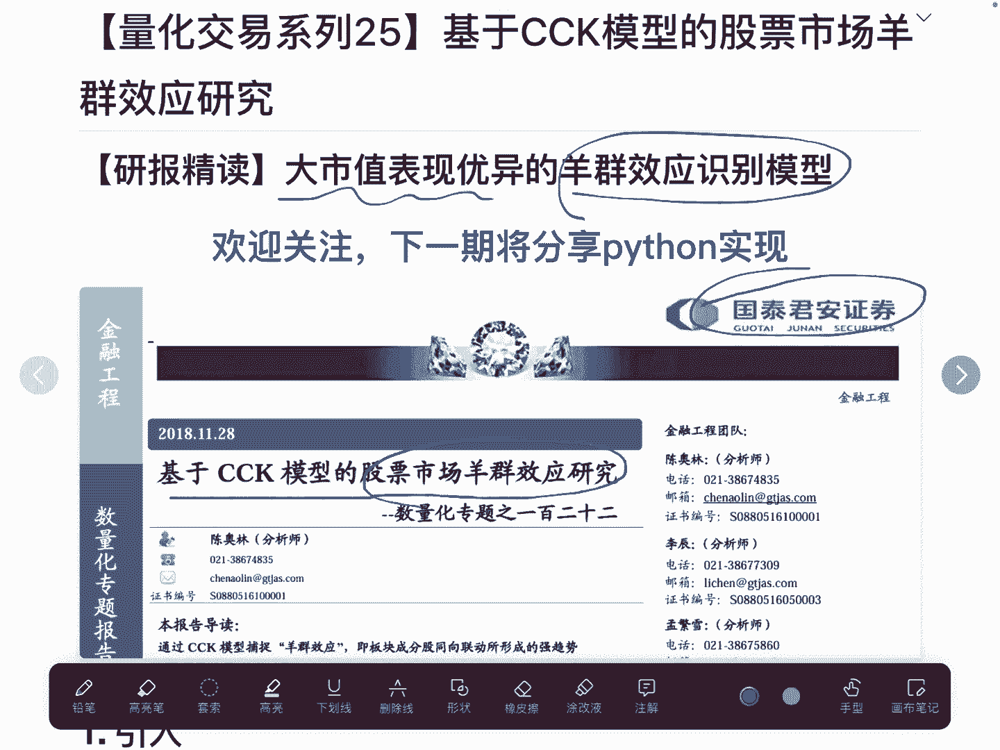

羊群效应指个别股票的暴涨或者暴跌，引起其他相关股票收益率的联动，导致了某类股票暴涨或者暴跌，也就是龙头股的上涨，使得投资者对板块内其他还没有涨的股票，形成了盈利预期，然后开始布局，体现为投阳领涨。

群阳跟涨的现象，如果我们能识别出羊群效应的发生，便有机会抓住该强趋势中蕴含的获利机会，那么怎么去识别羊群效应的发生呢，传统的择时策略，通过大盘的量价数据，宏观经济指标，对大盘未来的走势进行预测。

而我们从板块内部微观结构，也就是板块成分股的表现这一角度入手，去识别羊群效应的发生是什么思路呢，也就是群羊跟涨，也就很多票，一个板块里面很多票它都是跟着涨，就导致板块成分股收益率相关性增强。

大家都是一致在上涨或者一直下跌，那么这个时候呢，这些股票它的离散程度是减弱的，那么反过来我们就可以通过这个离散程度降低，去识别羊群效应的发生。

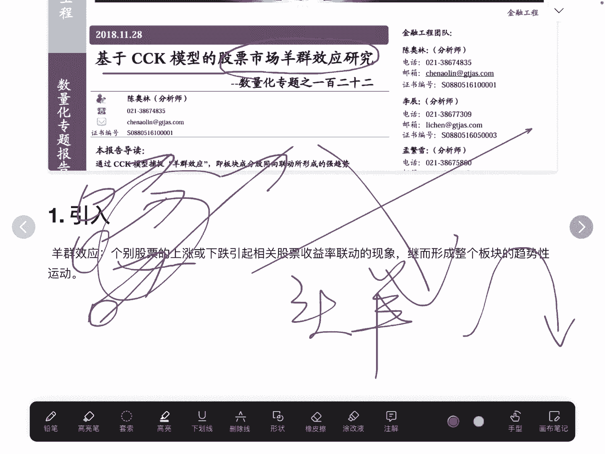

那这就是CCK模型的核心思想所在。

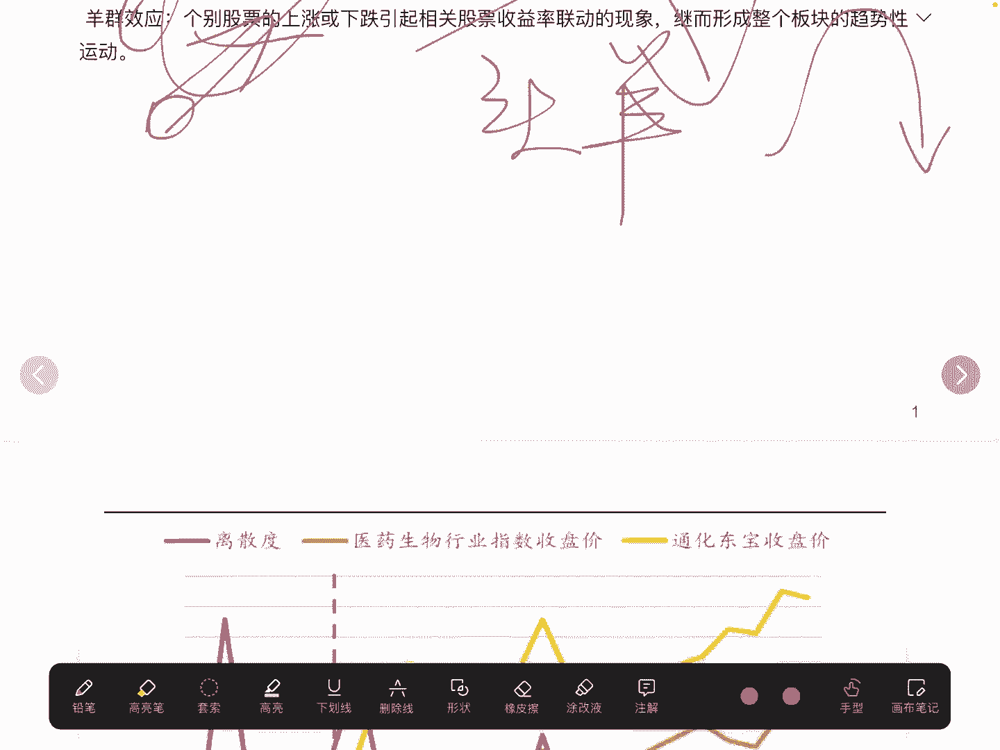

举个例子，我们来看一下医药生物这个行业，它的指数收盘价是呈现一个上涨的趋势，而它是由龙头通化东宝这一个股票进行带动，此时医药生物行业里面的所有股票离散度，用这个蓝色的线表示。

当我们的离散程度越来越低的时候，整体这个行业或者龙头，它都是呈现一个上涨的趋势，那么反过来我们来看离散程度越来越低，是不是就可以说明大家处于一致向上，或者一致向下的这样一种状态啊，其实可以理解一下。

当我们的离散程度一致向下的时候，大家都是呈现一一种趋势，如果他是处于上涨，我们就应该开仓，如果他是处于下跌，那我们就进行减仓处理或者清仓，那我们来看一下CCK模型是怎样的。

CCK模型是在2000提出的，它是指组成成份股的收益率，相对于市场的收益率，它的离散程度的变化去识别羊群效应的发生，在这篇文章里面呢，他首先去证明了，离散程度与市场收益率是存在正相关的。

这块证明的公式比较简单，有兴趣的可以去试一下，这里我就不展开讲啊，它是一些数学的基础，在里面简单的看一下过程，我在这里就提一嘴，学行了，我们先定义离散程度，这个离散程度的公式看起来比较复杂。

它其实就是每一只股票的收益率，与整个行业或者整个指数的收益率相减，然后求绝对值，最终求均值就相当于是每只股票与指数，它们之间的差异的平均值，如果大家上涨的幅度都是一样的，那这个离散程度就是零。

所有股票跟指数的上涨都是一样的，我们先定义好了，这个离散程度与整个市场收益率之间，的一个关系，那我们求期望就直接得到这个公式，进行简单的展开，最终得到了这样一个解析式，我们就求到求个一阶导数。

这就是它的结果，二阶导数等于零，一阶导数是大于零的，说明在理性的情况下，这理性情况指的是没有羊群效应，那么CSAD也就是离散程度，与市场的收益率的关系是一个线性正相关的，因为什么二阶导数是零。

并且一阶导数是正数，是正数，就意味着它是一个斜率向上的一个，正相关的形态。

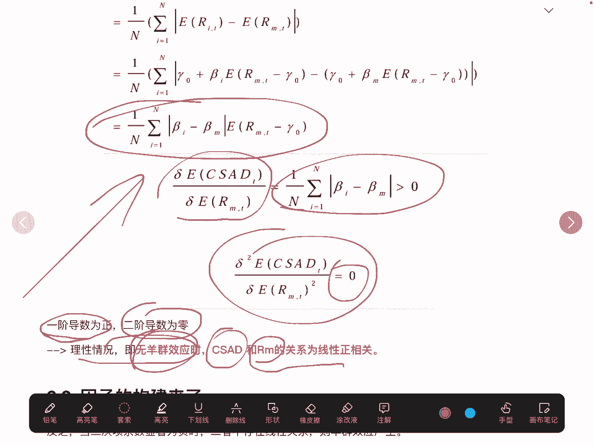

那我们就可以反过来讲说，如果二次项系数显著是负的，显著是负的的，意思就是离散度与收益率是没有线性关系了，因为他是一个二次关系，那么羊群效应就产生了，我们把它写成这样一个式子。

也就是离散度与市场收益率之间的，一次二次关系，所以我们就可以基于这样一个关系，去看是否存在羊群效应，那核心的点就是这个二次项系数贝塔二，如果贝塔二是显著为负，它们就不存在线性关系，那就存在羊群效应。

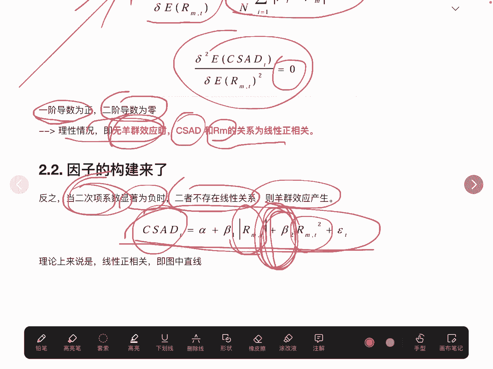

我们来看一下这个图，也就是说理论上来说，离散度与收益率之间是一个线性正相关的，也就是这条直线理论上来是这样子的，但是如果我们的贝塔二是显著为负的，那整体离散度与RM的关系，它就是这样一个抛物线。

抛物线之间的差异，就代表着离散程度，反而是这产生了下降，而这里就意味着离散程度是在下降了，那下降就意味着这里存在羊群效应，那我们有这个结论就很好去做这个事情了。

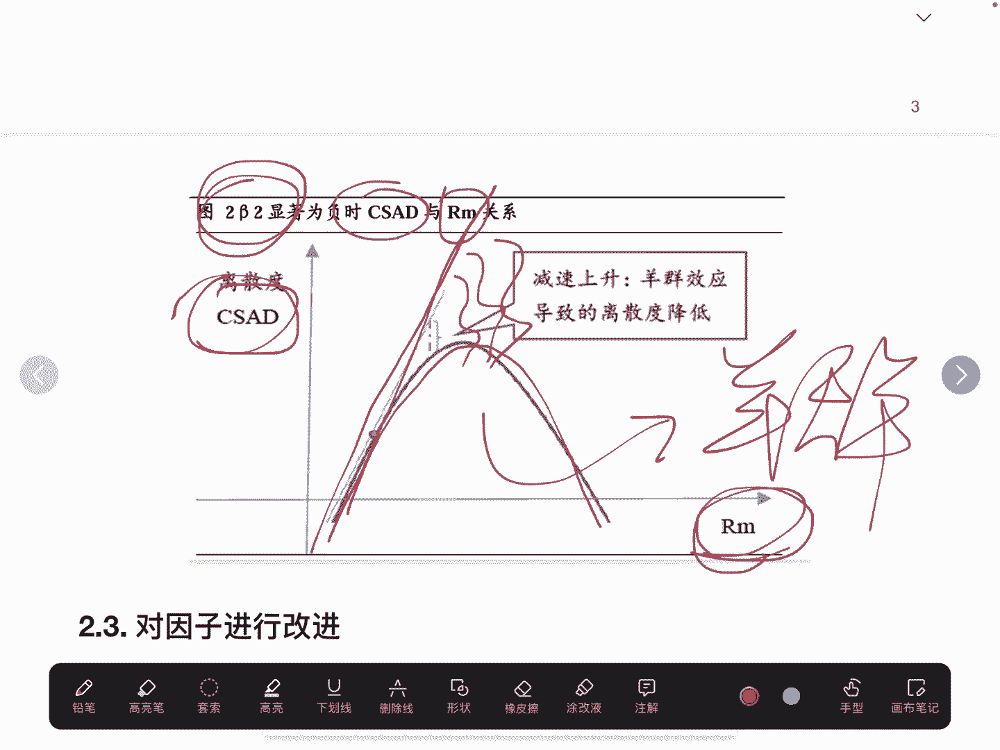

怎么去做呢，我们就直接去求CSAD和RMT，它们之间的礼盒关系，如果拟合出来是一个二次关系，那么它就存在羊群效应，如果拟合出来它是一个依次关系，它就不存在羊群效应。

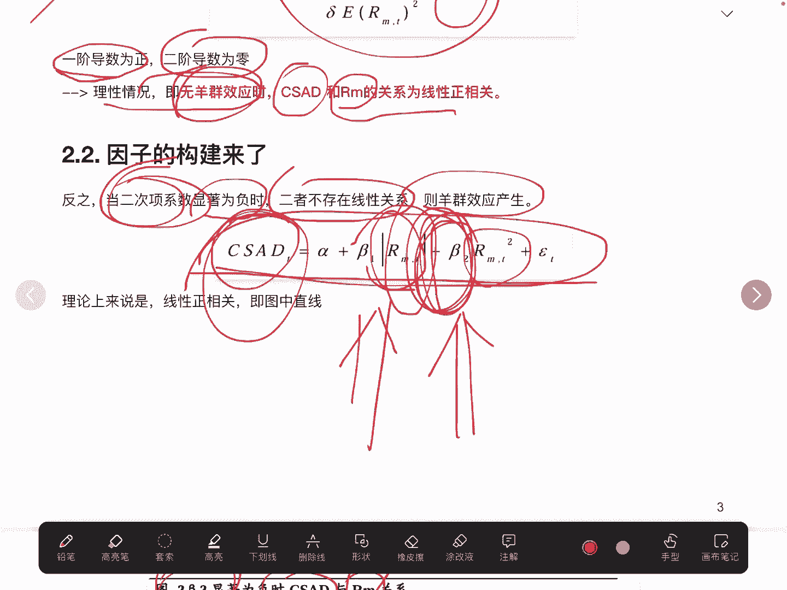

这里就比较简单了，好文章还做了一个改进。

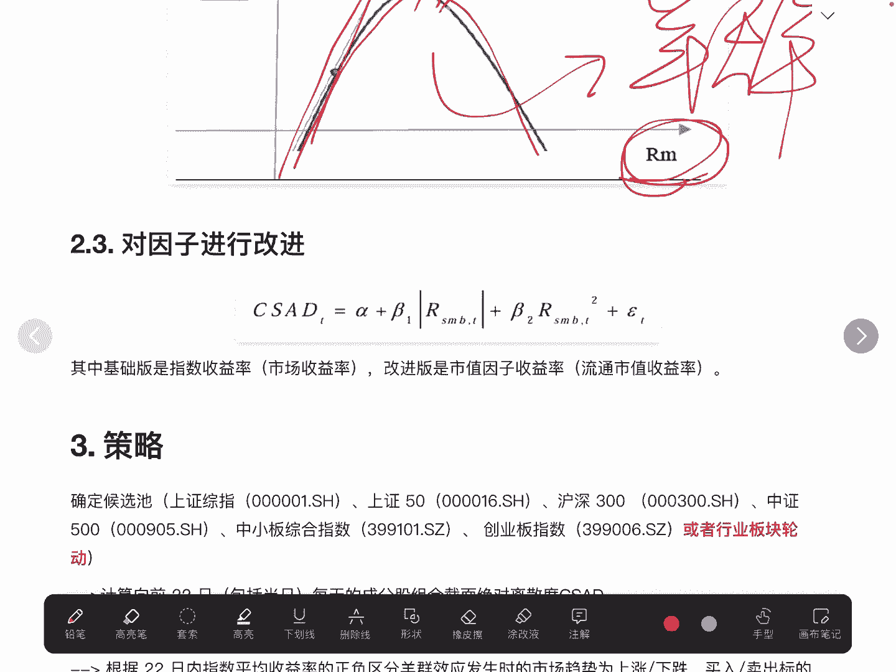

文章的改进呢，就是把这个市场收益率换成了市值因子，收益率，也就是流通市值的收益率做了这样一个改进，为什么呢，因为作者认为这个市值整体上的市值，就体现了各种风格的因子，我们用最终一个综合的指标去看好。

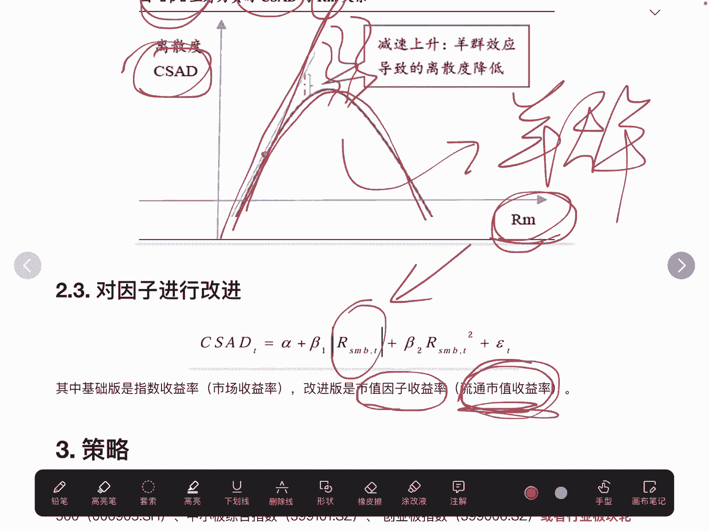

我们来看一下这个策略怎么去走啊，首先我们选一个候选词，这里候选词可以是各种指数，这里有上证五零，沪深300指数等等，当然也可以去用行行业的板块轮动，所以后期我们在做实盘的时候。

可以去计算每一个行业是否存存在羊群效应，如果存在羊群效应，或者说我们去看哪一个行业，存在的羊群效应是最显著，并且是处于上涨的趋势，我们就去选这一个行业的，要么龙头或者次龙头啊等等。

这就是最终的一个交易的策略方式，好当我们确定好候选词以后，我们需要去计算一个月，这里是使用22天的离散度，去拟合离散度和市值或者市场收益率的，它们之间的一个关系去计算贝塔二，如果贝塔二显著为负。

我们就认为是存在羊群效应，那存在阳趋向于就两种情况，那么市场的趋势到底是处于上涨还是处于下跌，如果是上涨，我们就进行买入，如果是下跌。

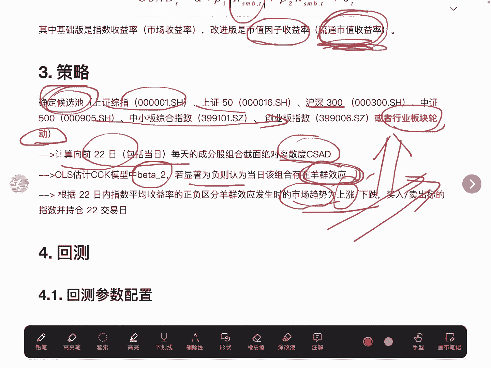

我们就卖出或者清仓，我们来看一下最终的一个回撤的情况，我们回测采用了宽基指数和行业指数，都做了回撤，回时间选用了2007年到2017年手续费，有了建仓的成本是次日均价，这里是比较严谨的。

因为我们再去计算CCK模型里面的，贝塔二系数的时候，我们其实是使用了当天的数据。

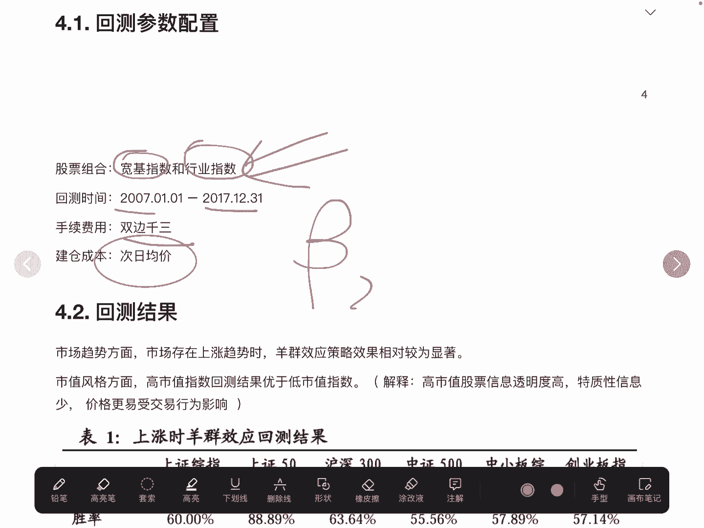

我们当天的数据计算完了之后，我们只能在次日进行开仓，好最终回测的结果啊，我在这里只体现了宽基指数的回测结果。

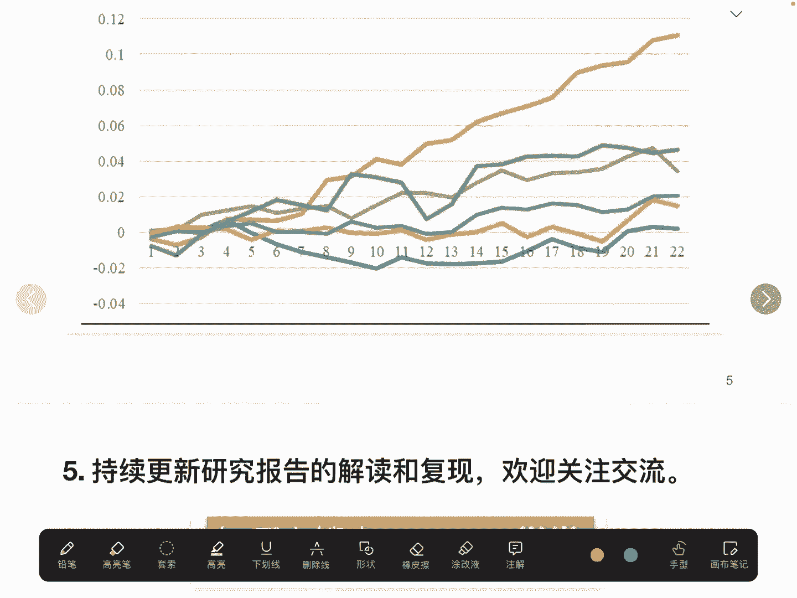

有几点需要说明，第一它是高市值的指数，结果是要好于低市值的指数的，这里怎么体现的，上证五零的这个收益率是显著的，高于什么中证500，中小板这些指数的，包括沪深300都还是可以的，为什么呢。

作者给出了一个解释，认为高市值的股票信息透明度比较高，特质性信息少，价格更容易受到交易行为的影响，第二个证明市场趋势当中，市场是存在上涨趋势的情况下，羊群效应策略是相对来说较为显著的。

胜率是比较高的，88%的胜率，这是他的一个累计的收益率。

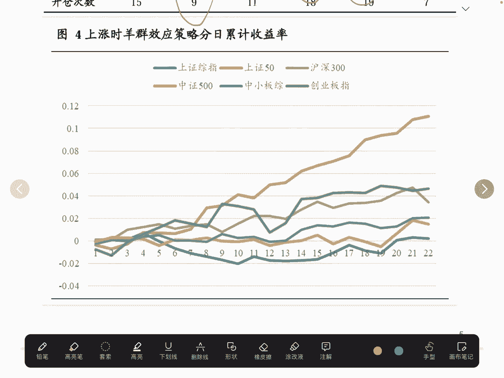

跟刚才的结果是一致的，上证五零是遥遥领先的，在行业指数其实也是一样的。

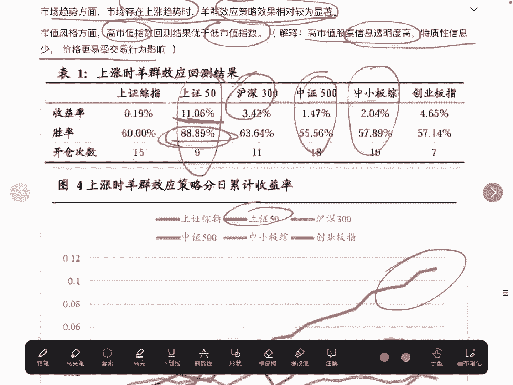

这块我就不罗列了，由于篇幅的原因，好的以上就是今天我要给大家分享的内容。

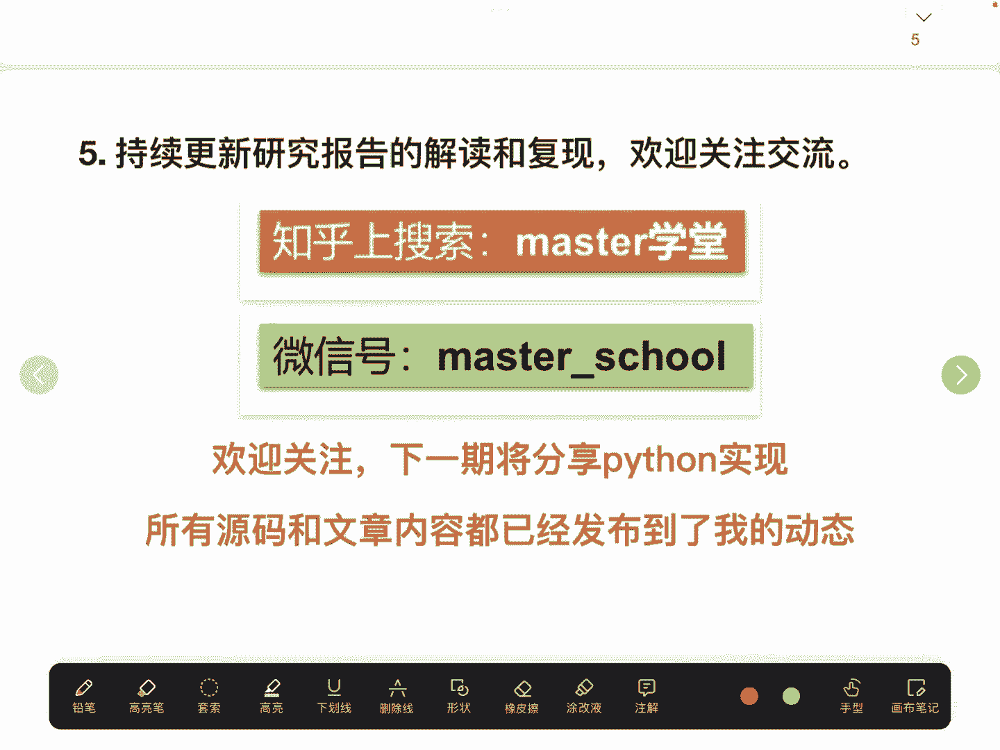

所有的源码和文章都已经发布到了，我的动态里面了，有需要的朋友可以关注交流。

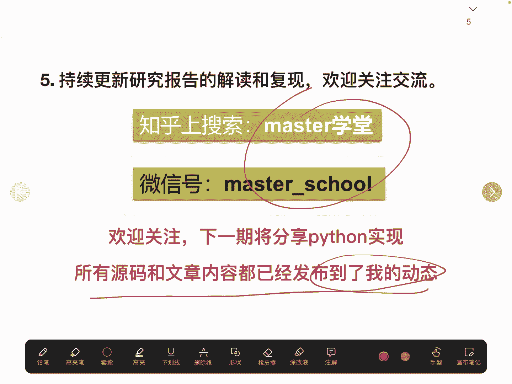