# 【量化交易系列26研报复现】基于CCK模型的股票市场羊群效应研究python复现（源码详见文章末尾） - P1 - master学堂 - BV13gDdYGEgX

大家好，欢迎来到master学堂，在上个视频里面，我们去精读了国泰君安证券的这篇研究报告，识别羊群效应，那么在这个视频呢，我将分享怎么用Python去识别股票市场的羊群效应，这是最终的择时的结果。

我们来看一下我们其实重点关注的是什么，在策略空仓的时候，是否抵御了整个行情的大跌，举个例子，比如说这一段，他确实抵御了这个指数的大跌行情，像这一段它也确实抵御了，看起来效果还可以好的。

接下来我们就来看一下整体怎么去复现，这篇策略，ACK模型是2000年提出来的，他的核心思想就是利用成份股的收益率，相对于市场的收益率的离散度的变化，去识别羊群效应的发生，它分成了两个步骤。

第一步是计算绝对离散度，CSADCSAD的计算，就直接使用成分股里面的收益率，减去指数的收益率，最后求整个这个差值的均值，在计算得到离散度以后，文章做了一个礼盒，把cad当成因变量，把收益率看成自变量。

去拟合一阶和二阶之间的关系，最终我们要拿的是二阶的这个系数，作为评判羊群效应的一个评价指标，那策略的做法呢，就是基于这个贝塔这个值，来认为是否存在羊群效应，如果存在羊群效应，并且市场的趋势是上涨的。

我们买入持仓相反，如果说存在羊群效应，并且市场是下跌的，我们将会卖出标的或者空仓，处理好的多说啊，直接看怎么去复现，第一步。

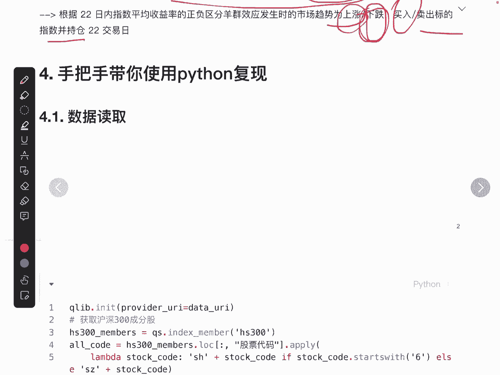

数据读取，这儿就用得比较多了，只是简单提几嘴，第一我们要去获取沪深300成分股，在这里我们调用了index member这样一个API，获取了沪深300的成分股。

一共有300只股票作为我们原始的300只股，并且我们还在加了一个沪深300ETF，所以一共就有301只，姑且认为是股票吧，去获取这301只股票的数据，这数据核心的一点就是，每一天它的收益率是多少。

当然还有沪深300ETF，它每一天的收益率，这个是作为指数的收益率进行处理的。

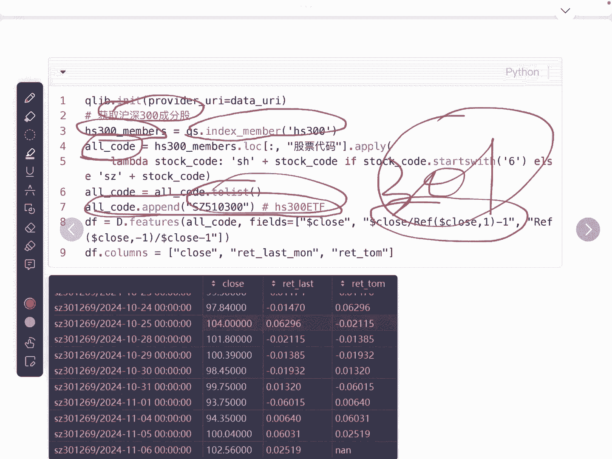

最终我们会拿到这个数据，但这个数据也是我自己去，每天会自动的去更新的，现在是11月6号的最新的数据，沪深300以及300只成分股的这个数据，一共有三类收盘价，过去就是从当天往前数的收益率。

还有就是未来一天的收益率，未来一天的收益率是作为回撤的时候。

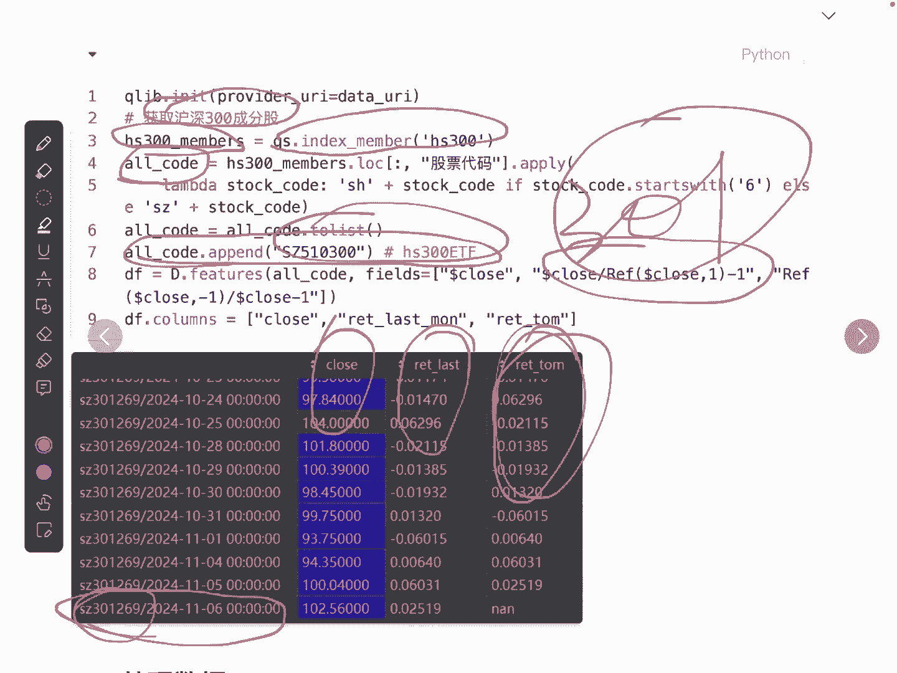

我们要使用数据的读取比较简单，我们就直接来看怎么去处理，在计算贝塔这个因子之前。

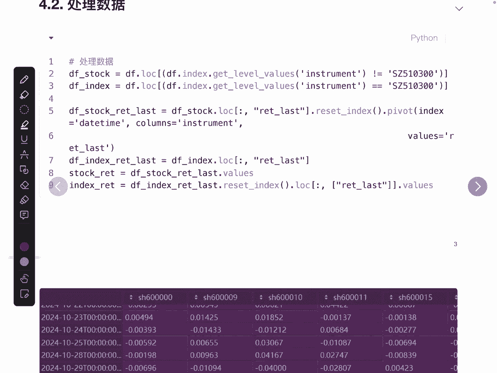

我们要将数据处理成这样一种形式。

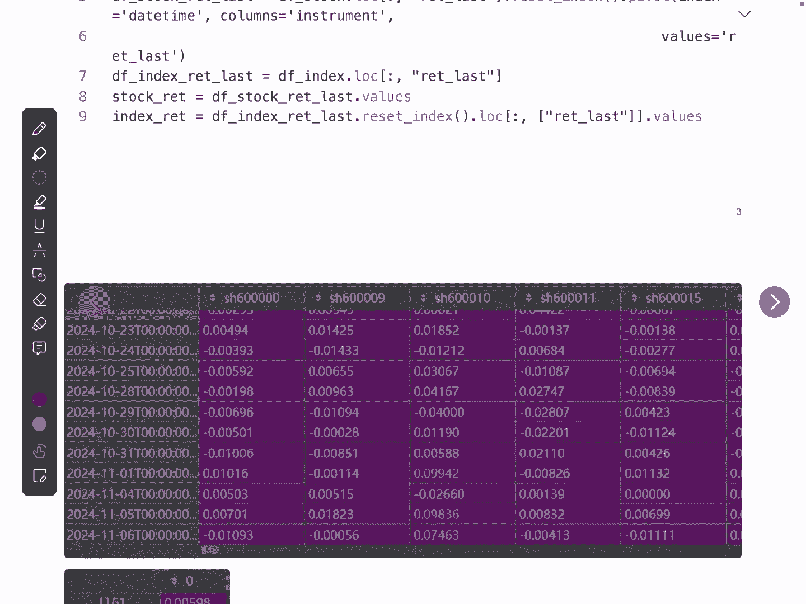

首先是每一只股票每一天的收益率，比如说这里一共就有300列，这300列就是代表着300只股票，每一天他的收益率是多少，当天的收益率，这是处理成第一个数据形式，第二个数据形式呢要处理的是指数，在这里啊。

我们就以沪深300，这个ETF的每一天的收益率，作为这个指数的收益率。

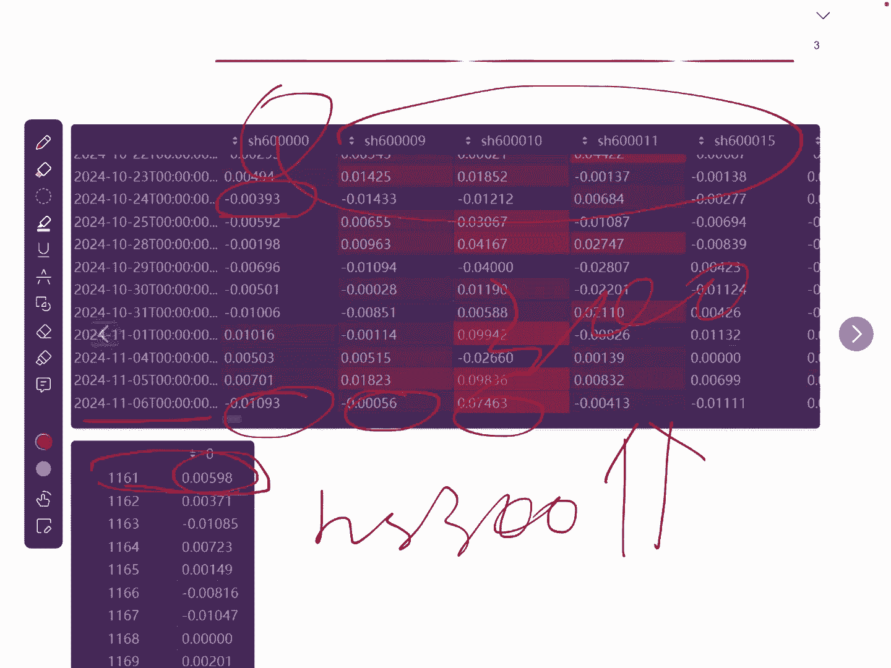

那我们具体看怎么去处理，首先我们要将沪深300和股票区分开来，在这里我们取的是股票，也就是代码不等于沪深300ETF，在这里我们取的是指数，也就是代码是等于沪深300ETF，我们就将这两者进行了分开了。

分开以后我们再来将股票做一个处理，因为股票的数据形式还是这样子的，它是一个二级索引，第一集是股票，第二集是时间，我们只需要中间的这一列，所以我们直接去获取中间这一列的数据，我们重定向。

然后使用pivot这样一个API，将数据索引变成时间列，名变成股票值，变成收益率，就得到了下面的这个数据形式。

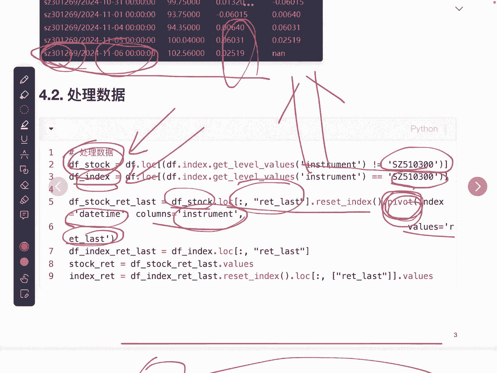

那么第二个指数的处理就比较简单了，因为它只有一列数据。

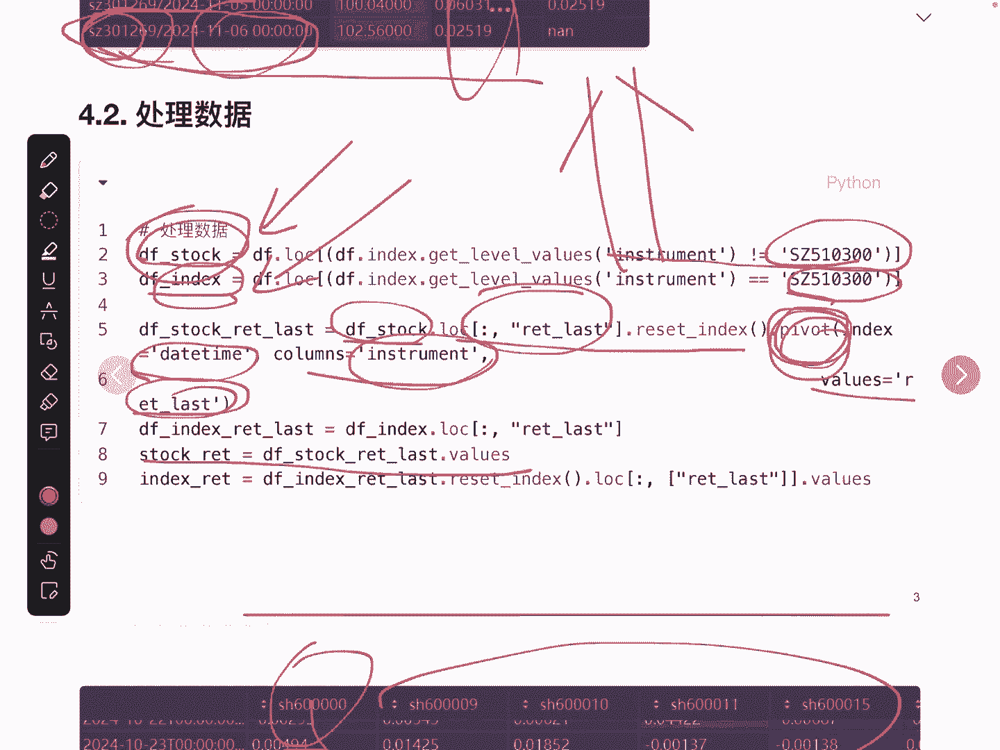

这里大概看一下就行了，好处理完数据以后呢，我们就要计算贝塔，我们回顾一下贝塔要做两个事情，第一个要去计算离散度，第二个要去拟合最终获取系数，首先我们要去计算离散度，离散度比较简单，就直接是两者相减。

剪完之后求绝对值，求了绝对之后做一个均值处理，在这里有一些小trick在里面求均值，因为涉及到有些数据啊，它是空的，或者叫拉塔number，这支股票可能在当时并没有上市，或者说他是处于停牌的状态。

我们需要将这些数据进行处理的方式，使用这个API去求和，然后再除以一共的个数，这里的个数一定要去刨掉not a number的这些数据，然后就得到了我们的离散度CSAD。

这就是作为Y也就是作为因变量处理，我们再来看自变量，自变量有两个，第一个是股票收益率的绝对值，第二个是股票收益率的平方好，这两个我们都已经获取了，获取完了之后，我们就去做一个礼盒。

在这里我们使用了NP点NLOGLSTSQ，也就是最小二乘法，我们去进行拟合，得到贝塔系数也就是一这个元素就是贝塔系数，那这就是最终的贝塔的因子计算，得到贝塔因子以后，我们要去上策略。

也就是去计算每天是持仓还是空仓的信号，按照研报的这个说明啊，如果说贝塔是小某于一个阈值，我们在这里默认阈值为一，并且市场是处于上涨的状态，上涨也就意味着过去的收益率是大于零的。

这个时候我们就进行持仓处理，否则我们将进行空仓处理，策略里面提到我们是使用月频率进行交易，也就是说当我们每个月的刚开始，如果说是清仓处理的话，那么后面的每一天数据都是空仓。

那如果某一天的数据是持仓处理的话，也就是为一，那后面的每一天都将会赋值为一，这就是最终的JK信号，同样我们使用了一个基础信号，这个基础信号就是每一天都是持仓的，那每一天的持仓信号获取完之后。

我们就可以去计算净值曲线了，净值曲线这个函数，我们在前面的视频已经提到过了，这块儿我做了一个抽象，大家其实可以直接拿这个函数去用就行了，我们只需要传输这个数据，前面计算得到的持仓或者空仓信号。

以及第二天的收益率，直接去调用就可以了，这里我们计算了一个是没有手续费的，还有一个是有手续费的，当我们静止曲线计算完成之后，我们就要对这条静止曲线进行可视化，在这里我将可视化的函数进行了抽象。

它的具体的函数呢，这个show pick也是比较简单的，我们直接看一下它的结论，红色的代表的是使用策略回测的信号，而蓝色的是基础信号，可以看出，基本上这种空仓处理，还是躲避了很大的一个熊市的。

最终我们调用风险报告函数进行回测，得到整个策略的一个详细情况。

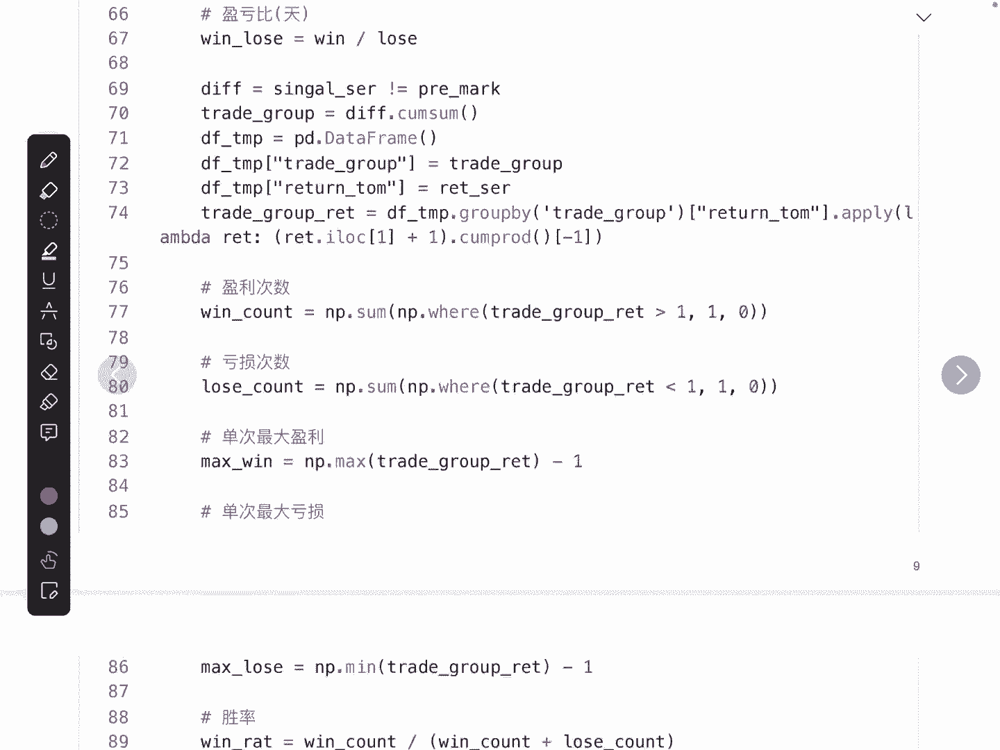

包括年化收益率回撤呀。

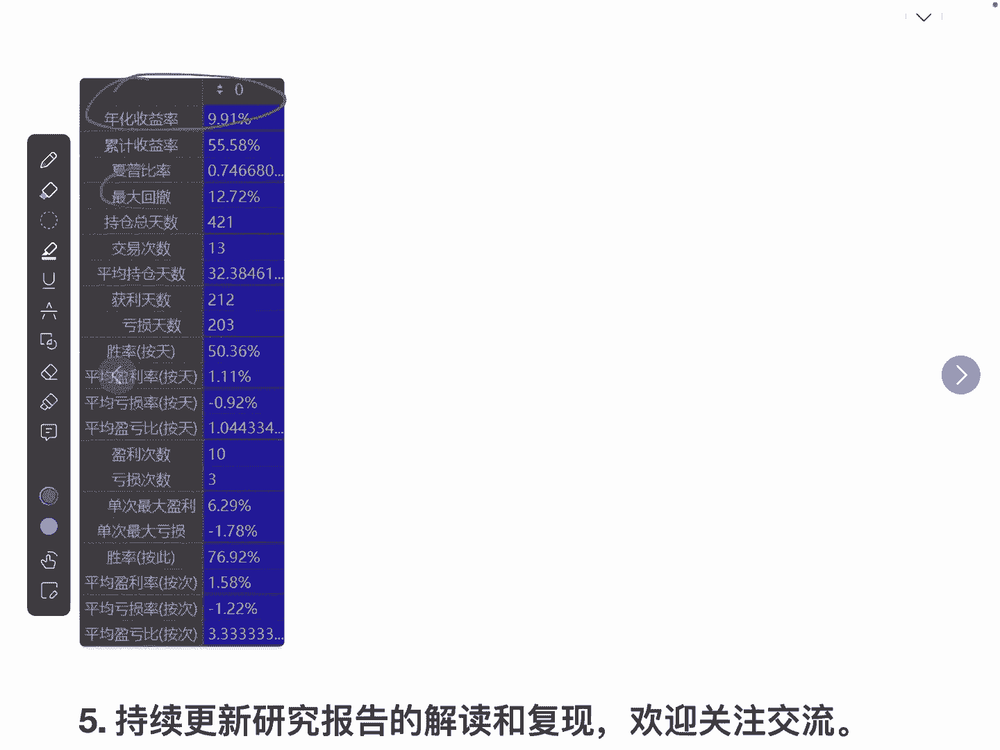

持仓天数，交易频次等等，好的，所有的代码都分享在了文章的下面，大家有兴趣的朋友可以进行复现，也可以将它融入到自己的策略里面，好的欢迎大家进行关注交流，所有的源码和文章的内容，都发布到了我的动态了。

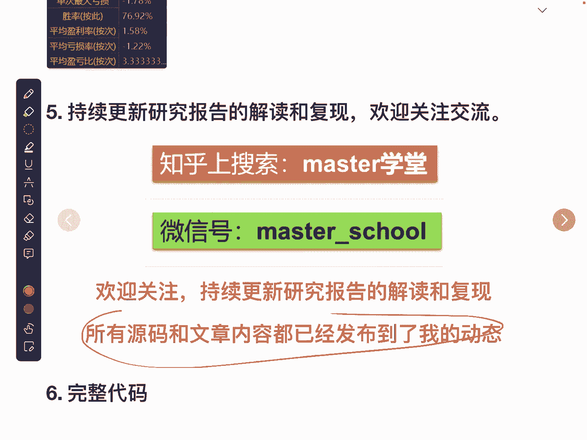