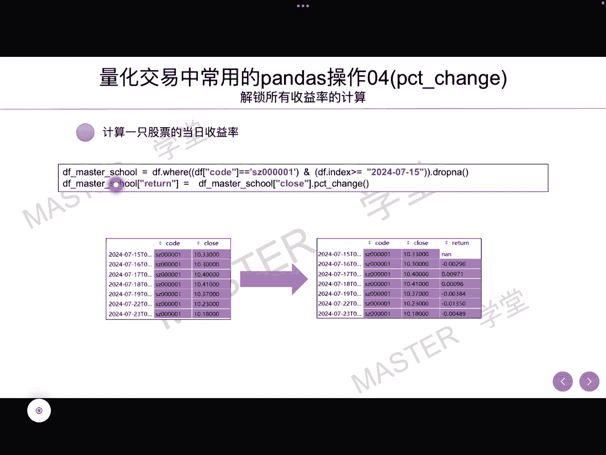
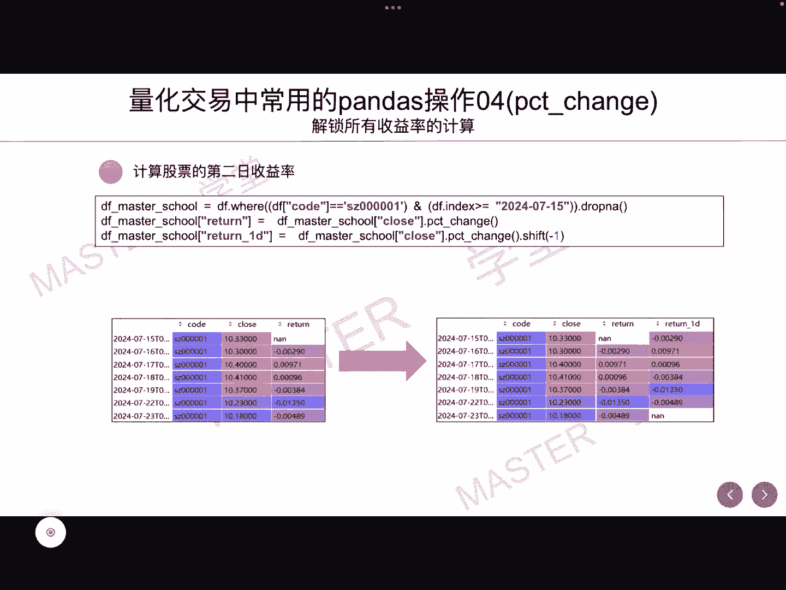
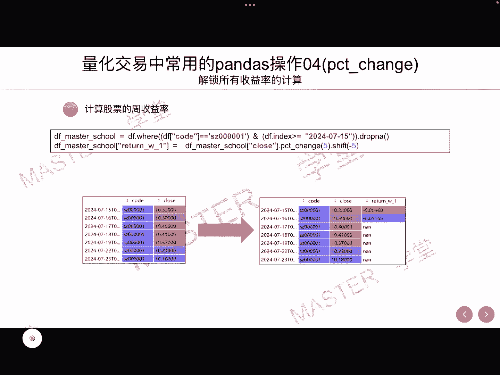
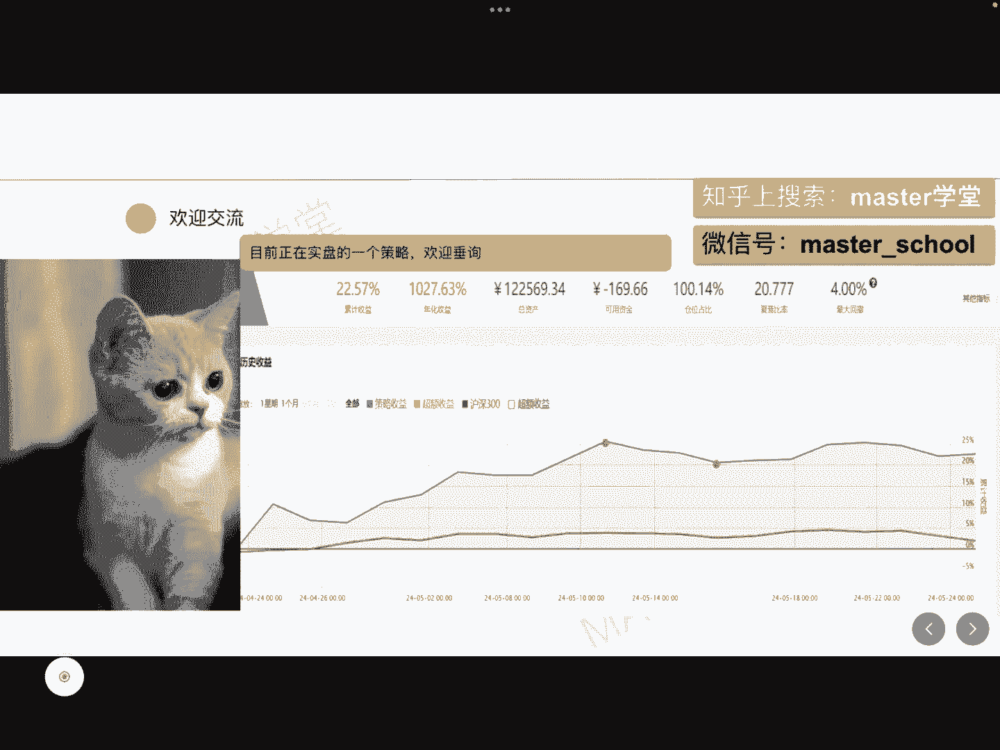

# 【量化交易系列8】量化交易中常用的pandas操作04（pct_change）解锁所有收益率的计算 - P1 - master学堂 - BV12S411w7G3

大家好，欢迎来到master学堂，我们在做量化交易的时候，比如说我们在使用机器学习，去预测一只股票的涨跌情况的时候，都需要计算它的标签，那所谓标签最常用的就是计算股票收益率，那收益率有很多种。

比如说当天的收益率，未来一天的收益率都收益率，今天我们就使用pc t chain这个API来计算股票，当日以及多只股票，还有次日以及周收益率，希望通过这个视频，能够了解到所有收益率的计算方法。

今天所讲的所有代码都将会同步到我的GITHUB上，给定一只股票，它的收盘价以及日期，比如说我们要计算7月16号收益率，那么就使用7月16号的收盘价，除以7月15号的收盘价，在这里就是10。3÷10。

33，再减去一就等于负的0。002，同样7月17号，7月18号等等，后面的收益率都可以通过这种方式进行计算，那在Python当中，我们可以使用一个循环去计算每一天的收益率。

但是在pandas里面它有一个函数。

这个函数呢就是p c t change，我们直接调用pc t change，以及需要告诉pc t change，GE使用的是收盘价，这一列两个一结合就可以得到我们的收益率。

我们把它复制到return这样一个列里面，这就是最终的计算结果，但这一行代码是表示，我们选取的是7月15号以后的数据，以及股票代码是使用00001的股票，这就是一只股票的收益率。

那如果说要计算多只股票呢，这里我们将会使用group by这样一个函数进行组合，在这里我们取了000001和600000，这两个代码，或者说是这两个股票的收盘价，那我们首先对它进行一个分组。

那group by code就是基于股票代码去进行分组，在这里其实就分成了两组，那有几个股票就分成了几组在对，每一组在使用PCT信息，我们可以简单验证一下，可以看到的是000001。

和我们前面单独使用这样一个股票的收益率，它的结果是一样的，这就是同时计算多只股票的收益率的方式。

那么第三种假设，我们要去计算未来一天的收益率，这个其实在机器学习里面是非常常见的，因为它是作为一种标签进行处理，这个时候呢，我们会把计算好的收盘价的这种收益率，比如说我们现在计算得到。

7月16号当天的收益率，其实它应该放在7月15号的，未来一天的收益率的位置上，那在这里我们就使用shift这一个API，我们向前平移一格就得到未来一天的收益率，大家可以验证一下，7月15号未来一天。

也就是7月16号，它的收益率就是负的0。002。

那同样这里计算周收益率，这里需要注意的是啊，周收益率这里用PCD清几，比如说五就是未来五天的收益率，这里大家想一下，为什么不能够使用PCD清机五，而是指使用的是PCD清洁五，再加shift-5。

这两个API共同操作，最终得到的结果是未来的周收益率，大家可以想一下，或者去实践一下。

为什么采用这种方式，而不是直接采用PCD清洁服务好的，以上就是我今天要给大家的分享。

