# 【量化交易系列9】量化交易中常用的pandas操作05（pool）引入并行计算提高执行速度 - P1 - master学堂 - BV1wJsueEEPg

大家好，欢迎来到master学堂，今天我要给大家分享的是在量化交易当中呢，我们怎么去引入并行计算，提高执行速度，那么今天主要是讲铺这样一个API，今天所讲的所有代码都将会同步到我的GITHUB上。

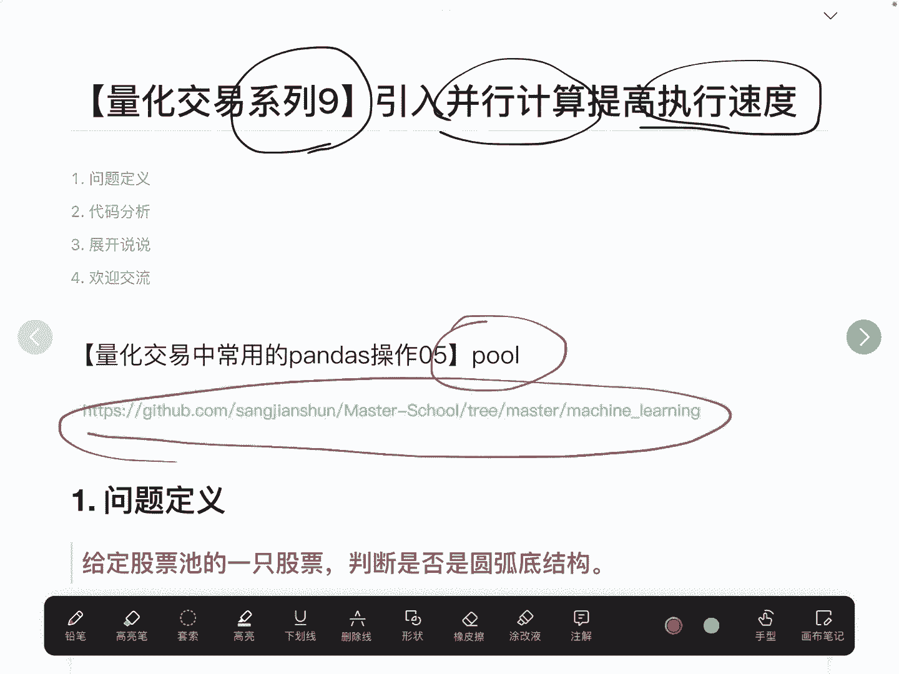

首先我们来看一下这个问题是怎么产生的，最近我在看一篇研究报告，这篇研究报告呢是要去计算一个股票。

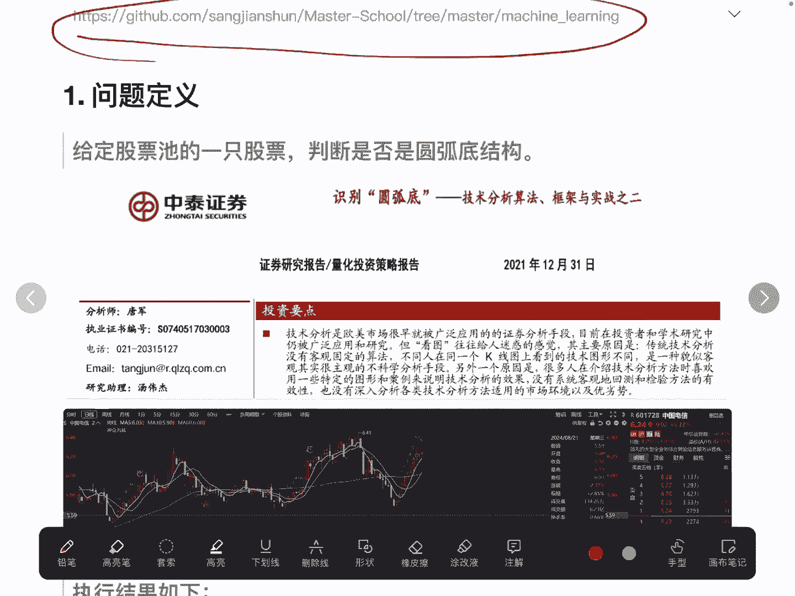

它是否是圆弧底结构，而所谓的圆弧底结构呢，看起来就像是一个碗一样，那在绝大多数情况下，这种圆弧低结构，其实已经走成了一种向上的一种趋势。

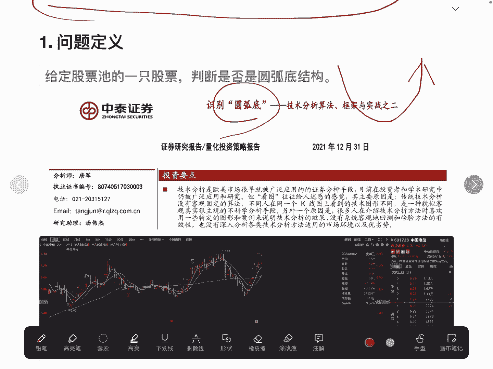

我们来看这只股票，中国电信，那大家可以看到啊，它这个图形啊，日线图就是一个圆弧底结构，那么圆弧底结构呢，大概率就是一种底部的一种判断，也就是说当我们的股票是圆弧底结构的时候呢，其实是有一些机会在里面的。

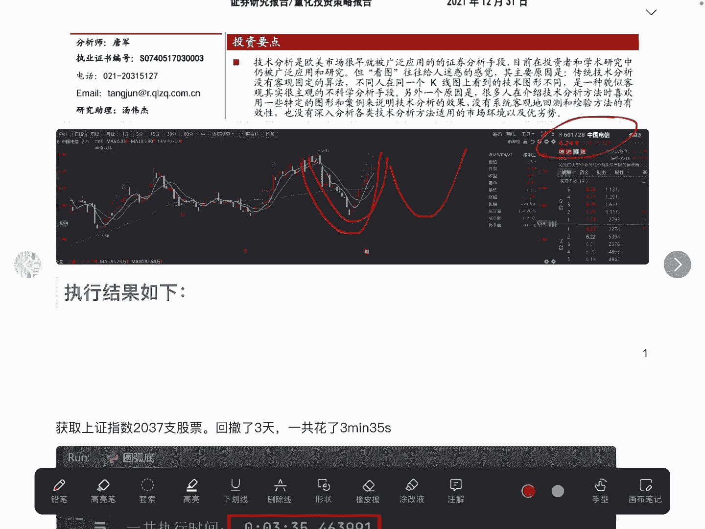

那我把整体的代码给他复现，完了之后呢。

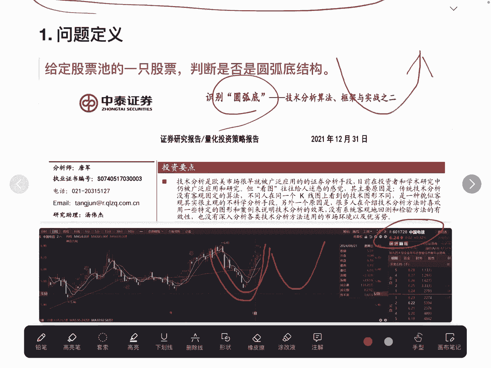

去执行了一下，结果发现我取上证指数，一共有2037只股票，但可能做了一些筛选啊，这2037只股票我回撤了三天，也就是最近的这三天一共花了3分钟，那么如果说我要去回撤一年的时间，也就是判断一年的时间里面。

股票池是这么多股票，那么可想而知啊，得花多长时间可以大概估计一下啊，股票池如果选择是5000多只股票，要整个市场当中的股票的话，那么得花好几个小时，那我们是否可以去减少这些时间呢。

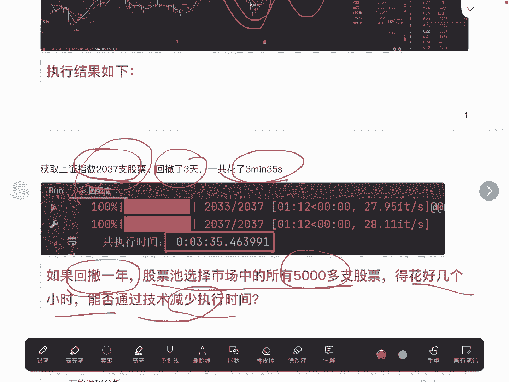

回答是肯定的啊，我们先来看下源码，我们自己去实现了这样一个函数，也就是去判断这个股票是否是圆弧底结构，这里有几层循环两层，一个是时间时间没有跑的啊，这里我去复习了三天，或者叫回撤了三天。

这个DF差是代表所有股票，或者说我们候选词里面的所有股票，我们去依次便利，而这里的依次遍历呢，它其实是一个顺序执行，是一个串行的处理，什么是串行处理呢，我们股票一啊执行完了之后。

判断完了之后再去判断股票二，这样按照顺序去进行执行，那能不能因为股票和股票之间的判断，他们之间是不会有影响的，那能不能让这些股票同时去执行呢，那在Python里面呢，我们就要利用pro这样一个API。

将我们的判断逻辑呢变成一种并行处理好，大家可以看一下这两个代代码的对比啊，其实改动的部分其实主要是在这，在这一行的执行里面，我们还是for循环，一个是时间，第二个是股票，所有的股票。

在这里我们引入了multiprocessing里面一个pool，我们去这是一个指定参数，比如说十个进程，那么有十个股票在并行处理，然后其他代码其实是一样的，这里我们要加上这两行。

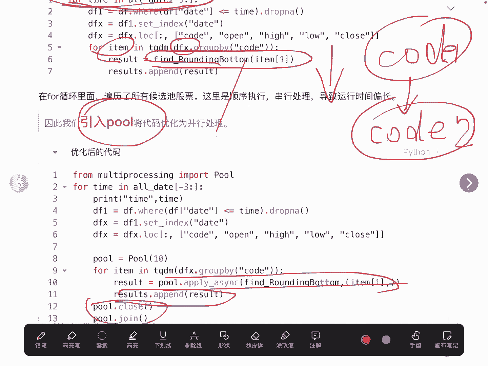

后面我们会讲啊，为什么要加上这两行，那我们来看一下最终的一个结果啊，刚开始是啊，同样的三天2000多只股票，我们最开始没有使用并行处理，是3分钟，我们使用并行处理之后呢，运行时间只有51秒。

效果是非常显著的，如果我们的算力或者说电脑的性能比较好的话，我们可以把这个进程数设置多一点，它跑的会更快，OK这就是整体的一个优化啊，大家如果说在以后，有其他的一些函数在里面的话，它运行的比较慢。

也满足说不同的这种循环，它们之间是相互不影响的，都可以改为并行处理。

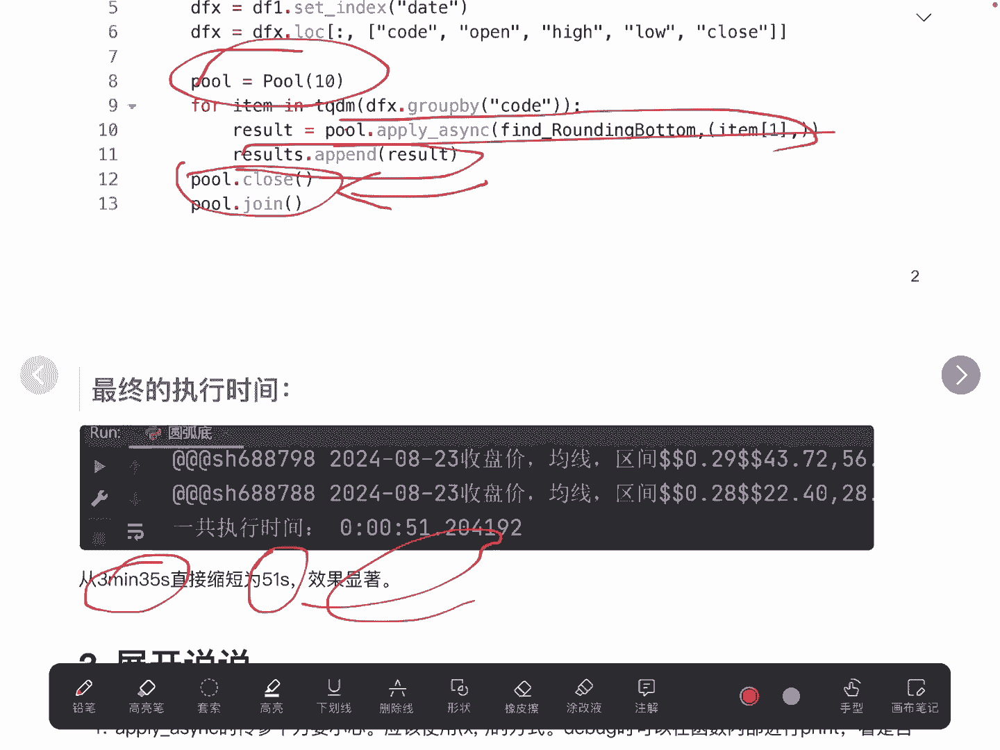

我们有几点需要说明的，第一个我们其实是调用的pla sense的这样一个API，实际上呢，poor里面它还有一个apply的这样一个API。

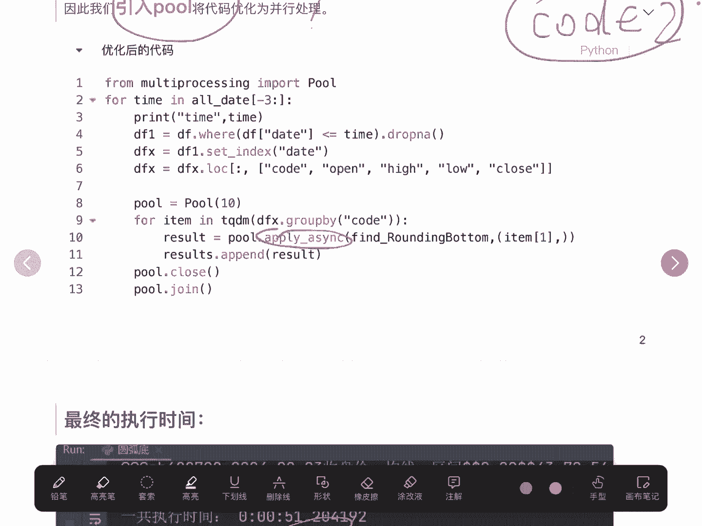

apply是没有办法去执行并行的，它只能是串行这块要小心啊，不要用到用成了apply，而第二一点呢在使用我们这个API的时候，传参一定要小心，我们应该是使用这种形式啊，括弧X逗号的这种形式。

如果说不是用这种形式的话，传参会传失败，我们在debug的时候呢，我们可以在函数的内部用于打一些print，看是否准确传参了，那第三个刚才不是讲，为什么用pull点close和pull点join呢。

是因为如果说我们不加这两个的话，那主进程它可能便利的时候就已经执行完了，那这个时候子进程都还没有跑完了，那主进程结束了，主进程结束了，整个程序就结束了，所以说我们必须要在这里使用这两个API。

相当于是要等一下子进程好的。

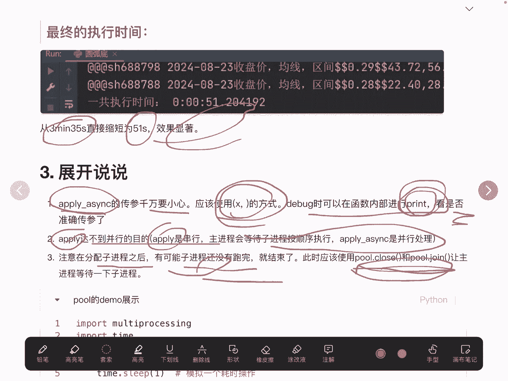

最后是一个pl的一个demo，简单的看一下这个demo，这个demo我们定义了一个函数，这个函数呢我们给他使用了一个sleep1，相当于是一个耗时的一个操作啊，相当于这样的话这个函数就非常的耗时。

那么我们在遍历十个数的时候啊，去执行这样一个函数，如果我们顺序执行的话，你这个例这个一的话，那不就是有十个一吗，需要这种顺序的去等待，但是我们使用并因处理的话，他一次比如说这十个刚好就所有的这个进程。

一下子就给他并行跑完了，那这样的时间就很简单，大家可以看一下啊，这儿有一个展开我们的这个结果，最终我们是可以通过这种方式去获得任务的，结果啊，有兴趣的同学可以去考一下这个程序啊。

当然后期的话它其实是一个框架呃，后期的在使用到自己的代码里面，也是可以基于这样一个呃代码进行一个修改的，最后欢迎大家通过搜索进行交流啊，这是我目前正在实盘的一个策略，效果还可以啊，回撤只有10%。

今年的累计收益也还不错，好的。

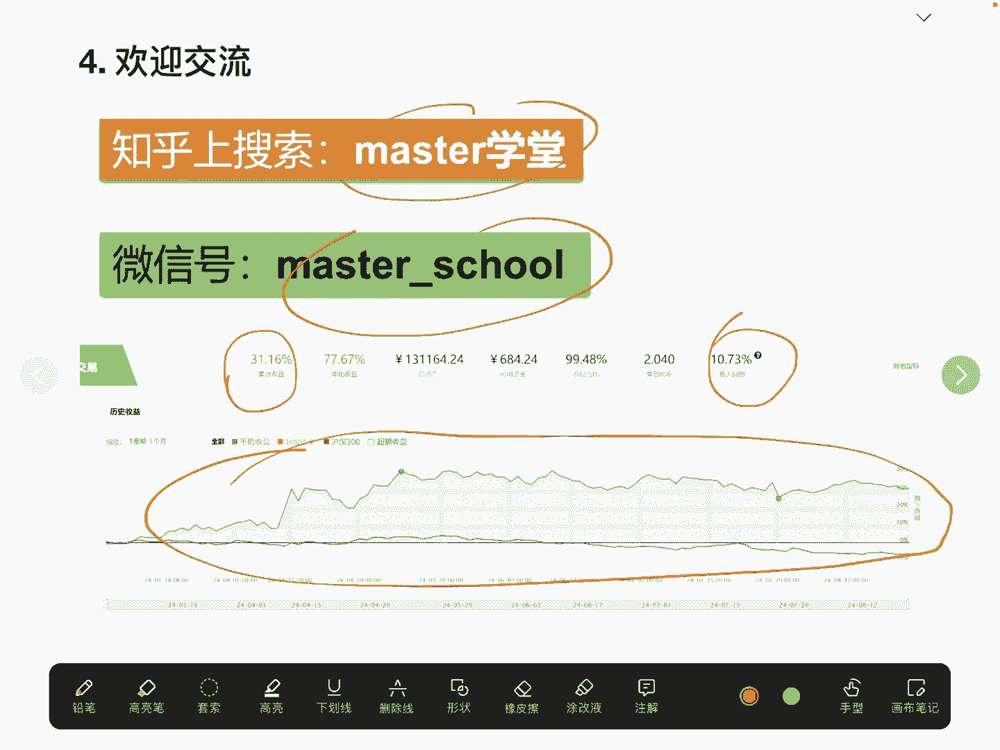

以上就是我要给大家分享的内容。