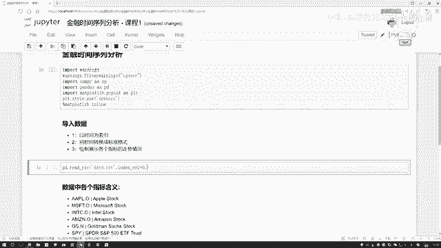

# 【金融数据分析】这太完整了！python金融分析与量化交易实战课程，全程干货无废话，入门到精通一步到位，(数据挖掘分析大数据金融股票) - P1：量化交易课程介绍 - python可视化之路 - BV1omkHYBEiG

这节课来给大家说一下，怎么样用Python去做金融时间序列的分析，先给大家看一下咱们的数据啊，来理解一下这个时间序列啊，它是长什么样子好了，打开一下我们的数据啊，在数据当中啊，大家很明显能看到啊。

有很多个列一个来说吧，第一点叫做一个我们的日期吧，那你说啊，我们的时间序列，肯定随着时间它要发生一些变化吧，这个时间啊可以是按天的，按周的，按月的，按年的，按什么都行。

只要我们的数据是随着时间发生变化的，哎我们就可以管它叫做一个时间序列好了，这是我们的数据啊，当中哎有某些天的一个指标，从这个10年啊一直往下去统计，统计了好多啊，一直到这个18年的一个中旬，统计什么呢。

都是啊，各个股市当中一些指标给大家来看一看，有这个苹果的股价，还有这个微软的，还有亚马逊的啊，还有一些其他公司的股价，后面呢还有各种各样的一些其他指标，这指标可能啊，比如说一些黄金价格。

还有一些就是交易的各种各样的指数，还有货币兑换的一个汇率之间的一个变换，这些指标如果大家不太熟悉诶，没看过这些缩写也没关系啊，咱们主要是以前几个骨架来给大家举个例子啊，看一看怎么样Python去操作啊。

咱们的时间序列去做一些计算，还有统计的工作，这个啊是我们现在拿到的一份数据，然后呢接下来我们要对数据啊做很多种操作，在操作过程当中啊，我们讲解是这样，你看这块，我已经把咱们每一个模块给大家列出来了。

并且每个模块当中我列出来了这么1234哎，可能有几点每一点啊，都是我们一步一步要去完成的一些小任务，那咱们也是按照我现在列出来这个啊，就是一个步骤吧，或者说按照我们列出来的，要完成一项一项小任务。

咱把这件事啊给他做出来好了，我们一个去写啊，首先第一步哎导入这个工具包，这都不用说了，导入南派pandas，my plot啊，一些最基本的工具包，咱之前讲过太多了好了，第一步咱们要导数据。

并且呢我们在导数据的过程当中啊，要怎么样，你看我这里写了，不光我们要导数据，你看我第一点写个要求要什么，以时间为索引吧，那这一回那我们来写一下吧，首先我们去read一下这个CSV是吧，data点CSV。

然后呢我们需要指定一个参数，这个参数啊要帮我们去扣指定一下，就是当前你是以谁为索引吧，好了，我把这个参数写进去，就是我们的一个index index当中啊，需要你去指定用哪个列当做我们的索引吧。

那好看一下我们这个数据吧，在我们当前这份数据当中啊，我们可以来观察一下这一份数据里边，你看啊现在这个时间它是第几列啊，是不是恰好是第一列啊，所以说咱现在直接拿这个第一列，当做我们的索引是不就行了好了。

指定好当前你用谁当做索引的，那接下来呢我还说了，哎有咱们第二点，第二点说把这个时间啊转换成一个标准的格式。

