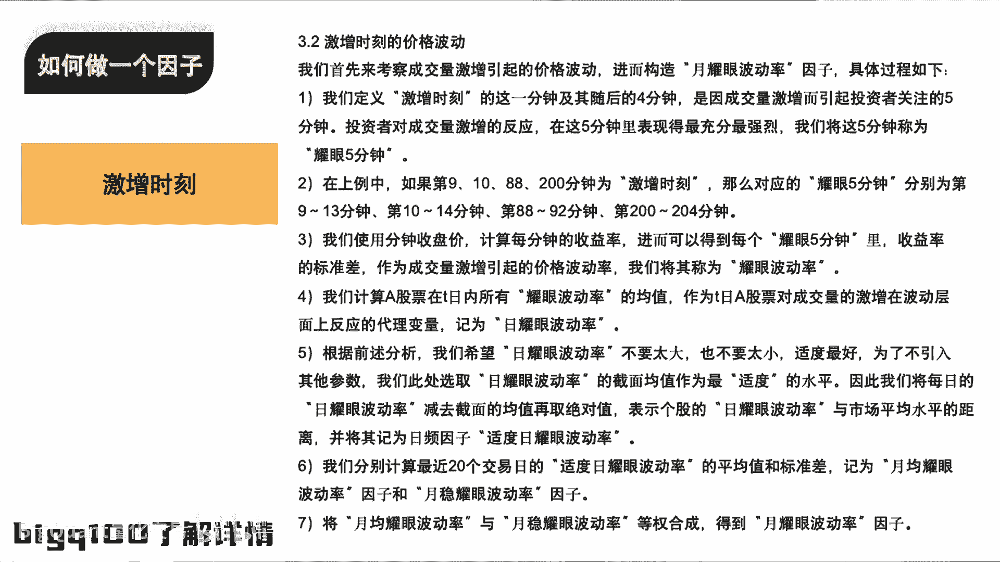

# 一个量化因子的产生过程：观察市场、剖析指标、计算过程、构建因子【AI量化交易】 - P1 - BigQuant量化投资 - BV1gZ421B7cs

那我们先带大家过一遍去计算这个因子好吧，看他怎么去计算因子啊，首先呢我们先算一只股票的这个因子，就算2月29号这一天的这支股票的，那首先呢我们读取了这个分钟的数据，这是我们的分工的数据。

我在里面构建了一列叫做dd，实际上就是把这个D转换成了这个日期，这个费用可以到8分钟数据，这些数据所有的平台用户都可以免费，这东西可以免费都不收费的那个分支数据。

大家可以看一下，实际上就是有每只股票对吧，有他的这个复合因子，当初原因子大家对了，了解的我就不说了，那一般来说呢我们会先拿这个，正常来说应该是拿全部的车程说多少，就是来到了我们太演也是代码都给他体验。

我们其实是有粉拖出去，对我们是有每分钟的高开低收，每一分钟的成交量，成交额的，这个就是成了嘛，这个也是每分钟的这个这个这个这个东西，那我们拿这个东西，我们那我们继续看看，你怎么。

第一件事情是去截取了他240分钟短线，因为每天大家可以看固态要数是241分，为什么，实际上是因为这个盘前竞价的数据，被我们聚合到的存在而生，那这部分数据是怎么样的，所以我只取倒数240行对吧。

那我可以成交量点滴粉丝算这样一个辩论对吧，那这边就是一个计算过去NN分钟的，收益率的方式，所以我这个数据处理完了之后，就变成了这个样子，这个是我心算的，首先我计算了每一分钟跟上一分钟，成交量的一个变动。

每分钟都晒过之后才变，然后计算了他未来一分钟，这个太阳F一F2FX，就代表了未来的N分中的一个收益，那第二的时候就把定义机能失格，那实际上就是拿每一分钟成交量变化的，这个均值加标准差做一个CP。

就是一个阈值，大家可以看到这一天，这个值就是这个值大于这一分钟的全部的值，都是激动的时刻，那很简单，但这是我的是这样子，那不激动的时刻你就可以扔掉，所以我就可以定义激动的时刻，就是去做一个激动的时刻。

一个过滤过滤完了之后呢，只需要算他过去3分钟的标准差，那就是这样，大家可以看到我所说的标准差是横向的，所以说我过滤完了之后呢，他这个标准差都不一样，来看看对比中国人差，就每一个技能时刻。

它的标准差都是不一样的，那我就可以计算因子啊，就像大家说的，可以取个均值，只是在技能时刻求一些求职去构成基因，那最后呢我的股票就会成为这样的，我的每一天第一次值都是，这是这每天的数据吧，从09：

31分到九点呃，到时候从09：31分到15点，他的每一个字都是一样的，因为我是对他上面的这一这一列求了一个均值，对了这一列直接这一列求个均值，就变成最后可以把它聚合一下，这个就可以变成一行了。

这就是这就是一个高频数据，如何从这样的一张表，最基础的数据，把我们的思想融入到我们的计算方式中，最终聚合成一个因子概念方式，那最后呢最终代码都会表示大家，那这个代码呢最后读出来的话，大概就是这样的情况。

我们每天我们每天都会有这个因子，因子因子呢叫alpha组107，那最后呢这个因子读出来之后，会和因子分析去分析一下，可以看一下它的一个效果，那最后的那个嗯只简单的回回调。

我们先计算每分钟成交量的均值和标准差对吧，用均值和标准差作为阈值筛选出来，所谓的激增的时刻，在激增的时刻呢，判断他是否用他的未来，N分钟的这样一个收益率，算了一个标准差的一个方式。

去判断它是否是一个稳定的，我们希望是一个适度的，希望是一个反应适度的，因为我也给大家做一个测试，就容易反映出我来说，大概是这个来说，你的期望大概是负的，所以说我希望它反应适度的第二次布线。

同时量价让童声没有分歧，最终我们做出这个因子，我们去做的这个适度的水平，在这个地方大家看看，我们希望这个要点波动，做出一个因子是一个基础，他要有波动率，我们希望它不要太大，也不要太小。

所以这个时候我们就用了，全市场股票的截面均值作为适度水平，将它这个值减去减免均值，再取绝对值，就是它一直对这个市场均值的这样一个距离，作为一个适度的水平，那么问题来了，为什么这支股票，这就这支股票。

就这个因子从头到尾他只用量价对，只用了分钟量价数据，那为什么，最后做出来是一个带有一点小试纸的风格，就它没有纯的小市值风格，它不是纯的那种小风格，那为什么和小说有什么，你提到了为什么。

因为就是成交量激增一起嘛，如果说是一个大市值的话，同样成交量诶，但是不水，但你看一下我们选择，首先我们选择成交量激增的时刻，我们使用的是它日内在非洲这个级别，这个日内均值加标准差的方式。

第一大票他也会有技能使用啊，同大跳资金量会更大，要大到每天的成交额都会打开，这个需求随便打开，这应该是鸡毛非常重要，打开茅台吧，打算换个看看茅台啊，茅台最近几天交额是多少，我待了20多年。

你说太阳上有没有成交要点，时刻也有啊，这一分钟，就是他这一分钟就会被均值的太阳选出来对吧，那这些分钟有可能被选出来的，但是这一分钟是百分之百被选出来的对吧，这个这个问题你用这东西需要时间差。

你目测大概在这个位置，那大概大大大于均均值，本质是在这里，均价标准差大概是在大于这个现场，OK那这个所以说你刚才那个就好像是有点问题，就是我们大票和小票都只是用均值的这个。

成交量变动的均值标准差来作为激动时刻的车，那这个阈值在不同的踏板上不同，所以不仅仅存在于小票，有机大概会涨，但当我继续回答这个问题，大家还没有谁想为什么我们只用量价数据，鸡毛飞上天。

就是他四肢想吹的很高的哦，你的意思是给你的意思是你的意思是，这个小市值的票在有个技能时刻更容易被拉起，那轻一吹就OK，那问题还能我们有些我们的一些大啊，就是我们去横，但是不到五个因子可以看到。

我们去计算的是，这个我们并没有用他这个未来N分钟的收益率，哪些算，你说小票涨得多，大票涨得少，这个确实是，但是我并没有用未来N分钟的收益率，作为这个因子，而是用未来N分钟收益的标准差。

那么小票如果长得高，他长得高，他这个高度差，不就是所谓的它它它它如果不是你的前方，微XF等于MV嘛，M小V又拿FT的动量是合成，这也是因为大多数小漂亮这个均衡就ST。

等下我就让你给了个力量和时间都是一样的，但是他的单子越不会越大，这是演的，但还有类似的想，你认为可能是，当我计算他未来N分钟的这个时候，小票，OKOK或者说你这样说，小票这个他可能这个不能这样。

他不会被拉起来，那么OK那为什么小票不容易被拉起来，在这个因子就你这个结论，为什么最后这个影子主要分层分层尽职的时候，他会体现出一个比较那么明显的事实，比分OFT的为难，而且小孩容易被拉跟这个因子最终。

那你看我们反应适合的做法，首先呢这个反应是会对他们处理，就是在不同的天啊，我们是没有办法去评价他的成交量和价格的，主要很好的时候，找一个点大盘子，找两个人加一点，把它吃对啊，就是讨论。

就是因为你选的是洁面均值作为十度水平，那么截面均值其实你没有用市值做加权，就是你在取经12，你只是简单算术调查，简单算出这样，事实上是小票的数量远远不会大量的数量，这有点像那个呃五指的那个红线和白线的。

就是说，其实你在你相当于这个被被检项目的选择，就已经隐含了，你选择了这个参照系就偏小调，是我觉得这个还是比较，就是说其实我们在去做截面均值的时候，作为适度水平，我们是将截面均值检验截面均取绝对值。

那A股中的股票的市值的分布，它不是一个大多数都是偏小市场，它是一个非常偏的，非常非常偏的，所以有时候我们去都是去做一个log，所以说OK那也就是说，但其实当我们减去绝对均值的时候，就是减去均值的时候。

实际上这个均值的代表更多的是中小票，这样中可能也不能不能纯小白，就不能为他们中小票是主力军，那中小票后面的均值，那自然谁离中小票越近，那谁就谁就那个呃会被理解为最适合对吧，那它的绝对值就会越小。

所以这个因子是一个负向，那这样的一种方式获得了一种，首先就是说他的确会有小吃之风格，但是同时他孟子这个因子涵盖了很多的量，加强盗的思考，他不是说我单纯拿迅速引来就太逊了，那就改就完事了啊。

它同时隐含了很多量价的思考，同时用这一个因子啊，在你去做的时候，不仅仅你选择的是一个想看的风格，就是低市值的一个风格，而不再是仅仅用市值来去选择，相反如果你因为我们仅用了量价数据，应用市值数据。

也就是说我如果有一只股票，它有它的市值比较高，但是它的市值比较高的时候，只要是它的这个性质具有小号的一个性质，他们容易长，很比较热点，很多人容易愿意去筹这支票，他拉的时候他的这个标准差比较低。

只要他的这个性质，他距离想靠的这个距离是最近的，它依然会被纳入到多少层面去，多多层，不再仅仅是只看不到市值，所以说用这样一种方式是比较强的一种方式，将量价信息融入到市值一点。

那可以理解就不再是纯属的篮球，再讨论一下。

就是单带很多，因为他们还是用的应该挺清晰，量价信息，理论上它会不会也还是会有动量，这个还有一个动量的话，主要是需要实际上是因为你后面用过一个，因为我们之前讨论的比较多的是波动率的要点，波动率嘛。

后面还有一个是他他是做了一个要有工率，跟药研收益率做合并才当上去，这个这个不要紧，我先讲还在讲这个，所以说这个呢也就是说，其实说我们去做一些因子的时候，如果你想第一就是说你在做这个DA。

后面那个他在讨论，我们下周会在几个版本加入，每一个英雄的风格分析，今天基本上无论你是高频度也好，还是用高频数据的理解也好，他多多少少都会有些风格，只不过你很关心这个模式是风格，基本上都会跟某个风格。

他总会有一些混分，这是很正常的事情，那只是说用这种高频数据，高频量数据再去做的因子之后，哪怕他有个小数是同理的，它是带有标点思考的，并且他这个小说的风格它仅仅只是小说的风格，而并非想设置，也就是说。

如果你大市值的票或者中大市值的票，具有了小市值的这个风格的特性之后，我们也会把它纳入到一个小市值的风格里面去，那相反啊，如果你小时的一个跳，出现了很多这种大市值的一个状态。

