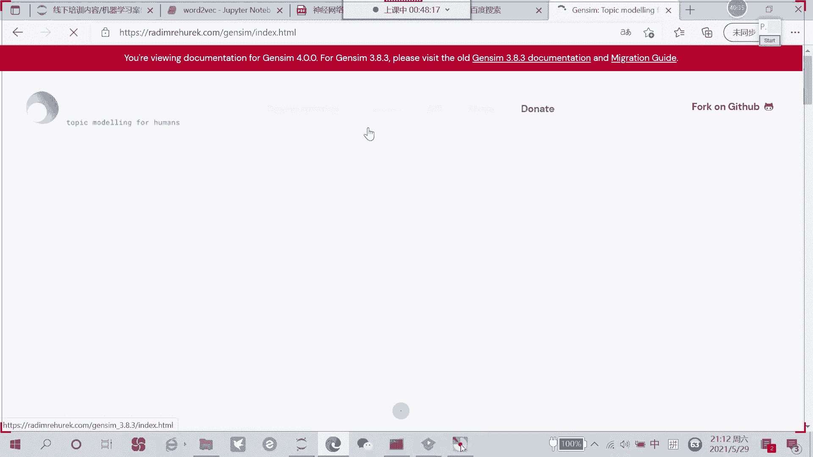
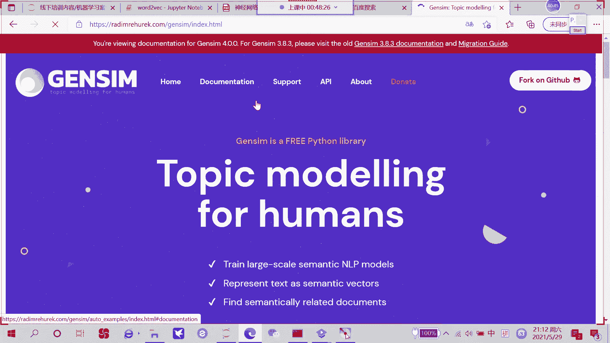
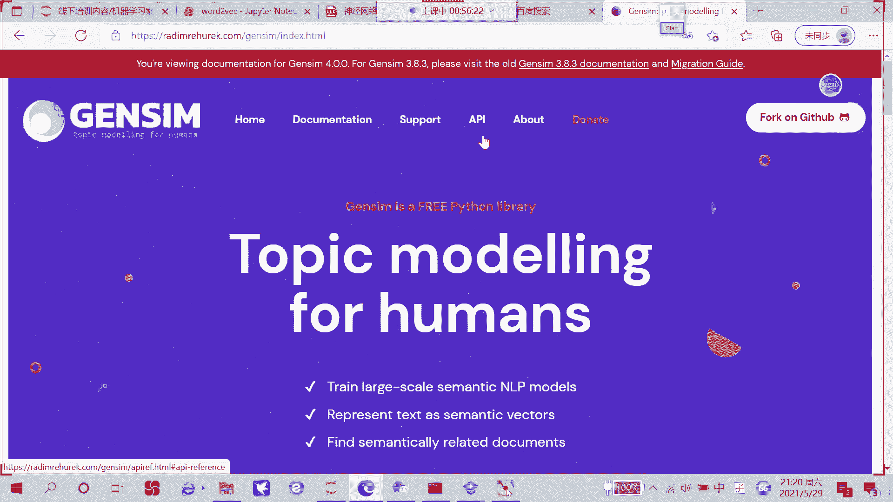
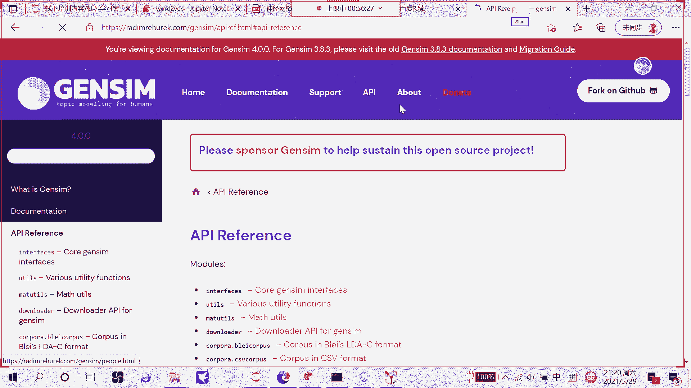
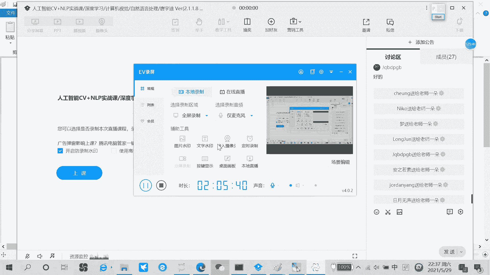

# 一口气带你吃透【Python机器学习与量化交易】保姆级教学，建议收藏！（人工智能、深度学习、神经网络、计算机视觉） - P65：3-递归神经网络算法解读 - 码农卡卡西 - BV1un4y1R7j1

今天咱们讲这个内容啊，它就跟图像没有什么太大关系了，咱主要唠一唠另外一个领域，也就是NLP，然后呢我先给大家说一说，就是我对这个LP的一个看法，相当于一个相当于一个综述吧。

建议大家简单唠一唠LLP这个事啊，其实大家不要觉着就是在线处理，哎呦跟这个计算机视觉差的太多了，就感觉完全是两个领域似的，其实呢他俩确实有差异，但是呢不至于啊差的那么多，我先给大家解释解释啊。

就是这个NLP啊，他要去做些什么事，咱们之前是不是讲那个计算机视觉的时候，跟大家说了啊，视觉里边我们输入啊是咱们这样一张图像是吧，诶输入一张图像，然后呢把这个图像输入到一个叫CN的模型当中。

它的目的是什么，是不是叫特征提取啊，哎把我们说白了，就是把咱们啊我们认识一张图像，转换成的计算机啊，所认识的一个向量，来计算机所认识的一个特征，这件事是不是叫计算机视觉啊，其实这件事也挺好理解的。

就是要把图像怎么样进行一个特征提取，然后呢咱们先说这个NLP就直接写LP吧，那LP要干什么LP啊，就是跟计算机设计相比啊，只有一点不同了，就是我们的输入图像不再是一张图像了啊。

就是我们说的数据不在一张图像了，而是一个文本数据，什么叫文本数据呢，一句话哦，说我们今天讲卷积神经，今天讲递归神经网络，就这么一句话，它就是一个文本数据啊，甚至大家你们现在能看到所有的文字，无论是中文。

英文还是哪个国家文字，我们都会叫做一个文本数据好了，把win数据当中，我们先不说什么网络，当过黑盒子吧，输入到另一个类似RND网络结构当中，好了呢，我们要做什么事啊，跟视觉来说是类似的。

还是去做类似这种分类任务吧，只不过说咱们数据不同了，网络结构不太一样了，所以啊就是视觉和LP啊，大家不要把它把它俩就特别孤立起来，其实本质啊做些事都蛮类似的，就是把我们的数据怎么样更好的转成计算机。

能去认识啊，能去识别的一个特征，然后在我们今天这个任务当中啊，咱们会这样，我会先带线大家来唠一唠，就文本数据啊，比如说先从预处理开始问数据，预处理一般都需要做什么，然后呢我们要建模啊。

是不是说哎哟文本书就叫建模，这件事跟图像可就不太一样了，大家可以想象一下，我们说图像是由什么组成的，来之前咱们最早讲图像，我就跟大家唠过，我说那个图像啊，它是由像素点组成的。

像素点本身来说是不是一个数值数据啊，啊就好比说刚才大家画的这个正方形里边，或者说我们拿到这样一个矩阵，这个矩阵啊，它本身就是一个数值，因为它是由像素点组成的，说白了就是图像这个数据啊。

本身就是可计算的啊，它就是一堆数，我一会我说对这些数啊，做什么样的操作就完事了，而本身就是数值，但是现在大家想想这个文本数据，我为什么要大家想想文本数据啊，哎你说文本数据本身它是个数吗。

就比如这几个字吧，这六个字啊递归就是两个词吧，一个是递归，一个是神经网络，我问问大家，这两个词它是由数字组成的吗，它不是它是由什么组成的，之前我问同学，他说他由什么组成的，然后同学告诉我。

他是由那个就是什么横竖撇捺组成的，这是咱们说的中国文字，我们及时关注什么，它的计算机原理长什么样子是吧，但是呢我们现在这个文字在计算机眼里，什么都没有，什么都没有，你可以当是个id啊，递归是D神经网络。

又是一个id，那个id有用吗，可以说没什么太大用是吧，那该怎么办呢，我们该怎么样把我们这样一个文本数据，转换成诶一个可以输入的数值呢，这个其实说啊就是挺难的一件事了啊，也是有一块重点啊。

咱要去跟大家去唠的文本数据啊，在第一步怎么样转换成一个数值啊，当然这是第一件事，第二件事呢我们转换这个数值之后啊，是不是要对这个数值啊，进行一系列的计算操作啊，比如说啊怎么样把这个数值啊转换成呃。

通过一个算法，通过模型唉，最终我说进行一个分类任务啊，这是不是有模型的算法了，咱第二个给大家来说一说这个模型和算法，然后第三个是开机没有时间吧，有时间跟大家说一说啊。

就是呃现在建模来说一个比较简单的模型，咱们该怎样进行构建，对这个文本数据我们该怎样进行操作好了，这是先给大家让大家先了解一下啊，我们这个LP还有计算机视觉啊，他说的事都是挺像的，咱先不用去管啊。

就这个文本数据像我说的id是怎么编码的啊，因为以后咱不会对他真的去做这个什么，什么各种各样的编码啊，一会我们有一些方法，让这些什么让我们的输入转换成一个向量啊，我重点先给大家去说这样一件事。

然后先跟大家唠一唠，就关就关于这个自然处理现在做的怎么样，我想问大家，就是大家觉得自然处理现在做的怎么样啊，其实我记得我之前说一说一件事啊，就是视觉的项目是一定能做出来的啊。

就是看你做的效果可能会差一点啊，可能会好一点，但是终究他能做出来，但文本数据呢，文本数据这个东西啊，或者灾难处理这些东西，他做起来真的就是难度特别特别大了，大家有看到一些什么创业公司去做自然处理吗。

真的就是没实力的老板，或者说实力没有那么雄厚的老板，他不敢做自然处理，其实大家有没有观察到做这个NLP做得好，这些公司都是什么公司，有小公司，有创业公司吗，没有啊，为什么你看前面做的最好的谷歌。

为什么说没有创业公司呢，因为他也这么跟大家说，你训练一个视觉模型啊，就大家自己手里有个服务器，随便有GPU哦，就说8G12G显存的一个计算机视觉项目，你也能玩出来，但是自然语言处理呢，我这么说吧。

你看看谷歌，人家说训练一个模型，成百上千的TPU啊，这么大的集群去玩啊，多大的数据，那谷歌自己都不敢公布出来自己的数据有多大，所以说啊就是文本这件事啊，做起来说真的就是非常非常费劲的。

大家之前有同学跟我说啊，就是老师啊，我想去接外包啊，这有同学跟我说，老师我能不能接LP外包，我说这个家里得有啥条件能接这个NLP外包啊，你要能接这个NLP外包啊，我估计你也不用，也就没必要去上班了啊。

这里边需要的集群，需要计算机资源，真的不是一个小公司所能承受的了的啊，都是一些大公司有数据，有计算机性能的啊，才就是有计算性能的才敢去玩的，其实大家可以看一看，现在发出来这些论文。

尤其是谷歌发这个论文啊，谷歌的一些还有一些其他的吧，发的比较好的一些，但凡是跟这个LP相关的，其实大家看一看模型有多大，几10亿的参数量，大家就觉得感觉像小儿科了，都有上百亿的一个参数量吧。

这种网络你就想咱们自己可能训练出来吗，一些小机构，小的一些创业公司，他真能玩得起来吗，这就很难很难，是不是啊，所以说现在啊，文本这件事做起来真的就是比较困难啊，比较困难的一件事，但是虽然说的困难多啊。

但是同样这句话充满挑战的东西，机遇啊相对来说也更多一些的，但今天我们先不管这些困难，不管这些挑战，咱们先说方法好了，来回到我们这个任务当中，第一件事给大家说的是这个词向量，我给大家先找一下哦。

啊先说这个词向量，这个是有助于大家后面理解新的算法的，来说说这个词向量呃，说这个怎样的前提啊，我先跟大家说一说，就是计算机视觉不是自研处理啊，发展的一个历程吧，啊这样一个小历史。

来问问今天来的同学没有最近刚报名的，有没有有没有那个这周刚来的，只有刚才同学，就是我们今天可能需要一点神经网络基础啊，可能一会儿讲的时候会需要一点声音，网络接触啊，孟同学没关系啊，没关系。

因为咱们今天也算是讲一个新的领域，因为之前前两堂课讲的都是那个视觉相关的，今天我们讲一个LP的基础，我觉着跟上也不是太大问题啊，有问题到时候到时候客户找也行好了，先说第一件事叫磁向量啊。

我先给大家梳理一下这个路线图，NLP路线图大概这样，我接触这个LP的时候，可能已经是15年的时候了，因为之前也是没怎么做过LP，15年的时候开始比较火了，后来呢慢慢火起来的，像是1213年的时候。

真的就很少有人去提资产处理这个事儿，为什么，因为那个时候做的实在是太差太差了啊，跟大家说吧，第一个标志性事件，2012年呃，这么说吧，2012年2012年之前怎么做的，2012年之前怎么做的。

就像我刚才说的，我们说要把这个词啊，比如说我说今天下午上课三个词是吧，三个词计算机不认识，我们需要把这三个词啊转换成A1个数值，以前怎么做呢，啊今天用零二啊，下午用一上课用用二好。

用这个id表示其实大家也能猜出来，用这个id表示这个效果怎么样了，非常非常差吧，所以大家可以这么当做，就2012年之前啊，我们叫做那个磁带模型吧，就是bar worse啊，就这就是了解行。

此外模型20年之前咱拿id的方法去标啊，效果嗷嗷烂，这也就是说12年之前，那以后自然处理人基本不存在，都觉得这个东西做不出来，然后12年的谷歌带头做一件事啊，他提了一个方法叫什么。

就是我们现在第一给大家讲的一个词向量，什么叫做一个词向量，词向量是这样一件事，就比如说你说你去描述一个人的时候，你不再直接叫他的名字了，就像我们刚才说的，我在描述描述一个词的时候。

我不在直接叫他的id了，那描述一个人应该怎么描述呢，比如说我描述这个梦同学，我说他1米8啊，然后160斤啊，然后哪哪哪出生的，然后这个在哪上学的，然后怎么怎么样，我描述他一个一个指标。

每一个指标我说都量化成一个数值，这样大家来了解一下，你说我光给你说一个名字，说一个梦，你可能不太了解，但是呢我把他的每一项特每一项特征吧，给它细化出来，身高年龄体重等等都细化出来之后，诶。

大家觉得是不是说我对这个人啊，能有一个更深的理解啊，这就是一样的啊，谷歌做一件事，我们在描述一个词的时候，其实不应该用一个id来表示，应该用一些特定的特征或者特定的向量，一会儿我会跟大家去说啊。

这是一二点这件事，哎大家觉得这件事挺好的，哎呦每个词都有对应的一个向量，但是呢光这么做啊，没有把这个NLP啊给救活，为什么这么说呢，从这个12年开始，12131415甚至15年，我去接触这个LP的时候。

因为当时我们做一些LP的项目，我在接触这个LP的时候，NLP做的还是啥也不是那个水平啊，效果非常非常烂，直到什么时候呢，直到2017年中间一些小事情咱不说啊，说大事件。

2017年发生了一件非常大的一件事，好我给大家写一写，当年还有一篇论文，这篇论文啊，它的名字叫做今天手有点抖，All you need，这是当年最火的一篇论文。

all you need is attention啊，什么叫attention呢，咱们今天可能不会去说啊，估计得后几次课我会跟大家说一说，这个是面试的时候必备的，甚至TENTION这个东西啊。

不光是在我们这个就是文本数据当中，像是你的语音图像数据在后续也会用到了，来给大家解释解释，当年17年这样一篇论文出来了，有多火呢，就是当时大家不是大家就我在逛街的时候，有时候都能看着。

有些有有些有些人啊，就T恤衫上都印象这个名字，All you need is attention，LLP当中，你需要所有注意的东西就是一个注意力了，什么叫注意力呢，为大家解释解释，来，我说一句话啊。

我说今天晚上咱们上课，然后呢课间啊咱们抽100万啊，抽100万的一个现金来大家说一下，就是我说这么一句话，你把注意力放在我们的前半句，还是放在后半句了，其实大家肯定会把这个注意力放到。

抽100万现金这件事上，也就是说我们在说话的时候，有些词有些上下文，有些语境是非常重要的，有些语境呢可能不太重要，比如说我跟大家说说，今天我刚才吃了樱桃，然后刷个牙，然后这个整容整麦克风。

然后咱一块抽奖，怎么怎么地道，好像我前面说了一堆废话，是不是，那大家想象一下，就是咱们在实际的去接触这些个，文本数据的时候啊，其实也是这样吧，很多东西没有什么意义，那就很多不能说没有意义吧。

很多词啊它并不是特别重要的，有些词重要，有些词不重要，这就需要什么了，这就需要一个叫注意力机制的告诉我，我应该把重点放到哪儿啊，这是第一件事，我再给大家举个例子，解注意力机制啊。

不光会帮我们找到出来哪些重要，哪些不重要，我再给大家举个例子，哎呀我说我今天啊今天下午看到这个啊，看到我们那个就是咱们班主任了，然后呢我说他呀拎了个大包，然后他呀又又又是买买了一瓶奶茶诶。

那么大家这个他指的是谁啊，说是班主任啊，所以这块还有一个指代的意思，我们经常会有这样一个指代，这个他在这个他这个词看来哪些词根的相关呢，哪些词跟最相关的是我们班主任啊，所以说这一块我们得注意机制啊。

等后续的时候会给大家去讲，但是今天咱说这个东西，我觉得难度有点大啊，后续手我会给大家讲啊，就是all you need is attention啊，这个叫做transformer的一个架构啊。

到时候咱们细说，当然是后续课程，咱们做进阶的时候，然后呢这个2018年18年还有个大事啊，18年非常流行的一个模型叫bot，咱们课程后面也有啊，估计大家也看到这个大纲了，2018年的时候。

博尔特他就横空出世了，波尔特什么事呢，波尔特不是谷歌啊，他是这是一个谷歌的项目，谷歌这项嘛他做了这样一件事，他说你那个transformer的架构挺好的，但是呢哎呦，你说我们大家自己在训练模型的时候。

我们之前是不是提到一个叫预训练模型啊，啊我们在讲这个视觉的时候，我们提到这个预训练模型，那文本的里边我们有没有预训练模型呢，当然也是有的，文本当中我们也需要预选模型，啥意思啊。

一个词他应该用什么向量来表示，哎我说我一事先训练好了，你拿我训练好的当做你的初始化行不行啊，这个就是18年啊，就是谷歌做一件事，他说你们咱们大家也别那么费了吧劲的，自己里面没数据，没计算资源。

还是硬挺的啊，非要自己训练一个好，我给你们训练预测模型，这是谷歌啊，就是既开放了他那个transformer的一个源码，也去提供了这样一个就是呃就是预选模型吧，相当于就是以后大家但凡玩LP的同学。

都可以参考谷歌这个BT啊，当年就是18年沃尔特刚发出来，18年底了，其实这件事火起来都19年出的事了，就说19年吧，19年初的时候，大家都非常着急，非常着急，干什么呢，谷歌发了就发了这个BT。

他是个通用解决框架，但是呢这个BT这篇论文啊，他就是没有去说在各个领域的一些具体应用，大家都在忙着干啥呢，赶紧把这个bot稍微改吧，改吧，套到自己任务当中，赶紧发一些论文，赶紧发出，发出一些研究的东西。

是不是，所以说19年啊在处理建大家都特别特别忙，都怕就生怕自己发晚了，就是别人先发出来了，那我就不太好发了是吧，所以说19年底啊，19年上半年吧，是资源处理的一个大洗牌，各项任务啊。

有了BT这个基础支撑，全部效果有了非常显著的一个提升啊，这个BT到时候给大家讲源码，因为我觉得这个是面试来说必备的一个项目，我问问大家，就是计算机视觉，你说你面试必备的一个项目是什么。

那肯定是yo yo，你都不懂，还面什么试呢，那自然语言处理呢就是BT呗，Burton，你都不懂，你说你做LP的，谁信的，最终后续啊，我们在课程里边啊，但是不一定是直播里边，我们会带大家走那个源码是吧。

我希望到时候大家真的把这个boss源码，好好过一过呃，然后到时候这样就是大家，不论是我们做那个视觉的，不论是我们那个做视觉什么，不论大家是我们做视觉的项目，还是做那个文本的项目，还是做语音的项目。

我的作品大家去说啊，注意力这个东西非常非常重要，transformer这个结构来我问一下，就是之前有同学跟我们说，让我们去在视觉项目里边，也给大家讲讲这个transformer。

那就是之前提这个同学来没来提这个同学，我会在这个6月份我会在这个呃，现在现在现在这个是5月底是吧，6月底之前吧，6月底之前嗯，给这个把这个transformer，在视觉当中应用的项目给大家做进去。

其实就是几篇论文啊，一个就是那个呃transformer in，那个那个就是在视觉啊，忘了论文名字了，就是一个啊叫VT的一篇论文是吧啊，transformer vision啊。

在视觉上怎么去做那个transformer，然后另一篇啊就是在就是那个transformer啊，怎么去解决一些物体检测，怎么去解决分割项目的，这个到时候会给大家来说一说啊。

其实呢这个呃并不是说BT用在那个CV当中，是这个transformer，大家这么来当做BT啊，它是用了人家transformer这个架构，并且提供预算模型，我们重点的会说那个transformer。

这个东西真的非常重要啊，神器神器我到时候会给大家去讲，为什么穿former这么重要，因为现在真的是遍地开花了，在图像领域当中真的做的，我因为因为我这边我做过一些，就是之前也尝试过物体检测算法当中。

分割算法当中都尝试去用过，虽然说我这边实验来说效果没有明显提升，但是一些大佬级别的人家实验出来的，结果提升挺大的，而且呢而且这么说吧，他是弥补了CN的一些不足，其实今天我就想问问大家。

CN当中你觉得有什么不足吗，啊大家可以先考虑考虑这个问题，这个后续跟大家去说啊，transformer能解决哪些问题，但这个前提是什么，我再给大家讲，这个前提是大家把BT完全掌握调。

你要把我们boot源码里边的，以及呢咱们transformer，整个架构完全掌握完了之后啊，再去听我给大家讲，这个transformer怎么在事业当中去应用，这样才能去听懂啊，这样才能听懂。

因为本身这么说吧，transformer有一定难度，有一定难度啊，后续啊有等等等，咱们今天下课的时候跟大家去说，到时候咱们听完这节课，到时候怎么去学啊，对注意力机制这个东西啊，这个是非常重要的，是是是。

然后但是代码更改时间啊，今天直播bot可以用CV3超模，不仅仅是self attention，这么说吧，就是自注意力机制，这个self attention它只是transformer当中一部分。

它是transformer里面的encoder部分啊，编码部分，当然整个transformer它不仅有编码，还有解码，是不是解码，它就不是self attention了，它就是一个attention。

不加这个self的，到时候我会给大家去说啊，咱们今天课间时跟大家说一说，到时候咱们怎么去看这个录播，行了啊，这个历史咱就不多介绍了，再介绍起来时间长了，然后等课间的时候跟大家说说。

我这边之前做一些项目的事，咱继续说这个算法来说这个词向量吧，其实我刚才提到一点，说我们在这个词项当中啊，我们需要干什么，就好比说我们描述一个人，描述一个人，你给我这个人啊，他的信息越多。

我就能越了解这个人是不是，那我们的词呢其实也应当如此，我给大家举个例子，比如现在我们有些单词，我说这个红色的啊，这个单词它表示一个就什么，它表示一个我这字写的太大了，这个蓝色它表示一个篮球。

唉然后我问问大家，这个词，比如它是个高维空间，我画不出来什么，50为300，为了你就当做是我们把这个篮球这个词啊，它做成了一个50维的向量或者，300维的向量吧，然后这是篮球这个词，然后问问大家。

我说哎呦，现在如果说另外另外再有一个词，我另外再有个词呢，我说它是一个呃叫做足球吧，我问大家足球这个词啊，在向量空间当中啊，应该离这个篮球非常近呢，还是应该非常远呢，其实大家没有想过这样的东西。

篮球和足球啊，它是不是都是球啊，哎他是不是都是球，都是球，那你说他们的一些特征的描述说也比较相似啊，比如篮球是圆的，足球也是圆的，篮球是运动，然后足球不也是运动吗，那他俩的特征应该怎么样。

非常非常相近是吧，好，那我说这个它是一个足球，然后下面的羽毛球，橄榄球，乒乓球，然后各种球诶，你看它们之间的距离，你就说在高位空间当中，它们之间的距离是不是应该非常近呢。

诶因为他们都是球特征比较相同是吧，这应该是我们把每一个词，把相同的一些词做完向量之后，唉我们说得到的一个结果好，那再说另一类词，我们现在手里啊就是不仅有这些球，或者说有些是鼠标，哎这是个键盘。

这是个笔记本电脑，这是个就数据线，哎你看他们是不是也都是些办公之类的东西啊，就或者说都摆我桌上了，我都说我都说我面前现在有的诶，那你说他们之间在向量空间上，是不是也应该比较近呢，诶照样都是比较近的吧。

那他们既然比较近，我们也应当把比较相似的东西放到一起，是不是，然后再说一些东西，这王者荣耀，穿越火线，梦幻西游，魔兽世界这些你看都是一些网游，那他们应该比较近，是不是也应该放一块啊。

所以说啊就是当我们去构建一个向量的时候，我不仅仅啊说要把这个呃，就是用单独的一些idea和手段，把一个词唯一出来，我还需要做这样一件事，它是有实际意义的啊，你看篮球足球挨着比较近。

这是不是说他们有一些实际的意义了，这个E要体现出来在向量空间上啊，这件事就是我们的词向量，也就是word to vector，他要去做的一件事好了，先大家去解释解释，就是我们希望做出来的词向量。

应该满足什么样的一个规则，或者说应该满足诶我们什么样的一个需求啊，这是我们希望得到的一件事，那这样怎么做呢，来我先给大家来看一看，做完的词向量长什么样子好，大家也看一看，比如现在我就把这个如何这个词啊。

大家可能会问诶老师，比如说我拿到了一个句子啊，比如说今天啊上午上课哦，这是一个句子啊，它不是一个词啊，那我们一般第一步干什么呢，一般第一步我们还是先做分词啊，就是今天是一个词，上午是一个词啊。

上课是一个词，然后呢，我们需要把每一个词都转换成对应的，一个向量啊，就是这个我说我要转换成一个呃50位的向量，这个我说我也要转成50位向量，这个我也要转换成一个呃50位向量，这也算行吧。

这件事当然可以的，我们需要把每一个词都转换成我们对应，希望得到的一个向量，好了，给大家看一看，就得就是做完之后向量长什么样子，来大家看这些数呃，问大家一件事，这个数你能看懂吗。

我们能看出来这个数它是长什么样子吗，可以说我很难来去区分出来啊，就是当前这个数里边还有这个数里边，咱们啊有哪些个东西是我懂的啊，就一看我看不懂没关系啊，你要能看懂你就神了，爱因斯坦来，他也看不懂啊。

我们只能说啊就是转换成向量，在计算机眼中人家是能看懂的啊，这就行了，就是它是不可解释的，同样是不可解释的，不是说一个向量你真的就能说出来，哎呦它的词性表达是什么样，哎呦他这个空间意义上什么样啊。

那说不出来的，我们只是只得到了50个数，就是说一个词转换成了一个50位的向量，好了好，这是我们一会儿要得到的结果，就每个词都要做出来这么一堆数啊，没有任何可解释性，好了，按啥规律转的来跟大家去说啊。

其实我其实我估计大家也能想象到了，咱们之前说什么是没法解释的，在神经网络当中啊，我们是不是说了，我们的中间的隐藏特征无法解释，我们的权重参数也很难去解释，是不是，那我想问问大家，想让大家猜一猜。

那就是我们当前给大家说这个向量，我们是怎么得到的，怎么样把一个词组转成一个向量呢，一会我给大家去说啊，这是怎么做的，只要先来看一看啊，先假设一下来这块我先画了个热度图啊，热图什么意思，如图这样啊。

就是刚才我们看到一些数值是吧啊，那些数值解释起来太麻烦了，我们用颜色来去观察一下啊，就让我写了，就是有这个大家也看到，就是右边有那个，从负的0。6到那个正的0。6，然后负的就是越往复的，它是越南的。

越往正的是越剧越发紫的啊，越发那个身上这种感觉好了，然后我们下面呢就是对做好的这三个词，就都是50位向量，但是我没列出来50个数，我说把每个数映射成一个颜色，这块不有color bar吗。

好把哪个词映射成一个颜色，咱们来观察一下啊，来先观察一下，首先我们来观察前两个，前两个是什么，第一个是啊，就前两个大家来看一下，先看这三个词吧，哎大家觉得哪两个词可能比较相近啊。

哪两个词可能意思是差不多的啊，当然不是完全相同，我们说说前两个词哎感觉意思都是比较相近的，那我们来看一看，它在数值上有没有什么特殊的规律呢，我先来画一画好，大家来关注一下，我画这个区域啊。

我也在现场来给大家看一看，我画这个区域，大家来看感觉一下这些个区域，你看一看它们在数值上怎么样了，你感觉就因为颜色就表示它数值的一个，具体值是什么吗，大家来看一看，我先框起这些区域。

他们是不是都非常相似啊，这些数值上相似，我们可以得到什么样的结果，这些数值上相似诶，那我们说如果说啊，他们都是映射到一个50位的空间上，都映射到50维空间上，它们的相似度。

或者说它们之间的距离就会比较近，是不是，那大家来看这两个词，这样词在含义上它就比较相近，所以说呢我们做出来向量，是不是说在空间上也是非常相似的呀，哎这就是说我们做出来向量，要达到什么样的结果。

那你看下面这就是前两个词跟这个第三个词，第三个词他俩是不是差的比较远了啊，他俩好像没什么关系，好来说这个学说的啊，这个单词你这个名字我实在不会读，这这这这随便打名字吗，还是还是有怎么读啊，这个名字。

然后我们来看一看啊，就是这个词向量啊，我们是怎么得到的，来我们这里通过这个例子啊，希望大家知道啊，词向量是怎么训练出来的，以后大家就是我们自己自己也可以训练，这样一个词向量啊。

就是我们可以不用人给我们现成的，咱们自己啊，咱们自己也可以来去训练这样一个明星模型，这个名字真绝了啊，这个名字真绝了，来我们先来看啊，首先我们有输入数据，给大家解释什么叫输入数据，这样输入数据，这样啊。

比如说我们现在有这个词吧，就是啊今天啊今天打打谁呢，今天打你吧，好有这么三个词，就随便写三个词啊，不用管这三个词是什么，然后这三个词啊，我说这个我说这是X1，这是X2，然后这是X2，反正不就三个词吗。

然后呢我说这样啊，我把这个X1跟我这个X3，我说这点我给它当做是我们的一个输入啊，这两个词我先当个输入，哎大家可能问老师，这不是一个词吗，那词怎么输入到网络当中啊，我说这样啊，这X1这个词没关系。

我说做一个随机初始化，把X1这个词随机啊，注意点，一开始随机，我说随机初始化成一个50位的向量，这没问题吧，X2呢，我说这个词，我也随机初始化成一个50位的向量，而不是X3。

这个词也随机初始化为一个50位向量，这可以吧好啦，也就是说一开始啊，我先把X1和X3分别初始化随机啊，随机一开始随机初始化，这也没问题吧，出个向量，然后呢把它们丢到一个神经网络当中。

神经网络你当做一些全连接层得了啊，就是就这个WI加B1层一层的WI加B，然后执行了多层，然后最终得出了输出，哎大家可能会输出是什么意思啊，我说输出做个分类呗，什么叫分类呢，比如现在有这些词。

我还是有id编号，我说今天这个词是一，打这个词是二，然后这个你这个词是三，然后接下来呢我说在做这个分类的时候，哎我说我看一下咱们这个网络在预测的时候，能不能把它的一个中间的中间上下文。

这个打这个词预测出来，打这个词，它的一个上下文它是不是就是一个二啊，哎就是说这块我做一个分类任务，看一看我们能不能把这个结果唉给它分出来啊，这就完事了，这个任务不难吧，哎这个任务不难，是不是。

那大家可能问哎呦，那这个事儿我该怎么去做呢，一开始你说你随机初始化了一个向量，然后随机触发向量，它就能预测出来这个东西它的类别是什么吗，能把它上下文预测出来吗，要我说这件事好像不太能，那咋办呢。

咱们是不是说这个神经网络，在反向那个传播的时候怎么样，我说咱们这个神经网络它在反向传播的时候，咱要更新谁啊，更新这个W更新这个B是不是啊，就是我们之前说的一句话哦，说咱们这个反应网络反向传播啊。

注意我们是只更新权重，还有偏置参数的输入数据能变吗，咱之前是不是说啊，说我输入数据不变啊，好了，今天特例就来了，在我们训练词向量的时候，它是这样，不光我们这个反向传播，它要更新，谁更新这个W和这个B。

我们这个输入要不要更新啊，来大家想象一下，一开始我说咱们这个输入啊，它是一个50位的向量，是不是是不是随机来的，接下来呢在我模型训练过程当中啊，我说权重我要更新，我们的输入数据也要去更新。

那随着咱们这个迭代，其实大家想象一下我这50位向量，哎呦，人家要去更新，这50位向量也要更新，那如果说我这个语料库非常大，第一次我输入的是今天打你这个词啊，这句话下次我说就是下一回就是明天打，你。

是不是说X1哎，就是我们的输入数据又变了，又能去学一些新的数据了吧，然后下一个词就后天再打你，那是不是说每一次输入可能都不同啊，这样我们最终能得到什么，这样我们就把最终每一个词。

是不是都能训练的比较不错呀，但是大家估计也看到了，这样对于文本数据来说，我们需要的一个语料的一个量级，是不是得非常非常大呀，好了先大家去解释一下，就是在我们这个模型当中啊，怎么样了，在我模型当中啊。

我们的输入是什么，输出是什么，以及我们这个词向量咱们是怎么训练得到的啊，这个大家就是一个特定以后别人家里说哎呦，我再问你说有没有神经网络，说谁家训练训练数据，还有把我们的训练数据给它改变了呢。

啊也有就是词向量这块可能会变啊，也就是这一个地方了，视觉当中是不存在的，文本里边这一块是个特例啊，X13对对对，一开始啊，因为大家可以想象一下，我们先要满足网络能去计算。

然后呢才能再去更新我们这个参数是吧，所以说咱们的第一件事儿啊，我所有任务里边，第一件事都是要先去初始化我们的权重参数，还有我们的输入数据，哎，这里边增加量里边我们的输入法是随机除化的。

然后大家可能会问哎，就是在我们这个任务里边，咱们该怎么办，在我们这个任务里边，哎呦我把这个先关掉，微信炸了个屁，来在我们这个任务里边，他可能问老师，那我们那个说数据我上哪整啊，输入数据这个东西在哪去。

能得到我们这么多数数据啊，是不是说我们自己得打标签啊，我问问大家，就是咱们这件事需要我们大家自己打标签吗，这件事需要我们大家自己打标签吗，大家想象一下文本数据啊，咱有打标签吗，我一般怎么做呀。

我刚才说百度百科的维基百科的，其实我们不需要打标签的，来说说我们数据从哪来呃，这些咱不看啊，先来看这个数据从哪来，最后大家去说吧，就随便就是大家你们网上去爬一些小说行不行，拍一些电影，拍一些台词的。

甚至是随便一句话啊，就是但凡是人话，什么叫大盘人话呢，我说今天打你这人话啊，不能说你打今天就但凡是说人话的句子，我们都可以是当做是我们的一个输入数据，然后接下来呢比如这样。

比如现在啊就是随便你也不用管这话说啥，我就有这样一个数据了，在数据当中，我们刚才是不是说X1X2X三，然后这个一二当输入，然后这个一三当输入，二当输出吗，好了我说这是第一个。

第一个时候我说第二次我往右划一个单元格，是不说还是这个X1X2比三啊，那下次我再往右划一个单元格，我换个颜色，我再往右划单元格，书划到这儿了，这就是X1X2X三了，所以说呢你看标签是什么。

我们说刚才我们这个例子当中，我说标签是不是中间的那个词啊，那只要给我给定我的窗口啊，或者说窗口是个奇数的，我就肯定知道我的上下文是什么，我的标签是什么，这件事是不是一个自动的。

所以说啊就是训练数据这件事，对我们来说不是什么难度啊，只要你有数据，只要你有文本就都可以，但是前提啊这是要去说人话的一些句子，说完事了，哎这里给大家看了一下，就是我们学院数据长什么样子。

那大家可能会问艾老师这个训练数据啊，要不要我们自己训练啊，来再跟大家说这件事，通常情况下咱们这个训练数据啊，我们真的需要自己亲力亲为，去训练一个词向量吗，就比如这个东西。

我们真的需要自己训练一个词向量吗，要每一个词都训练出来吗，其实大家想象一下，就比如说这些词，我说今天这个词，我说今天打你啊，他表示就是今天就是这个意思啊，我也不知道我语文不行，不知道怎么给大家描述。

反正今天打你这个今天这个意思，我再换一个句子，我说今天晚上上课，那今天是不是还是个意思啊，也就是说啊通常情况下，你说我们这个词啊，在不同的语境当中，你说它变化大吗，其实感觉是不太大的。

是不是就打这个词啊，这都是这样相同的意思，篮球这个词你放到任何语境当中，它都是表示要去拦，就是就是都是表示跟篮球相关的东西吗，他不可能说把篮篮球跟原子弹相提并论吧，所以说啊这要有个现象。

我们很多时候用到这些词向量都是能通用的，一旦能通用怎么样，一旦能通用来说，我们是不是可以用别人训练好的向量来用起来，当那就是来往我们的任务当中去套啊，这个就是说啊，我们刚才给大家说的一个预训练模型。

文本当中预算模型是什么呀，其实不仅仅是一些权重和偏置参数了啊，来这里大家注意一下，我们之前是不是给大家说，视觉里边我们的预算模型啊，就是个网络架构，大架子，W和B这些东西在文本当中呢，不仅仅是W和B了。

还有什么，还有我们的输入的向量啊，这样一个事输出不是随机向量啊，输出大家注意一点，来输出还是向量吗，我问问大家，咱们这要完成什么任务，咱们这是个回归还是分类，问问大家，就这件事。

我们在这个就是这个模型里边训练词向量，我们完成这个任务，咱是个分类还是回归任务啊，一般啊就神经网络它也就是这样任务嘛，就是除了分类，就是回归，本来跟大家唠一唠，大家可以猜一猜，它是分类回归。

分类和回归就决定了啊，就是决定什么了，决定刚才在同学们的一个问题，它是一个向量还是一个id呢，这是向量还是id，对我们输出来说啊，不是得到一个向量，而是得到这个词的一个id。

所以说输出啊它是一个分类问题以后啊，就是大家遇到所有LP问题，你就都当做什么，所有的LP问题，其实它都是分类的，别给大家举个例子，像是我们最常见的就是叫什么对话机器人，什么对话机器人啊。

就是智能客服啊之类的，他是不是说一个词一个词去预测啊，怎么组成一个句子，这是不是都是分类啊，第一个词在这1万个词当中选哪个合适，第二个词在遗忘词当中选哪个合适，所以说啊就是一般啊。

NLP当中很少有不是分类的，基本上大家市面上能见到这些词，这些任务都是一个分类任务，40分钟看大家没有什么问题，先跟大家讨论讨论问题，然后再去说下面的一些小细节，哎其实这块给大家说一说。

就是咱们这个词向量我们怎么做的，我再来多说几句吧，然后词向量一般我们都用那个预选模型，那如果说咱们想自己训练怎么办，什么时候自己训练啊，之前我看过一个同学给个例子啊，干律师的。

他们说他们他们是公司有需求才报名的，他们那个律师那里边儿哎哟专有名词太多了，还有医学里边儿，医学里边专有名词也特别特别多，这些专有名词啊，你说在别的一些语料库或者别的数据集当中，能有吗，是不是没有啊。

如果大家就是咱们那个数据啊，你觉得是挺特的，我们还得自己去训练一遍啊，自己训练一遍，但自己训练，大家也不要太担心这个东西是不是说哎呀，我自己训练效果非常差呀，这么说吧，只要你数据量足够多。

效果还是非常不错的，但是前提是不是一定要非常非常多才行，然后给大家看一个呃，咱今天不给大家看这个例子了，因为这个例子有点长，咱们在录播里有啊，大家看个工具包吧啊那个工具包叫JC，来这个包。

我问问有没有同学用过，这是我从15年就开始用的，15年就开始用这个工具包，用了非常非常多的时间了，啊JC的工具包以后啊，就是大家有一些NLP方面的任务吧。

如果说你要去自己去那个词向量，这个工具包给你提供现成的了，你只需要准备好数据就行了，说白了就是我们自己啥都不用去准备。

你只要有个输入数据啊，它就会帮你把我们的输入数据做成每一个词，对应一个向量啊，这个包真的非常非常简单，当然大家可能说哎老师我自己写一个神经网络，能不能去做呢，啊可以的可以的。

但是一般情况下就是我们自己写一个网络，那这个效果来说可能不会特别好啊，自己写可能效果相对来说会差那么一点点，好了，来看一下我们这个任务啊，对就跟大家说这样一件事呃，来课间说还要还需要同学们帮我个小忙啊。

就这块这块啊，就是大家可以扫一下，这块呢是咱们孤儿学院啊，再做一个啊，就是我们课程以及大家学习情况的一个调研，这个是为了后续提升我们对大家的一个服务，提升我们课程内容啊，给大家准备的这块。

大家可以先去拿起手机打开手机，然后呢打开扫一扫，可以帮我们就是去扫一下啊，反馈一下，大家就是看大家在我们学习过程当中，有没有一些问题，对我们班主任同学啊，对我们班主任同学。

以及对我还有我们整个的课程团队，就是大家有没有一些意见啊，需要反馈的，也相当于是对我们的一个评价，也相当于是对我们的评价，大家可以去点开这个来去啊，帮我们去填一填大家的一个课程满意度。

对然后这个来课间课间啊，大家帮帮忙啊，帮我们去扫一下啊，帮我们去扫一下，直接打开微信，帮我扫就行，然后这个是对大家就是对我们课程满意度，我们的一个反馈，希望大家都能百忙之中掏出手机来。

帮我们去完成一个小调查，今天下课了，推荐一篇论文啊，没问题，我看这同学名字挺长的，叫金枪不斗排骨啊，金枪不斗排骨，你想你想去研究哪个领域呢，你想研究哪个领域呢，这篇论文特别特别多啊，无所谓是吧行。

一会儿等课课，课后把课后给你说一些就跟LP相关的吧，然后大家现在不管同学拿着手机，咱们来扫一扫，帮我们去填一个问卷，谢谢大家，行，然后大家这边先填，先填着，我们课间休息几分钟啊，一会儿咱们继续。

呃我看过那个问卷内容了，我当然看过这个问卷内容了，语音识别有的语音识别肯定有这个类似boss的，等到时候给大家推荐的啊，火舞火舞，不知道是不是不知火舞啊，不是和我，你需要那个ALP的吗。

就需要语音识别的吗，语音识别有的有这种叫做一些通用项目的，就是就像bot一样能玩语音里边所有东西，中文顶会不用想了，怎么可能有呢，怎么可能会有中文顶会呢，最后2分钟时间啊，大家就去帮我们扫二维码。

帮我们去扫二维码，这个二维码主要是对我，还有我们那个班主任老师的一个评价，主要就是对我和班主任老师的评价，好好好好，第一次同学可以也可以先不用填，也可以先不用填啊，行，然后来最后一分钟大家再帮大家。

尤其是没来得及扫的同学来，都帮帮忙啊，帮我们去填一个评价，呃大家扫不进去吗，其他东西可以扫进去吗，我这边微信倒是可以的，我这边微信倒是可以的，大家看一下，大家看一下有有有扫描的同学吗，可以是吧。

我这边都是可以的，行行咱先填到这。

我们先回到课程当中，好了刚才我给大家介绍了一下，就是关于我们这个叫做JC的模型吗，这里边就是这样，就是到时候大家如果说啊，就是我们想自己去训练一个模型的话。

可以看一下人家这API登录方法，给的是非常非常多的。

你看这里给大家看一下，就叫那个词向量的，大家可以看到这东西叫embedding是吧，好我们的一个词向量模型，这个是非常非常常见，也是用的最多的一个工具包，给大家推荐这个工具包的原因是什么，因为它简单啊。

并不是说这个工具包用起来难，用起来复杂，用起来真的非常简单，一一个接口，一个API就把我们这件事给他做出来了，然后这块还有个东西叫那个LDA，LDA这个东西这么大家去说呃，当年是号称非常非常猛的。

当年怎么号称号称无监督，解决一些LLP问题的啊，叫那个主题模型是吧，主题模型当年非常非常火，14年一五年的时候，真的就可以说是跟知识相机吧，当年那个火都是类似的，但是呢我当时啊就设计就是实验了很多。

很多跟主题模型类似的相关的算法，得到一个结论是这样的啊，就是这个算法你基本上可以淘汰掉了，没有什么任何意义，无监督啊，有监督都做不好一件事，无监督号称去做，那能做好吗，肯定做的更不好，是不是。

所以说LDA这个东西啊，以后不建议大家去尝试啊，就是宁肯自己打标签，你也不要相信一些论文，一些方法当中，给你提出来一些无监督的方法，解决这个LP难题的啊，这个事是不太现实的，好了，这个包说到这儿吧。

到时候大家想用可以自己去了解一下，然后我还要任务当中，任务里边我们可以看这两个模型，这两个模型啊分别有两个名字，其实这两个不同模型啊，或者叫做不同框架的名字也是啊，我们到时候会训练的时候。

咱们自己可以怎么样，也是我们在训练的时候，咱自己可以选择这个参数给大家看看，第一个CBOW啊，他全称啊就continue by the words啊，这个是CBW，他的意思其实很简单。

我们的输入啊是我们的一个上下文，大家看到输入是四个词是吧，啊表示是我们上下文，输出呢是我们中间这个词分类任务是吧，然后呢或者说右边这个右边这个其实是相反的，我们输入啊也可以是中间这一个词。

你看这里边咱们是不说哎呦，右边里边输入的是一个中间这个词，然后呢输出是什么输出啊，是不是说哎也可以是上下文啊，多标签也没问题吧啊输入中间词，输出上下文这个事也是可以的啊，也就是说在词向量我们训练的时候。

这两种方法都行，后续呢它会就是你看一般这些工具包啊，你想自己用的时候，这个是两个参数啊，你可以自己选择左边和右边，但是相对来说可能是差的不是特别多啊，差的不是特别多，这个是可选择的一个参数。

然后在这个数据当中啊，简单的跟大家说啊，国家数据是挺简单的，为大家说一个稍微有点难的，这个是比较难的啊，我想问大家一件事，有一个有一个词叫做那个副采样，大家听没听过，有个词叫副采样。

副采样是解决什么问题呢，我先跟大家说问题吧，问题是这样，比如说我现在一个语料库啊，就正常，我想问问大家，咱们中国这个语言来说得有多少个词，我没演过这个东西，大家有没有熟悉的中国这些常用的词有多少个。

我估计可能不会低于1万，甚至是说2万，3万，大概几万是吧，好那比如说比如说是3万吧，如果说咱们常用随时有3万的，那我们在输出结果的时候，我想问问大家，你给定的是我这个上下文是什么，我说我不管了。

那输出来说呢，输出啊，咱们刚才已经把这个任务给大家说了，它是分类任务是吧，那如果说你的语料库它有3万个字，那我们要做的是不是说我要看一看，他是这3万个词当中的哪一个，那其实我们最后完成任务是什么。

3万分类的任务，咱们最终要完成的任务，他是不是一个3万分类的，大家有见过这么大的一个分类任务吗，这样分类任务好做吗，如果说是3万分类的任务能做吗，K字文说。

我们一般说最后输出层是连上一个soft max，之前说了soft max是什么，如果大家想象一下，你做一个3万分类哇，这件事效率太低了，而且结果那肯定也是不一定好的，那怎么办呢，那这件事怎么办啊。

能不能把这件事简单一点，我是要在3万所中选一个，能不能把这件事给我简化一下呢，啊是可以的，这件事叫做一个副采样啊，这件事就做一个副材料，什么叫复采样呢，其实我估计大家听这个名字也能听出来了。

他强调什么副，什么叫正，什么叫负呢，给大家举个例子，比如说我们现在一个上下文，今天打你好，在这里边我们说我们的标签是谁啊，标签是中间这个词，打这个词是不是，所以说这块打这个词，它就是一个正啊。

就是我的标签，我们这里边需要的东西啊，它就是一个正，那什么是一个负呢，我说但凡不是这个词的，比如说今天怎么你呢，今天可以删你吧啊这写写写写就随便一次啊，今天怎么说，就是今天再怎么说呢，解决你吧。

好你看一些其他词，还有一些简直我这边随便看一些词写了，大家来看这些词，这些词其实怎么样，它跟我们这个这样的它都不是都不是正样本，这个词就这么说吧，除了我们正样本这个词它是一个正样本。

就是除了我们当前标签，它是个正样本，其他的所有的词就比如3万个词，只有打它是个正样本，剩下2万9999个都是什么，都是负样本啊，都是负样本，因为这是3万分类嘛，只有一个是对的，它是正样本。

其他都是错的啊，其他都是负样本，那此时什么叫负采样呢，我是这样，咱正样本还是还是还是打这个词啊，就这样本这个词，我说我给他拿过来啊，一会儿要用，因为最终分裂结果里肯定得有正样本，它的概率是不是。

但是呢我说负样本太多了，这个负样本现在有多少个呢，嗯一共有2万9999个，我说这太多了，我说这样吧，在这个分样本当中做一个采样啊，这样本里我说我选了一个负样本里，我说这么对吧，我在里边随机采样。

我说就选九个出来行不行，是不是也可以啊，但现在呢现在我做这样一件事，正样本没变，负样本呢有2万9999个，现在我缩小到九个，这样能达到什么效果啊，咱们说是不是现在我就完成了一个啊。

我们就完成了一个叫做啊多分类，也就是一个十分类任务，是不是好，现在咱就完成了一个十分类任务，那在我们这个十分类任务当中啊，咱们这个事儿是不是做起来相对就简单了呀，啊相对是简单了一些，好了。

这块给大家去看了一下，在我们任务当中啊，我们的副采样啊，它是做一件什么事儿好了，那除了我们这个副材料还有什么，还有个东西叫做heart，来，大家有没有听过这个词叫做hard negative。

什么叫做heart，那个table heart一般怎么翻，翻译啊，难诶什么叫做一个难啊，这件事怎么解决啊，唉这件事怎么解决，哎大家有没有听过这个这个东西，论文里边啊。

大家有没有在一些论文里边听过这样一个词啊，其实非常常见的，不仅是这些深度学习，NLP的很多数据挖掘场景当中啊，其实经常去会提hard这个词，它是啥意思呢，来这给大家说吧，就比如说分类任务。

什么叫分类任务呢，我说今天啊这个我想一想，这个不太好举例啊，今天我说咱们那个国家，我说别别别别说我了，我说我说谁呢，我就说就说我一个朋友吧，我一个朋友啊，我有一个朋友，有一个朋友啊。

有一个朋友就是发射吧，发射火箭我也不知道说啥好了，随便写发射火箭哎，我问问大家啊，就是最后啊，见见见大，写，这么写好，最后这个词啊，你看发射一个火箭，哎你看火箭这个词它是正向本，是不是。

那比如说啊我选了一堆负样本，什么负样本呢，哎我说选了一堆负样本，负样本当中有这个篮球，哎你说篮球足球，羽毛球啊，笔记本鼠标，键盘啊，花啊，窗户衣服，哎你说这些词我说都是负样本啊，那选在这里选不就得了吗。

哎大家想象一下，就是如果说我把这些词都把你摆在你面前，即便你不看前面上下文，虽然说我这上下文写的也不太搭边，你就假设有个上下文吧，你是不是说你不看上下文，你就光看答案，就就好比说什么呢。

就是说你在做选择题的时候，你连题干都不用看，你能不知道答案是什么，是不是这种感觉啊，你看发射什么，能发射个篮球吗，能发射个笔记本吗，能发射个桌子吗，这感觉不太现实是吧，所以说啊就你这个样本选的太简单了。

我都不用看题干，我都不用管上下文，我理解对不对，我都照样能把这件事做出来，唉是不是这么一个这么一个事儿啊，所以说现在啊就在前面加上号的啊，就一方面说我们在选负样本的时候，要增加一些游戏难度了。

什么叫游戏难度呢，我找一些跟火箭相近的词，比如说发射原子弹，发射导弹啊，发射炮弹等等，唉这些词儿术前来说就怎么样了，跟这个火箭比较类似了，增加游戏难度吧，来大家玩玩过那个谁是卧底。

大家玩没玩过谁是卧底啊，是不是玩过那个谁是卧底是吧，他就是啊谁是卧底里边啊，就是两个词都比较相近吧，这就是一个hard，我们在做这个副采样的同时啊，不仅仅说我们要随机采样。

还要在我们采样的时候做一个筛选，怎么筛选，采样出来结果要跟当前这个词比较接近，这样才能让模型真正的去学习到东西，就像你健身似的，你说一个200斤的人，他天天健身就拎一个五斤的小哑铃，能达到健身的目的吗。

达不到我们的模型一样的，你给他训练东西啊，训练太简单了，这个词太简单，那也没什么意义，他也达不到训练的一个目的啊，所以这块跟大家去解释了一下啊，什么叫做一个hard negative啊。

hard啊这个词希望大家去注意啊，因为以后不仅仅咱们在这个任务当中会提到，其他任务里边咱们会说到的啊，这个词非常重要，你看论文里边也会经常提到的好了，这个过程估计比较简单啊，这块咱不给大家仔细看了。

随机数量向量，然后呢做完数量向量之后，然后放模型当中去学习更新模型，同时更新WB，还有更新的X就完事了好了，这就是我们的一个词向量，说完我们这个采样之后，接下来我们要说说这个模型了。

这个模型啊大家先不用紧张啊，没学过同学不用紧张，他不像是那个卷积那个模型啊，就讲好久，里面知识点特别多的，这个怎么说啊，就是只要大家去熟悉传统神经网络，什么叫传统神经网络，Y等于W加B啊。

把这个东西嵌套了多层，只要你属于这个东西，咱这个RN基本上来说就没有什么太大难度了，其实挺简单，我们就可以把这个RN给他解决掉好了，先不要看这张图，这张图画的太繁琐了，我们来看一个简单点的。

来看个简单点的，这个图当中，我相信大家就是现在一打眼，基本上已经能看出来了，我们这个图啊，他要去做一件什么事了，来我们看看这个图啊，这个图当中咱就这样，我们先说一句话吧，就是呃今天这是一个词，今天晚上。

今天晚上吃吃啥呢，实在想吃啥吃你吧，好了，就随便这么一句话行吧，想不到啥词了啊，行这么一句话，第一步咱们干什么来着，第一步里啊，就是我跟大家提一下，就是有一个词叫embedding，E m b e。

什么叫embedding呢，这个东西翻译过来叫做一个词嵌入词，嵌入的意思啊，其实非常好解释，它的意思就是说，先把我每一个词转换成其所对应的一个向量，我们之前不是说了，哎，我说咱可以把每个词训练成一个。

实际对应向量吗，在这里咱假设它都是一个50位的啊，每一个词它都是一个50位的香料，这可以吧，然后呢，接下来我说这样咱给他加一个任务吧，我们说做一个二分类吧，做一个二分类，二分类就是一个类别。

一个类别是好吃唉，一个类别是不好吃行吧，就像我们模型先帮我预测一个二分类，就以这句话来之后，我说我要看一看啊，比如这个人的心情是好还是不好，然后今天这个人的态度他是消极还是积极，或者咱们这个二分类。

我说它好吃还不好吃行不行，是可以的吧，好了，现在呢我们说诶有了输入数据，然后呢通过一个叫embedding，Embedding，其实很简单，就是找每个词所对应的向量啊。

把我们的输入数据做成一个个的输入的向量，就完事了，然后接下来呢有这个输入向量之后，下面要干什么，下面我们不说啊，哎呀咱们要去做这个分类任务，咱们想想怎么去做呢，来这回我想问大家一件事，咱俩想一想。

哎呦你说最终分类结果好吃不好吃，是光看一个词来决定的吗，我光看这个今天我还没吃呢，我都能知道这是好吃还不好吃吗，不一定是不是只看婉儿这个词呢，也不一定只看吃，只看你好像都不一定，那咋办。

我们是要看一个整体，看一个全局呀，大家来想象一下我们之前讲的神经网络，之前我们讲神经网络是不说哎哟，比如说一个样本数据来了，传到神经网络当中得到一个输出，结果完事儿了，另一个样本来了呢。

到时网当中还有另一个结果，完事了，十个样本啊，怎么就不论是十个100个1000个吧，就多少个词，怎么去走，词和词之间有关系吗，有关系吗，之前我们讲传统神经网络的时候是没有吧，我们讲传统神经网络的时候。

其实有一点我们说数据啊，样本之间是一个独立的，样本之间是独立，是什么意思呢，就是说今天这个词跟晚上没关系，跟吃没关系，跟你这个词也没关系，每一个词都输入网络当中，得到当前的一个结果就完事了。

我们不会考虑它们之间的关系，但是现在呢大家想象一下，我们现在是一个句子啊，或者说大家可以当做是一个时间序列啊，在我们当前这个时间序列当中，你说他们有没有关系呢，尤其是文本数据，大家想文本数据，语音数据。

时间序列数据，或者说大家想想，股票数据是不是都会有这样一个对应的关系啊，还有上下文的语境的前后的呀，得有这样一个关系吧，那我们该怎么去捕捉他们的关系呢，怎么样把样本之间它们的联系给他穿插起来的。

这个就是一个递归神经网络，大家可以把这个DV神经网络这么去看，就是你看我画红色的，你看单看这个单看这个它就是传统神经网络，单看这个它也是一个传统神经网络，是不是，你单看其中每一个都是一个传统神经网络。

那他们怎么组合呢，大家注意一下，我们不光有这样一个单个的部分，其实单个部分好理解，输入是一个向量，经过了一个WI加B做成一个输出输出，我说是一个啊H0代表输出结果吧。

就是二分类零的类别的概率和一的类别的概率，这行吧，每一个词都可以预测去，都可以去看这个词输出结果是什么，但是呢怎么体现关系呢，大家来看这块，我拿黑色去画吧，这一块大家可以明显看到有什么。

是不是有一个箭头啊，这些地方咱是不是都有箭头啊，这些箭头是干啥呢，箭头它描述的是不是就是说哎呦，我不光把这个词做了一个输出，我还把它中间结果，什么叫中间结果呢，大家可以把这个当做是一个隐藏的特征。

我们之前讲神经网络不是说嘛，哎呦咱们当前一个输入数据啊，经过了好几层，然后最后呢我说才得到一个输出结果，是不是啊，咱们也经过好几层是吧，经过完好几层之后，接下来诶。

那你说我把他的一些中间的隐藏的特征拿出来，供下一层来使用这件事可以吗，当然可以的，再来看就是在我们这个任务当中，在我们这个任务里边，咱们是不是说有输入X0得到H0，我中间有第一个啊。

今天这个词它隐藏的特征，我把今天这个词隐藏特征拿过来，跟第二个词，晚上这个词所对应向量一起输入到这一个啊，就说到第二个位置当中，继续算WWI加B这件事，如果此时的输入就不仅仅啊，对于我们第二个学员来说。

它就不仅仅是第二个序列，它本身的一个数据了，还包括我们上一层提供的一个隐藏的特征，这样一来啊，大家想象一下，这样一来完之后，我们是不是每一步都怎么样了，每一步都会考虑前面给了我什么隐藏特征啊。

好那么大家一件事，比如绿色画这个圈，我绿色画这个圈圈，这个箭头，他只表示说我把晚上这个词的一个隐藏特征，传给下一个序列了吗，绿色这个圈儿只表示晚上的一个隐藏特征吗，其实不是，大家想象一下。

我们对于第二序列来说，输入的是晚上和第一个词的隐藏特征，所以说第二个部分绿色圈，且这个隐藏特征它是包括了前文，而不仅仅是第二个词是吧，那这样大家想象一下，我每一个词如果说都能包括一个前文的特征。

那是不是说相当于我最后一个词在做的时候，他就是考虑了整体的语境，和我当前最后一个词啊，这是不是都包括了呀，好了这一块跟大家说了一下，就是安人基本的结构，那小子再问大家一个问题啊。

就比如说现在我要最终的一个输出结果，你这里第一个词有输出结果，第二也有第三个也有最后一个也有，每个位置都会有最终的输出结果，你说我娶谁呀，这块我娶谁呢，我是选第一个词的还是第二次的。

还是第三个还是第四个，还是第五个呢，选哪一个呀，每个字都输入结怎么办，一般选谁啊，代码里边到时候大家会看到有词叫一负一，啥意思啊，最后啊一表示最后，也就是说通常情况下咱们都是选最后一个词。

或者要最后一个序列输出结果，因为最后一个序列，它是不是包括了咱们一个前面所有的呀，好这是R模型啊，从本质上来说啊，我们再去做一件什么事，对混合层的隐藏和输出哎，哪些当结果，哪些当隐藏特征，就是这样啊。

就是你说的这个隐藏特征是什么，这件事很难去解释，今天这个词给了第二个啊，晚上这个词什么意思，特征这件事只有计算机的，就爱因斯坦来了，他也解决不了一件事，我们只能知道它传递特征。

过去一起当个输入就完事了啊，然后在这里给大家看了一下RNA结构，我先这个也其实也没有什么优点，可说它就是解决了序列的问题，我想问大家，大家觉着大家可以发挥一下想象力，你觉得这个RNA结构没有什么问题。

我想让大家来说一说啊，RN结果有什么问，有没有什么问题，你可以当做这是一个面试点了，我给了你一个网络结构，我让我问问你，我们这个网络结构现在没有什么问题啊，如果你问，我觉得我至少能说是五六点吧。

来咱一个说第一个和大家说什么，太慢啊，对大家来想一想是不是太慢，大家可以想一想，就是RN这个结构，咱们是一个串联的还是并联的，我们是个串联还是并联的，什么叫串联呢，我第二序列要不要等第一个序列做完呢。

第三序列二等第二序列算完呢，在前向传播的时候，其实是我们是这样一个等待的一个过程吧，第一个做完了想做，第二个才做，第三个做第四个，所以说I这个东西本质决定了什么，它的本质决定了它是一种串联的形式。

串联的形式会导致什么问题啊，哎哎这个我看宋宋同学说出来了，太长会导致什么问题，大家看没看过一个电视节目，什么电视节目呢，就是说虽然排队，我说这第一个人，这是第二，这第三个人，这是第四个人。

第一个人跟第二个人说句话，然后他然后他比如说跟第二人说，说我们今天家里啊就是办那个在家里办喜事，我们家挺高兴的，然后传话，然后第二人第三个人说啊，他说他说他就是这样啊，他说我们今天家里边啊办什么事。

大家挺高兴的，然后第三个和第四个人说啊，就是我家里今天举办电话会了，感觉挺高兴的啊，第四个跟第五个说啊，就是我们就在家里举办个运动会，然后挺高兴的，那你看最后一床一直后是不是就不太一样了。

所以这一块就涉及到一个问题，如果说咱们的血液太长，会导致什么，前向传播其实还好，但是反向传播这件事太难了，为什么说反向传播这件事太难了呢，前向传播从头走到尾，反向传播从后走到前啊，如果说到哪块儿啊。

到哪块儿谁不支持，是不是说这就卡这儿了，就完蛋了，就像是咱班似的啊，咱班现在你说由于谁哪个同学捅娄子了，咱整个班级是不是都完了，就是我们是个集体荣誉，一个同学被批评了，整个班级相当于也抹黑了。

说这样就是这样一种感觉啊，所以说这一块就是在我们这个模型当中，会导致一个现象，如果说序列太长啊，这些现象不是不是我说的，这是一个现象，在爱人当中啊，落雪太长，这件事很难去学了啊，这件事很难去学了。

梯度消失，给大家解释一下这样一件事，比如说现在啊，比如现在吧一些网络层，反向传播在传的时候，比如这块前两层没啥问题，到这层的时候梯度接近于零了，到这层梯度接近于零的时候，问问大家。

那前面层还有梯度可谈吗，就没有梯度可谈了，哎大家看没看过一个电影，我忘了，好像叫做什么饥饿空间，还叫什么，就是说把那个就是说把一个监狱啊，分成了100多层，把那个监狱分成100多层。

然后这是最顶层的一个监狱，然后可能住一个人，然后是第二层监狱，他也装个人，第三层他也装一个人买，这电影挺有意思的，然后每一层装一个人，然后呢这点设点儿点儿点儿有100多层，然后他们又把食物一层往下传。

第一层人可能吃挺饱，第二层可能也能吃挺饱，但是可能到第50层就吃剩下渣子了，后面呢就啥也吃不着了，是不是啊，这是看完电影挺有意思的，那这个就跟踢球消失也是一样的，前面几层啊其实都挺好整的。

但是一旦中间谁废了，后面就全废了啊，就是一个毛毛虫似的感觉，中间断了，后面也完犊子了啊，就这种感觉，所以说啊这是二人当中一个比较大的一个特点，长序列问题啊，啊极乐空间是吧，长序列问题，这个是很难解释的。

很难解释的，对T又消失了，前面的就全废了，不会更新了好了，我看这是大家说到的一个问题啊，就是序列太长，这个问题解决不了，确实如此啊，在按人来说，我看过一些经验值超过200。

序列长度基本上就是做的啥也不是啊，这种感觉它只是适合解决短序列的，还有没有什么问题，问问大家，你们见过的RA都是几层的，大家大家见过的一些RN都是几层的，把原始信息传过去呢，这是很难的，这是很难的。

大家来大家来唠一唠，就是你们大家来见过十层的，有见过十层RN的，有十层RNC同学，我真想问一问，在什么地方见过什么任务当中去见过这个十层，这个RN很少啊，其实十层十层可以说是很少啊，不太常见的。

你要训练一个十层，你这个设备得蛮强的，设备得蛮强的，一般你觉得这个两三层啊其实非常常见，我们大家一般自己做实验啊，两三层三四层其实挺常见的，来我跟大家说一说这个层怎么去算，现在咱们这个算几层啊。

哎大家可能觉得老师是不是说这个这是一层，两层三层四层啊，不是啊，这不是说一层两层三层，这只是我们同一次同一层当中，我们有什么同一层当中我们有这么多序列啊，这是序列的长度，这不是一层。

我跟大家说怎么去再堆叠一层，比如这样，我说这个输入啊，它是一个50位的向量啊，都是50位向量，然后问问大家啊，就是说我们在全连接的时候啊，不光是我们最后一次全连接，可以得到一个输出类别的概率。

我们中间隐藏它是不是得到了一些神经元啊，或者得到一些隐藏特征，我假设说我们这个隐藏特征，它是128位的一个向量，可以吧，也就是说我现在这么安人当中的第一层，我不得到最终的输出结果，可以吧。

我说我得到一个隐藏向量，都是一百一百二十八位的，接下来呢我说再做一个这个东西啊，你看我把它画完，就可能画的稍微慢一点，唉我再画个东西，其实我估计大家也能理解了，我再往上去传行不行啊，是不是也行啊。

但是再往上传的时候，我说咱计算方法跟前面的，是不是都是一模一样啊，然后我说两层的时候，最终我去输出结果，那比如说这是欧巴，这是O02，这是O1，这是O2，这是个OT行吧，哎这样这是不是几层，这是两层啊。

在我们当前第一层基础上，我说按照这个模子再往上拼呗，那大家可以想象一下，再拼三层，再拼四层，其实是不是道理是一样的，但其实我被大家发现了，一层做起来都这么费劲了，我两层三层。

那这个东西底是不是效率特别低呀，所以说RNA来说，本质还有个大问题，做不了太多层，但是呢我们经常去说深度学习为什么效果好，层多呀，特征多呀，计算多，非线性多呀，虽然效果好了。

但是RN呢由于它的结构来说呀，他没法做太多层，这是导致RN以后会被淘汰的一个原因，虽然说以后RA会被淘汰，但是这跟大家说啊，就是后续我们讲的一些升级的东西，都是基于这些RN的基础来改进的。

所以说大家是有必要先从这个基础掌握的，你把这个安然掌握好了，后续你看一些升级啊，改进啊，这些相对来说也会呃是比较容易啊，这个事好了，就给大家说了一下，就是在这个案例当中，它的一个层次堆叠的一个问题。

然后再看看大家还有没有什么问题，transformer用的不是i n transformer，解决了一个大的问题，是问题RN不能并行计算啊，transformer要解决这个问题，在R当中。

怎么样把并行计算这件事给他做出来啊，transformer做到了，所以说你看transformer里边，谷歌给出来的12层，24层，那些复杂的结构都可以无限制的去堆的啊。

这就是transformer比较大的一个优势了，咱先不说这个，然后再给大家说个问题，还有什么问题，就好比说啊，就是比如说咱们这个大脑，咱们这个大脑啊，不是说咱们这个大脑吧，就是说咱们能学习的一个量吧。

比如我说这是我的一个脑子，能装这么多东西，你今天要告诉我一个事儿，就是你跟我说话，我唠嗑，让我让我记笔记好，商务语文老师来，我说给我上一堂课，我说我这脑子装一半了，然后接下来呢说数学老师又来了。

又给我装一，又装了一堆东西了，然后这个天文老师也来了，我也装上了，然后呢那个我看没啥色了，然后地理老师来了，我也装上了好了，我说我装的差不多了，已经，那接下来呢，我感觉我这个脑子都已经被完全利用。

完全开发掉了，接下来我说又来一个老师，我美术老师又来了，美术老师在给我讲东西的时候，你说我能听进去了吗，我都够呛，能听进去，脑子快满了，尤其是大家有没有在开会的时候是这种感觉，就刚开始啊。

讲的时候也沸腾的，谁跟你说开三四个点会，那你就越到中越要越快，到中午吃饭，那根本就听不听不下去了，尤其是我们当年上学的时候，你说中午中午中午上课的老师，或者说体育课之前那个老师在上课，谁能听进去啊。

是不是都快停满了，就一点塞不进去了，那二人当中也是不是也会有这样一个现象呢，你看二人当中他又怎么样，前面来了一个词，好像把它中间的特征我拿过来用上，再来一个再用上，再来一个再用上。

反正说不管这个词有用没用的，只要来了隐藏特征，你就给我拿过来，我管你有用没用呢，先吃起来，但是会导致什么问题呢，学的太多了呀，学的太多了，可能会导致问题，谁也学不好，也没一个重点了，这个是RN啊。

他最大的不能说最大吧，RN最大的问题之一啊，最大的问题之一吧，它也是存在这样的现象，一直在学，一直在记，但是呢从来没把谁当作是一个重点啊，从来没把谁当作重点，一直记，这就导致什么现象啊。

哎呦你说一个长篇的句子，100个词来了，前面说了一堆没用的，中间说了一堆没用的，他不管有用没用全记下来，这就是大问题，他不知道谁该学，谁不敢去学，那这要怎么做呢，大家可能说诶。

是不是说安卓同学说要加一个普操作不行啊，P6槽的什么是一个压缩呀，它是一个压缩呀，好坏的东西都会有的呀，压缩完之后可能加PUA这件事不行，但是大家想一想，我之前提到的东西叫什么attention。

Attention，什么来着，叫注意力机制是吧，哎注意力机制能不能解决这个问题呢，显然是可以的啊，所以说这个也是导致了后来RN，不再流行的一个原因啊，NGRAM这个东西我算算灭绝多少年了。

从112年谷歌提出来那个词向量之后，n gram这个东西啊都已经死透透了啊，都已经死透透了，都讲都没有必要去讲的，就是之前做一些教师培训，他们叫做教师培训，他们有的是为了给学生讲课。

说我要从这个啊这个NLP的近代史开始讲，讲一堆n gram模型，磁带模型TFIDF奖励一堆这东西，说句实话，没有一个能用上的到现在，所以说没必要去掌握那些，远古时代的一些方法了啊，这些不要花时间去看了。

就看这生物学模型就行了好了，这里咱是不是又说了一个小问题啊，好那问大家还能不能找问题了，来问问大家还能不能找问题了，我希望大家再帮我找找问题，哪怕再帮我再找一个问题来，咱们今天再来个目标，再找一个问题。

我看大家能不能找出来，其实问题挺多的呀，NLP要解决问题比视觉多得多，其实大家想象一下NLP为什么难解决，因为图像来说啊，就是像素点组成的，直接输入到图像，直接输入到模型中，是不是就行了。

你说顶多做一些什么啊，标准化规范化啊，做一些数据增强处理数据就行了，但是文本这件事就是比较麻烦了，我问大家一件事，我们这块有X0到XT这是我们的输入数据，是不是我们在更新网络模型的时候，数据有更新吗。

在RN结构当中，注意这是RN结构了，已经不再是我们的词向量当中了，在我们这个R当中，我们说去更新一个模型的时候，我们的序列啊，我们的每一个X会发生改变吗，X会变吗，这个事X会变吗，不会啊，注意一下。

大家X不会变，这是神经网络，这是我们的一个IN神经网络模型了，不是在训练词向量，是用词向量去做这些东西了，那是不是说这些词它是不会去变的，这是什么意思呢，一个词当你把它的向量之前做成什么。

就之前我们的词项模型把一个词做成什么向量，这个词无论在任何语境当中，都永远是这样一个向量，永远都不会再发生更新了，是这样一件事吧，但是大家想象一下，这样做合适吗，一个词给大家举个例子，我说干啥呢。

这样一个一个词一个词吧，这个语境啊就不是一个语境嘛，就干哈呢这样一个词，问问大家这个干啥呢，这个词如果说你跟你的朋友说，你的朋友会觉得你问他什么呢，就干啥呢啊，我们东北话叫干哈呢啊。

这个词大家可以跟我唠一唠，就是你跟你朋友说，干哈这个词是表达什么意思啊，大家各自的家乡，我估计你们当跟你朋友去问这样一句话的时候，他可能会回答你，然后在家看电视呢，外加洗衣服呢，外加做饭的啊。

他是不是会问，就是会觉得你在问他，他在做什么是吧，但是呢如果说在东北用这句话什么意思，东北这句话他是这样一种含义啊，就是我问你干啥呢，其实你在做啥，我我我不是我不关心。

但是我心里估摸着你现在也没啥事儿了，估计在家闲着呢不行，咱俩出去干点啥啊，就你不用告诉我你在做什么，你就跟我说一句话走啊就行了啊，就是代表着你现在没啥事啊，所以说干啥都有这个意思。

就是问你忙不忙不忙就出来啊，忙就拉拉倒了，就就就就这样一件事，所以说大家可以发现就是一个词啊，是不是说咱们说我刚才说的是不同城市，这只是举个例子啊，说说很多词啊，在不同的语境当中。

他描述的含义也是不同的呀，那这里RN又是欠缺了一个环节，他没有把我们这个词在一个不同语境当中，做一个重构，是不是理想情况，什么样一个词拿到之后，我要看一看我上下文是怎么影响这个词的。

以及这个词是怎么去影响上下文的，我好把这些向量还有更好的重新组合一下，这件事是不是听起来就比较科学一些啦，所以说啊就是在这个地球生当中，我们还有一个小问题是什么，一旦一个词训练出来之后。

我们不管怎么训练，他永远都是长这个德行，永远都是长这样的，这个不太适合于文本任务，因为文本我们的语言在不同语境当中，这是非常善变的啊，非常非常善变，为什么说现在啊，你这个用这个NLP啊做一些短句子翻译。

比较容易，做一些短句子阅读理解很容易做长篇的，这就非常非常难了呀，因为它很难去掌握，我们这个词在这么大的语境当中该怎么重构啊，这是现在来说难度比较大的一件事儿行了，跟大家唠一唠，就是咱们这个安人啊。

我们的一个递归网络在不同的一个框架，就是在在这个框架当中啊，他是怎么去做的，然后重点大家说说这个缺点，为什么跟大家说这个缺点呢，好几个同学回我反馈了面试NRP会问到什么，会问到你做过你去就是做过什么啊。

做过当中遇到了什么问题啊，这些是不是都是什么，这些其实我是给大家举个例子，现在算法去学了一遍阿里吧，有什么问题，因为我们要为后面做铺垫啊，后面我们讲那个可能后几次课。

我们会讲那个transformer模型啊，对那个transformer先做一个铺垫行，看大家有没有什么问题，先几分钟时间和大家讨论的问题，然后我们再继续说，来看大家对这个模型理解没什么问题。

我估计这个RN其实挺简单的，只要你能理解，就是传统神经网络在看这个RN难度不大啊，其实难度不大的，是因为什么原因地球消失呢，这件事太难解释了，这件事太难解释了，我只能说是网络在反向传播。

他在学习的过程当中，肯定会有一些有一些权重参数不好更新啊，所导致的一个现象，其实这是一个还有什么，还有像是现在给大家举个例子吧，就是这样我跟大家说一说，就是我觉得这个原因啊，我觉得这个原因啊。

但是你让我去证明我是证明不了的，但是我感觉是这么个事儿啊，大家听我说的对不对啊，如果同学听我说对不对，就大家来看一下，就是说我们这个数据啊，在学的过程当中，比如一开始你先别管什么数据。

我一般都假设了输数据啊，不是平白无故的数据，它们之间是有分布的，有些联系的，是不是数据本身是有分布的，我们希望模型呢能学习到这些分布，但是在网络学的过程当中，你说每一层的输出结果，这些个分布会怎么样。

数据分布都在变化，是不是数据的分布都在去变啊，都在去变的时候，你说接下来学习的事儿还能那么简单吗，学起来说就难度比较大了，比如说第一天啊你要去适应云南的一个生活，第二天你要去适应成都的一个生活。

第三天你要适应阿富汗的生活，这样数据分布来回去变，所以说在学习的时候，可能在某一个环节当中，你就产生了一些水土不服的现象呢，一旦产生数据不符的现象，那你这全部参数就更新废了，他更新废了，前面就都废了。

我觉得本质原因可能是这样，就是因为这个数据分布来回变，如果说数据分布啊，它是一成不变的，我觉得这件事会非常好学的，只要数据分布不变，一点都不变，这件事可能会越来就是可能会比较简单去学啊。

但是数据分布一旦变了，哪块分布变的没有什么规律了，这件事就变难了啊，RN可以用在CV上，就是后面我给大家讲，咱们那个就不用R人啊，用那个transformer，因为那个transformer。

transformer怎么用在那个CV上啊，它是一个升级版，现在transformer真的大货呀，CB上大火的这种情况不会发生在CN当中吗，会发生啊，CN当中也会也会去发射。

CN当中也会有梯度消失的现象，但是CN相对来说好一点，因为它不是那种全连接形式，它不是那种全连接的形式，它是一个区域，一个区域是不是什么叫一个区域一个区域呢，就比如说呃就比如说现在吧啊你玩这个游戏。

大号练废了，还有个小号这样开玩笑这么说吧，他是一个区域，一个区域的，不可能把所有区域都搞废了吧，消失就是偏导求不出来，就是可能会为零啊，也可能会非常大，也可能会非常非常小，就没法更新了。

非常大就是更新废了，梯度这件事就是两种情况，要不然就为零了，为零就后面都白玩了，要不然就突然变得非常大非常大之后，那就是瞎更新了吗，属于法，一般就留这样这两种现象吧，但是这个解释真的是真的真的。

爱因斯坦来，他也不能解释明白的，为什么就是发生了这个现象，这对数凭什么他就学的不好，为什么这个分布它就不会了，这件事就解释不了，只有计算机，只有神知道，行我们休息几分钟，我3分钟吧，我去喝口水。

咱们马上继续，美女又不是最好，不是我们说些什么，你说的是那个就是最小值，你说那个极值为0C吧，C同学说极值为零，我们说是梯度啊，我说是梯度为零，就不更新了，就是今天啊你这个学习成绩这样。

明天你学习成绩还是这样啊，就是不更新了，来咱回来咱们再回来继续啊，好了，后来还有一个升级版本，归代听过这个名字，是不是叫什么叫这个LTM呃，就是长短距离网络，这TM大家可能听过。

但这个呢咱们今天就不给大家深入去讲了，为什么，因为后续呢我会讲一个比他更神的版本啊，就这么说吧，ITM这东西也被淘汰掉了啊，也被淘汰掉了以后呢，在这个自然处理当中只有这样一个架构。

就只有transformer那个架构了，如果大家今天啊，今天我到时候给大家推荐几篇论文吧，到时候大家可以读一读，transform这东西已经把这个LTM替代了，所以今天咱们不讲这个TM细节了。

但是我来跟大家说一说，就是他做什么事，TM就是他比阿人啊多做些事，今天咱数学那东西就不看了，以后用不上这东西TM都说了，就是这个R当中之前咱不是说记得太多吗，那会这样吧，我加一个控制单元啊。

怎么控制单元，一个信息，一个词来之后，我说我希望这个模型去学习一下哪些词该记，哪些词不该记，以及该记这个词，我记个60%，然后不该记那个我说我记个10%吧，那怎么做这件事呢。

怎么去决定一个词我要记多少呢，一个特征我要保留多少呢，这一块他提到很多东西啊，叫做一个门单元，就给大家简单画一画，大家了解就行，文档点当中啊，他是这样的啊，门单元里边他是这样的，在这个门电源当中啊。

我们有什么哎我们这是什么函数，SIGMOD函数，我估计大家之前是不是也看过一些，跟这个函数相关的，其实还有个加函数也能啊，这个CV的函数，大家可以看到我们的输出结果是0~1之间吧。

那把我们每一个中间得到的特征，来传入到这门单元当中，我们说来看一看唉这个特征我要保留多少啊，要取要舍，是不是这就可以了，所以说LTM大家记住这样就行了，他加入了一些文单元，在人当中啊。

相当于加入了一个遗忘啊，遗忘这件事有些信息我要，有些信息我不要啊，这就是我们的一个文单元，先给大家解释解释，就是RN架构，然后呢给大家看一个例子吧，例子我看看今天能不能说完。

说完的话我先给大家整理介绍啊，然后在这里嗯我看一下这一块啊，这个test不知道大家有没有看这个哎，这个PYTORCH当中，我们是不是还有一个文本任务啊，我希望到时候大家把这个文本任务啊。

自己从头到尾debug1遍啊，自己debug1遍，把这个代码过一过啊，代码我们就放录播当中了啊，然后带大家来看看我们的数据，随便拿这个给大家举个例子吧，不光有我们这个数据啊，来这里给大家先打这个吧。

其实这个例子挺简单的，这个例子难度并不大，这一开这个直播软件有点卡了，怎么，我们这个数据，其实就是非常简单的一个文本分类任务，然后由我们的一个文本数据啊，就是一些中国话，然后呢还有我们的一些啊。

它对应的类别，其实大家也看到，就当做一个系列分类任务吧，很简单，在这一块呢左边啊是我们这句话，右边呢是我们的一个类别啊，是新闻分类，然后大家可能会问诶老师，那如果说我做一个文本摘要该怎么办啊。

文本摘要估计挺常见的一件事，输入的是这个文本输出呢是一些关键词，是不是分类啊，输入一个文本，输出一些关键词，只要但凡涉及到输出词的，这是不是就分类任务啊，讲不讲，这是不是还是分类，那就换一个机器翻译呢。

机器发音也输入，是一个文本输出呢是文本当中第一个词是什么，第一个词多分类是什么，第二次多分类，第三个词多分类，第四次多分类，每一个把它序列输出完，是不是就完事了啊，是不是说文的那个咱们机器翻译。

也是一个分类任务啊，然后再换个任务，那比如说我们的阅读理解啊，这个咱们这个阅读理解啊，跟我们现在意义上阅读理解可能理解不太一样，我给大家解释解释，我们现在一般所所谓的右边也是这样，就比如这是啊。

这是我们现在一篇文章吧，你不想当此时一篇文章，然后又有理解他有问题，比如这个问题，这个问题，比如说啊这个问题，他说那个扫地多少年啊，获得了什么荣誉院士，那其实大家看到这块44年是吧。

我们用的理解一般返回的什么，返回的是一个位置，比如44年啊，它是第50个词到第52个词，所以说返回的id是一个50~52啊，代表着我们答案是在哪啊，这就是一个阅读理解，那你说它是什么。

是不是也是一个分类问题啊，所以说啊你给大家可以这么总结啊，但凡我们跟文本涉及到，但凡咱们跟这个文本相关的任务都是什么，都是这个分类啊，都是分类文本嘛，一般都是把分类这个任务好了。

到时候到时候给大家给大家准备这个数据集，这样就是我们的一个新闻数据，左边文本右边类别啊，我估计应该是个十分类吧，036789十分类，这是我们的数据，然后不光有数据，还有什么，估计大家也能猜到了。

我还给大家准备了一个叫做预训练模型，来看看这里大家看到吧，就这个名字有什么这个我这个我点不开，我就给大家先来看一看，我看看啊，有看一会儿可能有点开的，大家找一找这个大家看看名字叫什么。

Embedding，是不是embedding叫什么呢，embedding就是我们构建的一个词向量模型了啊，不是此项模型就是构建的，就是我们的一个每一个词，它所对应的一个向量，它是这样。

比如说就是这里边它会有今天这个词，就比如说C字眼结构吧，既然这个词还有它里边对应着50个数，比如这个数是0。7，然后0。6，然后这个0。12，0。43等等，每个词它都会对应相同的一个维度啊。

比如每个词它对应的是一个50维度啊，这是今天这个词，然后接下来呢就有每个词，比如说描述当中咱有3万个词吧，之前哪个同学跟我说3万个词好，这里边每一个词都怎么样都会对应啊，一个维度。

每个词都会对应一个向量，那这会儿想问大家一个问题，向量大小固定吗，向大要不要固定啊，比如现在我说咱们的输入是一个50，那50要固定吗，是每个词都需要50吗，我说一些重要词，我做成了300维的。

他信息更丰富一些，不重要词做成一个30的，他信息少一点，这样做行吗，先问大家这样一件事，咱就把每一个词它的向量所固定下来吗，希望大家一起跟我唠这个事儿，向量向量要固定吗。

或者说不固定不固定会不会导致什么后果呢，还有说一样，有时候固定，有时不谱固定的，我再问大家一件事，就是这样，哎我们说咱们现在全连接啊，全连接这块我们是一个WI加B，是不是在全连接的时候。

我们的权重参数矩阵是一定固定的，这个没问题吧，我说全连接啊，权重参数一定固定的，但是呢大家想象一下，一旦W固定了，你的X还能随便玩吗，比如举个例子，我们这个W啊，这个答案随便写，他是一个10×128的。

那我问问这个X这个X1定得是多少，第一个维度一定得是128，是不是，比如说一个样本，每个样本有128位的特征，是不是一定这块给我们达标对应才行，这样我们才能做一个矩阵乘法，如果不对应。

我们能做矩阵乘法吗，不可能吧，但是呢在我们初始化的时候，我们每一个W是不是都是固定的一个维度，在更新的时候它也是不是固定的维度，没听谁说我训练一个网络，说这个W还要来回变的，在我们的一个全阶层当中。

这个是不可能的一件事吧，所以说既然W固定了你的X必须固定啊，你的X是必须固定的，这件事我希望大家熟悉啊，就是以后我们再去做这个词汇的时候，不可能说一个向量是50的，一个向量是300的，这件事是不行的。

他们两个呢必须是完全一致的才行啊，这个是挺重要的，然后现在这件事我现在问大家这个，再问大家这个吧，那比如说我们这个序列长度呢，我说现在有这个文本啊，做这个文本分类任务，那对于这个文本来说啊。

肯定是呃有的句子词多啊，然后有的句子词少，是不是来问问大家词词的多少要固定吗，就是每个句子啊，比如说有的句子30个词，有的句子有50个词，那句子长度需要固定吗，再问大家这个长度需要固定吗，我还没说。

不用再看其他同学，咱们这个长度需要固定吗，大家可以想象一下具体长度要固定吗，想看其他同学的答案，其实这样啊，就是刚才咱们说了词向量需要固定，那句子长度呢也是需要固定的，为什么大家想象一。

一开始我随机初始化了所有的权重参数，是不是，那如果说你的句子有长有短，我这个权重咱们该怎么样来进行更新呀，我们权重该怎么设计啊，这是不行的，所以说在当中还有一点，我们的句子长度是必须要固定的。

别给大家举个例子，我是说现在比如说有个句子它是100个词，这是100次，然后呢接下来这是120个词，这下来它是一个80个词，那你说我们怎么办啊，有长有短的，咱一定要固定固定的一个数啊，这个是必须的。

不是说你换个算法就能就能就能把这些改变了，所有LP任务，这都是一个前提了，那咋办呢，我说这样吧，咱都固定成100次，怎么固定呢，多了100个词叫多退少补，来，我画个虚线，120的，是不是多了多了，砍掉。

或者说筛选一下啊，采样一下，把120个采样100次行吧，那少了怎么办，这80个少的补零呗啊都补零，补到100个是不是就行了，这个是我们在那个做预处理的时候，需要完成的一件事。

就是文本长度我们需要给它固定起来啊，就叫一个偏填充，一般填充就填充固定的一个id，比如都填充零或者都填充一个121啊，都填充一个你喜欢的喜欢的一个id值吧，代表着它是一个填充，这个意思其实就行了啊。

填充它也会对应一个向量的这个意思行，这给大家说一下，就是在训练的时候有非常重要的一个前提，这个前提任务就是我们必须要，每个词向量唯一都是固定的，并且呢RN的序列长度也是需要固定的，大家可能会问老师。

其他算法也需要固定吗啊都需要固定的，好像没看到什么特牛逼的算法，说我还能变序列长度，我还能变这个的，其实大家想象一下，一旦这个东西再去变，本来网络模型都训练的够困难了，你再来回编这些个东西。

那无疑是什么无疑啊，就是这么一说话，就这么就这种感觉吧，让本不富裕的家庭雪上加霜了啊，所以说大家一定要熟悉，本来训练二人定长的序列，我们都训练不好呢，你还来给我搞变长的序列，那这件事基本上是实现不了的。

不是我们现在算法研究的一个领域，甚至大家都没研究这个事肯定做不好的好了，然后顺便给大家举个例子，我希望大家帮帮我回答一个问题，这个问题非常重要，我在所有的就是所有培训里边吧，都会让大家思考这样一个问题。

因为你把这个问题我搞清楚了，后面做事就简单了，但是一旦这个问题大家没思考明白，后面做事我觉得就会很难了啊，我拿画图给大家画一个，这个是今天我得学让所有咱们先来，所有同学都要搞清楚一件事。

就是我们输入数据的一个维度到底是什么，因为一旦你能把输入数据维度给他搞清楚了，后面再慢慢去捋都能捋出来，但是输入你要没搞清楚，后面就没法捋了哦，那我就把这个线条调粗一点，哎咱这么说啊。

我说咱们现在有几个已知条件，现在大家都写一写第已知条件就这样啊，我说咱们的序列的长度啊，我们说咱们现在序列长度，所有的所有的那个句子它都是100个词啊，都是我们这里叫做100个词啊。

就是每一个句子它都是由100个词组成的，就是我们做好了那个多退少补，然后呢我们说这个向量叫做这个词向量吧，我是说这个词向量它都是300倍的，我是说这个词向量啊它都是300倍的。

就是每一个词都会做成一个三维的向量，然后呢我说这个RN的结构，那我们说这个RN的结构啊，它是有这么三层的，然后呢每一层啊我们叫做二人当中，我们这个隐藏什么叫二人当中隐藏的，我在这里写。

就是我们不是说会把第一个序列啊，当中的一些特征创建第二个序列，第二序列当中的特征再创建第三个序列，哎我说隐藏是128位的一个向量，隐藏我们说是128位向量，然后最终呢，我们说咱们这个分类任务完成的。

就是一个二分类啊，就是一个二分类任务，先把这些条件给大家列完，然后我们在做那个训练的时候，咱是一次创建一个batch数据啊，我们一次传来是一批数据，也就是说一次传来了一个batch。

咱BG数量是64吧啊，一次我们训练64个句子，就说一次我们的batch它是等于64的，好了，这个就是咱们现在目前手里拿到的所有的啊，这个就是我们现在目前手里边，我们已经有的所有的东西啊。

给大家列了一下好了，那要问大家一个问题了，在我们这个任务当中，咱们输入的矩阵维度是多大，来大家一起来，我希望所有同学来思考这样一个问题，我们输入的矩阵维度是几维的，每个维度是多少啊。

就希望大家告诉我是多少乘多少乘多少，图像数据，我为大家都能帮我捋清楚，是一个by size，乘上它的channel，再乘上什么，再乘上H再乘W，是不是咱们这个任务当中呢是怎么乘多少，乘多少乘多少啊。

来我希望大家要告诉我输入的一个矩阵是多少，乘多少乘多少的啊，咱图像数据大家都能捋明白，但是呢这个文本数据就对于我这样一个任务，我把一些条件，但条件当中会有干扰项的，我给大家列一列。

我希望大家都能告诉我啊，这个输入数据的矩阵是多少乘多少乘多少的，因为这件事你搞不清楚，你就不用写代码了，因为咱们所有代码都是要围绕着，我们怎么样去构建输入，一旦我们把这个输入构建好了之后。

接下来呢把输入构建好之后，接下来你去套A人家，人家那个框架API就完事了，啥都不用去做，但输入你没搞明白，这件事基本就废了，来我希望大家告诉我输入什么，注意啊，问的是输入什么啊，没问什么输出的东西。

输入什么，我看看今天到底能得到多少个不同的答案，咱们谁乘谁啊，是有前后之分的，100×300乘三和3×100乘300，他是不一样的啊，咱们的输入啊是有这个顺序的啊，不是说谁在前谁在后面是一样的。

它是不一样的，但现在得到三个答案了，他还没有还没有加磅的，来咱们还没有加棒的，你拍有没有不同答案，看看今天咱到底能输入能出来多少答案，之前啊之前有做过一些教师培训，教师培训最有意思了，我就跟大家说吧。

我做过所有培训当中啊，我真觉得就是基础最差的，反而是培训，基础最差的，真就是一些高校教师培训，对这些东西一窍不通，虽然说都是说研究人工智能领域的，我一问他们这些细节啥也搞不清楚。

就只是知道一个人工智能大方向而已，这是我做的所有培训当中，我觉得最有意思的一件事，基础最差的反而是什么，反而是一些高校教师培训的，就这里边我们为他做教师培训，他们会让我解释什么叫100个词。

什么叫300维向量，什么叫三层都会，这东西他们都会一个去问的，教师需要培训啊，我每年做的最多培训是什么，就是教师培训了呀，啊教师培训，尤其是现在一些高职的教师，高职就是大家，我估计你们都不敢想象。

高职的里边高职学校都要开AI课程，高职学校都要讲这些东西啊，国家很难去想象是吧，为什么高职要讲这些东西啊，因为这个专业收费特别贵呀是吧，你想高职学校开设一个还有什么汽修啊。

什么这些维修专业一年能收个4000，能收个6000顶天了，KAI专业能轻轻松松啊，国家允许他们收1万多，收2万多，就这样这样的一个学费的嗯，来吧回到正题吧，回到正题，我看来看，先说说大家答案啊。

哪个是对的，梦同学答案是对的，梦同学答案是对的，我跟大家说一说，就是梦同学答案他为什么是对的，其实这个啊这个这个什么枪同学啊，说反了，枪同学其实就是第一个纬度说反了，但是我估计意思就明白了。

来我们先说第一点啊，就是在这个维度里边，第一个维度是什么，第一咱们这个纬度要是从大到小，我们就要从大到小去说的，就像是你们就是怎么说呢，就说我们现在家里边人，你要介绍的，先介绍你们家最重要级的介绍。

我爷爷在介绍爸爸，然后再介绍我啊，就这样这样从大到小的一个级别，这里边呢我们也是如此，那问大家最大的一个级别是什么，我们的输入数据来说啊，第一个维度肯定是batch，这个是跑不了的。

因为batch我们表示的是一次要训练多少数据吧，所以这一块我们第一个我们的维度应该是batch，64，是不是第二维度，第二维度啊，大家都想哎呦，BH它是64个数据，那64个数据里边每一个是什么呢。

咱们来看一看，我们说咱是文本数据，64个里边每一个都是一个句子，句子是由什么组成的，句子是由词来组成的，是不是啊，注意句子是由词组成的，那一个句子有多少个词呢，是不是一个句子是由100个词啊。

所以这块它是一个64×1个100是吧，好64个句子，每个句子它是由100个词组成的，那下一个维度我们就要想了，那每一个词又是由什么什么组成的呢，咱们之前不是说了，我说第一步啊，在做咱们预处理的时候。

诶我们就要把这个词啊转换成一个向量，是不是每一个词都需要是300倍的一个向量，所以说咱们的输入是什么，做成一个64×100乘300的一个矩阵啊，大家一定要明白这个矩阵是什么。

因为呢后续啊你看一些AARP项目，其实难点在于什么，就是怎么样把你的数据处理好，你把这个数据处理好了，咱这个事儿啊基本上做完一半了，对于网络模型对他来说是现成的，预算模型对他来说也是现成的。

基本上需要大家亲力亲为的一件事，就是数据处理了啊，这个事谁也帮不了，你必须要自己去做的文本数据啊，通常情况下我们的输入是长这个样子啊，它是三个三个，第一个维度是batch，第二维度是我们序列的一个长度。

或者大家会看到以后的以后，我们一般叫max l就叫做一个最大的长度，这都是一些参数啊，什么叫最大长度，就就是你的序列长度应用会设置啊，最大长度比这个长度大的，我要给它就是采样，比这个长度小的。

我要做pad，然后第三个难度呢就是叫一个embedding，就是叫我们词向量的维度吧，可能不同的效果里边叫参数还不太一样，我叫不同名挺多的，大家只需要理解，这就是每一个词啊，它是由多少数组成的。

说白了就是每一个词的维度，这三个只要大家能理解，后面事儿基本都好说啊，大家一定要熟悉这三个东西啊，它是哪来的，相同也不同，同学猜的是吧，猜的挺像啊，猜的挺准啊，只不过说是说反了而已。

对咱们这个一般就是说三个维度，第一个维度是batch，第二维度是序列的长度，第三个维度呢就是我们这个词啊，它的一个就是一个每一个词吧，是由多少个数来组成的，这是我们输入，想问大家输出啊。

比如这个任务我们做二分类输出是多少啊，输出就简单了，就不问大家了，是不是就是一个64×2的就完事了呀，好这就是文本任务当中咱们的一个基本做法，然后在我们那个在我们那个录播里啊。

咱是不是有个PTORCH录播里，我们那个录播里，我们那个拍torch里边有什么，我们Python里面有一个文本分类，我建议大家把这个PYTORCH和文本分类，那是太简单了，这我觉得真是简单到家的项目了。

跟我们后面BT相比，这就是太简单的一个东西了，这个大家自己动手过一遍，我估计不会花两个小时以上的时间，打上个断点，一行一行debug一下，里边还有很多文本预处理的一个细节，大家可以过一遍啊。

文本追述语当中其实细节还是挺多的，这个都推荐大家过一下啊，就是拍套里边我们这个案例分类等，然后这个没有选集合，我们这个R当中没有选集核，问分类有两种，对咱们这个问分类就主要是让大家过一遍。

这个RNCN先不用过了，CN先不用过了啊，因为后面我们再去讲那个transformer的时候，用不上这个CNCN，大家只需要了解就行了，CN里边它不仅能做这个啊，叫什么。

不仅能做我们那个图像的作文本也行，但是后续作文本咱是不用这个CN啊，但是后续做语音我们会用到这个CN，这个时候大家过一下PTOUCH，那些个项目里边的行了，最后一点时间跟大家唠唠问题吧，跟大家唠问题。

然后给大家推荐一下论文吧，如果大家想基于我们今天这节课啊，基于今天这节课，你说要找一些论文，我建议大家看两篇，第一篇就是啊三篇吧，多了解了解啊，后续咱们能用上第一个word to vector。

第二个叫ooned attention，就跟大家说的，我给大家推荐的都是怎么说呢，就经典的不能再经典了，就以后无论是你面试还是跟人说啊，这都是必备的一个东西了，第三个就是BT这个东西，其他先不看了。

其他的就是这个其他你看了你也玩不了啊，但是这些东西你都可以自己实践的啊，这些东西都是开源的，都可以自己实践一遍，GBT那一套咱先不推荐啊，因为你自己玩不了，你不能通过源码去学这个东西，这三篇啊。

如果大家想继续今天的就可以去先过一过啊，可以先过一过，后续呢我会讲啊，后续我们也会讲那个transformer和那个BT的，后续会讲，然后可以先把这个论文都过一过，论文这件事啊，就这么说吧。

就是积累的过程早晚都得看啊，早晚都得看的，不是说大家说哎呦，我这不上学了，我还看论文以后，你工作啊就离不开这个东西啊，工作的做AI这个行业真的离不开这个东西的，行到到到到到时候给大家发一发。

给大家发一发行，就我刚才说的那几个，到时候大家直接搜一下，搜一下也行，两个事儿他俩是两个事儿啊，虽然说虽然说这明天就是看着是一个事，但实际上是两个事啊，实际上两个事他俩完全不同，两个事啊，来找论文嗯。

就这么说吧，一般经典的东西就是公认的东西，你都不用去找了，先看经典的啊，我们大家估计还没到那个就要海量刷论文，那个时候先把经典的看了吧，先不要海量去找，因为我担心大家里面找的东西不一定是好。

不一定是就是特别好的，有可能别人水出来的东西不仅没有价值，反而会影响你的，先看这些经典的吧，我看到RNA序列当中有序列那个游戏里O的参数，RN这个东西不复杂，到时候大家看那TM我今天不给大家说。

那LTMLTM那个里面数学真的神了，那里边数学巨多啊，所以说我先不建议大家去看，因为你会出不来的啊，你会出不来的，那个TM里面数据后续咱直接讲transformer啊。

直接讲transformer ltm，直接了解就行，以后也用不上，我只找到PPT，找到什么PPT啊，论文还有吗，这些大家到时候大家就给大家说那个名字，你直接上谷歌学术一搜就能搜到的这个论文嗯。

到时候到时候我玩家也可以给大家搜一搜，发群里，到时候大家搜到的也可以给大家群里分享一下，对这些都不用翻墙了，以前下这东西挺麻烦的，还经常得翻墙，现在找这些东西基本都不用翻墙了，啊就现在现在好多了。

以前我天以前那时候我们都得怎么样哇，都是我们我们同事跟我说的，说他没有找论文，那都得是在在在人家学校上，先就是找学校学生，先买一个学校学生的一个叫什么邮箱，然后再买一些什么VPN，我有好多问题要注册。

你那个注册的东西不是点一滴有尾缀的，那个论文根本下载不了的，现在找这些东西都都方便多了啊，这就真的满大街都是了，来看大家对我们这节课内容有什么问题，跟大家讨论讨论问题，然后文文这东西也是得学啊。

文文这东西也是大家得去熟悉一下的，哎呀就没有点通俗的解释，说说这个TPU是什么啧，怎么说呢，就这么哎呀，下节课这这这这因为因为这东西啊，就是我也没用过，但是就这么说呢，就把很多GPU绑，就是一个手榴弹。

就这么说吧，一个手榴弹扔出去好像杀伤力有限，但就是你你也炸不了坦克啥的，但是你把手你把100个手榴弹绑一块了，你就能炸个坦克啊，就CPU就是这种感觉吧，这种感觉咱们有更专业的解释，有没有更专业的解释。

我这个解释挺土的，下节课我看一看，我看一看，下节课我想想看看五块钱还差啥，下节课我有个打算，就是嗯我想一想啊，下一课应该叫啥来着，下节课我看下计划吧，我看是讲这个BT往下想。

我想给大家讲个transformer的，其实因为这节课正好讲这个东西，而且后期我想给大家补充的，就是那个transformer在那个视觉当中应用，所以说我想下节课，可能要把咱们这个难度稍微提一提。

咱下节课可能要讲这个transformer，因为transformer现在太火了，我算一下啊，下节课讲transformer，然后下下节课讲那个transformer，在视觉当中应用啊，觉得挺好的。

下节课咱们讲transformer吧，就讲这个东西吧，因为咱这个东西正好讲到这了，而且我想给大家讲个方法，应用之前同学给我提挺多是吧，那缺陷检测行为识别，这咱就往往后靠缺陷检测行为识别，咱先往后靠。

先把transformer讲一讲，呃，有录播，有的咱那个bot模块就是神经蛙，同学，咱们有叫bot模块，你可以先看一看啊，你可以先找我们找我们班主任老师要一下，我们二期的二期里面也有这个BT。

三期也有的啊，往期视频都是大家公开的，我们讲这个bot可以把那个bot过一过，对transformer嗯，咱们可以咱们咱们是要讲的，讲下一课讲transformer。

然后下一节课讲transformer，在视觉当中应用传统方面挺牛逼的，这个东西其实嗯但但是思想我觉得挺类似的啊，就把这张图切成几个片，切成几个小片段嗯，这东西真的挺好的，而且确实比CN要强。

真的确实比CN要强，TPU这个东西对，就是按答的同学理解释吧，它的芯片并不是碎片，就我刚说的，你把你把那个GPU当手榴弹，他就把手榴弹捆一块，这种感觉，但是哎呀我这我这没这个条件啊，我这没这个条件。

有没有这个条件的同学来说一说，用这个用这个C4啊是什么感觉啊，这上面不爽，这上面不爽，这上面你是摸不着看不着的，不爽啊，我这边没有这个卡，我这边现在有一个3090的，我还有还有还有两个2080ti的。

我这边主要用这两个东西去工作，还有个P40的，我主要我主要这三个现在要是跑一些项目的话，其他的我还没怎么用过啊，以前最早还用这个2080ti，还有那个泰坦X，我就用过这些卡，其他卡也没也没怎么用过。

我靠啥条件啊，啥条件啊，这是公司配的吧，这这这单一个这玩意得多少钱了，单个这玩意儿得这这这这都老钱了，我这边都没配过这么高的带显卡笔记本，我真没研究过，但是我觉得你买带匣笔记本有点亏啊是吧。

你就干脆配一个台式的，可能半价就能配起来了，带匣笔记本，这得多贵啊，那我估计就得1万5到2万了，起码得大概大概这个级别价格了，这个太贵了，我没配过，但是我看同学配过2万加的一个倒是还可以吧。

我们配过带其笔记本，可以看看咱们群里有其他同学配过这个东西，嗯学先学还好啊，先学还好，就是咱们这边报名的很多硕士同学，很多都是在读硕士，同学跟我说，那那那设备相当的了，都有的是挺好啊，但有的也有没有的。

挺多的，3090都觉着都觉着就是便宜了好多，好多好多在读同学，没研究过这些这些东西我都没研究过，可以可以看看咱们其他同学有没有用过的，也没用过，没那个条件，也没那个条件打游戏，我知道挺好的。

跑这东西没用过，对听用过的同学看我打同学用过的同学，行咱们这些就是设备在群里讨论，群里咱大神多啊，群里咱们一起来唠是吧，这些另一个设备我没目的，我也不好说，我也没目的，我也不好说，咱群里好像都用过。

这个到这下次给我们讲，transformer很重要很重要啊，就是大家别忘了下次课咱想出的方法，今天到这啊，大家辛苦了，一直一直跟到现在，咱们下周见，大家拜拜，下周别忘了transformer很重要啊。

强调一遍了，今天到这了。

