# 一口气带你吃透【Python机器学习与量化交易】保姆级教学，建议收藏！（人工智能、深度学习、神经网络、计算机视觉） - P67：2.Informer时间序列预测源码解读.（一）(Av645162040,P2) - 码农卡卡西 - BV1un4y1R7j1

行行行，然后对回归早就回归平淡了，然后这样啊就是跟大家去说一下，咱们今天主要内容，我们今天这样啊，就是上次大家记不记得，上次我给大家去说，哎咱们讲完transformer之后，让大家留一个预习任务。

我们预习什么数，预习一下informer这个算法原理啊，我估计啊就接下来同学得有那么起码一半啊，已经把这个东西预习了，我估计大家很多之前看的都知道咱们要讲什么，但是我估计还有一些同学。

一方面是我们这周刚报名的同学，另一方面就是还没来得及去，看我们这个原始视频的同学，你也不要担心，就是跟着咱们内容先走，后续呢，如果说你今天听到哪一个具体知识点啊，你说你之前可能没见过，没听过，没关系啊。

因为咱们之前有些基础的东西，我们上次直播给大家去说了啊，然后后续吧咱们都可以把基础补起来，然后再听也可以的，这样我先打开一下，我们这个课件叫时间序列，这一个informer要做这个事。

我再给大家看一看啊，就因为有很多同学不太熟悉要干什么，我们今天要完成的任务啊，咱们叫做一个时间序列的预测，跟之前咱们的CV啊，NLP啊，它是都有些区别的，我们今天做这个时间序列预测。

其实说白了就这样一件事，就是你告诉我啊，比如说啊咱咱股票去说吧，比如说股票当中，你告诉我，比如说前一个月它每天涨跌的一个啊趋势，然后让我去预测，注意预测什么，预测未来的一段序列，咱不是预测。

明天我可能要预测未来十天，它每一天的一个涨跌的情况，所以说啊就是咱们这个时间序列啊，我们有很多种一种呢唉是预测未来的一个点，咱们今天不是预测未来，不仅仅啊是预测一个点，我们更多的是预测未来的一个序列。

预测它未来的一个走势，可以说大家就是把这个东西当做股票预测，当做就是啊什么气温的预测，当做什么地质灾害啊，对未来影响预测等等，我估计啊就咱们今天来很多同学，你们自己任务当中都会涉及到吧。

啊一些跟实验序列相关的，所以说今天给大家选了一个比较通用的模型，叫做一个informer，这个模型以后给大家再重新介绍一下，然后再说一个比较关键一点啊，就是今天我希望大家在学的过程当中啊。

呃你不要说把它当做是咱们的informer，这个源码讲解，你把它当做是一个方法啊，就是后续啊，大家可能会用到各种各样的开源项目，你把我今天教大家这个东西，就当做以后你要找开源项目，你该怎么去找。

你该怎么去学，该怎么样去理解啊，其他开源项目的源码，其实呢我们的方法是一样的，我希望大家做一个类比吧，啊不仅是今天我们这个事后，其他事咱们做法也是相同的，好了来接下来我们就说咱们今天的正题吧。

我们来说怎么去玩这个东西啊，然后我先把这个聊天框哦遮蔽一下，因为一会儿因为这个东西我也是第一次讲，第一次讲的东西，我如果是盯着这个盯着这个流程师去看，可能会走神啊，就是不太熟练的东西。

我就把这个流量关键关上，然后隔个一小会，我跟大家去啊讨论一下我们今天的问题啊，好了，首先呢我们要说的第一件事就是，怎么样用咱们的GITHUB去找这个源码，咱们之前说了，我们要讲这个informer。

那首先第一件事就是如果说啊，大家拿到手一个任务，让你去做一个实验序列，你该怎么去做呢，来给大家去梳理梳理这个流程啊，建议大家就是以后无论你是自己什么样的任务，建议大家都掌握一个什么能力。

叫做检索的一个能力，其实这个能力我觉得非常重要的，不仅来说是对读书的同学，你们要找论文以后工作当中啊，其实也如此很多啊，就是我在给企业做一些培训的，他们对就是呃招人啊，或者说吸纳一些人才的时候。

他们要求是什么呢，很多总监跟我说这样一件事，就是第一点学习能力要比较强，第二点检索能力要比较强，就是我们来一个需求，你要快速知道你能套什么源码，而不是说你就干坐着去想干，做去自己在那抠着抠着这个东西。

一般情况下咱们要快速去迭代，快速开发，那怎么办呢，站在巨人的肩膀上，站在这些开源项目的肩膀上当中，那我们来说一下怎么去找这个东西，第一点我们打开什么，打开这个万能的GITHUB。

在这个万能GITHUB当中，比如给大家举个例子啊，咱们任务里边唉，比如说我想去搜这篇论文，名字不就叫informer吗，那一搜是不是就有这个东西了，你看这一块咱就能搜到这个，或者换句话来说。

你还可以搜什么呢，可以去搜这个论文的一个名字，为什么搜论文的名字也能搜到啊，我给大家举个例子啊，大部分全还能搜到的，我来试一试呃，你看这一块搜论那些名字也能搜到一些相关的。

但是没有搜到这个官方的一个项目，因为很多啊就是他这个介绍的时候，会把他的一些呃read me文档当中写上，他论文是什么，以及写上TT介绍，所以呢跟大家说吧，就是两种方法，第一个就是你去搜这个关键词。

第二个你就搜这个项目的名字，第三个你就去搜它，可能啊有的一些比如说关键指标啊，关键的东西都之类的之类的东西，但是有一点啊，我觉得GITHUB做的其实很差的，它不像是那个百度啊，谷歌之类的。

对搜索它能搜特别好，为大家举个例子，比如你看我这块儿我搜这个mask r cn，你看他说的这个8。8K的，但是你接下来你看啊，我再搜一个mask杠RCN，他可能搜到的就是一个21。7K的。

就是说这一块啊，他对这个检索来说，我觉得非常不智能，你可能少打一个字符，多打一个字符之类的东西，咱搜到结果是完全不一样的，这个就需要大家咱们多看多搜了啊，好了。

第一点来我们进入到咱们informer当中，跟大家说了啊，GITHUB当中，直接我们搜这个informer，就能到咱当前这个开源项目当中，然后接下来呢我给大家去说啊，就是咱们该怎么用这个开源项目。

第一点干什么，别着急，看到啥开源项目，就你一搜这么多，你用哪一个，咱们是不是得做一个筛选，就像你到菜市场买菜似的，嗯谁家菜卖的好，我们选谁的，先看看这个大树，咱们优先选什么，优先选这个大树高的。

因为star数就相当于点赞啊，评论啊，就你京东似的，我买什么东西，按销量去排，这个你就当做是销量，这些东西感觉行好了，这第一件事，我们去找这个杂数相对来说比较高的，那接下来比如说我们进到到这个项目当中。

我跟大家说一下，就是呃我一般啊，按照什么样的思路去学这个东西吧，或者是去熟悉这个东西，首先第一件事千万别着急看里边这个源码，你也别着急去跑，先咱们耐住性子，从上到下去读一遍，里边人家跟你怎么去说的。

第一件事就是他先简单介绍一下啊，比如说我们这个论文哈，它是挺牛的，AI2021的一个best paper啊，就是顶会还是个best paper，这个级别他就挺牛的一件事了啊。

然后下面介绍他论文当中的一些例子啊，这个咱不看了，之前讲原理的时候给大家去说过了，你看这些都是它原理当中东西，咱不看，接下来大家看这个就是这一块呢，它有一个呃就是各种工具包吧，版本的一个要求。

我建议大家这样就是你先不用着急啊，必须是跟人家一样的，就首先跟大家去强调咱们大部分工具包啊，向下支持是做的都还不错的，比如这一块，人家要求3。6，你3。73。8就不能跑了吗，其实基本上是没啥问题的。

你不用跟人家是完全一样的，这一块呢只是人家作者的版本，咱没必要跟人完全一模一样啊，先跑起来，实在不行的时候，我们再去换，就像这些东西你都不用去重装啊，基本上都可以去做的，像这个touch。

你说你现在是新版本行不行呢，基本也可以，咱们这些大部分工具包啊，就封装的线下支持都行的，所以就是我其实不是特别建议大家吧，就是你们跑一个项目，做一个环境，跑一个项目，做一个环境，那样太浪费时间了啊。

就是装一堆东西都从外外装一遍，太费劲了，先拿我们自己手里的环境去试一试，去改一改，如果能改出来，咱就没必要再去必须按照人家要求去装了啊，所以这个它并不是个去必须的，它是个选择题吧，大概率你是不用的。

因为我给大家举个例子，你看我就是咱们课程当中，要给大家讲过这么多项目，其实我这些工具包版本来回变吗，我基本上从来不变，为啥我从来不变，因为我讲很多东西啊，你来回去变，我切换起来很不方便。

我基本上就是说呃能跑起来咱就跑，然后跑不起来，稍微改改源码，基本上也没啥事，所以这一块大家自己定，你愿意新建个环境，你就做成跟人一模一样的，你不愿意新建环境，拿你当前自己的去做，我觉得大概率没什么问题。

然后这一块他介绍一下他的一个数据，他这个数据当中啊，他说了啊，就是数据当中有好几种，有的是什么变压器的，然后之前那个什么，我对变压器这东西其实也不是特别了解，什么电力行业的预测，它未来的用电量啊。

预测它未来半年的一个用电的一个趋势啊，他可能这样一件事就是有一些故事的背景吧，比如故事背景当中，我们现在拿到我们当前这个城市，然后大家的一个用电的啊，用电的一个趋势。

然后想预测一下下半年大家用电量会什么样的，由此呢我们去做一个提前的什么提前的评估啊，或者是提前的一些电力储备等等，这就是故事背景，故事背景倒不重要，到时候我会教大家，就是怎么样去做我们自己的数据集。

这个比较重要好了，这一块就是数据，你需要先看一看，一定把人家数据极限下载下来，为什么，因为咱们一会儿要去跑这个源码，在咱们能跑通源码基础上，在咱们把程序跑起来基础上，你才能去debug。

才能去把它改成你自己的数据集，所以说数据到时候大家自己玩的时候，咱们直接去下载，今天呢我是没给大家提供好我们的一个什么，我们的一个源码，我希望大家这样，其实后续我也会给大家提供的。

但是我建议大家咱们今年到时候玩的时候，你就在这个GITHUB当中去下，照着他文档去配一遍，咱自己去练一遍，当然我给大家一个压缩包，直接能跑可以的，但是最好练练这个东西啊。

一会我跟大家去说怎么下载这个东西，然后接下来呢他就说了一下啊，就是大概咱们这个事我们该怎么去做啊，一步一步流程是啥这些东西啊，就大家可能看哎呀，这个东西有些好像来说是得啊，什么LINUX才能去做的。

其实也不是就这一些，比如下数据列脚本文件，到时候大家可以怎么样，你可以把它打开，你把这个脚本文件打开之后，它有一步流程，你按照这个底部流程自己去做也行，也不一定非得什么LINUX才能执行这个点SH文件。

或者你windows你下一个git也能玩这个东西啊，这一步咱今天可以暂时不用去做啊，因为到因为到时候，我们直接把数据集放到对应位置就行了，咱不用这个脚本去做，然后下面我这边速度有点快啊。

就是现在大家简单概述，以为大家继续说这个源码的，然后下面他举个例子，就是说怎么去训练咱们这个模型，你看这块他教你了，就是说你下载完源码之后啊，该怎么去用这个东西啊。

你去执行这个me informer点PY，然后接下来它指定了一些参数参数，我一会具体给大家去说，反正这里大家知道了，哎人家read me当中也告诉我们，接下来咱们该怎么去做了，并且这里边大家看。

是不是给了咱们的一个例子啊，在这个例子当中就包括了，比如说呃一些教程式的东西吧，它也提供出来了，这个咱最后去看它是个预测的，一会咱们重点去说我们这个训练的东西，怎么去做，然后下面他介绍一下。

就是我们有哪些个参数可以去选这个参数，等一会讲源码的时候，我在那个源码当中给大家去说吧，啊涉及到参数还挺多的，这一块，我不给大家一个去读了，就是到时候大家自己去玩的时候，你先把人家说明文档去读一遍。

下面有这个结果，然后最后啊有这些讨论的东西好了，这是需要大家完成第一件事，先从头到尾啊去读一遍咱们的说明文档，然后我再跟大家说一下，就是大家读完这个数据文档之后啊，我一般是这样。

就是我会我不会直接去下这个源码，一般情况下呢我会先干什么，先看一下这个IOS当中有哪些个问题，我一定跟大家强调这样一件事儿，就这个我之前我记得已经说过很多次了，大家要玩这些开源项目，你们遇到一些报错。

你们遇到一些问题很正常啊，大家不要觉得遇到报错就是就怎么怎么样了，这太正常一个事了，谁跑代码不出现报错，谁跑一个项目不出现十几个20几个报错，很正常啊，咱们主要是怎么解决这个事，点什么呢。

点这个Sol当中来，接下来就是我建议大家啊，你们再去下这个源码之前，先看一看这个ISO当中，就像是你去网购啊，你买一个商品，你买什么东西，你买之前是不是看看先看人家评论啊，这样是有助于你去决定这个项目。

你到底用它还是不用它的，只要你买东西，看完评论，你就知道要买还是不买了，因为很多项目当中他都是少提供，就是很多呀项目它有些坑的，少提供一些东西，或者说什么版本加入windows又跑不了，必须咋咋地的。

ISO当中可能别人之前都问过了，所以说咱们先看一看别人之前提问，遇到哪些个问题，这些问题一般我是这样的，我再去呃看这个源码的时候，比如说我一会儿要用这个源码，我都先看这个ISO9，大概捋一遍。

哎人家大概可能遇到哪些个问题了啊，这里边可能问题比较多，我可能不会一个去看的，就大概瞅一眼有哪些问题，这些个问题可能都是一会儿你在跑代码的时候，能遇到的，那这样比如你看这块有问题。

他说关于这个预测报错的一个问题，我们随时点开看一看吧，这个报错问题啊，这个这个项目好像没人去解释，这个项目没人去回答，那我们再看其他的其他当中啊，你看这个回答其实不是特别多很多啊，你看这块这是有一些人。

就是像是大家互助的感觉，是不是这一块都有一些人的一些回答呀，所以我建议大家就是在跑解码之前，先看看这个ISO当中，有没有别人提到一些特别怎么说呢，就特别恐怖的问题，比如说别人说了这个源码干脆又跑不了。

缺这个缺那个，然后好多人都说哎他就是缺这个东西，实在跑不起来，那你就不用折腾这个事了，你就可以提前去换一个源码了，所以说ISO这个我建议大家有空先刷一下。

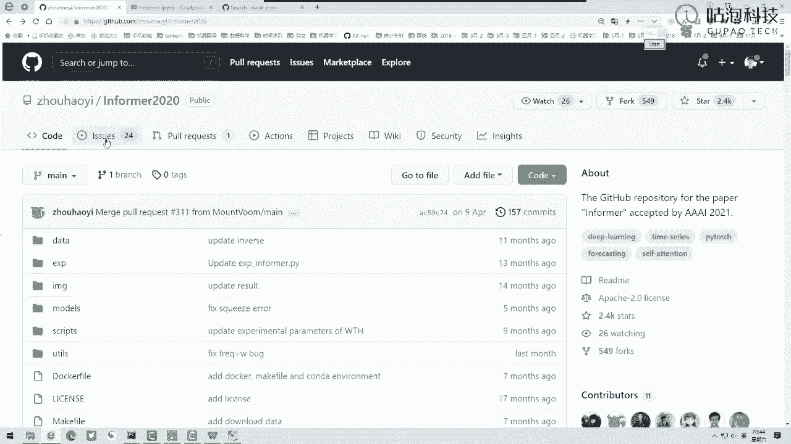

不仅是说咱们跑项目之前，以及跑完跑项目过程当中，比如这一块，我在跑，我跑的时候咔嚓底下报个错，我说这个报错连看都看不懂，我觉得就是以前压根没见过。

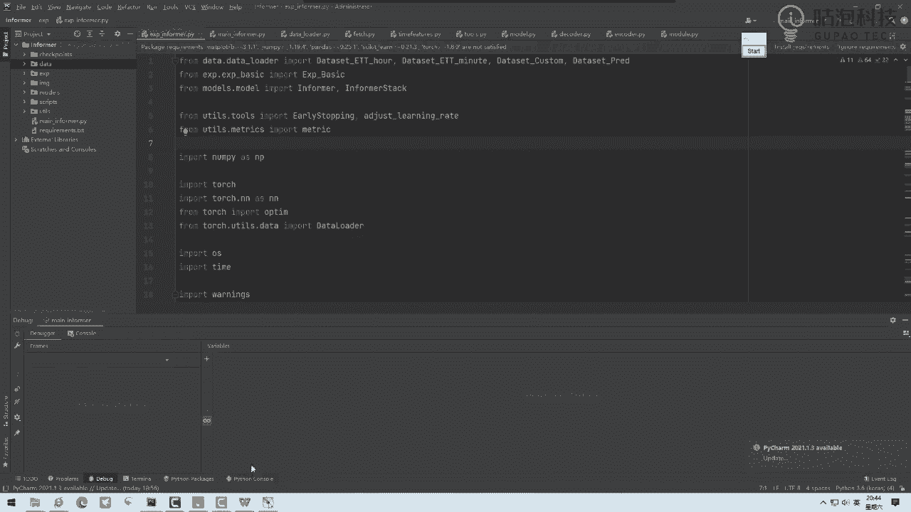

怎么办呢，我可能第一件事不是去查百度，查谷歌，我可能第一件事查这个ISO当中，因为这里边就是你跑这个开源项目遇到问题啊，我估计啊就是大概率别人也问到了一些工具包，版本的问题，一些什么数据配置的问题等等。

都可以在这里找到一些答案的，这样能让你非常快的把这个开源项目跑起来，就像大家说了，就是大家记住这点以后有问题啊，不光是这个百度和谷歌，你跑啥项目到啥项目ISO9当中去翻，你可以是索引这个关键词。

你也可以啊，就是一般我是先，就是如果说这个问题没有特别多的，我就去啊，就一个个去翻，如果是200多太多了，我就是做一做一个索引，你查一些报错的关键词等等，这样咱也可能会找到一些答案的，好了。

这里大家说了一下，就是希望大家多关注的东西叫IOS，然后接下来大家能看到哎呀，这个源码当中有很多东西，那我们该怎么去学呢，来点这里，今天我不跟大家去讲任何的工具。

你也不用去提前学一些get it方面知识，我觉得你学那些东西啊，前期来说呃，尤其是还不熟的同学，前期对你来说负担太大了，咱们就是往往咱们就用最简单最朴素的一件事，我们就点这个code。

咱不用去执行get什么什么操作啊，我怕很多同学都搞不定你们去干什么呢，咱们点这个code直接download一下这个zip，你点下这个东西，它会自动的去做这个下载，你看我下载了，下载完之后。

这就是说咱们把这个源码下载下来了，下载完之后你解压到你任何的路径都行，解压完之后，咱就拿这个拍charm给它打开就行了啊，好我这下载完了嗯。

其实我也解压完了，来我们打开，这是我打开的，打开这个任务当中啊，大家关注一下，就是我们这个左上角当中啊，你看这不就是我们的informer吗，咱现在已经给它打开了，打开完之后它有很多个文件。

其实东西挺多的，那我们该怎么呛，有一个切入点呢，其实切入点就这样这样一件事，我下看项目里边乱码七糟一堆东西，我我都不知道这玩意怎么运行的。

那怎么办呢，来接着跟大家说怎么办，这件事咱们干啥呢，打开这个文档文档当中啊，他基本上会告诉你两件事，第一件事就是怎么去训练，第二件事就是怎么去做一个测试，你看这里他这个usage当中是不是告诉你了。

哎我们去干什么，去做一个训练和一个测试，咱们该用什么样的方法去做，其实你看到这里它是执行这个命令啊，它是命令行执行的，咱们这id也一样，它执行这个min informer，点PY文件。

然后指定一个一些参数，是不是，哎我说咱们做的时候也这么去做呗，我把这东西怎么样呢。

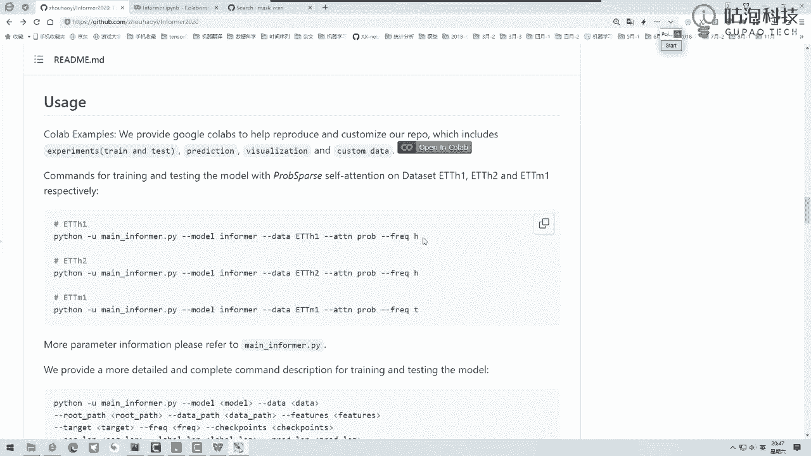

一般如果说你懒得来回切换了，我这里这样我就给他复制过来，然后找呗。

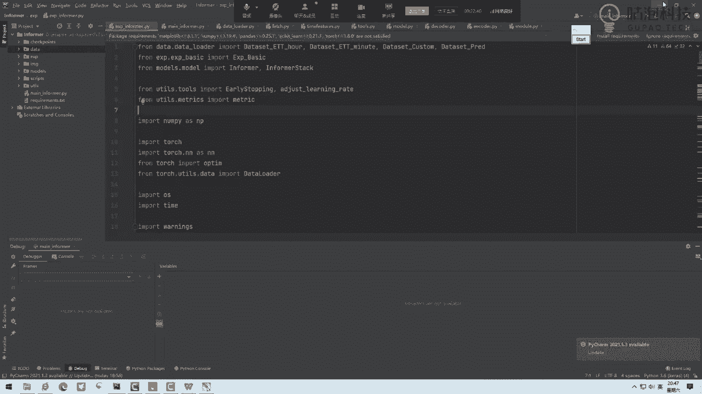

找什么找这个min informer在哪，我第一次下看对象，我也不知道在哪啊找呗。

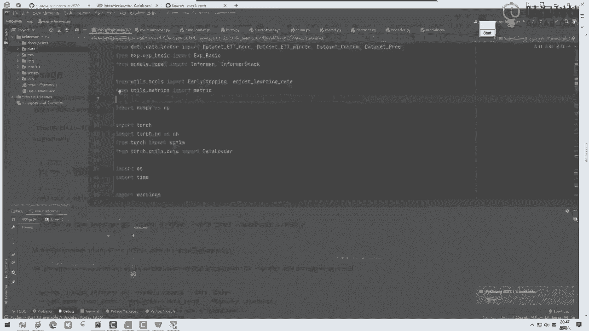

你看我一找是找到了这一块，不就有一个me informer这个东西吗，然后这里边可以说哎呦，代码量挺多的，然后你看我打开这么多文件，由人家说的，那我们该怎么去执行这个东西呢，首先第一件事来。

我们先看一看人家文档当中。

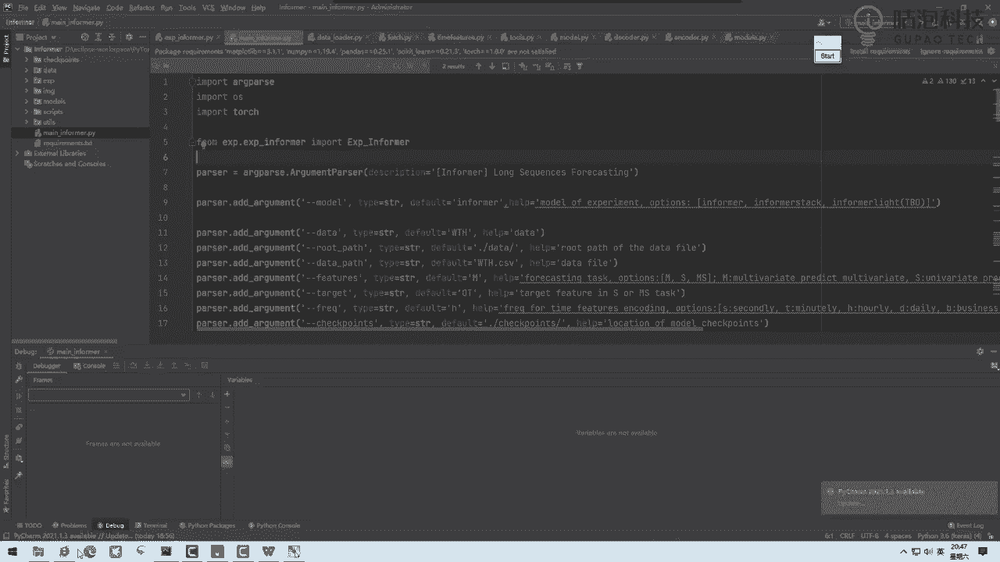

要求我们输入的一个参数都是啥，你看我大概能猜出来model哎，我们指定模型是啥，哎到时候指定加载数据是啥，然后这一块指定的一些attention计算方式，因为时间序列的，你可能会啊处理一些时间的东西啊。

这个frequency，这个东西表示你该怎么去处理时间这些事好了。

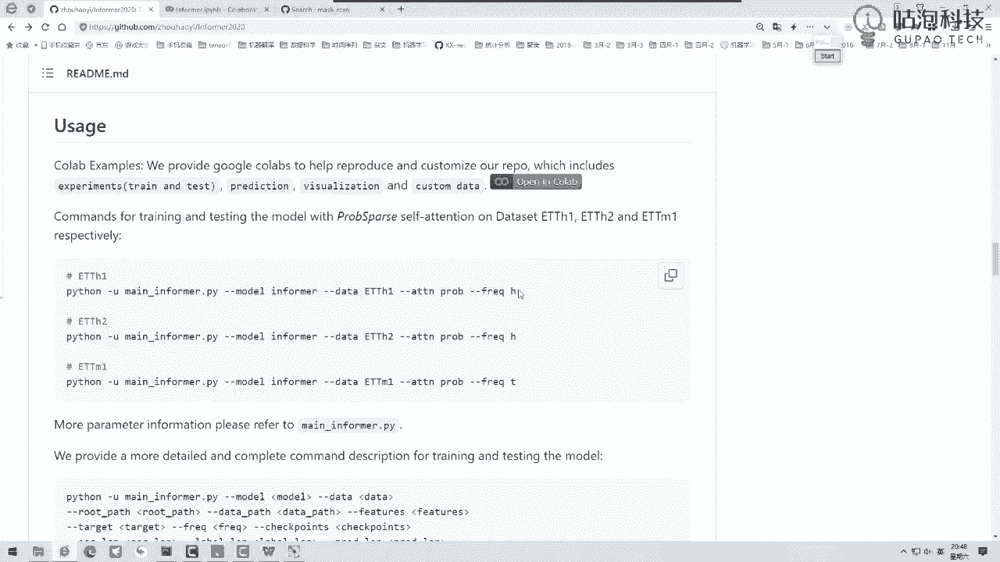

这些叫什么，这些就是我们要用的参数，咱们怎么办呢，你看咱之前是给大家说一件事，在这个Python当中，我们可以去编辑这个参数，要么就是两种方法，要么你去在这个model当中啊，就在这个参数当中。

你加上这个default值啊，就你看我default值已经切好了，他有这个informer，然后这个data啊，就是我选的数据跟他是不太一样的，给大家换了一个，因为也其实也是人家提供的啊。

它提供好多种数据，然后这个是我们选数据，然后下面是咱们数据路径。

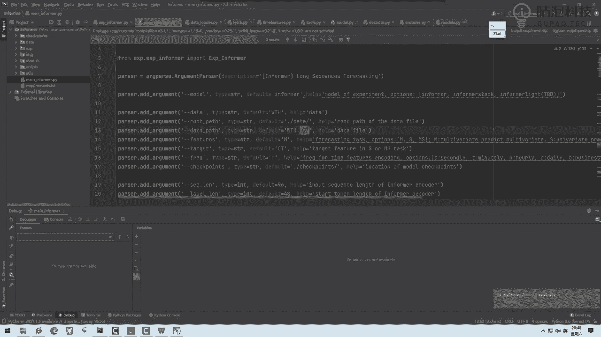

就是这里我要跟大家说的是咱们第二步，第二步干什么呢，根据人家这个说明，你去指定好这些权重参数都是啥，把这个事儿咱们先搞定啊，这就跟大家说了，其实所有啊大家要参考的东西，都在这个read me文档当中。

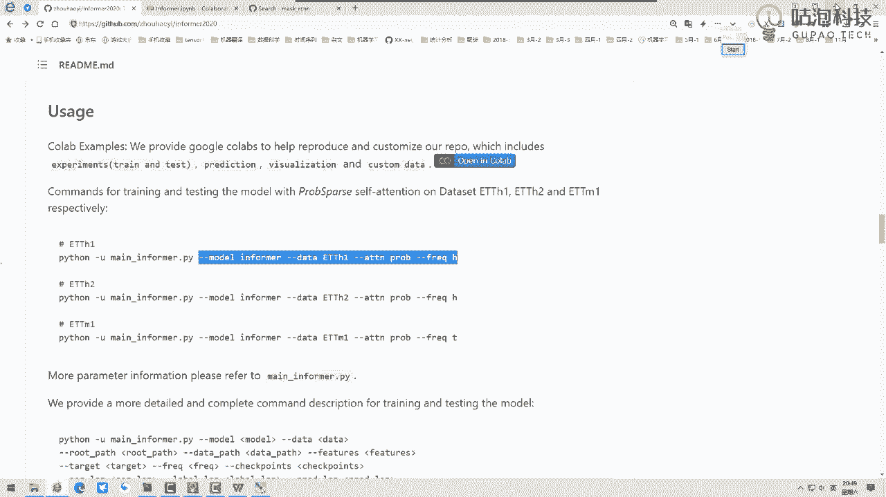

读这个文档，咱就知道接下来该怎么去做了，那好我们把这个参数我配一下，拍摄参数之后，接下来怎么办呢，我们先执行啊，我这个已经配过了，他直接给你跑起来，然后跟大家说一下，就咱们先去跑这个东西。

先确保你跑起来不报错的前提下，咱们一会儿再去研究这个源码，因为我估计大家第一遍跑啊，比如这一块，你们第一遍跑的时候，可能会遇到一堆一堆错误啊，就是这一块他可能开始训练了，会一会又会打印出来很多东西啊。

这个我先不给大家去打印，咱一会具体去说它是啥意思，所以说要求大家就是第一件事，根据我们的read me文档，把咱们的所有参数都配置好，然后我们先去跑这个模型，跑的过程当中可能会遇到各种各样的问题。

遇到什么问题，咱们就现用现查，边用边查都来得及啊，好那接下来来下面我们就要进入到啊，咱们这个源码当中吧，我会给大家去梳理一下，咱们这个源码每一行什么意思，今天我会给大家说的比较细一些，包括我们的数据啊。

就咱们就从开始吧，咱们就从这第一行开始，一会儿咱一般情况下我可能讲很多源码啊，不会这么细的，但是咱们今天嗯咱既然有这个时间，咱今天也拿这个开源项目下来，咱跟大家说这个事，所以说我一行一行大家去捋一遍。

后续大家自己的项目，你可能就前面不是特别重要的东西，你就可以省略掉你重点debug两个地方，一会我用到给大家去说，其实很多项目主要我主要选两个地方，第一个就是你的数据是啥，数据怎么处理的。

第二个你的模型怎么搭建的，其实主要处理这两个地方基本上就足够了，我们学源码，其他的一些函数，可能一般情况下我不会都去看的，但是咱们今天一会我们做的全一点，再把每一个都给大家去看一下啊，好了。

接下来我们要说源码这个事了，然后呃然后跟大家说一下啊，就咱们这个任务，就是咱们今天带你们别去下这个gate了，你们搞这个get，我怕你们浪费太多时间，直接下载一个压缩包就完事儿了啊，这个配置其实很简单。

就之前我们PYTHM当中怎么去配置的，咱们接下来怎么配置，什么是命令行执行，你把这些呃，把我们这些项目你放到那，什么放到你的服务器当中，你的服务器你直接SSH过去，你直接通过命令行就执行了。

咱们今天是演示这个debug过程，所以说我们没有命令行执行那个过程啊，呃呃哈哈，可以的，可以的，就是不让大家多太多负担了，就你们愿意用git自己去用，自己研究这个东西就行了，咱们今天用最简单的方法。

保证每个同学都下载下来，直接去download一个zip，自己解压就完事了啊，因为我们大部分帮助同学可能都是跨专业的，咱们学计算机的，学本专业同学极少，极少，大部分同学还是零基础偏多一些的行。

接下来来我这，咱们今天不是图片数据啊，一会大家去说嘶行，接下来我们开始完成我们这个debug操作。

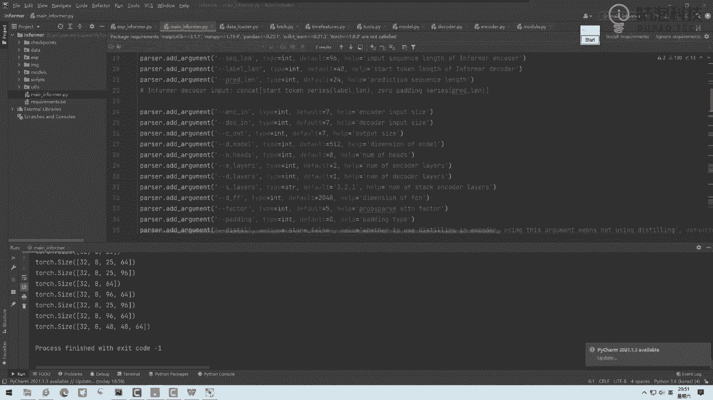

在完成之前我们先看一看咱们的数据是啥，来这里边打开我们任务，也是建议大家就是跑之前啊，就别说你这个跑完代码，很多同学之前给我，我觉得最大的问题就这个代码啊，照样识别能跑出来，跑是啥都不知道。

数据在哪都不知道，他问我一堆问题，我说你这个标签你检查了吗，讨论跟我说老师什么是标签，标签在哪我都不知道，其实我觉得大家这样啊，就是说咱们在学的过程当中，一方面是带着问题去学习，另一方面我建议大家。

既然咱们要落到源码这个级别了，你要怎么去做呢，就是首先起码得知道数据是啥，数据咋处理的，是不是啊，数据处理完之后咋扔，这个模型里的模型长啥样子，模型是怎么训练的，训练完之后咱得到啥了。

比如说得到咱们这个呃保存那个我们那个模型，这个文件最后再怎么去用的，建议大家啊，就这样一个环路吧，都要从头到尾去理解一下啊，不要说照着视频跑起来转起来就完事了，转起来都没啥难度啊。

你要把每个细节咱都掌握起来，来先看一看我们的数据呃，到时候我给大家传这个网盘啊，就是网盘里边我把这个数据都做好了，其实也不是我做的，就是我下载下来了而已，我们来看一下这个数据，它是一个CSV的数据。

因为我们今天咱们做这个时间序列啊，其实并不是啊，预测一个图片，也并不是预测的一个文本，所以说它是用一个CSVCSV文件来做处理的，这个无所谓，你后续啥文件格式其实无所谓的，你是TIT的格式，你是啊。

各种各样格式，其实这都无所谓，啥都可以的，我们先点下来看一看，来这就是咱们今天拿手的数据啊，做这个时间序列什么最重要，你要做这个时间序列啊，你是不是高低得有一个时间啊，不是说啥任务都是适合我们今天日。

今天这个这个事儿的，咱们今天这个事要有明确的一个时间，也就是样本和样本之间，它并不是一个独立无关的，比如说表示今天的一个天然气啊，或者说唉你要预测未来的一个趋势，未来走向等等，根据这个时间来去做的。

我们来看观察一下，第一点data当中我们这个date date表示什么意思啊，时间是不是一个样本，它有固定的一个时间，咱们今天这个任务啊，选的时间间隔是你就当做吧，嗯你可以把它当做是我们的一些仪器。

或者说我们的工厂流水线，每隔一个小时，它在做一些采样，或者说我们的一些什么设备，每隔一小时它就会记录一些指标，好了，这是第一件事，来我们的数据当中，它是以小时为单位的，它是挺长时间之前的事。

2010年1月1日，然后0。1。2。3点四点啊，就是怎么时间去练，然后2号，然后3号啊，反正一天做24个采样点，每个采样点间隔是一个小时，这是我们数据，然后后面这些东西啊，其实无所谓。

后期反正大家也用自己数据解这东西是啥，其实我他那个说文档我我我都懒得去看的，因为我我不太想学太多的，就是跨专业的知识，这是他们说什么风电的，说什么啊，有好多领域的东西，其实我不太理解他们具体指标含义。

因为实际场景我没去过啊，不知道他们实际场景是啥，你就当啥，从这儿到这儿，你就都当做是我们的特征啊，你就当做每一个时间点它是有多个特征的啊，你看这都是每个时间点当中有这么多的特征。

然后最后这一个我忘了是不是最后这一个了啊，应该是最后这一个它就是我们的Y，这是X这是我第一个Y好了，这给大家看下数据啊，就是咱们今天你不用管这个数据是什么，以后你就套自己的数据。

但是大家需要知道我们的数据格式里边，一定有什么有时间这个东西，它这个CSV长这样，你的数据长其他样子无所谓，一会儿给大家去看他怎么做处理的，咱们大家自己玩的时候，只要能把数据处理好就行的啊。

其实啥格式是无所谓的好了，这就是我们的一个时间序列数据，然后他这个任务当中啊，不仅提供这一个，还有一个这块还提供数据哦，我都我都我都记不太清了，他这个数据到底到底是哪个行业的，都都写了一些缩写啊。

写些名字，你看这块这块我感觉更像什么，大家看一看，像不像是你工厂流水线当中有很多，有很多那个什么传感器，有很多零件在每一时刻当中，你看每一时刻当中，这你就当做吧，每一时刻当中这些传感器啊。

它这些指标值等等，然后最后我们可能要预测，比如说预测的一些啊什么值吧，啊反正就是啊他的一个时间序列数据好了，这我们数据啊给大家看了一下，一会儿咱们用pandas去做处理是比较合适的行。

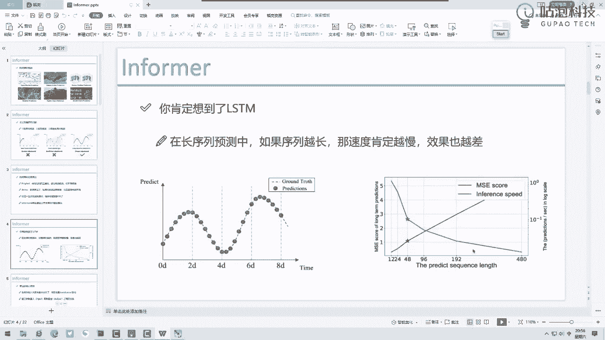

接下来怎么办呢，来跟大家说这样一件事，拿到这个源码之后啊，就这里边有啥咱都不关心，就你看这一块它有个data，然后什么EXP，然后什么这个呃models，有这个scripts，有这个UTAH这个东西。

就这些事，这里边有啥咱都不用去管，不用去看后续用到啥了，咱现用线看，然后我第一件事大家来看，这是呃，这是咱们的入口入口吧，这是我们这个min former这个函数，我是不是在这个第一行代码。

这就给大家打上一个断点了，所以说接下来咱就从这行开始，我们就一个一个一行一行再往下去看啊，一行一行我们去理解这个事儿，然后接下来就是大家到时候，选所所所需要做的一件事，在我们的入口当中。

第一个位置你就打上断点，我们一点点去捋，用到啥咱就讲啥怎么办，来点我们的debug操作，接下来就会进入到啊，我们这个debug当中，我们就一行去捋，哎他怎么给我停到这儿了，这块我什么时候打个断点。

我重来一下啊，哎感觉好奇怪，他怎么在一个很奇怪的地方，哎在这是不是这回对了啊，刚才又不知道点哪去了啊，来看这一块，这第一步解析我们这个命令参数，我为大家先来说一说吧，嗯给大家咱们需要用什么说什么吧。

面向参数是啥，哎呦这个东西我觉得我说完都得都得10分钟了，咱们今天说的细一点吧，我就从刀给大家去解释，首先第一件事我们来看一看这些面向参数，都是我们自己去指定的。

第一个model model表示说哎你要用什么网络结构，其实这篇论文当中他肯定会做一些对比实验，是不是对比实验当中，他肯定网络结构不仅仅是做了一个，它可是多多个通过这样的选择为大家来看啊。

就是它这个model当中它定义了很多类，你看有这个informer，还有一些其他的啊，还有这个啊informer stack，就是它有不同的一些类，相当于不同的网络结构这块呢让我们自己去选。

哎我们用的网络结构是啥，咱们今天讲这个informer，我们不说它的变形体，第二个我们的data嗯，就是你要读的数据，它是什么啊，你要读哪个类型的一个数据，这是数据的一个类型啊，反正它就是个CSV文件。

然后这个root pass咱们这个数据啊，它所在的一个路径在哪儿的啊，属于所在的一个路径好了，然后这一块就是我们这个数据它的一个名字，其实我们这个数据拼到一起。

就是点data文件当中有个WWTH点CSV文件，然后下面这个features feature这个M啊，他是这样一件事，就是我先给大家解释啊，就后续咱们会用到这些东西的。

会用到就看到了这个feature是这样，这个M它表他表示意思啊，这块他说了，你看他有注释这个M啊，他意思这样就是呃我们是一个序列，就是输入的是多个，你就当做我们这个输入的它是多个特征吧。

然后预测多个值啊，你可以输入的是单变量，预测多个值，你也可以预测输入是多个值，然后预测一个单变量，这都行啊，这是我们预测的一些种类的方法，然后这个target这个target它它是这样一件事。

我我我记着啊，我记得这个东西应该选的是，你数据当中要把哪一列当做是你的一个标签吧，它也应该是个标签的一个意思啊，这是指令我们标签，然后这个FRANKY这个东西它这个事也是这样的，嗯就是说你这个数据啊。

因为一会我们有时间有时间的东西，如果说之前有些做过数据挖掘的同学，你们可能会熟悉一个东西叫时间重采样，是不是重台上啥意思呢，我们现在该给大家看数据是以小时为单位的，那我们能不能对数据这些处理呢。

我说以啊四个小时为单位，我说哎那我给大家举个例子吧。

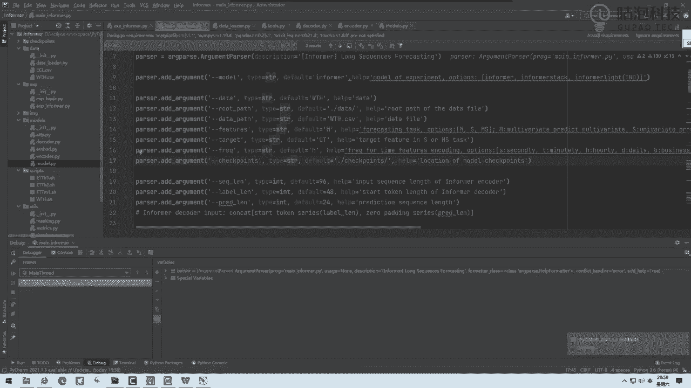

其实这块能玩的东西特别多，呃这涉及到数据挖掘了，我估计可能很多同学之前咱都不属于这个事。

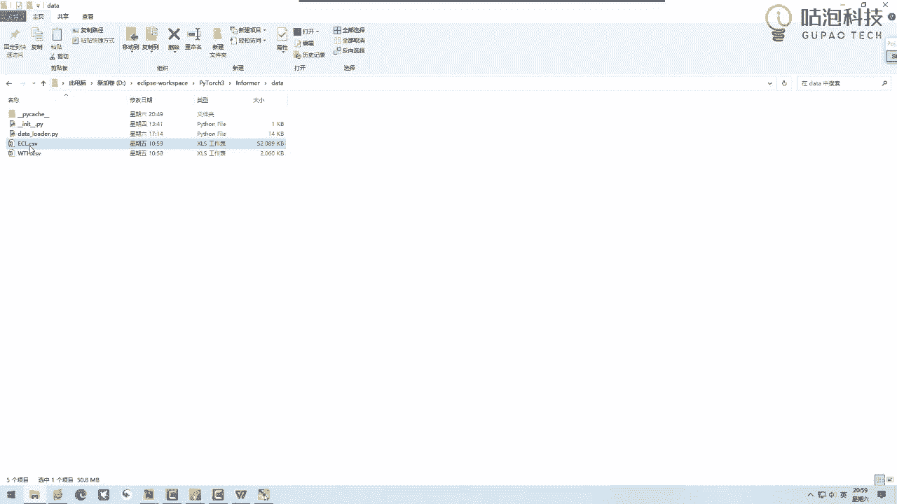

我给大家先简单来说一说，比如这样，你看这一块我们是以小时为单位，是不是我说我把这个数据做一个整合，我觉得小时为单位变化太慢了，整合成以四个小时为单位，我说这四条数据能不能合并成一条呢，可以的。

这四条数据可以，这就是重采样，对四条数据也可以合并成一条，那怎么合并每个位置啊，我说求它的一个均值行不行，第一个变量四个值求均值，第二个变量四个取值，求均值行不行，求均值也行，求最大求最小。

求什么中位数是不是都行啊，这是一些重采样的操作啊，这个就是咱代码当中吧，一会大家没看到，我们默认是以小时为单位，因为原数据它就是以小时为单位的，后续你的时间序列你想怎么变的花样去玩啊，这个你自己去定。

咱们这一块就是以小时为单位的这个拆point，最后模型它要保存的一个位置，Sequence length，sequence l是这样的，就是我们现在做这个时间序列啊，它这块起始值是96，就这样的。

我给大家去画啊，我们输入这个序列啊，它是输入的是一个96，因为我们要知道他之前的一段情况，好去预测它未来的未，他去他预测它未来的一个情况，所以说啊这个96表示，就是说哎我们当前输入的一个序列长度。

大家注意这个96是输入序列长度，其实这个96啊不是固定的，是你自己任务，你自己定，你的任务是48，是24，啥都无所谓啊，但是一般你别太长，太长情况下学起来可能难度会比较大一些啊。

这个是我们SNLSS这块还有一个label呃，这个label它解释起来有点有点有点抽象，就是大家看没看，我们之前讲这个原理，讲原理的时候，咱们是不是说过一句话，他是这样的。

就是我们再去做预测的时候需要带一带，因为我们是个encoder和decoder结构，我们再去做预测的时候，这一部分是48个值，是有先验知识的，然后接下来要预测什么，要预测未来的一个序列长度是24的。

也就相当于我蓝色画这个东西，这24个是接下来我要做预测的，这三个值不是固定的，你自己任务当中，自己根据任务来去决定，这就可以了啊，好这我们这个参数再点往下说，我就咱今天细点吧，我就一个给大家说吧。

然后呢这个encoder in它表示就是说呃input size，它是这个意思啊，其实这个数是根据你数据相关的，你的数据当中啊，比如说你选了七列啊，那你的encoder它输入就是七列啊。

这decoder其实也也是如此，编码器和解码器都要输入我们的数据一开始，所以说这是咱数据的一个维度，然后这个COUTCOUT它就是说我们输出的呃，这个我记着哎，这个我好好像参数好像是没有用到呢。

我怎么记着这个，就是说你最后还要预测未来多少个值，咱们任务当中，我记得好像就是预测未来12只嗯，这块是七一会我们看一看吧，大家先记住这个值，cl等于七一会我们看一看，好像是我我给他写死了，我。

我记得这个咱们这个数据预测是一个12值啊，然后这个model model这个512，大家会一会看到512，是我们隐藏的一个特征，这是我们隐藏的特征，transformer隐藏的特征，n hi我快点说了。

n hi当中你要做muted head的啊，多层注意机制，encoder layers当中，咱们之前说过，就是我们做这个transformer，我们是mute had attention，再来一遍。

Mute head attention，再来一遍，Mute head attention，你要做几遍，默认是两遍啊，就是两个MUTI的tension，这是encoder，然后decoder啊。

他也这么去做的，然后这一块就是说啊你这个encoder当中啊，这encoder层它可能有几个mod head，有tension，然后这个他的意思就是说呃，你那要堆叠多少个一块当中，它我记着啊。

这块三个这三个就是大家后续看我执行的时候，你看到有个for循环复员当中会用到这个参数，它就相当于迭代就执行三次，这三个当中每一次要走这么啊，呃一次就是该这么说吧，这是三个，这三个都是每一个都会走两遍。

这个encoder layer啊，就这种感觉，然后这个factor这个factor是后续咱们会用到的，就相当于我们这里边，不是要对那个Q做一个采样吗，这是采样的一个因子数啊。

这个数大家后续也可以根据自己任务去改，这是padding拿零做我们的一个拍掉，然后这个是我们做那个就是这个这样一件事，就讲讲原理的时候给大家去说过，哎这参数太多了，我说参数说半天了。

这个原理是咱们说是不是啊，哎比如一开始我们输入序列是一个96的，然后咱们怎么加速来着，我说接下来我们做完每正常这个transformer，正常输出，transformer是不是96完之后还是96。

就序列长度这一块，咱们需要长度减半了，是不是相当于做了一个铺领，这个操作变成48个了吧，这个操作，就是说你要不要做这个减半的一个操作，然后招pot就不用说了啊，一般都是需要加的，然后这个tension。

我们注意力机制计算的一个方法，这是人这篇论文当中提出来的核心的东西，咱肯定要用的啊，所以说DEFAUL值是有的，咱们一会attention这方式挺特别的，然后这个embedding。

我们时间序列怎么做embedding啊，一会给大家去说咱们时间这个东西，然后这个激活函数，然后这个呃输出的时候，我们要不要输出attention这个东西，然后要不要去做这个预测啊，就这一块好多好多参数。

就是到时候大家都可以一遍一遍去过一下啊，挺多的，然后这一块儿max attention，这个咱咱没有去做这些论文当中，也没有去说，也没有咋去说用这咱没有的，然后这一块就是我们要执行啊。

这些其实就是咱们读数据的时候，要读哪些个数据，然后number wor当中这个大家注意啊，windows你默认是零二，你windows你就不要指用其他了，LINUX当中你可以随便指定。

因为windows你不指用零二有可能去报错，咱们这个迭代次数，这个ATR它不是迭代次数，它是训练的轮数，它是训练就怎么说啊，比如你训练20个EPOKE，他会把训练20个EPOKE完之后之后。

再来一遍20个EPOKE，所以说你的epoch是为二的情况下，它这块再乘个二，就等于40个epoch，就这种感觉啊，这是train epoch，这是by ch size。

这是我们那个early stopping，就是连着多少次，你那个没有没有做一些更新，然后他可能就提前停止的一个策略，然后学习率啊，学习率咱稍微小一点，一般情况下学习率都会稍微小一点，才是比较合适的。

然后这个就是啊这个这个这个这个没啥用，这是损失函数，默认的MSE就不用说了，要预测的具体值损失函数，我看其他的啊，adjust啊，这些学率衰减的东西amp这东西咱暂时没用，这个适合你，分布式。

适合LINU，当去做的windows很多时候都会出错，这些咱也不用用，不用反转我们输出的一个结果，然后这个GPU我建议大家去用的，有就默认它会用这个东西啊，默认就是零欧，就是你只有单机单卡。

它就是个0O这个我没有指定，因为我当然这个机器它没有分布式的东西，如果有分布式的，你可以指定你有四个卡，0123就完事了，之前给大家看了一下，就咱们这些参数呃，后续大家玩自己开源项嘛。

可能你们不一定都能看得懂这些参数都是啥，所以说第一件事嗯，你不用都看懂，你就知道知道大概有啥行，等你把这个源码从到底debug完一遍之后，你再回来看这个东西就相对来说比较容易了啊。

因为今天我说给大家去讲，所以说我给大家从头到尾去捣鼓了一遍，它都是啥，后续大家自己任务，你就是先不用去改，你先跑起来，先debug，用到啥，我们看啥就行哈好了，现在大家说了一下，咱这个参数说了半天。

拍电影是要我们要做那个对，就是蒸馏，类似蒸馏这个意思，咱们今天啊我这语速也比较快，因为东西太多了啊，他就是宣两次，正常情况下我我也觉得挺特别的，他是一次，就是他他是要做，我给大家解释一下吧。

他这个论文他说要做对比对比实验的啥，对比实验，二二十个EPOKE，它的结果是多少，40个EO结果多少，他要作为对比实验的，所以说它指定了这样一参数，CPU是跑是可以的，这个这个当初的意思就是。

就是你不用指定参数值，你把这个参数写上去，指定就为true，就他要加这个东西，不要着急啊，大家先别着急，就我这语速已经够快了，你那边再跑，你就跟不上了啊，哪个哪个我给大家说一下。

这个是不是这个意思是这样，就是说呃你看正常我们要不要加这个东西，正常的default值有什么true啊，还有什么false，是不是，然后这一块他就不用，就是在我们任务当中，你只要把这个参数指定了。

就这里边我大为你演示一下，你只要把这个参数在这里指定了，它就是为true的，我只要加进去，我不用写参数值，只要指定了它就为true，你不指定他就为false，他就是这个意思啊。

然后这就是加到我们这个参数解析当中啊，从命令行当中解析到我们这个参数，从命令行当中把我们这个参数给它读出来啊，是这样一件事，我们只讲informer这一个模型，其他模型咱就先咱今天讲不完的呃。

我给大家发那个CSV，我给大家发那个CSV，你就大家先别着急，你们先别着急下这个东西啊，先听我把这个故事说完，来来继续，然后接下来啊来看我们执行一下，刚才给大家说了，这些参数都是相当于加载我命令参数。

啥叫命令参数，就这里边你通过命令行写这些东西。

全部会在源码当中读进来的，咱现在用过PYTHM，你就这里边要么是这块指定默认值，要么就是这里边你自己加进去这些参数，然后我们看看解析到底都结果是啥，你看我执行一下是不是解析这些参数啊。

你看我执行执行完之后，我把鼠标往这一点来，大家看点完之后是不是说哎，这就是我们所有已经选中的默认参数，一会儿呢我们会通过这些参数来去干什么，去取这些值，哎，比如说我建模的时候。

我要取到取到这个DEMODEL得多少，这是不是就是刚才我们指定参数啊，好了咱把这些参数全部拿到手了，都解析出来了，然后接下来这一块，这又是GPU啊，我是个true，就是拿GPU去跑，我估计CPU也行。

我这块是一个单卡，所以说我没有下一步，这个没有下面这一步操作，这一块他是个多卡操作，我会直接跳过去的，因为我没有多卡，再下一步他这一块他对这个数据啊，先定义一个字典，它定义这个字典。

这样我先给大家执行完啊，然后接下来大家看他定义这个字典啊，就是说哎他是提供了很多样例数据，他的意思就是说不同的样例数据啊，我们指定的标签是哪一列，你看这是指定的标签，它的一个列是哪一列。

指定是哪个文件啊，指定它这个啊，比如这一块，你看这个这这些，就表示说，我们最后输出的一个要预测值是12个，就相当于输入这个序列，它是输入96个，要预测未来12个，这就是说他在这个字典当中啊。

把这字典里边预测啥都给大家去列出来了，到时候大家你们自己玩的时候自己出去咋办，有自己数据啊，你就是面向复制粘贴编程呗，啥意思啊，来这一块我说我自己的数据名字，我就随便写一个呗。

就比如说这一块我就叫做一个买data，然后我这个数据哎呀我是什么什么点CSB，你自己写，然后这个然后接下来我看看啊，什么什么点CSV啊，然后这个你这个呃这个T这个这个参数表示。

就是说你要你把哪一列当做标签，你把哪个包到标签，然后比如说接下来我要预测未来的呃，64个点吧，你就通通都改成64就完事了，就是说照葫芦画瓢，人家这个东西咋做的，咱就是改自己数据的时候怎么去玩儿就可以了。

好了，这里大家简单看一下，一会我们用，到时候咱们还会继续去说啊，用这个字典去解析我们的数据，然后下一步下一步啊，下一步就是说他把这些参数取出来，你看这一块他把这些参数都取出来，就相当于上面写那些东西。

他现在都会取出来，你看这里边我这个dio info，就上面这个数据它都取出来了，然后他这个路径，然后他这个标签二，然后encoder in啊。

你看这是12个，说明咱们这个数据为大家看一下吧，它确实是12个啊，就这是我们读的数据来数121俩，23456789十十一啊，但我啊加上这个10号，其实我刚说1。2，那所以说加减13个是不是13个当中。

我去掉一个标签是多少个，是12个是吧，所以说这个就是我们这个数据啊，好了这里大家去看了一下，把这个关掉行，这块给大家看了一下。

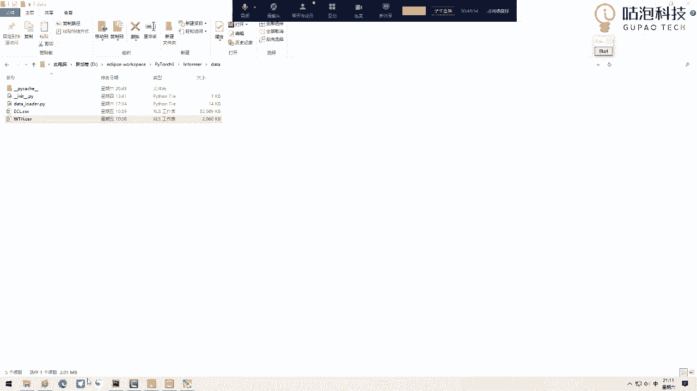

就是咱们这块数据啊，它会指定参数，到时候咱自己熟悉完之后，你自己改成你自己就行，然后这个slayer当中也去读，这个也是通过啊，他这个呃刚才咱们执行这个命令参数指定好了，它是321。

是不是它会循环有这么三次，然后这一些就是frequency这个东西是个H，就是说咱们是以小时为间隔去做这件事的，好，你看这一块它都是以小时为间隔的，然后下面呢他做了一个打印，你看我们打印出来。

结果这一块就把咱们所有参数打印完了，然后再咱再往下去跳啊，指定这个类这个类似咱一会用到的，我给大家看啊，就是比如说你冷不丁啊，看到代码当中，你有个有个东西你都不知道是啥，就我看我当时看哎。

我说这东西咋起名这么奇怪呢，那怎么办呢，摁住CTRL，咱点一下子，是不是就知道了，他在哪进行定义的呀，你看在哪，在这个e x p informer点PY，哎我说我不知道这东西在哪，我要装上这一点。

他是不是告诉我这个路径了，你看这里在informer e叉PEXB，informer点PY当中定义了这样一个类，所以说啊，就是一会儿咱们会用这个类帮我们去取数据的，下面定义好了很多。

咱们该取数据的一个东西，所以说这里边他先啊把这个类写一个简名，叫做一个ha hp，然后接下来我们会通过通过它来帮我们读数据，你啥东西不知道在哪儿的，你就用CTRL点进去看这样定义的啊。

来接下来接下来咱这样啊，这个这个循环是这样的，我给大家说了，他这一块是个二，就是说我们会遍历两次编译两次，相当于你看train1遍，test1遍，再train1遍，再test1遍。

因为论文嘛要做一些对比实验啊，好了，然后接下这个setting，我们直接来看它的结果，这个setting其实说白了啊，其实我觉得这个它是一个字符串，这个字符串也没啥用吧。

可能一会儿对于保存什么名字来决定的，它就是把你所有那啥，就是把你指定所有参数都写好了，我估计是一会儿往日志当中去写的，或者说要生成一个拆point的，生成一个保存的保存的一个文件的一个名字。

让你知道你这个名字是对应的，哪些的配置文件啊，所以这一块他自己起了个名字啊，写的挺长的，就把咱们刚才指定所有参数都拼一块了啊，好来接下来啊，接下来这一块我们再跳进去跳啊，这这块没有这块，它啥都没有。

这一块儿来，再往下再往下，这一步是核心啊，就是我们的一个train操作，顺操作按住CTRL咱点进去来看一看他做了啥，这一块我打上断点了，来咱们跳入到这个断点当中，第一步干什么。

其实接下来在我们任务当中啊，我们就要去读数据了，是不是刚才只是看了一些配置文件，没啥难度，下面呢我们要读数据，读数据当中啊，这一块你看一般我是我是习惯这样啊，就是呃我不习惯是摁住这个跳进去。

因为有些它跳不进去，我一般先入control看一下你这个get data是在哪定义的，好，get data点这定义是不是好，那我打上断点，那接下来我们就跳入到这个断点当中呗。

看一看他是怎么样去读我们这个数据的，首先呢把我们刚才就是定义好这些参数拿进来，因为这个参数当中有我要用的信息，比如说有我要读数据的一个路径等等，以及我们把哪一列当成标签。

是不是都是在命令行参数当中指定好的呀，好这是把这些参数都读进来，然后接下来啊接下这一块来，我先执行完，既然这块当中啊，它是构建了一个字典，这个字典是这样的，我给大家举个例子啊，他是写了好几个。

可能大家你们第一次看的时候啊，都有点懵，后续咱们就听我说完之后，你一定要在自己debug1遍，就啥事啊，你不自己做一遍，你永远不知道咋做的，一定要自己搞一遍啊，它这样它有很多类。

你看这些就大家可能说这是个字典啊，这是数据就有不同的CSV数据啊，不同数据它可能对应一些不同数据处理格式，是不是就是这样的，有的是针对小时的，有针对非中的。

咱们既然说这个我们说一个通用的叫DATASET，customer这个东西，大家注意这个词，这个customer这个东西啊，你在很多开源项目当中啊，都会遇到这个东西，它啥意思啊，就是一个你就当做自定义吧。

就是我们自己的数据集，我们可以自定义，到时候大家也要改这个东西，那我们来看一下我们今天这个数据，我的数据是啥来着，如果说你都不知道你数据是啥，你点开点看一看，是不是咱配置员当中。

是不是告诉我你这个data是什么WTH，虽然我也不知道他为啥这是这个作业表，啥啥意思啊，反正我们这wt也是这个文件，比如什么data set customer，那我们来看一看呗。

按住CTRL我点进去这一块，他是不是继它定义一个类啊，然后继承谁继承那个touch dataset，说明这是人家自己定义的一个数据集的方法，一会儿我们要用人家的方法，帮我们去取数据的啊。

帮我们取数据的好，我们再往右走来，在我们任务当中，我们这data指定好这个类了啊，叫什么dataset customer，一会我们就进入到这个类当中，然后这个这个没啥重要的啊。

这就说我们一会给大家看怎么去啊，对时间序列，对那个时间那点做处理的，它是有两种方法，一个是零的方法，一个一的方法，一会看到咱们就咱们就会说了啊，然后下一步它是呃这个flag，它是这样一件事。

就是我们大概是个训练操作，所以说他没有走这个test，也没有走这个预测，我们先说训练训练操作当中啊，它指定一些参数，这要是整个参数给大家说一说啊，第一个SHUFFER。

SHUFFER就是训练的时候要洗牌就不用说了，Jplast job，Last，这个事就是嗯怎么说呢，就是大家买菜的时候，你买菜，你你比如人家菜卖个两块九毛五，你给他三块，你给三块啥意思啊。

说你不用找零了啊，就这种感觉不用找零的一个事，比如说你咱们现在一个数据一共有这么啊，写多了个十百千万10万10万01的10万0一个，然后呢咱们这样每一个batch是1万个，每一个batch10000个。

那十个batch呢，十个batch是不是10万个，那最后一个咋办，最后一个单独做一个batch吗，不是的，最后一个给它丢掉啊，最后一个就给丢掉了，咱们相当于啊就是BACH是一个整数啊。

就是如果说烧到最后的时候，你那个组不成这个batch了，给它呃，JOBLAST为true，就给它丢掉了啊，这个咱们丢掉为什么要丢掉时间序列啊，兄弟们，时间序列不是说你随便上别的地方凑点儿。

不是说你这个大家可能说来我丢一个没关系，我拿这一个，然后上前面其他地方凑一点，你其他任务行，因为是独立的，咱这时间序列你凑不了时间序列，你瞎凑，那那那那那那是时间不乱了吗。

不行就这个JOBLAST一定是一个呃，这呢JOBLAST一定是个处值，然后再往下这个by size，by size就是你的批处理的一个数量，我这块32大家自己选啊，咱们今天这个模型你选大点。

选小点根据自己的配置，然后接下来我们是以小时，这些是我们需要参数，咱们国家数据集的是以小时为单位，去处理这个数据，一会大家会看到啊，我们是怎么去处理的，来再往下走，来看这一块。

要定义咱们的DATASET了，注意这个data你要时刻知道这东西它是啥，你忘了怎么办，把鼠标这一点是不是哎，data set customer当中再不行，按住CTRL啊，点进去看一看它是啥。

是不是都可以啊，哪哪儿去，我来再往再往下跳，再往下跳过程当中给大家跳进去看一看吧，来再往下，你看跳跃当中，这是我们指定的dataset customer这个东西，首先它上面自己做了一个定义。

来咱们一个往下走啊，自己做的定义来看，这一块是我们做的定义，这个size来先给大家执行完，这个size就是我们刚才指定的一个参数，咱们指定参数96，四十八二十四，大家能不能记住是啥了，96来看这个吧。

96表示我们输入序列的长度，输入的长度是96的，基于96的长度去预测它未来的一个值，未来去预测未来的一个趋势，然后这个这个label lags啊，就是嗯这东西挺绕的啊，这是我们的一个96的。

然后呢这是咱们那个48的，为大家写这个48的，它叫做一个label lungs，我之前是给大家说，一定先看原理，你不看原理，你根本都不知道这48是啥的，然后接下来我们还有啥，还有一个预测的。

这个预测是24个，就是大家注意这一块啊，有一个点哪个点呢，咱们现在这个48，我就我就这么写，48+24等于多少，等于72，是不是大家记住这个数，一会儿我会重点跟大家说，72这个数它是干什么的。

因为在我们的encoder，我们的encoder当中是对这96个做编码，我们的我写我写个encoder啊，我们的decoder当中，咱们是对这72做编码，为什么我们的decoder。

不直接去预测这24个呢，decoder不愿意做预测吗，为什么不直接预测24个，因为直接预测二这个效果太烂了，这是这篇论文核心的一个思想，在抵扣当中，我们需要一些有标签的来去带带它啊，就像这样一件事。

比如现在你直接的去预测24个，我说他可能够他可能够能做好，我睡在前面，给他给他找个师兄，带着他，找48个人先给他铺垫铺垫，我说前面48个啊，我找人给你做好了，你后面24个你自己去做啊。

这样咱效果能更好一些，知识论文核心思想，你忘了回去看看咱们之前讲原理视频，再回来刷，咱们这个再回来看咱们这个呃，讲这个源码的啊，好然后接下来还有这速度低挺快，因为今天咱内容太多了啊，来接下来在任务当中。

咱们现在这个tab值啊表示的就是说咱们是啊，我们现在这是个train，你看这一块是020表示train，我们现在执行是个train的操作，然后指定好咱们这些这些个，这些就是刚才咱们指定的参数。

我给大家为大家执行完吧，然后再一个看一看这个features啊，就是我们一会儿会选所有的列，这个M表示我们一会儿会选多变量，选所有的列，这个target表示的是就这一列，就大家就是你就是CNC当中。

这一列是我们标签二，这能理解吧啊这一列它是我们的一个标签二，然后这个skye scale是干啥来着，SKYE我都忘了，一会一一会用到，咱们继续说吧，用到scar我们再说，先直接看啊，想不起来这个东西。

然后这universe表示输出要不要反转的顺序，咱默认不反转，然后这个time time，我记着time是说咱们时间序列处理那种方式，两种零或一，然后fork得用这个H列名列名没指定，一会儿会读数据。

读数据，自然会把这个列名读起来，然后这个root到哪去读这个数据，然后这个data pass去读哪个CSV数据，然后接下来执行啥，只有这个月data是不是断点哪去了，来往下就跳。

跳到这个瑞亚越野data当中，首先第一步使用我们的standard，这sender是数据标准化，啥意思啊，咱那个数据之前也没做过啥标准化处理，我们需要先对这个数据做一个标准化，所以说指定好。

大家说哎这个标准化咋指定的，咋指定的，按住CTRL自己去看一眼呗，按住CTRL我们来点进去看一看，咱俩指定的来把手往这一放，看在哪，是不是informer就上面啊。

informer utils tools当中是不是找哪一个来着，这一块呃，Informer，然后UTUS当中这个tools文件是不是这个文件啊，这边当中。

我们是不是看到这有个叫standard的中操作呀，首先各个函数当中，指定了我们初始化的一个均值和标准差，然后fit fit啥意思呢，去做一个计算算，拿我们就是读建数据之后才能走这个fit啊。

咱们现在没读数据，一会儿我们会走这个fit的操作，算这个均值，算这个标准差，transform执行去均值执行比上标准差异操作，返回一个预处理结果，是不是就行了好了，这里大家去看了一下啊。

就是指定thunder，咱们先指定好，还没用，这就跟大家说了啊，就是自己抵bu烛也一样，你不用一开始先把左边这这这一堆一兜子，从头到尾看一遍，用到啥看啥就完全来得及啊，好了，这指定完了，接下来读数据。

数据当中这俩参数执行好，是不是，pandas4点RECSV不用我说了吧，来读数据，来看下结果，这就是咱们读进来的数据，如果说debug里边哎，你就忘了数据是啥了，你点开来瞅一瞅，看一看。

这数据表是啥行不行，第一列DA，然后第二列啊，第三列，第四列有我们很多值是吧，然后最后这一列记着这个值吧，它就是我们要预测的一个标签好，这就是我们的一个数据都读见了，独见数据咋办，现在数据是整体啊。

我们是不是要对数据做处理啊，下面咱们就来去处理这个数据啊，我们来看首先呢我们来看这一块，这一块他是说拿到我们这个列名，pandas as那个操作啊，跟大家这么说吧，啊这个东西呢怎么说呢，嗯不用啥系统学。

就为大家这么说，就现用现查，就这个东西啊，我也没咋学过啊，就是所有东西都是现用现查，我极其不建议大家啊，就是你学这个源码还记这个笔记的，尽量同学跟我看，把咱们代码都打印出来，然后去记这个笔记。

我不建议大家这么去做，因为记账本上的东西是没啥用的，不建议大家这么去做啥东西啊，现在这么发达了，啥也查不着啊，不像10年前了，啥东西你查不着的，现在啥东西查不着，用到啥，查查啥是完事了，你不知道。

比如data frame，你不知道点这个属性啥意思，为大家来看，比如说你现在就不知道这啥意思啊，怎么办，建议大家养成这个习惯。

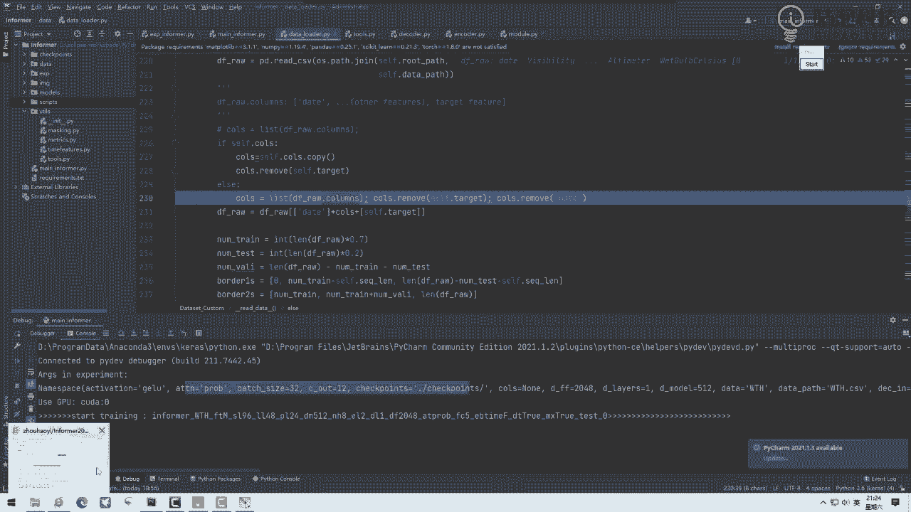

就是现用现查呗，查这个东西啊，比如说你说这个pandas as，我一点这个东西他是啥意思啊，哎我说我去点开这百度一查，这多快呀，人家举个例子，他说他构建了data frame，咋咋地的。

然后呢他接下来比如呃来来看这块，他打印了一下，打印什么，是不是这个列名就出来了，所以这个属性就是打印列名的一件事吧，很简单啊。

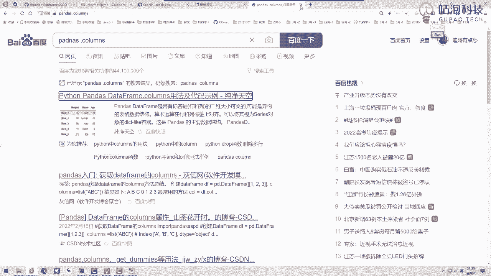

不用去记，也不用去背，啥时候去背这个东西呢，嗯就是有时候我会背一些什么背单词，我现在有个问题，就是我单词总拼错，脑子不太好使，单词容易，单词容易评测啊，所以说现要现查吧，啊不会的东西咱去查是都可以的。

来给大家说啥意思，第一步把地名都拿到手，第二步在列名当中把标签去掉，为什么要去掉标签，因为标签不是我的特征，再把日期也去掉，因为日期也不是我的特征好了，这是咱一会儿数据当中，哪些是作为我们的输入啊。

哪些是作为我们特征的，把特征列的名字先搞定出来，然后接下来就是咱们data frame当中，我看这里啊啊这一块它是全部的，就是我们的，这是啊，这是咱们该去掉的，一个是target，我们那个标签的。

一个是我们的特征的，一个是我们日期的这样合到一起之后，就是咱们整个数据集它都是啥，这是咱们整个数据集，然后下面做了个切分，他是自己做这个切分的啊，就是没有事先分成两个CSV文件，它是直接做切分的。

在切分当中大家看一看啊，整个数据量3万多吧，然后他选了0。7，当训练集，选了0。2，当这啥零，当测试机选了0。1，当我们的一个验证机啊，这是自己做了个切分，接下来他指定了就是我们的一个呃。

这个borders呃，这东西它啥意思啊，就是这样指定我们那个数据集的一个起始位置，大家看源码的时候，如果说你看不懂他啥意思，你就把它打印出来，或者说你执行完之后看到这个结果。

我们现在只想看这个结果只有啥意思，零二，然后这个2448什么2759啥意思，我们来瞅一瞅，他的意思是这样，就是说，首先啊我们这个训练集这个位置表示是哎，我们到时候取数据的时候。

训练集我都能可以起始位置从哪去取，什么叫起始位置从哪去取呢，Number train，你看这一块是有245544个，来大家给大家，我给大家画啊，这是咱们这24544个。

然后这一块它为什么减去C和LTH呢，为什么减到一个96呢，它是这样，就当我们再去取数据的时候啊，你说哎比如给大家举个例子，我能取最后一个点做我的数据吗，不行为啥，因为咱们接下来的输入是一个序列。

你取最后一个点了，最后一个点它后面没东西了，它合不成这样一个96的输入序列，所以怎么办呢，咱们最后一个在哪，最后一个应该是最后一个位置，减掉这个96，当前这个点红色这个点，这个点才是我最后一个点。

所以这一块大家注意啊，我们是一个序列，到时要一次取出一个序列出来，你不能选到最后一个点，那咋办，在学习当中，我们减去序列长度是不是就可以了好了，这是我们带来这个值，然后下一个值下一个值啊，我看看啊。

这个呃data frame当中减去我的测试集，再减去我的一个single lass，这个数没有没没有用到，我也这个数它暂时是没有用到的，咱暂时先不用去管吧，因为他一会只是去取训练集。

它只用到中间这个数了，最后这个数等咱看看吧，我记得是没有用到的，用到时候咱再说吧，我想想应该是啥，应该就是说在我们去测试的时候啊，测试集是从哪儿，从我想想啊啊应该是我们的验证集。

你看这块是所有数据减去测试的，那不就是训练和验证的吗，再减这个哦，我明白了，他这个东西应该就是就我应该是这个东西啊，我之前我没注意这个东西应该就是验证集，差点去取，是不是。

你看这DF这这个data frame，这个东西全部的减去测试集的，减去测试集的，不就训练集和验证集的吗，减去然后剪完之后形成训练集和验证集之后，再减去这个，那相当于就是我们，因为我们是先取这个训练集的。

然后再去取我们测试验证集，再先取训练集，然后再取我们验证集的，他又表示说你这个验证集最多能取到哪，因为他还是减去这个96，是不是这个表示你验证集最多能取到哪啊，这是第三个数好了，这是我们第一个BDER。

然后我们第二包的第二包也就这样，他就说哎你的数据集它的样本的个数有多少个，这个我们训练集它是有这么多个，然后这一块就是说啊就是到哪截止吧，它表示一个就是终止的一个位置在数据当中。

比如这是你全部的一个数据集，然后这个2424544，他就说哎这一块是你训练结位置，然后这一个这个数就是28502，我写啊，这是28052，这就是你验证集的一个中指的位置。

然后最后就是你测试级位终止位置啊，就大概这样一件事好了，这是我们定义好咱们的一个啊，咱们的两个包DER，然后接下来呢接下来咱们去取啊，就这啊，我知道我知道他啥意思了，这块大家来看啊。

这个set type我们如果如果大家忘了啊，就我自己看代码也如此，你看我给大家讲的时候，我总说有些东西咱们之后看到用啥，我给大家去说啥，这个set type大家找一找是在哪定义的，往上找。

如果你之前忘了，你点一下CTRL，点一下子是不是有啊，他啥意思啊，是不是有type map，type map干啥来着，他说训练集是零二，验证集是一，然后测试集是二，是不是它是这么去解释的吧。

然后我们来去看，那这里边传件零啥意思啊，border当中0O是不是这个位置啊，border当中零是不是这个位置啊，通过这两个位置去指定好，我们训练集起始位置和终止位置，是不是就这样一件事啊。

那后续你的测嗯，你的什么验证集测试集数据一啊，从取它一这个位置，取它这个二这个位置啊，就这样一件事好了，然后接下来去构建我们这个特征，一会啊，一会给大家说啊，这个border用来干什么的。

用来帮我们去取数据的啊，好了，关键特征当中咱们这样咱们的features是啥，MMJ给大家说了，取就是咱们输入是多个变量是吧，来取这块为什么一冒号，就是为啥这个东西啊，大家自己看，为啥一冒号呢。

因为第一个位置我给大家看啊，第一位是date，是不是date，是时间，我们现在拿的是我们的一些特征，所以说咱不要这个时间来，这是个一冒号好了，把data拿出来，然后把data它这是拿它列名啊。

通过它的列名在data分数当中去取这个数据，这个df data就是咱们的数据好了，这是我们现在啊，这DVA我们把数据已经取完了，然后这个if self点scale，就是说c Scout。

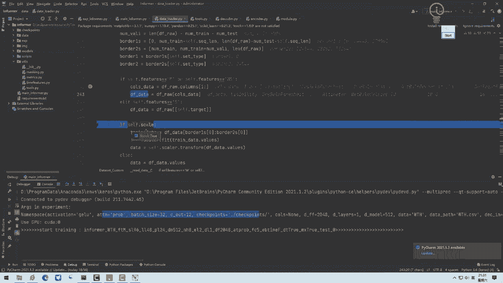