# 一口气带你吃透【Python机器学习与量化交易】保姆级教学，建议收藏！（人工智能、深度学习、神经网络、计算机视觉） - P69：4.Informer时间序列预测源码解读.（三）(Av645162040,P4) - 码农卡卡西 - BV1un4y1R7j1

问题10。30，我们继续搞行为识别需要这个吗，哎兄弟行为识别你真需要这个行为识别你，你有很多算法是需要transformer的，有真的有很多需要transformer的，原始数据是个大序列。

数据拆分一个batch，对对对，是这样一件事，呃PYTHM就用吧，这个没办法，就是嗯这东西不会，你就硬着头皮上硬着头皮上边用边学，我我用排charm，其实我我我我跟大家说，我用排charm用多长时间呢。

从咱们我从录这个m m lab开始到现在，我我算一下啊，应该是4月，现在才5月，我才用两个月，我以前从来不用这个排charm的，我才用两个月，我我我也没找过教程，我就是会我只会这个debug这个操作。

其他操作，你像这里边这么多东西，我都现用现查的，你也没必要一次性的都学会这些东西，现用现查就完事了，以前大家有老同学知道我以前用那个eclipse，是不是就这东西用起来就行了，现用现查吧。

不用把所有东西都会，先知道这些键钮是干啥就行了，就好多按钮，这这一排这一片一片的我都没用过，我都没用过，也暂时用不上的，执行eclipse。

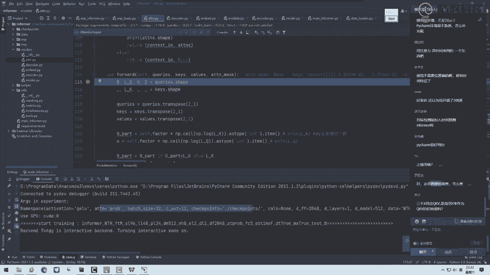

怎么查百度查啊，兄弟们，百度查啊，我之前我第一次我就查，我说百第一次我我查了，拍charm，第一个东西就是拍charm，怎么改字体大小啊，就是就是这样呗，就是现后现查呗，哎艾尼康达跟艾尼康达是环境排。

charm是ID他俩不一样，原理我忘了，Q远25没有96，为了速度对这篇论文核心的一点怎么去加速，选有用的东西，你可以当做呃，你可以当它是一个压缩吧，行我们35继续拍套，只跟排唱有什么关系。

这应该都是我们那个跨方向的同学，PY套是个框架，pyx是我们的id，拍照不交，肯定有百度找呗，但是你不用前期把每个键都学一遍，常用的也就那几个informal，怎么下载数据，我给大家提供。

我待会给大家提供好，他这里边得翻墙嗯，他这个原码得翻墙吧，我看他给不给那个百度网盘啊，他我记得给了我当年下的时候给的啊，哎呦啊啊，你可以，这不有吗，来仔细看一看，download有百度网盘，有谷歌网盘。

贝塔embedding主要为了做什么，就是让把我们的，就是你可以当做就是把我们特征做一个升维，我们输入值是12维向量，就跟LP当中处理是一样的，我们处理是一样的，Self attention。

和你想说那个local attention，其实有好多种attention叫法，self attention是自己句子跟自己句子去做，一会我们看有两个，一个叫self attension。

一个叫cross attention，就是encoder z，encoder decoder z去做self attention，对对对，就这B站当中啊，这些基础我都能查出的。

脑子嗡嗡的三个X对应QKV，是指用来X作为Q约初始值吗，不是的，是这样，X就是咱们记不记得我们之前讲transformer，X乘Q，X乘KEX乘V才能得到我们实际的一个向量，是这样一件事，讲过了啊。

看我们直播回放讲过这个配环境了，这篇文章搞科研的啊，对对对，这篇文章跟大家这么说吧，嗯你从他这个创新点来说，其实我觉着特别多嘛，其实创新点一会大家刚讲源码，你觉得不会特别多。

但是为什么能拿一个best paper呢，写作很关键，写作很关键，这个东西啊就是什么事啊，怎么说呢，就你就像是大家肯定知道，就是啊你做得好不如说得好，说得好不如唱的好，公司也一样。

你干活的比不过做PPT的，就这种感觉吧，只是论文你想发的比较好的，你这写作功力相当强了，这些都有的这些都有的，为啥特征相加，12和12拼接成16个特征，特征一般要做加法啊，融合到一个向量当中啊。

对512是指定的，512是指定的，这是加法是很常见的操作，就像是我们特征跟位置编码，做加法跟实验特征不也是做加法吗，做一个融合呗，时间为什么要进行预处理，时间啊，为什么预处进行预处理得到更多特征啊。

时间一定要进行预处理啊，要不然你怎么拿多个特征，要不然你时间只是个索引，你你只是一个索引而已，是不是VIT对对对，VT是没有decoder的，VT只是个分类，这个比v it难得多啊。

VIT那个代码太简单了，这个起码比VIT要难一些的，嘶，96和12聊聊这个，这个这个这个是个漫长的过程，你得把那个咱们前置的讲informer原理的，具体看一看，那里边会具体说的，这起码得说半天的对。

分开之后没有抵扣，来我们继续，兄弟们，大家回来了吧，来我准备继续啊。

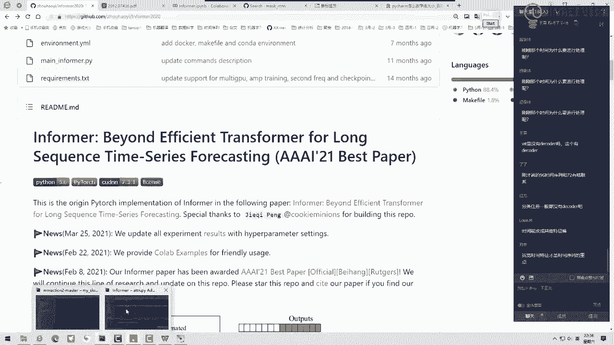

说完吧，咱今天一会也得说完，我也不想拖这个东西，之前有同学是我，真没想到这个东西能能讲这么久啊，嗯我我我我当时寻思一个多小时差不多了，因为我自己debug1遍，我觉得代码量不是特别多，咱继续吧，兄弟们。

我们继续吧，来兄弟们，你们帮帮帮帮帮帮我，给这兄弟回答一下，为什么要把时间拿到更多特征，说白了就是更多特征，你才能有更多的信息啊，这是必须的一件事啊，来我们继续，声音小吗，总有同学说我声音小。

我我也不太确定声音小不小，兄弟们，时间特征很重要，时间特征是非常重要的，你因为你想一想时间序列，哎，你你时间序列当中什么对结果影响最最大，时间对结果影响最大，比如预测这个温度，那8月份温度就高。

12月份温度就低，那你说实验重不重要，实验当然重要了，时间序列，时间序列当然是啊，要搞这个时间了，来咱们继续啊，刚才我们说到这个啊，就这里边人家的attention，注意这一块啊，咱们也不同了。

正常的attention是不是我们的Q和key算这个内接，然后再去做我们这个soft max的操作啊，这回咱不试了，我们不是Q跟key内做内积了，我们在Q当中要做一个筛选，我这里拎出个值。

Q当中我们选出25个啥意思，就像是我们说序列96个，96个序列，它一定每一个都非常重要吗，对于时间序列来说什么重要，平淡无奇的时间序列不重要，就像我们活着似的，我们活了可能我们活80年。

咱们活这80年当中，如果说咱们有20年能比较精彩的诶，你给你孙子以后讲，哎我想起我当年咋咋地的，你给他讲讲，你就是那20年比较光辉的世界，你不用把你这80年每一年做什么事都说一说，是不是。

那对于实验学也如此，想一想时间序灯哪个比较重要，哪些表重要，拐点拐点重不重要重要啊，哎这些中心点比较重要啊，比如最高点也重要，最低点也重要，所以说这一块啊，咱们学校模型学是什么，你不要学。

我平平淡淡的一生，你学我什么，学我就怎么说呢，就是啊既有既有人生的巅峰，有人生的低谷吧，你给你老了以后给你家孩子讲故事，估计你也会讲这些故事，咱们任务当中也如此，我们要选什么，96当中跟大家说。

选25个，这个是这篇论文当中啊，给出我们的一个经验值啊，但是实际任务当中你爱选多少个，这是我们自己去定的一件事啊，来看看怎么做的吧，首先shift值这些值不用强调了，说1万遍了啊，咱不给大家去说了。

来QKV这块做一个transpose操作，看了transpose完之后，结果32，batch8music head当中我们投的个数96，序列的长度64，每一个token所对应向量的一个维度。

是不是都有了QKV他们的维度都是相同的，都是这个东西，然后接下来它起个名字叫u part啊，其实起名叫什么无所谓了，我跟大家说一下它是什么意思，这一块呢它是嗯其实啊它是算了一个对数值，我觉得这个东西啊。

反正你就当做给的一个先验值，跟给的先验值差不多的，你看我们得到结果调焦等于多少，等于25，它是前面乘上一个系数，乘上了一个五，然后又乘上对数这个东西，我就觉得这东西反正也没啥说法吧，你承认对数这个东西。

这有什么说法，有什么讲究吗，论也没说，乘了五有啥讲究，也没说，其实我估计大概觉着96个当中选25个，还有这个比例是差不多的，所以这块就选了一个25个啊，这种感觉，然后接下来啊这也是25啊。

就是反正你就当做吧，一会咱们的96当中，你就当选25个就完事了啊，不重要的东西，我觉得我就给大家不一个一强调了啊，咱们主要说重点东西，重点接下来来了，我们来看我们要在这个Q和这个key当中。

这一块有simple simple，查选25个，这个就比较重要了啊，我们来看怎么去做的，还是把鼠标往这一点我们来看哦，这个我直接CTRL一点就点进去，点击完之后打上断点来看怎么去做的啊。

shift值这几个值啊，咱都不用去说了，挺简单的，第一步大家来看，我给大家这么说啊，这就要有点难度，因为这个代码嗯就怎么说呢，就是理论上没什么难度啊，但是代码上说要绕一些。

我们现在看这个K现在这个key是四个，是不是30 289 16，64这一块他做一个什么啊，他这块在三这个位置加上一个维度，然后去expand一下，expand当中大家注意它宽容什么维度。

96就是这个你看这个这几个没变啊，三十二八，然后进来96，96，它扩充了什么呢，大家注意它扩充了一下，我们d-3个维度，为大家来看，你看吧，手上这一点在这块当中啊，就是这个96，前面就是八和96。

中间又加了一个维度，做了一个复制，复制什么复，接下来又复制出来一个96，我们来看你看得到这个维度，结果你看加上一个维度变成什么，30 289 16，96，64，相当于把所有结果都复制了96遍。

注意这一块我们是呃相当于复制吧，这块我们扩充一个维度，我们进行一个复制，大家都说哎这个复制它会做什么呢，我们继续往下看，就我一开始看，我光看这个东西，我也不知道复制要干啥，咱们继续往下去瞅。

看他复制要去做一件什么事，接下来啊咱们先知道，我们就要复制完之后，他是96×96的，然后接下来呢这个任务当中啊，我们说哎咱们做一个随机值，随机值是啥意思呢，大家来帮我看啊，这一块我们要做一个随机采样。

在我们这随机采样当中，这里它是96个，这里它是96个，这里它是25，我给大家说啥意思。

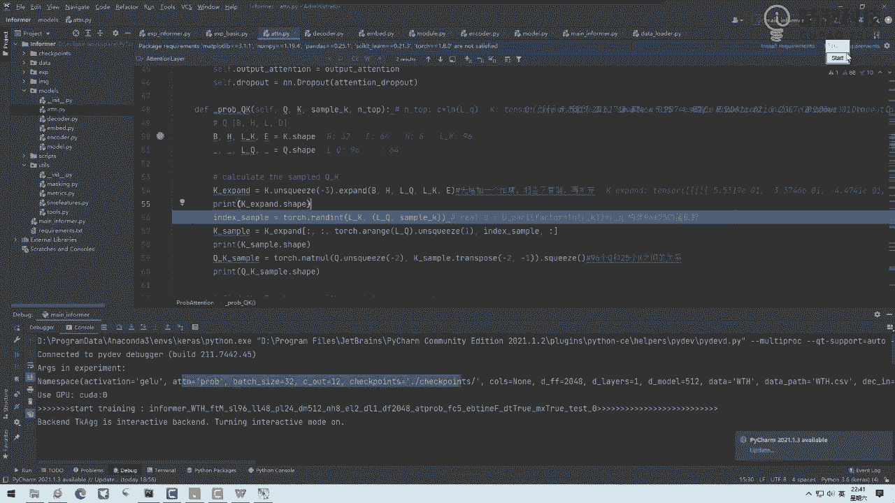

这里边诶我我再给大家解释一下，什么叫边用边查，就是你们说你们这么看这套视点啊，这个RU的int这个东西你能知道啥意思吗，如果说你忘了哎，就第一个参数啥意思，第二参数啥，第三个参数啥意思，怎么办。

就复制到百度，我不给大家演示啊，复制百度去查啊，但我用的多，我知道就第一个值，第一个值它96，就是说我们取值范围是它默认值是从零开始，就是它的第一个值，取值范围在0~96之间，我们选择一些数值啊。

这边写个96，就是说我取值最大值96，0~96之间去选选随机选值啊，这是说取值范围，第二个第二个参数叫做个size，就是说你采样完之后，我们希望采样出来的结果，大家注意我们采样出来结果是多少。

是96×25的一个矩阵，大家来看这里是96×25的矩阵，啥意思，刚才我们构建出来了96乘，就是大家注意这块这块有点绕啊，嗯怎么说呢，你到时候还得自己debug1遍，96×96，是不是啊。

我们扩充一下维度嘛，相当于增加维度，增加维度也是96，接下来这一块这一块我们选完之后，它是多少，我换小点，比这一块我们选完之后，它是一个96，25，是不是96，25啥意思啊。

对这96当中每一个我要看一看，你跟这25个之间的关系是啥，所以说这一块大家选完之后注意啊，我们采样是随机进行采样的，我再给大家去捋一遍，为什么这一块我们要进行一个随机的采样。

来大家看这里看一下我们这个PV当中呃，我给大家找啊，在这在PV里我记得我跟大家说过，呃呃这呢大家来看你看啊，就是说我们现在找出来，这这是我之前大家讲PPT对对外讲过的东西啊，咱再回顾一下正常的。

我们现在找这个Q是不是，但是我们说现在啊我怎么去找这个东西呢，来大家这块我重要的Q啊，不用咱们去算那么多，选出多少个，选出来其中的25个就行，这里大家说这样一件事，回去再理解理解咱们的思想。

这一块我们在选Q的时候，我们要选择出来的是随机的，有这么25个嗯，其实我感觉说的还有点绕我，我为大家再看一看，这是Q和key的一个故事，我看我之前PV当中有没有，呃来吧，咱们咱们接着接着接着往下说吧。

咱先记住这个这个数啊，九十六二十五，这是我们随机采样结果，他是962 15，然后大家注意把我这个随机的index值传给谁了呢，这一块需要大家注意一下，传到谁，传到的是key当中，我们扩充是谁。

扩充的是一个key的维度，就是大家可能会好奇，哎现在我们应该选的不是Q吗，刚刚老师你不是说在96个Q当中，哎去选择出来，一去选择出来25个比较重要的Q吗，我们刚不是这么去说的吗。

但是我们现在为什么是对key做操作呀，这个问题又来了啊，就是说你Q当中怎么你唉你你靠什么评判出来，这96个Q哪个Q好，哪个Q不好呢，我们之前是给大家去看那个论文了，论文说了，他是这样的啊。

他说这里边是96个Q，96课当中呢大部分Q平淡的过了一生，什么叫平淡，就是平淡的过了一生啊，就这种感觉，比如这是Q1，这是Q2，就是第一个token，每个token跟其他之间的关系都是平平淡淡的啊。

都是平，就咱们怎么说呢，平凡人过一辈子吧，然后比如说我给大家说一个不平凡的这个Q4，它就不平凡的一件事，他经历了人生的大起，中彩票中了3000万，又经历了人生的大落啊，彩票把把彩票整丢了，没兑上奖。

然后最后再去大起大落，就这种Q我们希望为啥他是有爱恨情仇的，有鲜明的一个特点的，它能把它的特点体现出来，我们提特征，其实我们不要平淡无奇的，我们希望一些有特点的特征，是不是，但是有特点这个特征我问大家。

这个Q怎么体现出来的，我画这个线，我的X轴是什么，我这X轴啊，这块有点难度了啊，就是哎呀这块真有点难度，就是跟key的关系，是不是这个线咋算的，是不是K1K二一直到我们的K96啊，是不是这样一件事啊。

所以说Q4哎它是有这样的一个故事的，那接下来大家想怎么去判断出来，哪个Q他的人生过得比较精彩呢，他是有这个跌宕起伏的呢，是不是你看这Q跟key的关系啊，但是我来想，比如说我现在这个Q4哎，这个Q4啊。

我或者说从Q1开始吧，Q1我要跟96个K去算，Q2我也要跟96K去算，Q3我也要跟九十六九十六K去算，就像是你你给别人讲故事，你要给别人讲你96年的故事是不是太多了，人家听不完，那怎么办呢。

咱们这要做一个随机采样，什么叫做一个随机采样呢，它的意思就是说在我们这个key当中，哎我说你对于每一个来说呀，我说我不去听完你96年的一个故事，你随机的告诉我，你25年你这个人要做的。

你这个人的人生要比较精彩的，你应该是随机选出这25年都比较精彩的，就像这样一样，爱恨情仇表现出来了，随机25个怎么样，也是比较也是也能比较精彩的，就像你考试一样，你考试考96个题，唉我说你总分挺高的。

你随机考25个，你总分也挺高的，那啥也不是呢，考96题，啥也不是，考25题，他不照样啥也不是吗，所以说这个任务到时候大家注意啊，我们现在对谁做采样，我们现在在做一个key做采样，这个需要大家注意一下啊。

就是有点绕，但是我希望大家知道我们要去干什么，我们现在是在key当中去做这个采样，我们一共有96个Q，96个Q当中每一个Q都会对应96个key，但是我现在希望96个Q当中。

每一个Q你只对25个key做采样，这样能大快，这样这样能非常快的，让我们的计算速度变快起来，所以大家看这里这里边当中啊，大家来看这个任务当中，你看我们这个key当中取什么batch这个维度。

MUSIHATCH维度都都不，这都不管，接下来取什么，大家来看，接下来来取Q当中这96个，然后呢key是取谁KE取谁，兄弟们key当中啊，这96不变，key当中。

是不是说我们这个index simple，index simple是什么，我们随机去选的，是不是这样一件事啊，所以说大家注意，每个Q跟随机25个key要去做这样一个计算，这是我们采样出来的key来。

大家注意，这是我采样完的key，你看最后25是不是啊，这里大说了，对于96Q当中，每个Q跟key它对应的一个关系是谁，这25它就是具体的一个随机索引，这个随机索引值是咱们从0~96之间的。

大家看这里这个数是一个96，所以随机索引值是0~96之间的，这个大家能理解吧，来再往下再往下能干什么，再往下，我们就要去执行咱们Q跟key之间的关系了，这是啥，这是大家看这名字，这是我们的Q，这是啥。

这是一个key simple，这是我们采样完的啊，大家注意，这是我们采样完的结果，这一步执行完之后，大家看结果，你看结果一定是96，25，32，Batch，8music hat，八种关系，96。

什么96个Q跟25个key跟他96个Q，每一个Q我跟25key之间的关系，是不是就算完了，大家注意啊，这个key是我们现在这里做了一个采样好，这一步96个key跟20啊。

96个Q跟25key关系都做完了，我们现在是不是心里有数了，这Q1咋地的Q2咋地的Q3Q4，然后这key都是随机采25个，我们说输入关系都有了，接下来要干什么，接下来我们还没我们还这样事没做完。

我们还要去判断一下，当前我这个Q他到底是有像画的啊，就跌宕起伏的哎这个人生比较精彩的，大家看过那个康熙王朝，康熙王朝当中怎么样，就那个那个她叫啥来着，那个太后太后去劝那个康熙，要去那个削藩。

要去打败那个吴三桂，就说你这人生当中，哪怕有一天干过一件这么讲，一件惊天动地的大事，你这辈子就值了，这就是我们Q当中找一找哪一个，他干过什么惊天大动地的大事，那怎么找的呢，大家注意。

这里怎么去衡量这个Q他到底干完过大事呢，就是不是成大事的人呢，来看这个公式额，怎么说呢，就是论文当中啊，说的极其复杂，论文当中当时我看傻了，但是你直接看这个源码，它就很简单，怎么做呢，第一步嗯。

我们来看这个第一步啊，哎呀我们来说这个东西吧，这个这个是我的啥，这个其实不是这个公式，我找一找，我看是哪个公式来着，是一个max啊，这呢是这个公式，我就说嘛怎么不像是这个公式来。

大家看我们现在对于每个Q求个什么呢，求它最大值，什么叫求的最大值，就像我说的，就像是你接下来啊要去给你孙子讲你的故事，你会讲什么故事，你最牛逼的一件事儿，你干过最大的一件事是啥。

而不是说你讲二三实践都那么差不多了，人家听着也没啥意思，就像我爷给我讲，当年发射导弹咋咋地的，哎我过度说傻了，说这些事啊，就是找一件什么意思max，你跟25个Q，你跟25K之间啊都有都算出来了。

你25个都有这个关系，找什么呢，找最大的一件事，什么叫最大的一件事，为大家画个图吧，挺绕啊，就这一块儿挺绕，但是我尽可能给大家去描述吧，就就这样，就这个Q1我给大家说他是这样诶，诶诶哎最后这么高。

你说他选的Q是谁，他就选最大这个点，他就选最大这个点，他只去讲述他最牛逼那一次啊，所以说大家来看这块在qk simple当中，我们取什么点，max-1取它数值最大的那一次。

数值最大那一次当做是啊它的一个结果，这个零我想一想，这个零应该是它它的一个数值吧，应该返回它具体的一个值好了，这给大家说了一下，就是选它最大就是最牛逼的一次，然后接下来呢哎他最牛逼的一次。

那我们这里做个比较啊，他最牛逼一次他有多厉害呢，跟谁去做一个差异呢，大家来看跟什么，跟一个均匀分布去算它的一个差异是有多大的，均匀分布是什么，就是我们QQ当中哎，就是所有的QQ当中唉。

我们算一算就是Q2Q3，一直到我们这个Q96，他们的一个平均分布哎，就大家都平均什么样的算，我最牛逼的一次比咱平均分高了多少分，相当于我高，我考试成绩最高那一次比咱班平均分高多少次。

我就能拿出去回家跟我爸说，让我爸给我买手机啊，就是拿出去吹这个事，这一步大家能够理解，这是来大家看这是我们做这个平均，是不是咱们先对它总数做一个求和，再求一个这样一个平均操作，就相当于我们平均分布了吧。

这里大家注意啊，就是说对于每一个Q我都要算一算，他最牛逼那一次你跟平均差距有多大，那我们来说什么呢，你最牛逼那一次你跟平均差异比较大，我们就说你这个Q挺精彩的，我们要在Q当中一会做一个排序。

把它的分值由高到低去排来，大家看我们现在执行啊，执完之后大家看这个结果结果等于什么呢，求数结果没变，还是八还是30 289 16，但是这96表示什么，这96表示96Q当中的每一个Q啊，当中。

他最牛逼那一次，跟平均的一个差异是等于多少的，大家注意这96啊表示什么意思，你看这个你就看这里吧，来看这个任务当中，这是不是一个max操作，max j啥意思啊，你最强的那一次，你这个QJ嗯给大家说细点。

看这个J的角标是在哪的，J的角标是对于key来说的，你这个Q啊有25个key，代表你的一个程度，代表你最牛逼那一次啥样了，来注意这个角标减去谁呢，减去平均的LK是咱们的长度，这不就是96吗。

所有的长度加在一起之后。

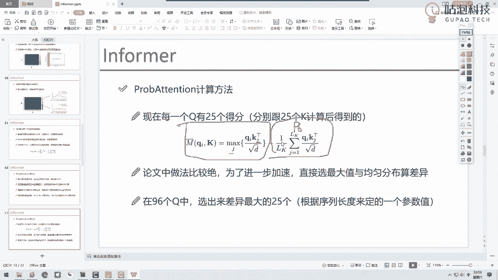

来算一下跟平均的一个差异，是不是就可以了好了，这一步做完之后，咱是不是就得到了哎，96Q当中每一个Q的啥，他牛逼的程度是不是叫做得分值也行了，来每一个牛逼程度咱是不是得完了，那怎么办呢。

我说我们去干什么，选一个top k呗，top k啥意思啊，选多少个来注意这个值25，是不是对它做一个排序，在96当中，你得分值都有了，考试成绩下了，选什么，选出那25个最强的不就完事了吗，来看这结果。

30 282 15由96变成25了，选出来25个最强的是不是就行了，那现在我们这个索引，大家看这种索引这个排序完之后，我们返回的是一个索引值啊，注意这块返回值我写了一返回值是零，是返回一个数值。

返回一是返回的索引，这块呢你看我们把这个索引值都反映出来了，这都是我们的索引吧，有了这个索引之后呢，我们把这个索引传给谁，传到实际的Q当中去找这个东西是不就行了，在原来看实际的Q实际Q是96。

是不是96个当中去找出来，你那25个不就完事了吗，大家看这个结果，30 282十五六十四是不是就完事了，这一步操作完之后啊，咱们现在相当于得到了啊，就是采样完的25个Q，但是大家注意这个流程。

25Q哪来的，是要通过我们跟key的关系，每一个Q跟25K之间的关系，然后再去排序，再取得这个中线，那现在相当于什么万事俱备，只欠东风了，Q也有了key，是不是也有了key没变啊。

兄弟们注意key还是96个，之前给key做采样只为了算Q，但是现在Q25算完了，25个Q要跟谁，要跟还是96个key，算它们之间的attention来算，这个TENTION得到就是多少，得出的结果。

是不是一个25×1个96啊，30 282 15，96，这一步做完之后，咱们都有TENTION，是不是就算完了，来费了八劲，我们终于算什么了，终于算完这个tension了。

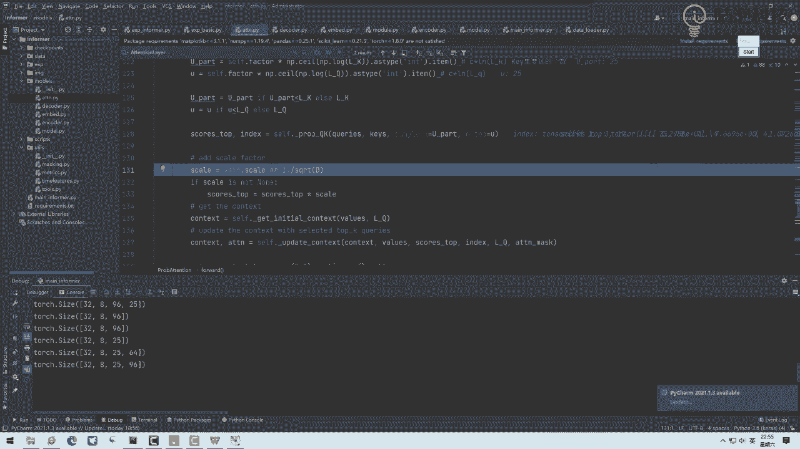

也就是说咱们公式当中这一步啊，来再再往下走，其实已经走挺多了，再往下去走，再往下去走走哦。

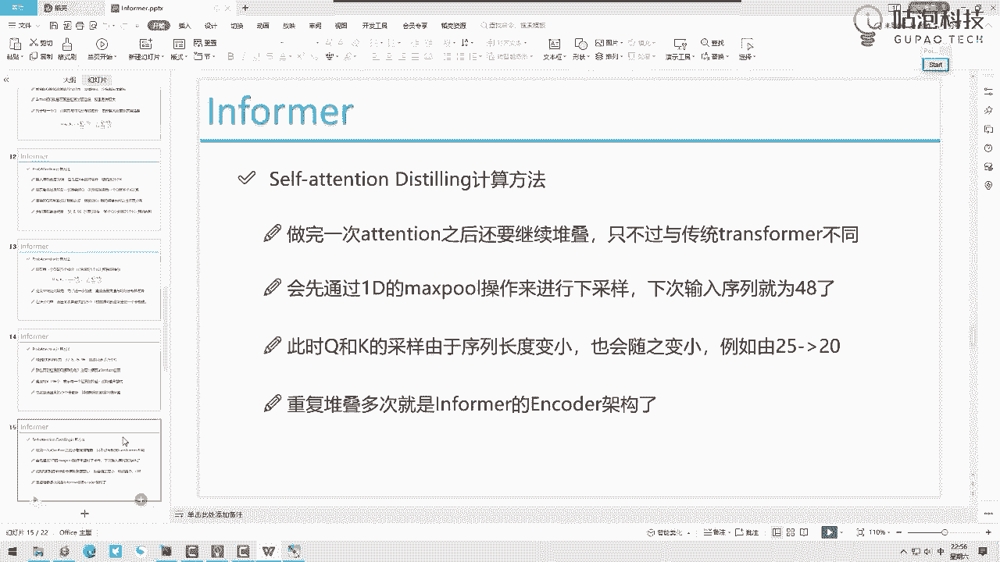

我看一看哎呀这个这个这个这个没写这个公式，这步算完之后啊，相当于哎就是我们的attention，咱就算完了，这就是咱们这个tension，96Q跟25K关系，咱拿到手了，然后看大家有啥问题。

来看看大家有啥问题，能不能理解兄弟们这一步能不能理解，这步有点绕了，是25K什么叫两个Q，什么叫两个Q。

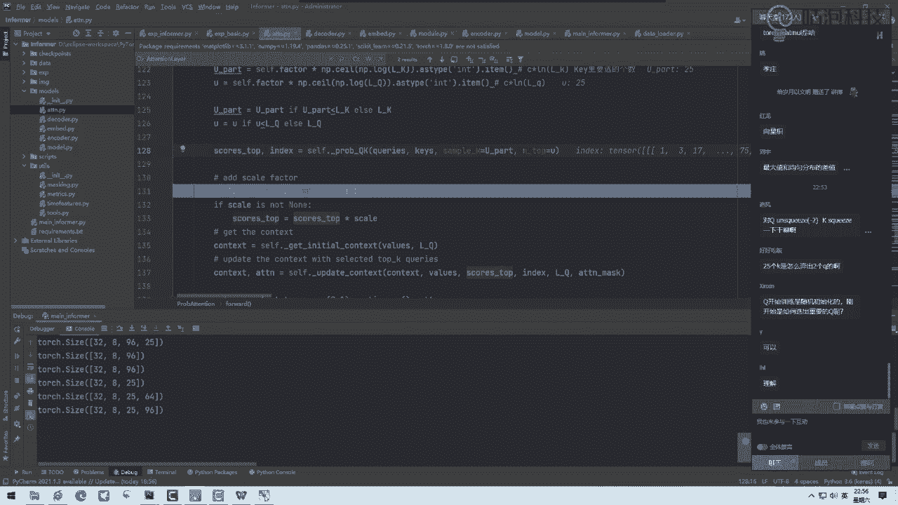

这块就是我这么说，还好你看论文去，就是大家你们第一遍看论文，我第一遍看论我都看傻了，我都我都我都我都想半天，我说25个Q，为什么论文里边公式要给我取20，我key呢，我当时我都怀疑。

我说这个论文是不是是不是公式写错了，为什么我在key上做采样，不是在Q上做采样啊，哇这个东西大家看论文，你们就会发现这样一件事了，论文当中贼难，真的第一遍我看论文，我我第一反应就是论文写错了。

绝对是Q采样，绝对不是key采样呃，25个key怎么弄出来，25个Q啊，排序啊，兄弟排序啊，每个Q都会跟key算啊，算有tension，算值最大的一个啊，然后一会儿一会儿结合V，一会结合V对原理。

有的原理有大家需要看一看，对对对，就这一块他是为了解他，我跟大家说为什么要这样，他就是说啊，他的意思就是说以后啊，你的输入序列无论是多长的，这个比如说啊你的序列可以用到图像当中，你的图像可能序列非常长。

是3000的，但是呢我们我们Q和key都采样都采样30的，只要你的计算量就由3000。

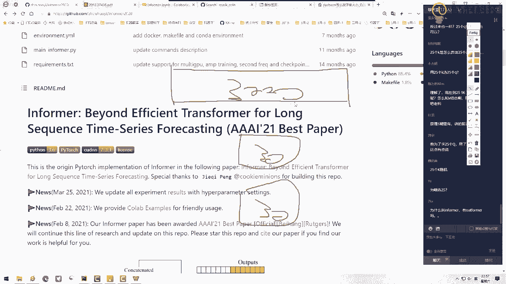

3000×3000的一个级别，降到300×300的一个级别了，就想一想人家计算方式在你的图像任务当中，在你的论文当中，如果你的论文想做一个点睛之笔，做这个事儿行不行，加快速度可以吧，是不是啊。

这个数量级3000×3000的图像，这个就非常大了，不像你这里96×96了，图像你可能真就是3000×3000，再变成一个30×30了，这个数变得会比较大，为啥全二数，这是你当做先验值吧。

这就是一个先验值而已，好了来咱们继续啊，代码里初始化Q和K刚才刚说完啊，初始化Q和key咱们刚说完的全是参数矩阵啊，为什么叫informer，不叫out former，问问问论文作者吧。

哈嗯加一个维度啊，兄弟加一个维度啊，不加维度怎么去取这个数据啊，这个你要具体看代码了，到时候都打印一行打印，这都是细节的东西了，来来来来，咱们继续，咱们继续，一会就给家讨论行。

现在呢我们把这个这啥做完了，我们把这个attention做完，是不是attention做完之后，接下来不要忘记这根号D啥意思，D看这个数值是64，之前咱们群里有同学问我说跟我说，老师这个代码里边。

我没有看到对这个维度做了一些什么操作，有没有咱们这样transformer，是不是要排除掉维度对接对接有影响，有没有数据有了加是加进来，把维度对接有影响考虑进来再做个除法，然后继续继续干什么呢。

来大家注意这一块，就是scale值对我们结果再作为映射，相当于排除掉维度对结果影响，然后接下来哎呀，接下来要找这个V了，这个V这个东西啊，我跟大家说啊，还有难度，他们是encoder和decoder。

都需要这个V在咱们那个encoder当中啊，这个V还挺简单的，decoder这个V贼难啊，decoder这个V贼难，我们先来看先看这个V啊，这块重点了，来注意这个V的维度，咱们这个V的维度啊。

它还是一个30 289 16，64还是这个维度啊，然后看一下我们哲学的长度，它是96的，我们进去啊，来先做一个初始化，给大家跳进去，我们先做个初始化，在咱们这个初始化当中啊，这一块这几个数值都挺简单的。

我们来继续看啊，在这个任务里吧，大家注意这块，我们对V竟然算了一件什么事，正常啊，大家帮我想，正常当中啊，咱们对这个啊，就好比如正常我们算这个tension应该怎么算，是不是这个Q点上key之后。

然后经过这个soft max，然后再怎么办，再乘上这个V不就完事了吗，但是现在大家帮我想帮我想一件事，我们这里是不是做了一个采样，大家帮我想，我们这里是不是做采样96个key啊，Q1Q二一直到Q96。

采样几个呢，采样出来25个，那比如说我这个Q3哎，采样了，Q96采样了，那may采样的，它能算出来这个tension，may采样的，你有我tension吗，大家帮我想一想，哎，大家帮我想一想。

你妹采样的，我绿色这个东西哎，刚才咱们选25没有，它只有黄色这个东西，那怎么办，绿色的你怎么办，你能再去算我tension吗，你不能你都没有，你都没有啊，你只采了黄色的呀，那黄色能更新它，黄色哎。

一会儿自己该咋更新，更咋更新，跟25是间互相更新，那绿色咋办，绿色的咱们不是说它是比较平庸的吗，它比较平庸的，他应该怎么更新，比较平庸的，我们就说这么说吧，他继续平庸下去吧，啥要继续平衡下去啊。

那你继续平衡下去，光是他自己的吗，不是是啥，大家来看代码当中告诉你一切，读论文当中，其实我也没有理解他对这个东西怎么操作的，因为论文也没有去细讲，论文当中只告诉我采25个，当时我在想。

你采25个没踩上怎么办，你看代码当中是不是告诉我们这答案了，对V求均值啥意思，我现在有很多V啊，我这个V1V2啊，一直点点到V96都有的，把它们做什么，把它们做一个均值，是不是会得到一个平均向量。

大家帮我想这个平均向量怎么样，非常平庸的就是大家平均向量非常平庸的，这个平均向量会交给谁呢，这个平均向量会交给绿色的，之前没有被选中的，没有被选中，既然你只表示自己的特征。

那我这样你用全局的平均特征来表示你自己，因为你本身就比较平庸，我加上全局思想的全局平行向量，当做是你的啥，当做就是你更新完结果就行了，黄色的重要的给你们attention，做完之后该咋更新咋更新。

不重要的，或者说刚才没有算有tension的，全部拿平均向量啊，这是跟大家说了，一定要看源码，看一看V当中沿着啥，沿着二负二是谁，一负二负二，96是不是对96个求什么，求这个平均向量来看这个结果。

这是不是平行向量就有了，有了平行向量之后怎么办，来大家看一下，在我们这个任务当中，我们把这个平均向量给它，交给谁了呢，交给到我的上下文当中，也就是说现在我要构建管上下文，咱们上下文当中啊，都是平行向量。

就这块，现在我开始用contents这个东西，content这个东西它都是平均向量96个，现在都用均值来做替换了，为大家给放大看一看，哎呀这是96，它展不开，能展开，你就发现都都都是一样的。

大家看这个数值，你看这个数值怎么样，是不是都是一样的，它们都是平均的啊，都是平均的，那你说接下来我们是不是还有啥哎，这只是做一个初始化啊，我们说现在上下文都是平均平均的，那我们说不是有25个Q。

它不是平均的吗，那咋办，来找我们刚才算出来的东西，这一块咱们有一个score top值，它是多少个是九啊，就这你看25个是不是二十五九十六是吧，来把它传进来之后，我们要进行一个更新完。

按住CTRL点进去，咱们看怎么更新的啊，来咱还是打断点，在这当中是不值，咱是不是都有啊啊mask这个操作咱是没有的啊，接下来来咱们继续对这个25个，我刚才不是说了吗，那25个算是transformer。

该咋做咋做，算什么来去，是不是去执行咱们的一个SOFTMAX操作，你看正常执行SOFTMAX操作算tension来执行，完了执行完之后怎么办，赋值了，大家记没记着，这是我刚才说的。

咱们一开始全用随机做出，全用平均做初始化了，但此时我们要进行个赋值了，对谁赋值呢，我们刚才奶25个Q，是不是都有唯一的一个索引值啊，大家看这里25个是不是都有唯一的索引值，把索引传进去。

在位置上找到这25个，这25咋更新呢，用我tension乘上V看我们的权重，乘上V表示他对这25个做更新，那其他的原封不动保持不变，啥意思，其他的都是原来的均值啊，你就这么当做九水果当中。

只有25个做tension的更新，其余的啊你一减就剩下其他的吧，都是拿均值向量，拿这96个均值向量当做它输出的一个结果，这一步完成之后，咱们来看啊，来这里这步之后，我们返回这上下文，对上下文当中啊。

还是九十六六十四，但是这96是我们更新25个，其他的都用均值来做一个替换了好了，这一步咱费了好大劲儿，就大家一定要知道V是咋去做的啊，均值那个东西啥意思，这个大家去理解好了。

那么现在来看一下我们现在跳哪了，这一步，哎呦我的天呐，就这就这一个，咱讲了好久，讲了大半个多点，是不是来这一个跟大家说了一下。

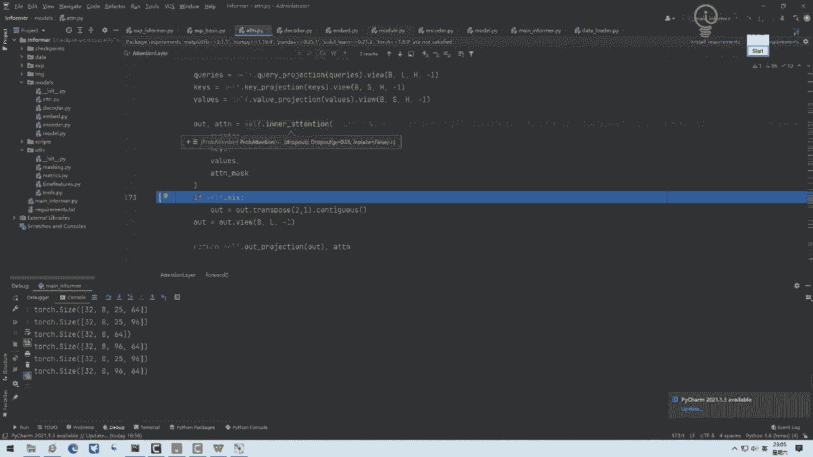

就是论文当中比较核心的，我给大家看人家这个GITHUB当装，你看这一这里是啥，这里咱们哎呀，咱离书完还早贺呢，讲了啥东西来这一块，我给大家说整个论文结构图，我们看这里我们讲完啥了，我们讲完红色这一块了。

看起来哦看起来讲的很少，但是没关系啊，就是红色是核心，其他地方我们都是套用这个红色，其他地方都是套用这个红色啊，就现在为止咱费了老鼻大劲，把这个mud head注意看probe啊。

这个self attension它是啥意思，大家能不能理解，通过去选Q选KE啊，咱加速做计算，一方加速做计算，另一方面实验学当中我也希望重点的咱多关注，关注，不重点也剔除掉。

咱炸红色这一块，终于是给他讲完了啊，来继续没完啊，他没有这个妹子操作，来接下来来我们看把这个输入结果怎么样，一般情况下就是经过了transform完之后，这不是经过attention之后吗。

我们要再连个全连接层是吧，全员阶层in features512啊，output features也是512啊，给他返回A就完事了，attention没有，它没有返回，有tension，没有返回那个权重。

因为这些篇论文啊，他是后续会画了一些图，画图的时候，你可能需要这个权重，咱们做训练不需要这个权重这个东西啊，好了，512，512，是不是有了，来这是两个全连接，对结果再做一个映射好。

这一步走完之后来再跳这步，做完之后来下一步做招pot，这这一些我不用给大家强调了吧，想一想原始的transformer咋做的，原始的transformer当中，是不是经过了一个tension之后。

再连一个FC，再连FC完之后再连一个什么叫残差连接的操作，是不是来我们看这一块，接下来我们就要做咱们当前这个，残差连接的一个操作了，来看这里，但是啊这呢这是残差连接的一个操作，然后下面这个迷之操作。

我给大家来说，这个是残差操作，是不是原来的X没经过这个tension的，看X输入是不是没经过tension的，加上经过这个tension的，这是返回值加过加经过tension的，做这个参数。

连接跟transformer当中都是一模一样吧，下面呢我为啥说这块做了个迷之操作呢，特别迷呃，就这块大家来看吧，简单了解聊就行，这是X然后他说把这X啊XY都一样的，这是Y吧，XY都一样的。

然后呢大家看这里，这里边他是哦，我看看啊，对这个Y经过了一个卷积啊，经过了1D卷积，然后经过了激活函数，然后接下来又对这个Y经过激活函数卷积，经过函数，然后再跟那个X加一起，他是这样。

就这个Y你就我他所谓这个卷积啊，你就当做FC是一样的，因为是ED的卷积嘛，类似的来得到Y1撇，然后再点我说类似FC吧，然后得到那个Y两撇，然后他是把这个X跟Y两撇做个加法，这步操作是迷之操作啊。

其实这这个Y和X还是等价的，一开始这个YXX是等价的，看这里YX还是等价的，为啥要说迷之操作挺迷的，就这块你不清楚为啥他要多余整这个东西，我觉得直接输出就行的，嗯我感觉这个事儿挺多余的啊。

就是又做了一个加法，虽然说类似残差连接吧，也没啥太大影响，至少比原来差，但是好点多余，这块是我觉得人家做的有点多余的东西啊，来把这个结果返回，返完之后，咱们看做哪儿了，来这一步做完之后，我们看啊。

咱们输入结果，输入结果还是没变的，三十二九十六五百一十二，输入跟输出维度是不变的，但是我们也经过attention，接下来没完，看这里，我们就拿着guitar举例子吧。

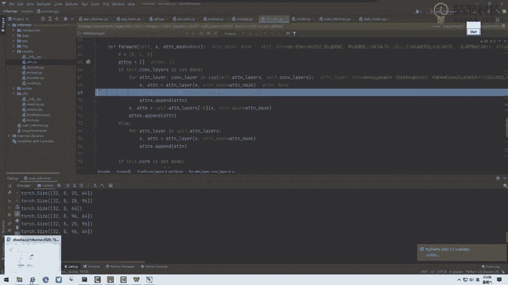

来看这里这块为啥是一个梯形，为啥是个梯形，我们都知道，就是说基于这个transformer，我们再去做这个tension的时候，咱这个tension要做几次，我们这个tension咱不是做一次的。

我们是要做多次的，是不是当我们再去做多次attention的时候，我们第二次是不是跟第一次正常情况一样啊，正常情况下哎，我们第二次跟第一次是完全相同的，但是现在呢现在我是这样这篇论文当中啊。

他说了一个蒸馏，这个操作什么叫做一个蒸馏呢。

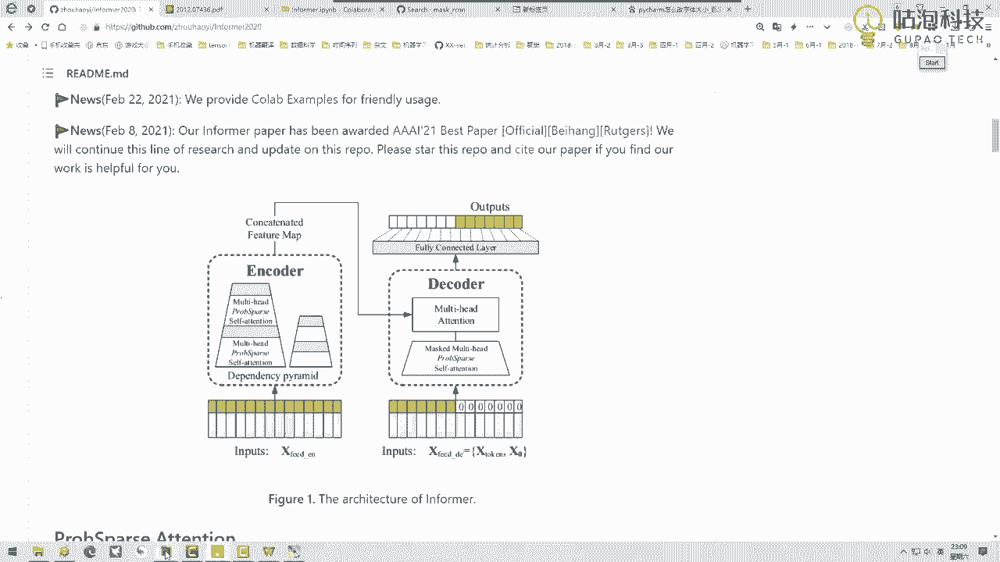

为大家举个例子，前面咱们用96的序列，我说表示我整理上下文，但是这块我说做一个压缩，我给大家展开来看啊，咱们来展开展开看一看他是啥意思，这块做个压缩啥意思呢，你看啊，这是通过1D卷积输入512。

输出512，但是看接下来啊这块他多做一个东西做什么，多做了一个max ping操作，stride为二的一个max pooling，1D的max pooling啥意思，九十六两个里选一个，两个里选一个。

接下来大家看结果他会怎么样，你看这个结果变成32，48是不是，所以说这一步操作相当于我们是做了一个采样，在96这个长度当中，我们做了一个采样，变成48啊。

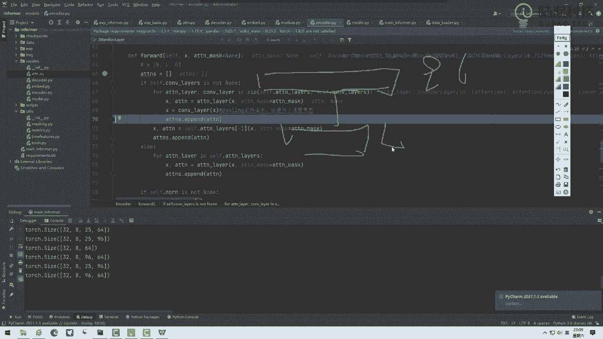

就是人家这里边人是往上画，你看人是往上画的，咱们是往下画，其实一样的，这是96，这就是48了，好接下来我们做第二层。

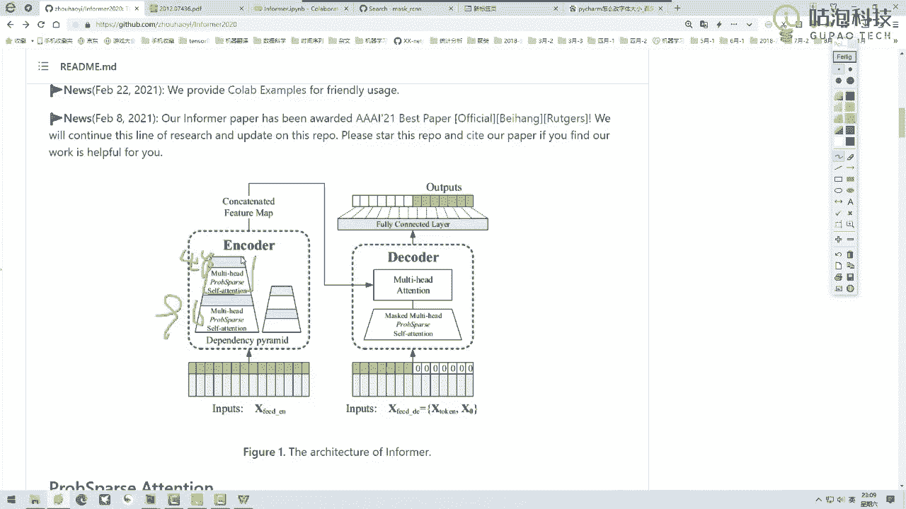

但是第二层当中我们就不是基于96去做了，因为他想速度更快一些啊，我所以这块做了个采样，变成48了，48万之后接着怎么办，来接下来这一步走完之外没完啊，我们往往下再看，你看这里边他又做这样一个事。

我给大家来看啊，这个我就不往里跳了，因为一样的操作，你看他是啥，看一下这个名字，这个名字来这里还是我们刚才说的吧，这个proper tention啥意思啊。

attention layers当中又做了一遍，又做了啥，又做了一遍。

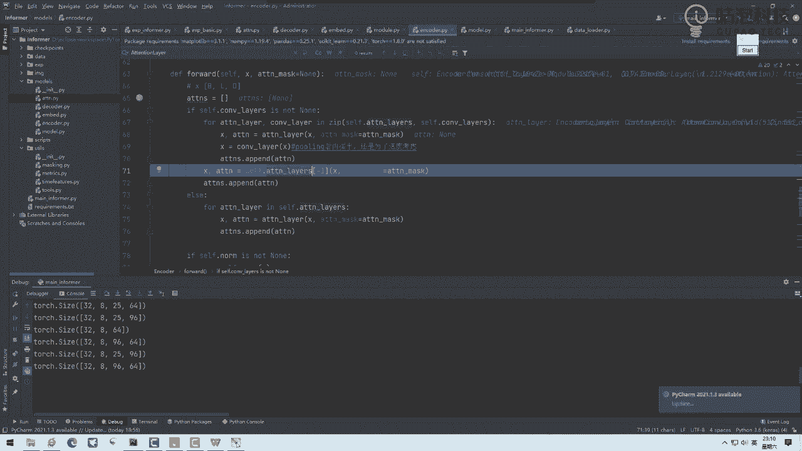

刚才我给大家说那个事，也就是说在整个任务当中啊，接下来就是循环了，它是循环执行两次，第一次当中我们是做这个APPROPERTENSION，第二次当中又做这样一件事，第二作当中啊有有几个变动点。

我给大家说一下，就是这块大家聊一聊就行了，源码我就不给大家往里跳了，因为都是一样的，就是参数变一变，第一个当中我们是96选25，是不是啊，第二个我有点忘了，都第二个应该是现在已经变成48了吧。

48当中选什么，那就不能再选25，不能选那么多了，可能是十，可能是20啊，可能是48，能选十个是不就行了，那既然做输出还是输出48个。

结果是不是就可以了，来我看这个结果，我在这打上断点吧，来咱再往里去走，这个我就不给大家往里跳了，又跳什么，又跳到相同这个层了啊，还是之前咱跳这个东西不给大家也跳了，直接啊我们把这些咱就取消掉吧，啊。

来跳出我们这个断点，这个操作都是一样的，所有键来操作都是我们跟刚才是完全相同的，我把之前断点所有的咱都取消掉，直接跳出回来来跳出回来，这一步做完之后，我们来看咱们得到X变成多少了，是不是还是48的。

相当于做的事是一样的，刚才做那个事儿，只不接下来我们输入大小变了，以及刚才选25个，现在我们选20个数就可以了，来再往下执行这个结果，来再往下走啊，by事闹，这都不说了，来执行结果，这一步做完之后啊。

咱们现在做完什么了，来大家看这个结果，现在为止我们才怎么说呢，就是原版当中啊，看起来我们这个整体架构跑了两行，看起来跑了两行，但是咱说了好多，是不是咱们现在完成了encoder，注意这一块啊。

我们完成了encoder，我们编码槽这里边咱现在就完成了啊。

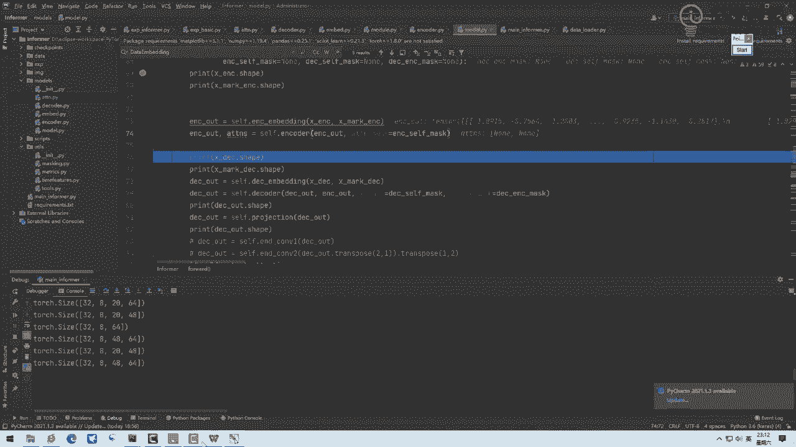

这一块编码层完成了，接下来我们要去做这个解码层，下面咱们就要做这个解码层了，来回顾回顾吧，这个解码层当中，我们看这任务当中这零啥意思啊，我们刚才是不是说了，有48个要带带我的这零的。

咱们该说零拿零做初始化的，是不是我们要去做预测的一个结果啊，那接下来我们就要看咱们的decoder当中，我们要去做一件什么事了啊，下面费了这么大劲，咱们终于要去说这个decoder了。

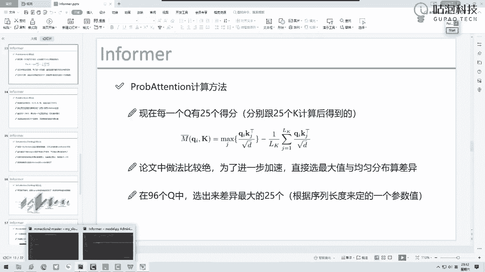

页面当中，你看下面是不是都是跟encoder相关了，encoder大家不要有恐惧，其实做法跟decoder啊，跟那个我decoder做法，跟我们那个encoder是比较类似的啊，来看看大家啊。

第沿着第二维度，沿着第二维度，但均做均值，那个大，大家理解啥意思吧，我看咱们人数骤减了，已经干了100来人了，咱们这直播间人数不准的，实际人数比这个少的多的来，大家都能理解吧，咱们准备继续说。

一会就说完吧，咱大家坚持坚持再坚持坚持啊，来坚持坚持啊，然后已经木了，是不是你这个这个第一遍还好，你后期你自己再去debug1遍，那你慕的地方多了啊，听我说可能还好一点。

自己你看这个论文原源码估计会更木的，咱后续还得需要自己再折磨一下自己，来来来，咱们继续说，来咱咱咱咱们把这个抵扣软件一起说完啊，还有还有挺多东西，来来来，我没事，我习惯了，来咱们继续说啊。

下面我们来看这个decoder decoder当中啊，其实我们做法一样的，来看一看我们这个decoder咱们的输入decoder，咱们输入啥来注意这是我们原始输入，来来看一看，我们做一下对比啊。

encoder decoder当中，对我们原始输入做了这个embedding，是不是我们这个decoder当中，也要对我们的输入做embedding，这个embedding是一模一样的。

因为他俩的输入都是我们的特征，和我们的时间是吧，输入都是完全一样的，所以说这一块，咱们做的embedding也是一模一样的，为呃这块还断点给大家看一下吧，你看这个类都没变，这个类是不是都没变啊。

你跳进去之后还是这个东西啊，给大家跳进去，你看函这个东西，它本身这个特征位置的特征，时间的特征都做完之后，返回是不就行了，这就抵扣当中，我们第一步咱是没有任何变化的，然后关键就是decoder啊。

就是抵扣这个层，我们接接下来还是一行去跳啊，control点进去啊，decoder哎，这一块decoder打个断点，是不是来帮你去跳吧，底会当也也是一样，做便利给大家看这个layer是啥。

这个layer其实这块我们已经轻松多了，为啥轻松多了，就是接下来你看其实每一个层，我就这里给大家都说了，每一个层，你看这个tension layer，这个proper tension layer。

每一层怎么样都是一模一样的呀，都是没有任何区别的，但是关键区别是什么，大家来看前面两个词是有区别的，第一个词叫什么呢，第一个我们叫self attention。

第二个呢我们叫做cross attention，也就是说在我们的底裤当中最呃它是有两件事，这个self attension，它是跟我们那个呃encoder是完全一样的，大家来看这个效果特展，我跟们说。

可以说这里啊，跟我们的那个encoder是完全一模一样的，decoder输入的是76个，76个之间要互相去算的啊，这个是完全一点一点变化都没有的，所以说这一步咱就不给大家帮你去跳了啊。

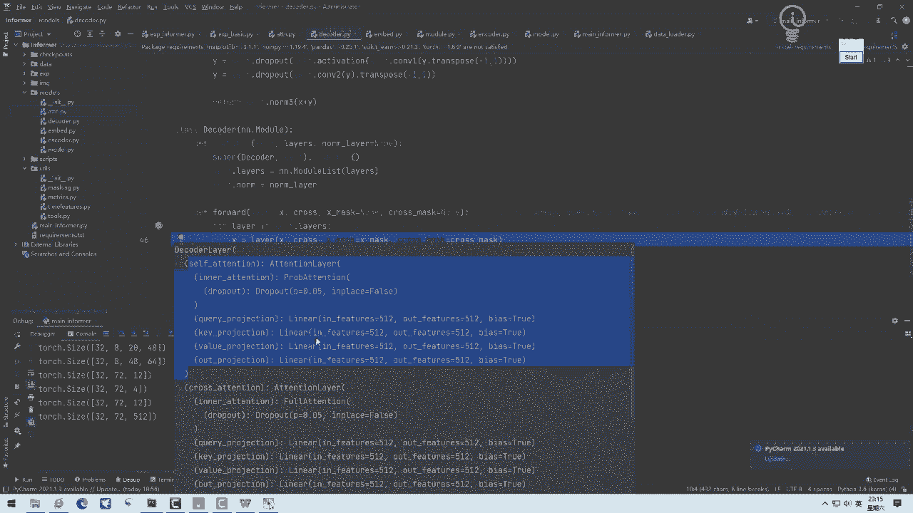

跟我们的encoder是一模一样的，就这里边大家来看这里边这一步啊。

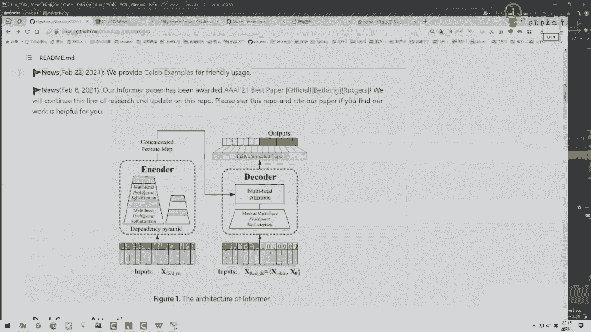

这里边这一步和这里边这一步，它俩是完全相同的，是没有任何区别的，完全是一致的这样一件事，然后这一块呢为啥说呃，它是有一个mask这个东西呢，大家这么理解吧，它mask中文是这样的。

就是当我们在预测值的时候呃，你说我要预测后天股票涨什么价格，我这个后天股票价格跟谁相关，肯定是跟明天相关的，但是我问大家一件事，你说后天肯定要跟明天算这个关系，但是我说我问大家一件事。

我想算明天股票的价格，我能知道后天的事儿吗，明天还没发生呢，后天更没发生呢，后天来的时候我说已经后天了，哎我说到那天的时候，他前一天我知道，但是我当前是明天这一天的时候，我要预测明天后天大后天等等。

明天能去个后天算吗，后天还没发生呢，明天怎么跟后天算啊，所以大家看这一块它是什么，来看这个名字叫做一个mask mute head，Probe of attention，来看这个名字。

名字只是多了一个东西，其他的这个梯形是没变的，这块我就不给大家往里去跳入了，是一模一样的，就像我刚才说的啊，你是明天后天能用明天的，但是明天不能用后天的啊，这就是加一个mask。

表示说哎我们这序列表就到这了，猜它的时候它可以用前面的。

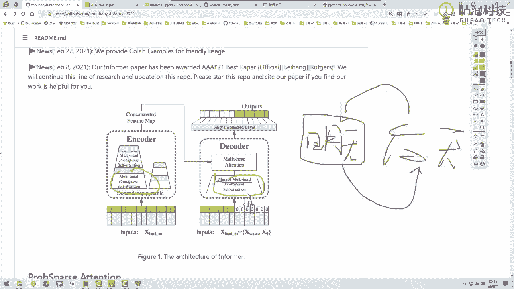

但是它不可以用后面的啊，就这样一件事，多了一个mask，这个操作好了，这给大家说了一下，就是啊我们这儿有个mask，cross mask是没有的，cross mask1会抵扣，我再来说吧。

第一个这一块它会走两个，一个是我们self tension，一个是我们的cross attension，我建议大家打断点，然后呃我看这个tension layer当中那个那啥。

就是self tension，我想把这个断点都取消了，然后咱们把这个self tension，我看看是不是都取消了，都取消了，是不是，咱直接看那个cross attension吧，往你去跳。

我看这是哪儿哦，这跳到哪当中了，我看一眼啊，来我看看这一块，这一块是self tension啊，这self ten咱咱不往里跳了，Self tension，咱不往里跳了。

咱直接跳那个cross tension来跳这个，我看这个啊，这个它名字叫啥，我看名字名字叫哦，for attention这个东西，Attention layer，Attention layer。

咱跳我不跳了，直接跳for attention这个东西来跳这里哦，是这里是不是来直接往里装，直接往这里跳来直接跳这里了，看一看我们这个cross attention。

其实cross attention当中咱的做法是没有任何区别的，咱做的事是完全一样的，跟咱们之前来我给大家看看啊，就在这里跟大家说什么叫做我们的cross attention。

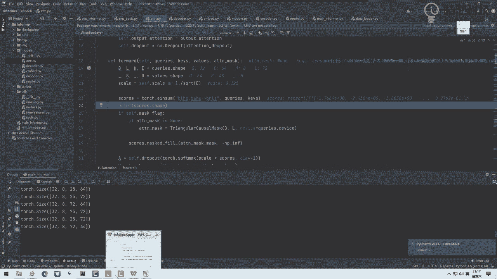

cross cross ten是这样，就我们现在这个序列当中啊，大家怎么去理解我们这里边有多少个72，是不是72当中，我们这里边前面是不是说，咱预测出来48个了，72当中每一个我都要跟我展开吧。

都要跟48个当中的每一个去算啥，去算它们之间这个attention做法跟之前是一样的，这就是一个cross attention，唯一跟之前不同的一点，就是现在我们不是就是在抵扣当中。

它两个一个是一个self，一个是一个cross啊，他俩做法是一样的，就是对象不同，self是我们就是说他是自己跟自己的cos呢，就是decoder跟encoder之间的就这样不同啊，其他都一样。

就是都跟我们刚给大家说的。

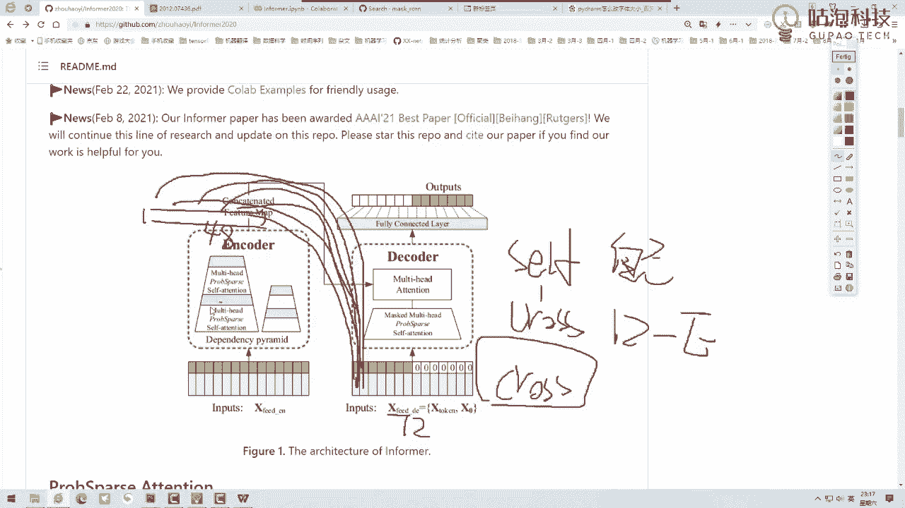

这个模块是完全一模一样的啊，没啥太大差异好了，这块当中我就不给大家一个看了啊，内容当中都是一模一样的就完事了，这就是抵扣当中，到时大家可以自己早晚去走吧，其实走的方法都是一样的。

我们走的模块也都是一样的，然后看咱们输出结果，收入结果其实没变的，还是多少，还是72，是不是相当于72，我们是走了两遍，大家注意这一块它是有两遍啊，一遍是我们先走，是self attention啊。

注意这个顺序，先走self attention，走完self attention之后，接下来再走我们的cross tension，然后接下来我们走完之后再连个全连接层啊，你看跟我们ECODE是一样。

是不是再连全连接层还是512位向量，这就完了，来完之后我们就往下走，你看这一步来来cross attention self啊，这呢cross attention self attension是不是都有。

其实啊唯一的不同是啥，唯一的不同啊，就是说咱们的输入是不一样的，其他东西我们都是相同的吧，啊没有啥太大的一个区别好了，这给大家解释了一下，就是说咱们任务当中啊，你看我给大家看一看。

你看这个这是cross，这cross啥意思，你看这个数就能猜出来，为大家再点开，你看这是啥，三十二四十八，我们说谁是48encoder，我们是96减半变成48，是不是，你看这里X是我们的呃。

decoder输入cross跟我们的啊，encoder去做这一块呢，xx自己去做啊，是不是这样一件事啊，就该这么去理解吧，这要是我们做QKV，对于我们的self attension q kb都是谁来的。

QKV都是我们的decoder，大家来看是不是都是X都这个底X是谁，这X是我们的decoder，是72那个东西是吧，然后再看我们这个cross attention。

你再看这个cross attention q是谁来的，Q是我们的那个decoder的Q，但是key呢key已经变成已coder的key了，你看cross嘛，然后V呢是不是已经变成已coder的V了。

这样是不是就是cross attention，我的Q跟你的key和你的V来去，重新算咱们之间的一个关系，把你的特征融进来，是不是这样一件事好了，那这个做完之后，接下来是道理是一样的，还是相同的操作。

做咱们的参数连接，参数连接之后做个加法来把结果值返回去，返回去之后来咱们胜利即将到眼前了，来接下来把这个结果拿到手，我们来看啊，来接下这块我们做decoder，decoder输出，咱是有了。

是不是72都有了，那接下来预测什么，72当中我们要预测是啥，来大家看这一步，这一步就是我们最终输出结果了，512，预测12啥意思，我们要预测未来的一个时间点啊，就不是未来时间点，预测未来的一个值吧。

就相当于我们也是做一个多变量的一个预测，咱们这任务当中我想起来了，他不是做一个单变量，我们是做一个多变量的一个预测来看这个结果，我们这个结尾得多少，来大家看三十二七十二十二啊，预测出来有这么12个十了。

但是接下来我说没完啊，我们说这72值它不是我们都要的，72值当中有48个是说我们带一带，我们的有标签的实际真实值，我们要的是什么呢，我们要的是负，我们要的是其中24个是不是，所以说这一块做了一个采样啊。

做了一个不是采样，做了一个就是呃筛选吧，-24啊，就是我们刚才说了，前面有20，前面有48个是带带我的，后面有这24个是要实际做预测的，把这24个东西拿到手，是不是就行了，来咱返回这个结果。

返回这个JO完之后，来咱这行代码是终于给他走完了，来看看输出32，二十四十二，我们是不是就做完了，终于啊我的天呐，给他预测出来了，咱们这任务当中，我我刚才我刚才一开始，是不是说我们做单变量了。

我可能记错了，他最后是做12，只是做一个多变量的预测，他做了一个多变量预测啊，ms做了一个多变量预测，然后我看看这个呃，DEMH来看这个，我看看预测值啊，预测值这一块他有没有去做一个取值啊，没有的。

它是取全部的，你看这是取全部，他是一或者是零二，这就说明是你预测是一个值，还预测是多个值啊，这样一件事，咱们这要预测多个值，也可以做多变量预测，其实也可以做单面预测，这个无所谓，根据你自己的任务。

那看我输出结果，24个值，每个值预测12个标签是不是都可以了，把这个结果返回去，那接下来简单了，这是啥，这是我们的一个MIC啊，套手上自带的预测值，有了真实值，真实值咱也有，是不是维度都一样的。

下面呢我说算一个损失，这咱不就算出这个损失了吗，算上热损失完之后啊，接下来该怎么做反向传播参数更新，这个事儿是不是就完事了呀，好了，这给大家去捋了一下，就是说在咱们这个任务当中，我们整体的流程。

其实我们现在debug的是一次迭代，后续所有的迭代，咱的道理我们的方法都是完全相同的。

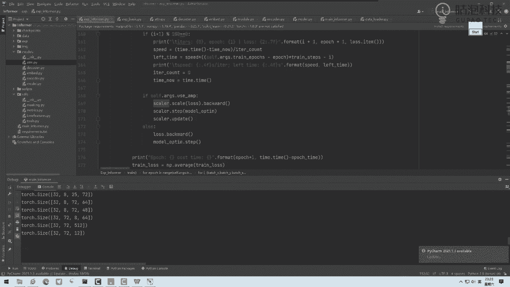

这是咱们迭代的一个方法，然后再给大家去说啊，就是咱们那个预测实际用这个模型，实际用这个模型过程当中啊，这一块是人家给了一个脚本，就怎么样去把你这个预测值和真实值给画出来，这个脚本给的是现成的。

以及论文当中这个图怎么画的啊，这个论文当中图怎么画的都告诉你了，我估计大家搞论文的同学能想到点东西了啊，是不是你的任务当中也可以画这个图呢，把我tension，你说的tension那个东西。

哎我说我不会去改，那你把它做一个压缩总会吧，像这个方法似的，做个压缩数也行，让速度更快一些，也可以去提一提啊，这个预测的东西啊，人家脚本也可以给好了，到时候大家我们可以自己去玩啊。

这个预测脚本其实也一样的，就是用这个模型取到输出结果，我觉着它比训练还要简单的多的啊，这个就是把训练当中一部分代码拿出来之后啊，这块儿，然后它你看这块有预测，把数据拿出来之后做相同的预处理操作。

做完预收了之后，然后不断去输出一个结果，把预测结果给画出来，很简单啊，这个东西，所以这一个我就不给大家一一说了啊，我给大家在哪，在任务到这里，他有个这个这个东西呃，自备COLAB。

这东西白嫖白嫖GPU白嫖玩都可以的，玩起来，这个到时候大家我们也可以去玩一玩啊，好了，这给大家梳理一下，就是informer这个源码吧，从头到尾主要其实咱们今天主要说一说，就是呃训练阶段。

其实测试也是如此的，测试大家后期自己看吧啊，这个任务当中这里边是都有的，咱可以自己去玩一玩，主要包括两点，数据怎么处理，模型怎么搭建，嗯其实数据时候咱讲的有点太慢了，所以说进度有点慢啊。

然后这个原版当中缺少了这一块，你知道人家核心的一个思想，后面整理大架构是不变的，关键就是核心思想，核心逻辑是怎么去玩的，行了，来看看大家问题吧，迭代迭代很多次，起码20个EPOKE吧，他俩没有组合。

他俩怎么他俩没有组合的，self attention输出的是向量，向量之后再走cross attention输出还是向量，经常无法提交，没没关系，无法提交，无法提交吧，那个我我们每个月会有那个什么。

我们每个月老板都会让大家评价我们课程的，每个月我都会让大家扫码的，到时候，感觉怎么样，兄弟们画图，这里人家人家人家是论文当中哇，这个论文真的开源的到位啊，真的开源很到位。

把人家论文图怎么画的都都给你开源了，挺够意思，是不是，论文作者北航北航的论文作者是北航的，我这个数据集人家的不是我的，这里兄弟们这里啊，百度网盘，谷歌网盘自己下的，这不是我的论文图，怎么画的。

这东西大家自己过一遍吧，啊人就有详细的过程，COLLAB当中，有的有的我给大家录了哦，我给大家录了，都有录播的，红龙应该是我们老同学了，第一遍学啊，第一遍学肯定难，因为我想咱这个课程进度快一点吧。

所以说哎呀也没给大家直播讲太多基础的，直接讲这个东西，难度肯定是有的行，到时候都都都有的，咱们这个PDF这都都有的，debug这个事啊，debug这个事怎么说呢。

就是不是说debug一次的需要花一些时间的，能CV领域论，咱们CV已经讲很多了，我们四期大家想看CV之前讲论文，四期我都没讲其他的，咱四期只讲CV了，都这个压缩方法，可以的，我觉得比较通用吧。

我觉得相对来说是比较通用的，时间序列，这么快PROPERTENSION有有意义吗，看看人家效果不仅是速度上，在效果上人家有很大的一个提升，在效果上也有很大的提升，最后输出14呃，十十十二是那啥。

最后输出啊，24表示我要预测未来的24个时间点，24个时间点，然后那个12就是说24个点当中，每一个点它是预测12个值，每个点它预测12个值啊，他是个多变量，预测不是一个单变量，每个点预测是二值。

这个意思对一一次出来的是一次出来的，CV写论文首先写论文看有没有自己的数据集，人家这都自己的数据集啊，人家拿自己数据公开数据都得找一找的，写论文其实都差不多吧，我觉着检测分割啊，做人多，但数据也好做。

对录播明天会传的，明天会传的，可以分类的哦，可以分类的，其实NLP啊，NLP都是分类的，NLP都是分类问题，论文画的什么图啊，就是来回到我们那啥，回到我们那个讲原理的时候，给大家说他那个图的数据集。

大家自己看吧，数据集这东西解码器mask怎么生成，mask人为指定的，mask是人为指定的，这东西人为指定啊，倒三角矩阵人为指定的，只能看到前面，不能看到后面人为指定的啊，每个点预测12值可以啊。

他的任务为什么12他的任务要预测12值，他的任务，人家这个任务要预测12个，我也没具体看人家啥任务，公开数据集不好发啊，兄弟们真跟大家这么说，公开数据集不好发啊，你自己数据集好发，公开数据真的挺难的。

decoder mask前从前48个还是从24个，decoder是那啥，我们是会预测72个，就是这48和二四都会做预测的，但是最后取只取24个，因为这48个是有真实值的，这48个是已知的。

transformer做分类和回归操作，体现在体现在输出层，体现在输出层和损失函数，只是输出层和损失函数不一样，对这个跟mini2参数一样的，有自己数据集加入代码，对啊，时间序列它是通用的。

哎就是大家听完这节课之后啊，你自己的数据集会不会处理了。

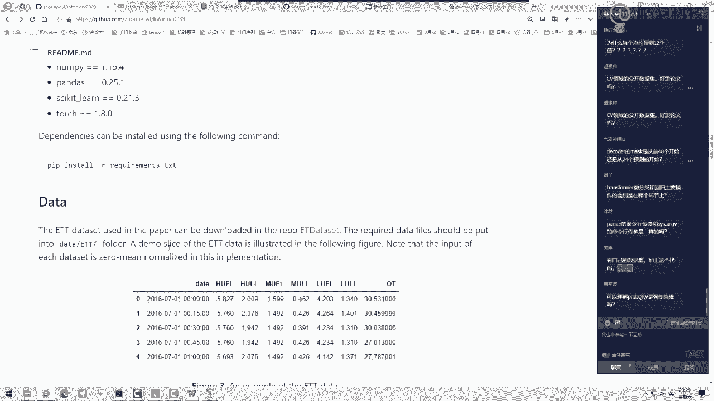

自己去数据咋处理是不一样啊，就数据格式做成跟一样的就完事了。

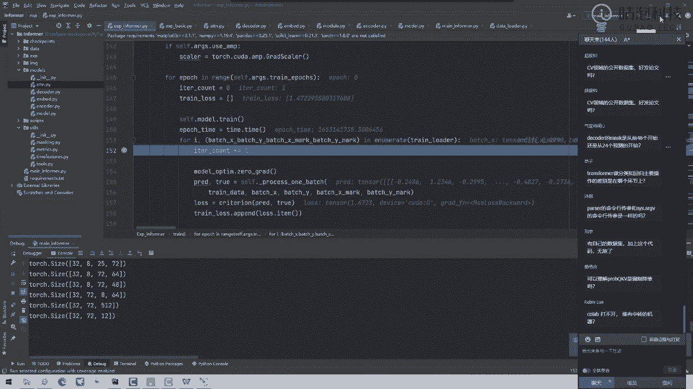

不难啊，都不难，就啥东西有源码你去改都不难，你自己写可难了，你自己写可可可真难了，对可以当做是强制降维呃，那啥就是不是不是中中中转的机器搭个梯子啊，咱们群里互相问一问，梯子这东西大家很多同学都有啊。

哦哦对自己可能第一遍debug有点难吧，但是这个可能在我们源码当中，并不算难度特别大的，咱们我觉着我真觉着讲的难度比较大的，是那个三维重建，那个我觉得可能三维重建，那个源码是难度最大的，因为三维。

因为这个源码可能不需要花太多时间吧，能看看懂，挺接地气的，我30出来那个源码我看了两三天，这玩意儿对这玩意不用标注数据都固定的，25个是看论文吧，论文是指那个对数值论文当中。

论文当中给这个公式是五乘对数，96，指定个这个值，它指定个这个值，说实话原因为啥我也没我也没整明白，你就当做经验值就行了，对对一定是我们上次课给大家说了吗，v it的源码要给大家去看。

这个故事给大家去看，然后跟大家说一说，就是自己写论文抄实验过程，你这个抄这个词用的不准确啊，自己论文是用人源码套到自己的任务当中去，改这个东西呃，你抄可能都抄错的，你抄这个东西我觉得难度还是很大的。

你直接套都是直接套的，在上面做微调啊，抄是很难的，抄容易抄错，这个是为啥，这我没我没具体去看啊，这个东西图像自动标注，咋标，你特斯拉都都不一定搞定的东西，这东西不太不太很难的。

这只有大厂他们算法极其强大，才能搞这个东西，对，还有跟大家说下周讲啥啊，下周呢跟大家说一说啊，咱们四期啊给大家去讲了太多啥，四期我们是一个纯CV的，然后武器当中呢，接下来我们会给大家也是呃。

其实也是跟transform有关的，我们会给大家讲什么呢，呃是偏一些文本相关的，因为咱文本啊最近已经好久没更新了，大家快催死我了，咱们讲这个东西，讲hungu face，我我会给大家先上传一个。

就是呃介绍这个东西的，然后下次课咱们因为因为啊这hang face，如果介绍咱们放直播讲，我觉得太占误大家时间了啊，hui face我会给大家录一个小时左右吧，然后先给大家介绍介绍它是啥。

让大家有基本认识，然后呢接下来我们没我们下下次课啊，重点去讲这个hunger face，大家可以先不用知道是啥，你等我给你录完一个录播的，我为大家提前录好录播，让大家做预习的，这东西很重要。

这东西很重要，你就可以当做吧，就是CV领域当中啊，我们讲了什么，讲了m m live这系列是吧，我也好，那都看到了，然后呢，NLP这个领域跟m m live非常类似，不能说完全一样吧。

比这还简单的就是hunking face了，这是现在最火的东西了，要大家说说这个啊，要大家说说这套东西嗯，How you fit，这个工具其实继呃到时候我跟大家说一说，下周需要预习的东西挺多的。

康康face这一套也是基于transformer去做的，这个这个很有用，这个很有用，行情face的很简单，咱们很多同学搞毕设的，都拿这个东西做的很好用，就大家就是进度尽快刷吧。

啊我这个进度大家就尽就是尽快刷吧，因为咱这内容说实话也挺多的啊，内容挺多的，关键就是其实只要学会了我们这种debug的思想，你后续自己看论文，自己看源码也都不难，也都也都可以去执行下去了。

就这个事大家就多做几遍吧，啊我去看论文也如此，看论文一般啊，就是从来到尾从来都看一遍呗，第一遍看看论文，你别说大家是懵逼状态，就第一遍我看这东西我也懵逼状态，我这个角标都对不准，我这个角标。

我对寻思这个这个这个这个角标都啥意思啊，那第一遍还能全这样，那很难都去理解，就这么多公式，你看其实代码没那么难，但是公式写的我觉得挺难的，第一遍去看哈，就是写作也是个技巧吧，你这公公式里写的挺难一些的。

然后结合源码去看，我觉得就没那么难了，反正一般先看论文，然后再看源码，没有源码论文就不要看，因为真的看不懂，对啊枪new face啊，是以后大家做实际项目真的最大的帮手，这这都神了，ALP有这个东西。

其实我跟大家这么说吧，NLP有这个东西之后啊，你还要学基础吗，嗯不太需要学基础了，CV1我们讲了好多基础，NLP我应该这么说，你有我们现在学这些东西，基础你再去跨到LP这个领域。

结合这个航行face子跟玩一样，很轻松很轻松行了，今天哎呀，咱今天也是大家，大家也挺辛苦的啊，咱们干到这么晚行，今天到这啊，兄弟们，然后下周我们会明天吧，明后天给大家说我们的留的一些任务。

还给大家留很多任务，下周我们要讲新的东西了，行咱今天到这，兄弟们今天就到这嗯，兄弟们拜拜拜拜，下周咱继续，下周我们讲那个hunting face cb，跟LP其实很多本质都一样啊，就是输出和数据不一样。

本质啊大部分都一样的呃，也不需要大家补多少基础行，今天先到这。

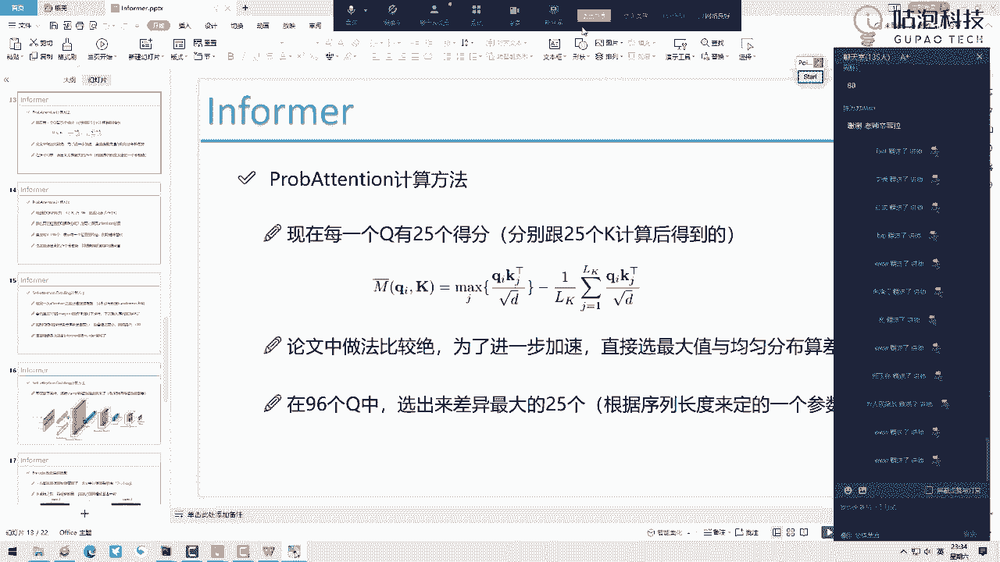

兄弟们，大家拜拜嗯。