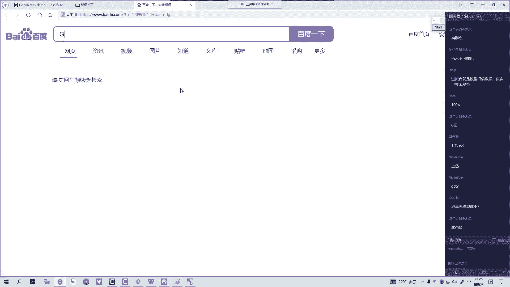
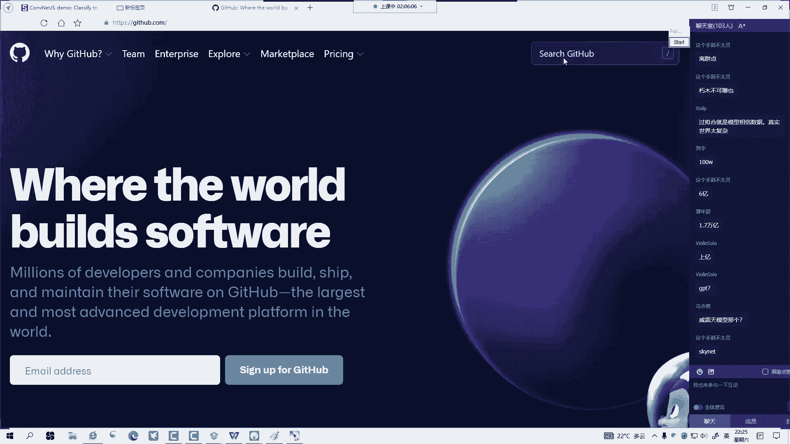
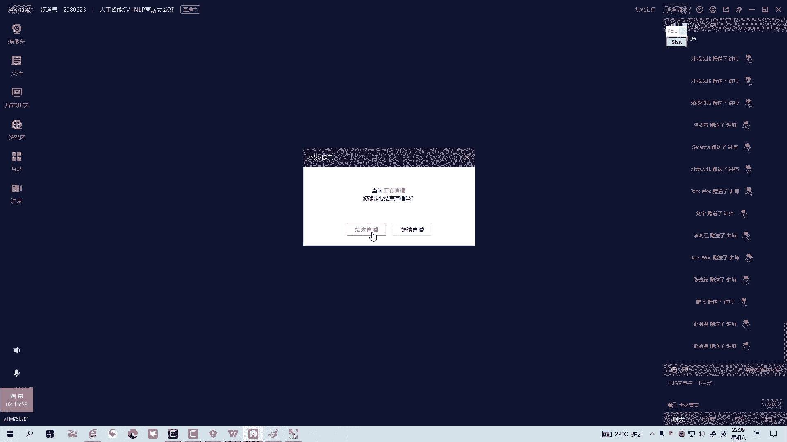
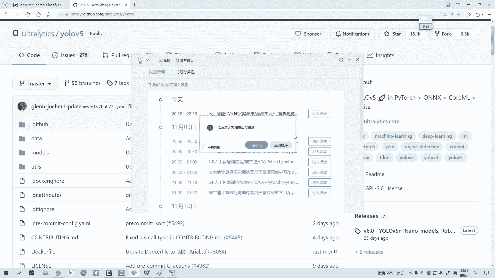

# 一口气带你吃透【Python机器学习与量化交易】保姆级教学，建议收藏！（人工智能、深度学习、神经网络、计算机视觉） - P63：1-神经网络算法解读 - 码农卡卡西 - BV1un4y1R7j1

行，然后演示一下GITHUB，GITHUB需要需要咋咋演示，不就不就下下代码了吗，最后最后最后的时候给大家看一看吧，最后的时候给大家看一下，下去去干什么，就给大家说一说。

然后这样跟大家来概述一下咱们今天内容啊，这节课主要大家讨论一下，深度学习当中比较核心的神经网络，医学当中应用啊，其实这些就是想听应用，大家可以干什么，就一会最后给大家说说吧，就是一些应用方面知识。

然后要看这些应用啊，你可以找一些综述的文章，就有很多论文啊，它是那些综述性的文章，是不是那些综述的文章，你看一个那可能就是顶二三十篇了，可以多看一些综述性的东西啊，中文的英文的都有这些综述的东西。

然后呢咱们就这样啊，我们讲讲那个传统神经网络，因为今天呢就是不算我们那个开营啊，算是我们第一次正式课，在我们这次正式课程当中会给大家说一说啊，就是一个基本的神经网络，它是去做什么的，以及呢怎么工作的。

然后呢当我在讲的过程当中，可能不会那么太基础吧，每一个点呢都给大家稍微的做一些拓展啊，都做些拓展，因为我们这些基础的点啊，就是在我们的录播当中已经都有的，咱们直播当中的一方面会给大家强调一些重点。

然后一方面呢会给大家再做一些拓展交通的，咱们后续说啊，咱后续慢慢去说，各领域的，可能都给大家涉及到一些的深入学习呢，我先给大家说一下他基本的思想，就是以后呢当大家去看到一些文章，人家怎么去说这个事啊。

我们一般叫做一个安and one的感觉，什么意思呢，就是一个说白了它是端到端的，这个我觉得它就是深度学习啊，或者神经网络的一个代表，我给大家举个例子啊，比如说现在呢啊我们想做一个事儿，我想做这个事儿啊。

我用传统方法去做，传统方法去做啊，就这样就像是把大象放冰箱里分几步，第一步边门打开，第二步把大象放进去，第三步再把边门关上，那就是传统算法，咱们得分成流程，分步骤啊，第一步咋地，然后再对折咋地咋地的。

再咋处理，再打加工啊，最后套什么算法，那是传统算法深度学习当中呢，因为没有黑屏啊，深度学习当中啊，主要强调的就是这个端到端端到端，按他的意思是这样的，就好比说我们的输入哎，就是我们的数据输出呢。

它直接就是我们这个结果啊，它是一个直接就是我们要的一个结果，没有那么多啊，中间的一些过程了，我给大家举个例子，比如现在我现在呢我们想做一个三维重建吧，呃可能举例有点难度有点大，这样说简单的吧。

哎就说三重连得了三维图形当中呢，比如传统算法当中，第一步我要估计它的深度是，第二步我要估计它的一个点云，第三步我再估计一些其他指标，第四步再生成，而我们的一个重建的结果，这就是传统算法当中。

每一步我们都需要去做，那接下来呢我们说生物学当中，我说我直接估计他的一个比如说mesh结果，就直接估计的三维结果行不行呢，这也是可以的，所以我觉着就是深度学习啊，它给我们最大的一个优势。

就是简化了我们中间的过程了，中间呢大家可能经常去问哎，你说我们怎么样用这个网络，或者说我们怎么去控制啊，咱们这个模型怎么去告诉他，我要去学什么呢，这个呢我给大家去说啊，其实深度学习比的是什么呢。

就是啊比的一个损失函数啊，控制通过损失函数告诉我们的模型，我们要去干什么，接下来呢中间的过程啊，中间的步骤，这个我们都不用担心啊，都是一个端到端安图的一个结构好了，这是先说了一下我们的一个特点啊。

以后啊大家在看论文的时候，就会发现很多深度学习啊，都是把传统任务给他简化了，传统任务当中你做一个事儿，说实话挺麻烦的，但是在社会学习当中呢，你想做一个事儿哈，交给网络就行了，你说他至于中间怎么算的。

为什么能算上这个东西，这怎么说咱都不管啊，他就有这个能力，咱不去深究它的过程，我们最后呢看的是一个结果，这就是深度学习，只看结果，我不考虑中间的一个过程，然后这些个吹的东西啊，今天就不给大家吹了。

因为我估计大家听过一些公开课，应该都给大家吹的差不多了，是不是今天呢咱就不吹这个东西啊，直接啊我们就讲咱们的一个知识点好了，应用当中呢，我记得我之前给大家看过好多好多了，今天应用啊咱就先不看了。

最后的时候咱再看这个应用吧，我们直接啊，咱就快点直接进入到这个知识点当中，知识点里呢给大家说几个故事吧，啊可能往期同学都听我讲了很多遍了，深度学习起源于哪一年呢，其实嗯最早啊很早就有了，196几年啊。

上个世纪60年代的时候，深度学习呢已经悄悄崛起了，但是当时我们不叫深度学习，叫什么叫感知机，大家可能以前看过一个很奇怪的名字，叫MLP，是不是叫什么多层感知机之类的东西啊，以前叫那个名字。

然后现在呢改名了啊，就是换了个名字，就像我们说吧，就是山东有个叫枣庄的，原来叫什么，原来叫兰陵啊，跳这个名字，现在改改成枣庄了，感觉像卖枣似的感觉，这个就是说我们原来叫多多感知机，现在怎么样了。

一般就不提这个东西了啊，把它就统一到升学当中，它是其中的一个层，它是其中的一个计算了啊，这样一个事儿，反正最早啊1961年就提出这个东西了，但是我估计大家能猜到，就是你说六几年的时候啊，怎么样。

六几年的时候这个东西为什么没有流行起来啊，其实一方面来说就是没有计算性能，是不是现在我给大家，咱们很多同学手头上也没有一些太好的设备，但是现在相对来说还好，显卡呢其实现在比去年要强了。

去年我们开那个三期班的时候，那时候显卡真的是贵的离谱，现在已经已经被打下来了一些啊，你可以当时让这些主播给打下来了，把这个显卡价格现在没有去年三期的时候贵了，但是相对来说这玩意也不便宜啊。

然后是196几年的时候，我们说啊没有没有一些经验性的，然后后来呢再次进入到我们大家演出，哪年呢，是97年给大家说说历史啊，1991997年的时候啊，那个美国哈哈咱们国外呢国外怎么做的。

国外啊他们愿意去签那个支票，是不是他们在签那个支票过程，当中啊经常去识别一下哎我这个人写的东西，但是不是他的一个笔记，那光靠人眼去识别，一方面挺慢的，一方面呢人啊就是不太准，是不是人有一些自己的情绪啊。

识别不太准，那197年的时候呢，美国啊就拿这个在银行当中去做应用了，卷积网络，97年已经出现在大家视野当中了，只不过那个时候呢卷积网络太简洁了啊，然后呢这是一个故事，然后中间那感觉又断片了。

中间又断片了，再次应用，再再次就是登上历史舞台，是哪一年了，就到这个2012年了，12年有什么故事呢，12年的时候啊，就是啊我们那个美国还是美国，咱们有个工人科学家，我给大家听过叫李飞飞，李云飞啊。

这个人啊就是他对这个计算机视觉啊，这个领域贡献很大的，05年的时候呢，他就想就是怎么样哎，能耗能能让能让更多的人吧，关注这个深度学这个领域，关注计算机视觉呢，所以说啊09年的时候。

李岳飞他又号召大家去标一个数据集，这个数据叫什么呢，这个数据集啊就叫做一个imagine night啊，当年还办了个比赛，所以说啊再次映射到大家眼中，就是2012年了，2012年有个哥们叫谁呢。

叫LEXALEX这个人啊，如果说大家不知道是谁，你就当做剪头发的，掏鸟屎就完事了啊，反正就是老外这个兄弟呢啊他怎么样，唉他当年参加这个比赛，并且得到了冠军，得完冠军之后呢，哎呀它的效果一般。

我们说啊说第一和第二能差距太大吗，一般差距不大，但是在12年的时候呢，哎哟less这个人，他用卷积神经网络去做图像分类这个事儿，比第二名，第二名啥算法咱就不管了，因为历史上只能记住第一名。

他比第二名效果好了十几个百分点，这就是当年一夜爆火的感觉，突然怎么突然这个人就火了，随之带来的就是他用卷积神经网络，得当年的冠军，所以呢卷积神经网络在12年的时候，逐渐的进入到大家视野当中了。

大家首先发现卷积网络这个东西好用，当年是用来做图像数据，现在呢已经不仅仅是图像数据了，NLP的语音的语音识别当中，很多都是都是沿用卷积去做的，语音的LP的数据挖掘领域，现在说呢是都可以用啊。

我们这个卷积来去做的，以前啊那个MLP也是BP吗，对基本上我们所有窗口当中都是BP去做的，信号系统与人工智能有什么关系呢，你可以当做你可以这么理解，就是AI啊，是我一般这么说，就是AI是去提特征的。

你信号那些东西呢只是做一些数学变化，它不涉及到一些建模一些特征的东西，呃，epoch这个东西来到时候最后说吧啊，这个我跟你最后说，最后最后再给大家大一的时候咱慢慢说啊，跟今天不是太相关的。

我都给大家往最后去说啊，咱们先说我们课程比较相关的好了，然后呢哎这是image net当年的一个故事，然后国内什么时候开始火的呀，我跟大家说一个事儿，就国内啊13年的时候最火的是什么。

13年其实国内最火的还真不是AI，那个时候啊我们都打着什么旗号，那个时候你说他要报培训班，你绝对不可能报这个AI培训班的，那时候说实话市面上也没有，13年说市面上没有AI培训班。

13年那时候最火叫什么叫大数据，是不是那个时候那个时候大数据怎么样，那个时候大数据啊，就是说特别火，大数据，云计算这个东西，然后呢这个深度学习啊，国内什么火起来的，国内的时候啊，14年啊，14年的时候。

国内深度学习开始大火，当时我们开玩笑嘛，就是说14年左右吧，在上海北京，你做个创业公司，你搞成度学习的，你都不用搞啥东西，随便整理下PPT人物几百万啊，都很轻轻松松的。

我们说嘛就是14年风口嘛啊主动起飞的感觉，14年国内创业公司啊一片一片的，反正15年一六年死的也是一片一片的啊，这样感觉行，这里大概述了一下，就是我们的一个大学历史，然后呢是当年啊百度放出来一张图。

当年百度放出一张图啊，它是这样，就是深度学习，它是需要什么，需要数据，是不是，但是今天咱们也这么说啊，深度学习嗯，一方面需要数据，但是没有像以前需要的那么多了啊，为啥，因为后期我给大家说啊。

现在呢我们有一些数据增加的方法，我们现在可以优化这个模型，这个模型一定程度上不需要那么多数据，以前我们说啊，就是你百八十万个数据你才能敢去玩，现在呢你百八十个数据没准也是可能的啊，有这么个事儿行了。

来直接说我们任务啊，咱说重点了，简单的东西我就不给大家一个去过了啊，多说说重点的，然后大家到时候再拓展一些好了，先看看图像，咱们说啊计算机视觉，大家可能觉得计算机视觉啊。

是不是就只是去解决一些传统RGB图像呢，嗯其实不是的，我们后续呢还给大家讲一些其他格式的，比如说啊估计大家咱们这些都不用这些，估计咱们有个咱们有各个领域同学，做的可能都不太一样的。

有的什么后续我们还会说还说点云，还有说一些深度等等啊，咱们有不同格式的数据，反正呢现在来看用的最多的还是传统数据，为什么说用最多的还是传统数据呢，啊因为这东西廉价，什么叫廉价呢。

随便一个相机拍出来的东西啊，就是传统传统这种RGB的数据吗，你像那种点云数据，像激光雷达这东西，一般人家就没这个条件搞不起啊，所以说现在啊为什么说很多很多领域啊，还是偏研究呢，为什么说落不了地呢。

就这东西太贵了啊，不能量产，要是能量产的话，现在我们可能要去讲的，那就不是传统了，而是直接讲那什么电源啊，激光雷达那个东西拿出来给大家玩一玩，但是那些呢估计是以后的趋势，再过多少年，那就不一定了啊。

咱就说传统的中文当中，说就是图像数据来基础给大家过一过，因为我们报名的同学啊，其实嗯范文同学里边，2/3都是比较偏零基础一些的，很多呢都是刚读研的同学，延安一同学啊，我估计就是今天来的同学当中。

研一的应该不下30个啊，就是今年读研一或者是啊兼督验二的不加三，最少得有一半吧，最少得有一半一半的报名同学，其实每个同学情况，然后那个我们朱涛老师当时都跟我说过啊，咱们刚读研的同学特别多的。

然后这一块就是对我们这是第一节政治课，我们今天是第一节政治课啊，还有一半就要看比赛了，今天什么比赛来带大家告诉我今天什么比赛，刚才我那个我在我在，因为我我我今天忙别的事了，刚刚小区里我也听到了楼下楼。

楼下说要看比赛啊，EDGEDG是啥啊，英雄联盟是不是啊，这个我我我我没研究过我们几点几点，我不知道这个东西，但是我看那个我看抖音上刷刷屏了，EDG怎么样了，我不太懂这个东西啊，咱不说了。

咱来说我们这个突厥，我说一下咱们这个数据啊，住哪儿呢，完了那大家那大家得今天是不是得双修啊，啊没事，人家那个就是咱到时候知道结果就行了啊，咱今天讲完，估计他们打不完，打好几局是吧。

来我们说这个图像数据啊，它是一个由啊长度宽度，它有颜色通道所组成的，也就是一个矩阵以后呢，咱们在所有的项目当中都怎么样以后啊，我们在所有的项目当中都是啊，跟大家说图像数据啊，它就是一个矩阵。

大家注意图像数据就是矩阵以后呢，我们要讲的每一个知识点都没有什么数值，再说了，做东西啊都是矩阵，所以大家得先习惯习惯啊，我们用矩阵去描述啊，这个东西，还有大二的，你看你看我们同学好超前啊，啊。

然后高上上那个之前有说上那个高二还是高三，那个哥们来不来，有一个上高中的哥们，咱们还有我不知道今天来没来，然后那行大家大家具体问题啊，就是咱们具体客户就说直接微信，我说就行，然后我说是挑战不说了。

挑战里这些挑战我觉得太简单了，我给大家说了，我跟大家说实际当中最大的一个挑战，在我们这个实际项目当中啊，其实我觉得最大挑战这一届现在都不叫事儿了，这些根本都不叫事儿，你数据多就能解决。

其实说白了就你这些个问题，你数据多就能解决，但是有一个任务怎么样，有一个任务啊，它是数据多也解决不了的，叫什么叫跨域，什么叫跨域的问题呢，我给大家做一个比喻啊，就是深度学习有哪些事他是做不了的。

我们经常以前就是给企业做培训，企业这帮人啊，就是四五十岁大哥，他们对上班不感兴趣，但是他们对炒股感兴趣啊，他们总问我老师AI这个东西能不能炒股，这东西能炒股，说研究研究挺有意思的，反正我上个班摸个鱼。

顺便炒个股，挺开心的，学习这个东西，我说呀金融学这东西啊，它解决不了炒股，为什么说这东西它解决不了炒股呢，我给大家举个例子啊，当时咱们再去拿股票数据啊，比如说我有每一天的各个股票，它的什么收盘价。

开盘价格指标指标一堆一堆指标都有，然后说想预测诶，他不就是明天这个价格，然后呢我说这样我拿历史数据啊去模拟啊，就是说我们做那个回测，量化交易当中不有那个回测吗，当我们在做这个回测的时候。

大家会发现一件事，我们很多人就是去做这个回测的时候，就百分之百盈利，我们建立的模型在历史数学当中，我百分之百盈利啊，赢得非常多，赚的都感觉明天要成要成世界首富了，但是呢在实际用的时候就不行，来问问大家。

为什么说很多这些模型啊，我们有比如说这个股票数据，我们拿历史数据做建模了，历史数据当中表现非常非常好，但是呢实际我用的时候效果极差了呢，为什么会有这样一个现象呢，这个叫什么，这个叫做一个跨域啊。

什么叫跨域呢，我们一般这么去强调啊，就是我们用的算法是干什么，无论是传统算法还是机器学算法，我们说它都是怎么样的，它都是要在我们数据当中去进行特征提取，是不是当他在进行特征提取的时候。

他要去学哎我这个历史数据当中啊，有什么样的分布，有什么样的一个规律，但是大家注意一下他学的是什么，他学的是一个历史数据当中数据的一些规律，数据一些分布，但是我们的新的数据呢。

新的数据它的分布会不会发生一些变化呢，大家想一想，时代在发展，国家在进步，是不是我们每一天啊市场在变化，大家呢我们投资的角度也不同了，眼光也不一样了，人的境界也不同了，每一天突发事件都不一样。

大家想一想，我们新的数据的分布跟历史数据分布能一样吗，那可以说不可能是一样的，而且来说差异很大呀，你让我们历史数据当中学到的规律，应用到新的任务当中，这合适吗，显然就不合适，是不是啊。

所以说啊就是股票啊，或者说这些东西你做预测，本来我觉得不太现实，你看这说的刚才咱们说的叫什么，叫做一个跨域的问题是吧，跨域这个问题啊，其实很难解决，我再跟大家说一说，比如之前呢我们需要很多模型。

我们在训练模型的时候啊，或者说我们去我一般啊这边有一些培训的项目，培训项目的时候呢，有时候顺便啊，就是企业我参与他们的一些图标啊之类的，很多啊，就是企业他们跟我说，他们说他们那个项目很多大厂都不愿意接。

他们找个旷世，找个商汤，人家不愿意接他们这个项目，然后我说哎我说人家为啥不愿意接你的项目，钱少吗，他们一般啊，就是老板就是负责人会对我这么说，他说啊，就是人家的大厂觉着做了我们的项目，没啥通用性。

就算这个项目啊，模型啊，设备啊，或者说部署所有东西，都只能用到我们这个现场当中，用到别的地方就不行了，他们说我这个我们这个数据太特了，就是没法去做一个拓展，这些大厂还做什么旷世商。

他啊他们想做的项目都是什么样的，我做了这样一个项目，做了这样一个模板之后，我能全国去铺，比如说化工厂，我做安全识别，我不是针对你这个化工厂的，我们要做成产品，是不是技术啊，是不值钱的，一定要做成什么。

做成产品才能值钱，这就是大厂的一个思路，那人家为什么不接他们这个项目呢，感觉这个东西他明显只能用到自己领域当中，换个数据，换个场景没法去用了，这也就是说现在啊，为什么说很多生物学习当中啊。

很多生物学领域有很多创业公司啊，还没有死掉啊，这么多大厂创业公司为什么还没有死掉啊，他们捡别人剩下的活儿啊，能捡着活，是不是这样一件事，老师啊，同一类数据提取特征都一样嘛，唉这咱慢慢想一会儿。

到时候慢慢给大家去说啊，肯定是不一样的，体特征肯定是不同的啊，好对各种数据啊，其实它都是不一样的啊，它都是不一样的，好了，这给大家说了一个问题，叫什么跨域以后啊，大家在自己项目的时候。

我觉得优先点也这么考虑跨域这个问题啊，嗯其实不是特别好解决的，很多时候呢一个模型满足不了所有的需求，你可能要做多个啊，这是一个问题好了，然后传统算法当中啊，这些个例子呢咱不说了。

来直接进入到我们这个重点里边，我给大家讲一些重点的点，来看这个图，这个图给大家描述什么，描述的是我们的一个矩阵的计算啊，描述的是我们的一个矩阵计算好了，哎对咱们咱们大家具体任务。

等我那个最后最后一期给大家讲啊，咱们先跟着我们课程走，我说这样啊，假设我们有个输入数据，首先第一个我们说输入数据是左边，这个它是什么，它是一个32×32，再乘上一个三的一个矩阵啊，这是我输入数据。

它是这样一个矩阵，好了，大家注意啊，我们今天讲的是传统神经网络啊，咱们现在先说的是一个传统的神经网络啊，咱还没做什么拓展呢，我们先说最基本的今天，然后呢这个神经网络它有这样一个特点啊。

你看我这里边它是一个矩阵，这个矩阵当中有多少像素点呢，哎大家1×32乘32×3等于多少个，等于3072，是不是来我们写下这3072个，但是这个37我可以怎么写，在咱们这个任务当中，好。

咱们第一个传统网络当中，它是这样，它会把这个数据啊展开成一列，展开成一个向量，宅乘数向量形式3072像素点，那不也就是说，我们这里有3072个特征吗，好那接下来呢接下来我们怎么去做这个事呢。

那你看我们说咱们要得到一个输出结果，比如这块我要做一个十分类，我做这个十分类任务当中啊，是不是说唉呀我这一块我得做一些权重参数啊，来举个例子，在咱们这个任务当中呢，我说这个权重参数应该就是。

比如说这里咱们这个X有3072个像素点，W呢，我说有W1W2点点二移到多少，一直到W3072，那好了，我们来看看这个咱们这个矩阵乘法啊，是不是W1乘X12乘X2点点，加W32乘X32等于什么。

一个行向量乘一个列向量必然等于一个值，这没问题吧，但是大家注意点啊，就是我们这个神经网络，它做十分类也好，做一个100分类也好，他最终输出的结果不是一个索引，不是一个id。

就是说它最终输出的不是一个什么，123456啊，表示你预测的是哪类别，大家注意一下，我们神经网络呢会输出它属于各个类别的概率，那十分类任务当中，我会分别得到当前这个输入样本。

它属于十个类别分别的一个概率值，那好大家来看，现在呢我们这么一组全数参数矩阵得到了什么，一组全数参数矩阵我只得到一个值，那好了，我是这样，我说我能不能再来一组全数参数矩阵。

我说这块我在W1W2点点点点点，再到W3072，他俩是不一样的啊，他俩是不一样的，那接下来呢我得到什么，接下来哎我得到了，比如说第一个我说它属于猫这个类别，它的一个概率。

然后第二个红色我说它等于狗这个类别的概率，那接下来同理，大家可以这么想，在同理的过程当中说，下面我们有几组全数财政举债啊，你要得到十个类别，是不是说我得有十组权重参数矩阵，最终呢我得到了当前这个样本。

属于十个类别分别的一个概率值，这是不是就算出来了，好了，这点需要大家注意啊，分类任务当中得到的是每一个类别的概率，那再问大家一件事，你说在我们的任务当中啊，现在呢我们是一个权重乘上一个乘上一个啊。

我们的特征一般我们还要加什么，加上一个偏执，是不是，那问问大家，我们再去加这个偏执的时候，偏执是有几个呢，来这这点大家想一想，我们需要加上一个偏置项，咱们这个偏置项一般情况下是有几个呀。

在我们当中就是大家可以这么去理解啊，就是偏执啊，它永远是跟输出挂钩的，什么叫永远跟输出挂钩呢，它是这样，就比如说我们这个输出啊得到了十个类别，我接下来要对十个类别分别作为调。

而不是统一加个三加个五之类的，而是每个类别加的数是不一样的，所以说偏执是有几个呢，偏执它是有十个，来看我们右边这个结果，右边在我们这个片子当中是有几个诶，他是不是有十个呀，好了，这是先给大家说了一下。

最基本的什么最基本的一个矩阵的乘法啊，最基本的一个矩阵乘法，这个就是这个方法啊，大家需要来熟悉一下，因为后续呢咱们可以这么说，这就是我们基础的一个计算单元，基础的一个计算方法了啊，好然后问大家一件事。

这个权重参数一还是哪来的，我怎么得到一个权重参数的，这东西哪出来的这么大，说啊权重参数啊，他是这样的，一开始怎来的，一开始是随机初始化的，就跟我们一样的，咱随机投胎，咱们投胎的时候你有指定吗。

我说我投一个投到一个就是特别有钱家，我当个富二代，没有吧，咱们都是随机的，是不是，所以说一开始啊这个W只是随机的，但是现在呢我跟大家这么说啊，就是估计大家以后也想好了，就是我之前给大家说了。

咱们是工程师，面向开向编程是吧，咱们在在GITHUB当中找一些项目，或者你要参考一些东西的时候，尽可能要干什么，尽可能一定要有人家的一个预训练模型，什么叫预选模型呢，给大家举个例子。

你说咱们这个随机出啊哈，你就比如现在我是随机投胎好呢，还是我指定指定一些东西，比如说我指定我说我上辈子活的挺好的，按照上辈子那么活接着活吧，啊上辈子都打打好基础了，这辈子接着活是不是能活的更顺溜一些啊。

咱不用一开始从头到尾再去挣扎了啊，是不是这么个事儿啊，所以说这个权重参数啊，大家这么去理解啊，一方面我们自己玩的时候，你可以随机初始化，另一方面呢，你也可以拿别人训练好的模型，当做我的一个初始化。

这个是也可以的啊，反正今天大概这么理解吧，这东西它是随机来的，但是随机指大家说好吗，随机值啊，一般我们来说是不太好的，因为大家训练模型的时候会发现一件事，它有点玄学，书上玄学呢。

就比如说现在呢你看某一篇论文吧，人家那个说的效果非常非常好，然后我说我自己复现了一下，哎我咋咋复现都跟人家销售比差的挺多呢，啊差挺多就对了，人家可能经过各种各样的尝试，才得到这样一个结果。

每一次那都是那种什么有运气成分的，你不是说每一次你点儿都那么好，一次每一次都训练对的，就大概这么想，你随机处理这个东西，那离结果越近，是不是说唉你的接下来训练越容易，你随机触发这东西，我随机到。

我随机到非洲去了，掉到贫民窟里了，我估计这辈子我也就完了，我看了那么多非洲纪录片，我就觉得我感感感谢我生在中国吧，我看过非洲很多部落的生存片，我的妈呀，太恐怖了，这个感觉，所以说随机这东西他也挺恐怖的。

怎么样，不是说你自己训练模型就能训练好的，所以以后大家找开源项目的时候一定要看什么，我一般找开源项目要看两个东西，第一个就是源码有没有，第二个预训练模型，有没有有预选模型，这东西啊，他就真能玩。

他又没有一个给你预约的模型，就别人训练好的东西，你想玩就真困难，因为大家可以大家可以，大家可以这么跟大家说吧，你觉得这些你有数据啊，你就能训练好一个模型吗，不一定在什么前提下。

在你有一个好比较好的初始化的情况下，你去微调这东西容易，我比如说给大家举个例子，我说现在现在让大家答高考题，你说你还能会吗，我说我不会啊，我说这样吧，咱先找个清华状元，先把高考题答一遍。

我说咱们呢在人答完基础上改吧改吧，然后再再调一调，这是不是就容易了，所以说以后啊大家自己找项目的时候啊，嗯尽可能找有预算模型的，没预算模型，没没没有预算模型的东西啊，或者大家看后面我们项目给大家选的。

这些开源项目，没有预选模型的，我一般都不给大家去选，为什么实际应用的时候应用价值挺低的啊，基本上用不上的，即便你有数据，你也训练不出来啊，不信大家可以试一试好了，这个W是随手而来的。

然后呢你看W要加B我们得到输出值是吧，但是大家看我们输出值哎，你说这个事做得好不好呢，你看我们当前当前输入这东西啥，这是个猫是不是，但是你看它它预测啊，就是我们这个模型它属于猫的一个得分嗯。

怎么样反而是负的，你说负的得分代表什么，代表他预测错了是吧，预测错了怎么办呢，我是不是说我得告这个模型，哎我说你这个做的不好啊，做的不好咋办，改是不是改谁呢，能改X吗，大家注意啊。

X在我们计算机数学领域当中啊，他是不会去变的啊，X是不变的，我们只能改谁呢，或者说我们最终训练完模型得到的东西啊，就是这个W啊，W就是我最终要得到的东西，我要调节的就是咱们这个权重参数。

那接下来呢咱们看看怎么去改这个东西呢，我们管它叫做一个损失函数了，其实这个东西挺重要的，这东西非常重要，然后不是有很多那个研一研二的，然后之前跟我说说，导师给你什么课题，你都不知道研究啥好了。

也不知道从哪出发，还能改不改吧，创新创新了，可以创建点啥呢，可以创新点损失函数，什么叫创新点损失函数呢，就是我一般总跟大家说，根据你的课题跟你的数据有啥特点，损失函数呢你都可以往里去加的。

比如说限制限制，就是你想限制什么东西，限制这个东西不就是损失函数吗，比如说现在我要做目标检测，唉我发现老师啊，就是我发现我们那个数据集当中啊，咱们那个带检测目标全是正方形的。

唉你发现你要检测中标目标全是正方形的，你说你损失函数当中对于每一个预测的框，是不是可以让我的就是长度和宽度做一个减法，他俩或者说做一个除法，比值接近于一，你加这个损失函数行不行，这是不是就可以啊。

所以你看我总说嘛，就大家总问我老师，我这个课题该咋创新，我一般都这么说，说公开数据集啊，你真的也够呛，能创新出来了，根据自己数据的特点不就一堆吗，咱们这个班就好多同学，都是要做那个目标检测的。

反正也都不知道咋更新，就像说的看数据有啥特点呗，根据你这个特点，损失函数能不能创新网络结构咋地啊，那都多少改一改都行，是不是啊，这个也是后续大家可以重点参考的一点，因为现在大家看这篇论文，好的论文啊。

损失函数设计的都很巧妙啊，其实大家这么说吧，我们一般看论文当中呢就是看两点，第一点网络结构怎么设计的，第二点损失函数怎么设计的，你只要把这两点看懂了，基本上这个文章或者基本这个项目，你就差不多了。

也就这两个东西了，来举个例子吧，比如说我们这个任务当中啊，咱们这块有有就是看第一个得了，我说这块有个猫，这是我的一个呃输入数据，然后对我这个输入数据呢，我想去看一看我们的一个损失，然后这个损失函数这块。

就是你当我自己定一个公式得了，它也不是什么什么特别的东西，就当我自己定一个，你看呢我用这个错误类别得分，比如这里你看5。1到3。2，-1。7到3。2，用凑类别得分，分别减去正确类别得分。

这是不是就完事了，然后再算我们的一个差异的总和，然后再加一啊，加一就是说呃一般是加上一个delta，它的意思就是说错误类别至少得比正用，正确类别要高多少分啊，正确类别要至少比错误类别高多少分。

才没有损失，没有损失呢，就说损失直至零二啊，代表完美好，这一块呢是我们通过公式去算什么，计算每一个预测样本，它的一个损失是等于多少的啊，这个是我们计算咱们的一个损失，这个了解了解了解就行了。

后续呢我们回报损失函数其实挺多的，其实大家也这么去理解损失函数啊，就是我们看一看我们要预测的东西，和我们实际的东西，它们之间的一个差异差异越大，说明你的W越不好，我就该好好去调，差异越小，说明W还行。

我微微调啊，就大概这样一个意思好，这是我们损失函数，然后在这个损失函数当中啊，大家注意一个东西啊，有叫做一个正则化，我给大家解释解释什么叫正则化，可能这个之前很多同学都推我们训练营是吧。

训练当中我没有说这个东西来正则化，是这样，比如说现在呢我们有个数据，这个数据呢它是1111啊，我们的数据，咱们的样本，然后呢接下来有两个模型，第一个是W1吧，它是1000，然后呢还有个W2，W2呢。

它是它是1/4，然后1/4，然后1/4，然后再1/4，然后大家看这个结果啊，就是无论这个W乘X还是W2乘X，大家来看这个结果怎么样，我们可以说无论他俩是谁啊，我就是不管谁，咱们的结果都得都得等于多少。

不管谁呀，咱们这个结果我说它都是等于一样的，大家来看这个结果它是一样的吧，这个没问题吧，那好了，也就是说咱们这个任务当中啊，我们这个结果啊唉它都是相同的，那结果相同，问问大家，这意味着啥呢。

你说是不是说咱这两个模型啊，它效果一样，没有什么区别，无差别，这个东西其实不是的，大家再仔细来看，你看W1啊，它相当于什么，我只关注一个局部特征，W2呢，W2像这种雨露均沾的感觉。

是不是他会更关注于每一个特征，会对我们结果带来什么样的影响，这就是我们的一个W1和W2，它俩是有区别的，来大家发现发现它怎么样是有区别是吧，好了，但是问答你说我们喜欢哪个特征的，大家可以来说一说。

你喜欢W1W2啊，我估计大家会告诉我，我会选W2，为什么它不偏科是吧，他比较均衡一些，但是有这件事儿，你知道我知道怎么样能让计算机知道呢，这里啊就是说我们加上一个东西叫正则化惩罚，给大家写一下。

所谓这个正则化，它是这样一件事，咱们这个正则化当中啊，就是要做这样一件事，他会他是惩罚惩罚谁呢，魏大化这个W1样W1这样的啊，突然忽大忽然忽小，突然忽大的啊，就这种感觉飘忽不定的，然后呢这个W2来。

大家看这个W2怎么样，这个W2啊它非常平滑，非常稳定，是不是，那问问大家，你喜欢哪一个呢，你喜欢这个比较稳定的，还是喜欢这个比较平滑的呢，我估计大家都选谁啊，都选择这个比较平滑的是不是好。

但是模型怎么知道这个东西呢，模型到这里啊，我说哎给它加上一个L2正则化，L2呢就是他去求一个平方向，我给大家举个例子啊，我就不小心把这个图关掉，给大家画吧，大家还能记着吧，这是啊，我我我重画一个。

这里它是1111啊，不对，他是一个1000，然后下面呢是那个四个1/4是吧，来我们看一下正则化L2，正则化就是去求它的一个平方向，平方项啥意思呢，来咱算一个一的平方，加零的平方，加零的平方。

加零的平方等于几等于一，然后接下来第二个呢1/4的平方来加来，再加Z91起等于多少，等于1/4是吧，大家注意一下这是什么，这是惩罚，对谁的惩罚大呢，对第一个的惩罚大，是不是。

所以说啊既然对第一个的惩罚大，我们就不希望它是第一个模型，而去选择第二个模型，这个呢就叫正则化惩罚，因为神经网络它是容易过拟合的，我们在实际训练模型的过程当中啊，肯定是说啊不希望这个模型过拟合，是不是。

所以由此呢咱就引入了哎，叫做正则化惩罚这个东西啊，好了模型过拟合方法其实有很多的，等后续呢我妈给大家去看啊，然后再再问大家一件事，就比如说这个蓝色，这个这个东西是由什么导致的，大家想一想。

这个东西它忽大忽小是由什么导致的，来问问大家这个问题吧，他这个忽大忽小来大家，大家就是比如说这个说面试题，人家面试官就问你们这个模型训练完之后，全部参数忽大忽小的，哎你说是由什么导致的，来问问大家吧。

这个东西大家一起来回答回答吧，啊就是来请听题哈，大家可以说一说哦，我这个其实影响因素是非常非常多的，好多东西都能去影响你这个权重参数，忽大忽小不绝对不是欠你盒这东西，它不是欠你盒这东西最大原因是什么。

你想什么东西可能出现这些东西忽大忽小啊，一些离群点，一些异常点啊，最后可能什么导致的，你这样本不好啊，你这样本突然有个贼特，比如说什么叫什么叫什么叫平衡呢，平衡就这种感觉，平衡的时候就是我问大家。

咱今天几点上课，大家大部分同学说老师有人说7。50，有时候7。52，有时候7。53，有时候8。018。06的诶，大家都大家大家都是围绕在八点左右，然后突然有个哥们儿，那比如说咱们这个郭小炮。

这哥们儿他突然说，老师咱半夜12点下课，然后咱这个模型会把所有人都当成正常人，因为大家说的都有道理，会综合大家的想法好了，一综合完之后，咱综合到几点了，综合到实力上的，这是什么。

这是很大程度上是由一些异常样本所导致的，离群点异常点都会可能导致这样一个问题，那所以说啊就大家以后在建模的时候啊，其实很多竞赛我跟大家说啊，就是我我看一般看过很多竞赛。

因为很多企业做过他们竞赛的一些评比，评分之类的，他们这些竞赛其实难度是什么，所有竞赛当中啊，都会人为的在数据里边加上这些干扰，那我们怎么去解决这个问题呢，你在算法层面上解决这个问题其实不太好解决。

因为算法里他不知道什么是异常点，什么不是异常点，最好我们第一步人工干什么，筛一遍，确保你的数据非常完美啊，这个情况下它就是出现可能性就比较小了，是不是这是一个事儿，那我再来说对质量质量是一个问题。

还有我看大家说的最多的by side，是不是这个是一个非常关键的一个东西，为大家解释解释，为什么咱们这个by size需要大一些，因为大家想一想，我们现在是一一批数据算一次损失，要去更新一个模型。

如果这一批数据你只有一个，你这批数据只有一个会会什么呀，唉你这批数据如果只有一个，你恰好选的还是一个离群点的数据，那完了，那就是说你就是不往好了学呗，那不也越学，我爸小时候这么说吧。

这孩子咋越学越回旋呢，我妈也这么说，说，咱家孩子怎么天天就跟那个倒第二在一块玩呢，到第三到第二到第一的，就他们几个在一块玩，然后她说我妈突然问我说，你为啥不跟好孩子在一块玩呢，我也问我妈，我说好。

孩子不也不好，孩子他妈也告诉他了，不让他跟我在一块玩，你说这事儿我们怎么办，所以说这一块就是我们整，我们设计这个拜师赛的时候，大家一定要注意怎么样越大越好，拜仁赛越大，模型会越稳定。

但是拜仁赛越大要做什么，你的一个显存也要越来，你的显存好，得满足人家的一个需求吧，啊这样一个感觉，这就是说啊对数据和标签都可能有这个问题，标签标的不准，你的数据和样本的标签不匹配，都会导致这个问题的。

因为咱这个模型不知道，模型不知道你这个东西，它它是对还是不对呀，他统一都当对的，都当好的，要去学呀，怎么知道异常点标准是什么，根据自己的任务自己定了，我们要检测人，比如检测人正常画的框都是这样的。

突然有一个框是这样的，你说这是不是就是有问题的一个东西啊，啊你说这个人不能碰到这个德行吧，这就是根据自己的任务去筛呗，啊筛这个东西要躺平去筛啊，就是自己的任务啊，都想去筛的，很多竞赛里我跟大家说啊。

这些竞赛里第一件你要你要去做竞赛，第一步干什么，筛数据，人家给你的数据百分之百坏你了，什么叫百分之百坏你了，肯定给你加乱码七糟的东西了啊，因为之前有同学跟我说，他们学校举办这个竞赛，他是出题的。

他说怎么就是他怕大家得分太高了，我怎么办，我说你这样的吧，你在数据当中呢，你加点加点错误标签，加点有问题的东西，这样大家都不会高了，还能去筛选筛选，就当时我一个同学出一招，反正挺挺简单的一个事。

就让大家平均分都给拉下来，最近区间可以的，最近区间比如说你是通过自己设定一个区间，通过一些分布去做一些筛选，所以就做一些极值的筛选啊，这些都可以的，方法有很多，但是得根据你自己业务来。

然后重点啊什么这个by size它必须得比较大，因为你看现在训练好的模型，你看什么，你看现在这些训练好的模型，大厂这个他们拜师赛是多大，那大的都吓人，是不是，所以这个啊就是需要大家自己考虑的事了啊。

不希望咱这个模型要去过拟合，河图也可以啊，河图也可以，河图当中呢你可以筛选，比如说这个Q4，这个Q1自己设置啊，比如说超河图，它自带了自带，那什么小燕子说自带那个它的缺点也筛选。

是不是还得用什么聚类方法行不行，有一个叫DBSCN的是吧，基于密度的一个聚类，它那个聚类完之后有一那个类别，就是离群点嘛，通过聚类方法筛选可不可以呀，可以的呀，就筛选这个就筛选的方法有很多啊。

你就是打眼去看也行，通过算法去筛选也行，你画个河图去筛选，通过分布式筛选都行啊，这个东西是都可以的，拜仁赛的小模型效果可能更好，这个肯定是不成立的，这个是这就不能说可能吧，这应该绝对不成立的。

啥时候拜仁赛的小模型会更好啊，这个应该是不太可能的，基本上不太可能，先跟大家说一说我们这个正则这个事，然后回来好这个做一个属性啊，做一个属性的就行了，然后我们会把这个正则加到哪呢，大家来看正则。

正则这一项一般我们会跟损失函数加一起，就是说我们说这个正则啊，它是一个惩罚，大家注意我们这个名字叫什么，正则化惩罚项损失是不是说你做的有多不好，惩罚是不是说你做的也是有多不好，来把它交一起。

这个呢我们就把它叫做一个正则化惩罚项，好了，这里呢来给大家捋了一下，咱损失函数等于什么数据损失，数据损失让大家这么理解啊，就是预测值和真实值之间的一个差异，正则化惩罚呢。

哎正则化惩罚就是我们这个就这个W吧，我们的权重参数我们希望什么样，我们希望这个权重啊，在这里给大家写一写，我们希望这个权重呢小一些啊，就算权重小一些，你别太大，惩罚什么样呢，越大的这种越大的。

它的平方向不也会越大吗，惩罚啊，蓝色这一类的，红色这一类他不会做太多的一个惩罚啊，这个事儿啊，其实不仅在我们这个神经网络当中，会用的所有的算法，所有机器算法都可以用的，只不过说他起的名字可能不一样。

比如说数模型，几种算法我们叫减脂，什么叫减值，不希望我们的决策树数模型太复杂是吧，好这些呢所有在哪里啊都有，就是防止过拟合的时候，咱们会用到一个东西，然后说一说这个分类的损失函数吧。

后续呢咱们经常会用到这个啊，来看这个图，先看一下我们这个图啊，咱们这个图叫什么，我们这个图啊，它叫做soft max啊，或者这个图现在也不要soft max，它叫做什么什么什么什么东西。

就是就你就你就当做这是我们的，这是我们的参数，就是数据啊，这只是一个就只是一个表达，就只是一个表达而已，你就当做这一块，我是要来把数据跟参数做一个组合，至于组合它是什么方法，我们到时候自己定义。

自己定义这个感觉好了，来看一下这个这个啊，这个叫做cm的函数啊，这个函数得需要大家注意注意啊，这个函数怎么样呢，当年啊就是这个函数挺好的，你看挺对称的，挺美的，是不是我们说现在什么美唐老师要缺胳膊。

少腿的肯定不美了，那这块他是一个对称的，以谁为中心对称啊，以0。5为中心对称挺美的东西，然后这个都有什么用呢，大家来看一看啊，就是我们经常啊会去做一些分类任务，分类任务当中问问大家，咱们得到的是什么。

我们可以这么说啊，就是分类任务当中啊，咱得到的是一个叫概率值，比如说我说属于A类别，概率30%，B类别70%，分类当中啊，我们用的是不是概率值啊，来这里给大家提到的东西叫做概率值这个事儿。

但是呢大家想模型给我们说说结果，它一定是个概率吗，哎呦模型给你输入这个结果，那可不一定它是个概率值了，它可能是他喜欢的一切值都有可能，是不是，那你说怎么样把一个输出结果，映射成一个概率呢。

你看我都提到映射这个词了，怎么映射，那就是把输出这个结果，再把它传入到某一个函数当中去，映射得到一个新的结果，是不是这个函数是什么呢，哎就是这里边俩说的啊，叫co的函数，它有什么特点吧。

最大的特点就是美，你看多美，这个曲线啊就是挺美的，挺美的是吧，但是问问大家这个没有什么问题，神经网络从怎么样，神经网络从97年开始到2012年，大家有没有怀疑诶，你说这个东西为什么中间就没发展起来呢。

就十几年啊，就十好几年这么牛的一个东西，大家就就没人去用啊，当年甚至叫什么，当年甚至叫知识相机啊，和什么集成算法，那就足够了，不需要神经网络，我跟大家说了，梯度消失是吧，什么时候梯度消失啊。

就这样哎就这一块就梯度消失，为什么梯度消失呢，你看这个梯度越就是数值越大，正的幅度越大的时候，你看它的梯度越近什么越近于零了，基于零，大家说近于零有什么后果吗，零乘任何数咋的呀，零乘任何数都得零啊。

这是梯度消失的现象，也就是说我们更新不了权重参数了，那这一块那就有小问题了，大家可能说诶他这一个为零了，我们神经网络不是一个大的架构吗，它一个为零会让其他的吗，神经网络就好比是这样一件事。

就像比如咱们班，现在咱们现在100多人，我们这100人当中呢，我说我手里有100块钱，在大家从前往后就传，我说我给C1同学啊，C同学说哎我这两天拿着我给小燕子，小燕说哎我我我再把钱往下传给大V。

大V说给这个给这个杀手给手手刹，我看着这个杀手不太冷了，这个手刹不太灵，给手刹，然后手刹说到我这我就给他密下了，我就给他揣兜了，到龙这就没有了，到他这梯度消失了，后面呢后面全没有了啊，就这种感觉。

这就是一个梯度消失的一个现象啊，这个现象导致了神经网络，怎么样，导致神经网络从九几年开始到2012年，一直啊没有解决，后来解决什么呢，又跟大家说啊，就记住这个事就行了好了，接下来呢我们先说不说啊。

它当做激活函数，先说什么，先说它去得到一个概率，这样换来吧，对刚才我们就是这个东西叫那个逻辑回归是吧，对这个东西确实叫逻辑回归，就这么说啊，神经网络它就是把多个线性回归和逻辑回归，拼到一块就完事了啊。

没啥太大难度来看这个嗯，就是大家以后啊，就是你们会看到很多很多的公式，看透公式呢，不要慌啊，第一步干什么来拆解，直接你让我看这个东西，我都得想一想，这啥意思啊，整啥呢，咱一个大公式看不懂。

咱这样给它拆分一下，拆分成几个简单的小公式，咱没准就好理解了，然后接下来呢我给大家说这个东西啊，我跟大家说啊，就是也就我给大家这么讲吧，方便大家理解啊，分享大家理解的一个过程。

但是数学上在数学上可能是不是那么严格啊，但是我觉得这东西理解就行，咱也不是科学家，咱没必要那么那么那么较真儿好，首先第一个你看这是我们的一些预测值，那你看这是一个预测值，是不是我说第一步啊。

哎我得到预测值，但是你看这个预测值它的一个差异能拉得开吗，就老实说咱们班班啊，今天选一个咱们最能打仗的，出去跟二班干仗去啊，老实说，然后呢，咱们说选，我说我说第一那小子最能干仗，那小子啊。

他的一个他的一个综合实力是3。3。2分，然后第二那小子他综合实力是3。19分，他俩差不多，你说他俩差不多的情况下，我们也不知道选谁啊，那得分值都差不多就太接近了，我说这样吧，咱把这个差异给它放大。

怎么放大呢，大家都乘个十，都乘十不行，那这个线性的东西是不是哎大家想一想，有没有什么非线性函数能让大值越大，小值越小呢，哎有没有这么一个非线性函数啊，还真有给大家画一个，这会给大家画一个非线函数啊。

它是Y等于E的X幂啊，大概长这个样子，是不是，你看是不长这个样子，一个非线性的，你这个X越大，你这个映射完的Y那肯定越来越大是吧，并且呢这个这个函数啊它有个特点，你看它的所有的取值范围永远恒大于零。

大家来看一看，他说永远是恒大于零的，这个没问题吧，无论是X等于负多少，负多少，这个东西它都恒大于零，所以说现在我们这个映射它有特点，它会把速度值映射成一个正数，并且呢诶你数值越大，映射越大。

水越小应该越小，是不是，大家看这块我做了一个E的X次幂的一个映射，这块我完成一个映射，映射完之后呢，大家看这个值，我们这个值怎么样，诶，他是不是叫有大有小啊，你看这是比较小的。

然后这一块呢它又是比较大的，这个差异怎么样，这个差异咱就拉得开了是吧，这就拉得开了，但是接下来啊就是咱看啊，虽然说虽然说咱这个差异拉得开了，但是啊我们做这个分类任务啊，你总跟我说个得分，我不需要得分。

我需要的是啥呀，我需要的是一个概率呀，怎么样把得分转概率呢，做个规划来规律化可能就简单了，举个例子吧，24。5比啥，比24。5加这个164，再加上这个0。18，哎大家来看这么一变换怎么样。

哎你的值变概率了，那好了，接下来得到概率哎，我说概率值也不是我最终想要的呀，我想去我想想训练模型，训练模型你告诉我做的好不好，那怎么看我这东西做的好不好呢，我说这样，我说咱们这个有个输入数据啊。

咱不是有标签的吗，咱们这边当中我说这个它是一只猫啊，这是啊，那算了算了算了，这是一只猫，不让打化了，这是一只猫有标签是不是，然后就想看我想看它属于什么，我说这个是它属于猫的类别的概率。

这是它属于狗这个类别的概率，这属于鸟这个类别的概率，它是不是都有啊，但是大家注意一下，我们最终关注着谁呢，我不关注错误类别啊，不关注错误类别，就像是咱们那个考试似的考试，你说你打97分，你没人说没人。

咱们老师念成绩，没人说说那个老张三啊，差了三分满分照五，差了六分满分，他不是这么念的吗，他是不是念你正确类别得分，你答对了多少啊，这一块咱也是一样的，咱就关注属于正确类别的得分，比如百分之百分之13。

但是13%不是我想要的，我们希望这个模型给它预测了多少，大家想一想，我希望这个模型我说你最好啊，给它预测成一，因为这是个猫，你预测它属于猫的概率为一，那其他错误类别概率虽然归一化吗。

所有类别概率加七等于几啊，等于一，是不是你正确类别为一，那相对应的错误类别得分不就零吗，那此时我是这样，我们只关注于啊，它属于正确类别的一个得分，属于错误类别得分我不管。

但是大家来看你说怎么衡量他的损失呢，他现在没到这个一，我师傅说这样他离这个一差得越远，你做的越差，他离这个一越近，你做的越好，是不是这么个事儿啊，那这个人怎么衡量呢，来再给大家画个函数。

这个函数呢同样非常重要，它叫做一个lock logo这个东西啊，对数这个大家来问大家一件事，对数这个一这个位置，我们来这里画图像得它会穿，我先画完我这个手抖，前两天打篮球，让让让让人快把快把手给我干干。

折了都快来这块，我说这一块啊，他是一块呢，他是个零来，它是不会横通过这个一，这个点是不会通过这个点了，然后通过这个点之后，大家来看，那这个跟我们的损失值有什么，有什么样的感觉呢，大家来看啊。

我预测正确类别值概率为一的时候，我对应的损失得多少啊，我这样我说这个Y轴就是我的损失，这个X轴就是我的一个预测的，大家来看，当我预测值概率为值为一的时候，我的损失等于多少，概率值为一的时候，损失为多少。

是不是为零啊，概率时大家来看，这不是线性的啊，你越接近零的时候咋样，越接近于零的时候，我们的损失咱不管正负，就是这个绝对值绝对值会怎么样，它越来越大，是不是这样一件事啊，所以说我们这个损失实际当中。

什么用什么计算的，就是对数这个东西啊，来看一看咱这个公式吧，我说啊我们这个公式当中啊，但是这样的啊，这是我们的公式公哎，对这块为啥有负号，来问问大家这个东西它为啥有负号啊，你看这个对数在0~1之间。

除了一的时候为零，其他时候恒为负，是不是恒为负，引入一个负号是横为正了，所以我们说啊损失啊是最小为零，最大最大就是上不封顶，这个感觉就是这个啊，就是我们的损失，他给他倒过去，因为对数在0~1之间啊。

它是一个恒为负的一个感觉，好了，这个就是我们损失函数的一个计算方法了，来大家看，首先归一化，这是E的次幂，比上所有类别的一个求和，这得到的概率，把这个概率传进去，这个Y等于Y啥意思啊。

只考虑正确类别的时候传这个概率，把它用对数与映射得到损失值，再引入一个负号，相反取相反数，这样呢我们得到了一个实际的损失，是等于多少啊，好了这一块呢就我们损失啊，咱们计算的一个方法想问一下呃。

SMAX的input是啥，input就是我们它输入的，你可以当做就是你预测各个类别的一个概率，你不这东西不就你的输入吗，这东西不就得输入吗，你一个模型最终预测出来了，它的它属于三个类别分别的一个得分。

你就当做得分值吧，或者当做神经网络三个输出值，三分类就三个输出值，对这三个参数三个输出值做这样一个SMAX，就是这个东西啊，然后再求一个损失，就是我们现在求出来的一个结果啊，就这么回事。

对就是我们训练出来的时候，训练完之后，模型最后一个输出层，你就当做模型最后一个全连接层，输出结果就行了，然后这样在那个课间休息一会儿，咱们课间休息一会儿来跟大家讨论的问题。

就是大家刚才问的问题都可以再给我发吧，然后中间课间的时候跟大家讨论的问题吧，来看看大家对我们的内容，有没有什么叫做困惑呀，灰度图灰度图注意事项，灰度图干干啥，注意事项，交叉熵损失，这算回归吗。

分类交叉上一般是分类任务当中用的回归，不用这个东西，灰度图注意事啥啥啥啥意思，对MC这个东西，它是那个做那个做那个回归的输入应该是X吧，他不是说这个soft max输入吗，我们神经网络的输入是X啊。

库尔图分类，这有啥注意的，正常这样做就行了，这样做就行了，就是你可以把你的数据群里发一发给我看一看，我看你的数据需不需要多余的东西，了解道路封路线路线怎么做，具体啥呀，你道路交通方便太多了。

对车道线检测也是深度，估计也是三维重建也是，那那具体具体做啥呢，具体做啥，e poo等于二和一炮等于一时初始权重，内存取值一样吗，嗯是一样的，就是你这个epoch等于二，是不是就说把数据集叠加两遍。

EO等于一把数据叠加一遍啊，只是说迭代多少遍而已，但是但是对你的初始这个东西，没有什么影响的啊，没有什么影响，这个东西正则化惩罚，咱再举个例子，正则化惩罚就这样，就比如今天今天大家下课之后。

你们看我都播不顺眼，或者说你们觉得EDG输了是怪我了，怪我没让大家去看直播了，所以说你也没给他们加油，他们输了，下课快揍我，群殴我，群殴我的时候，大X同学带头说打他头，所有同学都过来揍我头。

嗷嗷揍个头啊，就没有一个揍其他地方的，因为你们觉得揍我头对我伤害最大，我说行，我说等明天再打比赛的时候，咱再上课，我就带个三级头，我带个三级头过来之后，大家同学又来了，就说再打到头。

因为他就训练知道打头对我伤害最大，你们再打我头，我现在带个三级头啊，特别牛逼，三级头你就你就对我造成不大伤害了，这就是过拟合啊，咱们所有人啊，都把咱们的目光聚集聚焦在一个点上了，都是大头。

那什么叫泛化能力呢，泛化能力啊就是与过拟合，与这个就是正常化惩罚项，需要就是他希望达到的一个效果，正宗惩罚需要达到什么效果呢，就是说接下来你们再过来揍我，有打头的，有打胳膊，有打腿的，有有打字。

有点那的，我说第二天我再带个三级头过来，那照样不好使，因为虽然说打头的对我造成不了伤害了，但是打其他地方的，该对我造成多少伤害，还会对我造成多少伤害啊，这就是那个正则化，我们希望的目的。

什么叫泛化能力啊，咱们就是雨露均沾的感觉，你不要钻牛角尖，不要只看到一个点啊，是这样一件事，我们怎么知道每层卷帘干嘛，这东西你把爱因斯坦挖出来，他都不知道啊，嗯剪辑就是帮我们进行提到，真的。

你可以把那个剪辑热度图画出来，卷积构图画出来就是一个高亮的感觉，相当于他都在关注哪个点，但是他在干啥，这个事很难解释，就像是比如说我开玩笑说，那个北大那个韦神黑板上写了一大篇子。

我看他那个就是获奖的时候那个答辩了，黑板上写了一大篇演讲报告，说了那么多，你知道他在干啥吗，咱们是不是也不知道，反正最后得到的结论结论啥，这人这人挺牛逼的啊，为科学家，为科学界做大贡献。

只要这就足够了啊，没法知道他具体在做什么的，预测地铁站站点的流量，预测站点流量，这个就是传统数据挖掘问题啊是吧，跟日期有关的，跟天气有关的，只要你有数据，这就是传统的一个数据挖掘问题啊。

可以参考我们数据挖掘，我们数据挖掘里边有个交通流量预测的一个，红绿灯，信号灯那块的一个挺像的，可以看一看，对啊，你单通道肯定差，嗯嗯都用灰度图了，肯定为了速度快，是不是EO增加准确率。

为什么增加一路加准确率为什么增加，就像打篮球似的，我今天我今天给我说打篮球，我去我练个一年，我跟你打，我可能我可能只能得个十分，我练个10年再跟你打，虽然说练的东西都是一样的，都是那些基本功。

练个10年，我是不是就打球打得更好了，你的数多了，准确率提升很正常的，但是可能增加一定程度也不会再提升了，这就是什么，这就是天赋哈感觉了，然后原始数据绘图就单通道的可以啊，就正常做呗，没有啥特别的。

我想写阿尔法go就是读书吗，四位同学你在读书吗，就在读书的同学啊，有这个闲心的行啊，有这个闲心的行，你要是上班了，你就是收收心吧啊收收心吧，写了这东西啊，嗯对学习来说帮助挺大的。

但是对于项目来说没啥太大用啊，训练模型哎对非常放大规矩化，唉，对对对，这是大家都会说的，总结的对，是是这样的，是这样的，Cover by ization，还有软弱到底的顺序应该是什么，就像是你说的呀。

咱咱咱这个顺序怎么了，这个这个这个顺序没没啥问题啊，我这个这个这个损失值是不是啊，就是最后的分类概率对你的损失值，就针对于最后的分类概率去做的，梯度消失和梯度爆炸嗯不太是一个事儿。

但是但是但是结果是差不多的，消失没了消失没了爆炸，你这东西就怎么怎么说呢，就是一个东西啊，如果说太小不行，太大也不行啊，就这种感觉BN是增加惩罚吗，嗯类似吧，BN就是像那个我给大家举个例子吧。

就是课间多回答大家问题，我按照我的故事给你说了啊，毕竟就这个意思，就比如咱咱咱是不是军训过大学上一届军训，为啥上一届军训，就好比说上一届军训啊，就跟我们拿数据先过来做预处理一样的好。

大一上来给我参加军训，军训完老实几天，是不是老实几天的时候，那那该咋地还咋地啊，该封封该爷爷是不是好了，毕业就是说大二来了，咱接着军训，为什么你经过学一年之后，你这个心啊又野了，你又忘了咱的组织。

咱的距离了，来再进行一遍，让咱们的分布，让咱们规律再强调强调啊，然后呢，大三怎么办，再军训，大四呢再军训就神经网络当中每做过一层，每过一层之后都要再做一个预处理操作，让咱们数据分布尽可能保证是不变的。

有利于什么，有利于学习啊这个事，然后哎呦我的妈呀，这这挺长的，利用轨道刷卡数据啊，建立轨道客流什么什么客流清飞模型，还原每一个乘客从进站换乘出站型电动态监测，哎呦我天呐唉我天我感觉这东西能做出来。

那那那那那挺那挺厉害啊，那挺厉害，这东西要做的太多了，你是要做某一个点啊，你是要做某一个点，还是还是要还是要多做呀，这东西我感觉你做的每一个，反正都不是太容易啊，solar max损失值大的话。

接着训练参数能达到五秒损失吗，这东西就是怎么说呢，很多都有看点，很多东西看脸的，你说这个东西损失一开始大，能不能训练好呢，我也不知道啊，只能试试看是不是这东西谁也不知道，只能试一试啊，只能试一试的呃。

文本分类用fast test里面搜max分类就可以啊，可以的啊，就是后面的大家如果做文本啊，有一个东西叫BT那个东西套那个是比较多的啊，套那个是比较多的啊，他那个BT啊，就是写那个阿尔法go是不是行。

搞一个搞一个阿尔法go，然后然后顺便给我们同学来分享分享啊，分享分享解这个东西挺难，我觉得强化学习这个东西啊，我为什么说强化学习的东西难啊，你要写阿尔法go，写强化学习这个东西啊。

你数学真的你你得跟你得，你得跟那个北大那个韦神差不多一个级别的，搞强化学习的啊，比这种级别的强化学习里面数学太多了，真的强化学里面数学太多了，咱们课程有强化学习那个模块。

里面有一些同学一期的时候我给那个强化学习，我给大家讲那个强化学习，给大家讲吐了，都给我都快讲吐了，那全是数学，讲到最后你看今天要讲的东西，你们起码知道我说啥，当时给给我们一些同学一起开那个讲。

那个山上就直播的时候讲的强化学习，千万别说讲完之后大家大家大家点点唠嗑，今天今天讲的是啥呀，今天讲什么呢，在这强化学习里边，数学实在太多了，那个真的是偏研究领域了，真的训练技巧都有什么呀。

条件技术再慢慢说吧，训练技巧就是可以跟着我们课程后面走，这个技巧实在太多了啊，实在太多了，如果说一开始你现在有一个竞赛要去做，有个任务要去做，你就干脆掏一个开源项目啊，比如说你那个灰度图的那个东西。

你就先用那个reset去做试一试啊，一跑过大导致准确率下降，这个你说下降倒不一定，但是出现一些浮动倒是很正常啊，就是正常就一般啊，比如说咱这个轴是这样的，这个是你的一个epoch，基本上是这样的。

一开始是你的损失吧，你的损失会越来越小，但是未来会跌宕，会跌宕，但是你说越来越差，你说这东西能不能能不能干上去，不一定，我觉得这个几率不是太不是太大啊，但是也没准，我爸小时候这么说。

我这孩子越学越回旋啊，我就是这种感觉，考察损失上去了，越学越回旋，那你可以怎么办，你可以选啊，比如说啊咱选最好的那一次也可以啊，主要是显存啊，合理分配，我看看啊，软路就偶函数对软路基数。

然后训练30G的数据，16G内存，3070卡还够吗，可以的呀，这个跟你跟你那个总共的数据量是没关系的，只看你一次要迭代多少啊，你一次叠加多少，你只要能放进去就行。

你又不是一口气把30这些数据都放进去是吧，一次直接放进一个batch，然后问题用别人预设好的模型啊，当自己初始化是不是必须分类任务一样，不是啊，不用分类任务一样啊，我们检测任务都能拿。

都拿我们做的目标检测任务，都拿人分类模型当做初始化呀，不用这个东西啊，不用的，你这三类人十类那无所谓啊，就现在你你就不做分类，你做其他任务，你用别人的十分类也行，为什么咱们男人预选模型啊。

模型一般学的是什么，怎么提特征的，无论你要做什么，其实你要提特征都要提特征，是不是啊，所以说这个东西没有什么太大限制啊，你拿人家的跟你不一样，没关系，全连接和不全连接层。

你那个不全连接层指的是啥层有好多种层啊，全连接层的缺点是啥，现在我们都说了嘛，都全民全全集了，都没人搞全接这个东西了，全接这东西就就是又慢，效果又差，你就这么当做吧，全节这东西啊就相当于现在的2G啊。

就像2G的网络这种感觉嗯，但效果一般，然后速度还慢啊，需要训练参数多，软路为什么非线性的软路给大家画一画啊，来再给大家唠唠2分钟，咱们讲课了啊，来软路这个东西就是但凡不是线性的，它是非线性的吗。

他不是max0到X吗，不是长这个样子吗，那显然他是个非线性的呀，然后对分段二了，Fashion knight，这什么NEV2吗，还是哪一个，就是那个FEI说的那个fection night吗。

咱们有之前讲的那fection night，谷歌19年那个东西是吧，是想说谷歌19年的那个东西啊，你发net咱们之前往期讲过了，这期可能不会再去重复了吧，到时候给大家补充一些其他新的INFINNET。

可以找我找我们老师要一要往期的录播，我之前讲过的，还有fashion net那个源码啊，这个可以用的可以用的这个去做的工程，用GPU服务器应用，其二还合适，所以利用领域就是不差钱就整四个。

你差钱整一个啊，就这个东西不差钱整四个，但是这么说吧，嗯四个就是四个的效果，它能不能发挥出来呢，大概率是发挥不出来的，大概率就相当于，你大概率这个钱也是花冤枉了啊，一般你这四个。

因为现在这个深度学习分布式这个东西啊，做的做的一般吧啊分布式这个东西做的一般，所以说啊你四张卡他姐姐也估计也够呛，能都能满腹的去用，一般你看着看吧，就是有条件整两张四张的，美团整一张啊也行。

建议跳GPU直接用卡啊，这这这这些东西啊就是硬件啊，看大家预算吧，啊看大家预算BA每一层都是标准化，你就当做逼真，每一层都是标准化就完事了，这点V1是吧，哦对这点是那个我看后续吧，后续看一看啊。

录播里都会给大家补充的，大家这个需求我我都能记住，后期会给大家补充的，还是没理解，如果任务不一样，权重矩阵矩阵大小都一样，矩阵大小得一样啊，这个东西就是你们做啥事不通行，但是矩阵大小也一样。

你不能说就是我现在要去要去，要要要去学那个跑步，我是拿人的模板做跑步，你不能拿那个北极熊的模板放你自己身上，那不行，就是必须矩阵是一样的啊，这个东西交叉杀，来看看咱们这个SMAX就跟这玩意差不多的啊。

就跟这玩意是类似的啊，就跟这玩意类似的，交叉伤GITHUB等等，我讲完吧，我记着呢啊北城北城我记着呢，咱们那个咱咱们先把课讲完啊，先听我把这个课讲完，然后最后最后的时候给大家说一说GITHUB。

GITHUB也也也没啥太多可讲的，就给大家看一看吧，简单唠一唠，最后的时候行行叫啥，就看看刚才给大家说的这个分类任务，它不就是分类任务的一个损失函数吗，来非洲损失函数，然后来来来看这个。

前两天不敢跟大家说了，是不是前两天我要干什么采样传播啊，最终啊就是得到损失，那反向传播干什么呢，建议大家这样，就是大家想去自己推反向传播公式的，到时候啊一会结束，我可以给大家往群里发一个反向传播。

里边我们那些公式推导，但是呢不建议大家，你们详细去看反向传播那个推导了，你们不要拿个本，拿个笔，拿个本去推，因为你推不对，为啥咱们现在在求导的东西啊，它不是说对一个数所求导啊。

就大家都说老师考研数学就那些公式，我全都背下来啊，不是那些个东西，咱不是对数去做什么求导，对啥，对矩阵啊，跟大家之前你们看的东西是不一样的，所以说呢这个啊就是大家了解就行，关于这个反向传播。

反向传播它就是更新，我就给大家简单画一画吧，啊简单画一画反向传播啊，它是这样一件事啊，就是等会同学跟我说，这是下山问题，对下山问题，这是权重参数，一开始我说这是损失吧，一开始随机初始化。

来随机初始化初始数到这个位置了，在这个位置咋办，更新是吧，怎么更新啊，沿着这个梯度的方向，梯度方向就切线方向呗，来走前往前走，来走一步走一步咋办，到了一个新的位置，你看我这个切线方向是不是变了。

切线方向变了之后，我再去求来它这个梯度，再沿着梯度方向再去走，来再走一步，走到这儿，走了之后，再比如再来一个黑点，走了之后再在这比是怎么样，再去求它的一个ti方向，就不要去更新，就能跟到什么呢。

更新到啊，就使我损失函数啊达到一个最低点啊，就这么个事儿，但是大家注意一下，就是嗯我们在求这个损失的过程当中啊，它相当于啥呢，你说你求损失的时候啊，就是相当于他是呃就是他就总有同学跟我说啊。

这个东西叫做那个T下降，是因为它是下山问题，其实这个你别叫下山，它叫做一个沿着梯度的反方向去走，你叫负梯度也行，它叫反反它的反方向，因为比如说啊比如咱们求出来的梯度，咱们求出来的一个梯度啊。

比如说是一个W撇吧，求出一个梯段，不要忘记前面加上一个负号，前面加一个负号呢，就是说我们是正常求出梯度是这个方向的，但是呢我们所有机器学习的问题都是下山问题，所有这些问题都是下山的问题。

都是都是要优化的一个优化一个最低值啊，找一个极小值的点，所以说我们沿着梯度反方向去走，这就是说前面加上一个负号啊，就是正常我们虽然是往上的，但是呢现在要往下走，所以说沿着梯度的反方向去更新。

公式当中呢也会有这样一个负号啊，是这样一件事啊，3D仿真，为什么神经网络啊不采用牛顿法优化，速度不是更快吗，这些东西啊，就是为什么没有这些东西呢，那肯定我觉得这肯定效果上不如这个好吧。

我没做具体这个深入研究这些东西，估计网上有各路大神给你讨论，可以搜搜看看啊，我没我没有见过用这些方法的，基本上都是梯度下降，直接求解了，然后再问大家一件事，就是咱们说这个梯度下降，其实优化就优化方法吗。

优化方法挺多的啊，会就是会有局部最低，这些大地最低点会有这些东西，不用大家考虑了啊，不用大家去考虑，为什么呢，因为咱们现在是这样的，我跟大家说，我跟大家这么说，咱们的权重参数有多少个神经网络当中啊。

权重参数啊，比如说一别别100亿了，一一百一千万吧，比如说我们一一千万个权重参数更新，我问大家一件事，咱这1000万个权重参数，它是分别更新还是一起更新，来问问大家，他们是分别更新还是一起更新啊。

对梯度的正负代表方向，你可以这么做，可以这么理解的，来问问大家，100万个参数啊，你大家觉得它是分别更新还是一起更新啊，这个东西对于我们这个模型来说，100万个参数啊，大家说一起。

其实这就是我们需要考虑要干什么，这些权重参数啊，他们之间没有关系，比如说我来自大家说权重参数，大家想想他们有关系吗，比如你看这个X1W1，加上我这个X2W2，首先要问大家一件事。

咱们这个X1跟X2有关系吗，来问大家一件事，咱们这个X1跟X2有关系吗，其实我们一般说特征是相互独立的，是不是在传统神经网络当中啊，X1X2是没关系的，特征是独立的，那你说X1和X2都没关系。

W1是他是管X1的，W2是管X2的，你不是一家人，你管不到一块去，那W1和W2怎么样，他俩就是也是没有关系的，所以这100一起，无论你有多少圈数参数分别更新，它们分别更新啊，是这样一件事。

然后分别更新过程当中啊，大家想一想，就刚才同学说的会不会有什么局部最优解，局部最低解，大力的会狙击，一定会的，没陷入一个最优解，但是大家想1000万个呀，我有那么百八十个，甚至我说有那么10万个。

他没有达到最优解，有影响吗，没啥事，是不是因为这本来就是优化的问题嘛，我们希望大部分比较优化的比较好，说不就行了，所以说我看上看就是有这么说的啊，就是这样说啊，会不会你怎么证明你能达到的最优解。

怎么也证明不了，这就是一个优化的思想，优化思想永远不会达到最优解的，可能每一个他都不是最好的，但是我说整体来说呀，唉差不多就行，优化优化吗，你达不到最终的一个效果的啊，它是分别的啊，它是分别这样一件事。

肯定有很多是达不到最好的效果啊，好模型用32×32箱子做的，先用60模型识别的时候，必须分割成32×32吗，看你什么任务啊，看什么任务啊，就是呃你分类任务就不用，你可以放大缩小都行。

你分割任务也是一样的，不一定非要相同的大小啊，就是看你需求都可以的啊，局部最优啊，下山的时候遇到一个平台了啊，对对对，是这样一件事，然后呢再跟大家说啊，就是咱们这个呃任务当中啊，有东西叫凸优化。

大家听没听过这个东西叫凸优化，图优化什么意思啊，就是机器学习当中啊，如果当时当年啊当年真的被这个东西害得很惨，为什么会很惨，当年我们老师，我12年的时候就开始做这个机器学习。

当时啊当时啊当时我们老师怎么样，当时还上学啊，上学我们老师给了我一本书，他说你先学图优化吧，我也我也没问为什么，我觉得这个东西是真的，我就看我看这个东西给我看吐血了，看吐血之后。

后来啊后来就是听这帮大牛吹牛逼，他们跟我说说这一本书你看了也没啥用，你也看不懂，反正最后就你证明一个事儿，机器学习能优化的东西全是其求极小，没有你求极大时候，这就是图优化300多页的书。

那数学公式写的满篇都是，给我看吐了，这本书啊就证明这么一个公式，所以说以后啊就是对，就什么队友问题啊，什么KAT条件，这些大家都不要看了，就是以前科学家啊，人家怎么证明的，人家那个脑子怎么想的。

你说咱就关心这个干啥呢，是不是爱因斯坦，就比如说爱迪生发明了发明了灯泡，他当时怎么想的，他怎么发明出来的，我管那个事儿呢，我家灯泡能亮是不是就行，这些不需要大家怎么样，不需要大家去看了啊。

以前我跟大家说啊，就是我在讲机器学习，我16年开始带那个线下就业班，我06年带线下就业班，怎么带，拿个笔，在当时很少拿PPT线下就业班吗，在黑板上去写那一个支持相机讲两天，讲两天讲什么，就首推这个公式。

我推一遍，大家没懂再推一遍，没懂再推一遍啊，直到全班能推动，因为当年就是16年一五年那个面试啊，全靠首推公式走那个校招啊，哎哟那全是首推这个东西特别恶心，现在有深度学习了，可能那些东西就淡化了啊。

这些很多公式啊，对大家稍微聊一聊就行啊，不用太多深入的研究了啊，然后再给大家说到这吧，咱们就得进度稍微快一快，然后这个反向传播大家只需要知道啊，它是用Q下去做的，然后再给大家说一个东西，当一个拓展吧。

深度学习领域当中啊，我们后面会给大家说有很多论文，是不是来问问大家一件事，就是论文引用量最高是哪一篇，深度学习领域当中啊，论文引用量最高的，大家猜一猜是哪一篇啊，啊咱们是要正正好讲到提下这个事。

引引用量最高最高的，大家想想哪一篇，我估计会有同学说是那个叫RESNET，是不是啊，reset不是最高的，RESNET肯定能排前十吧，或者能排前五啊，还不是对，跟DJ差不多的，叫这个叫ADAM啊。

也是个优化器，后面会给大家简单说一说啊，这个大家了解一下，不是CN叫ADM这个优化器要玩家这么说，无论什么论文，什么论文当中，你在实验里边都会写啊，我们的一个训练的一个详细训练的过程。

显性过程里边十篇论文，有9。9篇都是用DM这个东西做训练的，这个咱后续说前期大家稍微聊聊就行了好了，T下降的反向传播啊，大家当做我们这个下沉问题逐层去传播就行，然后时间关系呢咱们直接看这个。

直接看我们整体的一个架构啊，这样整体的架构整体架构当中啊，它是这样的，就是呃我们首先是一个层次，层次是什么意思啊，就这里边大家看到有很多层是吧，没层在干什么呢，嗯就这么跟大家说吧，咱们这个每一层啊。

他在做一件事都叫做特征提取，就是无论你的算法，你的模型，甚至大家看不同的论文，它的网络结构都是不一样的，那不同的一个网络结构，它们的区别在于什么呢，那其实就是在于针对于我们这个数据，针对于我们这个任务。

怎么样提特征能提得更好啊，所以说整个神经网络啊，我不希望大家啊，就是你把它当做是一个什么分类器，什么回归器，所有神经网络，所有中间过程以及后面，大家会看到各种各样稀奇稀奇古怪的模块，他都是为了什么。

都是为了去提特征的，这就是神经网络的一个本质了，他就要去提特征，举个例子，这个例子，估计大家可能以前可能之前听我说过啊，我说这块是我们的身高啊，身高体重年龄，我们有这样一些指标啊。

就三个指标指身高体重年龄，然后呢接下来我给大家写一写吧，商用体重年龄，接下来可以看啊，这是我们输入它有三个特征，然后这块呢还得雷尔一，我的隐藏一，这块还得列二，我的隐藏二，大家来看它分别做什么啊。

比如说在这个隐藏一当中，他是这样的，我随便一写，我说它等于0。7倍的H减，0。1倍的W加上0。6倍的A问问大家，这么算之后等于什么，肯定是等于一个数，是不是来大家看，肯定得有个数，这个数等于多少。

咱也不管，我说这是得到一号特征，大家能问老师这个一号特征啥意思啊，我怎么不不理解他把这三个特征要做什么呢，咱们也这么想啊，就是我们的世界是我们的世界，计算机世界是他的世界，我们是两类人，不是我。

他不是人，我们是两类东西吧，也不行不行，我还不是我算了，反正就是两种两种吧，我也不知道是啥了啊，反正这块就是说计算机它跟我们不一样的，他能理解特征跟我们能理解特征是不同的，这一块呢就相当于咱们计算机啊。

要把我们认识数据，转换成他认识的一个特征了啊，就做这样一件事好了，这是我们的一个一号，然后呢再说哎我们的2号二号，他说这样2号说我这个特征选方法跟你不一样，咱给他岔开，二二等于0。1倍的H加上0。

8倍的W，减0。7倍的A哎又得到一个特征值是吧，但是他可能会问老师这个0。60。7呀，这东西啥呀，问问大家这是啥呀，这个就是我们的权重参数啊，它就是咱们的权重参数，所以大家也这么去理解啊。

首先我们要做输入数据，然后呢对我们这组输入数据啊，我说哎对它进行一些特征变换，什么特征变换呢，我们简单的说WX加B，是不是就是这样一个特征变换啊，变完之后是不是得到一组新的特征啊，你看我得到四个特征。

是不是这四个特征我这么说啊，那个身高体重年龄是你认识我认识的啊，但是这个1234是计算机所认识的特征，谁干活，计算机干活，人家干活，我是说，咱得把我们的数据转换成人家能认识的东西啊。

好了这里就跟大家说一说啊，我们的隐藏的目的是干什么，把特征所转换转换成了人家计算机能懂的事啊，这是隐藏一，隐藏一做完之后怎么办呢，隐藏一啊，做完之后还有隐藏二，隐藏就相当于一个提纯的感觉，他说这样。

他说我们现在要提特征，提特这事呢分几步走呢，分多步走啊，第一层先粗粒度的选出来一些特征代表，接下来再细粒度的再去筛吧，筛吧组合组合形成一组新的特征，虽然说也是这1234，但是此1234非比1234特征。

数值上肯定有变化，这就是神经网络一种层次的感觉，就好比如说我们现在就去那个去，去去什么电子厂吧，咱去流水线上干活，流水线还有第一道流水线，有第二道流水线，是不断对我们这个产品做加工啊，神经网络啊。

它所加工出来的产品是什么，就是这个东西最好的一组特征，所以大家也这么当做神经网络帮你干什么呢，帮我们在找特征，什么样的特征更适合我们做输出，更适合我们做预测，这就是神经网络在他的生命历程当中。

帮助我们去完成的一件事，好这我觉得是一个本质的解释，这不是通俗的解释啊，这是本质的解释，真就干了这个事儿，而不是说唐老师在这个位置给你解释形象点，说题特征，他就是提特征啊，他就是干这个事。

然后之前给大家是不是听过这些东西，我真听过啊，我这学校里报告听过好多啊，生物学起源学啊，这个感知科学，认知科学，脑电波，脑电波，血深度学习啊，就是在这些老教授的眼中，深度学习就跟成精了似的神了。

轴突树突细胞液，哇哇给我造，我就想问问这个细胞液在哪呢，我一直就不知道啊，他说但是这些东西大家不要看了这些东西啊，大家就聊一聊就行啊，不要去看这个什么生物学模型了，只有什么只有数学模型啊。

我们怎么告诉他是粗加工还是细加工的，不用你告诉，不用你告诉我这件事怎么样，他自己学学习学习，我们通过大量迭代，如果说你都告诉他了，我第一步要干啥，第二步要干啥，第三步要干啥，这不又是传统算法了吗。

我们的任务是啥，深度学习，摆脱什么，摆脱人为的干预，end to end的一个结构，他第一步，他一开始他说他不知道该粗加关系加工，他一开始都都都不好好干，都出架构，然后说这个结果结果怎么样，结果不好。

结果这个差结果差，他回来想，他回想哎呦，我天呐，我这都粗加工，整的也不行啊，是不是咱得细着整一整啊，他就试试，他说我细吧，整整吧，细节整完之后发现效果好了，当他发现哎呀，那说像你这样哎，你第一步粗加工。

我第二步细加工的时候在效果更好，是这么个过程啊，所以说啊就大家注意啊，16学这个东西啊，没有说你人为那一说，and to and大列列这词啊，我只管输入，只管输出，中间怎么做的，深度学习，中间怎么来的。

人家学出来的啊，人家学出来的大量迭代带这么当做，为什么一个网络要迭代个百八十万次，为什么这么次啊，就猜呗，猜一猜诶，我咋做合适，咋做好，如果这么做好，那不就行了吗，啊这个学出来的特征是啥。

这这个这个这个咋解释呢，嗯在计算机眼中啊，特征就是一些数值，你可以这么当做特征是什么特征啊，就是他的感觉就是说啊就就就反正就一些数值，就是计算机能被更好利用的信息啊，就是这样的一种感觉吧。

啊就这么个事儿特征反就业数值啊，就是计算机所能利用的一些信息好，然后呢关于这个哎我这个鼠标卡，然后关于这个神经网络当中啊，他这个基本结构，我觉得大家理解起来应该还是挺容易的，是不是啊。

这是我们基本的结构，然后在这个结构当中呢，我给大家算笔账啊，算笔什么账呢，嗯来说这个东西吧，什么时候用矩阵来捋一捋，我说这是个1×3矩阵，大家可以一起来帮我捋一捋啊，咱以后啊。

就是我以后我给大家看那些项目当中啊，咱都是会去说这个矩阵的，大家得先习惯啊，得先习惯，然后呢现在比如说是1×3，1×4，1×4，然后最后得到个呃1×1的一个结果，然后我们看中间的过程，中间过程当中。

咱们这样，我问大家中间过程咱咋算啊，怎么样由一个1×3的矩阵变换，得到一个1×4的矩阵呢，这个怎么变换呢，我已成神吧，我得乘个3×4的矩阵，这是不是W1来，那B1呢问问大B1是几个W。

一都简单问B有几个，一个两个三个四个，来大家猜一猜B是几个W这个东西啊，那那那一眼都能看出来来B这几个应该都是，这都是比较熟悉的领域同学了啊，已经没有说一的，没有说一的啊。

这可能有很多都是他们可能都有基础的啊，三个来三个怎么数出来的，三个他可能觉得就是输入，看输入是吧，但是啊北辰啊，咱这个不是看输入，是看什么，看输出，大家一定要注意是看输出，输出有几个。

我对每一个输出结果要做微调啊，不管输入，我是管输出的，要对每一个输出结果做微调好，这是W1B1，那W2B2呢，同理吧，WB2它不就是一个44的矩阵B24呗，然后W3呢那就是41的一个矩阵。

那B3呢那B3不就是一吗，哎就这几个数是吧，好了，这是我们基本的计算方法，简不简单挺简单的，但是在我们在计算过程当中啊，还有什么在计算过程当中啊，这一块我们还会涉及到一个，叫做一个非线性函数。

为大家来看一看啊，还有一个非线性这个东西啊，直接看这个吧，非线性这个东西啥叫非线性这个东西呢，嗯你跟大家这么说，就是你看X乘，咱不解这个B了，乘W1，再乘W2，再乘这个W3，你再乘个W4也行。

我问问大家，就这个操作它是个线性的还是非线性的，这个操作大家想一想，它是线性还是非线性的，它是线性的，是不是，但是你说神经网络呀，他如果说只能解决一个线性问题，有点太low了。

那很多传统算法都能解决非线性问题呢，那所以说我们希望这个神经网络，它的解决问题要更全面一些，怎么更全面给它加入一些非线性，怎么加入非线性呢，引入一些非线性函数呗，就但凡画出来不是线性的，不都是非线性吗。

来两个出来了呃，第一个cm的函数，咱们刚才不是给pass掉了吗，为啥这一块儿的时候人家是不是做的不好啊，像我说的12年之前，这哥们给神经网络坑了啊，就说史上是首先说吧。

cm的函数使神经网络倒退了10年啊，这种感觉，后来呢这个软路原路这个结果函数怎么样，原路这个结构函数啊，大家来看它的特点，它这个特点来，你看这一块这一块它的特点怎么样，哎他就很鲜明啦。

很鲜明怎么样很鲜明，当中这一块是一个非线性的，并且呢嗯并且它是这样的，你看小于零怎么样，小于零都得零等于零，啥意思，来问一下，等于零啥意思啊，等于零就给枪毙了，砰一声，就给枪毙了，但是大家来说说。

你说他做的很不狠，他这人感觉心狠手辣呀，小于零的特征我就干脆都不要了，但大家想一想，为什么小于零的特征不要呢，这个东西它没有一个证明，只是大家就是公认的一个现象了吧，神经网络在他学习的过程当中。

他会把觉得越重要的特征怎么样，越重要的特征会越学越大，越不重要特征，那反而会越更新越小，因为它不重要，它不重要，我说你别对结果产生影响了，你自己要不上哪呆着吧啊你别在这起哄了，有些特征你多咋呼咋呼啊。

就这种感觉随手摘录呢，啊他就说把小宁特产我就不要了，你不好那些东西给我整开啥呀，我又不是没特征啊，我又不是没数据，我这千八百万个参数特征多了去了，我就选好的呗，啊这软弱的思想好了，到后来呢。

现在咱们用这个神经网络当中啊，用的更多是谁啊，用的更多的就是这个软路函数用的是比较多啊，也是现在比较广泛的一个维度，小于零的对，干掉了对，后面也有这个，那就是一些改进，一些改进呢。

就是说这样你这个下手也别太狠了啊，给大家画一画，后面还有一些改进，比如说是这样的，再比如说还有啥样的啊，多了去了，在这一块来个弧的，这块的都有的啊，改进的方法有很多啊，就是给一些啊，就是给点面子。

给点面子的一个感觉，对大于零的是显性的啊，是显性的，就大于零的，就这样还是大于零，你该咋玩就咋玩吧，小于零你就别嘚瑟了啊，就这种感觉好了，这是我们的一个结构函数，然后预处理哎呀，预处理这东西挺重要的。

就是所有任务都需要预处理，图像数据呢预处理方法挺多的，后续呢还给大家说这个数据增强，先说这个标准化吧，啊标准化是最常见的一个或者归一化啊，归一化也挺常见的，这两个都是比较常见的，先说标准化吧。

标准化它是这样一件事儿啊，他说我们这个任务当中啊，一开始有个数据，你看比如这个数据找这个德性啊，就是长长长这个样子，然后第一步我们叫去均值，就是给大家画一画吧，大家以后啊就是看这些。

基本就是为了大家以后能看懂论文，所以说呢就是基本函数就是基本公式啊，大家理解我就写了这个东西啊，大家也起码也知道这个公式呢，是要去做什么的啊，是做什么的，然后呢咱们就这样啊。

第一步叫X减MX减mu叫什么叫去均值，一开始啊，比如咱们这个数据啊，这个A这个图吧，一开始这个数据啊，它均值他爱谁谁吧，反正均值肯定不是零，但是呢如果说我这个啊，X1轴和X2轴分别减去它的均值。

我们的数据均值一定为多少，去均值去均值，均值都没了，均值就零了，是不是啊，所以说第一步我们要去均值标准化当中，第一步我们需要数据以原点为中心进行对称啊，这样怎么样，我们说不是美吗，啥美对称的才美。

缺胳膊少腿的啊，那些不好训练，最好你对称起来才美，然后买完之后发现了发现就是你看这块，比如一根胳膊，左胳膊它是长0。5米，右胳膊长一米，但右胳膊比左胳膊长一半，但这人得多难看啊，那会咋样。

我说这数据学起来也费劲啊，不美咋没点呢，我说这样吧，咱让这个各个维度它取值范围尽可能相同，那怎么去衡量各个维度取值范围范围呢，比如这个这叫X1这个轴，这叫X2，这个轴X1这个轴怎么样。

X1这个轴我说这个时候他现在怎么样了，它的一个方差啊，或者他的一个标准差吧会比较小，因为它数据取值范围就小嘛，X2呢它方差标准差大，是不是好了，取值范围大的，比如它自身的标准差，大的标准差绝范围小的。

别让它自身量差小的，这是不是也可以啊，好了，然后呢，接下来接下来呢哎我们说干什么，接下来我们说哎，这就得到我标准化完之后的一个结果了，数据就更就是其实数据啊，在各个维度上就是更均衡了啊。

数据维度上就更均衡了，这感觉这就是标准化的一个处理，然后12手刹车喜欢这个结果，小腿的其实看大家任务就是极度自信的情况下，可以什么叫极度自信情况下，我就觉得我这个数据当中某一列，它就起了决定性影响。

我就直接给他干到饱和，直接就拿这个咋拿这一类干到饱和，但是容易过拟合，但是容易过拟合，数据预处理啊，其实它是防过拟合的啊，它是防过拟合的，不让某一个维度对最终结果产生决定性的影响，雨露均沾一些。

因为训练嘛虽然说就是比如说高考高考，我说我最终我也不知道语文成绩占得多，数学成绩占的多，还是生物成绩占的多呀，那一开始就是这样吧，一开始啊咱这个公平一些啊，每一个科你都学一学，你先别偏科啊。

你先别偏科这种感觉啊，聊聊参数始化也一样的，一开始随机初始化是不是随机初始化的时候，大家想一想，一开始我们都说一个随机的感觉了，那你说我随机只要大一点小一点，大家说大一点，那大一点，那你都不用学了。

上来就过你河了，还学啥了，随机参数啊，一开始就你啥都不会的时候，咱是不是先先先小一点试一试啊，就跟我之前去那个澳门似的，澳门不是赌场吗，你上那个赌场啊，你上来就能就能玩好几千呢，不敢呐。

是不是玩最小的啊，先加一个100的玩一玩，我第一次去澳门的时候，我嘚嘚嗖嗖去了，然后上学赌桌上也不敢玩，拿一个100的一一百的小小小小小筹码，我往上一扔，人家都瞅，我以为我扔上一个把小玩具呢。

啊他们都好大好大，吓吓死我了，第一次去的时候，第一步就是我们全数参数怎么样，权重参数要小一些，要非常非常小，澳门那地方简直是太吓人了啊，你扔一个100的小小小筹码上去，人家以为你扔个棒棒糖的。

就这种感觉好了，然后最后说这个招聘的招聘就这个这个事儿，招聘这个东西嗯，咋理解啊，还是他一直这样，就是训练的时候增加我游戏难度，什么叫训练时增加我的游戏难度呢，嗯为大家举个例子。

就比如说大家那个初中的时候啊，我们初中的时候大家我不知道我是这样啊，但是我觉得大家跟我是同款的，我初中我们一帮同学，一帮男男生就可能下课有毛病吧，又来抓那个篮筐去，我们班有这个特点。

老实说咱们班这帮男生是不是脑子有病啊，下课二三十个人去抓那个篮筐，满操场就咱班人在这玩，哎这可特别了，所有老师都问我为啥，然后呢我就抓了个篮筐，然后为了比谁跳的高，我说这样比谁跳的高啊。

我说当时啊哎我就在腿上绑着个沙袋，在腿上绑沙袋，我说为了什么，为了练习，是不是在练习的过程中增加我游戏难度，绑上一些沙袋，绑上沙袋之后呢，这样我说平时训练的时候哎，就增加我的一个难度。

能让我去训练的更好，然后朋友他是这样一件事，它叫随机杀死一些的神经元，什么叫随意删减神经元呢，这些神经元不是给我提供特征的吗，比如现在我要识别的是一个，我要识别的是一个人吧，这个人啊他有很多特征。

每个神经元都有描述这个有什么特征，然后呢这个招牌就是这样招炮，他说啊我随机杀死一些特征，就比如这个这些特征你就别用了啊，这些特征啊你就别用了，再不用这些特殊情况下，你能不能认出来，这还是一个人呢。

就是随机杀死神经元，随机杀死神经元，其实就相当于给你一些特征给他干掉了，不用这些特征问你，你还能不能认出来这是个人了啊，那这有什么好处呢，就像大家说的一方面怎么样，一方面就是说我们可以啊，就是防过拟合。

其实它主要是防过拟合的，为啥就好比说现在啊咱班啊，比如说100多人，咱班这100多人太多了，一百一百多人太多了，那咱们这边也还好啊，其实我们控制也就在大概这个人数了，咱们就咱们这个人当中啊，如果人再多。

若是2000个人，2000个人回这刷屏了，大家问题我都回答不过来了，那人就太多了，那是为了保证咱们学习效果呢，我说咱这样吧，咱们上线只能1000人啊，周六开一堂课1000人，周日开一堂课也1000人啊。

虽然说咱们总共有2000人，但是分了两批，每一批啊，随机杀死1000个哈，就这种感觉，这个叫招聘的，就是你看我写的七伤拳，让我们干什么，让我们这个特征啊，就是不用全部的，因为你用的特征越多。

你又有点容易过拟合，这个呢是防止啊，咱们过拟合的时候想到了一个方法，叫做一个超炮，先跟大家说一说这个任务当中，然后接下来我们看看小demo，做这个小demo，大家就是找找感觉吧，来玩一玩这个事啊。

来找找感觉，这个是斯坦福做的一个课件啊，一块一块的那个太狠了，那个在后续说啊，狠招啊，有的是，就现在现在这个现在这个深度学这个领域，多热门啊，哎呦你看现在搞研究的人多，多，搞研究的人啊，不是完美就完美。

现在深度学当中搞研究的人太多了，就是大家现在随便去一些高校，你看那你去高校，你问这些教授，哎你说你研究啥的，不管他以前研究啥的，现在他的title上，他的简历上介绍上绝对给你加一句，研究人工智能的。

要不然就跨学科交叉的，咱报名这些同学当中啊，尤其是读研的计算机专业的嗯，很少很少啊，大部分都是什么跨专业的，很多都是我们跨专业来去学的啊，赌鬼凯利公式十赌九输嗯，应该是应该是应该应该是有的。

我估计咋算都是十多九输的，好多自动化学院啊，其实这样的，你现在是现在传统啊，传统这些控制就是机械的控制的这些，你说他还好就业吗，不太好就业，是不是我们这边就是往期有个哥们儿。

是那个是是是我是我的一个是D啊，同济的同济读研的，它是汽车学院的，同济汽车学院当年考研分数多少分，他跟我说啊，就是当年他考研考了420多分，统计汽车学院应该是统计最高的一个分了，然后现在怎么样。

现在他说他说做这个汽车领域，在那个商业大众吧，嗯一年挣不了多少钱，太低了，他准备转转算法了，准备往AI这个方向转了啊，这都是都是这个情况了，传统专业啊已经是不能说是饱和吧，就是上限有点优点。

就是你想达到一个很高的水平，得熬的熬太久了，但是互联网互联网这个领域呢，你想要达到这个上限，你想达到一个比较高的境界，35年就够了啊，就大概这样一种水平，同级最高的我觉得可能是汽车吧。

汽车汽车423的都是我我我，我那年我看那个我那年可能分数线会比较高啊，现在可能好像分数线越来越越来越，就是国家线可能越来越低了，我那年国家线挺高的，汽车都干到400，就是汽车被甩下来的，被刷下来的。

当年计算机和软件没那么火，汽车可能被刷下来的，然后像然后那个院之间小件，然后可能往我们这个计算机软件这块来，然后往这边来的都是四百一二十分的啊，就是复试被刷下来的，然后我问他，我说你复试咋被刷下来了。

他说我这个初试成绩太低了，我说你出了多少分，他给我初试410多，我说你出410多，你这个叫成绩太低了，他说啊在我们那个专业当中，成绩算是初试比较低了，这我算知道了，我靠这个车辆这个专业分比土木高啊。

就是我们当年是他这个要比土木高的，特别吓人，但是现在呢很多怎么样也转什么了，也是啊，就是转这个IT这个领域了，传统领域啊，像我爸当年我爸当年我高考时，我爸告诉我就报电器，就这东西你自己学不好，我老爸说。

我教你我爸的电器这个东西干了干了30多年，得亏没听他的呀，电器这个东西你看电气机械232十年前吧，那王牌那牛现在什么都得计算机，是不是啊都得往这个方向去转的，对满分是那个500分，土木转AI的。

咱们这个班级当中很多的很多的呃，现在汽车数学自动驾驶，我跟大家说啊，我给那个上汽大众做培训的时候呃，为他们做了三期，就是三期那种培训了，但是他们带着课题培训，他们领导每一期都找我谈话。

他们为什么领导找我谈话，他说唐老师啊，我们做这个培训啊，是为企业积累人才的，但是你做完这个培训啊，我们员工离职率翻了一倍，其他的什么，我们做嵌入式培训，算全站开发的培训。

那这个离职率我们hr反应没变化呀，你这个算法，你这个视觉培训完之后，我们的离职率直接翻了一倍，我说这个事不是我导致的，是你们的工资给不上去啊，是不是啊，他们被挖走了，那肯定没工资的事啊。

所以说现在啊这些个哎呀，就是都在都在去转吧，我估计大家很多在就是工作的，也有这个想法是吧，传统行业当中啊，一发也没意思，做东西比较老，另一方面呢，人又多，是不是想上去又难。

不像是IT这个领域相对来说还是怎么样，还是怎么说，就是不没有没有绝对公平这一说，但是相对公平吧，传统行业，那那公平吗，你要想上去，你得等那个下来的那个下来多少年，那就等着吧，是不是来不说这个东西来说。

我们这个说我们这个东西了呃，讲傅里叶变换吗，傅里叶变换我记得是那个讲语音当中，语音识别里有我们那个语音识别里有，现在都鄙视，不是啊，不是啊，这个傅里叶这些东西啊，是通用的知识点啊，是通用的知识点。

咱们是有的啊，特种知识点，电气工程挺好的，电气工程挺好的，我们只是说现在就相对就业来说啊，拿offer来说还是还是什么，还是AI这个领域可能拿offer会更高，传统领域呢都挺好的。

其实没有哪个学科是好还是不好的啊，都挺好，只要大家学得好，都能走得挺高，但是相对来说就是想速成的话啊，想速成的话，你看这些传统行业，你想速成，我觉得不太可能的，电器要学多少本书，那我觉得太多太多了。

就是就光一个控制理论，我觉得我说实话就光一本控制理论，我当年看过这个书得有500页吧，我觉得一个控制理论够我学一年的，我觉得这些东西我想速成是不太现实的啊，传统领域当中需要学的，我觉得确实都挺难的。

学校学的都挺多的啊，行然后咱们说这个吧，咱们说这个神经元啊，对我们结果有影响，好神经元对我具有影响，附体液还好吧，语音识别里有接着讲这个东西啊，来看一下，就是啊我们这个神经元对结果影响。

首先一个神经元大家来看一看，看一看啊，就是我们这个一个神经元它相信什么啊，不能被替代的啊，现在来说还太早了，过10年再说这个事儿吧，啊过10年再说吧，然后呢来我们说这个神经元，一个神经元相当于什么。

大家看啊，我们现在这块有一些红色的，还有绿色这些点是不是红色和绿色这些点，然后怎么样，然后这一块我们说用神经网络做一个二分类，现在呢我是只有一个神经元，大家看啊，这一块啊，我们这里边是有一个神经元。

大家来看啊，我们这个任务当中我们是只列了一个神经元，然后呢大家来看一个神经元当中，相当于在我们数据这块怎么样，切了几刀啊，一个神经元一个成员是不是切了一刀啊，哎但是我问大家，这件事做得好吗。

这件事儿他是不是做得不是特别好啊，为什么，你看这个任务当中，我们切一刀能解决吗，大家来看我们切一刀他能解决吗，好像不能，那我问问大家，这个任务当中啊，大家觉得我们得切几刀呢，就当前这个小任务当中啊。

我们来看咱得切个几刀啊，反正一刀肯定不行了，两刀是不是来再看一看两刀能不能做出来啊，来两刀你看怎么样，两刀是不是切出来了，哎这是第一个小任务，第二个呢这个数据集大家看一看啊，圆形的咱别开挂啊，别开挂。

咱就正常切啊，正常切不带开挂的，哎呀，但是这个图来重来吧，来我重来一下，好，来在这截个图，反正不让它变了啊，咱来通俗的解释，你看这个两刀，两个身上看见切两刀是不是能问问大家，两刀能切得开吗。

两刀好像不行，得几刀啊，你说这个任务两刀反正切不开了，我得几刀，大家说哎，三刀是不是画个三角形啊，这是四刀，画正方形的，再看三刀啊，先看三刀，反正现在是没做好，来画一个三角，你看这个三岛怎么样。

线性问题和非线怎么解释，其实这就是数学变换，我们通俗意义上来讲就是数据是非线性的，现象，但实际上呢它不是说那个数据是非线性的现象，只是说让这个网络啊多了一个映射而已。

看起来像是它是解决一些数据当中这些问题，但其实呢嗯其实还还不是啊，就你透露这么理解吧，他就是解决数据的问题的，右边这个不要看右边这个这个这个大妖怪，右边这个妖怪，右边这个妖怪啊。

就是他做那个权重参数可视化，这个不要看了啊，也看不出来什么东西好了，在我们任务当中怎么样，在我任务当中哎是不是切出来了，它是一个三刀，咱就解决了这样一个问题啊，好了，其实这是比喻啊。

就是我现在所说的所有东西都是比喻神经网络，没有你什么切一刀，什么什么横着切，竖着切，线性非线性切，这一说只是比喻啊，为了大家理解，然后你看这个任务当中，我说三个人员解决不了了，怎么样，一会咱看切十刀。

实际他也不是切实的，只是比喻，你看这里三个神仙不行了，我们现在说神经元啊，三个神经元不行了，我看看五个啊，看看五个行不行，就像一件事，一件事，公司里啊，我说咱三个人解决不了，五个人来干。

他是不能给他干掉了，你看五个人怎么样把他又做出来是吧，然后再看最后一个最后一个怎么样来，最后一个找个特点啊，我一定给大家找个过拟合的特点，先让我先让我来去调一调。

最后这个我们叫做一个random data，它是一个随机数据啊，这个它是一个随机的数据，来就这个就行了，这是随机数据集，大家来看啊，就这个随机数据集当中啊，啊你看他现在能不能把每个点分队呢。

是不能把每个点分队，是不是，这是我们现在五个神经元，这里为什么输入两个神经元个数啊，就是它是两层的神经网络，它是两层，它是两层两个隐藏，所以说我每次同时开两个两个隐藏。

然后这块大家来看他每把每个点都分队是吧，有些点没分对，尤其是大家看这个点啊，他没分对，但神经网络本质上它就想我怎么着，你给它分出来啊，有点没分对好了，那这样咱五个不行，来人家是干15个。

干15会不会死机呢，啊不会啊，我这个电脑配置还行，是我死不了鸡啊，来等着再来看一看，两个参数不一样，可以的可以的啊，来咱咱两三人不一样，这个十这个15吧，两个不一样行吧，行啊，没说必须都一样的啊。

来都行的啊，来大家看啊，这稍等神鸟的干活啊，就你别催他啊，新手上路，慢慢的慢慢整啊，你看他会怎么样把每一个都做对，是不是来等一等，还在更新呢，还在变是吧，等等啊，你看怎么样。

他现在把每一个点是不是都做对了呀，你看有没有一个点他没做对，是不是都做对了呀，但是现在现在问问大家有没有发现什么问题呢，什么叫过拟合呢，来给大家解释解释，现在我们可以说是有这样一个小问题啊。

这里边两个参数对应的分别是什么，神经元的个数啊，就这个东西就是这个，我刚才不是一个11个15吗，就这东西不是你花钱的啊，十十五呢，这里十个，这是15个啊，这是神经元的个数啊，这是成员个数啊。

这个这个杀手同学的关注点总是这么特别一点，变丑了，对右边是变丑了啊，咱不管这个右边再看左边啊，咱就看这个左边儿左边的，你看大家看这个点，你看这个点它有没有什么特点，这个点我说它有一个特点啊。

它周围都是什么，它周围都是红色的，但是你说它为什么是个绿色的呢，它可不可能是一个错误标注点，它可不可能是一个离群点呢，很有可能是不是，但是你知道他是离群点，我知道是离开，是离群点。

模型不知道模型把当好人呐，要学他呀，要把他拯救出来啊，怎么拯救出来的，就像我们那个拯救大兵瑞恩那个电影，大家看过吧，为了救一个人，搭上去好多人，是不是，那你看这块儿为了救他，他开辟了一个区域去抓这个点。

他认为什么开辟这个区域里面所有的都是绿色，那举个例子以后呢，我有个点落到这了以后啊，我再有点落到这了，模型会把它预测成什么，会把它预测成绿色点，而不是我们这个红色点，这叫什么，这就是叫过拟合了啊。

过拟合了，过拟合呢可以说是一个比较严重的一个问题啊，很多时候我们说一个模型一旦过拟合了就废了，为啥废了，老错呀是吧，这就是最大问题了，你看右边也如此吧，这个周围本来虽然是红色的，就多出来一个绿色点。

我们模型认为这一片都是绿色的，那一个点落的黑色纸，那不就废了吗，他会把这个黑点当做什么，也当做这个绿色的，这就是一个过拟合啊，所以说啊就神经网络虽然强大，但是容易过拟合啊，会有这样的一些小的问题啊。

过拟合就对对对对对对啊，对对对，就是怎么说呢，模型很复杂，人类啊模型很简单，人类太复杂，模型很简单，数据太复杂啊，这种感觉对，是这么个事儿，然后呢来咱们总结一下啊，这一块我给大家举个例子啊。

比如现在我们的输入输入是一个图像数据，假设输入是张图像数据，它不是一个，它不是三个像素点了，它是100万个像素点，100万相同点不多吧，输入图像100万相点太少了，然后中间我说隐藏它是四个特征。

我们构建矩阵等于多少，咱们这个构建的矩阵，它是不是一个100万×4的矩阵啊，那你说如果要加一个圈呢，啊，我这个这个这个一，我去这个把这个奥迪再加一个圈，我现在变成五个圈儿，我问问大家。

五个圈是加了一个圈，是加了一个全数参数吗，加了一个圈啊，大家看变成多少了，变成100万×5啊，多了多少个，多了100万个参数，是不是上面120乘四四百万全数参数，这500万全数参数啊，所以你多了一个圈。

要多了很多权重参数啊，那问问大家一件事，哎你说权重参数啊，大家见过最大的模型，权重参数有多少个，最大的模型全是参数有多少个，见没见过特别特别大的，就是啊6亿的不算大，六一的毛毛雨毛毛雨啊，1。7万亿呃。

1。7万亿，这个这个这个这个这个这点过分了，这太大了，1。7万亿，你这个你这个太大了啊，现在咱没那个能力，没那个实力，再过10年吧，对GPT杠三，GBT杠三这个系列啊，他是做那个文本的。

做做那个NRP的1751啊，现在最大的最大的就是LLP模型了，威震天模型1750亿的权重参数了，GBD杠3号称什么，我跟大家这么说吧，就当年那个GBD杠三啊，OpenAI他是OpenAI那个公司的。

然后他们老板就说，就大家都呼吁你啥时候公布源码，啥时候公布你的模型，然后他们老板他们老板就不想公布这个东西，因为他们想做付费API嘛，然后那老板怎么说的，人家老板这么说，他说我们这个模型啊太过强大了。

强大到什么地步呢，强大到它它能融入到你生活当中的点点滴滴，你想写代码不会了，他给你写代码，你想背一个古诗，古诗想不起来了，他会写古诗，你甚至说今天晚上有灵感，我想我想我想我想我想我想我想写个剧本。

咔嚓他先写个剧本，你说这个剧本杀写的太烂了，你让他给你改一改剧本杀的一个剧本，他说他给你改，他的老板就说了，他说这东西简直太吓人了，我们不敢公布啊，为了不影响当前社会的秩序。

我们选择不公布这个模型而做一个付费的API，哈哈这个就是GBT23啊，然后中国的团队怎么样，之前我记着给大家说了，中国团队这位告诉咱俩是做那个英文的，20年啊，20年的事了吗啊，快过了快一年的事了。

20年呢阿里达摩院不服啊，不服怎么办，他说号召阿里达摩院啊，各大武僧要干什么，打造中文版的GPD杠三，当年那个口号喊的真的让人看的热血沸腾的，完了现在过一年没动静了啊，你啥时候出来再说吧。

等有中文版GP023啊，我觉得这是挺牛的一件事，说明我们的LLP能就更上一层楼了，这是1750个权重参数挺大的啊，但是这个没法给他讲，因为他不是开源的啊，都是然后给大家看那个GITHUB吧。

来咱们那个同学不是说嘛，GITHUB怎么用，Github，这东西你说咋用呢。

比如说在这个yo yo可能都看了是吧，这东西咋用啊，我就我就举个例子，你说这东西咋用，就比如说我家前两天，前两天我买了个扫地机器人，我感觉双11吗，你说买扫地机器人咋用，我就我就我自己不会用。

我是不是先看说明书，说明书上会教我哎，这个东西我说一步一步唉，然后这个东西它是怎么去用的，所以说你打GITHUB打开源码之后，你要怎么办，要看人家说明，人家会告诉你，你看这呢。

Quick start sample，快速开始的一个方法，怎么去装这个东西啊，第一步把这个源码下载下来，第二步安装它的一些配置的东西啊，这个influence，这个你跑一个demo，这个跑不跑都行。

如果想训练自己的数据集，人家会告诉你客户数据当中怎么训练，然后他这个训练的一些函数，一些参数怎么去配置，这块是不是都有啊，所以说就是GIUG这都咋用呢，打开人的开源项目，看一看人家这个开源项目当中。

每一步说明是怎么去做的，是不就行了，这个是建议大家怎么样熟悉的过程，熟悉就可以了，这东西反正嗯，每一个项目安装和配置方都不一样，咱们的项目当中大部分windows都能跑，我在家说了。

大部分windows都能跑，少数几少数几个，一个是那个行为识别的，一个是三维重建的，windows跑不了，因为一些依赖东西装不上，那个到时候我拿那个乌邦图给大家去演示啊，其实其他的道理都一样的。

这一块呢基本上都是啊，看说明就像是你买一个扫地机器人，然后你想怎么去用，你不会按照说明一步步操作，熟悉变形是吧，大家说老师这东西我看不懂，看不懂没关系，先跟着我们视频看一遍是吧。

我很多那个项目的课程里吧，都想去看项目，都会给大家打开这个GITHUB当中去呃，去干什么，去那个演示每一步操作怎么去做的，就是熟悉的过程呗啊GITHUB怎么找类似的项目，看你要干啥，一般你要干啥。

你英文搜，如果说你不知道英文名叫啥，你就先把先百度搜搜吧，先百度搜一搜有什么开源项目，熟悉的好的，先了解了解或者拖着，就是咱咱不行，群里问吧，人多力量大，是不是常规的，我基本也都是基本都是熟悉。

我不熟悉的，咱们肯定有同学同学之前做过，咱群里一起讨论，咱群里可以一起讨论，就是大家搜查read me，Read me，这个东西还是需要大家看一看的，Read me，我觉得挺重要的。

这个东西所有项目都都是要先看人类的命啊，先看人家这个东西，我一般咋看，我一般这东西就先看人家这个文档，我我给大家选项，我给大家说有时候怎么选材，先看这个东西有没有预选模型。

源码这个东西有有没有一些就是提供提供模型，然后这个数据集选的合格是有的，数据集选的几个T的那些我不会大家去参考的，然后会再刷一遍，这个IOS就是让你看电影是不是先看影评S，你当做影评就行。

这里边会别人会说哎我做你这个项目啊，我这个系统做不了，我那一块不行，我这个不会那个不会咋地的，我一般看这东西啊，里面所有讨论里边一堆就解决不了的事，我这个项目基本我也不去看了，别人的坑。

我估计也是我的坑啊，都是这样的，我的所有我看的都是手写的，对，就是开源项目嗯，看完项目这东西还挺有用的，以后大家自己做任务，你说我自己是我自己设计一个物件算法，之前有同学不知道来不来。

当时报班的时候气势汹汹，说说老师啊，我觉得这个开源项目这东西没啥技术含量啊，用人这东西什么技术含量，我以后我自己手写一个，我要打造一个什么东西，我说行，我说你能做这个东西啊，那真的你这个不就说进大厂了。

那直接就是搞搞科研啊，这是科学家的一个级别啊，然后呢学了四个月，他跟我说，老师要不还是看看模型吧，我这个每一行代码都不知道咋写啊，所以说建议大家这样就是先学什么，先学的时候啊。

就是尽可能怎么样先学这个开源项目，很多就是我们实际工作的时候，你真的不会自己去写的，真的不会自己去写的啊，即便会自己去写书，什么时候什么时候你自己去写啊，更多人去改，甚至老板买一套解决方案过来让你去改。

就有可能不太可能说你自己从哪里去写的啊，这些事儿可能性基本为零啊，你如果说有一些公司老板整一套解决方案，会让你改，那也挺痛苦的啊，很多也是这样的，对创新哎呀工程师啊，有时候创新都懒得创新了。

很少自己写这东西啊，对基本上也是啊群里吹百度很多都解决，对对我们我们这期核心不仅是这期了，我们从二级开始，核心就拍TCH了，20年开始啊，已经不再做TENSORFLOW方向的更新了，因为嗯因为怎么说呢。

因为这个TNFLOWER因为太少了，现在你看这些开源项目都是什么，都是排套车了啊，这种感觉对TFA最大的问题，这玩意我也烦，就向下支持做的很烂啊，这个东西就是对我来说是个很闹心的一件事。

为什么很闹心的一件事呢，这个版本不同版本，那你这不是说差异挺大，就是你来回改特别闹心啊，但是PYTORCH它向下支持做的很好，基本上不用改啥的，这就是建议的吧，找工作会上上完自己get代码吗。

哎呦你要上传自己盖的代码，你之前企业当中这些get代码，人家能让你能让你传吗，你别给自己找麻烦啊，是不是企业都会签这些保密协议的呀，不要把公司的东西传上来啊，自己有就行了。

一般但是你有一些复现的一些论文级别的，或者是一些嗯与与公司无关的啊，自己的东西你可以上传，这也是个加分项，对TF给自己挖坑的啊，对对对，杠，三开蓝了，D3开蓝了，大清王了啊啊对于刚才开源了吗。

啥时候事啊，我之前我之前媒介这个东西，我说GBT3它有开源的，是民间版的吧，是不是民间版的呀，这刚才OpenAI要OpenAI那个测试API了，都有测试API了，他要他要他要那个收费的呀。

他怎么可能开源呢，呃我没太注意这个东西，我到时候看看吧，反正去年啊我还一顿申请，我一顿申请这个GBT杠三，然后他那个那个那个开放的权限，看一看我看什么版本GP7杠三，然后哦复线版的。

复线版的就民间版的呗，呃看一看我看一看啊，我看一看他开放的什么东西，补天版的哦，莆田版对C加加对我们来说就是就是部署吧，就是应用就是做应用厉害，哎呀其实说实话我C加我也不擅长。

我们有很多部署的项目都包出去，我自己不做部署的项目，因为我觉得这东西我上手太慢了啊，我都找我们，有有一些有一些企业项目要做部署的，所以我都包出去，我自己搞这东西太麻烦了。

嗯C加加学就是大家在我们学习过程当中吧，我们可以暂时先别去涉及太多C加加了，我怕大家是由入坑到放弃的一个过程了，你把自己盖上，难度翻翻好几倍，高仿的是吧，高能高仿出来也牛逼啊，这都能高仿出来也牛逼啊。

当时我看一看，看一看这个高仿的1750亿的一个啊，全站全站大家也不用去搞这个东西，什么时候教我们用GPT杠三，哎呦这么说吧，我自己还没研究过呢，Gb t3，但是GP3是英文模型啊，对我们实际有啥帮助呢。

你说GB杠三实际工作项目用不到，它都是纯英文的，英文模型跟中文模型两个事儿啊，它开放的，他不可能开放中文的，它开放的肯定是什么，肯定开放的是那个英文的呀，给我们一个英文预算模型有啥用呢是吧。

我看一看我看一看这个地方三啊，我先看一看他这个莆田版的怎么样，CN的卷积核，open CV的filter类似类似卷积核，不要自己设计，自己设计这个东西了，为什么不要自己设计自己自己设计的东西呢。

嗯你就当做卷积核也是随机初始化的，后续要更新就完事了，我们不是传统算法，传统算法当中啊，你设计这些卷积核是有目的的，是不是我们要对图像做一些什么操作，我们设计什么叫转基核，咱是有目的的呀。

深度学习当中卷积核啊是人家学出来的，是人家学出来的，很多企业做海外应用是吧，我看一看，我先研究研究这个GBT3吧，不确定他是不是有源码的，他是不是给只给了一个模型啊，有没有源码啊，自己设计的那啊。

对对对对对，就像杀手说的，对我们自己设计的算子，这个要数据吗，哪个要数据吗，就这么点儿点儿点儿点儿，我看这个model当中嗯，我感觉好像源码是不是不全啊，怎么就源码就这么点呢，不可能原版就这么点啊。

到时候我读一读，我先看一看啊，这个民间版的models，set up training step a都有，还有训练的一些方法，jing test生成一下，生成一些东西，可token可以看一看啊。

这版应该是基于JPGPTK2改进的，应该是基于我看多少次star，此大数，此数挺多呀，5。8kg挺多了，已经我到时候看一看，好骗他输了，模型如果训练完之后啊，啊是不是就一个文件就行了。

这样就不会有实时算力不够的问题了，什么叫实时算力不够的问题，模型算完之后啊，就我们部署之后，模型就一直加载到内存中了，来了一个数据，算力不够呃，算力不够，这个东西看你还是看你应用啊。

你算力不够也很正常啊，如果说你并发一方面是并发比较多，另一方面就是你的模型比较大，它本身速度比较慢，你基于服务器的基本没啥问题，你要训练完之后放到嵌入设备当中的，那你那你这跑不了，这很容易啊。

看你怎么应用吧，服务器当中基本没啥问题的呃，做视觉方向需不需要看数字图像处理，小燕子，你是在读研吗，读研的情况下多多多学学呗，挺有用的，这些东西传统的东西，这些核心知识点多了解了解呗。

对读研的大家就尽可能多的学呗，你说就是很多转行的，我着急，三个月四个月的，那你不要看这个东西，以后用到现学现用现学都来得及，读研的这些可能多的去学呗，实质性不好吗，啊对的，实质性你基于服务器的。

咋地都没事啊，你要是每周看多少录播课，尽可能读尽可能多啊，6~10小时，就连爱他尽可能多，我估计这样就前咱们直播课可能前4~6次，前六次吧，我会给大家讲一些跟录播当中嗯，比较比较比较一致的。

然后再往后六次之后，可能我们就会去讲一些拓展了啊，那些拓展的可能就是单独的一些新的领域了，因为每一期都不可能多讲一些重复的东西嘛，都给大家做拓展的，还要，尽可能多吧，尽可能多去看吧，啊就是录播这个东西。

因为咱们内容说实话挺多的，但是大家不要觉得就是这些模块啊，可能以后也用不上，因为很多模块知识点通用的，就是大家你把这些论文，无论是论文还是项目看多了啊，都是差不多的，就是很多模块由于深度学习当中。

很多模块极其类似，极其相似的啊，行看大家也没什么太多问题了是吧，行今天咱到这儿啊，今天咱到这，然后下周啊，下周咱继续，下周咱说卷积网络，下周我说卷积网络，前几次课都会讲一些相对来说比较基础的。

但是虽说基础吧，我愿意跟大家唠一唠，唠一唠这些故事，给大家多拓展一些行，大家辛苦了，那个什么什么EDG还是什么DPK，我没记住名字，输比赛呢，来大家继续好，支持咱们中国队去吧啊行，今天到这。

