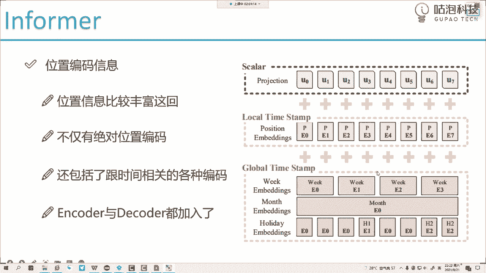
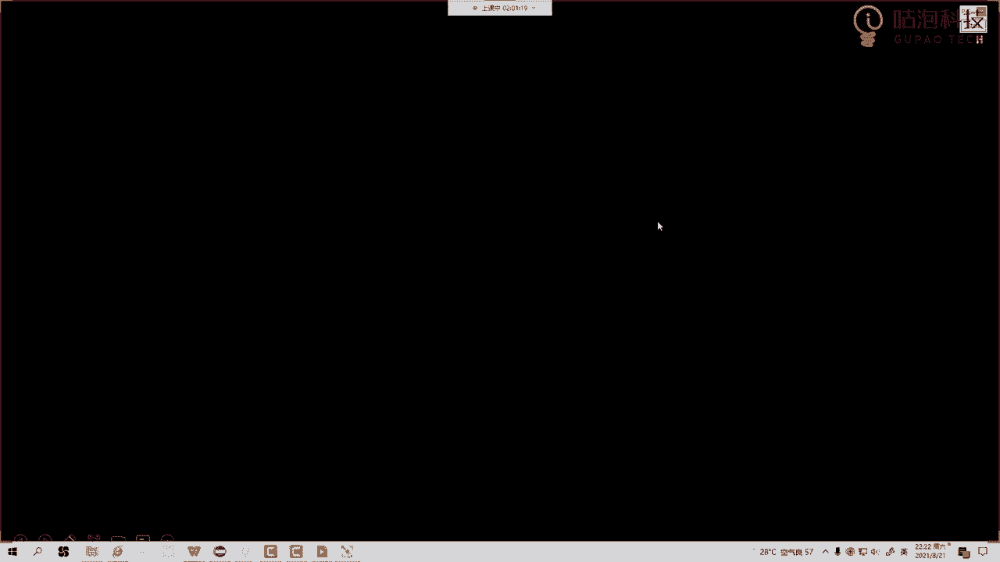
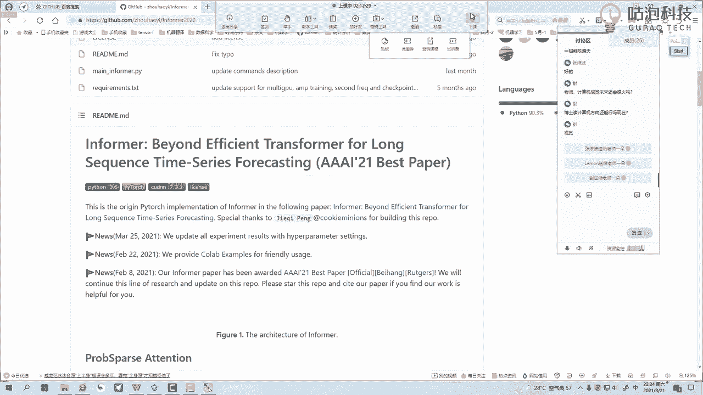

# 一口气带你吃透【Python机器学习与量化交易】保姆级教学，建议收藏！（人工智能、深度学习、神经网络、计算机视觉） - P66：1.时间序列预测(Av645162040,P1) - 码农卡卡西 - BV1un4y1R7j1

行了20多人了啊，然后咱这样先大家概述一下我们今天主题呃，我们今天主题啊是一个新的领域，新的内容，可能之前啊咱们都没讲过，我们之前在那个课程当中啊，其实讲的更多的是那个啊，叫什么叫视觉的一些算法。

是不是，然后呢，我们今天不是三期吗，三期的时候咱们更新了一个挺大的一个系列，就是现在挺火的，叫什么叫那个transformer，这个是我们前一次直播，我记着咱们直播里啊，可能讲了四次课。

我们可能咱们这个三期啊，其中有四次课都是跟那个transformer相关的，我们回忆回忆啊，最开始我们是讲那个叫bird啊，最最原始的transformer，然后呢我们讲那个VIT啊。

就视觉模型怎么去啊，用transformer，然后呢我们讲那个DETR啊，怎么做检测的，然后讲一个swing transformer，是不是我记得咱好像讲了四次课，然后今天呢我们要讲时间序列啊。

虽然说啊咱这个要做的任务是时间序列，但是呢我们这个整体框架啊来做的时候，还是用什么，还是会基于这个transformer的一个啊整体框架，所以说啊今天啊还是需要大家呃。

有一些这个transformer这个基础的，如果说有一些是新来的同学，如果对那个transformer还不太熟悉的，还是建议大家就是先看一下，我们那个录播当中啊，就是我们直播的就是直播课啊。

直播课的一个录屏里边，我们有那个讲了几次transformer，哎咱们可以回回去啊，把那个补起来，然后呢再看我们今天这节课，可能相对来说啊就会更轻松一点啊，然后来先跟大家讨论一个事儿。

就是关于这个时间序列啊，大家都用过哪个哪些算法或者说时间序列啊，在大家的一些项目当中啊，有没有用上过，我估计应该是有的，因为这个其实是挺常见的一个领域，挺常见的一个领域啊，在咱们这个整个AI当中。

可能呢是偏数据挖掘一些啊，我觉着更多的是做一些数据挖掘任务，你看我这块不列一些图吗，一会我跟大家简单的来去做一做ARRA模型，是不是嗯那都是做的比较早的了，这个都是做的比较早，做的比较早的算法了。

我这个模型一直比较经典，因为他那个精度还是不错的行了，我看人也差不多了，咱们就直奔主题吧，来说一说啊，咱们这个实验学该怎么玩，一会儿呢我给大家说一说啊，估计今天可能没时间给大家讲这个代码啊。

然后咱们这样按照我们以往的一个经验，就是啊直播时候咱们讲这个算法知识点，然后我抽空把那个源码给大家录一遍，源码来说啊，嗯不难啊，远远来说不难，但是有有几个地方挺绕的哈，有几个地方挺绕的。

到时候我会大家咱们来去啊，好好唠一唠人家怎么做的，行了来啊，终于上到三审了，行咱开始吧，好这节课咱们来说一说啊，关于时间序列预测，我们该怎么去做，首先啊大家可以看到我们这边起个名字。

也叫informer，大家可能会想哎呦，这个informer，它跟我们实验序序列预测有什么关系吗，其实这样啊，我们今天给大家的一个选材，咱们是讲这么一篇论文，它是AI当中啊一个best paper。

就是一个最佳论文，所以说啊我们今天给大家讲的算法啊，它的一个指导意义和学习意义，以及后续让大家做实际项目的时候，做应用都是非常有参考价值的，因为毕竟AI当中啊给了他一个best paper。

最佳论文的一个奖，肯定说啊人家的论文，人家的方法有学习，有工程实验的一个价值，那好了，再讲咱们这个实际算法啊，就在说我们这个informer之前，我们来想一想啊，就是时间序列大家哪些个场景。

哪些个应用领域当中我们见到过呀，首先我们先看第一个第一个是什么股票，这个领域是不是关于这个股票预测，大家可能会第一个感觉这样，老师啊，你说咱们时间序列预测股票，我怎么感觉不太靠谱呢。

因为我每次训练好的模型，但凡是跟股票相关的，最终呢预测出来结果都是不太准的，我觉得这个事是正常的啊，就是你要能预测准，那就神了啊，肯定是有问题的，为大家解释解释，为什么会有这样一个问题啊。

咱先回到这个机器学习本质，我们说机器学习啊，它是这样一件事，本身啊我们的数据啊是服从一些分布，服从一些规律的，但是呢我说接下来啊，我们希望咱们这个模型来学一学，咱们数据当中呢。

啊我希望啊咱们这个模型来学一学，咱们这个数据当中啊，它的一个分布长什么样子，哎输入和输出之间的联系是什么，那好了，我们训练好一个模型，但是呢当我们应用模型的时候，大家想一想训练模型的时候啊。

咱们用的是历史的数据，但是呢我们应用模型的时候，可能预测未来预测一个新的数据，这个时候大家想一件事，我历史数据的分布，历史数据的规律一定跟新的数据的分布，新的数据的规律是一样的吗，在股票这个市场。

我们可能说是不一定是不是规则在变，人在变，行情在变，一些突发事件都有可能验证的结果，这些呢是模型所没见过的，所以说啊股票这个市场啊，虽然说我们也是实验序列预测问题，但是大家是不是看到本质了。

在本质当中啊，它的数据非常不稳定，规则始终处于一个变化的缺陷当中，那比如现在咱们国家发布一个双减政策，那这些教育股票新东方这一系列，那是不是全废了呀，那你说这个模型他能想到吗。

他能提前知道我们国家发布战略政策吗，这就很难了是吧，所以说啊股票这个市场，大家可以酌情来去考虑啊，无论哈咱们的实验学习算法有多么牛，我觉得在这个领域都是很难做应用的，因为一旦数据规律改变，数据的分布。

改变我们模型呢再学起来再用起来，这个事就没那么容易了啊，然后右边呢我们有一些接手臂，机器人动作的一个预测，基于机器人哎，我们当前的一个动作要推测一下，接下来他要去做什么，人体呢一个姿态的估计。

人体的一个行为识别，这些是不是说啊咱们之前是啊，我们有课程当中啊，是讲过这个行为识别的，我们说这个行为识别是基于什么去做的，它不是基于我们每一帧图像，而是基于什么。

而是基于我们的一个视频前后帧的一个关系，那这是不是也是一个时间序列啊，基于我们当前连续的一个动作，预测它下一个都要干什么，我看他现在又要挥拳了，要冲我说我打过来了，我预测在下一个下一时刻的动作。

要打到我眼睛上，给我打蒙，他这是不是一个实验序列预测呀，还有什么气温的啊，还有我们的一些调度问题的，还有现在比如说疫情的一个发展啊，比如说咱们说国外吧，国外的一个疫情啊，每天的一个确诊人数是有多少的。

这是不是也是一个训练时间序列问题，好了，这里呢给大家列了一些啊，都是时间序列相关的，然后呢我再跟大家说一说啊，就是我这边呃在实际项目当中啊，做过的一些跟实验序列相关的。

因为我啊这个给企业啊做这个培训比较多，我就给大家说一说啊，我跟企业合作这些课题，我挑选重点来说啊，第一个什么第一个比如这样，就是说我们再去生产加工一些零件的过程当中，哎我们想去预测一下。

那比如说我们这个流水线啊，距离流水线当前每一时刻，它的一个它那个原材料的一个消耗，预测呢，它下一事件原材料的一个消耗，这不也是先序列问题吗，啊基于现在得有个数据，一个时刻表，每时每刻我们原材料的变化。

预测下一时刻原材料我们需要多少，来这实验取区预测，是不是商家当中呢，比如说像这个淘宝或者是哈某某多多，他是不是说也要可以预测一下它的一个流量，然后好来给我们进行补货呀，这些啊其实在他们后台啊。

一些那个卖家的看板当中，人家的很多软件都已集成好了，有时间序列预测，基于你当前诶你的一些指标，你的走势预测，接下来呢你的每一天流量大概是有多少，让你提前有个准备是吧，好了这下我们都可以叫做时间序列问题。

那行了，给大家解释解释诶，我们时间序列啊都能去做什么，然后接下来呢我们来看啊，哎你说我们现在时间序列预测的算法，有有有多少种呢，其实非常多，这个领域其实我们的算法是非常庞大的，咱们来看一看这个领域。

算法当中可能遇到的一些小的问题，来我们看前两个图啊，先看第一个图吧，我们说这是第一个图，第一个图他说这样，他说我们做实验序列啊，我想预测准，那我可能预测的未来是一个短时的一个趋势，什么叫短时的趋势呢。

我给大家举个例子，比如说啊我说今天今天啊，我基于咱们历史啊0~30天的一个数据啊，不不能说这个天啊，就比如说现在啊，我说基于还是天吧，我是基于咱们0~20天这个数据啊，0~20天的一个数据。

比如说每天这个气温预测呢，接下来十天啊，接下来十天这个气温，大家注意一下，我们现在这个时间序列预测啊，并不是说我现在拿这个0~20天的历史数据，我只预测这个21天，不是的，我要得到的并并不是一个输出的。

只是下一个时刻点的，我要得到什么，下一个时刻的一个序列的包括什么，比如现在我说我得到了啊，就是前20天的一个啊气温的一个情况，接下来呢我要预测21天，22天，23一直点点啊，23一直连着点，我说到30。

预测接下来一个序列，这个序列当中每一天的温度是多少，这个是我们现在要考虑的一个问题，它并不是只是预测下一个时刻点，而是要预测我们接下来一段的一个序列，要做这样一个事儿，那传统算法当中啊。

或者说大家你们可能之前用过的一些算法啊，或者是我们参考过的论文，可能有些小小问题，什么问题，很多算法都是基于短序列去测的，什么叫短序列哎，我现在知道前20天的情况，我预测第21天，22天哦。

我甚至预测23，预测未来三个时间点的这件事好做，但是我说换一换，你别预测未来三个时间点了，你预测未来30个时间点的这件事还容易吗，这件事就不容易了啊，所以说啊传统算法当中啊，做的很多都是基于什么哎。

基于我们前一时刻的序列，预测到未来的短时的一个情况啊，这是第一个图，我们说预测的都是未来短时的情况，在短时情况当中他可能预测很准，但是一旦你想预测一个长序列，像我说的未来十天。

未来30天甚至未来100天的时候，这件事就不太好做了，而且很多问题当中啊，大家想一想我们很多问题它是否长序列问题，当我们说哎我们要去呃做这个时间序列吧，比如说这个原始论文，他说这样一件事。

他说他们可能预测那个这就是电力行业，我也不太不太不太清楚啊，大概这样一件事，比如说就举个例子吧，比如说变压器的一个用电量，它会基于啊用户，比如说未来的啊，未来半年吧啊用户的一个用电的一个变化情况。

我们要调节这个变压器的电压，那大家想一想，你看他的需求是什么，我首先也知道用户未来半年的一个情况，我好知道哎，就是知道用户半年之后情况我好基于用户啊，哎这半年是大大概的一个情况。

我好提前去修改我们变压器这个电压，那是不是说我们得基于未来的一个，精准的长序列，现在呢我才能做一些干预，才能结合我业务去做一些任务吧，所以说现在啊很多任务当中啊，都是基于这个长序去预测的，预测未来半年。

预测未来一年，这都不是一个短的时间点，而是非常长的一个序列是吧，但是呢在这个比较长的一个序列当中啊，大家想象一下，我们说这件事就很难预测的很准，大家可能说为什么预测不准呢，我给大家举个例子。

比如说现在现在咱们按那种传统一些，实验窗口的方法啊，我说咱们现在有几天数据吧，就五天啊，12345嗯，就比如说咱每天的一个气温啊，我说基于每天啊咱们天气的一个湿度，然后它的一个呃封锁。

然后它的一个降水量，降雨量等等，然后呢，我说接下来哎基于这些指标去预测每天的温度，那比如现在我有这五天的一个数据，以及5000预测的结果，接下来呢我说要预测第六天，当咱们想做第六天的时候，大家说哎。

是不是说我基于啊，咱们这个前五天的去预测这个第六天的呀，那接下来我想问问大家，第七天怎么办，第七天怎么去做的，第七天他是不是说哎，第七天你说它只跟前五天有关系吗，只跟我们实际有的数据有关系吗。

我们现在实际有数据只有12345，只有这么五天的数据，我说咱们要预测第六天啊，这没问题，但是你要想继续预测第七天呢，你还拿这个12345去测第七天吗，那比如说还有第八第九第十，第11。

你还拿12345去预测吗，可能来说不是了，为什么，因为比如说跟这个七相关，谁跟七可能关系最大，并不是12345，而是这个六是不是那八呢，可能是679呢，可能是七八十呢，可能是八九是不是。

所以说我们说这样啊，就是每一个时刻它的一个结果，肯定跟他上一时刻是最最相关的，跟他越往前的可能就没那么相关了，那此时大家想象一下，我要预测6789十甚至以后更长的一个序列。

我不能说预测每一个时间点都拿原来的，这只有这么五天的吧，那大家可能会问老师，那预测第七天该咋办，我们说预测第七天它也这样，我现在啊拿到手诶，这样一个窗口，咱刚才不是把第六天的预测出来了吗。

你把第六天预测出来之后，我说第六天的，那就当做是已知条件呗，我拿23456预测七可以吧，接下来呢哎我说拿34567预测八，拿45678预测九哎呀，大家可能说哎这件事好像停，咱可以这么去做。

但是有一个问题大家想一想，当我们把这个678当做已知条件的时候，咱们来想一个问题，它是一个真实值吗，678是一个真实值吗，它不是，它是我们预测的值，要在我们预测值的基础上，再去预测下一刻时间的一个值。

这件事大家想象一下，本来我们就不拿一个真实的实际的，完完全全正确的一个数值去做下一个值，现在拿都都是我们猜的东西，再去猜下一个，所以大家可想而知，如果这个序列越长，比如再往下长。

再长到这个十二十三的时候，假设说我现在要预要预测这个13，我预测这个13的时候，我可能拿八九十十一十二了，我们现在拿这五个数据，有一个是真实的吗，没有一个是真实的，全都是我预测出来的。

拿我的预测值再去预测我下一个时刻的预测值，所以说大家可以可能发现一件事，长时间的一个序列，我们想预测这个是不是来说就有一些难度了，因为我们还要考虑我们预测的结果，再用预测结果去预测下一时刻的值。

这件事就变得非常非常难了，所以说我们可以总结一下，现在呢很多传统算法当中啊，都不敢去做这个长序列的一个预测，因为刚刚给大家说了，你的序列越长，这件事肯定是越难的，但是很多实际任务，实际业务当中。

还真就是需要我们预测一个较长的一个范围，较大的一个序列，所以说啊今天要给大家说的哎，我们这个informer我们的背景是什么，我不给大家去读这个论文了，直接按照我的理解通俗给大家去说，这篇论文的背景。

就是说人家研究那个电力方面设备，电力设备啊，他说哎我们就有短序列，没法做一个调控，我必须得事先知道用户呢可能未来半年，未来一年的一个情况，我才好事先做这个调控，所以说啊论文的研究背景是什么。

我们的一个长序列预测问题啊，要解决这样一件事儿，所以以后啊大家想一想，如果我们有一些长序列预测问题的时候，可以怎么办，来我们就可以来套，咱今天给大家讲的这个模板了啊，这是咱们可以套用的一个方法。

然后右边这个图啊，就是我们常序列预测预测未来较长的一个序列，而且我们希望要把它预测准啊，这个是咱们的一个出发点，然后呢当我们再去呃说这个算法的时候啊，其实大家想一想哎，我们有哪些个经典的方法。

也可以做时间序列预测呢，这里给大家说两个，这两个绝对是大家用的最多最多的方法了，第一个是FACEBOOK的一个工具包，这个工具包大家可能都听过啊，挺经典的一个包，是不是最主要原因是什么。

我估计大家用它是因为它是比较方便的啊，很轻松就是掉包嘛，我估计大家最喜欢干的一件事就是哎，你别要写代码啊，我甚至我一行代码都不想写，不能说一行吧，我不想写超过100行代码，我就想解决一个实际的任务。

好这个FACEBOOK的工具包能帮助你解决这样一件事儿，然后简单跟大家说一说啊，这个FACEBOOK这个包啊，它是主要预测这个趋势的，我先给大家说应用场景以后，大家有任何时候可以酌情来考虑。

我们要套用的是啊哪些个方法，当前这个包啊，它适合预测的这些趋势，什么叫做一个趋势，哎我举个例子，比如现在啊咱们说我们这个股票嗯，就咱们这个今天这个股票跌宕起伏的啊，就这种感觉呜呜跌宕跌宕起伏的哈。

然后呢咱们用这个FACEBOOK这个包啊，他可能预测出来什么，它可能预测结果是这样的啊，就是哎这块预测出涨了，这块预测出来跌，哎这块又预测涨，这又跌又涨又跌，又涨又跌又涨又跌。

哎它能把这个趋势给你预测的很好，就是呢一些突变点的一个信息，一些变化的信息，他能给你掌握到，这是人家这个算法它的一个本质设计的时候，就让我们这个算法去捕捉各种各样的趋势，各种序列变化的一个趋势。

所以说呢FACEBOOK这个包啊，它是适合做一些趋势的预测啊，就是你趋势变化比较多的时候，可以适合用这个包，但是呢嗯一般我们说它效果啊可能没有那么准，就是你说它某一个点它是要上升还是下降诶。

这块他预测的准，但是每一个点实际值它可能偏差是比较多的啊，然后接下来呢跟他对比的就是这个ARRA模型，这个有VR模型啊，它是这样，他虽然说啊就是他跟那个FACEBOOK那个包正好相反了。

FACEBOOK那个包我们说它是能掌握这个趋势是吧，然后ARRA这个包呢他可能说哎呀我这个趋势啊，嗯做的不是特别好，但是呢可能我每一个点会做的较精确一些啊，每一个点会做的较精确一些。

但是有时候趋势我是预测不对的哈，这就是两个极端了，大家可以酌情来进行考虑，但是今天呢这两个都不是我们的主题，因为他俩都怎么样，他俩都涉及到一个大问题，不适合做长序列，而且呢还不太适合做多标签的一个输出。

大家可能说老师，什么叫做一个多标签的一个输出啊，比如说我说现在有这样一个任务，我们在预测序列的时候，我并不光要预测，比如说刚才咱们说了吗，有这个12345，然后我去预测这个六。

大家可能觉着就是预测下一个时刻点，它这个气温呗，哎我说咱不光做一个预测气温啊，我一口气预测多个，我说既预测咱的一个气温，然后我说又预测它的一个湿度，然后又预测咱们的一个降水量。

然后还有呢还有再预测一个风速，可不可以是都可以的，咱们今天要讲这个informer模型，它不仅是可以做一个长序列，还可以做呢，还可以做一个多标签啊，相当于大家可以自定义任务了啊。

你的任务都可以往这个任务当中去套，但最关键是什么，最关键还是说咱们今天讲这个former，它在常序列的问题当中做的比较好，而且呢效率是比较高的啊，这个是我们今天要重点大家说的哎，我们的一个主题。

然后在咱们正式切入到我们这个主题的，过程当中啊，咱来想以前的时候啊，就是咱得想啊，我们要对传统算法改进什么东西，以前的时候啊，大家想哎我们说做这个时间序列啊，我问问大家嗯，咱们能第一个想到的算法是什么。

或者说大家用过的算法是什么，在我很多课程当中啊，其实我也提过啊，但凡我们要做这个实验序列，我觉得大家肯定能先想到这个算法叫LSTM，是不是，但是这个算法没有什么问题啊，适合做时间序列。

也有很多小伙伴就拿这个，就是它其实是个RN结构啊，然后啊加了一些就是控制单元，有很多小伙伴拿这个LTM做各种各样的预测，但是现在呢有一个问题咱们来看一看啊，我把这个LT模型给大家简单画一画，它概这样的。

这是第一个位置，然后这是第二个位置，然后这是第三个位置，这是第四个位置，然后这是每一时刻的一个输入，这是X1X2X3X4，然后大家也看啊，就是它这一块我们说LITM吧，它最大问题是啥，你看我们说啊。

它得是一个串行的过程，先算X1X1呢会把它中间结果传给X2，X2呢来说既考虑X1中间结果，又考虑X2本身的一个输入，然后接下来创X3X3呢就再去接收再去做，但是必须有个这个顺序。

是不是先把X1的特征提取好，然后把特征传S2，然后再把这个X2特征提取好，传S3，所以啊大家可以发现在我们这个LTM当中啊，它既然是一个串行的，那速度怎么样串行咱们的速度。

你说它跟不跟咱们的序列的长度成正比啊，你的序列长度越大，你需要一次算的时候，需要先把前面都算完才能算最后一个吗，这样效率怎么样呢，肯定会非常非常低，咱们的效率很慢是吧，这是一个问题，还有什么问题呢。

这个模型收敛起来也难，大家想比如这块我说第二点，我说点点点完之后，这块有XN吧，比如这个N等于1000吧，等于1000行不行，然后接下来我们说犯这算这个反向传播啊，这块我们都有很多组这个权重参数的。

我们说这些权重参数咋办，是不是要反向传播逐层做计算啊，然后往然后往它下面传也是也是如此的，当我们在反向传播做计算的时候，如果你这个序列长度越长，你说这个模型训练起来越容易还是越难，那肯定是越难啊。

所以说现在LTM啊，大家看一看，这是论文当中给出来的一个效果，论文里说这样一件事，当我们用LTM的时候啊，就是我们的X轴，就是说你要预测的一个长度，你要预测的一个长度是越长的，你看越长的越长。

预测长度啊，如果说它是一个越大的时候，这块是这样啊，就是十二二十四，不是1224啊，十二二十四，四十八九十六，一百九十二四百八啊，这是我们要预测序列的一个长度，如果你要预测序列长度是越大的。

咱们先来看第一个，第一个就是这个红色线，红色线是什么，红色线就是我们那个红色线，就是我们的一个额计算的一个速度了，计算速度我们的一个效率会怎么样，咱们的效率会越低，你看效率会越低啊。

这表示我们计算的一个效率，然后呢再看我们这个蓝色的，咱们这个蓝色表示什么意思啊，这个蓝色表示我们的一个损失，你的那个序列长度越大，咱们的MICE啊，就是我的预测值和真实值是否是比较接近的啊。

如果越不接近，损失就越大，你看他的损失怎么样，他的损失会越来越大，是不是，所以说在这里啊，我们会大家可以发现这块有个拐点，拐点啥意思呢，就是说这样拐点之后要大幅下降了，所以说接下来拐点一般是啊。

我们可以选择的一些比较合适的值，大家看多少是一个啊，相对来说比较接近于这个48的啊，比较近于这个48的，所以说一般的时候啊，我们说用传统算法，或者用这个LTM在做序列预测的时候，如果你要预测未来较长。

比如说大于20个，大于30的时候，它效果会变得非常非常差哦好了，给大家解释解释啊，咱们这个参考算法当中啊，哎会有这样一些小问题，那咱们今天讲这个informer它是怎么去做的呢，其实这样一件事我们想啊。

就是现在我们要预测时间序列啊，其实跟其他算法，其他模型都是比较类似的，首先我们要干什么，咱们就说建立好我们的输入和输出之间的，一个关系不就完事了吗，建模建模不就是说把输入和我的输出诶，中间架个桥。

把它俩能连到一块，怎么样合适能去捕捉它们之间的一个关系，咱们就怎么去做了，所以说大家看这个名字啊，informer其实呢它是套的什么套的，就是一个transformer的一个架构。

跟我们那个transformer的encoder和decoder，是非常非常类似的啊，只不过说呢在人基础上做了一些优化啊，做了优化让我们效率能够更高一些，所以这里呢大家先有一个基本的认识。

我们这个informer咱的核心思想就是啥，就是transformer，在transformer当中，我们要去啊，再做进一步的优化，大家可能会问老师，为什么transformer呢。

因为我们说啊咱们现在在做计算的时候，transformer它是有一个叫注意力机制，是不是能够更好的关注于我们全局的一个信息，而且呢这个权重项能更好的告诉我，下一个时间点的一个呃预测的结果吧。

应该跟前面哪一步是比较相关的，这些它也能帮我们实验出来，而且呢又是一个并行的架构啊，再有什么，再有就是它是现在最火的一个模型了，所以说啊咱们这篇论文啊，也是套用的是transformer这个架构。

来我们来看一看，稍微给大家回顾回顾啊，就是咱们这个经典的transformer架构，是怎么去做的，首先呢有我们这个输入啊，比如说输入啊，我们就说有咱们这么三个单词吧，H1H2H三。

接下来呢我说算这样一件事，我说接下来我要去重构每一个输入，我要重构每一个输入，重构每一个书的时候，咱们是怎么做的，我是这样，是不是说比如说我要重构第一个词，我重构第一个词的时候，我说我看一看啊。

第一个词自己跟自己的关系，自己跟其他词的一个关系，我是不是都要算一下，那假设说呢我说咱们这块通过内机啊，如果大家忘了或者是之前没有听过，哎咱们这个QKV还有transform是什么的。

先看一看我们基础内容，基础内容当中有有讲这个transformer的啊，那这一块当我们得到得分值之后，我们说哎做一个salt max给它映射成一个概率，应用概率完之后呢，比如说0。96，是不是说我0。

9倍，0。96倍的H1，加上呢0。02倍的H2，再加上呢0。02倍的H3，就等于我最终重构的一个向量了啊，这个就是transformer当中啊，我们基本的一个组成。

就是咱们俗称QKV可以干什么来可以构建啊，我们最终每一个特征该怎么样做重构好，这里给大家演示的是我们每一个特征，咱们实际啊在重构的时候怎么去做的，稍微的回顾回顾啊。

咱们transformer是要干什么的，然后其实现在呢只是我们的一个encoder，等一会儿呢我会给大家讲一讲，就是啊在咱们这informer当中啊，它要输出的时候，它不仅仅是这个encoder。

encoder只是帮我们去组合这个特征，它输出的时候呢，更重要的还要去参考那个decoder这个架构啊，来说说优势，在我们这个实验序列当中啊，它优势是这样，那其实我觉得最大优势是什么。

咱就先抛开其他的不说啊，最大优势就是说它比较万能，你啥模型啥算法，咱说都能往这个transform法当中去套，而且代码现在越越来越简单了，在那个就是如果大家自己懒写代码，在那个PY套当中啊。

直接直接有mute hate attention，这个模块，现在人也内置进去了，你甚至都可以直接套用，我估计呢以后啊transform就是那个PYTORCH，它在更新的时候可能会加入一些更简单的模块。

真正的实现咱就一行代码调用了啊，而且呢并行的啊，加上这个数据机制哎，是不是挺好啊，但是我们先要来说一说问题，因为咱们要讲这篇论文啊，它更多的是解决了一下transformer当中呢。

所涉及到的有一些小问题，来我们来想一想，第一个问题是什么，如果咱们这个时间序列太长，比如说比如说我们的输入序列，我说我基于啊，咱们的输入序列是一个96的啊，这是我输入序列96，预测它未来48个啊。

说预测未来48个，大家想象一下，如果你的输入序列比较大，我为什么说咱们输入序列一般会比较大呢，因为我们希望多提供一些信息，所以说输入序列相对来说比较大，当咱们输入序列比较大的时候，是不是这样一件事。

对于序列当中每一个点，每一个点如果有N个点，每一个点都要计算它跟其他点的一个关系，那这个复杂度它是不是一个N方的呀，相对来说哎呦跟我们的序列长度成正比，那很多时候我们序列长度很大。

这就导致我们计算效率是比较低啊，这是第一个事，第二事呢可能大家抵扣的有点忘了啊，一会我给大家再强调一遍，什么叫decoder，在我们decoder当中啊，就是大家想一想。

传统的transformer怎么什么输出的传统方式，传的方法，这样就encoder，这encoder我就不画了啊，抵扣当中给大家画一画，DE扣当中，比如说我要输出的是未来48个啊，说要输出未来48个啊。

48个点，预测结果正常，咱是不是说哎先输出第一个，我写T1吧，正常先输入第一个结果，然后第一个结果得等一个值，然后呢我说再把第一个结果传给第二个，然后第二个呢再输出第二次的结果。

然后再把第二个结果传给第三个，然后第三个传第四个，第四个一往传，也就是说实际啊咱们在decoder输出的过程当中，我们并不是一次输出这48个，而是先输出第一个，然后看一看第一个是什么，再输入第二个。

再看看第二什么，再输入，第三个，再看看第三个什么输入第四个，这就导致一个问题，因为我们现在做的是一个长序列的输出，你长序列的一个输出，每一个都要去等，那这个东西它肯定不是一个实时的了。

那做起来相对来说就比较慢是吧，所以说啊在这篇论文当中啊，人家还对那个decoder架构稍微做了一个更改，我们说比如说这样啊，就是现在我想咱们预测未来的啊，就基于现在数据预测未来48个点。

这48个点它是同时生成的，一口气直接生成出来了，大家可能说哎你每一个点不需要看一看，比如你第二点不需要知道第一个点信息吗，需要知道的，但是呢我们可以在transpose当中直接去实现。

直接通过注意力机制方法就能把它实现出来，并不用像传统的transformer一样啊，第一个基于第二个，第二局，第三个这样做效率太低了啊，而且大家想一想，我们在之前啊，就是我有咱们有一门。

那个专门讲transformer的课，在那个穿越风水当中提到一个叫DTR的，DETR呢是当时我们做那个目标检测的时候，做目标检测，我们是不是说人家那个DETR里边的一个，就是解码槽。

人家decoder也是一口气输出，所有物体所在的一个位置，所以说今天啊咱们讲这个informer，我觉得跟那个DTR其实挺像的，都是一口气输出所有的结果啊，而且不用去再一个去等了，这是它的一个优势吧。

啊就是效率是比较高的，把抵扣这块有跟大家说啊，抵扣这块人家要改一改，直接一口气要能输出我们所有的预测值好了，右边呢是我截了一下，就是这个论文当中的图，但是大家可能现在去看啊，这个图有点难度。

一会儿呢咱这样一会儿呢我们先说啊，就是咱们整体架构当中啊，会涉及到的几个小细节，咱先把这些细节知识点捋明白了，然后呢咱再把它合成到一块，这件事就好解决了啊，整个论文当中啊。

其实它就是围绕三个点来进行分析的，我给大家说一说啊，哪三个点，第一个点是什么，第一个点就是说现在啊我们做这个self attention，效率太低了，为什么效率低呢，如果序列长度为N那我们要计算N方。

因为是我们K就是Q1K1Q1K2，Q1KNQ2K一，Q 2k2 q 2k n，是不是每一个Q都需要跟所有的N做计算，那这样必然是个N方的复杂度，那attention的计算效率相对太低了，论文当中啊。

提出来一种新的attention的计算方式呃，但是虽然说是新的啊，但是嗯就是换汤不换药吧，它的一个本质是不变的啊，只不过说加上一些小窍门啊，加上小窍门，一会我给大家解释啊，人家窍门怎么去做的。

第二个呢就是说哎我们这个decoder，decoder像我说的，它并不是啊，一个一个输出了，要一次输出所有结果，这是第二个问题，咱刚刚说完第三个问题，第三个问题是这样，就是大家想一想。

我们传统的transformer当中啊，咱们做encoder是不是有好多层，哎，我做了一层self attention哦，说再做一遍cf attension，再做一遍self of tension。

每一次做的时候，咱们的一个输入和输出的大小是不是完全相，同的，输入和输出规格完全一模一样的呀，就把一件事儿重复做了N次，就是每次输入输出不一样，但是它们呢，它们的形状和格式完全都都是一样的啊。

就是数值不同，但这回就有点问题，你说啊现在我们这个长序列啊，咱们做一遍self attention都挺费劲的，你还要做多次，那是不是说每一次效率都挺低的呀，论文当中啊。

哎他说能不能把这个效率低的事解决呢，哎其实可以的，大家看到他这个画图的一个样子啊，你可以当这是第一层，这是第二层，明显这个第二层它的一个体积要比第一层，它这个体积怎么样要小一圈是吧。

所以说啊就是在我们设计encoder，在我们设计编码器的时候，咱得想一想怎么样能让我们这个呃输入来说哎，每一层咱能省点参数，每一层我们计算效率要更高一些啊，这是要解决的三个问题，所以说啊就是通篇论文啊。

只需要大家了解这三个点，一会我给大家具体说啊，这三点做什么，只要大家了解这三个点了，后面的任务相对来说啊就是会比较容易了，然后呢我们先看一下现象，这个现象是论文作者啊，在大量实验当中啊。

嗯都发现一个事儿，他作为实验主要是基于这个时间序列的啊，来我们看一看他是他是这么说的，就是呃先看这个呃左边这个图吧，左边这个图是这样，你看这儿有个Q，有个key，是不是就大概这么想。

就是现在咱们的输入区的长度是48，我们的序列长度48，就这样，咱们现在这里边有48个呃，patch或者48个token点点点，我说这一共是48个，然后呢每一个是不是它这里有Q1K1，这有Q2，只有K2。

然后只有Q3，只有K3，是不是每一个patch，每一个token，它都会有自己对应的一个Q和一个key，然后大家看这个图，这个图当中啊，你看key48个，这个Q也是48个。

这样呢它们形成一个48×48的矩阵，矩阵当中的每一个值啊，他用了一个，就是用那个热度图来表示了热度图啊，就是颜色越偏这个黄色，它是这块属于这块值越大，颜色越偏这个呃黑色表示这个值是越小的，然后问问大家。

只小代表什么，这表示它的内积啊，内积如果越小，给大家举个例子，两个向量，这是一个呃，这是一个Q向量吧，这是一个key向量，如果这两个向量是这样式的时候，它内积为多少，内积为零，在这也就是黑色的。

它俩是没什么关系的，如果呢一个Q他是这样一个key是这样，就我们说俩人好的跟一个人似的，脸贴脸都快贴上去了，此时呢他俩的一个内积很大啊，你看内积很大的时候，我们得到这个QK它的权重值也会比较大。

就是偏这种颜色的，但是我大家来看一看啊，就是在我们整个的一个呃，就整个的这个矩阵当中，我问问大家是黑色的多还是一些黄色的多，黄色呢就代表有注意机制，他们关系特别强啊，关系特别紧密。

黑色呢就是说啊哎这个Q和这个key啊，这俩就比如这俩吧，这它俩之间或者他俩之间如果是黑色的，表示他们之间关系怎么样，他们之间就是说是没有关系啊，这样一件事，那我们来观察观察呢，其实作者发现一件事。

哎他说我们在这个q key啊，形成的一个内接矩阵当中，其实大部分都是黑色的，黑色表示什么，黑色就表示咱们这件事白玩了，我们希望通过这个Q和K连内积好算出来，当前呢我们的输入当中。

每个patch跟其他的一个patch之间，就其他的一个输入区，其他的一个输入点当中的特征唉，我看看他们之间没有联系，我们希望他们都有联系的，并且这个联系呢要非常鲜明，有大有小哎这样才是最好的特征。

哎就区分的比较开，但是现在呢我们来观察一下，由于我们这张图当中啊，给出来都是黑色，黑色是不是说很多呀，比如说这块，我这个拿黑色画，这个Q2和这个Q2和这个K3，也算接近于零了，代表它没什么关系。

Q1K2算完直接近零了，Q1K3算也接近零了，都没什么关系，那你说是不是相当于咱这个QKE，这个内机操作又白玩了，等于理由太阳没关系，没关系，不就代表咱啥信息也没有得到吗，所以说现在论文作者发现一件事。

你看右边他把这个事给总结到一个图当中，这个图呢我们的横坐标横坐标啊，就是啊会有多少，就是会有多少个嗯，就这么说吧，先说纵坐坐标，纵坐标吧，纵坐标就是我们的一个，就是他们的一个关系的得分值。

关系的一个得分值，然后横坐标就有多少个，你看关系得分值比较高的，就这块用用一个颜色高亮出来的，有关系的样本数量多少，极少数不能极少数吧，只占其中一小部分，但是大部分你看这块这么多样本，大部分情况下。

这些个Q和这个key之间的关系怎么样，大部分情况下，这个SIMPLES就是我们的Q和key它们之间的关系啊，大部分他们的关系都接近于零了呀，这是发现了一个规律啊，我们这个Q和K之间啊。

有好多都是没什么关系的，但是有些少部分它们之间还是有关系的，那所以说大家想一想，我们对于这个任务来说呀，是不是说只需要我们找那一小部分就行了，只需要找到有关系有就行了。

因为没关系的那一些他对特征起不了啥作用，全值都为零，零乘员数都接近于零了，没有任何意义，相当于白玩是吧，所以说啊这个作者啊在他在做的时候，发现这样一个发现，发现这样一个呃就是现象之后，他就要想。

既然大部分的这个Q和K之间是没什么关系的，那你说我为了出于咱们计算效率的一个考虑，没关系，那一些咱还有必要要吗，我们还有必要关心他吗，数就不关心了，只关心谁有特点的，有性格的，他们之间关系是比较强烈的。

但是大家先想一个问题，我们该怎么样去计算呢，怎么去计算，比如说当前这个Q和这个key怎么去算一算，哪些Q和key之间哎他的关系强烈，哪些Q和K之间它的关系不强烈，我说我把那些关系很强烈的筛选出来。

这件事该怎么去做呢，接下来啊，这个论文作者在大量篇幅当中都要去强调，我们该怎么样能得到一些好的Q啊，注意接下来我们要重点放哪，重点我们要放这个Q当中，Q里边有些的Q，你就像比如这里，比如这些个Q。

这些个Q我们说什么呀，就是没什么没什么没什么用的，为啥他跟那个key1乘完之后，内积一算接近零，接近零的东西，相当于白玩，是不是，所以接下来我就找什么，找这些个位置所对应的Q，它们是精力旺盛的。

他们呢是真正找到特征的，能找出关系的，所以接下来我们要筛选筛选哪些啥，哪些个Q它是有用的，哪些个Q是没用的啊，这里咱们先拿Q给大家举例子，一会我估计大家马上可能会问，为什么是在Q当中去找呢。

来一会我会给大家举个这个数啊，咱们在Q当中去找有用的，我们要去啊完成一件什么事，然后来看大家一直没问，大家看大家有没有什么问题，线性回归来看大家有没有什么问题，我喝两口水啊，哦LITM。

咱们这有咱们这有杨同给大家解解读啊，我们单词是什么意思，来看大家有没有什么问题，这个informer它是什么，我说给大家，我先给大家看一看啊，我今天把他那个GTAV链接给大家发一下，等我缓2分钟啊。

缓2分钟歇嗓，然后就给大家讲，我把GITHUB链接给大家先发过去，大家可以参考呃，来这是这个informer啊，他是AI啊，一个best paper论文呢嗯论文里边写了很多数学，就是我看了下论文。

论文里写了太多数学了，他是拿这个概率的，就是拿概率的方式给大家解释的，嗯我觉得公式写出来是复杂了，其实这个事儿呢没那么复杂，但是公式啊略显复杂了一些，大家也看一看，而且这是有源码的。

源码到时候我会重给大家去录的啊，原版会重给大家去录的，用起来挺简单的，而且这个这个，而且这个代码我觉得有一点挺好的，我给大家看一看啊，哦我看这块他构建数据那块，这呢，构建数据这块直接给了一个东西啊。

这呢再来看这个他这个什么啊，customer data啥意思，我问大家加上customer是什么意思啊，唉当时看到这个源码的时候，我觉得哎我去，我说这个这个作者真的就是挺够意思的。

给我们写写好什么东西啊，叫做一个就是如果大家自定义啊，就是这就也不能叫客户吧，就是你说你想自定义自定义数据集的时候，想跑你自己任务的时候，我们该参考什么模板去读这个数据啊，参考什么模板去读这个数据。

这个我觉着是人家做的比较好的一点啊，很多就是很多那些算法啊，这些个源码实现都不管你自己数据咋办，就读人家数就完事了，这块呢给你整个customer data啊，相当于自己数据，咱们怎么读，这块有个参考。

你可以参考这个人去写啊，我觉得这个挺好的行，咱们咱们稍微让我缓5分钟啊，歇5分钟五，然后5分钟之后咱们继续，来咱准备回来啊，我们继续嗯，这些先都不看了，咱把这个知点讲完，好刚才咱们说到了。

就是QK当中啊，有一些怎么样，有一些他们全职分数为零的，权值为零的，我们叫什么，我们就是说它没用没用呢，我们就说他是偷懒不干活的，但这里啊大家想你说偷懒不干活的，一般来说是由Q导致的。

还是是由key导致的呀，咱们想一想，我们说transform吧，咱们计算方式这样有我们的一个Q啊，Q1比如说他去问哎跟K1K2K三，K4K5之间K6它们之间的一个关系，然后Q2呢再问一遍跟他们关系。

Q3呢再问一遍他们的关系，也就这里，比如现在啊咱们可以拿其中一个Q，你就哦我拿不同颜色吧，比如拿这个拿红色，这个呢我说他是这种Q，我说这样啊，他是Q几呢，我说他是随便一个Q吧，他就是Q6啊，随便一个Q。

然后接下来我再拿个Q，比如这个Q我看看它是可能是Q26吧，啊就是随便我取了两个Q啊，这个是Q26，咱一共呢不是序列长度为48吗，所以说一共有Q1到Q48，但是现在呢我我是随便观察两个，关于这两个。

他俩其实效果挺极端的，咱们来看大图啊，右边右边当中这个红色的，比如这个Q6Q6，大家可以看一看他们的一个注意力机制，或者他们算出来的一个soft max完之后，我们的一个得分值是怎么样。

哎是一个跌宕起伏的一个感觉，是不是哎什么叫跌宕起伏啊，就你的爱恨情仇表现得非常明显，就大家比如说同公司同事之间，哎我就表表只能表现出来，我贼膈应你，我贼喜欢那个人啊，就是这个Q6哎，他表现出来了。

就是这个爱恨情仇跟谁关系好，你看突出出来了，跟谁关系不好，给它折下去了，是不是明显的一个趋势，但是大家来看呢，这个Q26Q26啊，就跟我似的，我谁也不敢得罪哎，我说咱俩关系也行，哎跟你关系也好。

诶那个咱也差不哪去，哎，咱们都是挺好的一家人，我跟谁也犯不上鸡眼，跟谁也犯不上咋咋地道，这就是这个Q26没有什么特点，没有什么色彩跟谁都一样，哎那大家想一想，他跟谁都一样，是不是比较平稳的一个过程。

你看他是不是比较平稳，没有跟谁特别差的，也没有跟谁特别好好的，谁也惹不起，谁也得罪不起的感觉，那你说对于这两个Q来说呀，咱更喜欢哪一个，问大家就是说要你选哪一个，咱不是说找对象的啊。

就是说咱们现在要找能干活的特征，我们说既然是找特征，我肯定是说要找好的特征，找有关系的特征，谁能找有关系的特征，Q6是不是这个关系它能体现出来，但是你看这个Q26就像是个均匀分布似的。

我这点权重雨露均沾吧，一共有48个，我说好，咱俩权重啊，比如说1÷48，每一个都是1/48，那就完事了，所以说现在呢我发现了在我们的query当中啊，其实是有些有问题的，有很多的query他都在干什么。

他都在去滥鱼充数，因为大家看一看，我们上面呢画这个可视化的结果，是不是个长尾结构，这种长尾分布导致了什么，导致了在我们任务当中啊，有很多个Q都在去充数，那你说充数的这种这种基于几，就近乎于均匀分布的Q。

你说它有意义有价值吗，我觉得毫无价值啊，一点用都没有，他只是说把这个特征重新分配一下啊，没有什么太大意义，那你说怎么办，他说接下来咱们要不然这样，咱们说能不能啊做一个筛选，把这些有用的Q咱找出来哎。

他去算这个注意机制没用，那个没用的这些Q啊，我说咱就不要了，就不用他们了呗，他们算完之后也是个平均分，那平均分这个事儿我再算一遍干啥呀，咱直接平均分不就完事了吗，所以说现在啊大家注意一下。

informer这篇论文当中啊，它是这样一件事，我们在做这个长序列的时候，由于encoder decoder都需要做我们的self attention，都需要做自注意机制。

但是由于我们的输入和输出序列都比较长，若是现在啊，你要把每一个Q跟每一个key再做计算，那咱们效率太低了，所以说呢人家这informer当中啊，要做的第一件事就是采样对谁做，采样对我的Q做采样。

在所有的Q当中，我先找出来哪些个Q是这样积极的，哪些个Q是好的，它是有实际价值的，我说给拿出来，剩下那些个我说跟均匀分布的似的啊，就是跟下面这种均匀分布的感觉，我说我就不用了，你就拉倒吧啊就不用你了。

均匀分布对我来说没什么用，我希望咱把这个爱恨情仇表现的明显一些的好，这是我们要去做一件事嘶，但是怎么做呢怎么做呀，论文当中列了一个贼复杂的公式，它是从概率学上去推导的，但是我觉着没必要说的这么复杂啊。

我只给大家解释解释哈哈，就是人家实际在代码当中吧，实际的一个做法，他说这样，他说我们偷懒的这个Q啊就不太好的，Q就像是均匀分布的均匀分布，我们说在这个概率上，我们很很容易表示啊，就是均匀分布的感觉。

然后呢没啥特点啊，你有我有全都有，然后有一些明显的它是不是差异会比较大呀，那我说接来咱咱算这样一个事吧，我们说啊现在啊这块这个字写错了，计算其余计算其与均匀分布的差异，对于我们现在每个Q我算一算。

比如现在我说这一个Q我跟跟让他跟谁算，让他跟均匀分布去算均匀分布长啥样，来我画一个，我拿蓝色画吧，均匀分布就长这个样子啊，就这这就是一个均匀分布，然后呢，我说现在对每个Q，比如这里有个Q6。

这还有个Q26，我就用这个Q6去算一算，它跟均匀分布的一个差异，明显的看出这个差异挺大，是不是Q26再跟这个均匀分布算一个差异，明显他俩差异就很小是吧，那也就是现在啊我们可以去算一算。

咱们现在这里边有的，每一个Q跟均匀分布的一个差异，咱们刚才说了，为什么要算根均匀分布差异，因为我发现了就是那些比较偷懒的Q，比较没用的Q，它就跟均匀分布长得挺像的，我们通过这个差异来描述一下这个Q啊。

它到底是不是一个积极的，到底有没有起到作用啊，这个就是我们现在咱们的第一个定义的方法，去计算每一个Q它跟均匀分布的一个差异啊，大家注意一下啊，为什么我们要选均匀分布。

因为这个是通过实验大家发现的一个结论，很多的Q啊，因为这个长尾分布嘛导致了很多的Q啊，都是类似均匀分布的，那正好我说那我就给你算算呗，给你这些均匀分布，咱好好算一算咱的关系是什么样。

如果说我们的一个关系啊是比较大的，我就说咱们的Q是比较积极的，如果关系如果如果咱差异是比较小，我就说这个Q也没什么也没什么有用，也没什么用啊，这样一件事好啦，咱们来看啊，就是它起先起个名字啊。

就是PROPERATION，他这方法呢其实我给大家解释解释啊，就在源码当中怎么去做的呃，就是论文当中啊，这个公式说的极其复杂，但是呢代码当中做的确实有极其简单，所以呢再给大家提个醒，就有些时候啊。

大家看看那个论文，你说这个公式我就感觉我都我都快，我都快上天了，我都感觉我像学天文似的，但是很多时候在代码当中实现，确实非常非常简单的哈，就是就是这样啊，我这给大家说啊。

咱们这给大家说代码当中是怎么实现的，咱们来举个实际的例子来看一看，这个例子就是原版当中人家怎么做的，我觉得是挺容易的一件事啊，但是有点绕啊，大家得跟着我这个思路，首先呢我们说这样啊，咱们的输入序列啊。

长度是96，就是我输入当中啊有X1X2X三，一直呢到X96，输入呢是96的，然后为了说呀就正常，咱们是96个啊，96个patch，然后他的key跟跟那个key啊都得分别做计算，所以说复杂度呢是96平方。

但是现在呢我们说怎么去提高这个效率啊，哎我说先做第一件事啊，咱们先在key当中做采样，大家说老师你是不是说错了，我们刚才不是说有些Q它是不太好的吗，你应该先在Q当中做采样，找出来Q当中好的。

你怎么在key当中做采样呢，来来来来，咱们先捋一捋啊，是这样一件事，我们说现在啊你看这个分布我们画出来了，比如说Q6这个分布这块，大家注意听啊，这块可能会稍微有点绕，还有这个Q26。

咱们理解理解原二当时怎么去做的，你看这个Q6和这个Q26，我们这个分布怎么画出来的，是不是咱们这个任务当中它是48个，是不是这块啊，我说这是跟第一个的，然后这是跟第二个的，这是跟第三个的。

这是跟第四个的，第二点我说哎这是跟第48个的，我要把当前这个Q跟每一个key的结果都算出来，哎我说它这个分布才能画出来，是不是，那下面呢也是如此，哎他还得跟第一个的，跟第二个的，跟第三个第二点诶。

一直要跟这个第48个的每一个，我说我都需要算出来，咱才能知道哎它的分布长什么样子，但是现在大家想一想哎，你说我有必要把这48个都算一算吗，我说这些个比较好的Q，他可能跟大部分key效果来说都还不错呢。

都能体现出的差异，我没必要都算一遍吧，尤其是下面那些比较懒的，或者说不干活的Q不看回Q，你说我用跟48个都算一遍吗，我跟其中20个算一遍，我就大概知道他啥样了，你评价这个人的时候。

你看他身边的朋友长什么样子，一般我们这么说嘛，叫物以类聚，人以群分嘛，你来看他身边朋友的时候，你用把他身边所有朋友都看一遍吗，我说我挑一些吧，我挑的身边朋友当中二选出20个，而且是随机选20个。

是不是就可以了，所以这里啊我们要干什么，比如说在这个就是那个那个论文公式啊，写的贼复杂，其实他就是做了一个采样，在这个key当中，我们现在有48个，我说这回咱不用48个，我第一步先做一个随机采样。

注意是随机采样，在48个里边，我说我选其中20个行不行，选20个做代表可以吧，然后接下来呢我说这咱们这个Q啊，跟随机这20个去算一算，哎他们的一个结果看它分布长什么样子，那就大概也就相当于跟这48个了。

差异应该也不会太大，这么说没问题吧，来所以说啊在我们这个原耳当中啊，咱第一步是这样，就是说首先呢在key当中啊，不仅它是采样，而且是个随机的原版当中啊，它是一个随机的采样，比如说现在啊。

正常我应该是96个key和那个呃，九就是96个Q和96个key，分别去做做做计算，但是现在呢我先在这个key当中啊做一个采样，因为我刚才说了啊，你看一个人怎么样，你不用看他跟他所有朋友的关系。

看他呢跟他就是随机找，跟他20个朋友就行了，卷法当中，比如这块啊96，它对应是25，就是说96K当中啊，哎我说随机啊，选出来25个就完事了啊，随机选25个好，接下来呢接下来我们该进入正题了。

我们该选Q这个Q怎么选呢，他说Q这样吧，咱们现在呢每一个Q都要跟谁，都要跟这25个key做计算啊，大家注意，我们现在有96个Q，每一个Q都要跟这25个key做计算，来大家看一看啊。

正常情况下我们现在是每个Q跟每个key做计算，是不是，但是现在呢咱不带啊，我说每个Q跟这25个啊，只跟在其中25个做计算，因为现在我要算的并不是实际的一个内积，我要在这个Q当中去筛选一下。

哪些Q它是比较活跃的，哪些Q是就是跟均匀分布式的好，所以说源码当中输出结果长这个样子，再来看一看第一个32表示个batch啊，咱这个这个这个咱就不说了。

然后接下来说这个八八呢表示这个muted head，表示我们是一个八头啊，八头注意力机制，这个如果大家哎呀问老师啥叫一个八头啊，来看看咱们之前讲那个传统transformer的时候，想给大家说了啊。

什么叫music head，多头注意机制，就相当于呢咱们现在啊在做这个注意力的时候，我们选了八种方法，八种不同方法得到了八重输出的一个结果啊，这叫多头注意力机制，然后接下来96表示什么。

我们96个key啊，96个Q，96个Q我要在96个Q当做筛选，但是呢现在key有多少个，我们刚才不是说了吗，哎我没必要把所有key都放在计算，随机选25个，这里是随机选了25个，所以说当前啊在原版当中。

我们得到结果是八九十六，25表示96Q，分别呢跟20个key来算内积，接下来算内机之后呢，我是说算完内积之后啊，接下来咱要对比它们之间的一个差异了，嘶哎呀，但是现在啊大家想我每一个Q。

你看比如现在我们算96个Q啊，大家一定要捋捋明白啊，我们现有96个Q，这里边有这个Q1Q2，一直点点点到这个Q96，是不是，然后每一个Q都有啥，我们刚才是不是说了，每一个Q跟几个key做计算了。

每一个Q比如拿它举例子，这个Q1它是不是有这个Q1K1的一个结果，还有比如说这个Q1K2这个结果，然后第二点咱们不是说选25个吗，那我就比如说吧他这个Q1到这个K25，这个结果是不是都有了。

然后接下来呢Q2我拿不同颜色吧，比如说这个黑色Q2，它是不是也有这个结果，Q2有啥了，我就写这两个得了，它是有这个Q2K1，还有呢这个Q2K2还有点点点，一直到我们这个Q2K25，它有这些结果是吧。

这是我们现在有的，咱们现在有的一个结果只有算完的，但是现在啊哎我说这里边咱们要算这个差异，跟谁差异跟均匀分布的一个差异，均匀分布内我好算，比如说序列长度数为48，均匀分布呢。

就是说咱每一个位置全值都是一比二四十八啊，这就完事了，这是均匀分布，咱很简单就能算出来，但是现在啊咱们这个差异该怎么算，大家说哎我们现在算这个Q1啊，跟均匀分布差异，Q2跟均匀分布差异。

一招QN跟均匀分布的差异，但是大家来看一看我们这个Q1当中啊，它是啥，他现在是25个结果，是不是25个数，我问问大家，这是个内积，得到了一个具体的数值，这也是个数值，这也是个数值，咱们现在这个Q啊。

它不是一个数啊，它是一组数，是不是，它里边包括了它跟25个key的一个结果，那你说我该怎么选啊，我现在有25个结果，我算什么，我25就我算一个平均吗，他没有来这里，我跟大家说啊，论文当中选了一个方法。

这块就是它这个max好，只给大家解释吧，它有这样一件事，这个就是我们算内积之后的一个结果值，先给大家列出来了，一共25个结果值嘛，在这20个结果值当中直接选最大的一个，直接选择最大的那一个，啥意思。

比如说这样是我结果值啊，大概的分布是这样的，大概分布可能是诶长这个样子的，他直接选谁最大的那一个均匀分布，这个是不变的，均匀分布它始终长这个样子，用最大这一个减去，比如说我们1/48是不是就可以了。

好了，这就给大家解释了一下啊，咱们现在这一块多做了一个max，多做了一个max的意思啊，就是说我们现在啊在每一个Q上，因为现在一个Q它跟25K都有结果，我们选什么，选择它们内基值最最最大的一个。

因为内置值最大的一个表示关系是最明显的，我们选的是一个峰值，为什么选峰值呢，我给大家解释解释啊，它是这样一件事，因为这个论文作者啊，这个这个是我估计大概猜的，论文当时没有详细去解释，我猜是这样的。

就是我们这注意机制啊，它是这种浮动性的一个趋势诶，大家这种浮动性的一个趋势，它不会什么它不会是这样，他不会说就突然立起来一个尖子，然后接下来没了，就在一个位置，哎呦我说我的注意力是特别大，其他位置都没。

其他位置都没有，这种情况基本上不存在的，我一般说这个注意机制啊，大概这样啊，就在这个最大的附近也会比较大一些，大概成这样一个趋势，那成这样趋势的时候呢，我们可怎么办，咱们来说吧，哎既然成这样一个趋势。

我选的最大的一个，看它最大的一个位置跟这个均匀分布，比如这是跟均匀分布，它们之间的一个差异是不可以啦，你看这里最大的一个位置跟均匀分布的差异，那这个差异其实不挺明显的吗，咱们数值上如果量化成咱们指标。

你看这个差异，你看上面用这个红色来画，下面我用这个绿色来画，这个差异是不是直接就能算出来了啊，所以论文当中啊，为了进一步，其实我估计也是没什么太多好的办法了，他就直接选了一个最大的。

相对来说是计算比较简单吧，就像是我们那个max pooling似的哈，直接选择一个最大值来做替代了啊，这块也是挺像的，选最大值跟均匀分布，我们说算它们之间的一个差异，那算完之后呢，大家想啊。

我们现在96个Q，我们现在呢有96个Q，这96个Q当中啊，哎我说给它每一个差异是不是都算出来了，接下来干啥，我说按大小个儿，咱们是不是得排序了，我们不知道找什么，找差异大的，按照我们这个差异的大小。

从大到小做一个排序，做完排序之后呢，接下来我是这样，在96Q当中我们选择出来差异最大的啊，就是这是一共96个，咱大小个先排，拍完之后呢，我只选多少，只选其中前25个啊，只选其中前25个，这个就是啊。

informer当中我们提出来的一个方法叫什么，哎，叫proper tension，他的意思呢就是说当我们再去呃，实际计算我们自注意机制的时候，咱们原来的算法啊，我们的复杂度是N方。

但是现在呢我们要简化一下啊，简化一下两个地方做了简化，第一个选key的时候，因为我们说了啊，一个人怎么样看待身边的朋友，你不用所有朋友都看看他身边一部分朋友型了，这是第一个出发点啊。

做了一个key的采样，但是这个是随机采样啊，第二点呢我们说这个Q啊，当跟key算完之后，哎呀能得到一个分布，但是对于这个分布来说呢，里边有个序列，这个序列值啊，你说我这算差异不太好算。

哎我说我选的最大的一个，因为我们说了嘛，咱们attention啊，大概这种形式哎是逐步上升，逐步下降的一个趋势，所以说我们选最大的一个算呢，它均匀分布的一个差异哎，算了一个差异，算完差异之后呢。

咱根据这个差异的大小，按代表格一排，排完之后呢，我们说选前25个，我们就说这25个Q是啥样的，这20个Q啊，基本来说哎就是长这个红色这个样子的，它是实际有价值的，实际有价值的，咱拿过来去用。

像是剩下这些呢，这些可能大部分都是没有什么用的，没有什么用的，Q怎么办，我就不管它给你撇一边去，哎就是给他臭着它哈，不管它就完事了啊，好了，这块给大家说了一下，就是在咱们这个informer当中。

我们的一个核心的模块，人家的自注意机制它是怎么去做的，来看最终结果，最终结果我们得到什么，得到了一个啊，30就是八啊，这是我们那个多头注意机制，大家注意这个QQ是多少个，Q是25个key呢。

来大家注意啊，最终我们实际做的时候，最终咱实际做的时候，这个key还是采样吗，key不可能再采样了，我这个Q要跟每一个key算这个内积好，去融合每一个key所对应的一个特征，是不是。

所以说最终我们QK内接咱们这个矩阵多大，是八啊，多头八头二选了25，Q只差数key是不变的，第一步给key做采样，只为了简化计算，接下来实际我们在真正算的时候，我们是用什么，实际我们在真正算的时候。

我们是选择了哎其中的啊就选择了全部啊，选择全部嘶，但是大家可能会问一个问题啊，老师啊，有有一个事好像有点问题了，你说现在啊，比如咱们现在一开始输出序列96个，我来画啊，多画几个，比如这是再画几个。

再画几个，哎点儿点儿，我说咱输入序列一共有这么96个，比如这是123，然后这个456，然后这是一个96，咱输入序列一共96个，但是现在呢现在我们这个任务当中啊，哎你刚才不是说你要把其中的25个给他们。

算他们的那个就是啊自助机制嘛，比如说25个选到这个了，选到2号了，选到5号了，唉选到96号了，他们几个都是把你看选的，比如选的这个二二会怎么办，二会算诶，跟每一个key之间的关系。

然后把这个二这个特征是不做重构，是不是把这个二这个特征做重构了，然后五和96是不是也是做做重构了，但是有个问题啊，你说没选到位呢，我们还有一大半没选到呢，这一咋办啊，一他这个Q咱直接干掉了。

我说的没有这个Q啊，它这个向量就就就把它当臭狗屎样臭着吗，就不管它了，这个三也不管啦，这个四也不管了，这个六他也不管了，哎你说不管合适吗，它就往这一动，它就往这一摆，相当于这一步。

self f tension做完之后，它连变都没变，只有其中25个变了，是不是正常，咱们来看我们现在得到这个QK的内接完之后，是不是只有25个位置，它能更新它的一个呃，就是实际的一个特征值。

剩下的位置它都不会，它都没有变是吧，那你说这件事合适吗，不合适，来给大家看一看人家源码当时怎么去做的，人家源码是这样的，对于这个一，比如说现在啊，这个一他如果带个Q不是那个不太好的吗。

我说这个一啊他也要重构一等于啥呢，一比如说咱们序列行96啊，它就是196乘V1，加上196乘V2，加上一直点点点，1/96，乘上一个V96，大家一想，哎老师你这他这不就是一个平均向量吗。

哎这论文源码当中，人家为啥要用平均向量当做，刚才没更新的这些啊，为啥要平均响亮，咱也想一想源码这么做，它的目的是什么，为什么说这些个绿色的哎，现在这些Q它说它不好，这些用平均向量来表示啊。

来我们看一看刚才我们在做的时候，说这些不好的Q有什么特点，这些不好的Q我是这样的啊，它是一种跟均匀分布差不多的均匀分布，那不就是每一个位置全职一样吗，那现在我们对于这些不好的Q。

咱们类似用均匀分布去做呗，既然它跟均匀分布挺像的，我们就把均匀分布的全职直接给它乘上来，可不可以，当然是可以的，所以说它是这样啊，就是说对于那些不好的Q，既然啊它你算完attention。

它也跟均匀分布差不多，那现在既然我没算，我就直接拿均匀分布，拿一个平均向量，你们就都是平均向量就完事了啊，这就是人家做的比较绝的一点，为了省计算量啊，直接把这些没算怎么办，用平均向量来做替代了啊。

所以说说白了就是说选择出来了，我们有25个哎，这25个是实际啊，实际更新的它特征更新了，剩下的咋办，剩下的大家都一样啊，因为大家都觉得剩下的也不太重要，剩下的就都是我们的一个平均向量，这就完事了啊。

好了，先给大家说了一下，就是在我们这个informal当中啊，咱们最核心的一个模块，我们的自注意机制，咱们的tension全职是怎么去算的啊，虽然源码虽然论文当中说的极其复杂，但是呢我看了这个源码之后。

我觉得这个东西又极其简单啊，没有什么太大难点啊，然后呢，接下来我们来说他还说了这样一个东西啊，DETAILLING这个detailing什么意思啊，我为大家解释解释啊，我直接按照我的。

我这个我直接不按照论文思想了，直接我给大家解释吧，它是这样一件事嗯，就是大家这么想，我们现在一般在这个transformer encoder当中啊，做了一次ATTENSION，做了一次自注意机制之后。

我们说是不是还还得再做下一层，因为现在呢就是你输入和输出啊，输入哎是每一个呃patch所对应的一个向量，输出呢还是每一个patch所对应的向量，那你做完这么一遍之后还还没完啊，你还得再做第二遍啊。

你还得再做第三遍，还得做第四遍，第五遍你得重复的，一直这么做下去，但是大家想一想，每次都都是做这相同的，咱效率都挺低呀，效率这么低，然后咱们还要做多次，那是不是说有点小问题啊。

论文当中的这个detailing相当于是一个下采样啊，我给大家解释解释它是这样一件事，他说啊，比如说一开始啊，一开始我们这个输入序列啊，它是一个呃96的啊，输出缺96个数，你就当做啊96个patch。

然后呢应该应该这么画啊，96个patch，这是一个两个，然后点点点呃，再来一个，这是从一到这个九十六九十六个，正常做完这个参考TENTION之后怎么办，正常做完S角tan之后，他做了一个D的啊。

做了一个ed的max puding，1D和max put in完之后得到什么了，哎大家可以这么想啊，就一开始输入序列长度为是96的，接下来呢我们在做完这个e d max ring完之后。

我们的序列长度就变成多少了，就变成48了，所以说在我们下一次，下一次咱们的一个就是self attention的时候，我们再考虑序列长度就不是96了，而是48了，咱们学长度要打折扣了。

但可能说老师这行吧，输入序列也打折，这件事好像没见过，其实可以的，大家想想以coder干什么，我们说这个encoder，它不就是帮我们去把原始输入的，就是原始输入的一些啊，数据特征给进行一个提取吗。

那你既然是原始输入特征，我说96个是96个特征，48个不也行吗，24个有没有行不行也可以啊，只是我们要提特征而已，并没有说咱必须也是要96个，因为我输出的东西，我要输出的预测的。

其实跟这个1~96没关系，我只需要你告诉我前面特征是啥就行了，我要预测97，98，99啊，所以我要预测接下来的事，你前面这个事儿你怎么变，没关系啊，那接下来大家可以想，那我们下一次呢我们叠加多个。

这种就是啊叠加多个，这个是e d max pull，下一次可不可以变成24个，可以吧，这个呢就是论文当中给它起个名字叫，Self attention distilling。

它这个底ta量其实就是做一个下采样的操作，当我们每次转完咱们这个transform完之后，我们的这个啊都要做一个max ping，都算这个max ping完之后呢，咱们序列就变成原来的1/2了。

但是此时大家想我们在第一个就是96当中，我选的是25个Q是不是，但是48当中呢啊源码里边它又减了，比如48里边他选20个Q，然后24个里边他可能就是就选十个Q了，它也要是有一组参数来控制的。

要逐层来递减，这个就是说他在去啊堆叠堆叠什么，堆叠我们的encoder的时候呃，又多做了一件事，我们做完每一层，就是每一层做完之后，咱们都要连一个d max ping做一个下采样，还是为了什么效率啊。

就整个这个inform当中啊，通篇再去跟大家唠的一个嗑，就是我们该怎么去提升效率，怎么做，能让我们的效率是更高的，怎么做哎，能够使得咱们计算能够更快一些啊，这人家通篇在考虑一件事来看一看吧。

这个图啊就是呃这个step，还有这些其他特征，咱还没讲呃，这些一会我给大家说，这都是一些为具体位置编码的东西，大家这么看，大家看这块就是先看这个，就比如现在这是我们输入序列啊。

我们输入序列L乘L的就是Q和key嘛，L乘L的，然后现在呢因为你比如你96的，那就96Q96个key呗，然后你做完一个ED的max ring完之后，是不是说我们96变成48了，你看变成二分之L了。

是不是就是Q和key都变成都变成48个了吗，然后接着再做一个，它是不是就变成24个了啊，大家可以先通过这个图来看它大小的，一个啊差异，然后这个输入啊，咱还没输啊，输入其实嗯他也做了挺多事。

咱一会给大家解释，先明白我们这个detail做什么，其实就是一个下采样，然后这个stamp这个特征一会给大家说啊，一会我给大家解释这个特征怎么去做的，先看一下这个大小啊，就是正常我们是序列。

但是它画成一个就像特征图似的啊，就是就是说我们那什么其实挺有意见，就说我们特征图当中它不是L方吗，Q和key啊，特征当中Q和Q点key，算每一个位置的一个内积嘛，所以它画成了那个矩形啊。

然后这一块它换成好多个板子，为什么好多个板子，我们不是说咱们叫多头注意机制吗，每头注意机制啊，它Q点key它是不一样的，所以这块你看有多个板子，多个板子啊，就这个n has表示的是你一个多头的注意机制。

表示你头是有多少个啊，这是人家啊画图的一个方法，然后呢接下来咱们咱们来看看这个效果啊，来看看效果，首先这款就是啊他做了一个下采样，就像我们说的，咱们做了一个就DESTLING，让我们那个序列长度变小。

但是呢我们要考虑一个问题，你的序列长度变小完之后，咱的一个效果会不会变差呢，来看右边这个图，右边这个图啊，他说这样一件事，他说呀我们这个序列长度当我们减半的时候啊，大家看到就是我们这个坐标啊。

明显就原来是密码解一起的，显稀疏一点，你就当这是个96的，这是个48的，然后当我们做完这个下采样之后啊，其实特征上来说它是没有，就是特征是没有丢失太多，反而变得更明显了，大家看右边特征遇到这个特征啊。

你通过通过咱们热度图来看，是不是感觉就是更鲜明一些了，而且模式没变吧，你看就是咱这个模式就该有注意力的地方，他是变得更鲜明了，然后不该有注意的地方呢，它还是没有的，哎这个大家发现一件事。

哎我们做了这样一个max plan完之后啊，感觉不仅是效率提高了啊，咱们特征怎么样，特征其实更明显了，而且模式就是你看该该亮这些地方，该亮这些地方，它现在呢还是亮的，还是注意力是比较大的啊。

这个是咱们informer改进完之后，我们的一个效果是更鲜明了啊，是咱们效果的一个改变，好啦，那现在给大家解释了一下啊，就是在我们整个的网络架构当中，还有什么网络架构当中。

由我们的encoder向大家解释一下encoder哎，咱们是怎么去做的，其实呢这篇论文啊主要考虑什么，长序列当中怎么提特征，并且呢我想更优先的提有价值的特征，大家去想什么样特征是有价值的。

怎么去找这个重点的Q，因为我们需要模型关注的以后呢，就是这些个重点的Q，大家想一想，我们做完这个max ping完之后，咱做完这个max ping会把什么过滤掉，会把那些比较懒的，比较没用的过滤掉。

是不是，所以说啊大家想一想，咱们做这个encoder，我们做了多层，是不是像逐层的一个人才选拔，一开始我说选25个，接下来呢我说哎咱们学96个里，我说选25个，哎我说20个获胜了。

然后接下来呢我们说做max ping，可能过滤掉48个，就过滤掉那48个，啥也不是的，给过滤掉，接下来48里边再选，然后接下来24小时再选啊，就是逐层选吧，咱们先就是乡里边，咱村里边。

咱村里边先提供96个代表，各个村选代表，接下来逐层选拔，选拔出来这种啥最有价值的特征啊，这就是reformer，人家encoder当中核心的一点，一方面是计算效率高，另一方面呢我们要找特征，找最鲜明的。

把最鲜明的特征体现出来，其他的就是泯然众人矣的那些东西，咱就不要了啊，这encoder我们是怎么去做的，来看大家对我们的encoder有没有什么问题哈，32杀32是那个batch。

对32是我们那个批处理数量，就是我们的一个batch是多少，然后那个八叫做那个八，就是八头，就是什么叫八头呢，就比如说啊我就说比如说我问吧，我问我跟过年的那个，就是那那过年这就是免宴啊，我是宴宴宴。

是不是我问我跟过年宴的关系，我跟他的关系啊是一个头，对同学跟过年有关系，又是一个头，梁州同学跟过年线段关系又是一个头，就八头表示说三种不同计算方式，得到三种不同的一个全职，就相当于特征多样性吧。

然后就是最大值减平均值嘛，嗯这是我就是口头化时最大值减平均值，其实呢它是算一个kl散度，就是概率上去算的，因为我们说是分布嘛，分布它是算了一个分布的差异，实际上，我给你看看代码，代码上我忘了忘了，哎呦。

我找一找，这是就前两天看了，这周我前两天看的一个，等我待会给大家录源码吧，我记得是那个他是那个算那个开始散度，应该是对，就是从八个视角来看，那么一个序列里怎么解释八头呢，是这样的，就是比如现在嗯。

我估计大家应该是应该是新来的同学啊，对我们之前课程还没看，比如我们正常说啊，现在这块它有个Q1P1，它有个Q2K2，是不是正常，他们都有都有一组Q1，都有一组Q和V，我说接下来才补的。

他这块呢再来一组不同的Q1K1，他再来一个Q2K2，红色的算完是一种啊，就是全职，就是一种那个就是啊特征重复方法，绿色算完是不是又一种重复的方法，如果说每一个每一个特征啊，每个输入它都有八种呢。

八种颜色呢每种颜色算自己的，是不是说就相当于这个得到八种了，可以看一看我们那什么，就是之前我们直播之前，我每次直播啊，讲那个就是单独讲transformer的时候，那时候咱详细去说这个事了。

来大家看看我们这个encoder还没有什么问题，我先接杯水去啊，这个模型能用在NLP奶系列任务当中呢，我觉着NLP有点难用，为啥呢，因为他这个decoder啊是一次输出所有的呀，它相当于生成式的输出。

NLP这个东西就太难了，NLP这个东西太难了，我觉得他够呛，能用于这个NLP啊，除非是你想做那什么，除非是你想做那个做那个那个什么，你做那个实时的，你以为你可以模型加速，你给模型加速的时候。

看源码解释是64，除八得八得到八头嗯，你这64是啥，不是你这个八头，这东西是你自己定的，就是挤头这个事儿是自己定的，你要做多少头，这个事儿是自己定的，我觉得他可以借鉴的，就是怎么去那个那个那个加速啊。

他这个效率应该会挺高的，我觉着论文当中他也通篇的通篇的解释，就是他们在效率提升上又做了哪些个事儿，效率上可能会改进，相对来说多一点吧，然后他适合干什么，它是适合做那种传统数据的传统数据啊。

就比如说啊你有那个一些气温啊，风速啊，降雨量啊等等传统数据啊，这个错，他把传统数据结合上了，非图像，非那个LLP的，所以说你看大家现在这样对，就是结构化数据，大家请看NLP的。

我们可以去套这个transformer，CV1的，我们可以套这个transformer，结构化数据，咱也可以穿套这个transformer，是不是对哎对对对，就像梁成说的这个head。

就是CNN当中那个那个卷积核，就是你先初始化多组权重参数嘛，然后每组全数参数去提不同的特征吧，就就就是这个意思，所以大家看现在transformer，大家想就是这个任务啊，我们是做一个实验序列。

其实呢嗯其实它是我感我觉着啊，就transformer能不能做传统的一些分类回归啊，这句话说一句传统的这个分类回归啊，他是做不了，我觉得是做不了的，我给大家说一说我的看法啊，大家听听对不对。

就是在很多传统的一些数据啊特征当中，比如说咱们所有数据当中啊，有这个啊年龄，还有咱们的一个性别，然后还有这个就是写ABCD吧，但传统特征当中有ABCDE有有这么多特征，我们在传统算法当中啊，强调什么。

我们说特征之间是咋的，在传统这种结构化数据当中啊，我们一般说啊特征是什么，独立无关的，是不是ABCDE之间是没有任何关系的，但是你看这个transformer，他要重构这个A结合这个BCDE。

既然A跟B是相对独立的，跟每一个相对独立的，你重构什么呢，你不应该去重构啊，所以说啊，现在transformer就是陷入这样一个矛盾的点，在传统数据当中啊，不太适合做啊，窗口数据当中不太适合去做。

适合什么有关系的数据，时间序列肯定有关系，文本肯定有关系，视觉当中像素点肯定有关系，这三个现在都已经突破了，都能去用的啊，这三个都能去用的，然后这个真的是建议大家好好看一看嗯。

一方面就是尤其是准备写论文同学，一方面是论文的一个写作，另一方面呢就是啊人家这个人家这个思想吧啊，挺值得的，因为毕竟是这个AAAI2021best paper，能拿best paper的。

这都得多牛逼啊，是不是你就你都别说是拿best paper了，你能发出来一篇顶会能发一篇，那都多牛逼了，然后你再看再拿个best paper，这都挺强的，是不是，所以说比较适合比较适合大家来学习。

真的到时候大家自己去过一遍这个论文啊，我给大家讲一遍这个知识点之后，你再过这个论文，说实话就无压力啊，就没有什么太大压力了，基本上都能都能读懂的，硕士毕业推荐个方向，看这些课程嗯，哎就是现在现在我知道。

就是你是那个那个那个工程的，还是那个那什么的，叫什么那个就那个那个学术型的，还是那个专业型的学硕还是专硕啊，现在我听说啊，我听说咱们这个啊学术的学术你要发，你要发论文的啊，专硕我听说是不发论文了。

我不知道大家大家有没有听过这个事儿，专硕是不需要发论文了，已经这好像是新国家新的要求，我们当年还还不是的，我们当年还是得去发的，但是现在呢专硕好像不需要发论文了，学硕的话就是看你为了去。

你要为了能去毕业发一篇小论文，我觉得挺简单的，选任何一个方向发一篇小论文，嗯反正你也不用发太好的，发一些会议的就完事儿了，毕业论文最好看你们导师，你要求啥得看你导师的要求啊，一会给你说吧啊。

一会等咱们那个下课的时候，快下课的时候，然后跟大家说一说大家问题，嗯行我我我喘口气啊，咱们2分钟，2分钟，2分钟之后咱们继续啊，来咱把那个啊最后几个最后几个知识点，咱把这个decoder给大家说完啊。

啊不多了不多了，正好正好八个小时，咱能把这个decode刷完好了，接下来咱们看一下这个风口灯柱啊，我们的一个输出层是怎么去做的，首先呢咱们得回忆回忆啊，就是传统的transformer。

传统的一般我们叫做一个sequence to sequence model，就是序列到序列的一个模型，Sequence to sequence，尤其是语音识别当中啊。

经常说哎sequence to sequence，然后现在我们看一看传统的当中，我们是怎么去做的啊，首先呢哎咱把这个啊输入特征给整合好啊，但是这块他用RN去写的，咱就当做transform就行了。

然后看encoder，我们看encoder怎么去做的，先得到第一个输出结果，再基于第一个输出结果预测，第二个再继续第二个预测，第三个再低于第三个预测，第四个，这个是不是我们传统的一个就是decoder。

我们的一个输出啊，大家再来看一遍啊，再再举个例子，就是这一块大家把它当做一个并行的，因为我这个动画没有找到一个传统方法，并行的啊，你就把这个RN当做transformer，它并行去做的哎。

把我们的一个输入程序做好了，既然输出层呢，你看他一个个预测的，先预测第一个基于第一个预测结果预测，第二个再基于第二个预测结果预测第三个，它是这样一件事，我给大家举个例子啊，就正常我们在输入层的时候。

比如说要预测未来四个时刻值，预测未来四个时刻吧，我说我先把第一个时刻预测出来啊，基于我们这encoder的特征，我说先去预测第一个，然后第一个预测完之后呢，把第一个当做已知条件去预测这个第二个啊。

这就是第二个，然后预测完第二个之后呢，把第二个当做已知条件再去预测这个第三个，然后再把这个第三个当已知条件，我说去啊，预测这第四个，这个是正常情况下啊，我们那个decoder，咱们的输入层怎么去做的。

但是现在啊大家想这么做是不是有点太啰嗦了，我想预测一个长序列，我想预测一个，比如说一口气我输出未来48时刻，一口气输出未来96个时刻，你这一个去预测，就是虽然说可能挺稳的，但是速度有点太慢。

怎么样能让销量高点呢，来看一看infer当中啊，对这一块做了个改进啊，他说这样吧，他说我们在输出的时候啊，我一口气咱就全输出出来，来给大家举个例子，比如现在我想输出啊，我想输出第20号到30号。

比如现在啊，你别管咱们的encoder给大家做什么了，比如说encoder，我们就提取了咱们之前前一个月的特征，接下来呢我想说哎预测未来啊，预测未来十天吧，就当是未来十天的一个预测结果。

但是呢接下来我说在咱们decode当中啊，我们并不是直接的预测这个结果，因为直接预测这个结果有点难，这件事呢我希望大家来想想想想这个东西啊，想想什么，就小时候大家就是骑没骑过自行车。

当大家练自行车的时候，我们怎么练的，我跟大家说一说我当时怎么练的，我说我小时候不会骑自行车，我我是那时候那么练的，我说我不敢不敢骑啊，我爸在后面就把着推着，然后他就在那站着，然后推着那个座推着走。

然后我自己慢慢骑，然后推着走，一会儿之后，我爸突然一松手，我开始自己骑了，哎我一下就骑会了，这就当时我是怎么学自行车的，是先在别人的帮助下，哎我先大概熟悉熟悉啊，我该怎么骑，该怎么蹬方向盘，我怎么把着。

然后接下来呢哎我说不需要我爸的帮助了，我再需要我自己去骑啊，这我们骑自行车怎么去做的这篇论文呢，我们这个decoder就跟我爸教我骑自行车，这个道理是差不多的，我给大家举个例子。

首先啊大家看在decoder的时候，我们拿进来了一些标签纸，大家注意啊，在抵扣的时候，我说我要预测20到30号，预测这十天的一个结果，但是呢我说接下来在构建我decoder输入的时候。

大家看我decoder的一个输入，大家看这块它等于什么，x decoder等于x token啊，还有这个X0，大家也这么理解，X0就是未来这十天就是20号，30号，我看这几个1234567。

是不是71234567哎，未来七天，比如说我这样吧，我就说要预测未来七天这个值，我说要预测vi7点值，我用零来表示零，这个标志位表示的是哎，这是我要预测的一个值，然后接下来呢我拿进来一个实际的值。

拿进来实际的标签值是啥，实际的标签值，比如说呃举个例子吧，比如这七天吧，我说这个就是第30天，我拿回去小点，这是第29天的，这是第28天，这是第27天，这是26，这是25，这是24。

我要预测咱们24到30号这七天的值啊，把未来的七个时刻预测出来，但是呢我们在抵扣当中，我们还要引入前面一个序列，前面一个序列就是一个真实值，我们把什么也当做一个输入了，我们把第23天实际的一个结果。

22天实际的结果21，二十十九十八十七，把17~23啊，这个是我们已知数据，我要预测未来七天嘛，所以说相当于这个啊，现在前面这一块是我已知的，我要把前面已知的一个部分也拿进来。

当做我们decoder的一个输入，所以说这里啊大家注意一下，我们这个decoder的输入啊，跟之前decoder不一样，之前的传统传方式，decoder是说你要输出这七天呢啊，那就第一个位置就是第一天。

第二位置，第二天，然后到第七个位置输出，第七天完事了，没有一个先验的知识，但是现在呢我们说啊，像我刚才说的，我爸叫我自行车，他现在会把着说，先有一个就是像有什么呢，先要有一个辅导吧。

啊先有一个你可追寻的，你可依赖的一些特征，依赖特征证是什么，正是他前几天的，大家注意啊，在原二当中也这么实现的，我一会给大家解释原厂当中怎么实现的，大家注意我们这一部分是之前的实际值。

另外一部分呢是我接下来要预测的值，只在decoder当中，decoder并不是全部都是我要做的预测值，他是把真实值也拿过来了，一部分，大家想为什么他要把真实实也拿过一部分，我们说啊。

咱们在encoder，我们在编码层的时候做那个self attention，大家想一想，我们之前在大家讲transformer的时候，我们的decoder是要做两种attention。

第一种attention是看看你encoder的特征，能给我提供什么，就叫attention，这个tension是encoder和decoder之间，我们做这做那个注意机制。

接下来呢我们这个decoder，他要不要也做self attention啊，也是需要的，是不是，所以我们总结一下，咱们在编码层刚才讲的，我们做自注意机制去贴特招，但是在底decoder当中。

我们要做两种，第一种呢跟之前一样，也是要做self attention，就这里要干什么，我们还是要基于啊，比如现在一共14个，这里边咱们现在是不是有14天的数据了，七天已知的，七天未知的。

或者说七天是我们当前的一个标签啊，已经知道的，另外七天呢可能是我未来要预测的，这加一起是不是14天了，这14天我们要干什么，这14天结果放到一起，我要做这个self attention。

我要做self attention，做完self attension之后想想啥意思，比如举个例子，比如到这个26，这吧，就是说26这我要做self b tension的时候，我要看一看哎呦。

26天他的结果跟哪天是最相关的，比如说我26号挨揍了，我得想一想26号为啥挨揍了，因为我22号去网吧让我爸抓着了，我爸22号心情挺好的，但是我爸可能25号那天心情不好，就跟这两天相关。

22号我穿我爸让我爸抓着了，25号那天我爸炒股赔了，心情不好，所以导致我二十六二十六号天挨揍了，这就是未来的时候，我们要看一看还要算什么，还要算这个tension跟谁之间的一个关系。

只不过这回我们ATTENSION怎么算，跟我们刚才说的那个encoder，我们那个proper tension，它的计算方法是一模一样的，还是选这个Q还是选这个key好，再比如说再比如说这个27。

27是不是也看哎呀，我跟哪天可有什么关系，有什么样的一个趋势，是不是28也会看，但是让大家注意点，在抵扣当中我们强调的东西叫mask嘶，什么叫mask这个东西呢，decoder啊，就是预测未来了。

大家想一想，你说咱不是先知吧，我不能未卜先知啊，什么叫未卜先知，我先得知道26号咋样，我才能知道我才能去呃，就是我26号的时候，大家想26号我分析，我说分析我为啥挨揍了，我说我能分析出来。

因为我明天我说因为我明天我脑子里想的，我说我要去网吧，我爸就是就是什么什么预判了我的预判，他今天晚上过来揍我一顿，这可能吗，这不可能啊，就是说在26号的时候，我们只能推测前面。

只能推测前面跟我的一个关系是什么，我不能推测后面哈，不能说我26号今天这个结果哎，我要考虑考虑你27号的事，虽然说啊比如这里虽然说在我们任务当中，比如你看前已知的，我看前已知，比如这2号22我已知。

但是你看我能用23号来推测22号吗，不能啊，咱只能往前看，只能基于前面已经发生的，来来看我跟前面哪个是有关的，比如说我站在22号这一天，我站在22号这个角度来看，只有前面跟我有关系。

后面这关系我不知道啊，你不能预判我的预判啊，再过来揍我一顿，这不行，所以说给大家举个例子，什么叫mask，比如对这26来说，26里边我们会做一个mask矩阵，这mask矩阵是这样，就是它前面的都为一啊。

他前面的都为一吧，然后后面的都为零，零啥意思，零，就是说我们那个，比如说不能跟后面做attention计算，不能考虑后面的，后面算完之后都得样，我不能利用后面的知识，只能利用前面的知识。

这又是一个mask，在这个decoder当中还要加上个mask，就是说什么你只能看前面的，你不能看后面的，26号的时候，你不能说27号，28号我咋地咋地了，影响我26了，这不可能啊，后面还没发生呢。

后面没发生的啊，不可能影响你今天这一天的啊，所以说现在啊现在咱们在做mask的时候，我们要有什么来，我们要有一个mask来表示我们用什么，其实对于每一个位置，每一个位置的master都是什么。

到它为止是一他后面就都为零了，这一块呢我们要mask住后面的，咱不能用后面的知识来推测前面的啊，大家注意点，这是我们的做法，那好了，现在呢我给大家解释了一下，就在decoder的时候啊，我们是有两部分。

一部分是已知的，就这个绿色部分咱是已知的啊，就是我要利用一些信息来带带我，然后接下来呢后面标零那些，标零那些就实际要预测的，实际要预测值，它跟那个传统串form是不一样啊，这人家那个decode那一块。

然后举个例子吧，给大家看源码，源码当中呢，比如说呃我给大家看他那个就是那个encoder，我们说encoder刚才咱输入序列不是96吗，然后decoder它输出的输入的一个序列是72，是72。

然后对72呢是这样，比如这是72，他前48个都是真实值，它前48个都是真实值，它后面要预测后面24个，就像这样一件事，你要预测未来24个值的时候，你要把这24之前有48个值要我填进来，实际值我才能预测。

更好预测这24个值，这是在人decoder当中的一个设计的方法，还要拿一些已知条件放进去来带一带，后面这24个，因为你大家可以想直接预测这24个太难了，但是让这24个看一看，它跟前面之间那个关系。

这件事输入起来数相对来说就容易了，所以我们总结一下第一步干什么，第一步呢，还是对于我们这个decoder做那个PROPERTENSION，但是注意啊，像我刚才说的加上mask啊。

就是加上mask之后跟我们那个呃encoder，跟我们编码器当中，咱们self attention是一模一样的啊，然后接下来呢我们decoder钻自注意机制，再跟我们的encoder做他们的注意力机制。

输不就行了，自注意机制就自己跟自己注意的机制呢，就自己跟别人，所以说encoder和decoder之间，他俩是注意力机制，decoder自己是self attention。

decoder自己也是self attention啊，是这样一件事，这里呢是给大家解释一点，我们的decoder输入是不一样的，给大家解释了，为什么需要48个来带一带我们后门的啊，是有这样一个啊。

有这样一个前提的，然后接下来呢接下来就是我们直接输出了啊，大家想我们现在有24个位置，我们把这24个位置的特征重构一下，输出的不还是24个特征吗，那比如说我要预测一个温度值好了。

这二十二十四个patch，分别连全员阶层预测一个值，预测值，预测值是不是就完事了，这就是我们decoder输出呃，他是一口气输入所有的，后面那24个预测值啊，是一口气输出的。

并不是说后面的24个还要看第一个，还要看第二个，还有第三个，为什么说他不用看第一个，第二个第三个了，因为我加上了这个mask的attention之后，它已经能考虑到前面是啥，后面跟前面的一个关系了。

所以说我就不用再把前面结果输入进来了，因为我tension里边已经计算过了，我跟前面的关系，而且不仅计算了跟我要输出的前面的关系，那48个要过来帮我的，帮我的一个打手，我说也给咱们计算计算是不是好了。

这里给大家解释了一下啊，就是在咱们底会当中，我们每一个啊每一个输出值，我每一个位置值都是什么，接下来还没完，接下来还有什么，接下来还有我们的一个位置编码啊，这个位置编码做的比较绝啊，呃就做的比较多。

我给大家解释解释，这是时间序列可能特有的，然后我觉得这个对大家来说应该是个启发，我觉得应该是个比较大的启发，大家先来看一看啊，就正常正常我们说这个序列啊，你看这就是U02第一个位置表示，比如说第一天。

第二天，第三天，第456789天的一个温度吧，按正常就是我们要把这个特征做编码，是不是，然后呢，咱不是说这个transform法当中啊，要加什么，加position embedding。

Position embedding，就是位置编码是吧，位置编码就是说哎，你这个一这个位置就要标上一个特殊，特殊的一个向量，二的位置，唯一的一个向量345789，唯一的向量是不是每个位置都加位置编码。

这咱就不用说了啊，NLP的，还有那个CV当中这个位置编码都是必须去做的，必须要去加的，但是现在呢现在我们再来看一个东西，这里啊人家不仅加了一个位置编码，还加了一裤兜屋子哈。

咱看都这一裤兜屋当中都有什么东西来找一找，他说这样我们时间序列要预测的东西啊，高低得跟时间相关，是不是时间序列，时间序列它肯定得跟时间相关，那这里边呢咱们拿常规的时间啊，什么叫常规时间，年月日时分秒哎。

这叫常规的时间，是不是啊，你不用说你那个大家可能说老师，我这传感器我是有采样频率的，我是0。02秒一采样，跟你这什么星期啊，天啊可能不太相关，可以根据你任务来改，根据你业务来设计啊。

我拿这个时间给大家举个例子，比如现在你看现在我们这序列当中，有12345678，12345678当中啊，问问大家哎，比如说第一天，第一天属于这个呃，比如说第一天啊，它属于这个这个月的第几周。

我们说一般一个月分四周，是不是我们说可以说把一个月分四周，第1~7天，我说他是第一周，第八道就八九十，然后十一十二十三十四，我说这是第二周是吧，然后十，然后15~21，然后那个22到那个22到那个29。

我说这是第一周，第二周，第三周，第四周是吧，所以大家看这里哎你说会怎么样，哎我可以根据它具体的一个时间啊，把它是每一周哎，是哪一周，这个月当中哪一周做成一个编码，这可以吧，哎咱先编码有什么用啊。

咱先做编上哎，把这个编码信息加进去，哎这可以，你看就是比如说前七天它是相同的一个编码，因为表示第第一周嘛，然后这个8~14哎，他们都是第二周哎，也是相同种编码，只加上一个星期的编码。

接下来还可以加月的编码，你看这些这个1~30，比如咱们序列长度是90吧，啊序列长度为90的时候，我说这是1234，然后点点这么90吧，然后90度这样吧，我说前30天它是一种月份编码。

中间30天都是一种月份编码，后面30天又都是一种月份编码，行不行，可以的呀，这月份编也来，是不是，然后呢很多时候都是跟就时间序列这个东西啊，哎你说跟我们的节假日没有关系，你预测比如说预测客流量。

那周五晚上周六晚上客流量必然高，就比如说我家楼下有个有篮球场，我抽我都不用去，我知道我去我肯定打不上，因为我们说打篮球嘛，就是街拍嘛，我打的比较菜，基本上就是上就下，你知道周五呢就一个场。

估计接个十几盘，结果十几队人，你上去就可以直接回家了，这我不不用太二指啊，周五休息日啊，因为周六休息日他后一天是休息日，所以说人必然多，那肯定有这样一个趋势啊，那我看这里他把这个节假日也可以做编码。

什么叫加日做编码，对于每一天，比如星期一星期一，我看他是不是周六，周日是不是周五，周六星期二是不是周五，周六星期三是不是周五，周6+1个零一的编码行不行，是不是也可以呀，所以说啊通过这个例子啊。

大家我觉得应该是有点启发的，我们可以在时间序列当中啊，把我们觉着我们认为一些相关的，那你看既然是时间序列，肯定跟时间相关的，比如说是白天还是晚上呢，哎这是不是又一种编码啊，比如说这比如说啊。

当前的这一天有没有什么重大事件发生的，当前的前一天是不是节假日，当前的要后一天是不是节假日，当前是春夏秋冬哪个季节，这是不是都可以当一些编码信息加进去啊，因为这些都是跟时间相关的。

它跟这一它就跟就是跟你这一天啊，具体的一个数值你说有关系吗，跟你这一天股票，就比如星期一跟你股票具体涨跌有关系吗，可能不用管跟你的一个特征之间关系，它只用管跟这一天这一天是什么，跟这天有关。

那不就是个位置编码吗，所以说啊在这个informer当中啊，他说为了使得呀，咱们这个特征能够做的更丰富一些啊，它不仅是说在每个位置上加了一个，就像我们说的position embedding。

加了个位置编码，还加上了一些日期的编码，就是当前比如第一个序列啊，第一个值哎，他的一个星期的编码，它的一个月份的编码，它是不是加热编码都加进去了啊，都加进去了，这个是比较不同的地方。

你看加法是不是都加法向量维数相同的，把这个特征做一个融入就可以了啊，这个是人家位置变化当中啊，多做了一些事，然后呢接下来咱们会总结总结，我们可以来总结总结了咱整体网络的一个架构，首先呢给我们一个输入。

我们的输入是个序列啊，比如说序列长度为96，接下来呢对我们这个输入序列啊，哎我说干什么，大家看啊，这是music head做多头的注意机制，咱们说注意机制当中啊，咱们要逐层筛选。

是不是选出来一些有价值的Q怎么选呢，用这个呃property方法啊，property方法，property就是啊呃咱们叫那个PROPERTENSION吧，论文当中叫PROPERTENSION。

这个方法去干什么，去计算哪些Q有价值，然后计算完之后呢，他用那个tilting方法styling，是不是说加了一个e ed的max ping，所以大家看啊，就是它的大小，它拉小是这个像梯形似的。

是不是说越往上去堆的时候它会越小啊，越往上堆的时候越浓缩嘛，就像咱们那个选人才似的啊，其实一开始选一堆逐层去淘汰一些，最后就是都是最就是最牛逼的人才这种感觉，然后接下来呢咱们这是encoder eco。

做完之后，我们还有这个decoder，decoder做的当中啊，大家看decoder里边，其实这一部分跟我们那个呃那个encoder当中，这一部分是一样的啊，他俩是一点没变的，只不过输入啊。

你看输入输入当中，这个绿色的，是不是说哎我这个一开始不骑自行车，要找人带带我，找一些真实来带带我，然后这些零呢是我们实际输出的值啊，实际输出值，最后呢他说把这些特征重构出来了，把这些特征重构出来之后啊。

你看我们对于这个零的，我说他连个全员阶层吧，每一个都连相同的全连接层，他做一个输出的预测是不是就可以了，而且一口气要把我们所有的输入结果，咱要全部能给预测出来。

这个呢就是咱们这个informer架构当中啊，咱的一个整体网络架构，主要是像我来说的，咱们几点吧啊，第一个输入长什么样子，对输入呢该怎么筛选，这个Q筛完Q中进一步提高效率。

怎么做进一步筛选来做telling，是不是，然后接下decoder，Decoder，我说为了一次咱能更好预测所有的啊，一个序列输出，我先找人带带它，找人代它，完之后呢，一口气把数据都做出来。

是不是就完事了，然后不要忘记点啊，就是在这个网络架构当中啊，他这位置编码挺特别的，对于大家认为想一想你的业务当中，如果说有这些特殊信息也可以往里加啊。

就当做位置编码，以咱们立油烟的全加进去就行了啊，这个是我们这个informer啊。

咱们整体网络架构是长什么样子的行了，接下来跟大家讨论讨论问题吧，呃你这mask这个东西，就相当于把后面那个遮挡起来了，就是说嗯就是要谁不要谁吧，啊就是用哪个部分，一般我们说mask就是一个布尔类型的嘛。

mask唯一的是我要的master为零的，是我要去删除掉的，就跟那口罩似的，我要把什么挡起来，然后然后是这样啊，就是这次课啊，也是我们那个三期啊，我们三期最后一次课了，但是大家不要担心，就是老师。

咱们这个直播课是不是这位就结束了呢，啊不是啊，我们还有四期，咱们四级当中呢，是同样希望大家我们继续来进行学习的啊，相当于我们嗯不能说接下来很快吧，我估计得过一段时间啊，过一段时间。

到时候大家等我们班主任老师通代就行，咱们到时候会给大家，我们开那个四期班，四期班啊，我们前几次课也会从基础开始，因为我看咱们新来了很多同学，新来了很多同学是吧，然后有很多同学可能跟我说，老师三期。

我中间跟简直就是就是听跟听天文一样，跟不上啊，啊没关系啊，咱们四期啊，咱们之后会有四期，四星呢，咱们前几次课会先给大家讲基础，然后后面呢也会给大家补充一些，类似经典这种啊一些新的东西。

嗯语义分割我看看吧，嗯就是有什么有什么好的算法推荐吗，嘶嗯四级会加的，会加的，我找一找吧，就是大家看啊，就是啊我看一看行，大家都可以都可以在群里去艾特艾特，我跟我说一说。

就是大家你们希望希望讲什么算法都差不多，其实我觉着嗯这些算法吧都也都差不多，也都差不多，四期应该会加LLP的，我想想加LLP什么算法，NLP最新哎呦最新的啊，觉得transformer。

transformer咱讲讲挺多了，咱讲挺多了，都已经看看吧，我看看四期到时候加什么，嗯估计我我我看一看有没有一些什么最新的，能有一些更火的东西给大家加加进来点，ALP现在LP大家如果说常做的同学。

要是熟悉一些最新的特别火的，也可以跟我说一说，我也找一找，嘶原码这个东西真的得嗯很多时候其实说实话，我原码有时候也得看个两三遍，也得看两三遍，因为嗯你要结合他的公式，一旦涉及到公式的时候就很闹心。

我就有时候就不明白这个公式为什么这么实现，我只能是硬着去把当做是这么一个实现了，很多时候我也是这样的，来咱先说经典问题吧，看看大家今天有没有问题，哎刚才说那个说什么来着，对同学说啥来着。

我看看啊啊推荐方向，觉得做哪个方向都行，嗯硕士应佛毕业啥方向都行，啥方向都行，你又不需要发什么特别高端的东西，只是应付毕业啥都行啊，发啥就是哪个方向都行，选你喜欢就可以的，选热门的选喜欢就行啊。

对于硕士来说，嘶来哎呀这个informer，这informer就是怎么训练模型，怎么用那个预测，你这个GITHUB当中有详细解释啊，GITHUB当中有详细都有详细解释，到时候大家可以自己来多看一看啊。

我们可以到时候自己来去过一遍，然后到时候这个源码我会给大家补充进去的，源码到时会给大家补充进去的，第四期不是下周六，第四期我们估计得一段时间得一段时间，因为我们先要做额，先要做招生。

我们先要做一段时间的招生，然后等新学员稍微多一点的时候，我们再开这个第四期得会做一阵招生的，因为咱们学院的我们学院其实也挺庞大的，是不是我们团队养要养活，要养活我们这么多人嘛。

对的我们下周六暂时暂时没有直播了，然后下等那个四期什么时候开始的时候，我们班主任老师会通知大家的，啊对对对，就是豪同学是这样，就是我们会一直给大家去啊，一直一直这样，咱们就是会有新班级的。

大概就是嗯4~6个月吧，4~6个月我们会有一个新的班级，就是一年开两期，一年我一般开两期，然后大家就是就是无论是哪期的啊，都可以加入到我们四级跟我们接着学的，到时候我们可能会重新再拉一个群。

重新再拉一个群的就叫四期，然后大家只要是啊对我们内容感兴趣，想继续学习的，想继续跟着直播走的，或者说继续听我们直播课，然后或者是反正就是想继续跟着，跟着我们来学习吧，都可以直接加入我们四级当中啊。

我们到时候班主任老师应该会组织一个新的群，我问问就是今天来的同学，有没有有没有从一期开始，可能今天没有，有没有从一级开始一直跟到现在的，我看看啊，夏夏草我忘了这个名字，我熟悉夏草同学名字，我非常熟悉。

好像再就没有了，好像再就没有了，一期的，可以的可以的啊，咱们咱咱咱们咕泡是这样，不像是其他机构，其他机构就是嗯会跟你说啊，一起完事了就拉倒了，咱go炮这边就是反正我是一直持续去上课的。

大家只要想学都是随时加入的啊，随时加入的，一期到四期啊，我们应该有应这今天可能没有，今天可能没有前几次的课，可能有前几次课可能有啊，我们一起同学有有挺多，一直是一直听到现在两年了，两年了。

我们一年开两期吗，是不是啊，现在一年半多了，也快两年这个时间了，嗯嗯对对对，咱们四期是大家都都欢迎大家继续来，欢迎大家继续来，都是，而且我们我们也没有什么额那个额外的费用，只要大家一次报名。

是可以一直跟着我们来来来去学习的，然后新东西也就相当于不断给大家补充吧，不断加补充，但是我估计就是这个领域啊，也就这些领域了，然后要补充的话，也就是这些领域当中，再往最新的说又出了哪些新的算法啊。

其实还还得是去看这个学术上，有没有一些就是热点啊，一些爆款产生，我还是喜欢讲这些爆款，因为爆款比较有吸引力嘛，我也是，反正我我都已经学的，我学了也就是相当于给大家去啊熟悉一遍。

我学这些东西相对来说会比较快，因为我觉着嗯都差不多，我觉得都都差不多，当你把这个算法啊学到，就是都都学的看的比较多的时候，你就会发现都有啥都大同小异吧，都是类似的，就这些细节有些变化。

对语音的我们那个一期讲了啊，就是张微博同张同学要做语音吗，语音的时候，我们那什么语音的时候我们一起讲了，但是一期当时一期讲的时候，我也忘了一期是啥了，有咱们有一个语音识别的模块。

我们有一个专门语音识别模块，张同学那个就是当时一起讲的啊，我们那个语音识别那个模块，但是我记得当时一期讲的时候，好像大家就是倒客率，就是来人最少的就是语音识别的，关注语音识别的同学特别特别少。

应该是当时我们一起加了四次课，讲那个语音识别嗯，看看吧看看吧，看看后边我坐的时间长了，额也没啥，越来越越不喜欢了，就你一个事就这么说吧，嗯你也你也我也我也干不了别的呀，我就我这个这个能力水平。

让我干别的也干不了啊，你们只我就只能干点我这个老本行，这个东西只能干老本行，是东西，没办法啊，不得已不干这东西，就像是以前我说我爸我爸是画图纸的，我说我爸你咋天天画图纸呢，你画一辈子有意思吗。

我爸跟我说，我除了画图纸，我啥也不会啊，你不能让我出去出去给你搬砖去吧，嗯就就就是这样，就是干时间长了也没啥喜欢不喜欢了，除了这个别的也不会啊，就这种感觉，就张同学看看，我们那个咱们有那个语音识别模块。

可以先过一过，当时讲了四个算法的，其中讲了四次课一起的时候，然后放到我们那个录播模块里了，最早我做那个大数据的，15年，我做那个哈杜普写MAPREDUCE，还有写那个东西的时候，我就觉着更无聊，更无聊。

也反正也没啥算法，就是就怎么说，就就就就处理数据啊，然后后来觉得无聊，开始做这个视觉的，所以说大家也看我们视觉里边做的挺多是吧，因为我做视觉的年头多，做视觉年头多，从15年到现在啊。

年头可以说比较比较长的了，行看大家没什么太大问题是吧，行，然后咱下次课，下次课我们就等班主任老师通知吧，主要还得看我们就是招生的情况，主要得看我们那个呃咱们招生的情况，因为对于我们学院来说嘛。

学院要想继续活下去，因为学院其实嗯开销蛮大的，学院想继续活下去，必须我们得有一些招生的量是吧，然后我们才能开下一班，成本还是会会有一些的，所以到时候大家看我们班主任老师好，等班主任通知大家。

然后四期咱们什么时间啊，4750时间就行了，然后计算机视觉未来很火吗，起码三到5年还有火的，起码三到5年还是会比较火的，博士读计算机方向，哎呀肯定读计算机啊，你其他方向就不要读了，其他方向就不要读了。

其他方向读不读也没什么意义了，是不是我们说现在嘛嗯你要你要，你要是进入一个领域，肯定进it这个领域，肯定进it这个领域，其他领域你也不用想啊，进来也没啥意思，是不是现在肯定都是进互联网公司嘛。

进这些独角兽企业，传统的工业制造业谁愿意去啊，谁都不愿意去这个东西啊，所以要读肯定还是读计算机方向，行行咱今天到这先到这，后续等班主儿通宵通知大家吧，啊咱们下次的一个呃，下次内容估计会会会得等一阵。

估计会得等一阵吧，啊我们要招招生一段时间行，既然到这了，既然到这了啊，算是我们的一个收尾收尾，讲一讲时间序列，一个新的东西啊，到时候录播，等我到时候找时间吧，把录播给大家录完之后。

大家可以结合这个源码来看一看，其实我估计讲完这个知识点之后，大家你自己看这个源码，我觉得真的不难，就是你听我给大家排一遍，这么坑之后，这个源码看起来嗯真的就没什么难度，你看这块一提到一个词，提到马子哥。

你想哎老师我们上次讲过这个mask啥意思啊，我知道啊，然后讲这个prom mask，老师说说哎我们对输入层当中，我用mask啥东西来着，哎大家一看是不是都知道了，其实我觉得挺简单的。

这个源码到时大家可以自己过一遍啊，可以自己过一遍，咱们这源码行，今天到这，然后下次课等老师通知吧，啊感谢大家，咱们三期的陪伴，我们就后续咱们四期再见了。

