# 一口气带你吃透【Python机器学习与量化交易】保姆级教学，建议收藏！（人工智能、深度学习、神经网络、计算机视觉） - P68：3.Informer时间序列预测源码解读.（二）(Av645162040,P3) - 码农卡卡西 - BV1un4y1R7j1

参数嘛就是要不要去哦，我想起来了，之前给大家去说的时候，我师傅说了，哎，我说刚才这块有东西有个什么SKYE这个东西，我跟大家说，我给大家找，我想起来了，就是我跟大家说，我说有个SKYE。

我说我不知道是干啥的，我说一会用到，咱就说这时候用到了，哎我这眼神不太好了，哪去了啊，反正有个SKYE这个东西在这是不是用到了，在任务当中，这就是说对我们任务，我们要做一个标准化处理的一个操作。

是不是这块用到了做标准化处理来走的变化，处点在TRAINA当中，通过我们的border两个边界啊，就是起始值终止值，大家来看起始值零，这是训练数据，终止值位置是24544，取到我们的训练数据。

对文件数据点fit一下，如果大家不知道点fit干啥了，按住CTRL点进去，点进去完之后，你在这打上个断点行不行，是不是可以的呀，来执行一下，子，执行完之后，说这一块我们就得算一下。

当前咱们DA的一个命值啊，你看这个命值咱现在说有了12值，啥意思，标准化，大家注意啊，对每一个列分别去做的，咱们有多少列，我们是有12列，是不是12列，每列的均值12值是12值吧，那标准差呢也如此。

12列每个列标准差，这咱是不是就算完了好了，fit算完了，我们的均值标准差，接下来transform p操作，如果说你transform操作不知道是干啥的，点进去不行，打上个断点跳进去瞅一瞅是不是行啊。

touch from np啊，这块就是说咱们现在格式NDRV的格式，我们接下来实际计算需要一个tensor的格式，这是给他转成tensor的格式，来都转换成tensor格式。

这个min还有这个s std，它必须都是个tensor的格式才行，为啥，因为咱们一会儿我们这个data，它也得是这种格式才能去玩的好了，这样我们就执行好了，咱们的一个额标准化的一个操作。

然后哎我看看跳哪儿去了哦，哦这一块啊，我我我我该跳快了，这一步做完之后，咱们现在直行标准化操作了，然后这还没完，他还有操作啊，这给大家说这一块，刚才没给大家说这个东西啊，它是这样呃。

这一块在我们data frame当中，大家找data data这个列，在我们date这个列当中，它有啥，date这个列当中，咱是不是就有啊，我给大家展开排，是这个这个列，不过我们那个时间这块。

是他要去把我们这个时间单独取出来，哎我这个鼠标手抖，来直接看这吧，咱看取完结果，我这个这个考验技术，哎呀啊，这真考验考真考验技术，来来来，我要点最后一个来点最后一个，把这个时间这一列是不是都取出来了。

比如说把时间这也取出来，大家帮我猜一猜，取时间这一列该干啥了，时间序列，时间序列的，你是不是要对时间做一些处理啊，时间能干什么，如果大家想玩这个特征工程时间啊，能玩的东西是特别特别多的。

所以说这个任务当中啊，咱们取出取出来，时间肯定是说一会儿我们要去处理这些时间了，在时间当中去提什么特征，能提出来很多很多特招，咱放这这一步做完之后，咱们现在啊把时间提出来来，先跟大家讨论讨论问题。

先跟大家去讨论讨论问题，大家感觉难度怎么样，讲源码啊，就让大家去理解这样的感觉吧，让大家去理解这样一个感觉，因为后续啊还要自己去debug的，就是讲源码这个事，我想一定抽出咱们一次直播课。

给大家去讲一遍的，要不然就是怎么说呢，就是永远大家自己你们不会去debug的，大家每次问我所有的问题，我说你debug去查，大家都不知道，我待会去打断点，都不知道debug去查这个东西的嘶。

就是大部分同学就我记得大家这么说吧，有Python基础的，基本上不会觉得有啥难度，没Python基础的，我觉着可能会难度觉得有点大一些的标签是啥，标签就是Y啊，要预测的东西啊，至于这种项目怎么包装。

是要包包装成啥，咱们这里边没有啥加注释的东西，就是我跟大家说debug啊，debug听课只是能听一个思路，后续重点干什么，后续重点哎，咱们要去自己去debug这东西的，唯一会大家去说实验怎么处理。

大家一定要练debug这个东西啊，就是咱们在咱们这啊排唱怎么用，兄弟排唱了，还没还没还没用起来看一下我们那个直播回放，就是讲这个排唱这个东西了，这东西一定要一定要会啊，debug加断点。

但是之前加重加重了断点，怎么一键取消，查一查，我还没一键取消过这个东西，PX咱之前直播回放里有啊，直播回放里有的一会给大家去看，咱们今天给大家讲完，今天我估计讲到11点多吧。

得今天可能不是一时半会能讲完的，讲解估计天今天就会讲到11点多，sk learn train test不列行，这我也好奇的，我也我当时看我，我也觉着他用这个纯TESLIT就完事了，他非要自己搞一个约呃。

建议来个排唱吧，排唱比较方便一些，没事，咱们手机上也可以看的这个东西，对大部分大家得去额，中间回，你先把这个源码跑起来，中间是不会报错的，好六点核酸，我天你们你们这么拼吗，六点核酸了。

刚才来回我歇一会儿啊，跟大家唠唠嗑，我先歇一会儿。

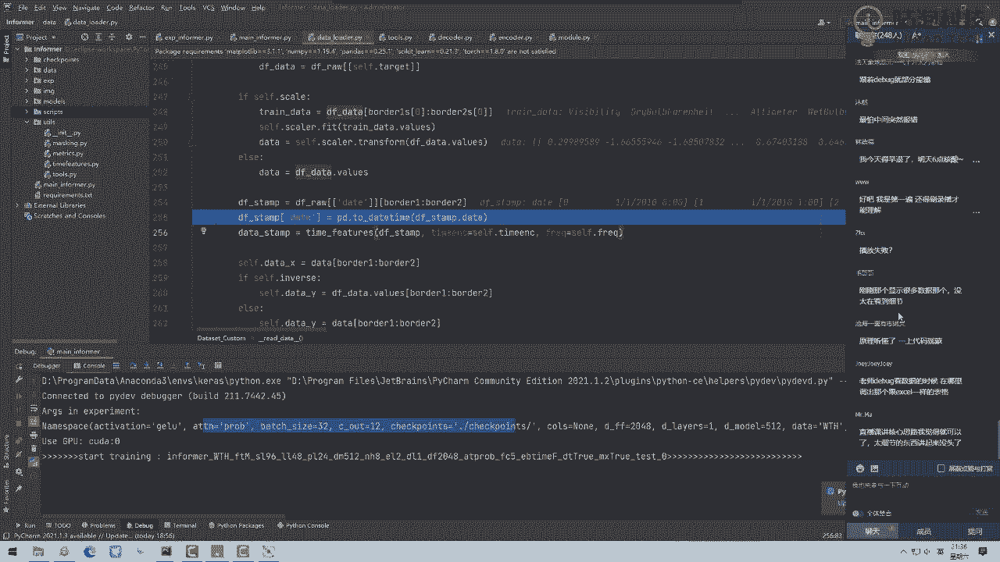

代码必须看，我跟大家说一句心里话，就是呃如果直接给大家直直接让大家看，这个以后啊，大家少不了干什么，你们少不了去阅读这些论文啊。

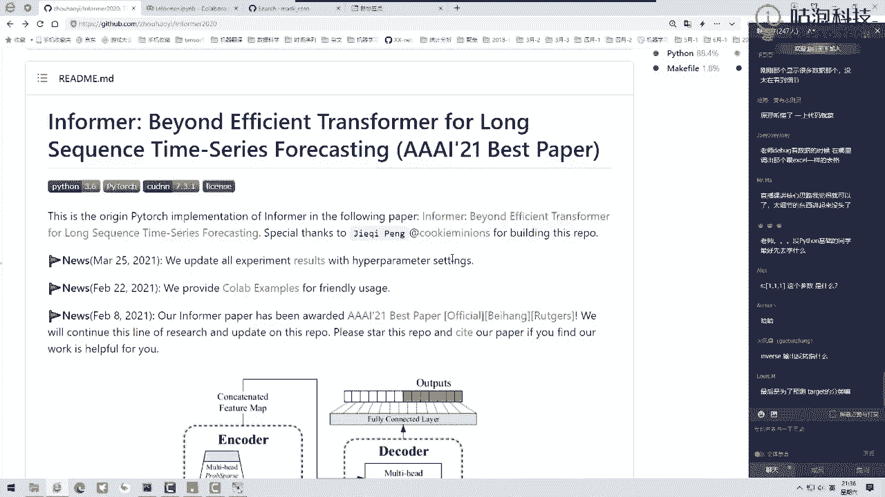

你们少不了去阅读论文的，大家阅读论文的时候，估计你们会遇到更多的问题，就是论文当中我不知道他是在去做什么，我不知道这个论文讲的是啥，我跟大家这么说，就我现在读论文，我能我第我就光读论文啊。

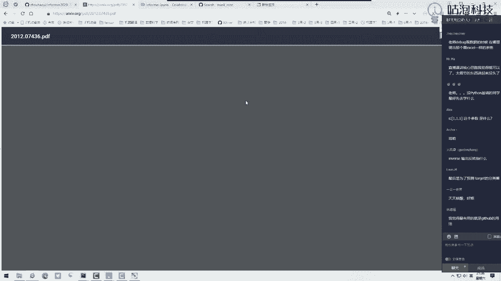

我能理解个50%，我觉得都挺多了，真的你就读论文，你全理解能理解个50%就不错了，就比如说你给我这个图，你就刚刚我这个图给我写几个名字，什么叫概率压缩这个东西啊，什么叫做蒸馏这个东西啊。

我光看论文我也看不懂啊，你给我数学公式摆在这，就你给我数学公式摆在这，我说实话挺懵的，他干了些什么事，我不知道，但是你这个东西放到源码当中。

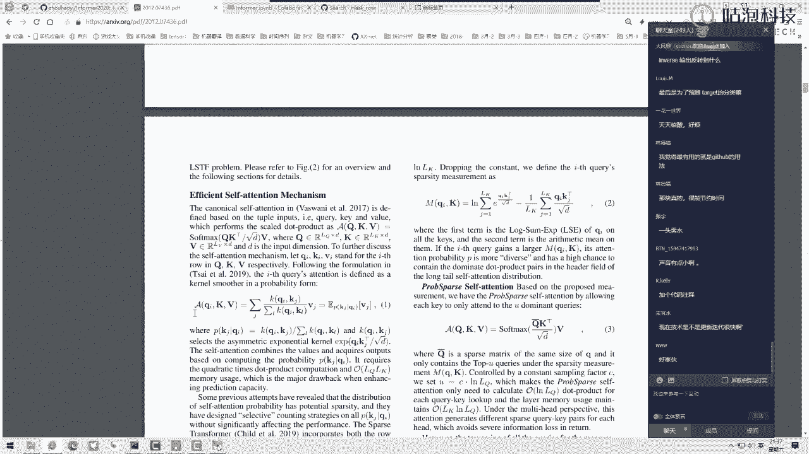

你再去过一遍，它理解起来啊，就非常容易了，所以建议大家啊就是debug这个操作啊，咱就怎么说呢，真的是不能少啊，就是必须得必须得一行一行来去过的，今天还是我带着大家为大家一行去解释。

后续大家就是怎么去锻炼你的一个学习能力呢，我希望大家就通过咱们比如像我们第五期啊，通过咱们这个哎我现在声音小吗，兄弟们，我声音小吗，我声音也挺大吧，我声音也挺大的吧，我说话声挺大的，应该不小吧。

就是小同学咱咱咱咱们稍微调一调，就是可能大家音响设备也不一样啊，就是大家看看自己的设备啊，我知道应该正常的，然后后续啊就是大家我希望嗯怎么样呢，就是学习过程当中啊，一定要自己去多熟悉这些源码。

这些对大家提升能力比较大的，无论是后续你的工作还是你后续阅读一些论文，都需要大量去参考这个源码的，我给大家讲，相当于就是带大家去熟悉一遍这个流程，后续少不了什么，咱们得自己啊。

咱们得自己来去搞这个东西的啊，代码当中都得需要自己去做一遍蒸馏，后续给大家去说啊，蒸馏就是一会大家看到了，让结构变得小一些，服务器这个咱们最后给大家说吧，我没啥好服务器，我就两两块3090。

我成本也不想搞那么高，没有Python基础的，先学Python基础啊，Python基础是必须的啊，这个东西，呃我看同事是某网络代码，他网络做的不同自有所改变，属于这属于减这不属于减脂啊。

这属于就属于改变啊，C加加部署，咱们已经有了C加加部署的，就是那个TENSRT的，我找另外一个老师给大家讲的啊，最后给大家说服务器这东西嗯，怎么说呢，就是把台式旗，把台式机锁就锁起来。

锁到一个专门的地方，这种感觉时间序列不适合做沙粉的啊，就是那啥，他那个SHER就是说每一次我们不是按顺序取，是一段一段的一段一段随机取啊，预测不是分类，预测是回归，兄弟们预测是回归啊。

四期四期我们那个模型部署的m m live没有的，m m lab是做CV的兄弟们，m m live他是做CV的啊，服务器你要是配的贵的，你就直接找供应商给你报价吧，啊直接给你找这个供应商报价吧。

一次到位，inverse输入怎么理解，他那啥我我没改这个参数，他那个参数我估计就是说正常预测42值，你是想从往前输出呢，还是从从前往后输出呢，我估计这个意思，这节课啥也不需要就跑，这东西CPU都能跑。

我跟大家这么说，CPU哎，咱们今天讲啥，我们今天讲时间序列，咱们今天讲时间序列，这个东西要比什么，要比我们的CV要比我们图像数据，咱的输入怎么样，少了少了几个数量级，兄弟们。

咱们今天这个时间序列跑起来太轻松了，CPU我会动就跑的，要少了几个数量级啊，大家都有这种感觉了，要少了几个数量级的，时间序列跟图像是有不同的，这东西很小，兄弟们，这东西很小的，3070可以的啊。

3070可以的，时间序列，它既可以做回归，也可以做这个分类的，打断点安点安来兄弟们，这个点安就是这不就打上断点了吗，太基础的东西大家就是怎么说呢。

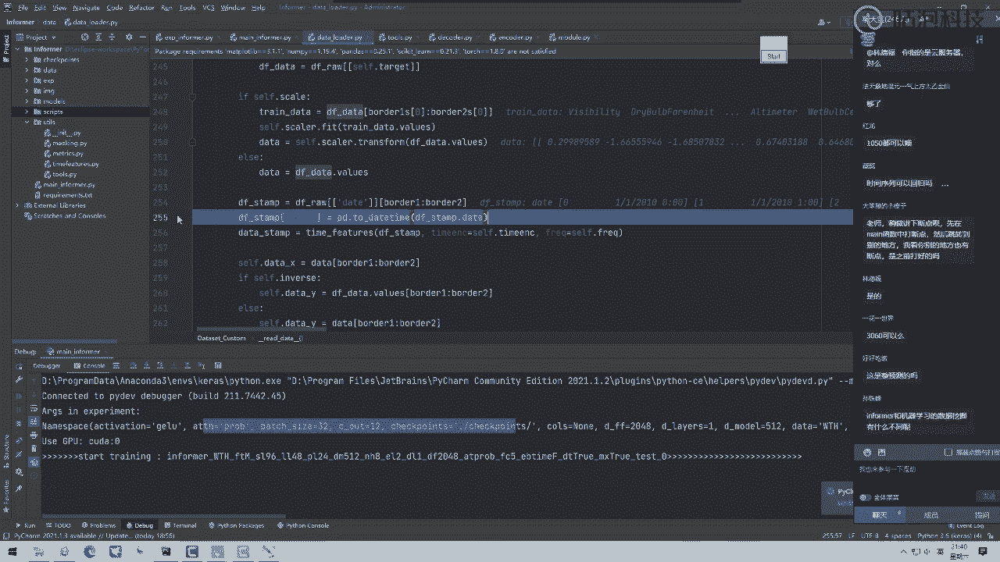

多练多查啊，就是不是说有时候我和咱们朱老师都让大家说，有时候东西多查一查，多查一查，不是说我不让他不给大家去回答问题，很多时候啊就这东西啊，怎么样自己练一遍，啥东西一定要自己熟悉一遍这个事儿啊。

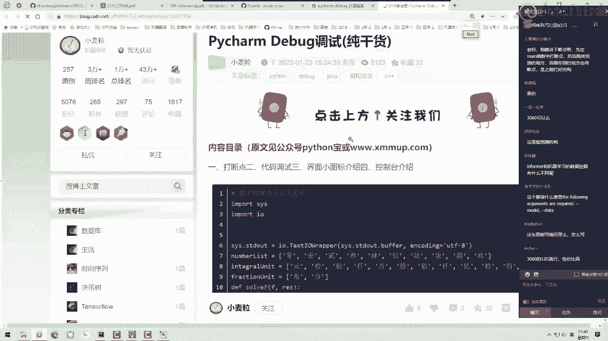

这个东西一包括咱们debug，包括咱们对这个代码理解吧，都要自己搞一遍，都要熟悉一遍的debug，不是往简历上去写，包装项目会给大家说啊，包装项目你要给包装一个实际的背景。

比如说咱们建设项目学完之后怎么办，我们之前做过啥项目啊，比如说我们之前啊给那个变压器厂啊，做过这样一个啊做做做这样的需求，他们的任务呢就是说啊，哎比如说我们现在这个电厂当中给用户供电。

但是我们要提交用户啊，提前去呃预缴一下下一年的个费用，但是预缴费用的时候，我们会给予它的一个呃一个指导价格，知道价格人，会根据哎他当年的一个啊使用电的情况，我们会去预测一下它未来下一年的使用情况。

其实这个情况我们让用户给我们一个预缴，这样我们有一些资金的回笼，能更方便后续去服务客户，就这种东西就大家编还不会去编吗，我就随机发挥了编这个东西啊，写简历我跟大家说一遍，好多同学最近缺少写简历。

别写的跟学习笔记似的，啥实际场景你们自己去写啥，实际场景你们自己熟悉的啊，这个大家就自己写就行了，包装成个实际项目，然后实际项目人员为你咋做的，你说哎我们任务当中我们套入informer这个模型。

为什么套这个模型呢，因为它可以预测未来一段的序列，并且它对我的模型做些减值，做些蒸馏操作，我们希望用户啊反馈时间是比较快的，基于它的历史数据，也可以快速也生成出来一个匹配的结果，咋地。

这东西啊就说还不会说吗，啊就这东西大家就编就完事了，每一个项目你都可以包装成你一个实际的东西，这个事大家自己后续想一想，看一看，你啥都用熟悉，你就这么去整就行了啊，啊我就随便说的啊。

就这也没也没也没过大脑，来来来，兄弟们，咱们准备继续了啊，说不完了，今天我估计我估计在我这进度太慢了，我现在数据数据这个东西啊，我讲半个小时讲完了啊，兄弟们，大家看一看数据这个东西啊，那就讲一个多点了。

数据也没讲完呢，网络结构还没讲呢，兄弟们啊，咱们就今天说完，我也挺晚了，你们还没回宿舍，同学，一会儿咱就可能得咱们拿其他设备来看就行了，咱们继续说吧，啊我们来继续说吧，哈哈哈呃水分很大的啊。

都水分很大的，来来咱们继续说啊，咱们继续说，对咱们很多都是10：30关门儿的服务，然后实验室关门儿的服务器关门儿都有，还有哥们跟我说，老师我们老师让我十点必须关机，怕我太劳累了好，然后咱们继续啊。

接下来我们看这个时间处理，在我们任务当中啊，大家注意这块，我们拿到时间去拿到这个时间数据了，时间数据啊，我们要去提特征，大家可能问老师，时间不就是一个指标值嘛，它不就指定我们这个样本它是哪个时刻吗。

不仅仅如此，时间当中啊，能给我们提供的信息是特别特别多的，但是大家注意点，你看我们这个时间它是什么，它现在是我们这个数据的一个格式，我们数据这个格式啊不太好操作，怎么办呢，大家看这块他是用。

它是借助了pandas as这个操作，pandas点to date time一下，把它转换成pandas的一个格式，我再给大家看，你看这就是pandas的格式跟之前有点区别吧。

大家说哎老师不就格式变了有啥区别吗，你转换成pandas as所支持的格式，一会儿pandas as这个包，你是不是就能进行调用了，这是这一步啊，它转换格式，转换格式完之后。

它可以它就是方便咱们进行调用吧，这是我们做了一个格式转换啊，我这个注释，我直播时候没时间给大家写这个东西啊，到时候大家后期自己玩的时候自己写一写啊，然后接下来执行我们这个time features。

大家可能问老师time feature干啥，我说我也不知道啊，按住CTRL咱点进去看一看呗，然后电源安装control之后，我在这打上断点，我家会怎么打断点，你看这是正常跳入这个函数当中。

它是没有这个断点的，我在这儿在地上打上个断点呗，然后我说这一块往下执行，它在往下执行的时候会找，如果你执行过程当中有打断点的地方，它会停到这个断点当中，然后这也是这样的，他注释写了一堆哦。

我给大家总结一下，我不给大家都说了，这说完咱讲后半夜了，他这出是这样的，就是针对你这个时间序列，它有多种不同处理的方法，提不同的特征的啊，他提出两种方法，我们直接看第二种，这个默认它用第二种啊。

来晚执行啊，第二种第二种当中执行的比较简单，因为上面的他提的特征太多了啊，下面他又提了四个特征，我们一个一个来看一看，首先啊他是啊，他这一步跟刚才重复了，其实他已他已经。

我们刚才已经把它转换成一个daytime格式了，然后下一步就是大家可能说哎呦，我这写了一坨子，原版当中，一旦我看写一坨东西，我就恶心，我就难受，没关系，咱捋一捋，他是这样啊，咱们先捋，我也没看啊。

咱们一起来捋，他说for这个feature因什么，因这个哇，天哪一大串子一大串当中又传建一个参数，他是这样把这个feature拿到手，然后对这个feature对我们这个数据做一个转换，那是啥意思呢。

我估计啊，这个feature，它一会儿应该通过一些什么字典类似的结构，找到一些转换的方法，对这个转换方法来转换我们当前这个data数据，是不是，那我们来看一看这个当时先看出现参数。

这个参数它是H表示我们对时间数据做处理，是不是，然后这是啥我也不知道啊，CTRL点进去看一看呗，CTRL点击之后，我们来看这一块，他列了一大串的啊，咱们来读一读，它有注释啊，大部分源码是都有注释的。

尤其是以后啊，咱们大家玩的一些大厂代码都有注释的，很少说啥注释都没有的，除非是自己自己写的来看一看，他会啊返回一个list的结构啊，这个list u当中包括我们的features。

这个features它会通过你指定的一个就是间隔吧，以小时以分钟为单位，会给你返回咱对应的一个特征，结果那我们在这里，你看本来没有断点，我说打上一个呗，来挑到这段当中看一看人家干啥的。

嘶哎呀就是第一第一次啊，如果说你让我看这一坨代码，就大家可能第一次看，我估计大家也看不懂这啥东西咋办呢，我们得想一想它啥结构啊，第一个它是个字典结构，是不是这个字典结构当中有一些key啊。

就这个key起的名字就极其复杂，啥意思呢，我说我不知道这o size是啥，咋办呢，按住CTRL点一下子行不行，是不是按住CTRL之后，点开之后发现这东西这东西在哪。

这东西是在pandas as这个包当中，大家看一看，你看这队在哪，pandas当中，ts time series当中有个offset点PY文件，这个文件当中相当于人家工具包内部啊。

给我们实现好了一些特征提取的方式，那我一看哎，我说这东西啊是工具包内部写好的，那我该怎么办呢，我们就不管了呗，这不就是掉包这个操作吗，咱先执行完，一会儿跟大家说去干什么，他这一步啊，我跟大家这么说吧。

就是我总结一下，他是这样的，他做这个top set这个操作啊，是这样，就是说呃，他要对你当前传进来的东西做一个映射，我也我其实我觉得这东西贼啰嗦，这个代码写的贼啰嗦，大家看我给大家看看结果啊。

你看我这一块我传进来一个H啊，就说我说我希望通过那个小时为单位，去处理数据了，然后大家看结果他把这个H包形成什么呢，映射成了一个hour这个东西啊，就再给大家举个这个例子。

就这当中这当中如果说哎我们传这个H，它会帮我们自动判断一下这应该是个什么，这该是r our这个东西，AA这东西有什么用呢，一会给大家看到RR这个东西，他会帮我去找到咱们当前要处理的一个类型。

我觉得这块有点啰嗦了啊，你就不写这个东西，哎直接的咱把咱们的那个参数，你就直接按照这个pandas这个包所支持的格式，人家panda这个包函数，它的名字去写不就完事了吗，还搞这个映射干什么呀。

我觉得这个东西嗯当时观众也挺迷惑的，写了一堆啊，我也不知道他要干什么，反正你就这么去理解吧，他就要做一个映射，大家来看怎么做映射来在我们这个任务当中啊，这一块大家来看这个哦，大家来看这一块吧。

去做了一个便利，他这个便利我觉得也是贼啰嗦的一件事，他做便利啥意思呢，就是这个offset有好多种类型，这种好多类型都是pandas当中我们实现好的，我给大家举个例子吧。

嗯比如说来看这个这个呃month year啥意思啊，你传进来了呃，比如说你传进来了一个一个时间数据吧，它是2012年的十，然后点零八，然后点那个什么13。00，它会怎么样呢，它会告诉你当前哎。

我们会把这个月份给它拿出来啊，会把月份的时间给它拿出来，就这样一件事，帮咱们去在里边提些特征，这是panda这个包所内置的一个操作，然后这块操作判断就是我们当前，我们当前是一个呃。

这儿呢我们基于hour去做，是不是它会判断哎，我们当前这个跟我们当前这outside呃，就跟这个类型哪一个是匹配的，我们直接跳入下断点对，当终于匹配到了，你看这是个时间是不是。

然后这个当前它也是一个时间的，相当于通过啥，我就大家说这样一件事，通过咱们这个名字找到我们要调哪个包来，大家看掉哪个包，我把手上这一点大家看是不是pandas当中。

然后TSLAB当中offset当中点AVA这个东西，哎是不是说去掉这个包，我们到这个不给大家往源码上去看了啊，你就知道我们今天调哪个包就完事了，那接下来知道我们掉哪个包了。

咱们是不是说可以把这个方法给它返回回去了，什么方法，就是说我们调这个包的时候，我们既然以小时为单位，以小时为单位的时候，我们都可以执行哪些个操作，我再给大家看，他是这样的，我给大家找哦。

这呢来大家看是不是找这个东西，它的意思就是说我们把这个给他找到，就找这个东西，其实这个东西也太啰嗦了，我直接一行代码给它指定好了，不就完事了吗，不用去匹配啊，这你就你就当我理解就行了。

这个代码可能写的想比较高端大气上档次吧，写个比较通用的方法，咱自己任务不用这么高的，大一大上网次啊，跟大家说一句话，总结就是说接下来我们要提，把时间做成四个特征，第一个特招。

当前这个时间是这一天的哪个小时，大家可能说唉这一天哪个小时，不就是说根据他的第一个小时，第二小时，第三个小时，第四个小时吗，不是的，一会大家会看到啊，这是我们对时间体特征，这是我们对day体特征。

当前这一天它是星期一，星期二，星期三还是星期四还是星期五，当前这一天他是上旬中旬还是下旬，当前这一天在这一年当中它是第多少天，这是我们要提的特征啊，这一块就人家说了，我们要提出来有这么四个特征。

大家就只需要知道，我们费了八劲的整了这样一个事就行了，所以这一块大家注意，我看看啊，这个名字我能不能显示出来啊，这个把鼠标我这儿显示不出来，就是能大家能不能理解这意思啊，这个这个feature啥意思啊。

就是有四个，我为啥说它是有四个，它这里大家看怎么来的啊，for这个feature in这里边他去做了一个遍历，这条遍历完之后是几个，咱边上不是四个吗，今天是哪个小时，然后今天是这个月当中哪一天。

他咱们只开给大家看是四个，是不是对于这四个当中，每一个分别对这个dates做数据处理是吧，来大家能不能不能里边这个意思啊，就你后你会看到比这个复杂多的代码哦，这个只是非常简单的。

对我们当前这个特征取出来有四个，是不是四个当中，每一个对我们这个日期要判断啊，对每一个都要对日期进行一个特征提取，然后前面这个南派点VISTYLE啥意思啊，你提出来四个特征咋办，把四个特征拼到一起。

那我们来去看一下怎么提的，回家找吧，这东西我想给大家打断演跳，跳进去看一看，按住CTRL你看不好使了咋办，按住CTRL不好使的时候，因为它这块在for循环里边吧，咱是就这种写法，它是简便算法。

所以说跳不兵去，咱咋办找呗，来往上翻，咱去找，你看这个time feature，当中列出来一堆，咱一个去找我们来，我给大家打那俩找第一个，今天的哪个小时是不是有这个东西啊，咱是不是有打个断点啊。

然后今天呢，然后今天是这个这周哪一天有打断点，有打断点，然后打四个断点，该打好的，我们往里跳一下，来看一看，来看一看，这里边我们今天第一个嗯，这块是把我们数据拿到手了，你看还是我们这些数据是吧。

我看看它能不能做展开啊，这个这个这展开挺费劲的，来，这是我们初一做展开了，你看所有数据都是零二到这个23，是不是每个数据都有它对应的一个时刻，这一块它有个注释，他说啥意思呢，把我们今天是哪个时间。

压缩到-0。5到正00。5之间怎么压缩的，对时间特征除23-0。5，这样啊，为啥除23，咱们那个24点不是24，我们24点是零点，大家注意24点是零点啊，所以这块他是除23的。

那这样我们是不是得到了对数值做压缩，得到了-0。5到正0。5之间的一个值，表示今天哎它是今天的哪一个时刻点上，因为时间序列，时间序列所预测跟时间是有关系的，什么时候是打游戏的黄金时间。

晚上八点什么时候是篮打打篮，打篮球的黄金时间，晚上六点之后，是不是什么时候是早晨吃饭时间，这都有说法的呀，什么时候你手机比较费流量，什么时候你情绪比较不稳定，其实都是跟时间有关系的。

比如说我一会我一会儿媳妇几点会跟我吵吵，几点会骂我，几点会打我等等，这都是跟时间有密切相关的东西，所以这里边咱们再提时间这个特征啊，好了，这是第一个来再提，这是啥，这是dave fake，啥意思啊。

把今天是这一周哪一天也压缩到什么，也压缩到-0。5到0。5之间，我们这个一样的，我估计他应该是，我记得应该是0123456吧，这块除个六再减2。5是不行了，来再往下再往下再找，今天是这个月的哪一天。

也压缩到负的0。5到正00。5之间，大家能说诶，为啥要压缩这个值啊，其实这东西不是固定的，你想怎么压缩都可以，这一天我说他是这一年，哪一天也压缩到-0。5到0。5之间，为啥这么做。

你不要拿一个具体的数值，你拿一个具体的数值，那数值大小有差异的，我们把所有数值都压缩在相同的一个，取值范围当中，这就是我们对时间特征怎么去做入预处理的，我希望大家就看到这之后，我们要干什么呢。

有一些想法了，人家这个源码怎么做的，人家这个源码对时间做处理了，大家说哎老师我接下来搞论文，我也搞时间序列，我这个时间序列我可以怎么搞呢，人家对时间做处理了，你的任务当中有没有些什么特别的东西呢。

比如说你的任务当中有一些文本哎呀，文本当中提涉及到啥呢，涉及到一些什么地点呐，哎然后涉及到一些什么场景啊，涉及到一些什么场啊，就是我可以想想啊，有地点，有场所或者有人名之类的东西。

我们是不是直接可以把这个地点做成一些特征，把一些其他东西也做成一些特征啊，人家提拿时间做了一个拆分，提出些特征，你自己任务咋玩，是不是都是根据你的故事自己来去说呀，言之有理即可，这篇论文当中大量去说了。

人家对时间咋咋地咋咋地了，其实就是很简单的处理，是不是大家自己任务根据你的特征想呗啊，就发挥你的想象力，能做啥，咱就往多去做，然后最后怎么办，咱们看是不是做了四个，我看看是不是四个来四个，最后拼到一起。

我们看结果咱四个啊，拼到一起之后来我们看这个结果啊，来看这个结果，你看0123这个零表示什么意思啊，今天是那个咱们先看下零是啥，零是那个那个那个小小石，是不是一是啥，忘了二三是啥都忘了哦。

然后哎我估计这个三应该是哪一天吧，你看这都是0。5的，然后最后看最后一天，最后一天是正的啊，这就是对我们这个天来也做了一个什么，全压缩到所有数值负的，0。5到正点0。5之间了，这是我们对时间做的特征。

你别看我这东西讲起来讲的挺慢的，就大家自己你们debug，我估计你们思路如果比较快的话，你们debug这东西应该很快的，我自己看这个源码，我咱们上课之前，我花了20分钟debug了一遍。

然后可能就是我讲的比较慢，但是你自己去debug1遍之后，你很快的这个东西，他们肯定不会比我讲的要快的多了，你自己理解这个东西来，接着再往下，Border1，Border2，之前说说过了训练集。

咱俩去取DX是我们的训练集，然后这一块他多做了一个多余的事，就这块他这个data y啊和DX是一样的东西，我也不知道他为啥这么做啊，挺多余的啊，就是一会儿分别在DXX当中去取，data by当中也去取。

其实他俩看看这个东西是一模一样的，大家先记住，他俩现在目前来说都是一个一模一样的东西，还没有任何的改变啊，就是你就当做吧，这是我们处理好数据了，处理数据包括什么时间数据时间数据处理好了，是不是，然后呢。

接下来我们这些特征拿到手了，再通过这个列名标签指定了标签，最后一列是吧啊，这反正就是我们现在做数据基本处理，咱们现在已经把数据处理给做完了，哎呦我这次费了好大劲啊，才讲完。

咱们这个ra data这个函数，咱得快点了，这这一步初始化的数据集啊，咱们这个customer dataset完事了，来再往下做这个data loader，这个data load比较简单了。

就是大家看我给大家再跳进去，还有个函数没说呢，呃这里边我给大家找，哎，咱们来找一下，我看一下啊，这呢咱们该给大家看这什么data coser，是不是这里边构造函数，我们是先要把数据读进来了。

先把数据处理好了是吧，大家注意这一块，我们是刚把数据读进来，刚把数据处理好，但没完事儿，他现在给我们处理好之后得到什么了，我们是不是得到了当前这些数据了，接下来我们还有个get item函数。

我先打上个断点，一会咱会用到这个get item函数，就是我们制作dia loader所必须要去用的，大家记不记得，我在那个PYTORCH当中给大家去说了，有dia loader这个东西。

这里边我们现在就要去构建我们的数据集，我们也需要去做这个data loader这个东西，现在该在item函数当中，我还没走，大家先知道有这个东西啊，因为一会儿我们要构建这个数据集，来看来看哪需要这呢。

data loader构建数据集，因为这里咱们连源码也写好了，所以说我们可以指定这个data loader，这是touch内部的函数啊，咱就不说了啊，TCH内部跟我们之前做法是一样的。

封装成一个dio load格式来做成DAYLOADER好了，现在我们把data loader做完了，呃，费了海大劲儿，把训练集也做完了，接下来来接下来不不往里跳了啊。

你看这个代码当中我们训练集怎么去做的，我们的验证姐和我们村儿姐，我喘不上气了，快我们的训练集，验证集，还有测试集，是不是咱做法都一样的，都是相同的啊，咱做法都是一模一样的，来接下来我们再往下走。

这个不给他往下跳了，我直接是打断点，咱直接跳到这段当中了，同样的操作我们就看一遍来再往下跳，这是我们验证集和测试集，咱不往里一个走了，我直接呃正常应该把这段都取消掉，来都取消掉吧。

你取消掉就是把它点给取消掉，这样他就一会不会往这些这些当中去跳了，来，我都取消掉，这是咱们都是我们该打的吗，该给大家说这个数据集的时候，打了这么多断点来，我们都取消掉，都取消掉来跳出来哦，还没完事。

我们打的太多了哦，这里也打了，基本上每个地方咱们都打了哦，来跳到这了，来把之前取消掉啊，这是我们现在把这个数据集全做完了，训练集，验证集，测试集对应大家loader是不是都有了，然后接下来干啥了。

是不是该去训练我们的模型了啊，来接下来我们指定咱们往下走啊，下面这一步他做了一个判断，就是你这个checkpoint这个路径有没有，如果没有给你新建一个路径是不用说的，然后指定单位时间。

我们可能会计算啊，每个EPO执行时间，然后这个long就是说我们会执行多少个tab，我们的batch多大，这是根据你那个batch来指定的，好了，这个ASTSTO表类，so饼不给大家也去看了啊。

ASTSTO表做一个体验，停止策略，这东西聊一聊也知道就行，就是模型如果连续多少次不更新，我们给他提前停止掉，然后优化器还有这个损失函数，这都不让你跳了，直接给大家看，结果得了，优化器用这个ATM。

这没得说啊，这东西也不用看，百分之大家玩这个模型啊，基本上就万年不变的一个数，你无论跑啥都用ATM去做，因为所有人都用这个东西去做的，你也不用想ATM我有没有改进空间了。

别人这什么大佬级别人物都没有改进空间，你有啥改进空间啊，这东西就用就得了啊，损失函数啊，这个很简单，他这里没有改啊，这篇论文当中，我觉着可能后续大家如果想去改的话，损失函数可以去改到。

他对损失函数用最简单的一个m s e loss，做这个回归的就是touch当中，touch当中内置的这个Mac loss，很简单的一个没有考，没有加任何其他的操作吧，然后这个咱咱没加LINUX。

你去加这个东西，windows别加这个东西了啊，加中容易崩，那下面我们去来去迭代，我们一共跑了多少epoch，看一看六个他跑的比它跑的比较小，大家自己玩的时候，你batch可以稍微大一点。

时间序列不像图像啊，图像你batch为一，你觉得都玩不起了，时间序列它怎么说呢，他的输入没有那么大啊，你的beat也稍微大一点，然后指定我们这个list就不用说了，损失做计算。

然后第一开始我们训练指定model为train，然后下一步来去遍历这个遍历啥意思啊，哎呀又又给大，又要给大家打断点了，遍历这个data loader，它会遍历啥。

之前大家说过好多次遍历这个样都要loader，它会遍历这个get item函数，是不是这比较核心，我们还得给大家跳到断联打进去看一看，因为你要理解一个源码，就理解两步两步就行了，数据咋搞的。

从头到尾把数据咋搞捋明白，从头到尾把网络结构咋搭建搞明白，把这两件事搞明白了，后续啊就是你做啥呀，那就都都能理解了啊，来打上断点，就是建议大家这样，你跳之前啊都是提前打断点啊，跳每一行都瞅着让干啥。

提前把这个断点打进去，这样我们再往里一跳，是不是就跳到这个断点当中了，这块指定的索引随机传建了一个索引啊，大家注意随机传建索引，咱这个时间序列啊，怎么训练呢，再给大家去画一画。

这是我们现在有1万个样本数据，在我们这个1万个样本数据当中，我们会选什么呢，随机的一个起始位置，比如这一块随机选这个起始位置，以它为我们的起始位置，INTEINDEX为起始位置，找什么呢。

找到终止位置什么，以当前这个位置为起始位置再加多少，再加上一个96，因为我们说咱们要基于的序列长度，是每96个序列预测它接下来预测值，所以这个呃这个起始位置是随机的值，比如它是3000吧。

然后呢终止为止他就是个3096啊，这样一件事，然后这个R这个R是这样的，就是呃它是啊嗯嗯跟他这么说，它是跟我们这个呃96它有重叠的，重叠多大呢，我给大家画它的重叠是这一块儿，它有了48个。

因为一会儿大家看到了，在我们那个transformer encoder当中，我们会用这48个啊，来当做我们的一个先验知识，然后去带着我们后面做预测的，所以说大家注意，它是通过这个SN的减48啊。

这个label lg48，所以这一块绿色画出这个是48，然后这个r and的等于多少呢，R2等于多少，大家来看等于是R比根啊，就这个东西从它的开始加上什么，加上这个48到这儿，再加上预测的一个长度。

预测长度我们是24，这个黄色它这个东西它是一个24的，最后我们要预测结果就是这24个值，但是这48是我在抵扣当中需要先带带它的，好了，这是咱们先指定好啊，就是为大家写一下吧，咱们来找个对应关系。

自己玩的时候自己自己呃，为大家这一看就能看明白，我可能说的有点啰嗦，都这是啊，这个SBN这个东西，这是sand的，这个是SN的，然后这个R的R的起始位置，R的起始位置，我给大家来画。

这就是R的一个起始位置，这就是R的一个终止位置，好了，这里大家说了一下，咱们指定的索引发生什么，咱把这数据区域列，咱一会儿都能取明白，好整列索引来来来，随意指定索引，就是这不给大家问，你去看了看。

这看这值吧啊就像我们来说指定列值，然后接取数据，这个server dx啥东西来着，你要忘的情况下，你往前瞅一瞅，是不是在定义的，我们处理好数据之后，看看这是不是处理好数据之后。

在数据当中指定好这个训练集的位置是吧，接下来干什么，通过我们指定索引，把这96个数据读进来，来鼠往这一点看看啥，九十六十二是不是96，啥意思，96表示我们输入的一个长度。

这个12呢表示哎我们每一个就是每一个，我一般建议叫token啊，就是训练当中，每一个它是有12维的一个向量好了，然后接下来咱不做这个，没有这个反转这个东西啊，然后接下来我们要预测的啊，要去测的。

我看这啥啊，这是我们要预测的一个结果，这是大家来看这是不是要预测结果啊，就我们这序列指定好了吧，多少个72个，是不是来大家看七十二十二，但是大家注意啊，我为啥一定跟大家说，让之前看原理。

原来大家说过72当中48个是有标签的，另外24个是我要做预测的啊，所以说48+24等于这72个好了，接下来来问问大家，这个这个带Mark的，他起这个名字啊，唉哟很烦的啊，叫什么呢，就是叫做那个时间吧。

它不都不如叫个time这个东西，这是啥，这是我们时间的特征，大家记不记着我们该数据时间特征处理出来，时间特征几个，我手上这一放，它是不是有四个来时间特征，拿到手看一下时间特征，九十六四是吧。

然后再往下我们encoder的，是不是也是个七十二四啊，输入和输出啊，都会用到咱们的一个时间的信息的，时间信息当中它是有四个特征，好了，return回去，这样咱们现在啊就哎啊这块我执行多次。

我把这个断点取消掉了，你看现在又回到这了，问大家为什么回到这了，看一下我们刚才打刚才停止到这个位置，咱们这一块啊去取这个数据，这个data loader他会帮我取多少个呢，他会帮我取batch个数据。

咱们这个batch是32的，所以说他会在这个for循环当中啊，就是这里边他会在这个复相当中，帮我重复的去跑这么32次，你看这一次完之后再来一次，你看再来一次，再来一次，跑32次，我不给他跑完了怎么办。

把这个断点取消掉，然后回到我们刚才这个函数当中，在下一行打上断点点，这个绿色箭头跳入到下一个断点，这32个咱就取完了，瞬间事啊，取完之后看一看是不是32个batch x。

我们的encoder输入三十二九十六十二，32是不是掰扯Y瞅一瞅呗，就大家自己抵自己debug过程当中就看呗，这东西一看估计大家都能看出来，三十二七十二十二是不是，然后跟事件相关的三十二三十二九十六四。

这个跟encoder时间相关的三十二七十二四，是不是，这咱就做完了好了，接下来来我们去走这个网络结构，来这一块先TU听02TU听完之后，这一块它这里定义函数叫那个去呃。

Process one batch，它的意思就是说通过输入是这一个batch数据，大家来看这是不是我输入的一个bat数据啊，通过咱们输入的这个呃batch的一个数据，然后得到预测值，然后真实值是也有的。

真实这里不取出来了吗，你看这个batch by当中，他这72值72值当中，包括我要预测的24个，它真实是否有啊，都在这里了，所以说预测值真实值咱们都可以得到的啊，按住CTRL点进去咋办。

打上个断点跳进去是不是就行了，来跳进去吧，哦来先看大家有啥问题，来来先跟大家说说问题，就72能够捋明吧，我问问就是大家看没看看没看，之前讲那个informer那个原理的，我群里艾。

我让班主任老师艾特大家不下三四遍了，真的你们看没看这个东西看了是吧，看了同学一定知道这个24和48是啥吧，就是咱们这个分类encoder和那个decoder是吧，decoder当中是不是有那个48个。

48个，我说要带带着它去预测那24个啊，就是大家如果你实在捋不明白什么，什么七十九十六，四十八二十四的，回头吧，咱们看一遍那个原理吧，那不是一句话两句话的啊，后续对我给大家说了。

就我我爸从小我爸从小怎么教我骑自行车的事，先去扶着我骑，然后再手手撒开啊，就这样一件事，72个就是72时间点的啊，就是72时间点的，那咱再去说吧，我是没想到，我这我这我这数据处理讲了一个多小时。

讲太慢了，咱马上说网络结构了啊，来咱继续，然后接下来大家来看，把这个这个数据给他放到这个库塔当中，就不用说了，放到我这个COA，我就一个GPU啊，所以说就是这个COA点点零就完事了，放到我这个扩大当中。

然后接下来接下来大家注意啊，构建这一块，大家注意一下这一块怎么说呢，有点难，有点绕啊，大家一定要理解我们现在这网络结构，我们是一个decoder加上个decoder，这块需要大家基础就比较多了啊。

首先你得知道什么叫transformer，你还得知道transformer当中，encoder和decoder分别做些什么事，来我们现在看这一块有点绕，我们现在构建decoder的一个音输入。

decoder的一个输入，decoder这个输入啥意思啊，大家来帮我，大家帮帮我看一下我是怎么构建的，就这块细节啊，大家在找源码的时候，一定要看这个细节怎么构建的，以零为初始化进行构建的。

大家注意抵扣的输入来给大家看，这是我encoder输入是96个序列，这是我decoder输入，现在是以零为初始化进行构建的，有72个，现在72都是零二，大家可能说老师不是说有48个要带带我吗。

不是有48个时间有值的吗，来继续看啊，现在是以零为初始化的，来给大家往这一看，以零为初始化的，马上跟大家说为啥啊，然后接下来在抵扣的数值当中，我们刚才不是说了吗，有48个应该怎么样，是有值的。

那怎么体现出来的呢，来大家看这个代码冒号啥意思啊，Python基础这东西啊，边练边学，遇到不会的，只有同学问我老师冒号啥意思，就这东西遇到啥不会，咱就查查就行了，冒号表取全部第一个维度表示什么。

第一个维度表示表示batch这个维度，batch这个维度我们是都要考虑的，第二维度大家还记不记着，这是我们指定参数多少，48冒号到48，啥意思啊，我这个序列当中啊，一共长度是72个。

我现在要对前48个做处理，大家注意，这是冒号，48，对前48做处理，这个冒号啥意思啊，每一个序列当中48个当中每一个都有啥，都有12个特征，是不是每一个特征我说哎他们都是要取的，这也是个冒号好了。

这是cat操作，cat操作当中跟谁做一个拼接呢，跟我的一个decoder的一个，刚才我们构建全零的一个输入，去做了这样一个拼接，全零当中哎呀全文当中给大家这么说啊，全文当中我刚刚好像写错一个数。

全球倒数，大家注意，我们该是对24个啊，这这我该我该数说成48个，还做成72个了，大家注意这块啊，你看这个长度是我这块是个24，这一块是24个零，我们刚构建是24，我忘了该说啥了啊，我刚才我怎么记得。

好像不是说24呢，流到这块这块，我们是该构建24个常数为零的，这一块是我们取了，接下来啊，咱们什么咱们48个它是有值的，那它俩拼到一起多少，你看touch点cat touch开头来着，沿着哪个维度拼接。

沿着第一个维度，这个一表示什么意思，零表示的是batch，这个维度一表示什么，一表示是你的token的一个个数，就是你的序列长度，这个维度沿着序列长度这个维度拼接，是不是48+24。

等于72的一个操作啊，那这一步拼完之后啥意思，这48个是有实际值的，就是有真实值的，因为这是我们该取数据的时候有的，然后24个是拿零做初始化的，我问大家一件事，后24个为什么咱们要拿零作为初始化。

大家帮我想这个问题，这个问题很关键，为什么说后二四个拿零做初始化，因为接下来这是我要预测值，这是我要实际预测的，它是没有的东西，我要预测它是什么好不好，所以说这24个首先拿零作为初始化啊，好了。

接下来做个拼接，拼完之后大家看多少，32，七十二十二，是不是这72当中前48个是有真实值的，后24个是拿零，所以初始化的啊，大家注意这一点，为什么大家看源码就不看这个源码，你永远不知道人家细节咋做的啊。

来接着再往下走，再往下走，我来看这块，来再往下走走这个网络结构了，看一下网络结构当中啊，输入的是四个东西，我一个一个给大家去捋一捋，这四个分别是啥。

第一个batch x我们encoder当中需要去先编码，你告诉我的一个输入序列，当前输入序列它是96，长度32，九十六十二表示batch为32，96是长度，12是特征，x Mark我们刚说过，对于什么。

对于我们的时间也要干什么，对于咱们这个时间，我说咱们也要去做一个编码，时间这个事我也需要给编码成特征，三十二九十六四是吧，decoder输入啊，一会我们decoder当中。

这就是咱们在解码层decoder怎么输入的，decoder输入过程当中，我们的时间的特征也要做一个输入好了，这是咱们这四个啊，四个它的分别是啥，然后这一块呢cf2model一下，我们到现在为止啊。

终于啊真的啊费了老大劲了，终于咱要去说这个网络结构了，往这个model去传了，我CTRL点一下，看这个model在哪定义的啊，这个build model啊，这块他没有去指定，那我们直接来看吧。

找什么找类名吧，在这个model里边找，你看它这么多怎么找呢，如果说那如果说大家第一次看这个源码，我第一次看源码，我全打开，我一般会全打开这个源码怎么办呢，先从一个找呗，先找一般叫model py的。

因为其他的一看就是attention decoder，Encoder，还有embedding这个东西，这都是啥，这都会用到的东西，是不是，所以一般啊这个model它是呃咱们的一个入口找呗。

这个叫informer stack，不是我们要找的东西，我们参数指定要什么，我们连参数指定的叫informer这个东西，info这东西当中里面有构造函数，我先不给大家看这个构造函数。

咱直接怎么样在forward这块打上一个断点，forward这块打断点就是咱一会儿模型走进来之后，第一步要执行啥来点上的断点，是不是我再往下跳一步，就会跳入到这个段当中来跳，是不是跳到这里了。

看一看我们现在这个输入这里边，这四个参数是不是咱们该要的东西啊，encoder的x encoder，X mark encoder，X decoder x mark decoder。

是不是都是我们现在想要的一些东西啊，那接下来要干什么呢。

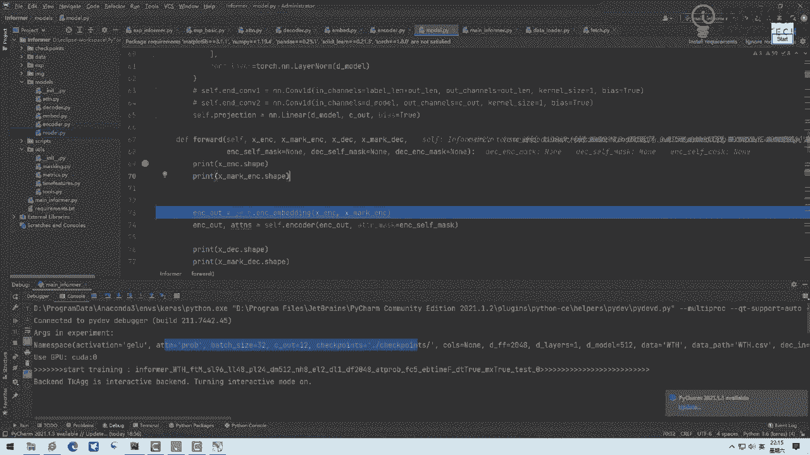

结合呗，来打个PPT吧，结合着咱这个PPT给大家说这个故事来，再往下放到我们这个transformer当中，然后呃我找诶时间序列那个是吧，来找时间序列这个东西，在我们这个时间序列当中，我们来去找啊。

来来来，咱一步一步去看啊，嗯来来来，我想一想，咱们这样吧，我先调到这一会用到这个公式。

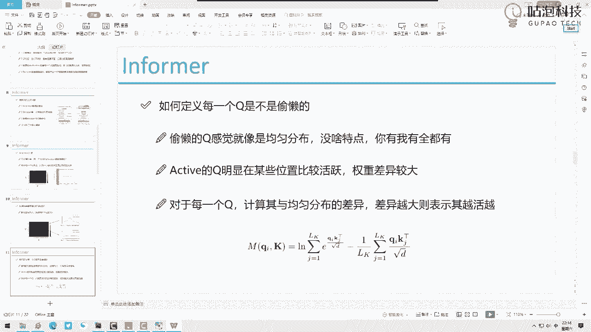

咱们就结合代码来去说，先放到这来接往下走，第一步干什么，我们讲过很多啊，不是讲过很多了，我们之前讲过transformer，我不知道大家有没有看过我们讲的其他的东西，transformer当中第一步啊。

什么叫做一个embedding，对于图像数据，我们要通过一个卷积做这个embedding，对文本数据，我们需要通过它词所对应的向量，来做这个embedding，但是现在我们是一个时间序列。

数据时间序列怎么做embedding呢，全连接FFC是不是也可以的呀，来看一下，这跟大家说一下怎么整啊，说很重要，来这里，如果大家不知道我们这东西怎么定义的，按住CTRL点进去之后。

你会发现这一块它定义了一个data embedding，这个模块是不是再按住CTRL点进去，这就是咱们这个data in bedding这个模块是吧，然后怎么办，在这里去打上一个断点哦。

我再给大家演示一遍，就是我希望咱们同学啊都得去熟悉，咱们该怎么去debug，尤其是这里边我在大家使用方法，第一个认出可能很数据点，第二个我们去拿眼睛看展开呗，这一展开完之后。

这块明显这有什么有个类叫data embedding，那你说有D与白领这个类该咋办呢，就是面向复制粘贴编程呗，你说怎么找，如果说如果说你CTRL找不到的话，把它CTRL加C1下。

然后这我CTRLF我CTRL加V1下，看一看在哪定义的，在哪定义的，我说我定义都找到了，我再按住CTRL跳进去，是不是就能找到这个东西了，或者你在实在找不着，你就找这个类的名字。

是不是咱也能找到这个东西啊，好了找完之后打上断点来，我们跳进去看一看你白领做了件什么事，embedding当中啊，大家注意，这是我们encoder，我们先对encoder来去做我们的embedding。

第一个我们做什么，大家来看XX呢是我们输入的序列，输入序列当中三十二九十六十二，它是不是我们输入序列啊，96长度，12维特征这一块呢，做这embedding其实很简单，他呃呃我刚才说的那个FC是不是。

其实这个任务当中他用这个嗯，他用的是一个ed的卷积去做的也行，就是你拿D卷积去做，还是你拿那个全员阶层去做这东西都行的，咱们任务当中它一卷积行输入是一十十二，输出是512，然后Ctrl size为三。

sat为一拍定为一，问大家输出多少1D卷积啊，它的输出是不是就是说，把我们12特征映射成512特征了，是不是这样一件事啊，Position embedding，这不用给大家强调了吧。

来这一块加上一个position bedding，所有的任务当中，这个position bedding都是类似的啊，这个大家了解知道有这么个事就行了，in bon当中啊，就是说我们序列长度是512的。

这个任务当中我们也需要啊，不是这个序列长度是96的，我们也需要对96，96当中每一个加上一个embedding的编码，接下来都有这个时间特征，时间特征是有几个是有四个，把这四个印成几个呢。

哎让大家大家帮我猜一猜，你说把这四个咱应该映射成几个呢，这一块它是把12映射成512个了，这一块呢它是要把什么，把四个映射成几个，也是512个，为什么咱们要做加法操作啊，所以说大家来看这一块。

我们也是一个1D的卷积，通过这样一个1D卷积，你看输入14，我们四个实验特征输出是多少，输出是512个，说完事了，来执行一下，执行完之后啊，大家来看我们现在这是一个embedding。

三十二九十六五百一十二了，把咱的特征做了个整合，时间特征跟我们的啊本身带的序列的一些特征，以及我们的位置编码特征，都做加法都融入到一起了，这是第一步啊。

咱们对encoder我们要做一个embedding的操作，encoder做引bending操作，其实我们decoder也需要做这个操作，来这一步咱们第一步啊，做MBEDDING。

所有的transformer，第一步都是做你biding，第二步咱们去执行这个encoder这个操作，当我们在执行这个encoder操作过程当中啊，看一看，把我们刚才embedding结果要传进来了。

然后这个tension mask是没有的啊，咱们这个任务当中没有attension mask，什么叫它是mask呢，它是这样，就比如说呃就比如当中啊，哦我也给大家举个例子吧，比如说咱们这一块我是123。

2到96，在这个任务当中，如果说我说我知道三呢是个坏人，就是群众当中有坏人，我说有这个坏人，大家都大家你们都别跟他玩臭着，他就就跟我们小时候似的说谁谁下课踩屎了，大家离他远一点啊，什么叫离他远一点。

给他指定个mask，比如说我说mask它为零，mask它为零，一般我们只用mask，它说它是个负无穷的值，因为这样做tension之后啊，它就是没有没有归它的tension了，这样做完之后。

我就说一跟二一跟四，一跟五一跟六一跟96啊，就不会跟三做计算了，mask表示就是说你不想跟谁做这个计算，咱们任务当中没有考这个东西啊，很多一些特殊任务吧会考虑这个东西，所以咱没有加这个啊。

mask这个事，然后接着看这个encoder decoder，咱们同样的方法来，首先第一步我一般愿意这样，我愿意啊，就是先展开看一看这东西是啥，你看展开看一看呗，看完之后有一看一裤兜子，这太多了。

就感觉看起来挺多的，是不是没不没关系，咱一行一行往里去捋这里东西，哎呀这里东西可多了，咱得一个来就看了咋办，按住CTRL点进去呗，看定义的encoder，咱俩定义在这定义的来encoder当中。

打上个断点行吧，通过这个断点，咱就一行一行往里去跳呗，来跳跳入一下，And attention，主要定个list里边一会儿装啥，咱不管先往下跳，来课文用来啊，这块是我们定义好这些层来遍地吧。

咱们直接来看attention这个layer，这是说啊，就是在我们上面上面都是他自己做这个定义啊，就是每层到都是啥定义，这个操作我就不给大家去看了啊，就自己定义你这些层当中都是啥，自己把这个定义写好。

咱们来看第一个呢，我们这个tension layer当中，我给大家展开呃，呃这个这个来大家看这，这你CTRL点进去就不行了，哎大家看这里CTRL点进去不行，是不是，因为这是for循环遍历出来的东西。

这个变量在不断变，所以这一块你可能点就不行，那咋办，我跟大家说怎么办啊，怎么去找这个东西来展开，展开之后呢，你去找找啥，找类名，这叫啥，这叫encoder layer，是不是。

今天我给大家更多想去说的就是咱的方法吧，其实这个源码啊后续大家自己玩都能玩明白，但是方法这个东西是所有任务都都通用的啊，找到这个复制这个名字，Equal layer，然后面向什么面向复制粘贴编程啊。

先CTRL加C1下，然后你说我也找不着这个东西，一开始在哪定义的，CTRL加FCTRL再加V1下，是不是找到这个encoder layer当中了，在他的哪儿，在他的forward当中去打上一个断点。

是不是就行了，哎回到我们这里，你看这是个tention layer，其实这个tension layer他做了很多东西，他做了很多东西，我不管这些东西都是在什么encoder layer当中。

第一个我们先找第一个，找第一个就顺藤摸瓜，你后面的后面事再说，先找第一个，咱就顺着咱们去找第二个了，来个打上断点，是不是来跳入到这个断点当中，看一克雷尔当中，咱们是不是就跳进去了，填完之后啊。

就是人家这个定义啊都不管了，用到啥啊，直接大家说这个定义吧，咱直接用了啊，然后下面来我们来看下一步下一步做啥呢，它是把我们这个X哎呀问大家一件事，这一块他为啥输入了三个X啊，像三只松鼠一样。

为啥输入三个X这个X是啥，我们先看一看啊，这个X它是个哎，这里它是一个三十二九十六五百一十二的，是不是我们那个要输入的一个序列啊，我们一会儿做这个transformer，大家帮我捋一捋，咱之前讲过原理。

讲原理过程当中呢，我们怎么说的，我们说任务当中啊，我们有要做QKV是不是Q矩阵，key矩阵，V矩阵，QKV矩阵，它们的输入都是啥，都是X是不是X乘Q矩阵，得QX乘K矩阵，得KEX乘V矩阵。

得V是不是每个项怎么得到的，是不是要训练这么三个矩阵啊，所以这块为什么有三个X呢，因为他们乘的都是相同的一个X啊，所以这里边啊这是咱们那个三个x attention mask，刚才说过是没有的。

来看我们要往这个菜上去跳，在哪儿呢，我1CTRL点进去哦，哎呀这CTRL点进去没没找着，就不太好找，怎么办呢，这样咱们再找，还是面向复制粘贴编程，点view一下attention layer。

是不是CTRL加C，CTRL加F，CTRL加V，没找到，没找到咋办，不是这个模块当中的，老不是这个模块往上翻呗，来看一看import的啥了呃，看一看哎呀，他这里边import里边也没定义什么东西啊。

来我我我再我再看一眼啊，attention当中，我是不是复制错了，attention哎，网上找一找attention当中，我看一看在哪定义的attention等于这attention。

这个attention是传家哦，这是传进来的东西，那我们得找了，我们还是复制一下来啊，因为我不找传来的东西了，我懒得去回头看了，来复制什么attention layer这个类找呗，大家猜一猜。

你说就attention layer，这个类大概率会在哪个里边呢。

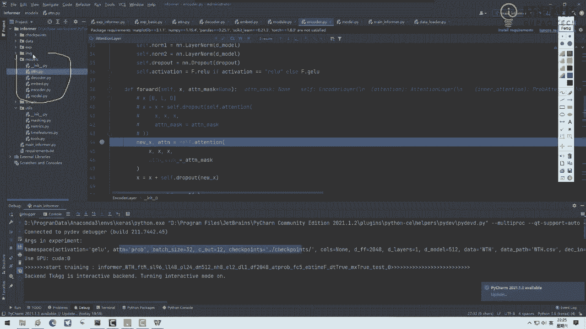

就是大家猜猜大概率会在哪个里边，是不是这个attention点pi当中啊。

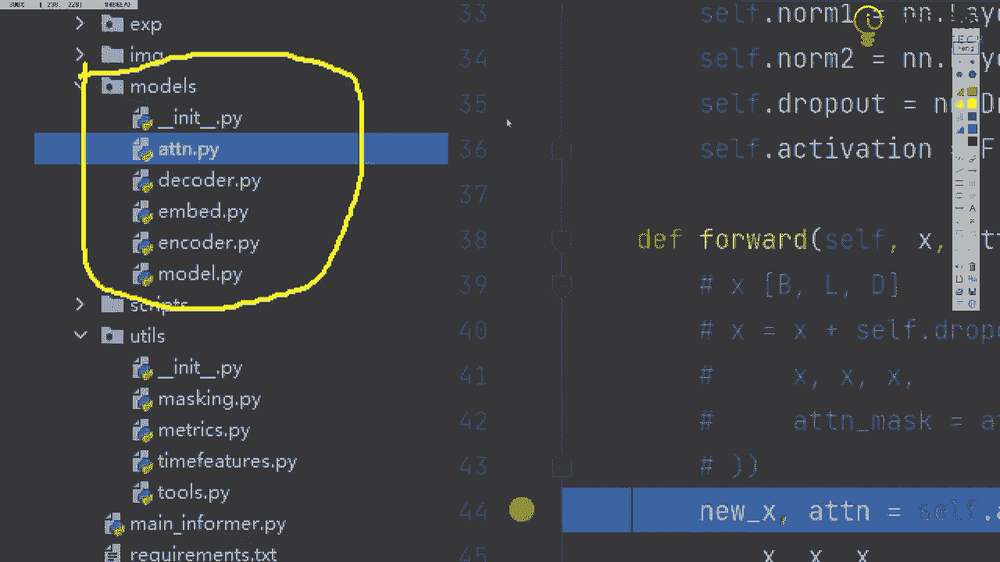

我们来稍微找一找，进去之后面向面向面向复制A编程，CTRL加FCTRL加V1下，来网上找，是不是找到了attention layer这个东西找完之后，forward d来打上断点，咱跳上去瞅一瞅呗。

咱去瞅一瞅，来跳进去，q key v我们的输入咱都是相同的，给大家说了，它都是我们的X好了，这一块拿到我们的shape值就给大家说的啊，batch乘零度，然后512特征个数。

H表示mute hattention当中的当中的头的个数啊，然后这一步干什么，建议大家看这块先看这个吧，Query protection，512，512，然后key呢大家先看啊。

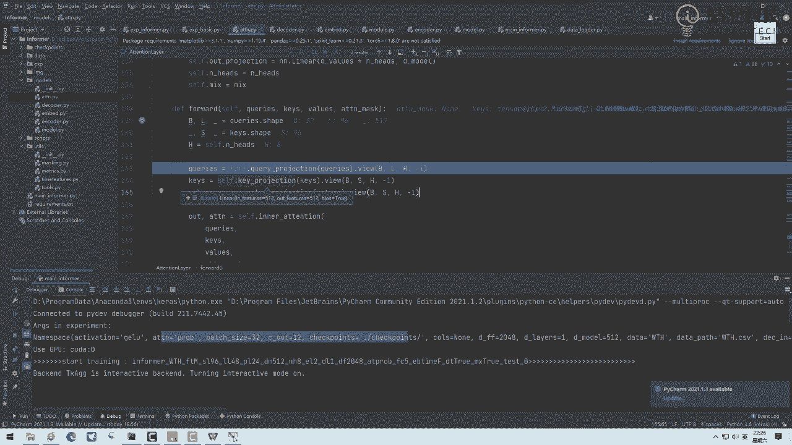

512，512，然后V呢512，512，啥意思，分别啊。

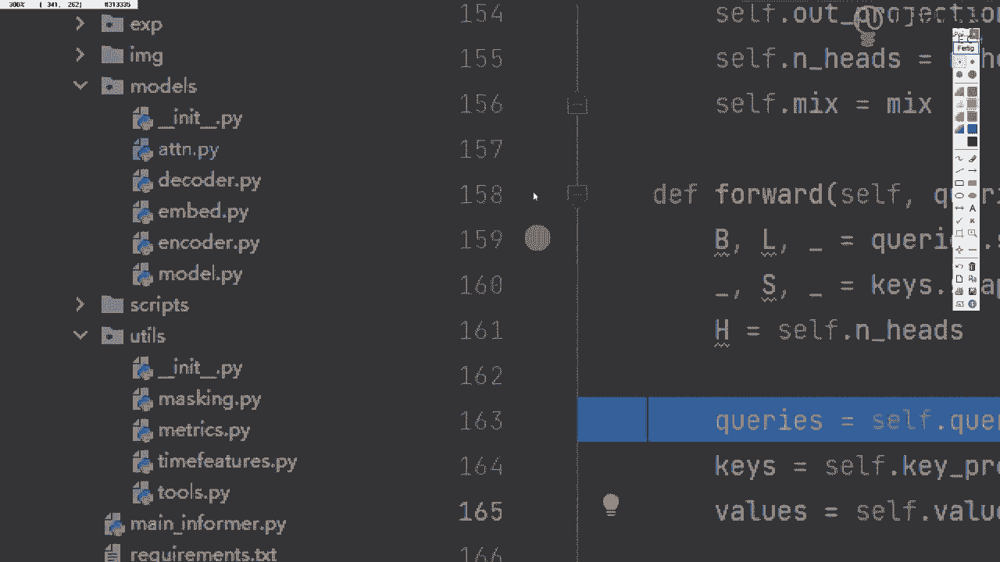

对我们的什么分别啊，哎对我们的QKEV，通过一个权重参数矩阵得到什么呢，query向量，key向量V向量输入，像我给大家画个图啊，X啊不是就是三个X分别对我们的什么分别，我们要去做咱们的QKV3个向量。

这就是咱们transformer当中完成的一件事，这个query这个key这个V再往下说的，咱们看参数是不是都X吗，X传到Q矩阵，X传到K矩阵，X传到V矩阵，是不是这样一件事啊，是不是做完了吗。

QKV向量得到手了，看一看吧，来先看这个QQ是多少个呢，大家来看这个数它是多少，哎对这块有个RESHARP操作，正常你会得到这个啊，大家来看这里正常也是得512，是不是这个点view啥意思。

作为sharp加了一个维度，加了个H这个一表示什么，一表示自动计算512H多少H8，那一多少，512÷8不就是64吗，所以说这个query当前呢它是多少，当前它这个query三十二九十68614啊。

这是我们query这个八啥意思，做mute head attention，做一个多头注意力机制啊，这一步咱现在做这个多头注意机制，QKV我们现在就都拿到手了啊，然后接下来你看QKV。

咱们辅助箱有了这个归纳的也比较简单了，咱们之前已经说过这个transformer了，然后下一步又来了又来什么，你看他做这个inner attention这个东西呃，怎么做呢，来看这个名字来面向什么。

就是大家你看这源码，我第一遍看我也不知道啥啊，那就往里跳呗，走走一走呗，来复制这个名字，哎呀他这怎么不让我展开呢，那我怎么复制这个名字，哎他呃他这个我看看啊，嗯哎呦，那咱找吧。

他不让他这个鼠标不让我复制来找，就大家记住这个名字啊，这个东西来找找找找看有没有叫这个名字，应该就在附近啊，还是attention这个东西，我看是不是这块哎，是不是找到了attention。

是不是来找到之后怎么办，第一步找forward，来找找找找找这啥这这啥，我现在我都不知道这是啥，我先不管别的，别管它，一会咱再说，你这个代码估计讲后半夜去了，来找forward，是不是来就到这里。

我们来看这一块是不是QAB有了，我们要算咱们注意机制了吧，来跳到哪儿都打进去了，跳这里啊，这这这还没跳进去呢，来跳跳跳来这一步跳来是不是，接下来咱就要看核心了。

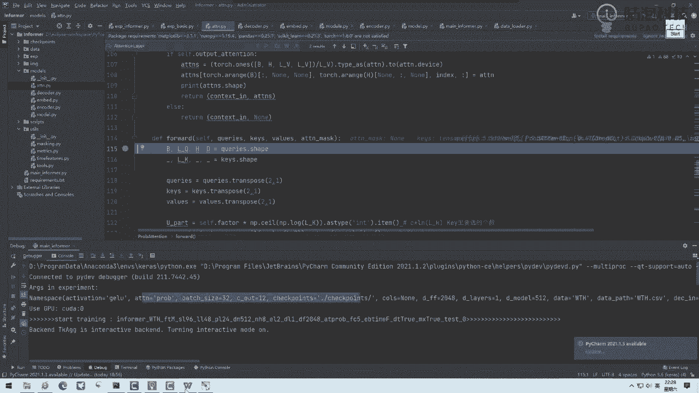

也就是这篇论文当中啊说的一个事儿，怎么去找这个Q，我给大家再回顾回顾，大家可能忘了，正常QKV是不是96个key，96个Q跟96个key要一一对应去算，慢不慢很慢，那这个咋办呢，他说这样吧。

他说我这个Q当中啊，我说我不选96个，选个代表，选个25个代表就完事了，就好比说咱班出去参加竞赛，咱班所有人都上人太多了，算的太慢了，选25个代表就得了，选25个什么代表得是学的比较好的。

那接下来咱们就想怎么去定义出来这25呢。

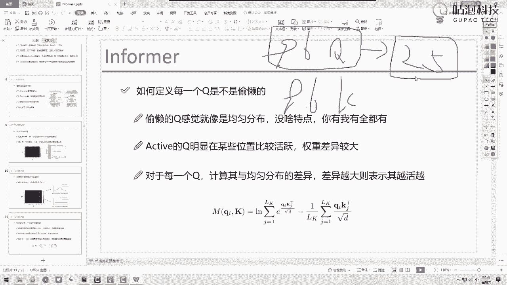

什么叫做一个学的比较好的呢，这就是这篇论文当中最核心的一个东西了，你看这个代码量挺多的啊，呃挺多的，没关系，咱一个个去说他每一步怎么去做的，来看看大家有啥问题，大家是不是大家感怎么感觉怎么样。

还能不能坚持住啊，兄弟们，你们怎么样，你们还能不能坚持住了，N点，music head ten是啥，就是多头注意机制，大家能不能坚持住，你们你们能坚持住就行，我没事，我怕你们坚持不住了。

就是对于没基础的同学啊，怎么说呢，没基础的同学可能真的有点难了，尤其是你们transformer之前自己没有debug住的，行行行，为什么在forward打断点，因为这是PYTORCH的机制。

PYTORCH当中呃，它的机制就是在这里打断点，然后我再跟大家去说啊，就是这里边怎么样啊，对挺像的，就这里吧给大家选的，我现在大家说到两句科啊，然后一会再讲，先缓冲缓冲informer。

这个难代码难度呢其实算是简单级别的啊，这个代码难度其实在我们后面这个源码当中，算是个简单级别的，它的代码量很少，就是它的代码量非常非常少了，已经啊这算是个简单级别的，因为我我当时想的是直播给大家讲。

我不想没想给大家讲太难的，想给大家先讲个简单的，这是非怎么说呢，就是比较简单级别的代码了，后面大家可能看一些比较复杂的，你可能看什么三维重建的，你可能看什么3D目标检测的那个。

要比这个难一个数量级以上的，这个已经算是比较容易的源码了，对大家休息5分钟吧，上厕所大家休息5分钟吧，我我兄弟们，兄弟们，咱们咱咱咱们讲10：30了，就顺顺一兄问我informer是啥呵，行大大家。

大家休息5分钟，我们我们10。35，我们10。35，咱们咱们继续，10。35。

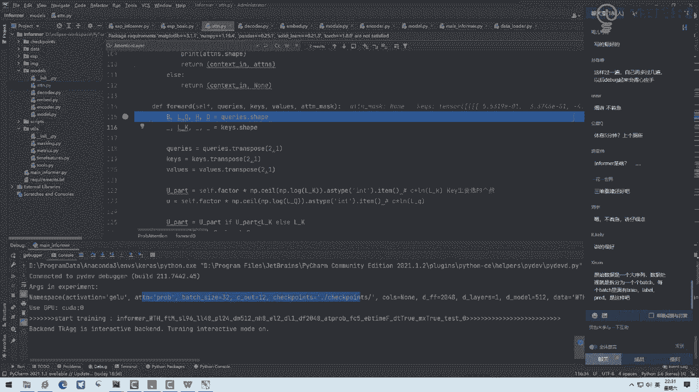

我们再继续，咱们休息5分钟，大家该干啥干点啥啊，我们休5分钟。