# 一口气带你吃透【Python机器学习与量化交易】保姆级教学，建议收藏！（人工智能、深度学习、神经网络、计算机视觉） - P70：13.10. 10. 5-使用tsfresh库进行分类任务(Av645162040,P13) - 码农卡卡西 - BV1un4y1R7j1

嗯这节课啊就给大家来讲一下，当咱们拿到了一个时间序列之后啊，我们这回就不想去做回归了，比如说现在呢我有多条时间序列，然后呢我想做的是一个分类的任务啊，就是说现在有个场景，比如说我们拿到了一些数据。

然后这些数据啊它都是一个时间序列，我想看一下这批数据当中啊，哪些是正常的，哪些是异常的，做这样一个二分类任务吧，那这个分类任务啊，和咱们之前讲的这个二维码的一个，回归模型就不一样了吧，回归模型说的是。

咱们要拿这个历史值去预测一下当前值吧，或者说预测一下未来值，但是分类呢就是说现在我有好多条时间序列，比如说现在我有这么多种啊，ABCDEF多条时间序列啊，我就想看一下嗯，什么样的时间序列。

它是符合一个正常的，什么是一个不止不正常的做分类，那你做分类该怎么做啊，咱们之前想一想，咱们之前讲的一些分类的案例啊，是不是在我去做之前，我都要把数据进行一个处理啊，相当于什么。

相当于是先做特征的一个提取，有了特征之后呢，基于当前这批特征再去做分类吧，那我们的一个时间序列数据啊，要做这样一个分类任务，一不一样呢，其实啊也是一样的，我们第一步要干什么，第一步要分析这个时间序列。

在我的一个实验序列当中啊，我要提取出来一些可用的特征，比如说啊当前的一条序列嗯，它有什么特征呢，都是一些基于统计上的特征啊，比如说它的最小值，它的最大值，它变化的一个频率，它的一个均值。

这些啊都是它可利用这个特征吧，那所以说呢我第一步啊，要先把我的一个时间序列进行特征提取，给它提取成了这样一个特征数据，然后呢用我的特征数据啊，进行一个这样的分类任务，那现在问题来了，哎呀。

比如说你现在一个序列要进行一个特征提取，大家可能觉得哎呀算一个命值，算一个最大值，这个比较容易，但是呢就是自己写起来啊还是比较麻烦的吧，一个特征你要写几行代码，一个特征要写几行代码。

有没有一个现成的工具啊，能帮你就是把这样一个呃呃时间序列数据啊，直接提取成特征呢。

其实啊也是有的，这里要给大家介绍呃，另外的一个Python库啊，叫做一个ts啊，time series的一个flash这个库啊，就是可以帮我们自动的进行一个。

时间序列的一个提取嗯，给大家简单来介绍一下吧，首先就是说一下他做了些什么事啊，这个比如说啊就是我的一个时间序列数据吗，在我的时间序列数据当中啊，我们来看一下它，就是说它会提取出来很多种特征啊。

然后看一下文档，就是说最多可能提取出来上千种特征，它就是依照啊咱们的一个这个时间序列啊，帮我们在时间序列当中，基于统计的特性能进行一些提取吧，比如说我们来看这个最强啊，咱们的一个均值啊，最大值最小值啊。

还有它的一个峰值，我们看可能有一些波峰啊，波谷啊，中位值啊，均值啊，这里他写的比较简单，最小值之类的，可以帮我们在一个时间序列当中啊，就是基于统一特性提取出来的，很多内在的一个特性，然后内在这些特征啊。

是不是我们都是可以利用的特征啊，这个库啊就帮我们做了这样一个事，输入是一个时间序列，然后呢它自动的帮我去提取好啊，当前的一个就是基于当前这个时间序列。

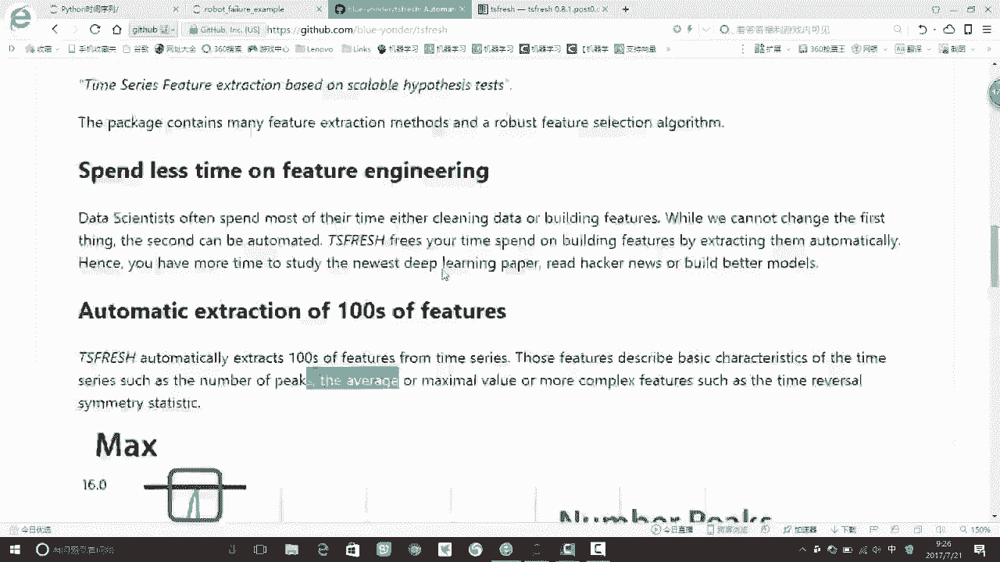

它的一个特征是等于什么的嘶，然后如果说大家想用这个库啊，给大家简单介绍一下，咱们这里啊不深入去讲，然后它这块有一个官方文档，我们直接打开就行了。

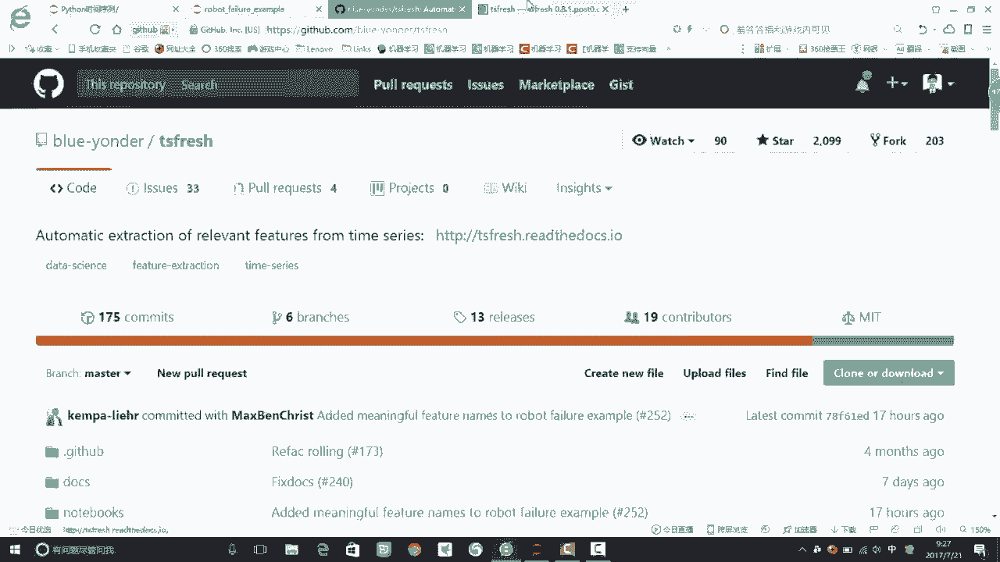

就是这个东西在官方文档当中啊，我建议大家就是有时间的话，如果说你现在手头要处理一批时间序列数据，当咱们实际啊想去做这件事的时候，咱们再来看就来得及，现在啊咱们只是一个了解操作就可以。

我们直接啊就看intro搭讪啊。

咱们就不看了，INTR达神里边他就介绍了一下呃。

我们这个库啊是怎么去做的，然后帮我们提取出来一些什么样的特征，然后对特征啊又做了一些事情。

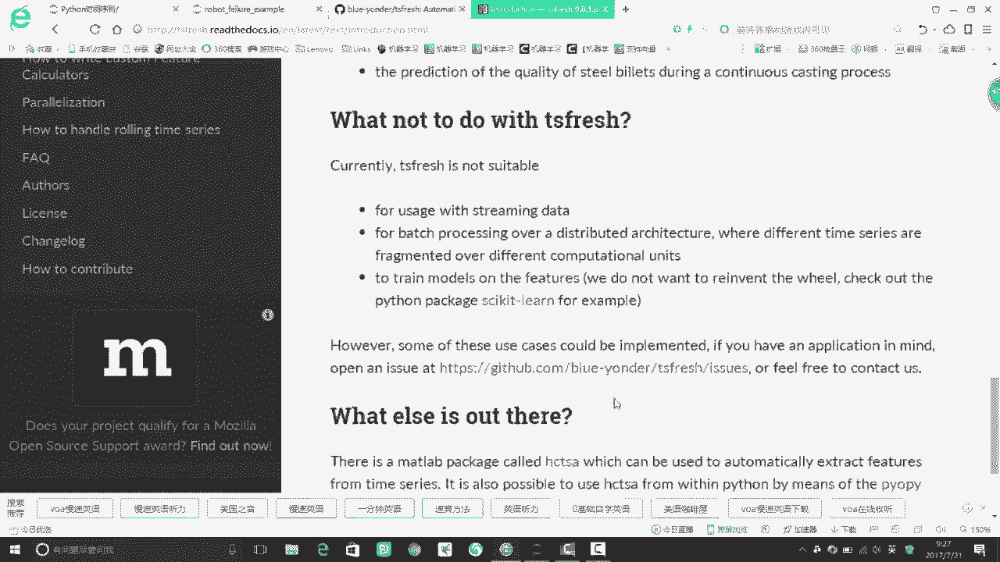

他还有一些reference，就是有一些论文啊，还有一些支撑他去做这样一个事的。

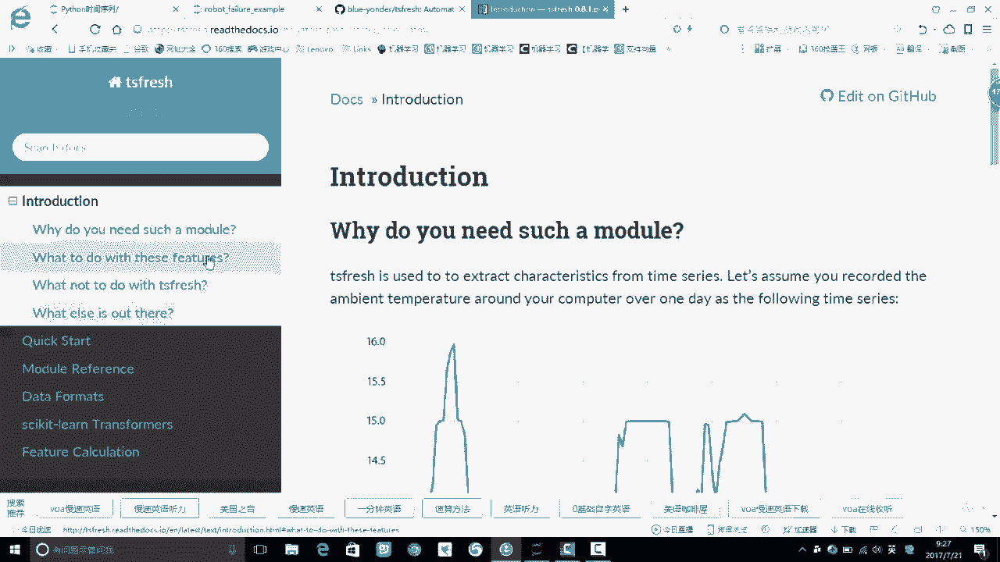

我们可以从啊这个quick start开始看起，这里呢他就告诉你怎么安比较简单吧。

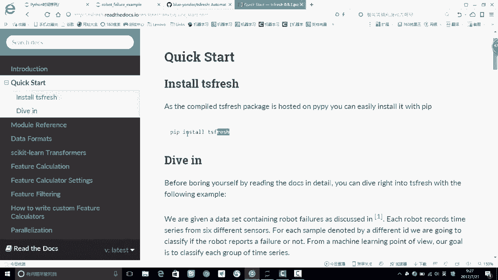

Pii p n store，然后turn呃，这个t s flash就可以了，然后他会给你啊，先举这样一个例子，这个例子就是一会要给大家讲的，这样的一个例子，后面呢就是呃先来看一下这个图吧。

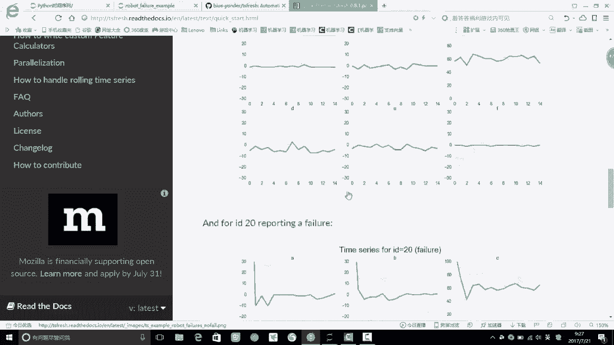

这个图啊，就是说一会儿我们要去做的一件事情啊，咱拿这个图来说吧，现在就是，假如说我现在构造了一个时间序列的一个数据，然后我统计的指标就是一个在机器上，比如说在工业上的一个机器上。

我的机器上有一些传传感器，然后这个传感器啊就是会统计啊，当前我机器啊在作业的时候，它的一些指标，比如说现在有ABCD啊，E f，然后有这样六个指标，我通过这六个指标就可以得到六个时间序列吧。

那通过这六个时间序列，我就可以看一下，当前的我的一个就是我的一个机器啊，工作是不是正常，那这个时候我们来看ABCDEF啊，都是比较平稳的，我说啊现在是一个正常的。

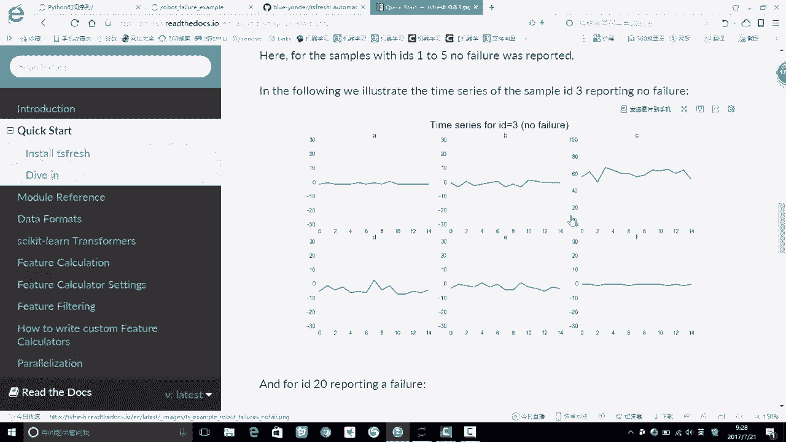

然后他有个label，就是说它是正常的，然后呢我还有个时间序列，我另一批时间序列来了，还是在我这样六个传感器上，ABCDEF它的一个序列啊，我们来看明显发生一些了，很大的一些就是浮动吧。

那这个时候啊我们得有一个label值，就是说啊它是一个异常的，那我们要做的一个任务，就是说根据根据啊我们的一个时间序列，数据去嗯分类一下，看一下什么样的一个时间序列啊，它是正常的，什么样的时间序列啊。

它是不正常的。

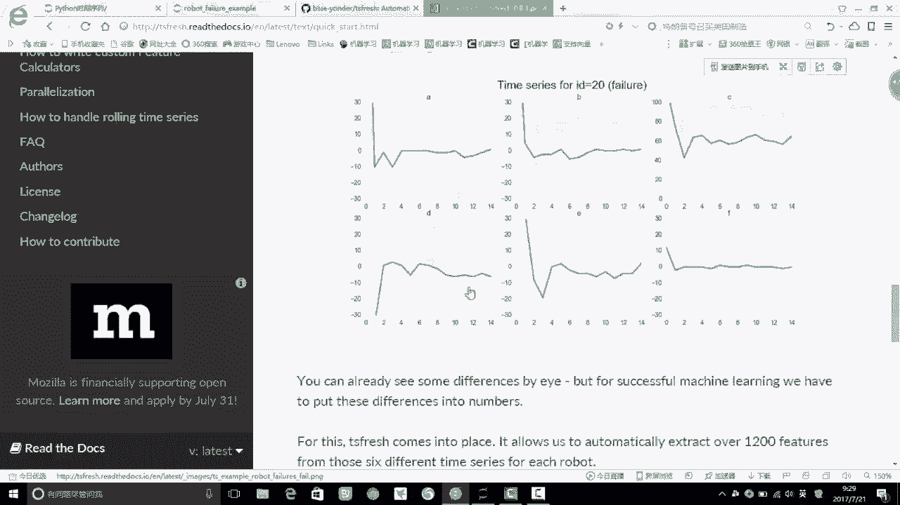

然后呢，把啊，咱们的一个出现故障的一个序列给它拿出来，这就是我要做的一个事情啊。

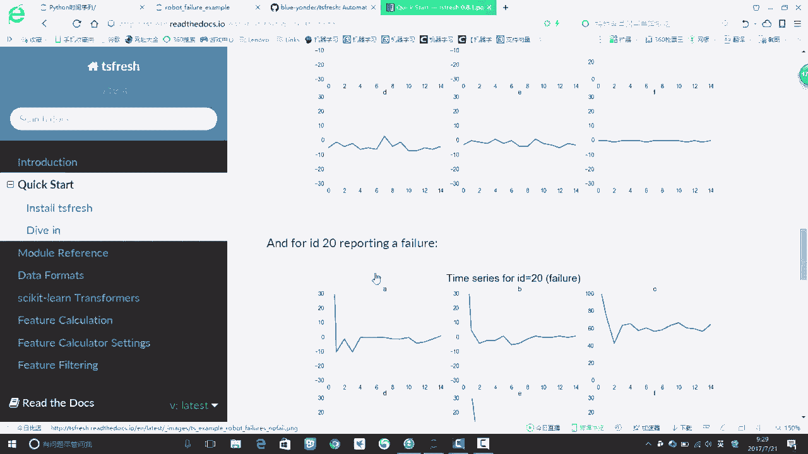

做这样一个非常简单的一个分类任务，然后这个库啊，后续啊，其实我在前几天啊，也是刚开始用这个库啊，然后简单的我都过了一遍啊，它这个库当中啊，每一个就是每一个模块它都有涉及哪些功能，然后这里呢就是它不光啊。

就是可以支持你的当前它现有的一些统计，如果说你现在想新加入一种啊，就是你自己定义统计，他也给你这样提供了一个例子，就是按照他的例子啊，往它的一个接口上，就是把它的函数都增加上去。

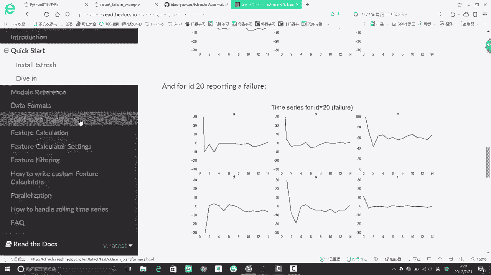

然后呢就可以啊，帮你提取出来你自己想要的一个特征，也是可以进行提取到，这个咱们就不带大家一个个去看了啊，留给大家当成一个课后作业吧。

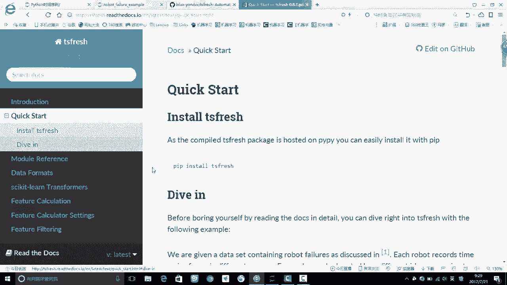

感兴趣啊可以一个一个的去看一下啊，咱们当前的就是这个嗯嗯这个ts sflash啊。

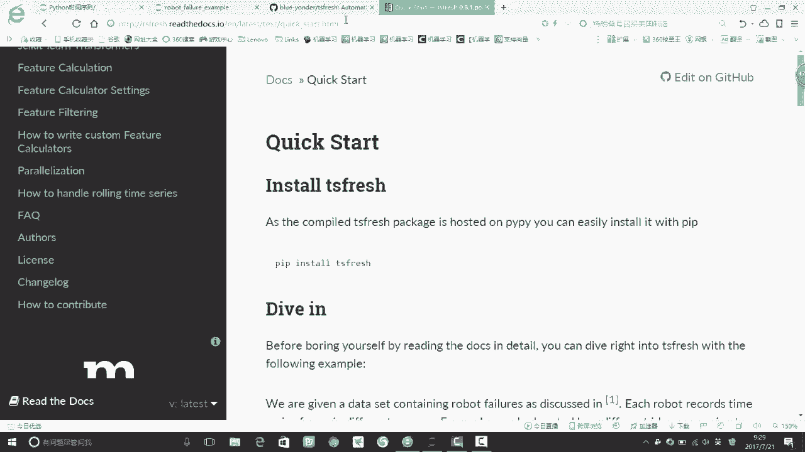

它的一个文档介绍，然后呢我把它呀放到这边吧，就是它的一个文，它的一个目录啊，这就是我的一个文档在这里啊，就是首先呢我是加载了一下我的一个数据集啊，这个数据集需要我们通过这个呃ts fresh啊。

进行远程的一个加载，就是首先我们去下载一下啊，这个函数都是我们在我们的这个ts flash当中啊，已经给我们指定好的，我们只需要把它导进来，我们来看直接导进来就可以了，通过这个库啊就可以下载到啊。

它的一个例子上的一个数据了，这就是我的一个例子，数据我们来看它是有一个嗯，就是有一个嗯就是左边是它有index值，然后中间是id，这是个time，然后后面ABCDEF是我的一个统。

就是传感器上我统计的一个指标是等于什么的，然后呢现在啊就是我去画了这样一个图啊，我就看了一下当前的一个浮动的状态，就是对于ABCDEF啊，不同的传感器它画出来值，可能这个呃红色的传感器对应的是C吧。

C啊它浮动的比较大，其他的浮动值啊是比较小的，先看一下我们的一个数据啊，是长什么样子的，然后呢我又看了一下，就是我们现在啊就是在这里边，就是有我不同的一个就是不同的一个数据吧，有一个正常的。

然后呢还有这样一个异常的，在这里就是我们通过他的一个id啊，已经进行指定啊，id3的时候它是一个正常的id，20的时候它是一个异常的，在这个正常的和异常的，我们就可以对比一下不同指标的一个差异的。

一个情况是长什么样子的，这里啊就是看了一下啊，异常和正常，他这个变化情况还是蛮大的吧，然后呢接下来啊就是我可以去啊，做咱们的一个这样的一个事情了，就是嗯基于我的一个时间序列。

我进行一个嗯进行一个特征的提取。

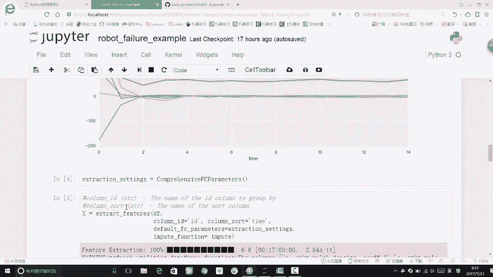

在这里呢我们就是按照啊他这个官文档当中啊。

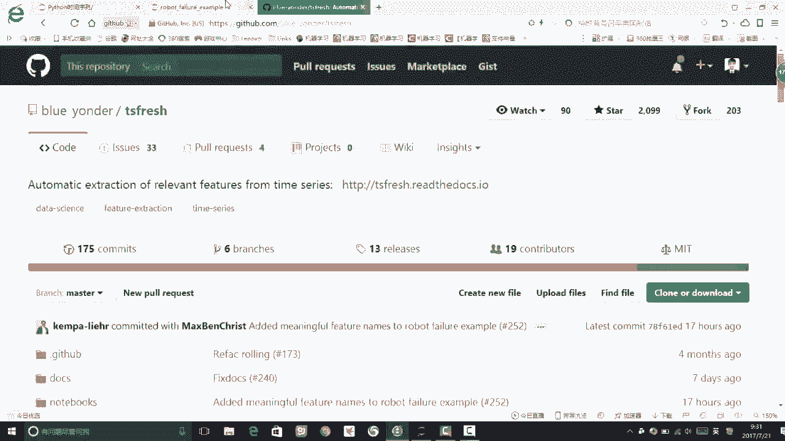

给我们的一个例子，然后直接把它的一个函数引入进来，就是啊我要进行一个提取，然后把提取先实例化出来，用我的当前啊这个提取的一个函数，实际的啊在我的data frame当中啊，指定好它的一个趋势。

然后就可以进行一个提取了，项目传进来的就是有一个id的值啊，就是id值是什么意思，就是一会儿我们要进行一个group by啊，group by大家都明白吧，就是以谁为以谁为东西啊，进行一个聚合。

这里啊我们来看它是以id吧，我们就可以这样以id为单位啊进行一个聚合，所以说我们需要传递的值啊，就是一个group by啊，以什么为group by，这里呢我们是以id为我们的一个聚合。

然后呢我们以什么为排序啊，就是以我的一个时间序列啊进行这样一个排序，然后下面呢就是啊，我提取怎么样进行一个特征提取啊，这个官方档当时都说了，我们可以用这个函数进行一个特征的提取，提取的一个方式是什么。

这个我们用默认值就可以了，那下面我打印了一个X点HX点head，就是我们提取完的特征吧，那这回啊我们可以看，就是他帮我们提取出来很多很多种特征啊，一共啊大概是有1000多种特征。

基于当前的一个时间序列啊，我们提取出来了这么多这么多种特征，这个特征啊它就是嗯在我的一个文档当中。

哎呀这个文档给关了，在文档当中啊，它对于每个特征都是有这样一个介绍的，感兴趣的话，我们可以一个特征一个特征的去看一看啊，都是表达一层什么样的指标，然后提取完特征之后啊，接下来我就可以去做这样一个分类吧。

那在你做分类之前啊，你也可以就是嗯嗯就是我们提取啊，就是我们这里它有自认的函数，然后就是提取一个最相关的特征。

在这里它会对特征啊进行一个过滤，然后这个过滤啊它是分三步走的，在他的GITHUB上它也是啊，这里他没说，然后在他的这个啊他这个官方文档当中啊。

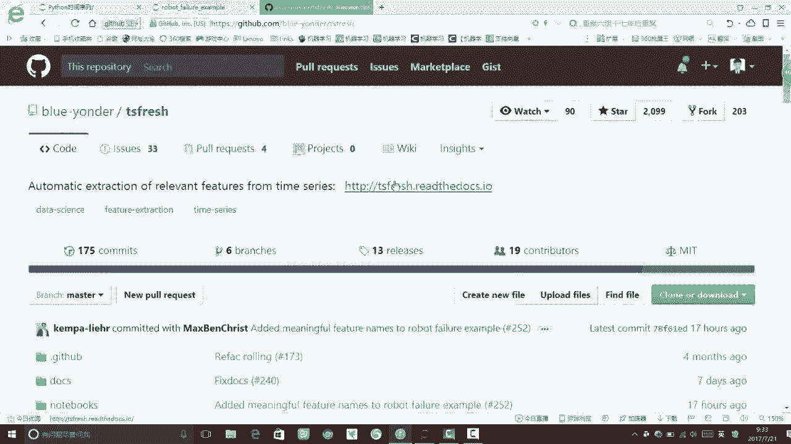

他是给你介绍了一下他这个提取特征啊，就是有这样一个过滤。

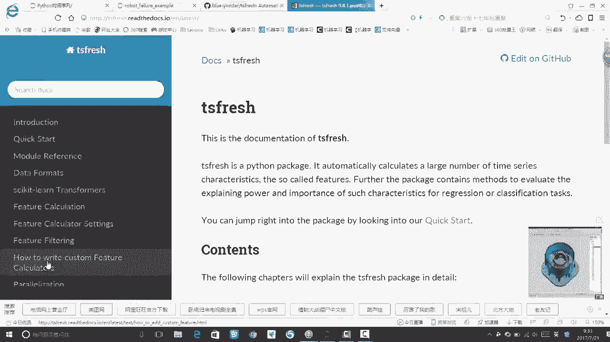

有这样一个filter操作，我看一下特征的一个filter特征，filter说他当时说了啊，是有这样一个参考文献，基于啊他这样的一个参考文献。

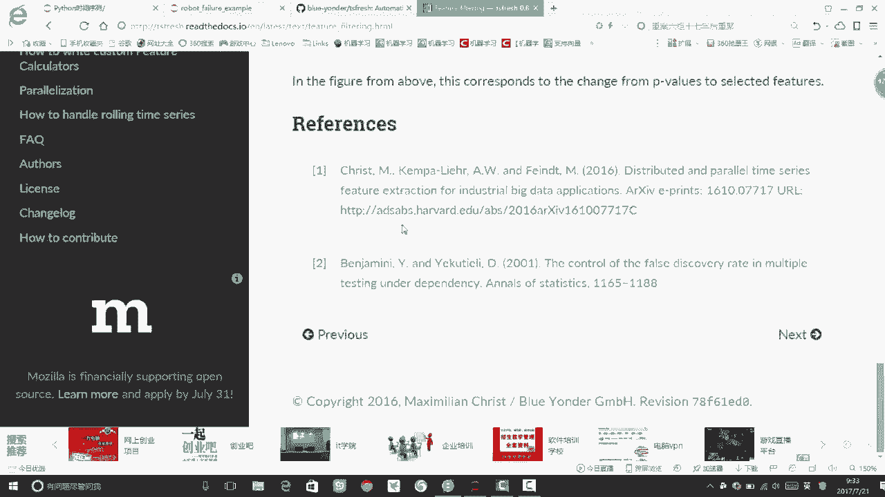

然后去做了这样三步走，怎么样去过滤掉啊，一些无关无关的特征。

感兴趣啊，大家就自己的去看一下，然后就有reference，然后我我也是刚开始看这个东西感兴趣啊。

大家就自己去看吧，我就不过多的说这个事了，然后呢这里我们可以对特征啊进行一步再过滤，然后得到一个新的特征，新的特征就是有300个就够了，然后呢我要做分类任务吧，分类任务怎么做啊。

咱们跟那个sk learn是一样的，先把我的数据集啊进行一个train test，一个split spr列完之后呢，我就是调这样一个decision trade classifire，我们来看前面。

我是不是又把这个sk learn引进来了，其实相当于啊这个ts fresh啊，就帮我进行一个特征提取，提取I特征呢，我就是给它放到咱们的一个decision tree当中，就可以了，DCNTRA啊。

算完之后我可以进行一个report，看一下procedure recor值，还有这个F1值分别等于多少，相当于是对我的模型进行一个评估吧，那从当前时间序列亚T出来的一个值看出来了。

嗯这个结果还是可以的吧，就是结果值啊都是偏高的，这个就给大家演示了一下嗯，怎么样啊，用这样一个第三方库，有这样一个啊ts的一个fresh，帮我们对时间序列啊进行一个特征提取。

当大家啊就是需要去做分类任务的时候啊。

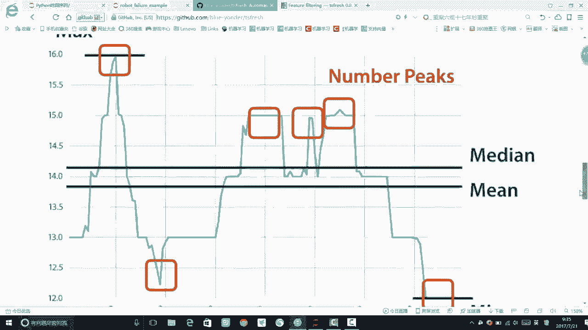

咱们再回过头来看，有这样一个库就可以了，你如果说现阶段你手里是没有一些时间序列，要分类任务，咱们就简单了解一下，了解一下，我觉得就可以了，实际用的时候再去看是比较合适的，然后呢这个TFLASH当中啊。

它有一个notebooks，就是这里啊，我们来看它都是ipad notebook结尾的吧。

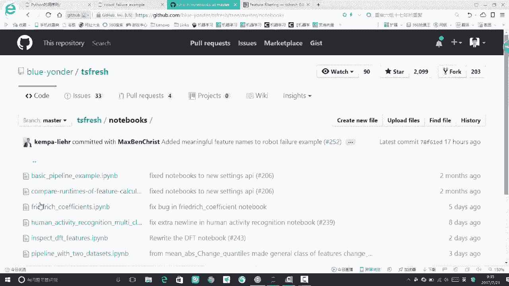

都是这样的一个文件，然后它里面有一些例子，等大家实际用的时候，咱们再看一下它的例子。

以他的例子啊为参考也是可以的，那这个就是咱们一个特征啊，一个分类任务啊。