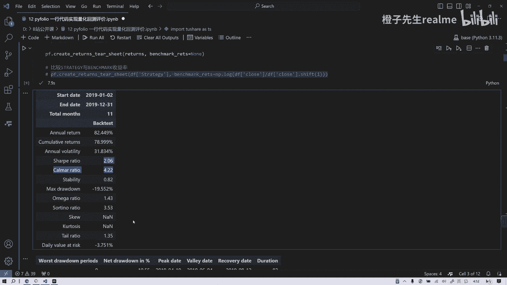
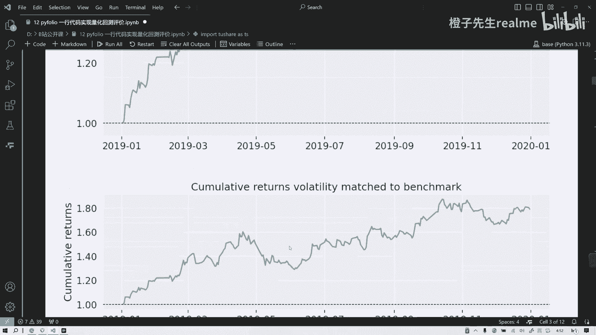
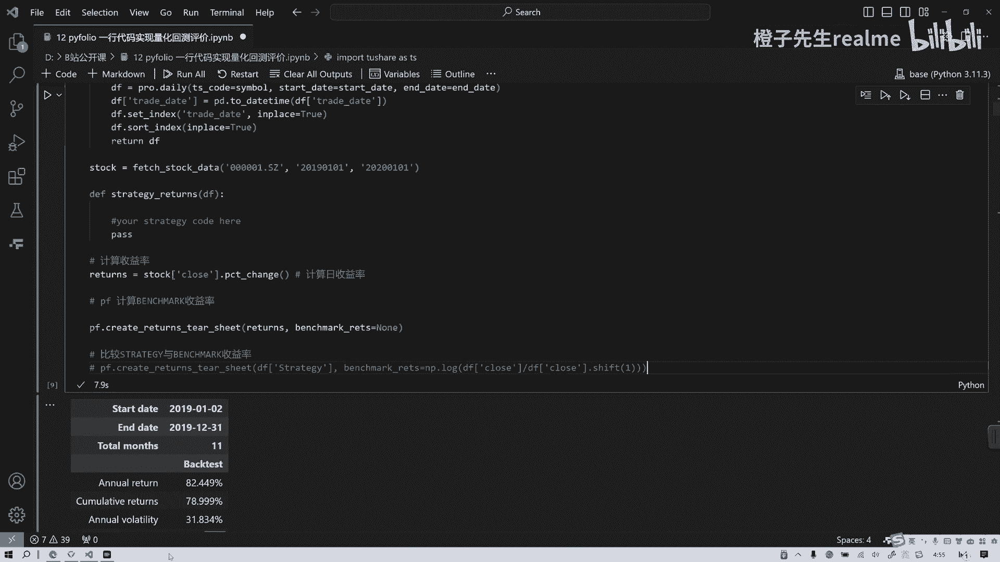

# 一行代码实现量化回测结果 - P1 - 橙子先生-量化 - BV1ty421v7qK

各位朋友大家上午好，今天起的比较早啊，给大家录一节课，来说一下怎么样通过一个Python库PFOLIO1行，实现专业量化回测图表，用一行代码来实现这个灰色图表，之前也分享过很多工具。

但是这个呢我觉得是更加方便的，如果大家如果早些年开始做量化的话，应该知道在10年以前有个公司的宽窄片，它是全球最大的一个开源的量化公司，国内现在基本上几乎所有的量化平台，都是效仿它的模式。

就是通过一个数据的开源，然后函数的共享，策略的共享来来培植自己的用户，然后通过这种策略的分包来获得一些收益，但是很遗憾的是，这家公司在在202021年左右吧，他就破产了，可能也是因为它的商业模式呃。

是不挣钱的，就这种很难种包，这种策略很难中包，因为一般挣钱的策略大家不会愿意分享的，很少有人像我这种分享懂吗，大多数人都是闷声发大财，然后呢分享了很多也是初学者，就是大家其实并不能通过这样一种机制。

或这样一种商业模式来挣钱，所以后来美国的风险投资人他又撤资了，这个企业也就破产呃，他是我，我觉得这个企业应该是一个比较伟大的失败者，为什么叫伟大呢，他以一己之力吧。

或者说以公司的力量整个推进了量化的普及，当然现在说到那个马斯克，也是比较也是比较厉害的，他也是推广了大模型的开源，和和那个OpenAI完全就是不同的模式是吧。

所以他也是调侃说OpenAI应该改名字叫close AI，我觉得应该是这样，那么咳咳，言归正传，py folio它是这个宽片开发的三剑客之一吧，三大主主要的这个开源工具AVALANCE。

我们已经介绍了就是多因子投资，最主要的就是阿法，包括现在很多券商都用这个，很方便本地回测到本地检验，第二个是zip line，zip line它是类似于一个什么呢，呃就对标border，Border。

它是一个开源的回收框架，但zip line更方便，你看现在包括现在很多大家如果做实盘交易，知道那两个主流的软件我就不讲了，那两个主流的软件直接和券商能够连接的，我看那里面的函数基本上也是呃。

我觉得是参照了zip line，非常名字都很像，包括很多什么宽啊，三大框啊，它都都是参照的，所以如果大家想真正的弄明白，国内这些在线量化平台是怎么用的，函数怎么用的原理，可以读一读ZBL的源码，读一读。

大家就知道它的原理，就是基于这种事件驱动的一个灰色引擎吧，它是也是很牛啊，完全开源，那今天讲第三个，为什么不讲zip line呢，因为zip line他现在很多已经不维护了。

呃其实你在交易来说一下价值不大，但研究价值很大的嗯，PYPYF6还是还是非常实用的，很多人还在用，然后呢他能弥补back trader的一个缺陷，就是back trader。

它在显示图表的时候是一种一种原主的方式，一种很让人很不舒服的方式吧，而PFOLIO它一行代码就实现非常漂亮的，量量化指标的展示，量化回测各种指标的计算，我们呃背景讲了这么多，我们就开始讲讲代码好吧。

第一步，如果大家没有Python环境内，如果没有这个库，请大家安装用pip install pfolio reloaded，这个这个项目是一个，研究人员维护的吧，他可能也是一个专业投资人。

他有一本特别有名的，教科书也是之前在小红书给大家推荐过，欢迎大家去看一下，叫什么呢，这本书非常有名，来看一看，我没记错的话，应该是这个这个作者来维护的，下载完了以后呢，就通过阿里云的镜像下载。

那下载完以后我们就可以引入相关的库，p folio spf浪漫pandas是数据分析库，to share是开源的，哎现在也不能说开源就半开源吧，你能用的数据还是比较有限的，如果你要用一些多的数据。

可能要也是要他冲积分什么的，但是基本的数据可以保障比较方便吧，我觉得这个也是很方便，第一步就把库引入，第二步呢就是在token之内要输入你的token，我一开始我刚开始考学量化的时候。

好多年前我一直就在这个地方卡住了，这就很搞笑，他说我看那个介绍是输入你的token，我就写了your token，我就一直写这个，我简直是当时实在是太搞笑了啊，那会儿也是踩过很多雷啊。

我希望大家就是现在很多问题就不存在了吗，直接搜一搜这个大模型就可以就可以知道对吧，然后引入这个道坑之后呢，咱们就有了pro，这是一个获取数据的API接口，然后然后获取接口呢。

我们我们写一个函数叫batch stock data，就是获取这个关于函数的方式，函数方式比较方便，你以后可以再复用，你就不用再改里面逻辑，你直接在这写代码，时间开始时间结束时间就一直都可以。

就一直可以用嘛，好第一步把这个获得数据函数写好，写好代码，如果大家连这个都因为我，因为我的我的听众很多种水平的吗，不同不同的水平，如果连这三行代码都听不懂，那你要不好补补课了，你至少把数据分析补一补。

这可能也不是短时间的，如果你听不懂，那你就略过好吧，就略过，能听懂的我也不讲了，讲了很多遍，今天重点是在于怎么用那行代码实现回测，回测的那个结果嘛，所以数据来了，数据其实就很简单，就是一个股票。

它在2019年至2020年，这么一年的收盘价，开盘收盘最高最低交易量等等，这些数据获得数据以后呢，我们就一直持有叫被动持有策略，我们也叫match Mark，被动是有策略，那计算每天的收益率。

每天收益率就用收盘价点不t c t change，这是一个日收益率的函数，就可以收计算它的日收益率，然后日收益率呢我们如果一直持有，不买不卖的话，在这种情况下，那这个是不是就是你的投资收益率对吧。

就是你投资收益率，然后把这个收益率直接传入到pf，这就是那一行代码，这就是那一行代码，刚讲诶一行代码实现回收结果就是这个returns呢，就是这个收益率把收益率的传到这里。

benchmark这里是none，当然了，如果大家在以后写策略的时候，把策略的代码封装在这个函数里面，你可以写一个strategy returns封装在这里，比方说什么双均线啊。

什么CCIISI等等这些策略放热，然后这也会生成一个DF点，什么strategy，把DF点strategy放在左边，把return放在右边，他就会画出一个有基准的每个图和指标，那咱们先看简单的吧。

我们这个是这个是后患，这个这个没有跑，这里没有跑这个，就是跟大家讲以后怎么做，那我们只虽然只通过一行的话，我们看看被动持有这支股票，它在2019年的收益率，你看这行代码输入进去出来就这么多遍。

当年的年化收益率是8%，12。449，累计收益率18。9，它的波动率下浮比例很高，2。06，这在回撤是-19。55，对指标，你这你这每一个指标，如果你没有这个他的这么一个调调动的话。

你要算你每个指标可能都要几行代码，一个两个三个四个五个，六个小，100多行。

然后呢你还得画图是吧，你这一个图也得十行代码，一个两个三个四个六七十，一十估计也是200行吧，所以一一行第200行。

可能很多学计算机的人说这很简单，我很会你很会你可以你可以去写代码，我我不会去阻止你，但是Python的风格就是不要重复造轮子，其实编其实其实看那个程序的发展，就是编程语言的发展。

也是从底层越越到底层越往高级的发展，你也可以用什么basic语言，C语言我们都学过小学学过小学学过basic语言嘛，就那会儿很早，20年前吧，20多年前小学生都开始学哈，你也可以学C语言都没问题。

但是呢编程的发展就是越来越高提升发展，所以现在有什么人工智能大模型生成语言，说程序员会会被淘汰，我觉得不认可这个观点，程序员不会被淘汰，他是以另外一种方式存在，他比方说是提示。

通过你你跟这个AI的互动提示出来有些代码，但是目前来看提示他有很多的bug，就是你提示你跟他提示还不如你自己写的，我现在的感觉还不如自己写的，尤其是在金融代码，就是量化金融代码上提示效果是最差的。

大家想想为什么原因，因为量化金融它和一般的比方说AI，什么视觉处理呀，什么图像啊，自然语言处理它有很大的一个区别呃，就套用一个金融学的术语，它是非标准化的代码，你比方说咱们在做这个深度学习。

一个最经典的不就是手写数字识别吗，那个东西就很容易通过AI提示，现在好像是微软搞出一个什么玩意，儿，什么副驾驶舱copilot说，那就通过那些东西，清华大学计算机团队，搞出了一个一个很好的东西。

我就像清华大学这个团队的也是一个提示，但这些AI辅助写代码呢，只能在一些标准化的，比方说在数据库提取某些数据啊什么什么的，但是在金融方面效果非常不好，我说这话是有根据的，因为我一直在用。

是一因为计算机它很难写出这种个性化的代码，就是第二呢，计算机它无法像人一样产生主观的策略，就因为这两个原因存在，所以我觉得AI在量化方面的应用，可能是最后三天时间最困难，效果可能也是最最最不理想，好吧。

今天就分享到这里。

