# 一键自动生成笔／线段，再也不用自己画买卖点了 - P1 - 量化交易邢不行啊 - BV1yKDfYrE6Q

大家好。

我是专注于量化投资的，行不行，关注我科学投资不盲目，前面我们讲的成功和失败的比，分别是什么样子的，这就自然衍生出了另一个问题，刚刚做对了小测试的同学，可以很快发现图中啊，只有分型A和B可以构成一个比。

B和CC和D呢则都是坏掉的比，然后呢通过简单的观察，我们可以发现顶分型D的最高点是高于B的，也就是说虽然AB形成了一个上升的比，但是上升的趋势并没有到此就结束。

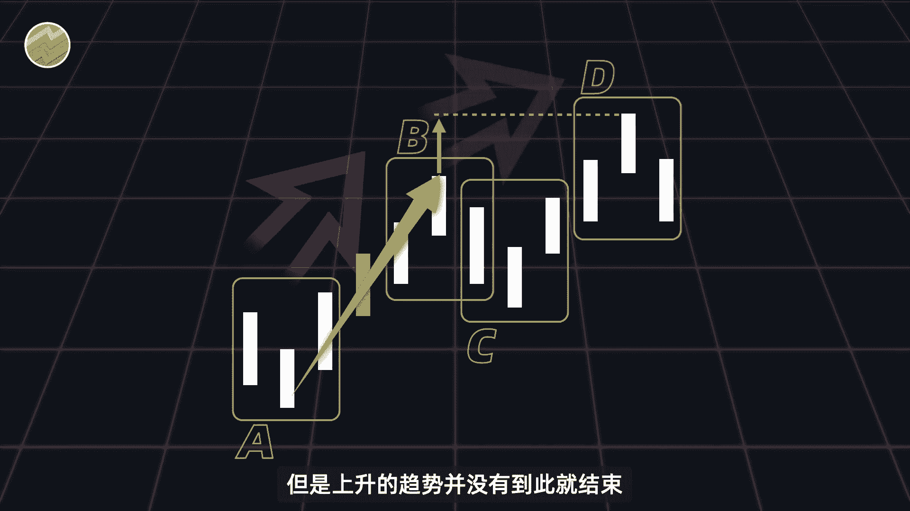

而是一直向后延续到了分行地，缠论的作者缠中说禅呢。

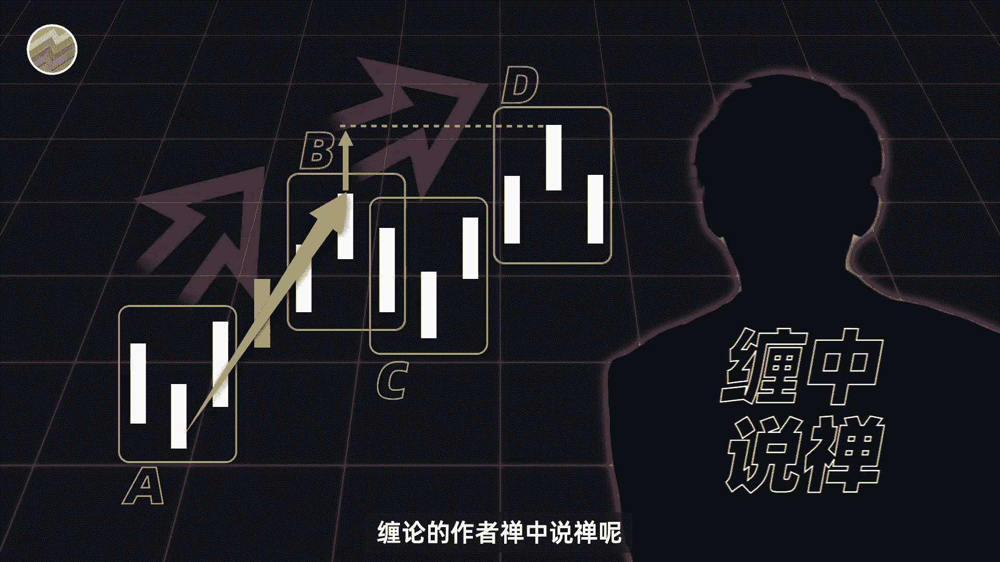

就认为此时上升笔不应该画到ab为止，而是应该将这一笔向后延伸。

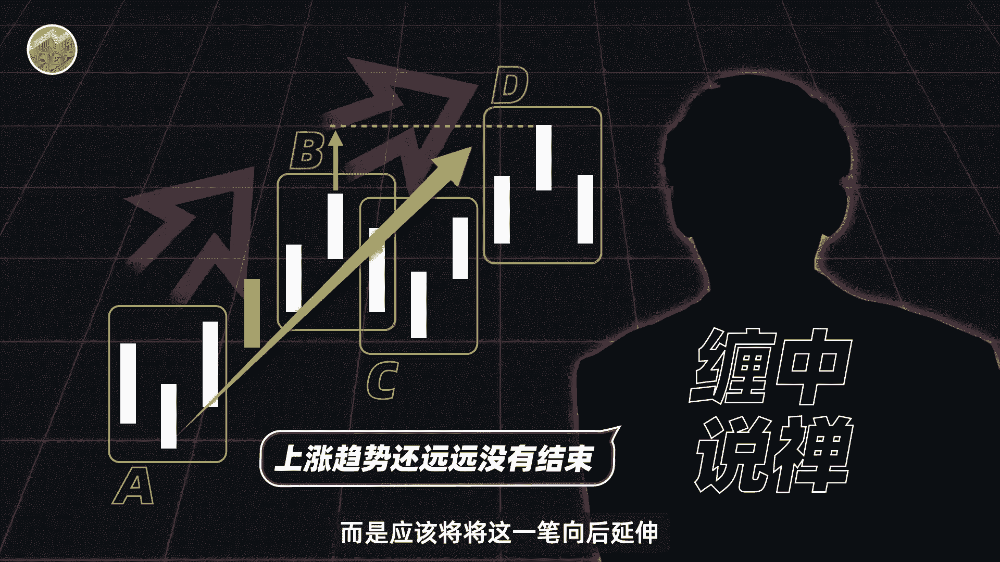

形成一个全新的笔记，a AD笔，用于代替原先的ABB，我们呢则继续向后画K线，如果仍然是坏掉的笔啊，之后呢又出现了一个顶点更高的顶峰型，比如说是F，那此时我们AD这一笔就需要延续为封闭了。

我们可以一直这样画下去，如果一直像之前那样，那么上升的趋势就会无限延续，这一笔也会永远画下去，子子孙孙无穷尽也，这就是缠论中所谓的笔的延续，那这样的延续何时会停止呢，也很简单啊。

我们仍然来看最初的这组K线，并同样向后画K线，但我们这次画的K线呢和上次不太一样，这次在顶分型D之后呢，同样出现了一组底分型E，但两者之间有一根独立的K线存在，聪明的朋友应该已经能够发现。

分型D和E可以构成一个完整的下降比，和之前的a AD的趋势呢是完全相反的，那此时呢我们就可以认为AD不会再向后，延续向上趋势了，这就是缠论中比的终结，简单来说吧。

就是缠论中呢会用一个新的反方向的笔的出现，来做上一个笔的结束的确认，所以啊对于比我们可以做个简单的总结，顶分型和底分型间存在至少一根独立的K线，构成比，比延续原有趋势，直到出现反方向的比作为终结。

最终所有的比两两相邻，并呈现出上升比，下降比上升比的循环。

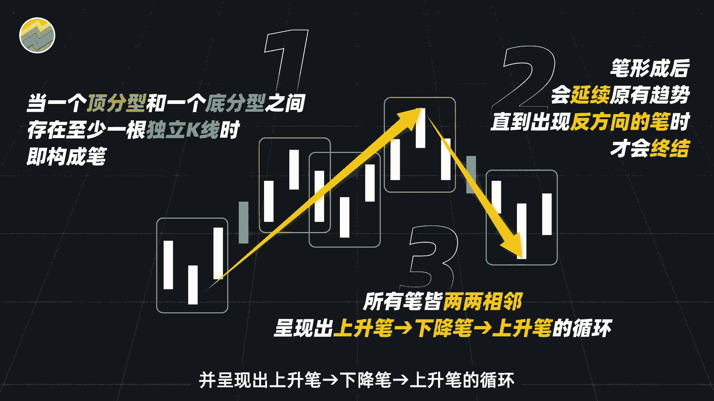

可能有人听我讲解，有点被绕晕了，但这其实已经是我们简化过后，并且基于可量化的标准去做了处理后的结果，你去看原版的缠论会更加的模糊不清，所以如果觉得没有听懂的话。

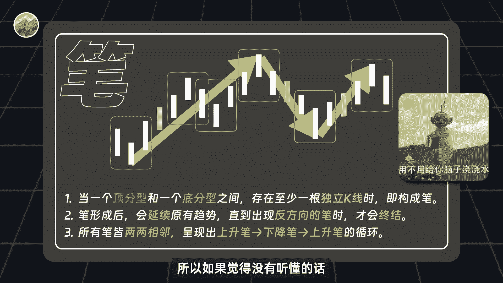

建议可以再看一遍，看懂了笔的构建，后面要讲的线段就可以说毫无难度了。

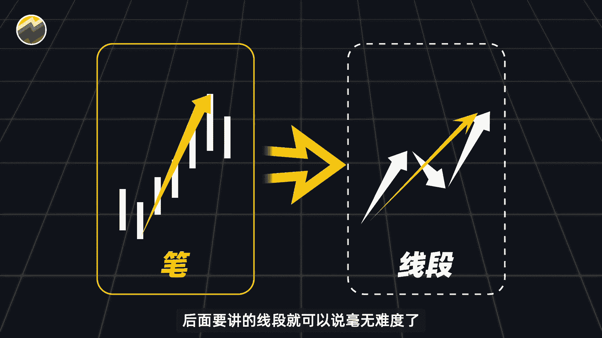

如果我讲的内容对你有帮助的话呢，也可以三连支持一下，当然啊，肯定还是会有人觉得，我说的缠论的量化是不对的，这就像我开头说的一样，每个人眼中的缠论本就各不相同，我只是按照我的理解去尝试介绍并且量化它。

仅此而已，我也欢迎有不同意见的朋友在评论区留言，并且一起交流，传统的比，既然我们知道如何定义比，也就可以借助全部的A股历史数据和Python代码。

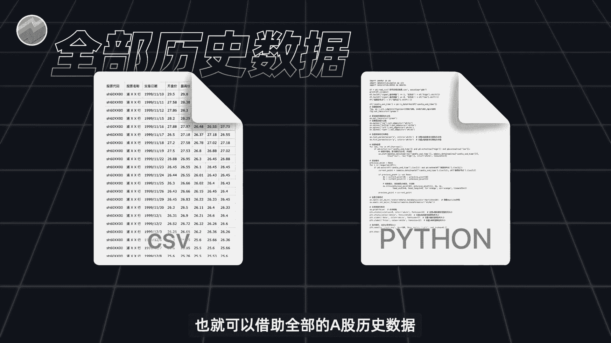

去帮我们找出历史上面笔，并把它画出来，画图所需的数据呢我已经帮大家准备好了。

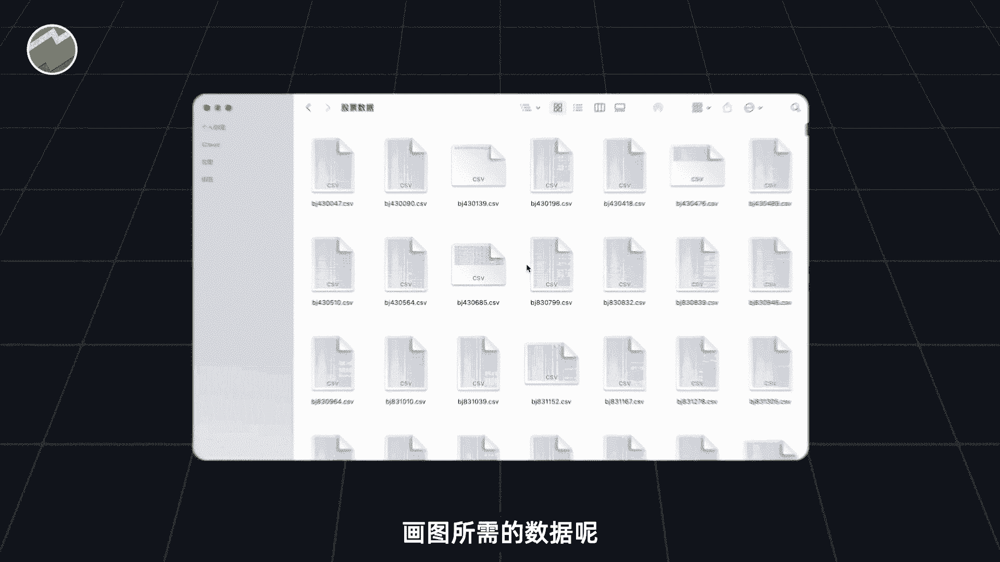

这里面包含了A股历史上所有5000多只股票，甚至是那些已经退市的。

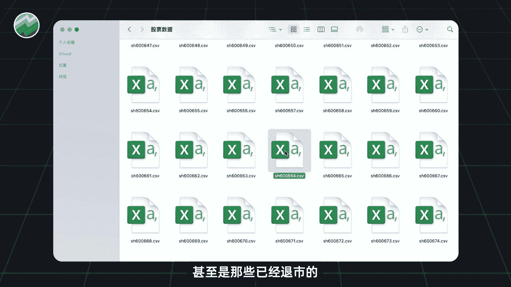

你可以打开其中任意一个文件啊，包含了这个股票从上市第一天至今，每天的开高收低的价格。

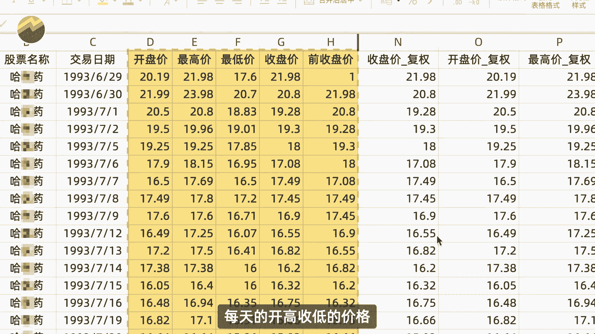

并且你可以计算复权价，非常的完备，画图的代码呢也并不复杂，你只需要点开这个Python的文件并点击运行，就可以得到标记出笔的K线图了，如果你需要这个数据和代码的话呢。

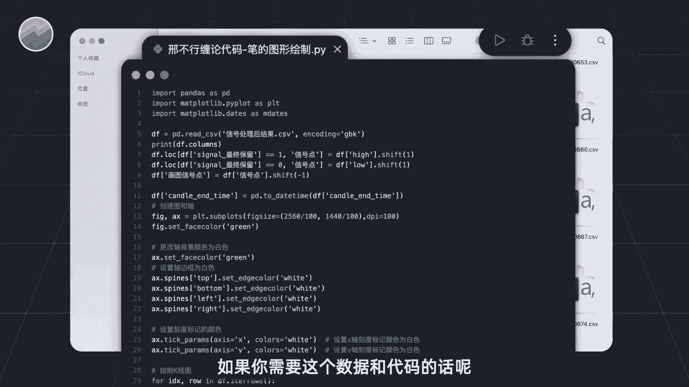

大家可以在评论区留言，也都是可以直接发给大家的好，那么我们接下来就来运行一下程序。

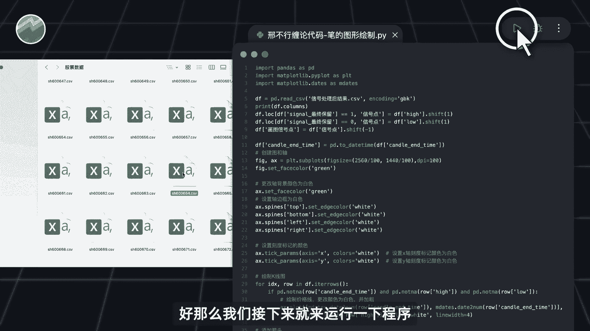

看看结果如何，程序的运行结果呢，如图所示，图中的橙色的直线，就是我们根据缠论的定义画出来的笔，记住这个图啊，我们肉眼能够很直观的看到指定时间内，当前股票的所有比非常的清晰了。

相信有了这个图能够帮助使用缠论里，你节省大量的时间去做更有意义的研究。

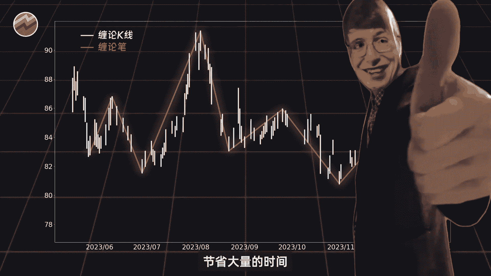

想必对于很多研究缠论的人来说，我们代码跑出来，这样的一组数据就已经很有价值了，毕竟之前啊，大家只能够照着行情软件的K线图去处理图形。

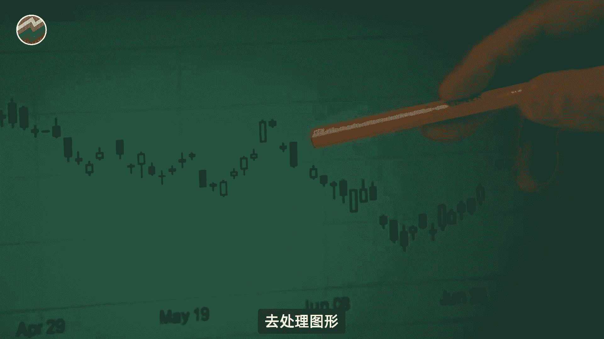

无法很好的快速找出所有的笔，会有种种的不方便，而我们这个图呢不仅包含了全部的历史数据，而且异常的简洁明了，没有一点多余的信息，懂行的，想必也已经知道这个数据和代码的珍贵了，如果你需要数据和代码的话。

大家可以在评论区留言，也都是可以直接发给大家的，需要注意的是，在实际操作当中，分行的信号的确认并不在顶点或者低点，而是在顶点或者低点之后的一天，所以理论上来说，我们生成的图呢应该向后平移一天。

我们这边这么画，只是为了让大家能够更直观的看出，缠论中的每一个笔，但不管怎么样，我们现在已经生成了笔的图，这个图呢看似也很完美，如果将笔作为买卖点的话，在最低点买入，在最高点卖出。

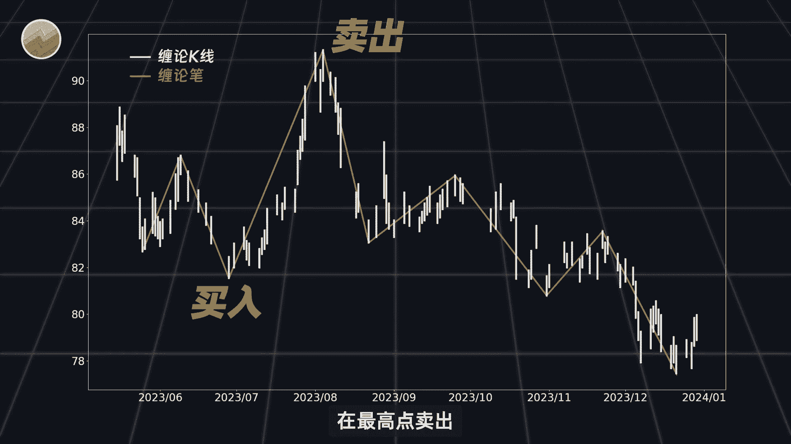

那按照缠论的理论，简直就是嬴政摸电门赢麻了，但是呢我想说的是，真的是这样吗。

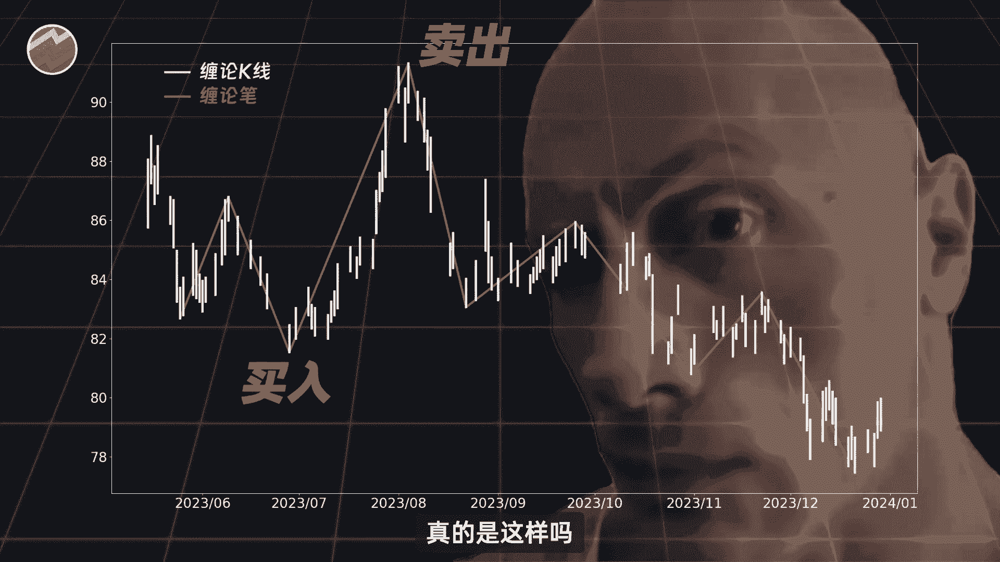

假设我们身处途中，必点这个交易日，此时呢处于下降比ab之中，但我们也不能确定，这一段是否已经完整的画完了，有可能他还会延续，可能会出现上升比去终结它，而当K线走到C点的时候呢，我们终于确认的上升比BC。

我们就在BC点买入这个股票，一直拿着，直到一点，它构成了下降比第一，那么我们确认了上升趋势已经结束，就卖出股票，在C点买，在E点卖，你看似稍微赚了一点啊，但一整波大行情你是完美错过。

单纯的用缠论的笔进行交易呢会有滞后性，如果用它作为买点卖点，很容易血本无归，当然啊，缠论中的比只是趋势的一个基础。

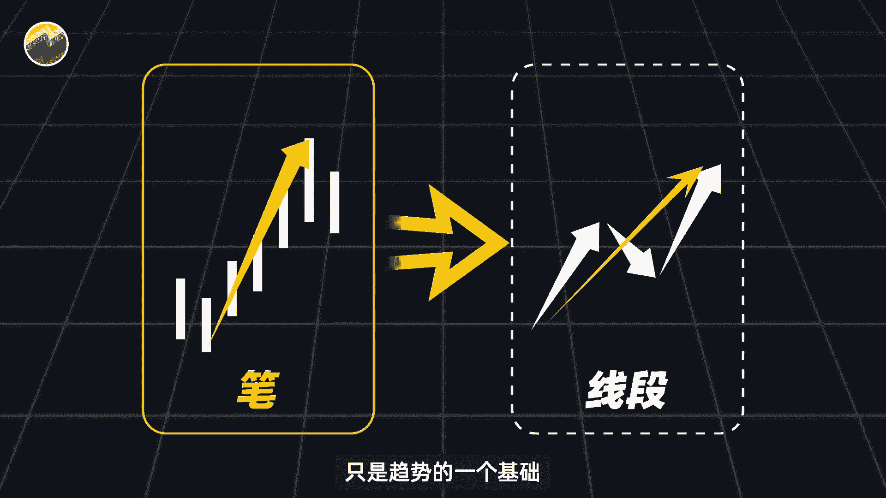

我们接下来呢就来聊聊由股市行不行，关注我。