# 吹爆！这绝对2025年讲的最好的Python金融分析与量化交易实战教程！从金融时间序列分析到因子选股实战，全程干货讲解，零基础小白可学！（人工智能丨机器学习） - P23：03-2-股票池筛选 - 迪哥的深度学习课堂 - BV1YFcbe8E8X

然后这里啊就是哎这个日期咱后续都能调，在这块，刚开始咱们就不调了，就是你的一个起始资金，然后一个呃咱就按这个每日啊，每分钟咱就不说了，这些咱后续都调，我就不管了，咱们先来写这个代码好，首先第一步在什么。

在我们的一个构造函数当中啊，我们要写什么呢，我说我现在啊不是这个S1了，他叫什么，这个沪深300是不是沪深300啊，直接用名字来写也行，你用代码写也行啊，呃把这个沪深300给他写进来。

哎这个是我们当前要的一个池子吧，好了，然后这打印信息我不需要了，那在这个池子当中，那接下来我们来写这个预处理，写这个预处理啊，就是咱们刚才说了，要获取哎它每天的一些财务的数据，那这些东西怎么去做啊。

来看这里啊，这有个帮助文档啊，大家用的时候把这个帮助文档啊全打开，所有咱们哦不是这个所有啊。

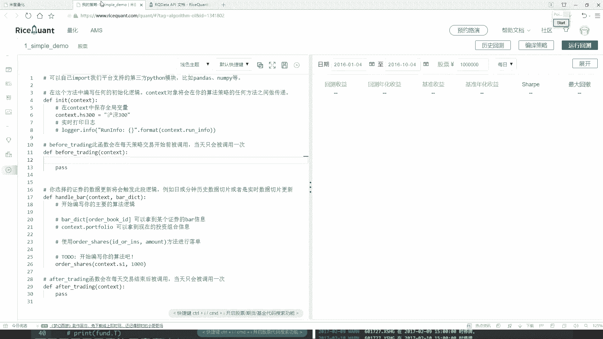

咱们的一些指标啊都在哪儿啊，都是在这些帮助文档当中啊，咱来去看的啊，其实说白了所有你要获取的一些结果，不是我列的，也不是谁说的哈，都是在这个文档当中，人家会给你详细的去写，哎咱们怎么样去查询呢。

怎么样得到结果啊，来看吧，我们去刚才说什么，唉，刚才是不是说咱们要去查询一些指标啊，那比如好比说你要查询一些什么，你看这里有好多啊，查询什么财务数据啊，各种各样指标都有吧，所以我说这像什么。

咱最开始就说了，量化交易这个东西说白了就是一个数据挖掘吧，里边涉及到的数据啊，太多了，各个指标哎呀都有，是不是，所以说能做的事还蛮多的，咱们今天啊这个小例子只给大家举一个例子啊。

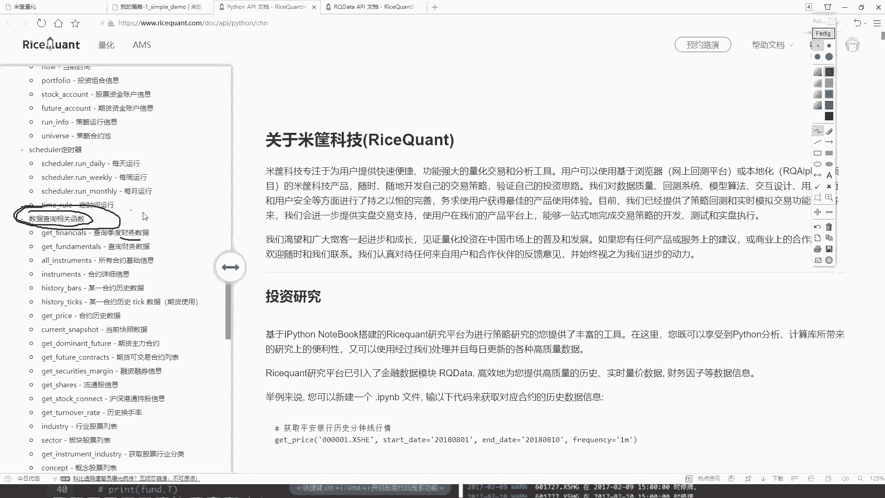

咱们不用太多指标，咱直接看这个就是查询一下它的一个财务数据，然后呢大家用的时候一定要这样，就是你先读一读哎，人家这个东西啊，它是呃怎么样去写的，你看这一块他说了哎，当前研究这个函数当中啊。

你得第一个参数给我传建个query，就是一个查询查询，什么意思呢，就在这块啊，他说了哎，他说这个query当中啊，你可以去填写你要查询的指标，并且呢可以用这个filter去过滤一些条件诶。

那跟咱们的需求来说是不是挺像的呀，所以这样我直接把这个呃函数直接复制过来。

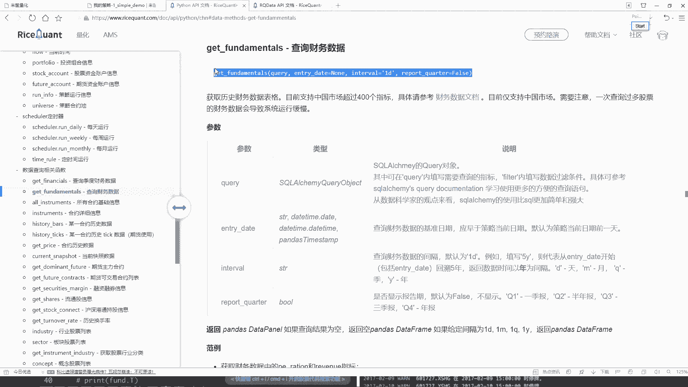

复制到咱们这个策略当中，我是在这里啊，首先第一步哎我说我要去做一个查询，然后呢后面这个东西咱先把这个东西都去掉，先写这个query，query等于什么，现在你要查询哪些个东西了吧，好啦。

query当中我说写一下吧，在我们单元query当中，那我要去查了查什么呢，我刚才说了查我的一个采唯物的，它的一个收他的一个收入情况吧，那比如说我现在想看这个财务收入情况，那怎么看呢。

在这里我们来点一看。

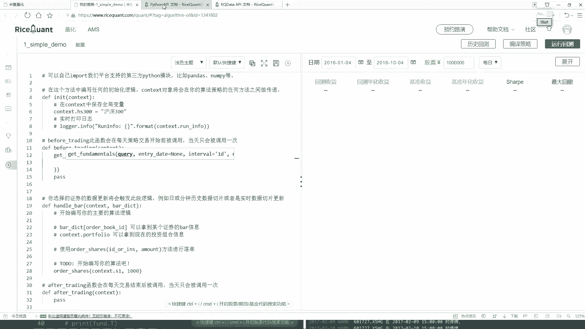

点开看一下，这里还有它的一些具体啊财务的文档。

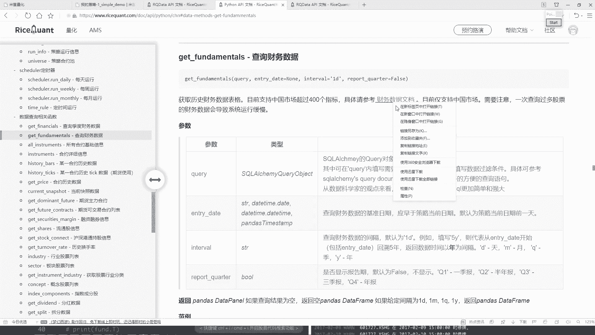

就是点开之后啊，他会告诉你哎咱们的数据当中啊，你都有哪些个字段可选。

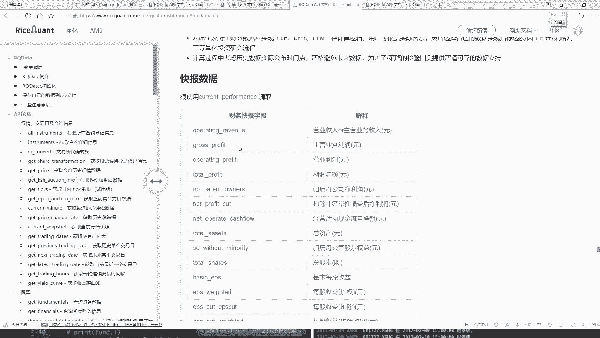

这个就不给大家一个去看了，到时候大家想看哎各种各样的字段。

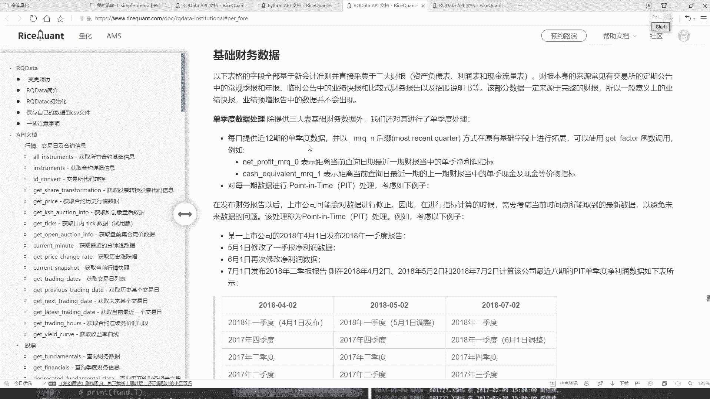

然后比如基础参数数据当中，我们可能要的就是呃它的一个营业的总收入。

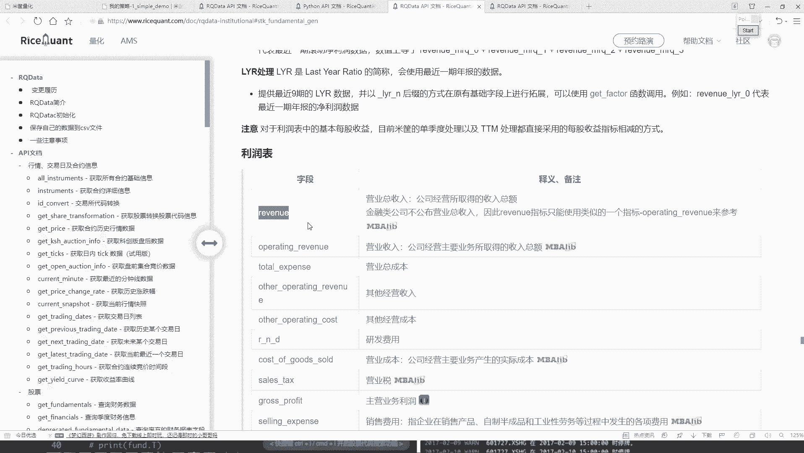

哎咱们用这个指标，其他指标咱们就暂时不看了，这里咱来直接写一下好啦，在我们的查询当中，首先第一个要查它的底下啊，查它的一个呃基础的一个营收的一个指标，然后找一下就是在这里它的一个营收的指标哎。

跑到这里营收为指标，那我们来想一想，就是对于它的营收指标，那现在好比说我查到手了，那查完之后干什么，那查完之后还没完，咱该说什么，哎是不是说我要去过滤一下，过滤什么，首先你现在去查的东西啊。

好像有点多是吧，有你要查的东西，你告诉我了，查谁的呀，你说还没指定啊，好了，咱们这块要指定一下，你在哪些个股票当中执行这样一个查的操作，所以说这里我要写一个filter，filter当中啊。

相当于呃你自己啊要去做一些判断了好啦，首先我们来判断一下，就是当前我们查的这个东西，我把它给它复制过来，当前我们要查的这个结果他怎么样，是不是在我们的一个股票实当中吧，好了，对他啊做一个判断。

那也就是说啊现在我们找到了，然后以及再找到它的一个代码，我看看这个啊应该是一个code代码，看一下他的code代码是否是在应该是一个in，我看看呃，应该是一个in就可以了。

然后哦对就这个in in就可以了，然后呢看一下它的一个呃股票代码，是不是啊在我们的一个股票池当中国标值啊，咱刚才是不是已经设定好了，就是一个沪深300是吧，好了这给他复制过来就行了。

然后呢现在我们做了一个判断，判断完之后，我们要干什么，哎呦现在只是做了一个判断，那我说接下来我们还要干什么，做一个排序吧，可能判断完之后，我们现在拿到多少个，300个，300个不是我想要的。

我要做一个order哦，我看一下o r d r order下排个序排哦，不是order，我看这名字好像变了，应该是一个order by order by一下order by什么呢，你是不是得告诉我哎。

现在你是按照一个升序，还是按照一个降序来玩这个东西啊，好啦，我说现在按照这个东西按照谁呢，按照呃这个吧，就是它的一个营收，然后按照营收的一个降序吧，咱是选什么，选最好的嘛。

所以说此时我说给他指定成一个降序，是不可以啊，那现在order by做完了，那还差什么，我说这里啊降序完之后可能哎呦这么多，那你不一定全用吧，后来我说咱们来限制一下limit一下，我们选多少个啊。

那你选十个是不可以啊，相当于在这里我说只选十个，我最想要的一个股票，是不是就完事了呀，这个给大家看了一下，就是我们第一步啊，先写了一下，在笔before trading之前。

我们先做了一个呃基本的一个筛选吧，并且给他排序好了，拿到了我十个我想要的，我这里咱给它起个名字，就叫做它的一个data frame吧，因为它返回时也是给我一个data frame。

然后把这个东西加入到context当中，一会儿咱还要再去用的行了，这里这样吧，我先给大家打印一下，看一看它能不能啊，把当前我们这个结果给它做出来啊。

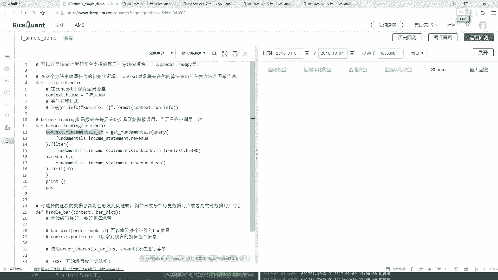

print一下，然后其他的其他的咱们暂时先不用不用的，我暂时给它先pass掉。

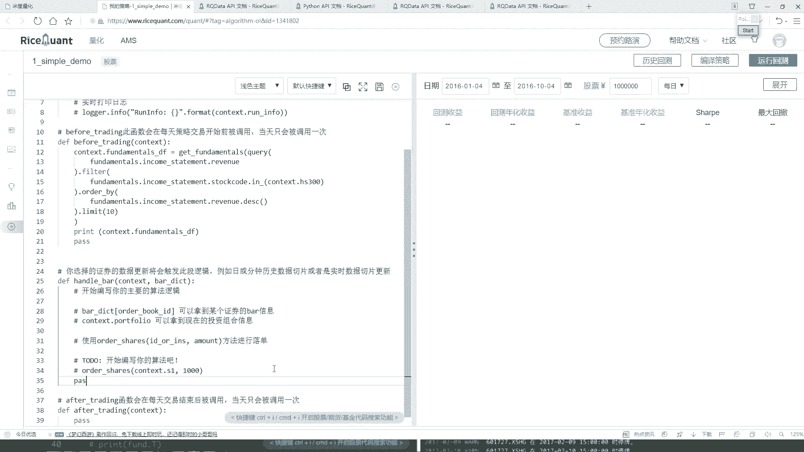

然后运行一下吧，先看一看能不能把这个结果给我打印出来。

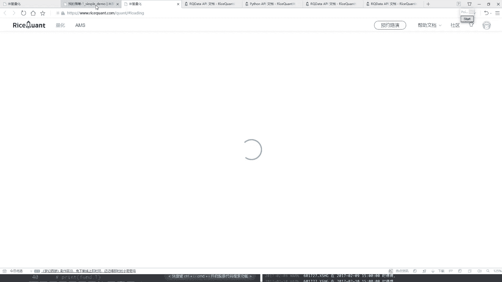

这个打印出来的结果应该就是呃，每一天他会都去打印，因为你看这个before trading这个东西。

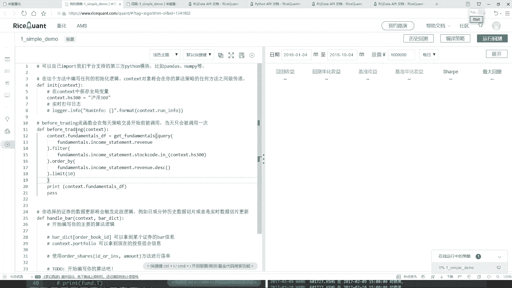

它是每一天都要执行这样一个操作吧，所以说哎呀这块有点小问题，他怎么没给打印出来呢，来看一看打印日志当中哦，它都是打印个空的，我再往下拉一拉。

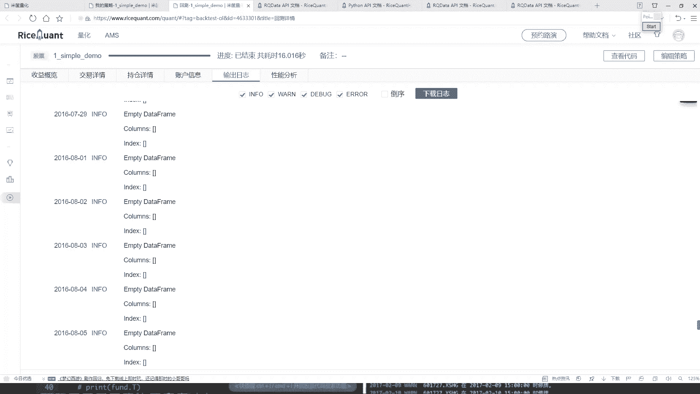

看是不是都是空的，都是个空的，没有打印出来行，咱们检查一下这个函数当中有没有什么问题啊，首先第一步我们把函数写出来了，然后写了一个query query当中，然后我说去查哪个指标。

就查它的一个财务的营收的指标没问题啊，然后指定个filter标准当中，我说我去判断一下，当前这个股票是否是在我的一个沪深300当中，然后如果说是啊，然后就是把沪深300当中所有股票都拿出来。

然后接下来我说做了一个排序啊，检查也没有什么小问题，打印为空的说明，在这个沪深300当中应该没找到这块，咱们刚才怎么想的，怎么怎么样了，这块是不是写或者算法不行啊，你是不是在指数当中去找啊。

所以这块我们之前少写一个index当中，我看一看它的名字，如果大家把他的一个名字忘了。

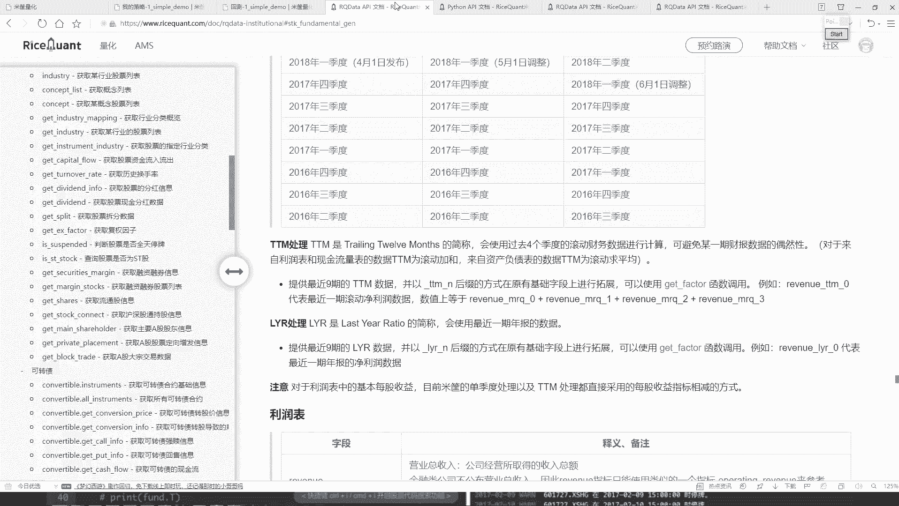

没关系啊，你都可以在AAPM的当当中给他找到，你看啊。

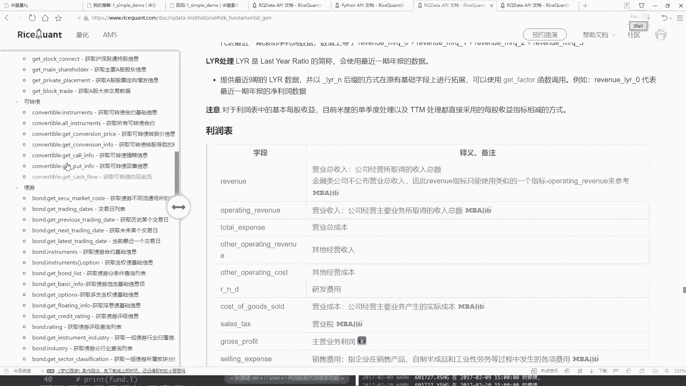

这是股票债券，然后找咱们找这个指数，这儿呢把这个指数这个拿到手。

然后给他复制过来好了，这是在指数当中额，然后写一下我这个名字就叫沪深300，这就行了，然后重新的咱们再来运下回测，看看这回的结果，这回应该没什么问题了，刚才我们的一个股票池子没指用出来啊。

这回咱们重新来看一下，看一下他的输入输出日志吧，你看这日志当中是不是有了第一天的，然后这个二零从这个201年1月4号，咱没改时间啊，这是它默认时间，然后有哪个你看第一次有这个呃，后几次哎呀。

这个看起来其实不是特别好看吧，这个他给出来这个结果是呃，这种情况就是横着是一个额股票的一个名字，然后下面它是一个就是每个股票。

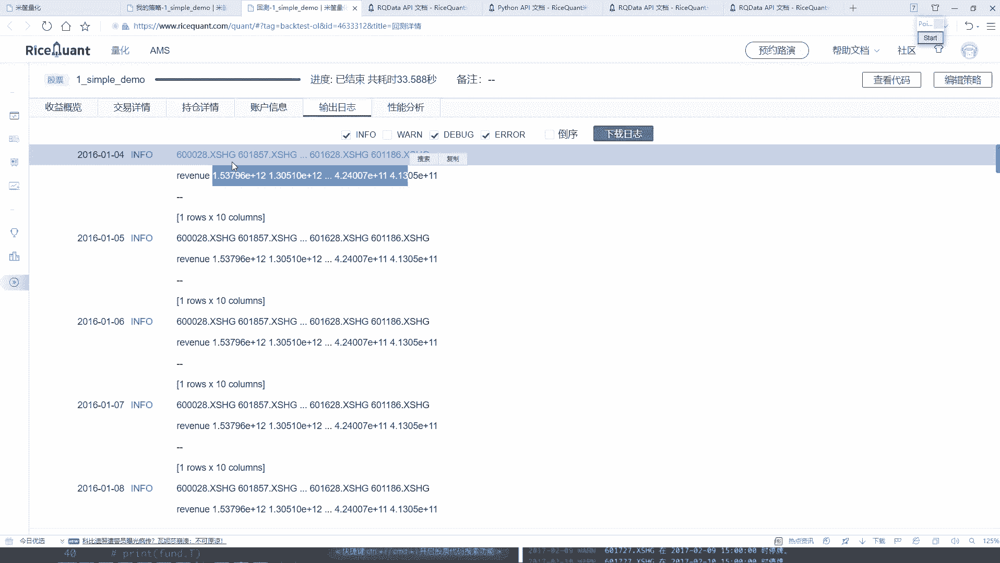