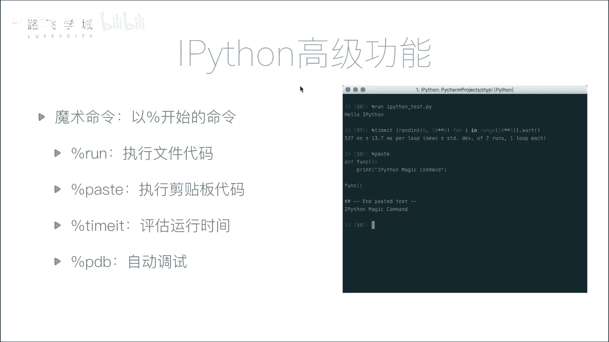
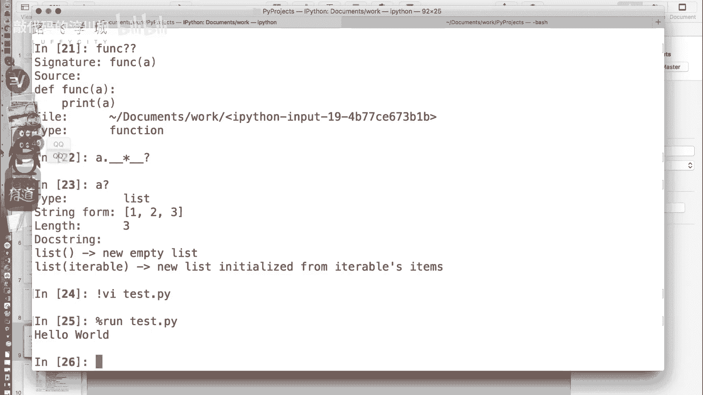
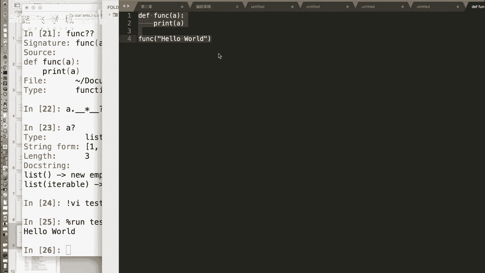
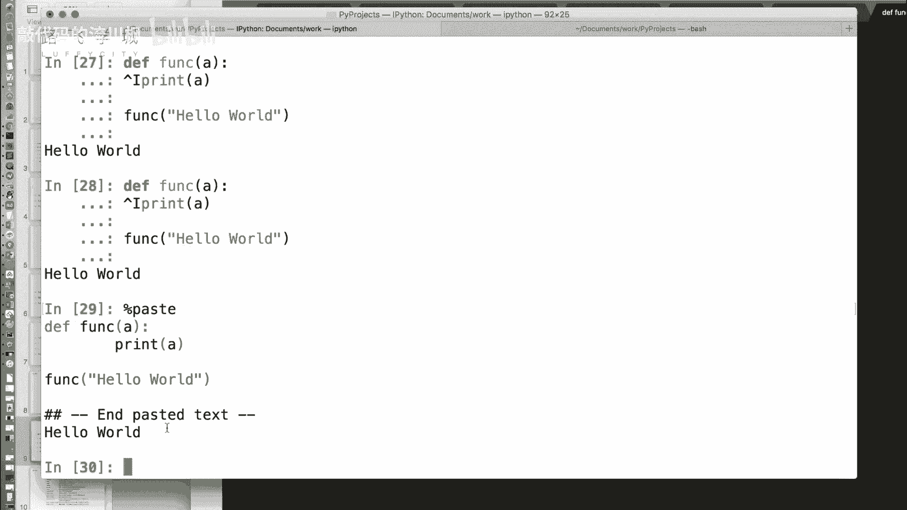
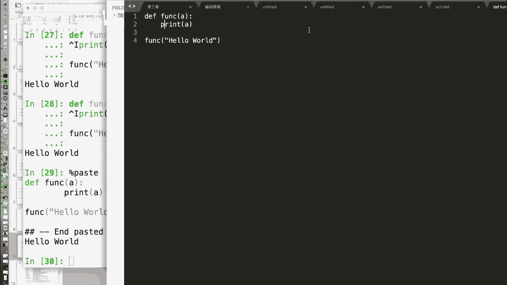
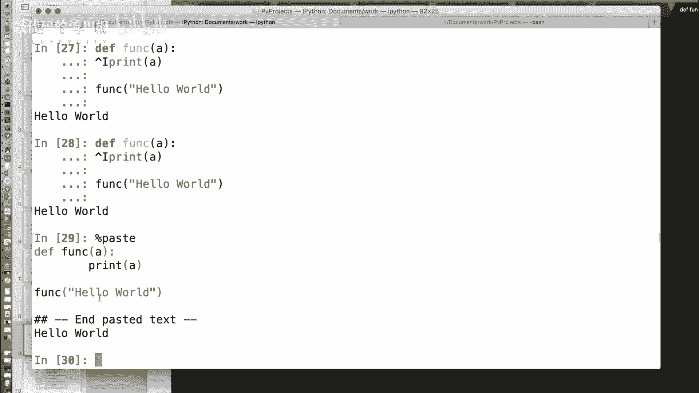
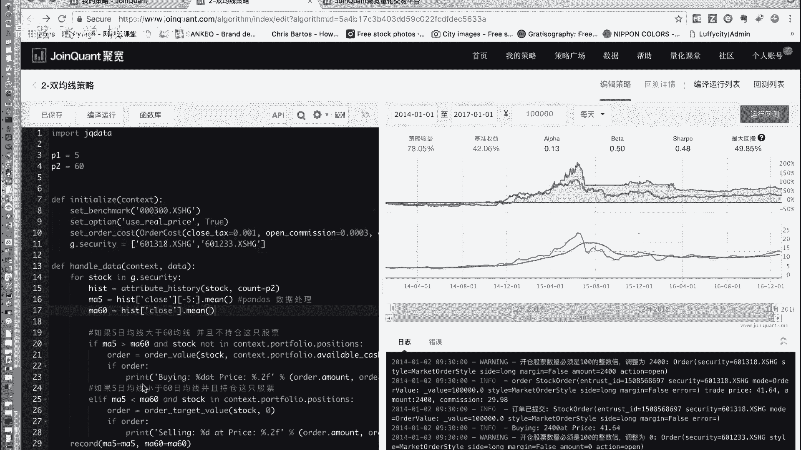
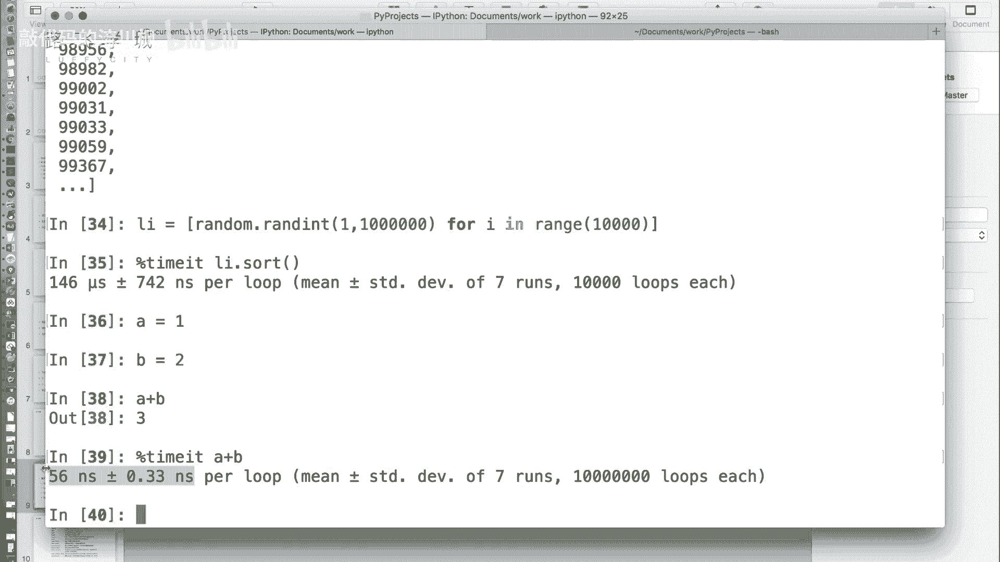

# 【2024版量化交易】全B站最实用的金融分析与量化交易实战课程，整整100集，3天从入门到项目实战，学完即可做项目，少走99%的弯路~ - P8：08 金融量化分子-ipython魔术命令 - 敲代码的流川枫 - BV1uFCVYYETd

好了我们现在给讲这个魔术命令吧，好我们接下来说一下IPAD里有一个比较啊，有意思的一个稍微好玩一点的高级功能，叫做魔术命令啊。

它本身提供了很多的魔术命令，所谓魔术命令就是以百分号开头的一些命令，比如说好，我们在这个文件夹下，首先我们可以自己写一个Python文件啊，我们知道这个呃在Python命令行里。

如果我想运行一个Python文件的话，是需要退出命令行的，然后执行Python的变执行，啊执行Python那个加我们的代码文件里面嗯，在控制台上运行这个命令对吧，那在IPAD里我们不需要退出来。

首先我们可以其实我们可以比如说用VWM看，我们可以直接写一个Python文件嗯，就写一个最简单的hello world啊，好在这里我们用模式命令百分号run啊。

加上哦还能在交互器里运行Python程序吗，我靠好牛啊，这个有点意思，我们的文件名就是百分号run，加上我们的文件名就可以哎，运行Python运行的脚本，Python在Python的交互器。

那有些人可能呃，有些同学可能是喜欢，在比如说一些这个编辑器里PYTHM。

比如说sublime lime，PYTHM就可以自己编译了啊，比如说我们创建一个我们这次写多一点啊，啊，我们写一个函数版的hello world啊，那我们我现在按了CTRLC。

也就是说把代码复制过来了啊，我们可以直接粘到这儿，嗯啊当然有的时候对于有些代码时，比如说你看这里粘贴出现了一个什么嗯，看出现了一个特殊字符对，这是因为我在这摁了一个tab键，嗯啊我靠。

怎么这么修改就可以可以这么修改，那你看现在执行的是不行了啊，没有，因为我刚才什么了，我再重新粘一次啊，啊所以运行啊整段代码也可以修改，是可以的，可以直接粘过来，但我没有调用它就直接运行了吗。

嗯那个方向调用哦，你看下面那sorry，对不对，那除了直接粘贴，它还提供了一个特殊命令paste命令哦，就把刚才那个看到没有，执行了past之后，他先把这段代码打印出来，然后给我输出了一个。

这是一个分隔符啊，然后执行了一下啊，past命令就相当于是执行剪贴板里的嗯。

啊比如说你可以，你可能是写着一特别长的几百行的代码，但是你可能需要一哎，里边一部分我做测试用一下。

我又不想再开一个文件复制粘贴过去了，我可以把这一份复制过来，然后在这百分号past嗯。

这是第二个命令，第二个魔术命令。

啊taste，那除此之外还有一个叫TIMMATE啊，这个命令是干什么的呢，我们平时写那个代码啊，之前我们讲装饰器的时候不讲过，我要如果比如说要估计一段函数的运行时间嗯，我们是不是用了time模块呀。

我们可以用高级一点，我们可以用装饰器对，来对这个函数进行这个封装好，那假如说这个函数运营时间特别短了，你用time模块是不是经常会遇到这个函数，算时间特别短，然后我运行出来是零秒对啊。

那我们看用这个TEMATE命令会怎么样啊，我们来一个SERT函数吧，首先我们创建一个，创建一个随机的列表啊，1万吧，好我们假如说对于这个LI点salt函数，现在是不是已经排好序了，对不对。

我这么执行是不是可以排好序，好我们重新创建一个啊，那如果我想估计哎，我这个排序的这行代码需要多长时间，我们在前面加上百分号time m，你想，好他为什么时间有点长，你发现没有，他时间比较长。

为什么时间有点长，是因为看出来的结果时间146，这什么微秒嗯，正负加减742是吧，纳秒嗯，Prelude，Prelude，Prelude，就执行一次，为什么我们刚才画的时间长一点。

因为他对于你一个特别短的函数，它给你跑了很多次来最后取了一个平均值，这是它的平均值，那为什么要跑很多次啊，因为你一次的话，比如说啊我现在是一个这个呃这个排序函数，比如说我算它有个A吧，A等于一。

B等于2A加B你算一下它的时间，你如果用time模块的话，能算出来吗，嗯算不出来这这个瞬间的问题对吧，对，Option time it，他跑了多少次了，后面这个一会我们可以看信息。

我们可以看上面看出来了，好跑了这么多次，跑了11共是跑了几百回，每一就是七次运行，每次运行跑了这么多次啊，哦每次运行跑了100万次对，然后算出来这一个操作是56NM哦，那那你你就比较能精确的拿到。

这个就是一个特别微小的指指令，它运行一个花多长时间，这个是需要对于你做的这个整体的代码，性能优化可能会有帮助，对，比如说你想测试某一个函数或者某一个部分，它需要多长时间啊，是很有用的，尤其是这种特别。

这个不是说一个操作不是特别时间特别长，但是可能你代码也需要一直调用它。

它可能时间长久啊。