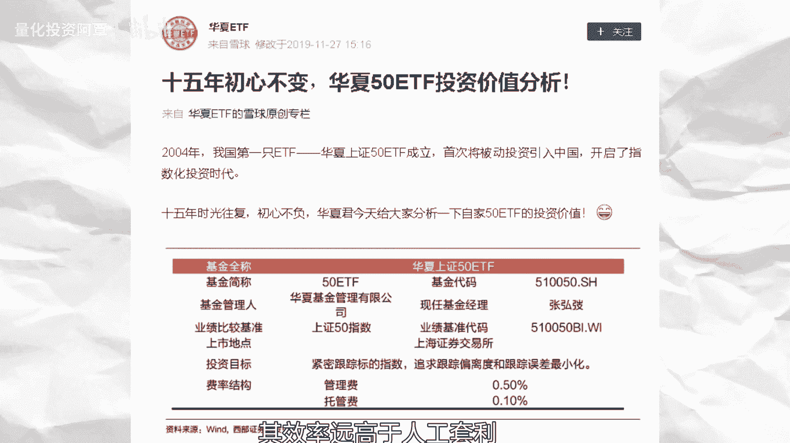
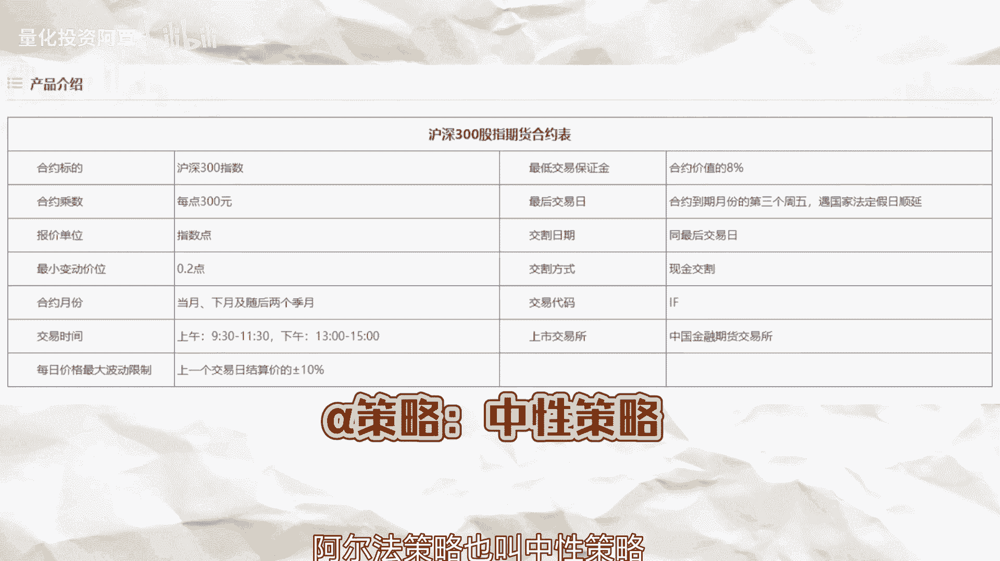
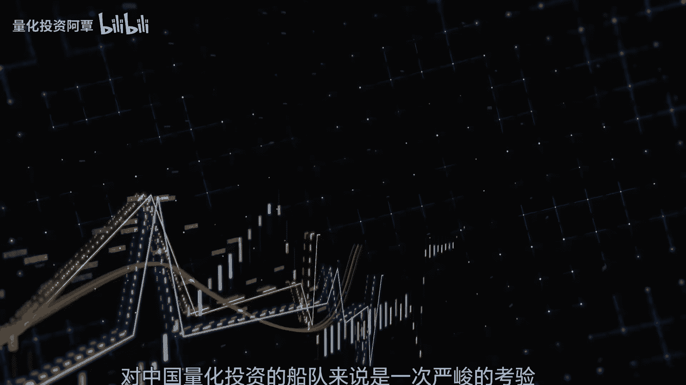
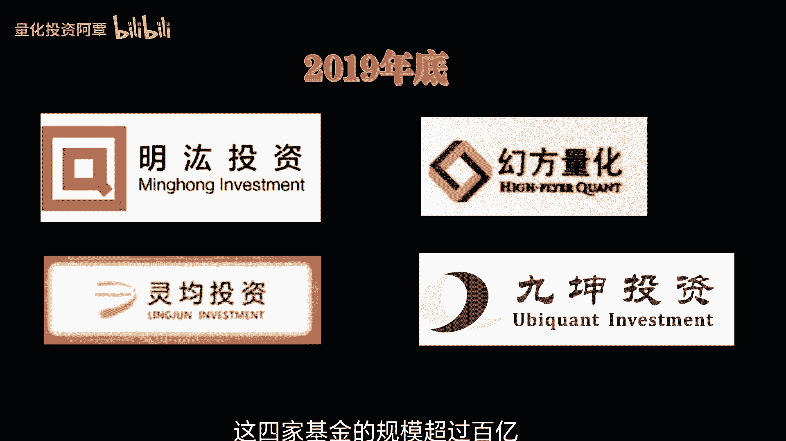

# 中外量化交易发展史，一个视频带你看透 - P1 - 量化投资阿覃 - BV11i421U7eP

投资小船永不坏，量化策略定成败，大家好，我是品优量化的阿晴，嘿朋友们，在这一个充满变数的金融海洋里，有一群特殊的航海家，他们不靠罗盘，不凭直觉，而是用数字和算法来驾驶他们的投资之船。

今天就让我们一起跟随这些航海家，开启一段关于量化投资的奇幻漂流，你可能会想，量化投资听起来好高大上啊，是不是只有那些金融大鳄才能玩的东西，但其实它就是用数学模型和计算机算法，来代替直觉，寻找投资的保障。

我们将以讲故事的方式，从量化投资的神秘起源开始，经历它在金融大海中的跌宕起伏，直到他如何成为现代投资界的领航者，故事的序章要追溯到20世纪50年代的美国，华尔街，那时金融市场就像一片完全未被开发的海洋。

充满了未知和可能，一群聪明的头脑，开始尝试用科学的方法来解读市场的奥秘，他们用图表和数字来预测股市的波动，就像解读古代星图的天文学家，寻找着财富的宝藏，在1952年，马克维茨提出的现代资产组合理论。

MPT首次用期望收益，收益率的波动率和关联度矩阵，来量化一篮子的资产的风险，收益属性，回答了在给定风险度下的期望，收益最大化的投资组合，从理论上尝试回答了如何测量构造，并优化投资组合的风险和收益。

这就像航海家们手中的星图，为投资组合的风险和收益，提供了定量化的测量方法，尽管当时的交易还停留在人工时代，纽交所交易大厅内人声鼎沸，但这并没有阻碍量化投资的火种，在华尔街的角落里悄然点燃。

马克维茨提出的现代资产组合理论，是量化投资历史上的一座里程碑，进入60年代，哈里马科维茨和威廉夏普，如同发现了新大陆的探险家，他们的资本资产定价模型，CAPM为量化投资的航海图增添了新的航线。

基于投资组合理论，他们发展起来了更为先进的资本资产定价模型，为之后的量化投资打造了坚实的理论基础，资本资产定价模型，对证券资产风险及其预期收益率之间的关系，给出了简洁精确的刻画。

是现代金融市场价格理论的支柱，CAPN告诉我们，一个资产的预期回报率等于无风险利率，加上一个风险溢价，这个风险溢价取决于资产的贝塔值，也就是它相对于市场的波动程度，简单的来说就是越高风险的资产。

你期望得到的回报也就越高，在实际投资中，CAPN可以帮助我们评估资产的风险和回报，从而做出更明智的投资决策，不过它也有它的局限性，比如它假设市场是有效的，但事实往往并非如此，在使用CAPM时。

我们还需要结合其他因素进行综合考虑，这一理论成为了现代金融市场价格理论的支柱，为量化投资者提供的，评估资产风险和回报的新工具，随着70年代计算机技术的飞速发展，量化投资迎来了第一个黄金时期。

有了前沿的理论武器，量化投资者们开始大讲船脚，统计套利，市场中性等新的策略被开发出来，就像是发现了新的岛屿和港湾，量化投资者们，开始用模型和算法来寻找市场的规律，就像探险家们用罗盘和地图来寻找宝藏一样。

爱德华索普在1969年，创立了第一支依靠数学模型和量化算法策略，赚钱的对冲基金，连续11年没有出现过年度亏损，成为了量化投资领域的传奇，1971年，美国巴克莱投资管理公司。

发行了世界上第一只被动量化基金，1977年，巴克莱公司发行的第一只主动量化基金，20世纪80年代，金融市场的海浪波涛汹涌，充满了无限的激励，私募对冲基金，尤其是那些采用系统化和量化策略的基金。

如雨后春笋般涌现，成为了投资界的新星，如1986年德少成立这家对冲基金，是以其创始人大卫艾略特肖的名字命名，迅速在量化投资领域占据了一时基地，1987年AHL成立，这是一家专注于量化交易的公司。

后来成为了全球最大的量化对冲资金之一，而量化对冲之王，物理学家，数学家詹姆斯西蒙斯，在1988年创立了著名的文艺复兴科技公司，如雷贯耳的大奖章之精，就是其磨下的产品，或许有小伙伴不熟悉大奖章之精。

从1988年成立至2008年，大奖章至今，连续20年的年化收益率接近70%，最不可思议的是，2008年金融危机，全球股市暴跌的情况下，大奖章至今依然取得80%的收益率。

至此詹姆斯西蒙斯成为了量化投资的典范，21世纪的到来，标志着量化投资进入了一个新的时代，2003年，纽交所和纳克达斯的超级结合，打通了交易机制的壁垒，高频交易应运而生。

哈德逊和交易公司HRT等高频量化交易公司，通过升级算力和交易系统，将交易执行技术推向了新的高度，据华尔街日报报道，仅哈德旭交易公司在2014年某阶段，曾占美股交易量的约5%。

这些公司不仅推动了量化投资技术的发展，也为整个行业树立了新的标准，到了2007年，量化基金的管理规模，已经占到每股市值的5%以上，全球量化基金的规模，更是突破了1万亿美元的大关，在这个时期。

顶尖的量化投资机构，采用了多种多样的投资手法，一些机构专注于从海量的市场数据中，挖掘有用的因子，通过复查的统计分析来预测资产价格的变动，另有一些机构则利用数学，物理等科学的方法建立短线的量化模型。

通过高频交易来捕捉市场的微小波动，这些不同的策略和方法共同构成的量化投资，丰富多彩的技术景观，他们不仅为投资者提供了更多的选择，也为整个行业的发展注入了新的活力，然而量化投资的行程并非一帆风顺。

1994年，被誉为华尔街债务套利之父的约翰梅里威瑟，成立了著名的长期资本管理公司，随后邀请到两位诺贝尔经济学奖得主的加盟，阵容，可谓超级强大，长期资本管理公司辉煌一时，一度成为国际四大对冲基金之一。

1994年到1997年，长期资本管理公司的投资回报率，分别为28。5%，42。8%，40。8%和17。1%，然而由于过高的杠杆，在1998年出现的黑天鹅事件，导致风光一时的长期资本管理公司宣布破产。

长期资本管理公司的破产，也为整个行业敲醒了警钟，高杠杆的风险暴露无遗，即便是诺贝尔经济学奖得主，也无法幸免于市场的无情，于2007年华尔街的上空乌云密布，一场前所未有的金融风暴悄然来袭。

量化基金这些曾经的市场宠儿，金融股的连续暴跌，让高杠杆的量化对冲基金，面临着巨大的保证金压力，他们不得不在短时间内清空大量的持仓，在这场风波中，许多资金损失惨重，有的甚至高达20%至60%。

随后的2008年，全球金融危机，这次给量化投资带来了沉重的打击，市场的剧烈波动，让早期的量化模型显得力不从心，一些模型在市场巨变中失去了效用，量化投资的可靠性开始受到质疑，整个行业的发展陷入了停滞。

然而正如伟大的航海家一样，真正的量化投资者，不会因为一次风暴就轻易放弃，他们坚信只要坚持下去，就一定能够找到通往成功的航线，面对挑战，他们开始反思和调整自己的策略，从单一的航线开始转向多模型的组合。

以适应不断变化的市场环境，经过了数年的动荡，量化基金终于迎来了第二春，也正式进入了量化交易的成熟阶段，2010年后，各种新的量化策略，如主动量化，宏观对冲和人工智能等相继出现，为量化投资注入了新的活力。

其中smart beta策略的出现，更是为量化投资带来了革命性的变革，2013年，smart beta资金的管理规模突破了1000亿美元，与传统的市值加权指数不同，smart beta策略在构建指数时。

会对市场加权和市会对市值进行加权，和指数中的股票进行优化，以实现特定的投资目标，2017年，随着人工智能的兴起，量化投资开始进入新的时代，阿尔法狗的诞生，标志着人工智能选股时代的开启。

大型投资公司开始使用机器学习和神经网络，进行交易决策，取得了令人瞩目的成果，截至2020年，股票smart beta基金的规模已经达到了一点一，5万亿美元，占每股总市值的约2。23%。

较2010年接近翻了十倍，约占美国ETF总规模的14，而美国量化基金的规模占每股总市值的比例，也达到了接近10%，整体规模约为3。3万亿美元，成交额则占比高达60%到75左右。

接下来让我们将目光聚焦于遥远的东方，中国，这片古老又充满活力的土地上，量化投资也在悄然兴起，在21世纪初的中国金融市场，如同一片新兴的海域，充满了机遇和挑战，量化投资。

这一个在西方世界已经崭露头角的航海技术，开始在东方大地上生根发芽，中国量化投资的行程，以2002年，华安基金公司推出的第一支指数增强基金，为标志，正式启航，这时基金的使命是超越传统的指数跟踪。

通过有限度的偏离来追求更高的收益，说白了就是不完全复制，跟踪指数会有偏离，比如多配点某个行业或某个个股，尽量让资金的收益超过指数，作为国内的第一支指数增强基金，国内的基金经理都没有管理过类似的基金。

于是请来了英国人因密智和中国人刘兴勇，作为双基金经理，共同管理基金，因秘制也是中国所谓获得基金公司高管许可，虽是指针，但是这个资金并不是量化基金的增强策略，现在看起来有些简单粗暴了。

用基金公司自己的说法是，剔除庄股，将权重向绩优蓝筹股倾斜，2003年，上证180指数上涨10。95%，华安180指增上涨11。4%，62004年，上证180指数下跌16。4%，华安18年指针下跌8。

9%，看来在那一个混沌的年代，仅仅剔除的庄股真的就能跑赢的指数了，只要少踩点坑，就可以让你的投资收益超过大部分人了，上证18年指数成份股相对较小，也只是涵盖了上交所的股票，随着深交所的不断发展壮大。

2005年10月，这个资金把跟踪的标的由上证180，改为了m s sci中国A股指数，涵盖了深交所的股票，运行至今，除了2009年以外，几乎每年都跑赢的基准指数，这支基金现在叫做华安m s sci。

中国A股指数增强，华安基金的指数增强策略虽然不是量化，但也是开了个好头，同时资本市场大佬君安证券前副总经理康晓阳，从美国回国后再开始建立了今日投资数据库，给未来天马资产发行国内第一支阳光量化私募。

埋下了伏笔，继华安基金的指数增强资金之后，中国的量化投资开始呈现多元化的发展趋势，从私募资金到公募资金，从市场中性策略到高频策略，各种量化策略在中国金融市场上逐渐展开，2004年。

光大保德信基金发行的国内第一只量化基金，光大保德信量化核心基金，这只基金采用的多因子模型，结合了基本面因子和趋势因子，旨在通过量化的方法，选出未来收益率较高的股票，尽管最初几年遭遇的一系列挑战。

但最终还是证明量化策略的有效性，2004年，对于量化还有一件大事，那就是12月30日，国内的第一支ETF华夏上证50ETF成立，开启了ETF套利时代，由于ETF基金既可以遏制市场交易，又可以申购赎回。

且成份股含量确定，投资者就可以在ETF净值和市场价格出现偏差时，进行套利，而通过程序化系统的套利，其效率远高于人工套利。

因此很多人就说，ETF套利拉开了程序化交易在中国的序幕，2005年以前的量化或指针基金，都会有外国的基金经理，到了2005年，上投摩根基金发行的上投摩根阿尔法基金，终于是由中国人独立管理了这只基金。

的基金经理是由中国人吕进出任，可是吕敬管理的这只基金只有189天，2005年左右，市场追涨杀跌情绪严重分散，投资的量化基金难以吸引投资者，2005年，汕头摩根阿尔法基金发行之后的4年里。

国内公募再没有发行过任何一支，新的量化选股产品，虽然公募量化停止了脚步。

但私募量化开始慢慢冒头了，2006年，深圳天马资产管理有限公司发行的深国头天马，这是有记录的第一支阳光量化私募产品，它的发行标志着中国量化投资向私募领域扩展，为更多的投资者提供了量化投资的选择。

随着时间的推移，A few moments later，越来越多的量化投资机构，在中国金融市场上崭露头角，2008年，美国金融危机，各种统计学上上万年难遇的波动开始接连出现。

依赖历史数据的量化对冲资金遭遇了滑铁卢。

大量高杠杆量化基金爆仓，金融危机之后，很多华尔街人才回国，带来了海外先进的量化投资策略，国内的量化基金浪潮才真正开始，例如李孝威，美国斯坦福大学经济学博士，曾就职于巴克莱银行。

龟壳后组建的富国基金的量化团队，发行的国内第一支量化指数增强基金，富国沪深300增强，2010年4月16号，沪深300股指期货上市交易，量化基金终于拥有了对冲工具，阿尔法策略也叫中性策略。

才真正有了大展拳脚的空间，从2009年华尔街精英的归国潮，到2010年沪深300股指期货的上市，中国的量化投资，不断吸收海外先进的量化投资策略，同时也在本土市场环境中进行创新和适应。

2015年股市异常波动，对中国量化投资的团队来说是一次严峻的考验。

当时大家到处寻找股灾的罪魁祸首，能靠做空赚钱的股指期货也被推上了风口浪尖，虽然业内人士都知道股指期货是被冤枉的，股灾真正的罪魁祸首是杠杆配资，但是太需要找个罪魁祸首来发泄名分了。

随后推出的一系列股指期货的限制，就这样将股指期货直接砍成了重伤，更是让一些量化船只陷入了困境，2016年市场风格的转换，让许多依赖特定市场环境的量化策略，遭遇的挑战。

2016年以前的量化多以中性策略为主，因为对冲了市场的风险，业绩曲线和主观多头有明显的差异，从2013年小盘股行情开启，再加上股指期货长期处在深水状态，做多小盘股。

做空沪深300股指期货就能赚得盆满钵满，2016年开始，市场的风格就彻底转换成大盘股行情了，再叠加股指期货现仓及高额的贴水，让之前靠小盘股对冲的管理人直接倒地不起，在这些风雨中。

中国量化投资者并没有放弃，真正的航海家，总能在逆境中找到新的航道，他们开始反思和调整自己的模型，以适应不断变化的市场环境，在这一过程中，中国量化投资的技术和策略不断的成熟，风险管理能力也得到了提升。

随着科技的不断进步，中国量化投资迎来了新的春天，2016年以前的量化，在策略上基本是以基本面中低频策略为主，很多更是偏向于小盘股，产品上，又以中性策略为主和主观股票产品，在产品线上也避免了同台竞争。

可以称为低频中信时代，本来中信产品可以依靠稳稳的幸福吸引投资者，结果风格一转换，就暴露了中低频策略超额收益的稳定性差，再加上股指期货交易限制和高额的贴水，让中性对冲成本极高。

使得之前风光的那一批管理人集体截止，2017年开始，量化进入高频指针时代，量化管理人也开始进入了新老交替，2017年底，百亿私募拟涉及量化的仅为朱雀，三渡星河两家，2018年底。

百亿私募没有一家和量化相关，2017年底突破百亿的朱雀，因为要转公墓的原因，规模逐渐缩小，三度星河也昙花一现，2019年底，共有四家量化百业私募，分别是明洪焕芳，邻居九坤，这四家基金的规模超过百亿。

宣告着量化新老交替的完成，高频策略正式席卷市场，2020年是量化最幸福的一年了，股市大涨，韭菜很多，镰刀反而没有那么多，再加上新股大量发行，打新也让大家赚得盆满钵满，接着这波东风，2020年底。

量化百亿私募达到了12家，除了2019年突破百亿的世家以外，明石金德眼附灵聚饮水，陈池圣泉恒源进化论也都突破了百亿，量化管理人开始加速进入大家的视野，2020年这波大东风之后，量化私募的规模暴涨。

明洪林军换方均突破了千亿规模，但是木一旦超过千亿就得出点事情，量化也逃不过民工规模突破千亿时，马上超额回撤了7%左右，林均换方，在2021年下半年，规模也突破了千亿，然后在2021年9月到11月。

这两个月超额双双回撤，好在上面的三家机构超额，后续都拉回来了，也算是有个交代，2021年底，百亿量化私募达到了28家，达到了历史高峰，2022年，量化投资者开始利用人工智能，机器学习等先进技术。

优化他们的策略，以适应不断变化的市场环境，这就像航海家们，用上了更为先进的导航设备和探测仪器，能够更加准确地找到宝藏的位置，2023年，监管的加强和市场竞争的加剧，促使量化投资行业进行自我革新。

探索多元化的投资策略，加上风险管理成为行业的新方向，目前我国的量化投资已经形成了，较为完整的产业链，包括量化策略研究，量化模型，开发量化交易平台等多个环节，同时随着监管政策的不断完善，和市场的逐步成熟。

量化投资在我国的发展前景也越来越广阔，然而与海外相比，我国的量化投资在规模水平，环境等方面仍存在着一定的差距，但近几年，随着国内金融市场的不断开放，和技术的不断进步，我国量化投资的发展明显提速。

站在2023年这个新的起点上，中国量化投资的未来充满着无限的可能，随着技术的不断进步和市场的逐步成熟，量化投资有望在以下的几个方面，取得更大的突破，第一技术创新，持续的技术创新是量化投资发展的核心动力。

第二市场的多元化，量化投资将向着更多的市场扩展，实现多元化投资，第三风险管理，风险管理在量化投资中的重要性日益凸显，第四教育与普及，提高投资者对量化投资的认识和理解，有助于推动量化投资的健康发展。

未来随着金融科技的不断创新，和我国金融市场的进一步深化，量化投资在我国的发展，将会迎来更多的机遇和挑战，我们期待看到更多优秀量化投资者和机构，在国内市场上崭露头角，共同推进我国量化投资事业的繁荣发展。

回顾整个量化投资的发展历程，我们可以看到它就像一部充满传奇色彩的史诗，从一开始的探索和尝试，到后来的挫折与挑战，再到现在的繁荣与发展，量化投资一路走来经历了无数的风风雨雨，但正是这些经历。

让量化投资变得更加成熟和稳健，量化投资的优势在于其客观性，系统性和可复制性，通过大量的历史数据和复杂的数学模型，量化投资可以发现市场中的规律，并据此制定投资策略，这就像航海家们通过精确的测量和计算。

找到通往宝藏的路线，然而量化投资也面临着一些挑战，如模型过拟合市场适应性等问题，量化投资者需要不断地优化模型，以适应不断变化的市场环境，这就像航海家们在航行过程中，需要不断的调整航向，以应对海上的风浪。

但我相信在科技的不断推动下，量化投资一定会继续发展壮大，为更多的投资者带来更加稳健的回报。

量化投资的故事还在继续，未来的篇章该如何书写，让我们拭目以待，这不仅是一场数字与策略的奇幻漂流，更是一段勇于探索，不断前行的航程，好了今天的故事就讲到这里了，希望通过这个视频。

你能对量化投资有一个更加深入和有趣的了解，如果你觉得这个视频还不错的话，别忘了点赞分享和订阅哦。

