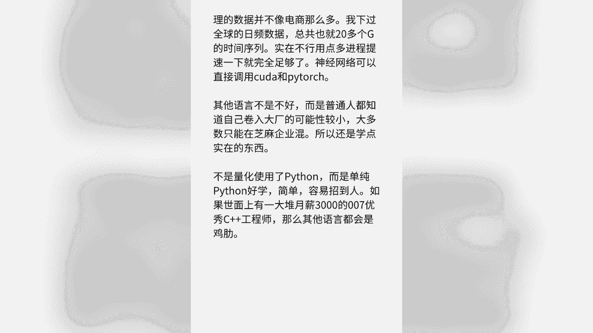
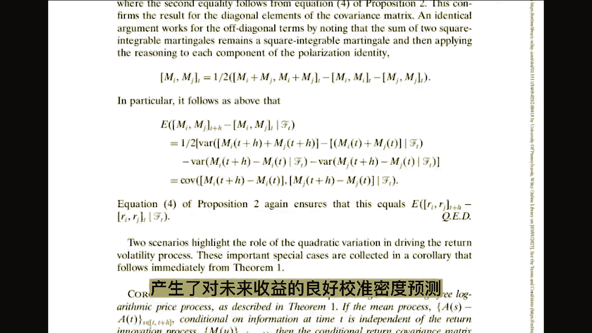
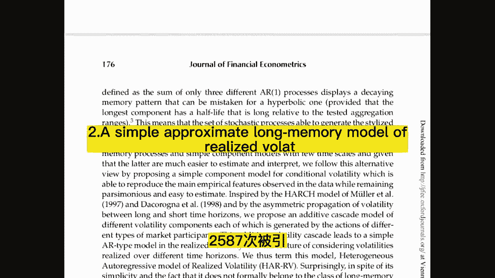
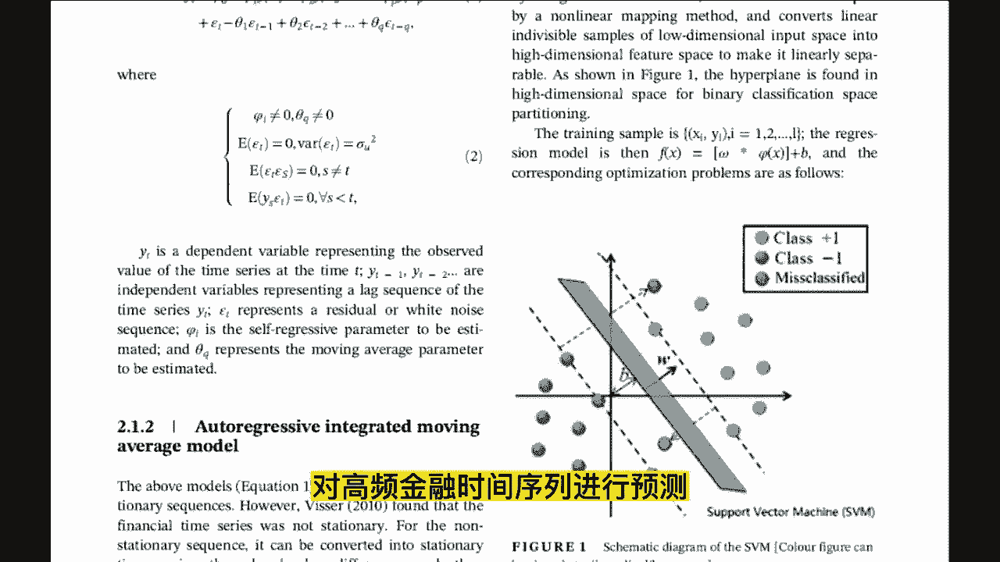
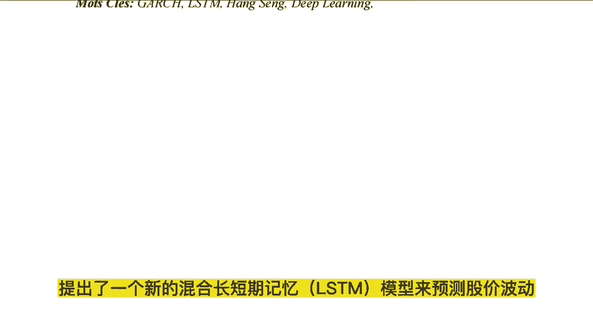

# 为什么几乎所有的量化交易都用Python？ - P1 - Momooo吖 - BV1fo6PYQEUE

♪ 怪我们星座不太相配 ♪，♪ 所以我们老是针锋相对 ♪，♪ 换一个角度去思考 ♪，♪ 你敢不敢变成我 ♪，♪ 我开始害怕你的眼神 ♪，♪ 我开始害怕你 ♪，♪ 眼神里透露出这一切对你不值得 ♪。

♪ 我会有多自责 ♪。

想要深入研究AI加金融，这十篇论文是必读的，接下来给大家简单介绍一下这十篇论文，4466次背影向量自回归波动率预测，加上参数化的对数正态混合分布，产生了对未来收益的良好校准密度预测。

以及相应的准确的量化预测，2587次背影。

本文提出了一个，在不同时间段，定义的波动率成分的加法级别模型，本文将传统的reunion模型，与深度学习模型相结合，对高频金融时间序列进行预测。

通过百度搜索前沿关键词索引，构建投资者关注度，因此再结合其他交易信息，如交易量趋势指标，报价变化率等作为输入指标，最后通过时间卷积网络，采用深度学习模型来预测，高频金融数据下的波动率。

提出一种基于金融文本情感分析的，指数预测模型，对沪深300指数的涨跌进行预测，背影135次，本研究提出了一种基于在线媒体文本挖掘的，新型原油价格预测方法，目的是捕捉价格波动的更直接的市场前因。

本文针对宝儿稀疏的文本数据，引入了话题和情感的两个新指标，来解决这个问题，研究本文构造了一个深层ASTF神经网络，并将其应用于全球30个股票指数，三种不同期限的预测研究，本文采用了融合长短期记忆。

和带自适应噪声的完全集合经验模式，分解sim的混合模型来预测CSI300，SP500和socks50指数的2V背影，470一次提出了一个新的混合长短期记忆，NSTM模型来预测股价波动。

该模型结合了NSTN模型，和各种广义自回归条件，一方差，最后希望这些内容帮助到大家。