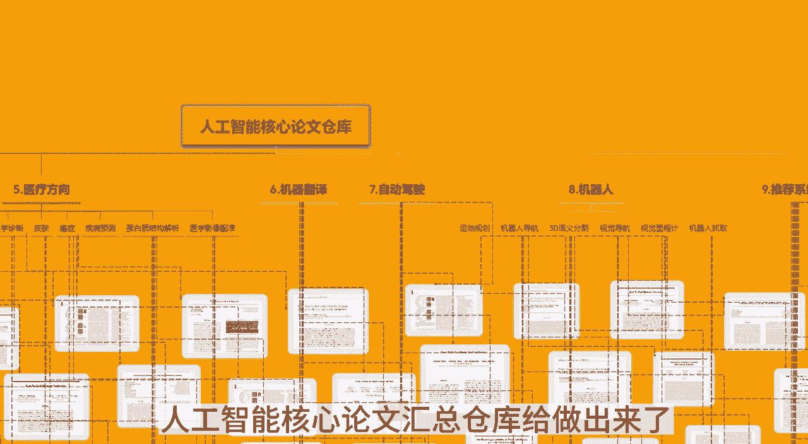
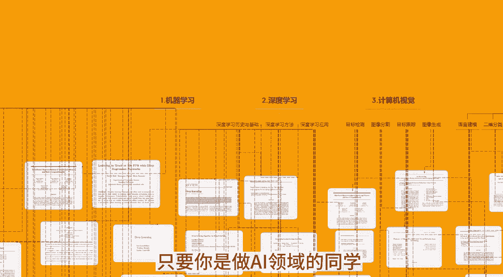
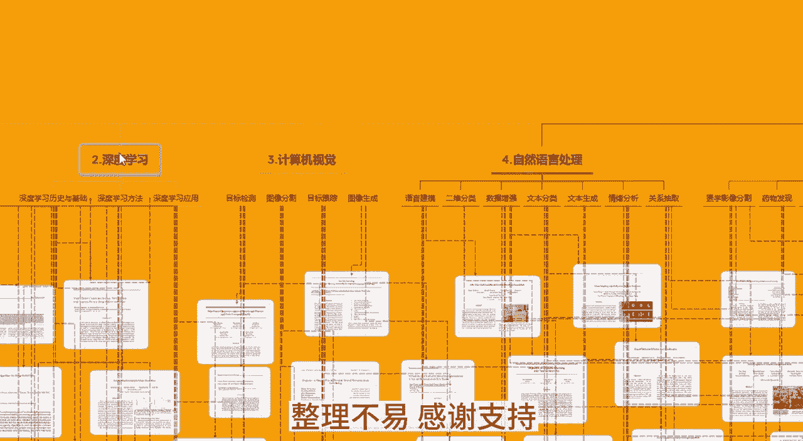
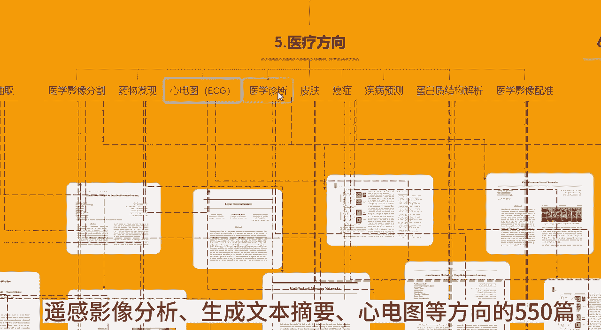
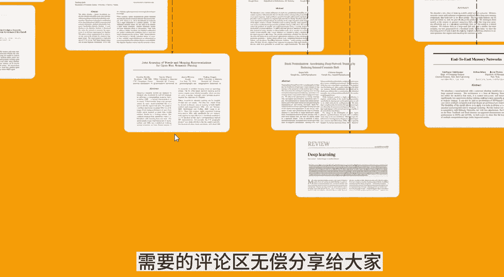
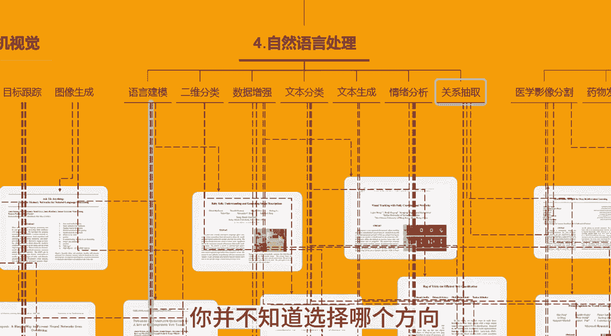
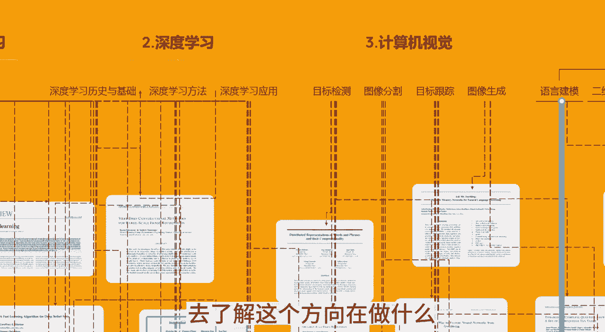
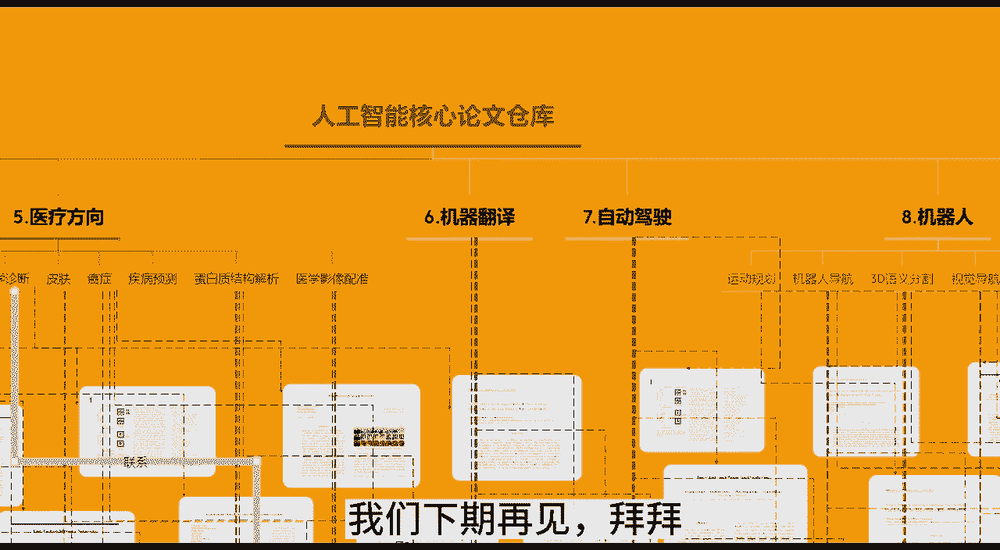

# 为什么几乎所有的量化交易都用Python？ - P2：550篇论文仓库 - Momooo吖 - BV1fo6PYQEUE

我花了半个月的时间去挑选整理，终于把包含了整整550篇的，人工智能核心论文汇总仓库给做出来了。

基本上涵盖了目前主流的各个方向，只要你是做AI领域的同学。

你一定会需要它，而且每个论文都有代码实现整理不易。

感谢支持，首先我们通过这份思维导图来了解一下，这份人工智能核心论文汇总仓库，之所以要做这份思维导图之事，为了方便去帮助大家理解这个仓库的框架，我们可以看到这份仓库它包含了机器学习，深度学习，计算机视觉。

自然语言处理，医疗方向，机器翻译自动驾驶机器人推荐系统，问答3D，重建姿态估计。

遥感影像分析，生成文本摘要，心电图等方向的550篇，需要的评论区无偿分享给大家。

这个宝藏仓库怎么去使用呢，从四个方面来说，第一如果你是初入人工智能方向的同学，你并不知道选择哪个方向。

你可以去看对应领域的论文，比如说综述，去了解这个方向在做什么。

是否感兴趣，直接去对应的文件夹下找论文就可以了，第二如果你写论文没有id啊，这个论文仓库绝对绝对可以帮助到你，你只有不停的精读自己领域的论文，泛读其他领域的论文，不停的去总结论文的创新点。

这样才能有能力让你自己去输出自己的id啊，比如说有很多人就会用AI价来发表论文，三你还可以把这个论文当成是一个词典，将来你自己读到的论文，如果这个仓库没有，大家可以放进去填充它，第四点。

每个论文我都提供了代码地址，所以如果你找不到代码实现，可以来这里看一下，只要你是做AI领域的方向，同学一定需要他，最后感谢大家支持，我们下期再见。

