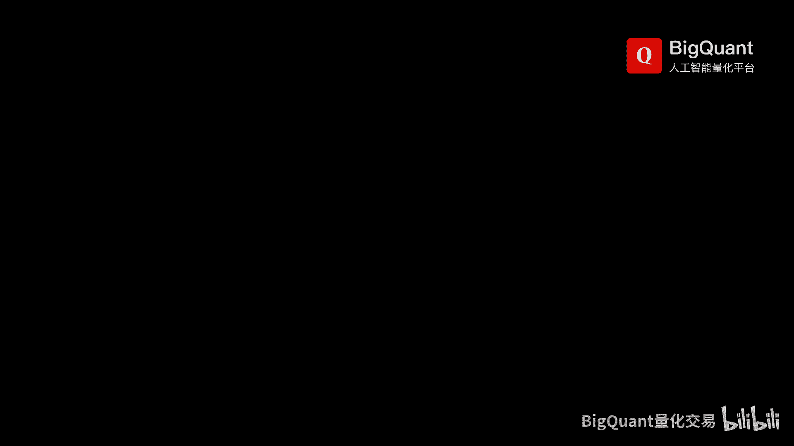
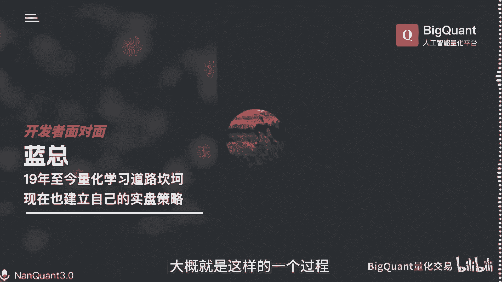
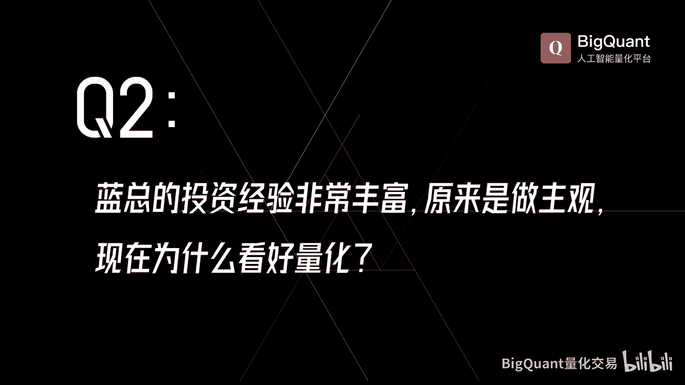
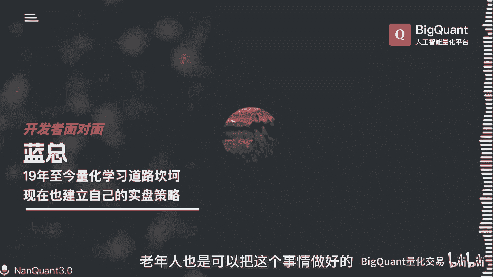

# 为什么要从主观投资转量化投资？转型需要具备什么能力？听听这个十几年老股民的转型经验，量化不是养虎为患，而是投资好帮手！ - P1 - BigQuant量化投资 - BV18M4m1R7o5

第一当时我就根本没有入门，所以说谈不上放弃，那首先呢我就回顾一下吧，啊为什么找上这一个币矿啊，实际上呢应该是在12年前，我们在交流的时候，就有一些朋友说有人用这个支持向量机做选股，效果相当不错。

当时我一听哇，还有这玩意儿啊，支持向量机是什么，我都不知道，后来查了半天哦，这是机器学习当中的一种，我就关注了，我说未来我就要干这个，就要学这个啊，但是呢说实话啊，你一个小机构也好，一个个体也好。

要搭建这样的一个平台，这样的一个框架实际上是很困难的啊，啊19年的时候就听说啊，有币矿这个人工智能这样的一个平台啊，我非常兴奋，我说终于找到门了啊，然后呢就跟你们接触来学习，后来发现我找到了门。

入不了门了，没办法啊，啊跟你们沟通的时候，实际上我根本没法跟你们沟通，不在同一个平台上面啊，不懂啊，没有共同的语言啊，后来呢我就自己去学习Python，也学习了这个机器学习，也就是囫囵吞枣的啊学习。

所以说呢当时我并没有入门，只是找到了你们的门，我也没有放弃啊，我背后呢也在努力去学，后来发现你们的这一个平台里面的，这些学习资料越来越多，还是要回到你们平台来学习啊，所以说学完了以后呢。

我又重新来再跟你们沟通，有了共同语言啊，跟你们交流啊就比较顺畅了，那么在22年春节的时候呢，利用这个假期我就突击啊啊，写出了一系列的这个策略啊，那下就就爆发了啊，呃实际上呢就是一个突破的一个过程啊。

啊所以说那个时候才是22年春节，我才真正的入门入big con man，因为是春节开发出来的，起名叫春晓策略啊系列一系列，后来跟万老师的这这个这个春晓系列的，这些高频音质有一些这个相似啊。

那我觉得这个可能也是很多巧合啊，啊后来呢你们说的这个精通呢，实际上呢我觉得也不叫精通，可能是现在呢比较熟练一点啊，为什么比较熟练呢，也是因为你们有了这个plus这个会员，有了这个群。

有了这样的一个生态啊，其实有很多这个坑可能别人已经踩过了啊，那我也遇到了很多坑啊，这个呢在这个plus群里面一问，有很多大佬们啊都经历过，都踩过了啊，那么很容易就回答啊。

其中有一个就是我这个可视化的这个模块，模块与模块之间的这个数据的传递，我不知道怎么传递啊，后来群里面有一个老姚，我不知道老姚今天在不在，就帮我点了一下，诶，我豁然开朗啊，这一下就让我很快啊。

就达到了一个熟练的一个程度，因为啊各个这个模块之间的速度力传递呃，你可以用了以后呢，就可以啊更灵活的掌握啊，因为这个可视化的这个模块呢啊，看起来是很好用，入门很好入门，但是你要要要达到一个熟练。

要去debug他的那些东西也是不容易的啊，啊这是一个第二个呢呃就是你们的这个count chat，我觉得对我帮助很大啊，因为我的这个编程能力确实不是很强啊，出了错误以后，问你们呢就问问半天。

我最开始的时候呢是在这个网上去搜，这是什么错误啊，还要翻译半天，那后来他有有有有了这个框架，差点以后我就把整个甩给他，马上就给我纠正了啊，这个给我提高了很大的一个一个效率吧，大概就是这样的一个过程。

我投资呢也是蛮久的了啊，但职业投资了不久，职业投资也就十几年，那最开始投资的是92年我才开始投资，我抽签了以后开的户啊，那边赚了一点点钱，97年赚的比较多啊，那个时候我买了三套房，买了一部车。

留到了这一个开公司的这个创业本金啊，然后就从事实业，20年的时候呢，呃我也没时没时间炒股啊，就把钱委托给一个那个时候没有私募基金，阳光私募都还没有，就有这个证券的，一可能代客理财的吧。

委托他们给我炒这个，一个月给我亏了40%，我马上收回来，自己操作其实也没有操作，就放在这里吧，啊那么呢过去呢基本上赚钱的都是牛市赚钱啊，也就是稀里糊涂赚钱没怎么亏，但是我是牛市的时候就操作一把。

那谈不上职业啊，10年的时候呢，唉就开始比较专注的去做啊，我记得很清楚，10年10月份赚钱赚到手软，天天涨，卖不卖呀，卖不卖呀，心里发慌，这就是主观投资啊，主观投资其实是有很多困惑的，我不知道怎么买。

我不知道怎么卖啊，赚了钱赚疯了啊，你不知道怎么卖，其实睡不着觉，15年也是啊，15年这一波啊，我的这一个朋友啊，我搭着我朋友的车啊，他说你买这个吧，我操作了啊，我就买了啊，我看了形态还不错。

那个时候呢已经比较有经验，应该叫系统化操作了吧，那是量化的雏形，那就是有规则的，属于专家系统的啊，那我说这个票还可以，我就做吧啊做了以后我发现不对，我说要不要卖了。

他说卖什么卖我几十个一直在里面不用卖的，结果他被埋了，我出来了啊，因为我小嘛就跑出来了啊，我觉得这玩意儿主观操作啊，可能要死的很惨啊，赚了钱可能睡不着觉也不行啊，一一定要量化，我觉得量化应该是未来之路。

如果是要职业的话啊，从那个时候开始，我觉得一定要动量化啊，就开始学习啊，系统化操作啊，才才有这种交流，才有了这一个说支持向量机，人家选股很好啊，直到发现了我们币矿啊，我我说这就是我的归途啊。

后半辈子就靠它了，就靠你们了啊，谢谢南总啊，因为我们线下也见过很多次了对吧，我们现场也交流过很多，包括上次还谢谢蓝总在我们深圳，还有我们那个杨老师在一起，帮我们组织了线下的一个活动。

我觉得老有所为吧啊只要你喜欢爱好，坚持应该是没有问题的啊，对于年纪大来说，我觉得呢有它的缺陷，但是更多的呢呃是有它的优势，首先呢我觉得这个优势就在于对于我来说啊，我觉得我太专注了，没有心无旁骛。

天天就想着这里啊，这个策略是怎么样的，对吧啊，对于这个像我们以前做主播，或者是年纪大一点的时候，都在其他行业有一些成熟的模型啊，或者是成熟的经验，那我们能不能把这些经验哎，我现在把这些经验都叫做模型。

能不能迁移到我们量化平台来，那我觉得这是很快乐的一件事情啊，其实我我在这方面呢呃应该是有所建树的啊，那这几年的这个讨论，那么我第一个策略，其实就是从另外一个高手给我讲的，一个一个观念，或者叫一个模型。

把它迁移过来，我现在还在用啊，他第一个模型告诉我什么呢，他说幼儿园的小孩永远打不过大人，就这样一句话，这就是一个模型，对于我来说，这就是一个模型啊，这是我开发的第一个非常成功的模型，到现在还在用啊。

非常好，第二个模型是在传统的这一个主观投资里面，有一句言语叫做浮盈加仓，利润泡汤，我就坚持这个理念，我绝对不浮盈加仓啊，但是我有一个朋友他就做出来了，浮盈加仓做得非常好啊，在央视的这个比赛里面还上榜。

还上台，我不信不信，他说我把资金曲线给你看一，看了以后，我就把它给复制出来，而且远远超越，我可以做到大大小周期做的高频啊，这就是如何把这个传统的模型，传统的经验啊，通过量化的工具变成我们的量化的模型。

那现在我用的这个模型呢啊实际上也很简单，买在无人问津处，卖在人声鼎沸时，这个是巴菲特的这个投资的一个模型啊，但是我们在量化里面其实呢是量价模型，它也是一个道理啊，如何把这个模型在我们B库上面去实现啊。

我觉得这是很快乐的一件事情，那我有有经验啊，有时间，那就慢慢的捏呗，啊这就出来了，这关键是专注啊，我们是可以做到的啊，同时呢呃我想呢这个呃年纪大了要学这个呢，我觉得也是要找到一些方法啊。

啊第一个我觉得就是要找到拐棍，不懂的就问嘛，我们plus群里面真的是有很多高手啊，让我获益匪浅，我们的这些老师也很愿意解答啊，另外呢呃我其实呢有一个简单的方法，可能跟万老师这个方法来是差不多的。

我的方法叫遗骨复肉法，简单我先形成一个闭环，写一个简单的策略嘛，把数据挖来训练一个模型，然后进行回测，不管他成不成功，只要能够形成闭环打通就行了，然后再来优化啊，啊其实后来万老师写的这个这些方法。

我觉得真的是很很适合我啊，啊很简单，然后我在里面啊形成闭环以后，再去添加我要的东西，现在可以添加的很复杂啊，更复杂了，实际上是在简单的基础上上面，去去优化它而已啊，啊所以我觉得如果是呃从简单的开始呢。

啊老年人也是可以啊，把这个事情做好的啊。

