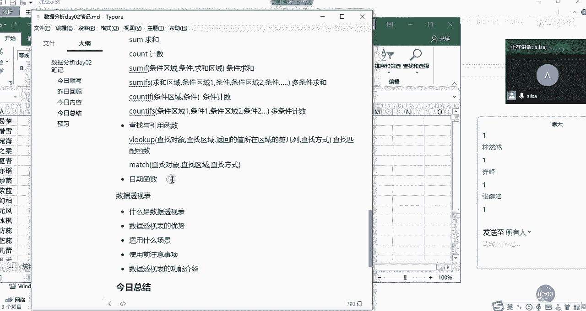
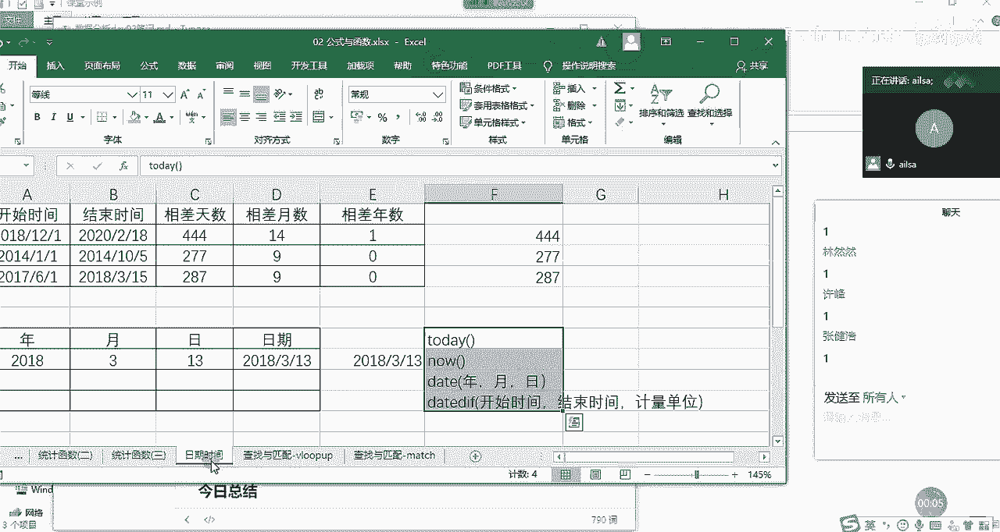
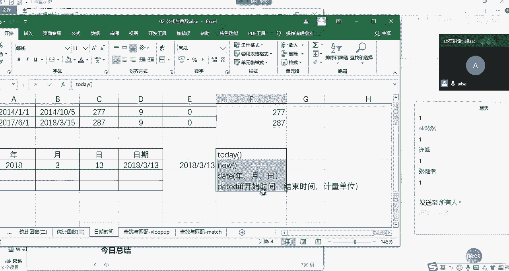
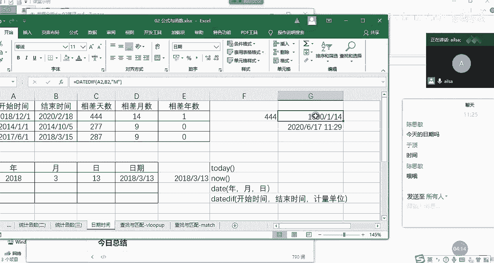
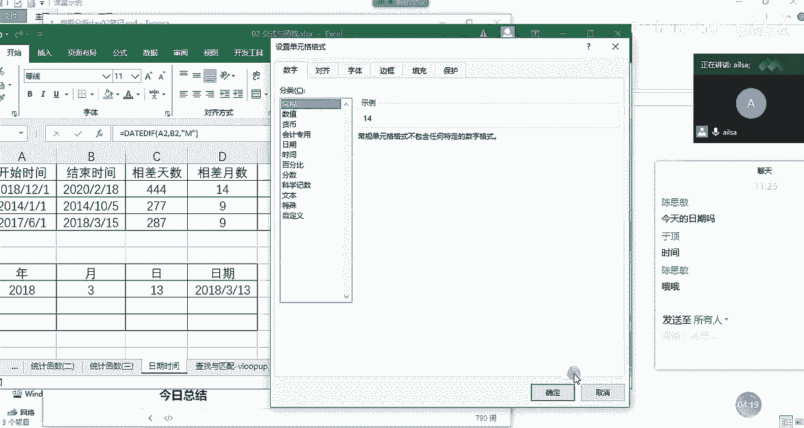
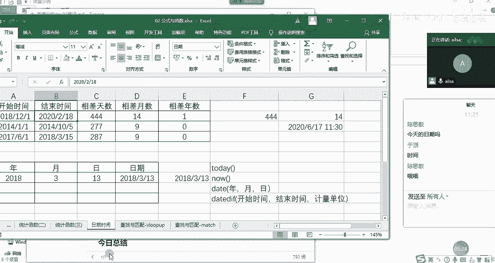
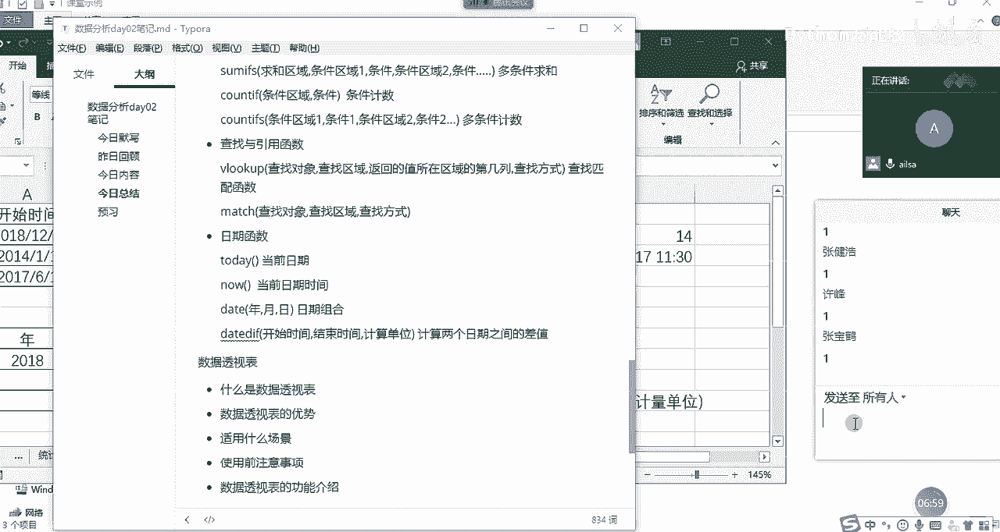

# 【python数据分析精华版来了（附文档代码）】10小时学会Python数据分析、挖掘、清洗、可视化从入门到项目实战（完整版）学会可做项目 - P13：08 日期时间函数 - Python万能胶 - BV1YAUuYkEAH

好，日期时间函数就简单了哈啊，放松一下啊啊。😊。

OK我们先讲啊系统自带的一些日期时间函数哈。首先第一个就是today，哎，我们看一下，我们在这里面输入today会发生什么奇妙的变化。TODAY today。

啊，莱思敏，你说会发生什么样的变化？他会返回什么？思敏在吗？嗯，非常的聪明哈，返回今天的日期。那我如果输入n呢？嗯，输如娜。现在。有人知道吗？对，返回日期和时间。

也就是现在是2020年6月17号的11点26分啊啊呃因为我们显示的话，它应该啊它应该会到秒。但我们显示到到这个地方就可以了。然后today和no显示的是一个是日期，一个是时间。

这是我们的日期时间函数的一个自动带的一个东西哈。这是大家了解就可以了哈。然后我们再讲一下。好，再讲一下我们在工作当中经常会用到的一个呃函数叫date函数。大家一看这个就知道啊好像是跟日期有关系哈啊。

那它是怎么来组成的？它就是date啊，我们看一下哈它A你看一看就是它函数组成部分有3个，一个是年，一个是月一个是日，那就特别简单了。如果你有现成的年，然后有现成的月啊，有现成的呃日啊。

这样的数据得出来的就是我们的日期实践格式，这就是我们的date函数。嗯，它一般用于我们如果说对某一列啊进行一个拆分之后，想把它快速的转换为日期格式的话，就可以这么来去操作。嗯，大家会发现一个问题。

就是说我们想实现某一项功能的时候，我们用操作也可以实现。我们用函数也可以实现。我们呃用其他的一种方式也可以实现，对吧？所以说我们实现某一项功能。方式有很多，就看你啊喜欢哪一种就可以了哈。

这是我们的date函数。然后我们还有一个叫dday的函数哈，它是计算啊它是计算我们的嗯稍等，我把这个数据删一下，它是计算啊我们的一个相差的啊相差的啊呃计算单位哈，比如说你可以计算相差的天数，相差的月数。

相差的年数，这在excel当中是一个啊是一个什么函数呢？是一个隐藏函数，什么意思呢？就是说你看我输入了这个东西之后，它并没有提示。嗯，当然它没有提示，我也记得它的组成部分哈。

第一个就是我们的开始时间也很简单，第二个就是我们的结束时间。第三个啊，就是你不是想计算相差的天数吗？啊，你不是想计算相差的一个单位时间嘛，这个时间呢？如果是天。

我们就我们就我们就么说啊我们就自己想象一下啊，天是day，我输。D会不会实现我所想要的效果？哎，好像是对的哈，相差44天，444天。然后如果说我们要计算相差月数的话，我们可以在这里写哈。

等于啊还是我们的d if只是我们的单位可能会发生变化了啊，还是开始时间一定是先开始时间，再结束时间。然后在这里面既然是相差的月数，月不是mon吗？我在这里面输入M啊，会不会就可以了。OK啊。

因为这里面哎你看它显示的是1900-1-14。看不懂是不是没有关系哈，因为。

因为时间的本质啊日期的本质也是数字哈。因为我刚才它显的是日期格式，那我们把它改成呃数字就可以了，它就是14个月。那如果说是啊如果说是呃相差年数的话。

年数的话也是一样哈，等于d day。t the，然后是我们的开始时间。哎呦，妈呀。没有鼠标的日子开始时间啊，然后结束时间嗯，然后我们的年是year，对不对？我们在这里面直接输入啊，直接输入Y啊。

就可以了。year，对吧？所以英文好还是占用式的。OK相差一年啊啊，我们使用这个函数去计算出来的相差天数，月数和年数的话会更精确一些啊。有的人说你直接两个日期进行一个相减不就可以了吗？啊，当然也是可以。

但它好像最终计算出来的是相差的天数啊，如果是月数和年数的话，就不太准了啊，大家如果知道这个函数的话，还是尽量使用这个函数会更精确一些。嗯，那我们来总结一下我们的日期函数，我们讲了有什么呢？

有啊有我们的today啊TODAY todaydayTO。

DAY todayday函数返回的是当前日期。嗯，第二个就是我们的no。返回的是啊当前日期时间。那第三个我们讲的是date啊，就是啊日期啊，它的组成部分就是。年。月。就是啊就是。日期组合。

然后还有一个date deep啊，它的组成部分是。它的组成部分是开始时间。结束。结束时间。啊，以及它的一个呃计算单位，我们可以理解为计算单位，然后是。计算两个日期之间的差值啊，这么去理解。

这就是我们的日期时间函数。嗯，同志们有什么不理解的吗？不理解的扣1啊，不理解的扣扣2哈，有没有问题扣1。好。好的，那我们日期时间先讲到这里。

我们接下来。😊。