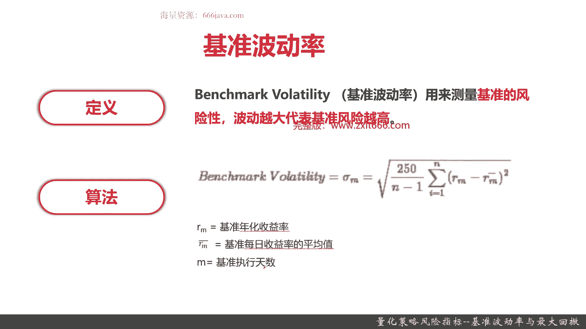
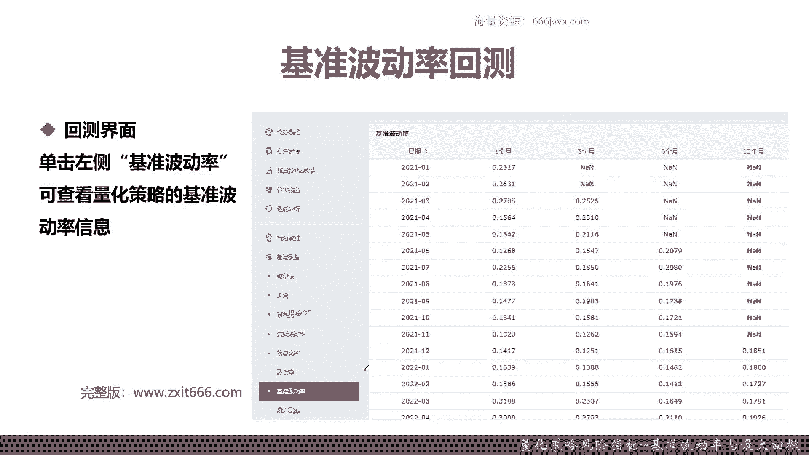
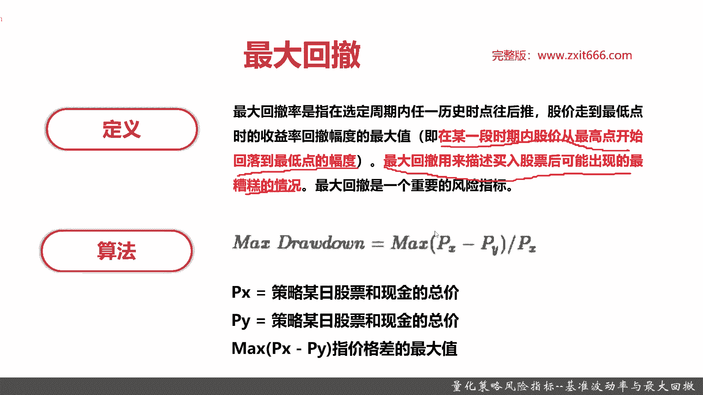
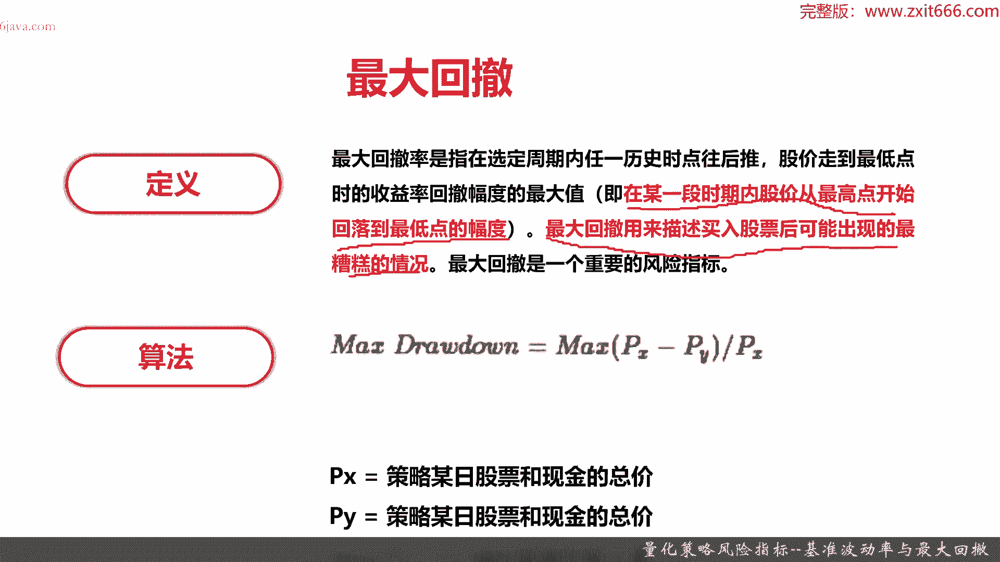
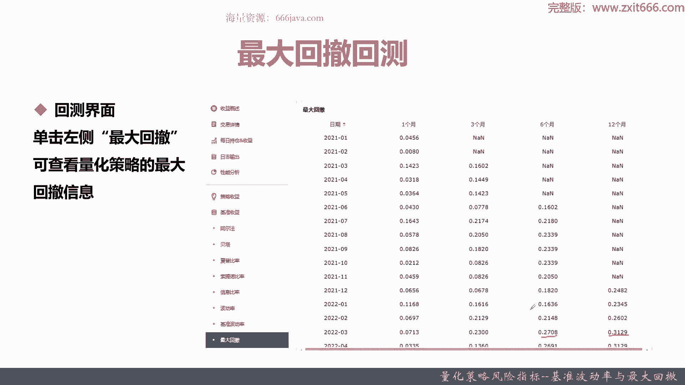

# 基于Python的股票分析与量化交易入门到实践 - P51：11.6 Python量化交易--策略回测实现_量化策略风险指标--基准波动率与最大回撤 - 纸飞机旅行家 - BV1rESFYeEuA

大家好，我是明天，在上一节呢我给大家介绍量化回测，风险指标的第二部分主要是三个指标，索提诺比率，还有信息比率以及策略的波动率，那么接下来呢我们本节将给大家介绍一下。

量化策略回测的最后一节，也就是风险指标的最后一部分，本节呢我们将给大家介绍最后两个常用的指标，一个是基准的波动率，最后一个呢是最大回撤，到本届为止，我们就给大家介绍了常用的八个，量化回测的风险指标。

那么接下来我们进入指标的介绍，首先给大家介绍一下基准的波动率，首先给大家介绍一下基准波动率的定义啊，基准波动率就是benchmark volatility，它呢是用来测量基准的风险。

那波动越大代表基准风险越高，那为什么要有基准波动率呢，基准波动率其实一般是基准，那就是大盘，就比如说沪深300，如果沪深300波动率很高，那就说明我们的大盘波动非常高，一般来说，基准波动率。

其实就代表了一个市场的行情的变化，那么接下来给大家介绍一下，基准波动率的公式和算法，基准波动率呢和策略波动率类似，只不过呢它是以基准的收益率，和基准的每日的收益率的平均值，作为一个比较的那个量纲。

基准波动率的算法就是类似于这样，那我们接下来继续给大家介绍一下，为什么要有基准波动率啊，如果基准波动率非常高，那就证明大盘在不存在震荡，一会涨一会跌，一会涨一会跌，那这种情况呢它表明什么呢。

表明那种适合正当的策略算法，就是每一种策略算法，它都不是非常的适合所有场景，有的量化策略算法呢适合涨，有的适合跌，那也有一些量化策略回测的算法，它适合大盘震荡情况，基准的波动率指的就是这块好。

那么接下来呢给大家介绍下基准波动率的回测。

基准波动率回测类似于之前其他的六个指标，也就是单击向左侧的基准波动率就可以看到了，可以看到这里就是基准的波动率值啊，还记得我们之前给大家看到的，我们这个策略的波动，我们策略波动率经常达到0。3几。

那总体来说可能比基准的波动率，还是略高一些的，就证明我们的这个策略呢没有基准这么稳定，风险可能更高好。

那么最后呢给大家介绍一个，另外一个非常常用的指标，最大回撤。

首先给大家介绍一下最大回撤的定义啊，最大回撤指在选定周期内任意历史时点往后推，股价走到最低点的收益率，回撤幅度的最大值比较绕口啊，其实就是在某一时间段内，股价从最高点开始回落到最低点的幅度。

那最大回撤是个值，那他呢表真的是我一定时间内，比如说半年或者一年或者一个月，股价最高点和最低点的差值，或者一个比例，最大回撤，用来描述买入股票后可能出现的最糟糕的情况，其实就是我的跌幅可能有最多少。

那最大回撤它是一个重要指标，就举个例子，什么意思，比如说呃，我的策略最高点是这一年的中的某一天，它可能是收益30%，那最低呢它可能跌到了负的30%，那最大回撤中间的差距差了60个点，那这就是最大回撤。

随着你的波峰和波谷的更新，那你的最大回答是不一样的，一般来说有的人其实追求最大回撤的稳定，那如果他最大回撤一直为零，那说明什么呢，那我们的策略非常的强，它是一个单边，至少他不亏，他是一个平的横盘的情况。

然后呢他是个单边上涨，这种情况是比较是什么呢，中国过去的20年的楼市，同学们可以想基本上最大回撤非常低，基本上要么是横排，就是楼市的房价保持平等，要么是一直上涨，这就是最大回撤车指标的意义。

然后做下回车的算法呢，首先最大回撤一般是叫max drag down，其实回撤就是drive down，那最大回撤一般就是max drag down，那这段回车的算法就是PX减去PY，再除以PX。

那什么是max p x减PY呢，就指的就像我刚才说的是在这个时间段内，股价的最高值减至最低点的一个最大差值，因为每天都会去变化，每天都会有这个差值的变化。

其实它相当于呢max p a x减去min py，这就是最大回撤的算法好。

那么接下来呢给大家介绍一下最大回撤的回测。

那最大回撤的回测呢就是在电话平台里面，其实因为帮我们后台都实现了，也是点击一下最左侧的最大回撤就可以看到了，可以看我们这个策略呢，最大回撤最多的时候可能有将近0。3了，比如说这里啊，这里其实已经超过0。

3了，这就证明差值是比较大的，中间和最高点可能有30%的差异收益，那如果我的最高收益在这段时间，12个月只收了10%，那我可能就要亏20%，所以这个最大回撤是相对来说高了。

这也侧面的去印证了我们之前这个策略，其实波动率还是比较高的好，以上呢就是本节的全部内容。

下面呢进入本章小结，首先我们给大家介绍了基准的波动率，那基准波动率的算法呢，类似于那个策略的波动率，唯一的差异呢，它是拿基准的年化收益率，减去基准每日收益率的均值，然后做一个方差，那基准波动率的意义呢。

他就说明了整个大盘的一个波动情况，为什么会有基准波动率呢，因为我们的策略它总有一个适应的特征场景，那有可能它适应单边上涨，有可能适应单边下跌，还有可能它是在大盘不停的震荡的时候，表现倒好。

所以会有基准波动率，然后基准波率的回测呢，就是点击一下基准玻璃看一下就可以了，一般来说基准和我们的投资策略的指标呢，可能波动率比我们会小一点，那实际我们我们自己写开发的这个MACD的策略呢。

没有基准波动率那么小，好，最后呢一个指标也是一个非常常用的最大回撤，最大回撤呢作用就是表征买入股票，或者我们这个投资策略，可能出现的最糟糕的情况，其实他也就是我在一段时间，可能是一个月，可能是一年。

在这个策略的收益的最高值减去最低值的差值，它的算法呢其实就是max p x减去PY，除以p x max，其中的这个PX和PY都是我这段时间内，某一日的股价和现金的总价，其实就是整体的收益情况嘛。

那为什么要取得这个最大值呢，这是表征我们这段时间内，这个收益最糟糕的情况会是什么，比如说最大回撤它是0。3几，那就证明我们这个股价在最高点和我的最低点，将近差了30%的收益，那如果我最高点收益是10%。

那我可能在这段时间内，最差情况是亏了20%，这个呢其实对投资人的，就是我们这些投资人的心理是一个考验，到底拿不拿得出，那最大回撤为零表示什么，它表示它一直是一个上涨或者是横盘前的阶段。

那过去20年的中国的楼市，最大回撤一直表现很好，都是很小的，接近于零以上呢就是本节的两个讲解的指标，我们到此为止，一共给大家讲解了八个风险指标，那同学们可以自己回去复习一下，到此为止。

本章量化策略的回测内容，我们就基本上给大家全部介绍完了，我是米切尔。

我们下节再见。