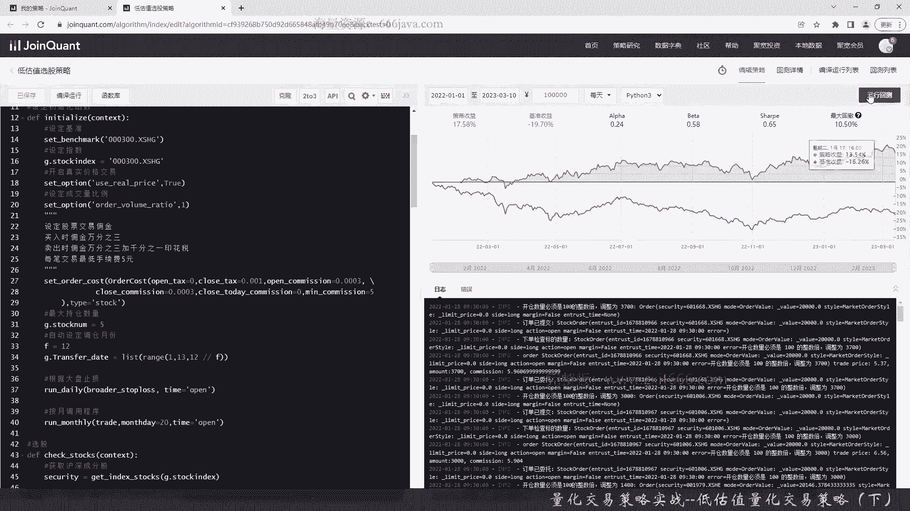
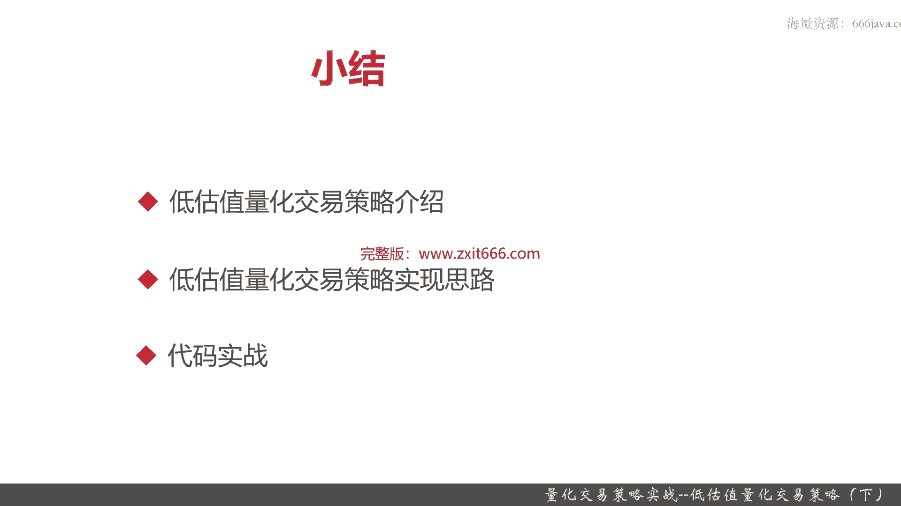

# 基于Python的股票分析与量化交易入门到实践 - P64：13.9 Python量化交易策略实战案例_量化交易策略实战--低估值量化交易策略（下） - 纸飞机旅行家 - BV1rESFYeEuA

然后综合获取这些股票，这就获取了我们想要的这个结果了，这个其实呢是一个series，我们转一转一下，好选股呢就实现了，那么我们接下来呢是来实现止损，我们先声明一个函数，然后来给大家看看这个是怎么实现的。

这是总体的总的止损接口，这个策略呢只是通过大盘的止损策略，好这是这个止损策略的参数，然后判断需要止损的信号了，然后同时呢，我们的持仓还要大于零，如果满足这个情况，我们就便利我们所有的持仓的股票。

因为他是个dictionary，所以我们可以这种通过kid来方式，然后直接把他们全部给清仓，order拼错了，好这是止损的主体函数，那么呢我们来判断具体的大盘止损函数，默认等于二。

那默认等于十就是大盘均值，默认阈值是0。03 3%，那我们来实现两种不同的策略，我们也是通过金叉和死叉来判断，这种像这个就是认为是死叉，我们方法一，其实如果大盘形成了死叉，那他就很有可能后面都会跌。

那我们就抛掉清仓，然后还有呢大盘超过跌幅超过一尺，N日内的跌幅超过一尺，那也也为tr，其他情况都是force，好那我们接下来呢来实现，止损方法一，这个呢其实现在同学们可以理解我们kernel呢。

其实这个参数就是一个方法的mod，你用克隆也也行，你用mod也行，这个具体可以看，好同学们可以看看这个attribute history，为什么选胡村三排啊，这到底是什么意思，为什么是一个0~-2。

一个是1~-1，同学们可以想一想啊，下标为什么是这个，好那这个就是死叉，好接下来来默认的是止损方法二，我们那默认也是用方法二的，Float，看看括号有没有对啊，好这个判断是不是跟THRESHO。

好这就是止损的方法，当然同学们如果看不太懂，可以再去好好琢磨琢磨，其实这个判断相对来说也是很简单，主要一个是算和昨日的一些那个跌幅，然后呢还有一个呢是算它是否是否死叉，默认呢我们是看跌幅好了。

后面呢我们再给大家该实现交易函数了，首先要获取当前月份，因为我们这是月评嘛，好这个时候之前设定的交易月份就有用了，这个时候我们就要获取股票交易池了，卖出逻辑，那为什么卖出呢，肯定是有持仓了，我们才卖出。

对不对，还是一样便利，不在我们持仓列表里面的股票池里，表的就是目标股票池列表的，OK我们直接清仓，然后呢我们要分配买入的资金，我们股票如果持仓数小于了，目标的尺当中就数目前是设定是五吗，那就需要。

进行购买，然后呢我们均分，不考虑跟这个呢就是等权了，当然了，如果我们还可以通过它的市值来按照比例，这就是按市值比例，但是我们现在的选的是均分，这感觉同学们可以自己去调，买入目标，按照现金来买入。

好加油逻辑，最后再有一个else，好那么呢代码这里我们就写完，我们看一下实际的结果，这个策略呢稍微比之前策略复杂一点，那么现在呢我们就把这个coding呢写完了，我们简单检查一下，看看有没有什么问题。

OK那我们再运行一下，我们看一看，从2022年1月1号到现在的3月10号，2023年的3月10号，看一下结果是什么样的，可以看到呢在这段时间一年多的时间呢，我们的策略呢是收益的将近20%，17。58%。

那么呢这个时候基准呢就是亏了沪深300，亏了将近20%，那我们这收益呢阿尔法0。24还不错，贝塔呢0。58，夏普0。56，一般最大回撤呢比较稳定，10%好，那我们呢再看一下详细的结果。

好可以看到了，我们超额有46%，非常不错，超额收益，那阿尔法0。237不错了，贝塔0。584，这个还稍微风险有点高，这个点其实很好的，这是最高的相对论，那这个点呢，就是基本上把我们的利润呢都跌没了。

这个时候这就这两个点呢，最大回撤相对有点高，然后呢夏普0。6挺高，胜率0。75%，也就是说我们基本上都是盈利的，胜率挺高的，那盈亏比呢3。13，然后最大回撤10%还好，索提诺比例0。9953也不错。

日均超额额0。14%，挺好的，超额收益最大回撤8%，控制的还行，那超额收益下不比2。3，这是很高了，A是0。5，二四还行，那盈利次数九，亏损次数三，所以我们的胜率很高，信息比例二，信息比例2。14。

非常好，那个策略波动率0。17，控制还不错，只有17%的波动率，基准波动率0。195，我们的策略呢比基准这段时间还稳定，然后这是看了我们自己选的，都是一些被低估的股票，中国建筑，大秦铁路，招商蛇口。

江西铜业，各种巴拉巴拉，上海医药等等，那我们还有一些海螺水泥啊，宝钢股份啊，中国重工啊，中联重工这些，基本上这些确实都是一些国企和大市值，然后这是每日收益，可以看到一开始我们确实是亏的。

但是呢到了2020年的2月份开始，就逐渐盈利了，好然后再看看我们策略收益，我们的策略呢一个一个月来看，基本上除了第一个月，第七个月基本上按照月来说收益还行吧，基本上我们数一下12345678。

我们15个月里面八个月是亏的，但七个月是盈利的，那有的时候呢像某一个月，2022年11月，一个月就盈利的十个点，非常非常高了，然后按照3月影只看一个月，那其实可能我们不动钱。

这三个月六个月和12个月基本都是，这是哪怕按照12个月来说，我们只要连续这个策略持有12个月，基本上是都是盈利的，所以收益这块我们这个是长线的策略，其实还是不错的，然后看看基准的。

基准的这块就没我们好了，基准基本都是亏的，最近一年亏的挺多的，那阿尔法整体还是不错的，贝塔贝塔在这里，5月份这个时候，8月份都波动挺高的，甚至12月波动1。17了，然后夏普比夏普呢，2022年11月。

夏普今年有14这么夸张，索提诺，然后我们看看2022年11月我们在干什么，是从这里一下子又涨回去了，从策略收益只有三个点，一下涨到了12个点，确实11月份基本上把这些亏的都赚回来了。

好那么呢以上就是本节的全部内容，下面呢进入本章小结，本章呢我们主要给大家介绍了，低估值量化交易策略，那么低估值量化交易策略的策略背景呢，主要是我们通过我们是通过。

首先股票净值是决定股票市场价格的主要依据，自然来说，如果某些股票它净值就非常低了，那就说明它有很大的上涨空间，所以呢市净率越低的股票其投资价值越高，相反呢那个市净率越高的股票，投资价值越就越少。

这块呢只要是出于巴菲特这里的投资的，那个价值投资，这个理想，其实我们这个策略呢就是一个长线投资，但是呢如果我们仅仅只按市净率进行排序，那还是有非常大的风险，那比如说市场在持续走低，那市净率肯定就变低。

或者这个公司经营不善，盈利能力非常差，他市净率当然也低，所以呢我们要把市场的环境风险和，是公司个股的经营状况，还有盈利呢综合考虑，那么呢最终呢我们考虑了这几个因素以后，我们就实现了以下这个算法。

首先我们为了市净率净量低，我们选择市盈率小于一的股票，接着呢考量它的经营状况，还有他的那个盈利能力，那所以他就是考虑它的负债，首先这个公司的负债比率，一定要低于市场的均值，我们这里选的是中位数啊。

那其次呢这个企业的流动资产也就是现金嘛，至少要是流动性负债的1。2倍，那就证明他可以还款，当然了，它越高越好，这个剧情的同学们的预值，可以同学们自己去试调整，接着呢我们加入了市场环境的风险因素。

也就是说呢我们已取N天，默认去取十天，沪深300跌幅如果超过10%，我们就不进行交易了，我们就清仓，然后呢，由于我们这是一个长线的交易，我们呢每月调一次仓，当然了，这个每月调一次仓是正常的调仓。

我们的风险的评估，就是根据沪深300这跌幅来进行风险评估，是每天要进行的好，这块呢就是整个低估值，量化交易的策略的简单介绍，后面呢我们给大家介绍了这个策略的实现思路，这个策略的实现思路呢。

和前面几个策略稍微有点不同，它呢要专门实现止呃，止损函数也就是根据市场大盘来实现止损，还是在我们本策略里呢，我们实现了两种，给大家实现了两种止损的策略，一种是呢，当大盘N日均线与昨日收盘价构成死叉。

这个同学们之前应该带给大家，那个实现了MACD啊，还有ma多均线都是要判断金叉死叉的，还有方法二，就是说大盘内某日跌幅超过阈值，这个阈值呢，我们在我们的这个策略设定的10%。

这种情况都会触发我们的风控止损信号，那触发风控减损的信号呢，如果我们这个时候有持仓，那我们就把仓位的所有股票都抛弃掉，最后呢是代码实战环节，我们这个策略呢代码的实战起来相对来说。

比之前的代码呢呃稍微复杂点，其实也还好，后面呢我们给大家进行了回测，那这个策略呢在最近一年多的时间吧，比大盘效果好一些，大盘这段时间就是沪深300，跌了将近20%，而我们这个策略呢有将近20%的正收益。

其中呢我们这个策略的风险相对来得及，因为你是长线的嘛，只有在那个2022年的10月那份，那个时候9月10月的时候跌的比较狠，但是呢在11月以后，立刻经过一个月，我们的整体随着市场的复苏。

和我们整体那个低估值股票呢，它被重新的市场活跃以后，那我们的涨幅空间有了，所以我们在11月一个月，就找回了我们所有之前的盈利情况，那么呢这个策略确实是适合长线的同学，如果同学们有的同学觉得呃放的长线。

那其实可以比较一些这个策略和一些基金，它的效果对，以上就是本节的全部内容，我是米田，大家下期再见。

