# 26集全！B站目前唯一能将【量化交易】讲清楚的教程！用AI从零开始打造你的交易机器人！大数据量化交易／机器学习／Python金融分析 - P19：第一十二章第1节： 从回测到交易 - 机器学习教程 - BV1w4421S7Zx

OK各位同学们稍等一下，然后课程马上开始，让同学们稍微等一下啊，现在发现到的人还比较少。

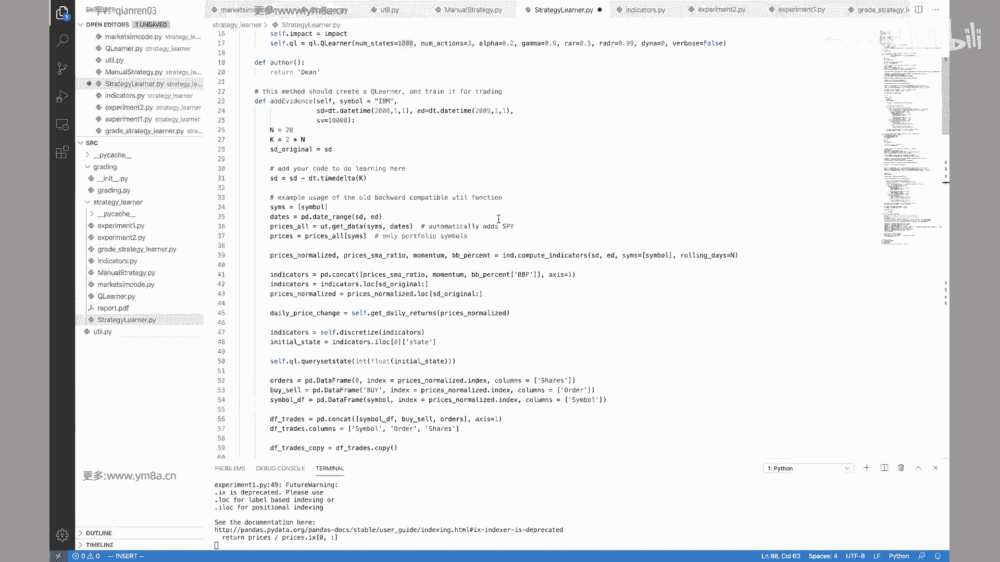

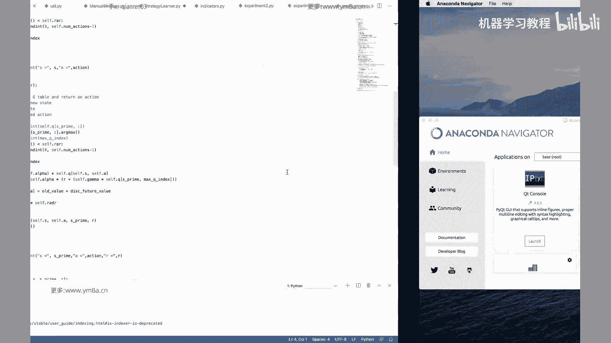

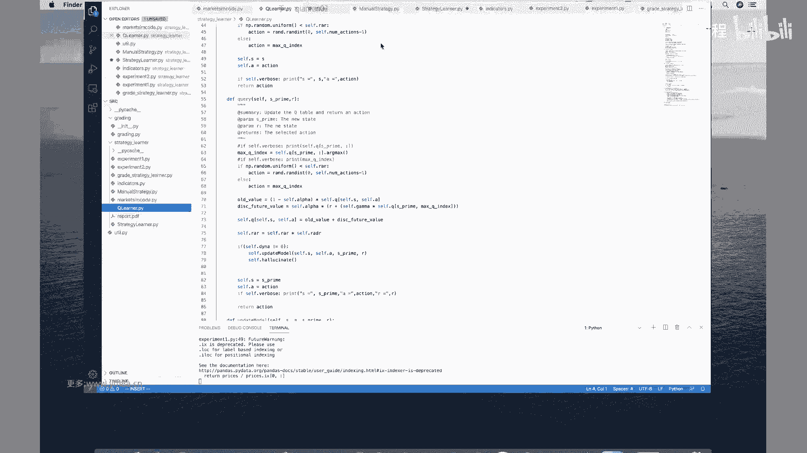

嗯好的嗯，那各位同学，我们今天还是就开始吧，虽然今天带的到的人比较少，可能就三位同学，然后今天我们啊接着上一节课的内容，上一节课我们是讲到用q learning做了一个简单的。

就是说去寻找路径这样一个robot，然后呃今天我们再讲一下，就是怎么把qq learning这一块，应用到实际的交易当中去，呃，其实整个这一块的q learner，仍然是上一次的q learner呃。

仅仅是有一些变量的变化，整体的结构完全是一样的，就是如果上一个的上一课代码大家有仔细看过，并且把它调通的话，是可以直接用到这一课，当中来的，因为本质上q learning只是我只是定义了一系列的。

就是针对于状态不同的状态下，我应该做出怎样的action呃，对，然后我们今天这里可以看看，怎么把这个东西应用到我们实际的交易当中去，然后先看一下我们的数据啊，数据的话我们选取的是从二零呃。

08年到2012年的时候，标普500的这样一个美股的美股的一个日数据，而这个数据比较简单，只有一个只有只有量价数据，然后我们其实主要用的是就是它调整后的价格，Adjusted cose price，对。

就是在它的最后一列，然后下面是对这么多标题的呃，这么多标题的呃，它的价格的价格的时间序列，然后在刚开始的时候，我们先看一下，这里面有一系列的就是utility函数嗯，看得见OK有TXT函数嗯。

这边嗯第一个是我们需要去load，我们的就是symbol to pass load，我们这样的就是不同的价格的数据，这本质上是呃就是说去读到data文件夹，然后读到相应的symbol点CSV这个文件对。

然后get data里面这里有一个就叫ISPYP，就是说我们要不要把我们的标普，我500的这样一个指数给加上去，如果是默认的话，是加上去的话，我们就把我们的symbol list里面去。

加上这样一个内容对，然后接下来就是一个这样一个循环循环之后，然后我们会把所有的data frame都给drain到一起去，对啊，OK然后这里面有一个就是它是就是呃drop date，spy啊。

就是电脑吹对，就如果那天嗯就是说指数没有的，没有的话，我默认为那天没有交易，然后我们就把所有的data frame给返回回来，返回回来，然后接下来是对一系列的，然后我们再去看。

还有就是嗯这里面呢你说q learning的话，并不会说，我们的q learning并不会说直接说直接我们从啊，最基本的量价数据不会直接从量价数据，然后给到最终的决策，但显然大家想一想。

就是价格相对来说是一个嗯，相对来说会比较随机的，呃是一个首先它是一个连续的数据，但是我们在上一节课所学到的，就是说呃所所学到的state和action，其实相对来说都会是比较离散化的对。

那么就是在实际去交易的，而实际去交易的过程当中，我们肯定是需要对价格先去做一样的处理，那么呃就结合我们之前课程当中，所学习到的一些东西，我们在之前花了很多精力在讲什么是因子，到底怎么去挖掘因子。

那么实际上就q learning，本质上我们我们也是需要去借助，我们现有的因子，再去呃，在计算因子值的基础上，然后这边有一个就是有一系列的，就是MANU的strategy，就是本质上我们也会。

我们今天考的考虑的是三个，就是三个的三个因子，第一个就是呃是simple moving average对，然后这个就是一个简单的那个呃，大家看到这边有一个那个rolling的名，就是一个简单的啊。

简单的就是要移动所谓的移动均线等等权重对，所以是simple movie average，然后这边是，然后接下来有一个就是布林带，然后布林带的话呃，布林带其实就是说我们在一个简单的均线上面。

然后加一个加一个band，然后这个band band的半度的值是，一般来说是，就是你取决于就是说你想要想要有几倍的，这样啊，呃有有几倍的这样一个差，然后一般这个banner纸其实基于布林带。

你也可以去进行很多的调整，也可以用啊论价格的波动，或者是呃，就是说这个带宽你是可以自己去进行调整的，对，然后嗯对嗯，包括我们包括我们这边用的因子是呃，Simple movie average。

然后如果你想要进一步去研究的话，其实我们之前你挖掘到的各种各样的因子，都可以去尝试，那为什么挑选就是一个是moving average，然后一个是布林带，还有一个是呃，还有一个是momentum。

这三个来说相对会比较经典一点对，然然后注意的话，我们这边在呃，我们这边在整个做的时候，我们是会把价格先去做规划的处理，比如说我要拿后面呃呃T加人的每天的价格，我们会去除以除到我们的T0的这样一个价格。

就是第第第零天的这样一个价格，这样的话我们啊，我们可以价格就是从一区开始计算啊，然后这个是在啊normalize对，就normalize的组织做的事情，首先是嗯把价格进行补齐，前想跟呃，就是跟后想对。

然后然后呃其实这边就是说嗯就是向前，那就是把前面就是如果当天数据空缺的话，从前向后补齐没问题，然后呃如果就是，然后然后再用一个从后向前补贴的，可能会出现一个问题，因为本质上来说可能会用了一点未来数据。

但因为这边是日级别的，可能啊日我们本身做的是日级别的交易，然后作为一个模型的展示来说，应该对我们的整体影响是不是特别大，所以这边就会简单的先是这样补齐，补完齐之后，我们会把就是price。

然后除以它的价格序列，除以它第零天的这样一个第零天这样一个值，所以我们这样就得到了一个，就是把我们所有的股票价格就是都归到，就是从一开始，因为我们看到就是啊对，就是这边的每一个股票。

比如苹果价格可能就是比较高，然后数值会比较大，然后有一些呃，比如说AA的航空公司的话，那就但相对来说股价会低一点的话，那这样的话，我们把都把它化成一个标准的区别区啊，去对比研究对K2这一块。

就是大家有什么问题吗，这边是主要是这个function里面，我们会去计算三个因子，然后就是嗯对，这个函数啊，我们是就是有data range，我们有初始亲就是起始日期，然后跟结束日期，然后呢。

然后用pandas这样一个function，直接生成一个呃data range这样一个范围，然后这边再用到就是utility的呃，Get data，我把它放在右边，大家可以参照着来看。

就我们会去就整个整计算因子的过程是嗯，按照我这边写好几个方程，然后接下来是啊现漏的全部的数据，就是我们这边的get data，get data的话，然后你这边symbol。

我们这边是只有一个JPMORGAN对呃，读完数据，读完数据之后，同时它会把我们的benchmark，标普500这样一个指数给SPY给加上去，对，然后读完读完之后。

我才会把所有的价格去进行normalize，然后得到了normalize价格之后，我把它价格作为一个input去输入到我的啊，输入到我的就是function当中，然后这边是rolling days。

这边用的是20天的均线，然后嗯对，然后这边他还加了一个，这边是用一个，就是我们还用一个，就是用price除以一个simple movie average，然后嗯然后是布林带计算布林带对。

大家要注意就是布林带的话，你是有就是上轨跟下轨这两个对，所以它返回的是一个就相当于是一个结构体，或者是dictionary之类的结构对，然后这边是有一个他做了一个。

就是啊我们就做一个就是他做了一个percent，是什么意思呢，就是拿我们的价格序列啊去减去我们的下轨，然后再去除以上轨到下轨，这样一个嗯这样一个差，本质上来说就是说嗯这样我可以说。

如果说我正好在上轨的话，那如果就是价格现在normalize就正好在上轨，那么这个值就是一，那如果正好是在下轨的话，lower是零，那正常如果我们默认大部分的时候，价格是在上轨和下轨之间。

那么这样值就是0~1嗯，当时说如果价格是突破下轨的时候，当价格突破上轨的时候，所以我们这样的话，我们得到了，price和simple movie average这样的一个比例。

然后一个是momentum，sorry啊sorry，刚刚看没有讲momentum这边用的是什么啊，momentum说从字面意义上来说是动量，然后他这边做的是我们这边做的。

实际上就是说是把啊我就是动量的话，反应就是说在物理上动量是反映的，就说是嗯物体的质量乘以它的这样一个速速度，所以然后呢反映到就是价格区别，还是说我们这边因为我们讨论的是价格，然后我们看到的是。

就是说我们是用多少天之后的嗯，嗯用20天之，就是之后的这样一个价格的价格的这样一个差，然后再去除以我们就是20天呃，之前的这样一个价格，这样我们把它作为一个momentum，其实反映的就是说我在这20。

在rolling days这期间之间价格的这样一个变化，OK所以我们对于我们，现在我们今天选用的主要是这三个因子，所以simple就是simple moving average衍生出来的price。

跟价格一起移动平均的比例，然后一个是动量因子，然后然后一个是布林带，对对，非常注意注主要注意一点，就是说我们这边其实都是把它，我们没有用绝对的数值，而是把它转化成了呃，嗯转化成了啥啊。

无论是0~1还是一附近这样一个值，这样可能会方便我们的处理，然后就是说嗯就是说然后其实想到就是说啊，我们之前有讲过，就是说怎么去做因子的研究，那我这边只是选三个最简单的例子，那么实际上再去说。

我们在考虑把这个东西去运到，应用到交易当中的时候，我可以把我的要把我之前拿过来的因子，再去做检验，作为我的这样一个输入，然后我们再去把它再进行强化，再把它放到强化学习的模型当中去。

当然当然当然这里面的模型相对来说，就是说我们用的不管是q q learner，还是说我们因子都会比较简单对嗯，然后我们再来看一看，到这部分，就是说关于数据的import导入。

跟跟我们就是说计算因子大家有什么问题吗，嗯嗯刚刚有同学来的会比较晚，然后再讲一下，就是这节课我们讲的是，怎么把强化学习应用到就是股票的交易当中去，然后我们上次我们仍然是接着。

就是说我们用的是上一次完全一样的对，但是我们呃，但是我们可以把就是说这样的q learner，是应用到就是说应用到回撤跟交易当中去，我们也就是说事实上就是上次上次课我也提到。

就是说这样一个QNN的这样一个class，其实它是会比较一个通用的，就是说不管是我对于任何，对于任何我想要去建模的这样一个系统，只要我能去把它进行进行离散化的处理，我都可以。

我都可以去定义我的state，我的状态，然后嗯然后去计算我的q table，然后我也可以去，然后我可以定义一系列的action，就是说我想要对这样的这种状态，进行什么样的反应。

然后我也要去定义一系列的reward，reward function对，所以说这样的q learner这样一种方式，相对来说是比较通用的，很贴通用的一种方式，对那时候我可以用它做我们上一节课的啊。

就是去就是做一个路径寻优的，这样一个解决这样一个问题，然后我也可以把它应用到股票交易当中去，这是这节课的这样一个背景嗯，同学们到现在有什么问题吗，然后在这边的话，我们就是说啊我们最后是要去对比。

就是说一个是，就是说我拿人工的一个去交易的模型，效果会有什么样的区别，嗯然后这边是这边有symbol，这个选的是apple，然后study跟ANDY，然后然后value，然后这个是选的是10万美金。

OK然后就说我们这样的做了，这边会做一个就是呃简单的simulation，我怎么去，然后怎么来去进行交易对，然后我们这边是首先还是一样的，就是啊漏的数据，然后得到所有的price，然后去呃。

然后然后去进行normalize对吧，这个完全一样，然后这边选取的是modern eric，这选取的参数是20天，然后接下来是分别计算simple moving average。

然后然后是计算columns呃，就是计算计算我三个这样的一个，指标的这样一个值对，呃，其实是跟前面的，就是computer在跟这个function会有点像，只不过我们这边肯定会把它重新。

就是重新去implement一下，然后计算完这三个值之后，计算完这三个值之后，然后接下来就看到就是说呃这边是这边呃，我们在这边做回测的时候没有考没有用，之前就是复杂的，就是说我考虑一个event。

然后就是我还要去考虑，就是说我交易什么时候成交，那这边实际上没有，因为我们日级别的交易我们都默认就是成交，成交在就是adjusted，就是日收盘价格上，对调整的日收盘价格上。

所以这边其实简单的说是刚开始的时候，在啊每天我得到了这样一个价格序列的时候，我都我都要先去得到今天的呃，这三个因子值对吧，然后得到之后，然后再看就是我们这边的symbol是，这是apple的话。

这是很简单的，用的是规则交易，那这个规则是啊，Sorry，规则交易就是说当我的动量值小于-0。05，然后我的布林带小于零的时候，同时我的simple moving average小于0。95的时候啊。

那这个时候我就会把我的偷偷，而并且此时我的持仓数量是小于1000的时候，我会把我会就是说我这个order我发出一个买单，然后如果这个持仓是等于零的话，那么我会把我的车把我的持仓就是说设为1000。

然后同时我总持仓加1000，然后另外的话就是说呃，如果我这时候已经有持仓的话，我这时候会把我的嗯，就是我会我会把我的order，而是order是就是说我这个是是是进行去，相当于是去加仓。

我偷偷holding编程，就是说去就是说加到2000哎呀，Sorry，不是加到2000，加2000，然后其实这个这个这个意义就是说啊，正常来说是他做的其实会有点类，似于说是均值回归。

一般来说如果我是要去做突破的话，比如说我价格突破了，这样我定义的一个就是区间的时候嗯，嗯做CT人可能会考虑说，OK这个价格就出现这种现象的呃，概率会就是说如果是走突破的话，我觉得说这个趋势可能会持续啊。

那其实这个时候我要做的不是去，也不是去买回来买回来，比如说那这个时候价格下跌的话，我可能会考虑的是进一步的去，你去做空或者是保持空仓，因为这边是美股的，我们这边实际上是考虑是能够有负的仓位的，对对。

所以所以但是这边肯定考虑的是，我们考虑的就是说啊价格，比如说是三个西格玛事件之外的事件发生了，那么我认为发生这个事件之后，大概率他还要回到正常运行的范围内，所以这个时候考虑呃。

就是说我们采取的行为是买对，因为只是作为一个benchmark对，并不是说这个策略一定是可行的对，同时嗯这边会，然后这边其实啊就是说我们有多个交易的，这个是多个因子的时候，或者说你一个因子。

其实我完全可以把对应成，一个一个的一个交易准则，那边用的是三个音，三个因子，那我这三个因子同时满足这个条件的时候，我才会去进行啊买买单的交易，所以嗯对这边就是说我们这一块相对来说。

模型会就是说会偏简单一点，我们主要是为了展示就是q learning，那么实际在去应用的时候呃，一方面说我们可能在就是说在因子的组合方面，不会是简单的，直接说是用三个取交集的这种方式。

你可能会说是不同的因子值，我会用呃用加权的方式，或者是怎样算出一个新的因子值，然后根据啊新的因子指的这样一个范围，再来去做交易的决策对，然后然后这边是，然后另外的话我们看的就是else if。

这边这边就是说本质上是说我什么时候去做cell，对吧，然后嗯其实其实就是说这边简单的就是说，我们来做一个就是做market simulation的时候，其实说就是说其实就跟我们之前讲的，有点有点像。

就是我要去考虑我的position，然后我要去考虑我的就是trade对，然后所以我们这边要做的是trade，是把我所有的就是嗯就是呃所有的就是，然后这边就是呃by sl都把它去啊。

都把它给都把它给抽出来，然后这边by cell是呃，就是就是就本质上就是我的，就是就是其实就是我的order嘛对，然后啊把我的然后生成这样一个，然后吧，就是说我有去交易的这些trade。

给大家去提取出来，如果没有的话，就是零对吧，然后把这样一个trade去返回啊，然后这个在跑的时候呢，呃这个function其实跟之前是重复的，这边在跑的时候其实就是呃选定一个标题。

然后选取选取我们的起始时间，然后接下来我们待会再去看这样一个方式，然后去就相当于说把我整个的就是刚刚是讲了，就说我们这个function是这，这这function本质是说我的交易策略是什么。

MANU人工的这样一个交易策略，然后这一块是就是说我们是怎么做market simulation，就是怎么去做这样一个回测的，其实这部分的话代码啊，同学们可以之后去呃自己看，或者是对。

其实因为跟我们之前讲的，其实没有特别大的区别，然后无非是这边就是说我们考虑的就是，我对于市场的Impact会有的，就是说我可以考虑说一部分是手续费，然后一部分是我的。

相当于对市场这样一个冲击的这样一个影响，对啊，其实就是说所以我们会看到，就是在就是我在算每一次的就是cash的时候，我交易完之后这样一个cash是什么是啊，是我之前的就是呃。

可是我之前的就是价格成也就是啊价格，然后乘以就说我的交易，然后我回去减去我的手续费，然会减去我市场冲击的这样一个影响，对这个就跟我们之前算的，就是是非常非就是非常相似的。

就是本质上那就是说我在算绩效的时候，就是把我所有的order去逐渐的这里去，这样一个循环就就可以了，然后然后去，就是就是一个个按照我的时间序列去更新我的，我的trade对。

然后再去计算我的就是说然后根据时间，然后再去算我时间序列，我累计的这样一个commission，然后和我的Impact对，所以这部分代码是相对比较简单，然后嗯然后这样这样算holding的话。

holding的话就是说后一个是就是说呃呃我持仓，就是说我现在就是我交易是多少，然后是啊我现有的股票是多少人，那么我把交易跟股票加起来，就得到我现有的这样一个持仓。

然后呃得到持仓之后再乘以股票对应的价格，就会得到我就是我这样的一个市值对吧，那么我的portfolio的值的话，就是说把我所有的股票去加起来，就是只沿着就是呃，很就是如果是一个data frame的话。

每一行我把所有的这样的股票的持仓，都给加起来，得到我总的这样一个portfolio value，然后得到portfolio value之后，我就可以去计算我的啊，Umulative return。

Ulative，return的话对，就是more啊，嗯整个portfolio最后的值减去最刚开始的值，20是除以最刚开始的值再减一，或者你是对，然后你要去，然后然后这边还有就还有一系列的。

就是我们的统计，一个是daily return，daily turn的话，就是把我们的你相当于说相当于是做了一个shift，然后把把每天的return给算起来，然后嗯然后是average dior。

然后呃呃standard division of delior，然后再去计算，就是SHERIALSHRATIO的话，之前也讲过，就是我们的呃。

现实就是我们的return data return减去risk free interest，减去无风险收益率，然后再去算啊，就是然后再去算，我们的就是呃呃把这样的一个呃啊sorry，这边是对。

然后这个是就是252个交易日对，然后根号252，然后是我们的就是减去我们无风险收益率，就是调整过的这样一个return，再除以我们的就是每天每天daily return，这样一个标准差。

这样得到我们的一个就是年化的夏普率，对这边是一个这边是一些统计对啊，然后呃如果大家还记得，就是另外一个重要的指标是最大回撤，对这这个怎么计算最大回撤，大家可以再复习一下。

这是我们大概是第一课还是第二课讲的，因为因为因为这个问题，我觉得还蛮经典的，就是其实我每次会面试别人写代码的时候，其实都会去让大家去计算，就是最大回撤，看每个人是怎么怎么把最大回撤给实现出来的。

对OK这部分就是说再回到manor strategy呃，大家看到就是说其实我用两个简单的文件啊，对加上一些就是help function，我事实上事实上是可以去做出，就说我怎么去计算这样一个呃。

怎么去计算出这样一个绩效的，然后sorry，这边可能呃这个可能看的不是很清楚，因为就是strategy leer太好，我会去讲，这个是因为相对来说仓位控制的会比较夸张。

然后我就简单的这样一个MINISTRATEGY，是这条黑线，而事实上是已经就是已经打败了，我们的这样一个benchmark对，当然当然因为回撤区间比较小，也有也有存在一定的偶然因素，对呃对。

但是但是我只是想说，就是说就是说实际上是说做日级别的交易，我要去简单的simulation，相对来说是比较容易的，对呃OK那么呃呃呃大家现在有什么问题不，对我停下来，让大家看一下，看一会儿。

就是说本质上我们是在就是，把q learning跟我们的简单的基于规则的教育策略，去进行一个对比，当然也不是说q learning表现一定会比他要好，但是我们考虑的是怎么去把我们之前的因子。

或者说是规则，跟我们的强化学习去结合到结合到一起去，对啊，对其实呃就是说我们要去自己再考虑，这就是去做事做的时候嗯，之前我们讲讲的是在研究过程当中的时候，我们可以去批量的就是把它去把它去。

就是说一个哦我可以去测试，有不同的因子怎么样，但是实际上就是说你把它整合到你的，回测里面的时候，最好就是说呃是把它写成一个function，或者是嗯嗯就function来维护，你也可以说写成一个呃。

对你可以用一个function，都会存在这样一个文件当中，然后哦之后再去说再去计算的时候，我都可以去把它呃，就是去叫他来，就是去对去去靠这样一个function，然后把它给算下来。

但是就是说呃呃实际交易的过程当中的时候，是嗯可以这么做，然后事实上我也可以，就是说呃我不用说是等到价格，就是呃还有一种方式就是说啊，我把我历史上的所有的因子值，就是我不管是做回测。

还是还是去实际交易的时候，我要去要要要获取历史，比如说历时二天的因子值，我其实都会把相应的因子值会预先给算好，然后就是存成文本文件，或者是存到数据库里，但一般在实际去交易的时候呃，不会去再去去拉数据库。

或者是去重新计算，直接肯定就直接漏的这个文件，把它加载到内存里，这样说在内存里我可能就已经有了，比如在第一根bar推过来的时候，我实际上就是说就像嗯。

像这个simple moving average的时候，在实际交易的时候，我们可能不会就是说是去去掉这个方程，因为呃考虑到性能的问题嘛，就是你我要去把20天的数据都是相加，那可能就不会这么去算。

那这边我可能比如说嗯我有20天的like，我有过去19天的moving average，就是ma的值，我会直接把这样的一个值去，就是啊去discount乘以0。95。

然后我再去加上我最新得到的这样一个price，再去乘以0。05对，因为这这这样计算的时候，我只相当于说我这个值是啊嗯19天的呃，SA我是已经知道的对，然后我现在新推来了一个数据。

那么实际上我在去计算的时候，只计算了三步对呃呃两个乘法加一个加法对，这个事就是说实际去，就是说我再去程序当中去啊，考虑优化我的速度的时候要去做的一些事情，当然这只是一些小的trick。

就是说呃可能很多时候程序的就是说你的瓶颈，可能都不是说在程序当中去优化对，但是说他如果说我其他的网络等等，所有的东西都已经优化到好了，优化到极致的时候，嗯就是说包括所有的程序代码已经写成C。

大家去执行的时候，那么在最后一步的时候，可能要做的时候会去去做这些优化，甚至嗯有一些极端的，可能就是如果如果逻辑比较简单，我可能就是说并且是高频区，计算项期权去定价的话，可能大家都会用到。

都会都会去用基于硬件芯片的方式去做，然后这边举的这个例子是嗯就是说嗯对，就是说不去，这就是我们再去写计算这些因子值时，其实还是有不少就是说可以去优化的空间，对，这对这样一个是移动平均。

这样一个简单计算优化对啊，这个是大家就是以后自己再去做交易的时候，或者是在写程序的时候是要去注意的，可能回撤时候无非就是代码写的不好的话，无非就是回车慢一点呗对吧，但实际交易的时候。

可能就是会会影响会比较大了，OK那这块大家现在有什么问题吗，啊A股的这个数据还没有试过对，但当然我是说就是说呃那个对，就是就是q learning的话，主要是因为这样的一个q learning。

相对来说待会会讲其实会比较简单，就是我觉得还是有不少优化的优化的空间，对当然当然就是对有对是有不少优化的空间，因为首先就是说呃，我觉得第一个是，就是说我在计算因数据的数据的时候。

只能量价数据对比是呃都没有用量，只用了价格对不对，那就是说都只只用了价格的话，那事实上就是说呃这一块的话，嗯嗯尤其是嗯美股可能还好啊，就是A股A股当中可能有一个比较特性，就是就是经常会出现。

就是说呃呃我不知道大家有没有发现，就是最近可能股市涨得还涨得还挺凶的对，但是然后就是这样的，可能牛市牛牛所谓的牛短熊长，其实本质来说就是说它的regime switch。

就是频率会觉得就是速度会非常的快，就是那那你说可能是说我有时候，可能大家都不知道有没有注意，就是说行情的时候可能会有一波快速的上涨，但是让你涨了涨，等你等你想要去上车的时候，可能它已经快速协调。

而且快速回调了对，所以一方面就是说我用日记日级别的数据，是不是能够去准确刻画A股的特征，对我觉得这个是啊值得存疑，或者说是需要去进一步去研究的对，所以本质上就是说我做q learning呃。

我的一个assumption是我通过刻画市场的，用这些数据能够去刻画出市场的这个状态，当然市场本身状态是一个嗯，嗯就是它是一个连续的值，然后我做q learning的话。

肯定是我把句式会把它去做离散化的处理，对，比如说当前市场是处于到底是什么样的情况对，然后另外一个就是说呃，我所用的就是说我所谓的一些特征，就是说我这边只要价格特征。

但是价格当然是相对来说是最及时最有效的，这也是为什么我们就是整个在包括做，就是做期货交易，做CTA的时候，我们考虑的都是量价数据，因为我稍微高频高频率一点的话，其实量价数据是相对来说就是说是最为准确。

及时可靠的，那么如果说要考虑去做A股的话，如果是做相对来说，我想要做的是说在日内去交易的话，那肯定是说量价数据是没得跑对，但是如果说我做的，就是说我持仓周期会相对会长一点对。

那那么其实我觉得加入财务的因子，相对来说还是会比较有必要的，尤其是大家也知道，就是呃在美股会比较明显啊，就是说我一旦是财报一发布，或者对那那股票的价格变动会非常的夸张，对那么在A股我可能就是这样。

效率不是特别明显，但是但是我记得是简单来说，还是就是我记得有一篇研报，里面讲的挺有意思的，就是说他是去构建了呃，构建了嗯，公司就是A股，上市公司之间的债务的这样一个网络。

就是说当A股公司A是同时啊签有呃，同时签公司BCD的这样一个欠欠钱对，那么那么他这个时候做的时候，是考虑当A公司的盈利发布的时候，会对BCD公司的股价会造成什么样的影响，那这个时候他不是考虑直接说。

是不是考虑对公司A本身自己价格影响，那这个时候可能不一定能抓得住，或者说是可以说比较就是说有相当的不确定性，但是嗯但是它构建了这样一个就是说呃，公司之间相关的这样一个因子。

然后并且并且并且说这个股价影响，不只是立刻体现，而是考虑说是7~14天之后就不对，不同的七，那么不同的就是呃影响时长会对于他的，这会对音子的表现有挺大的影响，因当时看到这个音子。

我觉得还是还还还是挺有意思的对，那当然当然这个因子构建，会就是会就是会复杂一点，我不仅仅说是量价数据，它用到的你当然你回测你肯定要用到量价，它用到更多的是A股上市之间，上市公司之间谁欠了谁的债。

那么这部分这部分数据的话，可能就需要大家就是不仅仅是用啊，结构化的数据去处理，你肯定要去去用爬虫去去解析，各样各种各样的公告跟研报，甚至你要从第三方第三方网站去找找到，就是说这种呃ab公司之间的债务。

这样一些信息对，因为这这部分据我目前了解还没有找到，有特别好的这样结构化数据，这也是为什么，就是说因子可能会相对来说会比较稳定有效，对这所所以说就是呃如果是简单的因子的话，那么显然显然来说简单的因子。

那么大家都会去做，然后相对来说也会去拥挤，那你简单的，因此你可能只能考虑说是用复杂的模型，不管你是用机器学习还是用嗯，还是说是呃用强化学习，还是用等等一系列的方式。

但如果说我这个因子本身构造就会比较复杂，那其实像那野猫当中，我记得都没有什么复杂的模型，就直接就看这个因子本身的超额收益，就已经很高了，对对这个这个是就是刚刚讲到，就是说用两个公司之间的相关。

还有就是债务的关系呃来做，因此我觉得是比较有意思的一个思路，因为大家可能嗯，我这边就我们之前讲的可能都是时间序列，都是拿这个公司之间去做去做去进行去呃，去交易，然后就刻画单个公司的状态。

但事实上就是说整个整个整个交易的世界，是大家都会相互影响的，所以啊就就尤其是在A股比较明显，就是龙头券商上涨，那当然买不到龙头券商，我可能会去买接下来的次龙头券商，甚至对。

所以就是那就是说作为一个散户交易者的时候，都会去这么考虑，那么就是事实上就是说这部分因子的话，嗯那么作为机构来讲，那肯定也会去考虑，就是说就考虑多个股票之间的协同效应，那那这里面有。

就是我觉得有比较几个有意思的点，第一个就是说是啊，我怎么知道哪些股票是相关的这样一些股票呢，当然除了说是从万德或者是券商给的，各个公司的板块的划分嗯，女士是可以是OK的，然后啊，然后你也你也可以考虑。

说是从历史的股价的相关性去衡量对啊，这这这然后然后然后那基于这样的，就是说我不同股票之间是可以做出，就是做出一些，就是我觉得是比较呃相对来说有一点竞争力，这样一些因子吧。

就是对我们之前讲到的可能都是呃单个股票，然后单个时间序列，那么那么本质上来说就是呃试图是在尤，尤其是低频数据，我觉得低频数据肯定现在要去做ct，拿日级别做T可能真的还是挺困难的。

不像以前就是说因为不像以前就是说CTA，大家看到的就是K价格，就是简单的连续的上涨或者是连续的下跌，那么那么我去去carry这样一个risk，我是我是可以获得相对应的这样一个回报。

但是现在可能就是市场已经，结构逐渐变得不再是那么简单了，对嗯，尤其是就是交易竞争对手当中，有出现了越来越多的日内跟高频的选手，所以呃就是这样，想要去简单的日级别的这样一个呃，乱价指标去交易。

我觉得可能可能可能会比较难哈，就是我观察到的对会比较难，当然有可能是呃，有可能就是我知道还可以去做成功的事情，那我进行就多资产之间去进行分散，对我我同时交易上交易很多品种，我国债期货，然后商品期货。

股指期货都会去交易，然后对我再去考虑他们之间的correlation，然后我这个可能还是可行的，对，事实就是呃，winter应该在中国一直交易的还挺不错的，对呃OK对。

然后就是关于说是用q learning这样一个，就是这个的话，我觉得就是说我这部分是留给大家了，就是因为所有的量价数据都有，那其实就是嗯，那我可以把它布置成这次的作业吧，就是就都不用让大家去写模型。

就是简单来说你只要把我们load的数据给，就是只要把A股的日级别的收益率，就是价格的收益数据，价格数据给整进来，事实上就是都不用改其他代码，应该就可以去得到A股，这样的一个你就可以看到嗯。

首先是用前面三个因子做的模型会怎么样，对就是简单的基于规则的交易，但是大家要注意，可能就不能去卖空，那肯定要做一些调整，但其他的话应该不用做特别的调整，对啊OK对，就是这部分A股的话。

就完全可以把这部分代码就是大家调整一下，就是utility把价格数据给漏了进来，应该就可以去做了，就这部分就是A股的话，我觉得就留给大家当做作业了，因为我这边是相对来说，就是美股这个数据。

我获取来说会整理的会比较好一点，对对啊，OK那我们先休息15分钟，然后我待会把代码发给大家，大家也可以跟着我同步去看。

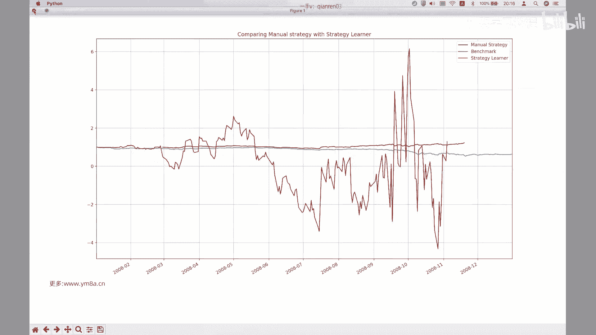

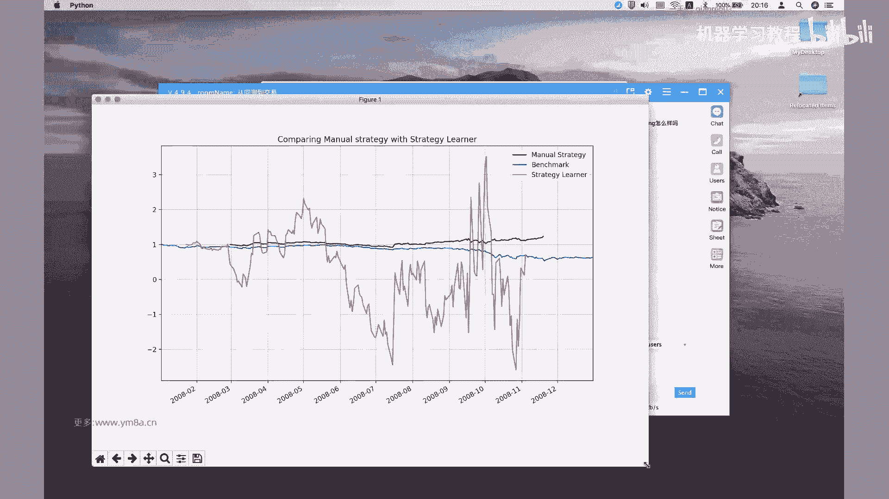

啊OK然后好同学们，我们现在回来，然后讲一下，就是呃我们这是怎么把，然后建立了这样一个strategy learner，的这样一个类，然后怎么把它应用到就是我们的C。

大家看到的就是我们这边import是我们的呃，q learner对，然后然后我们这边就是说然后注意的时候，我们是number of states，变成了A7，Number of actions13。

为什么是三呢，就是三的话代表是说我们是可以去浪，也可以去上，然后可以保持空仓不去操作，然后呃这边的parameter，我们这边上次我们讲过就是阿尔法0。2，然后伽马尔这边是0。9，0。8的K哦。

这边是0。5，然后这边这边他没有用那个就是dynamic q learning，然后我们当然也可以试一下，就是说如果说是把这个呃，改成就是单单的q learning的话，会有什么样的呃表现，我可以再测。

可以测试一下，OK先不管我们还是先默认是零吧，可能这个代码有什么问题还没有调通，OK然后呃就是说我们再去嗯，就是回归到就是呃q learning，然后或者是强强化学习的话。

就是说我们还是要看的就是actions，然后和states，然后对，然后我们的就是包括接下来就是reward function，怎么去设计，让我们去看，就是呃然后这sorry。

就是在这边有一个就是呃ADD evidence，然后我们就是看，OK我们在这边其实做的一个事情，就是说就我刚刚那个图是怎么画出来的，一个就是呃一个是用我们的，就是strategy learner。

然后再去考察这样一个呃test policy function，然后另外一个就是说我们是就是用我们的，就是嗯用我们的那个嗯就是用manual strategy，Strategy，然后再去去呃。

再去呃就是基于我们的规则去交易，然后再把这样一个图给画出去，把我们的图给画出来对，然后的话OK所以所以的话然后就说我们再看，一是在这边我们先看就是说呃at evidence这块，我们到底是去做了什么。

然后test policy的话其实就是嗯呃是先看就是test policy，对比说前面都是完全是就是是呃一样的，就是说是去获取数据，然后就这本质上是我们怎么去爱去做这样回测。

然后在这边就是有一个就是说呃，我们注意到我们的MANUSTRATEGY，在这边是做decision的时候是呃是什么，然后去分别的去做，然后同时符合条件的话，分别去long shot。

然后我们这边唯一的唯一的变化，仅仅是我们是看我们的action，就是我们这边的时候有有，然后我们根据如果action是一的话，我们去买，然后action是二的话，然后我们去卖对，所以说为什么要去这么做。

因为我只有说我去这样，通过我变化的仅仅是一个action，然后其他的因子的计算值等等，其他方式都没有变化，这样我们就可以形成一个apple to apple来对比一下。

就是整个的performance这样一个表现对，然后这部分还是说我的curious state，对cure state传进来是什么呃，如果大家还记得我们上一节课所做的话，说curiously是什么事。

就是说我这一步没有去更新我的啊，没有去更新我的q table，但我是这还是还是说我做q learning就是什么，我本质上是做了一个查表的过程对，然后就是说我选择根据根据每一行，选择最大的这样一个Q值。

然后我把我这那就是我选择选择出这样，我这样一个state对吧，我返回的是一个maximize的这样一个Q的，这样一个index，然后把它作为我的action对。

但我同时没有去更新我的就是q table对，所以在这边的话，就是说我去，每次我要去做到这样一个事情的时候，是我去去，我就我我能够就是说去carry我的呃，就计算我的啊啊CUTABLE对呃。

去查我的q table，然后得到了这样一个action，Ok，然后的话是说，我们在上面去做了一些什么样的操作，我怎么去得到我的这样的一系列的，就是CUTABLE跟我的action。

包括我的reward function怎么去呃，怎么去设计，然后这边的reward其实会比较简单了，就是说呃是拿我的，就是说相当于有时候我daily price change，然后再去乘以乘以一个哈。

乘以我的这样一个偷偷holding，相当于说呃我就拿我每天的呃，我每天的这样一个呃，钱去去我我我的我的投资和赚钱还是亏钱去吧，作为一个微博就可以了，对然后的话嗯，这边是2K ADD evidence呃。

At evidence，我们这边做的是什么，本质上他是做了一个，就是说我嗯呃呃大家还记得，我们上一次再去做啊，整个的过程当中，我是说是我根据我啊，就是我会做我的action，然后再去去实时的去呃。

就是我我那个我要去把一个点，移动到另外一个点，我我根据我既有的以及运动的这些数据，去实时更新，但是在这边呢我这边做的事情是什么，是说我我强化学习的时候，我不不能就是说是先去呃。

先去就是而是去失去实际交易，根据我随机的交易去赚钱去亏钱，那显然这是根据实际赚钱和亏钱，然后来去更新我的q table，那这样代价其实是有点大的，那这边其实他做的事情是，先是去从08年到09年。

只要一年的时间去把这样一个时间去，我去来训练我的q table，就是我得到我先，我先根据我历史的数据去得到我最优的，这样一个决策的这样一种方式，其实这这会有点像类似于我们说呃，我们去呃。

根据历史回测的数据去寻找最优的这样一个呃，量化交易的参数，然后我嗯然后实际在交易的时候，我根据最新的参数去决定每天的action对，但是这边只仅仅是变成说呃，我把现在我把它用成。

是我用这样一个q learning的方式去得到，我就有这样一个action，得到这样一个参数，当然而这边不是参数，我得到的是一个就是更新的是我的这样一个，就是我需要知道的是。

我的我的成人一个q table是什么样，然后这边来看一下，就是呃呃这边其实就非常标准的操作嗯，获取ANORMALIZE的价格数据，然后计算三个的indicator，然后就说这个函数是完全一样的。

所以其实就是把四就是这三个三个因子，只跟我们的价格去组合成这样一个方式，对，就这样这样，其实算起来会方便一点，就是对，就把我们下面三个方式做成这样一个computer，然后对。

然后上面是因为import的时候把它import，然后这边的话呃，然后这边他强调的是就是是那indicator的话，我因为要选取的是从我的呃，从我的就是啊从study开始。

所以呃sorry study original是对，就是我们的start date后呃，OK啊，这边实际上就是说我有一个就是lg的，这样一个天数，就是说我把我的呃，就是嗯我会说我原来的天数是。

就是说我是从2008年1月1日开始，但是呃在这边的话，我会把我的时间向前推40点，待会儿有什么用，我们再往下面去看，然后呃然后注意就是为为什么要去，就是说是去算我们的就是呃呃待会儿再看。

就是为什么要去算，就是我们的daily price change，我们来看这个接下来比较重要的一个函数，去把它进行离散化，到这里得到的是离散化的这样一个呃，然后然后我们得到就是说他的。

当中有一列是我们的state状态，那么初始的第一行就是我们的初始状态，好discrete，我们这边是，对，然后就是说OK啊，大家记得就是说我们的价格是一个连续的，但是我们要去把它去。

首先看的就是说SAM是他做的是一个，就是把我们的这样一个东西去切分成这呃，SM在这边对，因为我们就是simple moving average，然后他把这边是还记得我们计算的是price。

Simple movie average，然后我们认为range是从零到2。0，因为价格不可能为负吗，就价格啊，Sorry，价格有可能为负，就是期权，就是期权的价格，对之前就是期货的价格。

告诉我们这个嗯就是原油价格是可以为负的，当然在这边，因为我们是股票equity equity，不会跌到为就是为负的价格，所以说我们把就是说呃simple move average，从零切换到二。

而且这个是OK的对吧，呃呃这时候提一个问题啊，就是说大家有没有想起来，我们初始状态设为1000，这个时候大家有没有想起来这是为什么，为什么是1000，再提示一下，还是说我们这边有十个状态。

哪位同学能回答一下吗，为什么，为什么我们初始的state是1000，就我们怎么定义我们的，Number of states，为什么是1000，还记得我们上一节课就是在算这样一个呃。

就是N乘N的这样一个方块，然后我们要去呃，看它到底处于什么样的位置对吧，那我们这边的话就是说我们之前强调过，说是市场状态是无限的，但是我们要想一种方式去把它进行离散化，把这样因为我们去查表格的时候。

总不能是从无限的表格当中去找到对应的概率，应该知道那无限趋近于零对吧，那其实这种这种一种说我把市场近似的划分，你可以理解为是说当价格处于这个区间的时候，那这样这种这种呃你可以理解为近似是取积分。

就是说如果我把概率密度乘以这一小段的呃，距离DX，那么就得到了这样一块这样一块的面积，然后把它这个面积作为我这样一种状态，然后使得对总的概率为一，你可以这样去理解类比，但是对，然后我们这边用的是呃。

我们这边用的是三种，对，我们首先首先就是说为什么是1000这个问题啊，呀这这是的，就是这个因子是我们刚抢到我们的三种因子，每个因子的状态都是日式，那么当我市场我我的我的三个计算出来。

因子值可能是处于就是就是10×10乘十，因为呃因为因为这三个因子啊，嗯啊不是不是严格独立，但是是完全有可能是取到极端的三种情况，对不对，那么通过这种方式的话说，我认为就是说这三个因子。

刻画了我市场这样一种状态，那么我用这三个因子进行组合，不就得到了我呃，我得到了就是说在我这种体系划分下，可能的市场状态是1000对吧，所以这时候number states是1000，那么那么其实这时候。

大家就可以去想一个问题了，如果说为什么选三个，那么呃我是不是可以选100个因子啊，当然可以100个因子的话，只不过你这个表格会比较大吧，q table的话，那你这个时候。

尤其是如果你还是每个都画成十个状态的话，那你肯定就是十的，Sorry，就是十的100次方对，那那这样的话，其实这样这么大的一个表格的话，应该就是以现有的算力，可能都是没有办法去计算的，对不对啊。

嗯那当然看是不是有一些其他讲的方法，比如说我我我因子是想多一点对吧，那我想要有，比如说我要有十个因子，但是哦那那既然要有十倍因子的话，我十个十次方其实还是一个非常庞大的数。

然后这么大的矩阵呢非常占内存的对吧，然后那那这个时候我每次去更新我CUTABLE的时候，都要去进行啊，都要去进行这边的，就是去进行矩阵矩阵这样一个计算对吧，并且我这边还没有还没有写成矩阵化的计算。

我都是去取这样一个index，那么那么这个在计算机当中访问的话啊，比如说我十的十次方对，就是十的十次方是110行，对，我如果要访问D九十九一行当中的第X列的话，那实际上你内存你要去疯狂的去去移动。

你的内存的话，那其实呃开销是非常大的，那么那么有没有有没有一种，可能说我想要用多一些因子，但是呃仍然是使得我的计算是可行的呢，那那那那自然是可以，那我不知道大家有没有什么想法对，就是说我想要多一些因子。

但是同时也要保证我的q table，就是说我这样一个state仍然是可以计算的，因为因为大家还记得，就是说我们的就是我们那样一个表格是number of states。

乘以就是number of factions对吧，No action，因为比较简单的话，那其实就是number states还OK了对吧，顶顶多就是说十就是说十的十次方，比如说action就三种嘛。

那十的十次方乘以三，那其实还OK，但是其实还是说还是还是说是比较大，因为毕竟是对3×10的十次方，那如果说我想要去说用更多的因子，但是那那我可以考虑一下，就是我是不是要把它划分成这么详细的这样。

一个区间了，因为嗯对嗯，那那我是不是可以简单考虑说啊，我不用十，那我肯定用二，所以说无非就是001嘛对吧，就是说gt如果说是simple movie average，我觉得很简单。

就是价格高于星碰面movie状态是一，然后价格低于形PROMOE是一对吧，嗯那这种情况下，我即使说是比如说我十个印子的话，那这个时候我的状态数是二的十次方，1024对。

然后这时候再去乘以我number of actions，那这个时候其实我这个表格只有3000对吧，那么这个时候呃，这个时候我仍然仍然是那3072对，那这个时候就现在这个表格是1000乘一千三千。

其实两个人两个是处于同一个范围的对，所以你可以考虑的方式是说，那么那么其实这个时候又回到之前，这样一个问题，就是说，就真的是预测能力非常强，我我做出了非常强的因子的话，那么我自然是可以说。

这个因子在不同的范围之内，对于我的价格的未来预测会有比较大的影响，那这个是可行的，那如果说我相对来说是比较弱的一些因子，那我可能就要去增加不相关因子这样一个数量，那其实这就是另外一种思路对。

所以所以就是说对这一块，还是说我要么说是我近期的去挖掘一个因子，要么就说是我去多多尝试各种各样的因子，但是无论如何，在这边的话，我们都没有去考虑，说是啊对，就是说我们这边还是去强多多强调。

就各种因子的这样一种数量嘛，但但但还有一种，其实其实还有还有就是要考虑的是，如果这边是一个movie average，这两个movie average，一个是20天，一个是25天。

那我觉得其实两个号在一起意义就不大了，对那这边呃对，因为你两个意义的话，呃，你价格的话，20天和25天均值并不会有特别大的，这样一个差别，呃那么这样来做的话，可能就那种即使说你多加了我多多一个因子。

我可能是我dimension会多一个，就是dimension会去多，我会乘以它的维度不会变，但是我的number of states会乘以十吧，那其实意义并不是特别大。

因为这两个你可以理解为这两个是类似222，两列，两行的话是近似于线性相关，或者是对，或者是对他们有非常强的线性关系，所以呃一种思路就是说我是尽可能去找不同的，所以说应该是说去找不同的，尽可能有负相关。

甚至是有或者是没有相关性的这样一些因子，然后我们再去拿它去做组合，这样比单纯的就是对因子的数量，可能会更有意义一些对，OK所以discrete这一块大家就是可以理解了吗，就是说我们刚开始做的事情是什么。

是把它去这个方式的话，可以去查一下嗯，就是因为我们这次这里面用到一些，之前没有用到过的呃，对用到的一些方式，比如说data range对，然后pd card，然后其实可能很多东西大家都要去。

就自己去读文档对吧，然后他是把beings values into discrete，discrete intervals对，所以它本质上返回的是这样一个，不不不对，Kitty card。

它返回的是把它分为这样一个list，然后category，就就这个应该就是我们的直方图，对你可以理解为是指望直播，是直播，是去，对的这样一个切分对嗯，所以我们刚刚就是说我把它就是这个。

就是说把把我现在算出来indicator值，然后除以我这样一个BS，然后看一下它是处于呃，就是处于是处于是哪个range对吧，哪个category，OK这块大家有问题吗，呃就是，我可以把这个。

这个print出来，对你刚刚把代码发给大家，然后改一下路径，大家其实自己就可以能跑对，对吧，这个时候就是说我们把我们的呃，然后当然我们还要注意一下，我怎么去把它处理的对吧，他把我们的state变成呃。

就是在这边，这边就是用了一个相对来说比较巧妙的方法了，就是我们不是说有零呃，应该是0~9啊，还是啊SA不确定就是有没有零，还是一就是说是呃这不是0~9嘛，那我把它变成一个string。

然后我可以直接去相加，这样你445你其实可以知道呃，哪两个是除以四，然后就前两个是除以四，然后第三个是除以五，那么通过这种方式的话，我就得到了这样呃，就是得到了这样一个我们的这样一个state对吧。

呃其实要是要放这可能会更明显一点，就是他是怎么把三个给合到一起去，对吧，你当然可以说4×100，然后加上4×10，加上五倍等于445，然后用string的话，直接相加的话。

可能会容易一点对呃其实这边这边给大家引发，也就是提一个open question，就是说呃我有有没有更好的理想化的人，离开我的这样理想化的这种方式，然后以及为什么为什么区间是十不是五不是六。

不是其他的对，就是我这这里面，其实说这边我都已经引入了参数对吧，然后以及就是说all live all lier当然无所谓了对吧，all lier反正都把它当做就是都是极端值。

那其实已经能说明一些东西了，对，因为我们这边label把它定义成0~9，所以所以其实这里面我觉得就是我，就是我个人的思考是就有有有哪些关键，第一个是说呃，然后具有一定的预测能力对，然后第二个方式是。

我怎么把连续的indicators去做成离散的值，对这两部，我觉得是就是你要把它应用，应用的时候是比较重要的，所以我一直强调就是说嗯就是做矿trading，其实很多时候并不是说是真的说我用多fancy。

多复杂的模型，然后更更更更加要注重的是，我怎么用现有的比较好的工具，去刻画市场这样一种特征，其实本质还是要去去多多去观察市场，然后去总结市场的规律对吧，那么很有可能说的是OK我的算力是比你差一点。

那么我相信即使说我的，就是说我模型的这Q强化学习做的没有你好，但是为了我本来还说我只要有好的indicator，所以不管是用q learning还是linear regression。

我都能做出比较好的交易模型对吧，所以就是我个人的风格一直是强调，就说是去就是说是去注重对于市场规律的，基本的市场基本规律的挖掘，也就是寻找能够具有可预测性的这样一些因子，对。

这样我觉得是相对来说是可能是比较系统的，一种方式对，因为就是从这个角度讲说，我们是避免了，就是尽可能的去找到一种，可以复现的一种这样一种方式。

OK然后DISCREALIZE这个function我们就呃就讲到这里，大家还有什么问题吗，就我觉得这块是是比较重要的哈，对那其实就是课后作业，我觉得有两个，一个是说那位同学对A股感兴趣的。

我们先把A股的数据做下来，然后另外一个就是说，去进行离散化，然后，然后然后也要注意的是，我们这边都是是这样一种均匀的这样一种分布，那我是不是可以考虑对我的range，为什么一定要是均匀的呢，对吧。

就是我自己会觉得就是说呃，比如说我认为我认为波动有聚集效应，然后我认为就是说比如说50ETF，它的正常的就是得波动，年化波动率是18%，那么那么那么我认为理想的时候，理想化的时候不是波动率。

从18~20到22，那可能是18~20，然后20~24，24~30，30~50，50~100对，因为因为我觉得就是说你在波动率越高的时候，你越有可能去处于那样的区间，但那是说呃对。

那这个时候就说我认为28，就是比如说这几天市场波动比较大，那么28跟30的波动率，我认为差别不是特别大，就是它应该处于一个区间，但是28嗯，这个时候可能30跟35，甚至30跟40的波动率。

我认为这个时候才是比较有意义的，所以呃这个里面是有一些，我觉得是可以有比较多的调整这样一个空间，当然我们作为最基本的这样一个benchmark，你当然可以说我是，我就是用固定的这样一种状态对吧。

嗯这边稍微多讲了一些，然后我觉得就是大家可以好好想一想，就是嗯q learning算法，说实话即使说我自己没有搞懂，你没有搞懂这个算法，你去掉一个包来对吧，我相信是应该是有成熟的，就是强化学习的包。

我只要去呃就要去做，我我可能说我不是特别知道里面的细节，但是我可以去尝试把它作为一个工具对啊，当然我个人觉得就是说你要去想要用一个算法，最好还是去把它去给它理解透彻。

然后你要知道这个算法的优势和缺点在在哪里，然后以及有可能的话，你要去对它进行相应的调整对吧，反正就是从做量化交易，做应用角度来看的话，就是说还是说是回归到用对于数据的去挖，掘和理解吧。

对就是刚刚就提到了，说可能刚开始就说我都不知道那波动率，那我想当然当然认为跟价格是处于呃，就是跟这种movie average ratio的话，是属于一个类似的这样一种东西对吧。

但事实上来说不能有它自己的特性对吧，然后那那你说我商品期货是不是，也要跟股票都是去做一样的这样的处理呢，对吧，呃我觉得这里面还是有挺多的，挺多可以去细细讨论的地方。

OK然后这块就discrete讲到这里，大家有什么问题不。

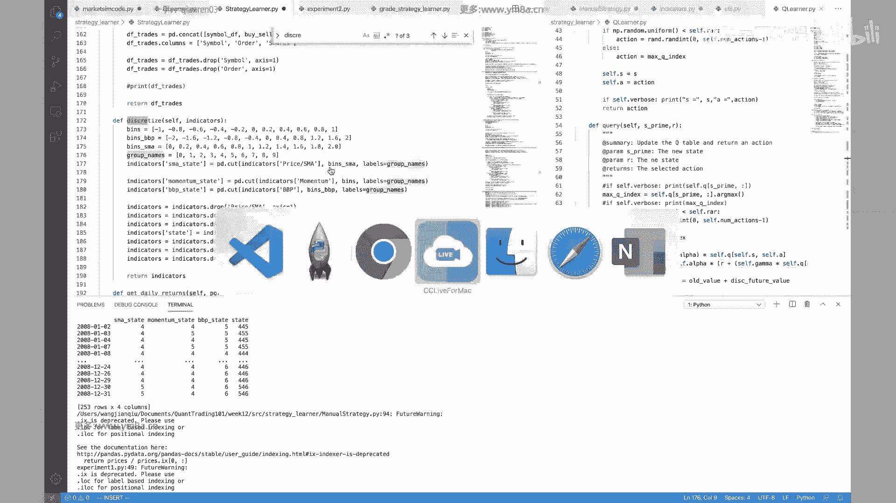

嗯嗯这位同学说的PC是什么意思。

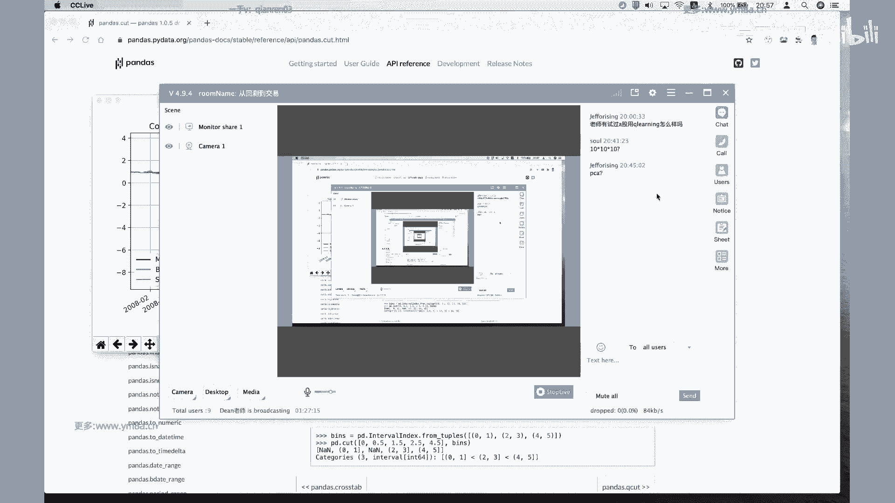

按理说啊你做dimension reduction，那当然也可以啊，就是说呃你可以试试看。

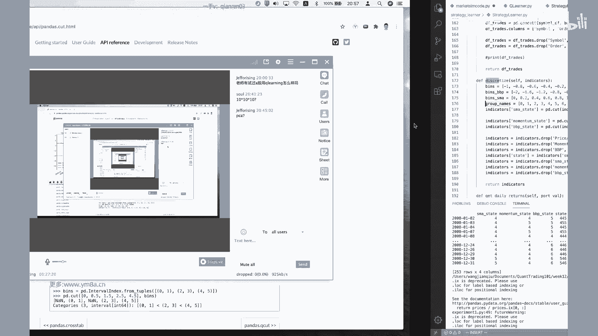

就是把你的呃，然后去选取，就是去做做，做到一些就是找到一些就是说嗯dominate1些啊，当然当然这样，我可能就是觉得嗯就是有这样一个问题，因为我做出来的因子的，其实可能是不是就是说不管是合成的因子。

可能可解释性可能会相对差一点，那我再去定这个range的时候呃，我觉得可能会会会引入一些麻烦对，所以我个人建议可能说在这边的话，你最好还是选择，就是说我知道是明确意义的这样一个因子。

但是我因为我自己也没有尝试过，把没有尝试过，就是说把复杂的因子丢到这边之后再去进行，让他去做q learning对，但其实这样的复杂度会比较大，因为之前我还有有之前有讲过。

就说拿遗传算法去主动的去挖印子就对，尤其是把那些因子值再拿过来的时候，可能那就更麻烦了，这个的时候，因为我知道simple moving average的范围是零到2。0，对吧，嗯嗯按照2。0不是啊。

就是说当然也有可能是极端对对，就2。0相对来说是比较高的一个范围，就是我今天价格是过去20天，平均价格是两倍，这是非常夸张的范围对，但但至少说我是知道，他是有明确的这样一个物理意义的。

呃但是如果是遗传算法挖掘出来，或者说一些奇怪的因子的话，那那那我们可能做的事情是，只能是从historical的去做了对吧，比如说我只能去按照历史上的数据的范围，去给他做一个把，把它去切分成相应的范围。

对那呃对，然后然后同样的同样可能应该强调问题是，当这个就是超出我市场范围这个事情嗯对，就比如说真的是2。0甚至是3。0，就这种这种情况出现的时候，我这个模型是不是还能work对吧呃对。

那这个肯定是要去大家自己去考虑的，所以对呃，我觉得这里面是有是有比较多，可以去改善和探讨的空间对，因为这边其实我们讲的都是非常简单的，这样一个q learning的这样一个模型对。

但是我觉得可能我自己还是一直强调，说是对于数据的特征的处理，我觉得会嗯更有意义一些，就是那就是可能不能埋头忙着写模型，然后把模型堆到系统去测试啊，这这可能可能还是先得去看一看数据，把它抛出来。

然后细细的去就是统计分析，就是各个因子跟这个价格到底是个什么样的影，响对吧，这就是功夫，可能还是要花花在挖掘市场上面对，OK那如果这个这部分的话没有问题的话，我们就到了这边。

然后我们这边是得到了我们的呃，然后我们也得到了知道他的状态，然后第一天的状态是什么，到后面的这一年的状态我们其实都知道了对吧，那得到了这样的状态之后的话，然后这边啊对这边先是把它都都我们就得到了。

就是先初始化呗，先初始化得到了这样一些呃呃sorry by sell的话对，就是我把把所有的我的alter都都写成，都写成是现在是买单对嗯对，然后XBO，然后df tree，然后接下来是就是有这样一个。

就是像一个类似训练的这样一个过程，Test policy，所以我应该把这个可能print出来，可能会好一点嗯，我先我先把它，就是最后我们得到的锤子给它打出来，然后，是OK，就是他这个默认的是by。

然后得到了一些是SK嗯，然后的话，就这边这边是一个在样本内，这样一个训练的这样一个过程，因为在整个过程当中，我们会去呃，我们这边a sorry啊，KI在哪里对，在这是在这一块。

还记得我们之前的q learner当中是怎么做的吗，对吧，我们需要在这波是去update cutable，然后return action，然后这边的，这边的flow。

首先还记得我们之前是传入的是一个string对吧，在这边是一个string，所以我们要把它变成我们的一个int，然后我们知道我们的状态数是呃，传入第一天的话，纯电状态是初始状态是445。

然后我的reward是什么，reward是我的偷偷holding，然后乘以呃day price的对吧，价格就是我就是我第二天带了，相当于就是我收益率嘛对吧，当然啊呃这边是把它做成了是总收益。

而不是收益率对，然后呃如果我是呃大家想一个问题，就是如果是多个标题的话对吧，你可以你可以怎么做呢，一个是你当然最最直接的说把不同的持仓，不同的持仓就呃都加起来，然后算算总收益，当然你要用多个标题的话。

那那我的状态空间其实又复杂了对吧，因为呃22不是不是状态空间，是我的action会会复杂，因为action不仅仅是呃买一个卖一个，然后或者action可能是应该是六对吧，因为呃sorry是33。

因为是3×3，不是不是六，不是3+3，是3×3，就是我当多一个标的的，多一个标的时候，我对于两个标题我有不同的，各有三种选择，这个时候我是3×3对，那这边的话可能就会更复杂一点。

然后当然你用单个标的的话，我直接拿我标的，就到第二天的价格变化做一个reward，然后这边有一个参数，Self impact，刚刚讲的是市场冲击，那大家想一想，为什么要把这东西放进来，其实很简单。

就是说我在模型当中我是要考虑一点，就是嗯嗯如果说我的就是嗯，确实我算的还得有收益，但是呃那我是不是要去鼓励平板交易呢，本质上来说这样一个加入这样一个self Impact。

我就要去把我的reward去降低，当即使说因为我每次交易都是要具有成本的，然后我我可以在这里面就加入这样一种，一个Impact，这样一个参数，其实是在说，我是我希望是说不要去鼓励平台交易对吧。

我们这边只是仅仅是考虑了呃，第二天的这样一个价格的波动呃，就是价格的第二天的，就是我今天持仓第二天会不会有收益，那么那么就是在reward这一块呢，其实大家还可以再想一想，说这真的就是我的目标了。

我只要赚第二天的钱吗，那其实我觉得可能还未必啊，那可能还考虑的是嗯，六最直观的你想说我不仅要考虑收益，我要考虑收益的波动率对吧，我这里面只有一个只有一个就是price。

只有一个就是price change，那么我是不是还可以考虑，就说呃，呃就是说我如果我是就是我是风险厌恶型的，那么我对于word当中，当我第二天亏钱的时候，我需要给大家给他加额外的惩罚一下。

那么我觉得这个里面都是可以去考虑的，所以其实说我们还是回归到，就是强化学习的几个东西，就是我怎么去定义我的state，然后怎么去调整我的reward function，然后根据我的呃做出来的。

就是然后我怎么去定义我的action，对我觉得归根结底它就是这些东西对吧，这是啊，就是我基于我们粗浅的了解，那么我们就是说把它应用到量化交易的时候，需要去考虑这些东西。

刚刚我们讲的就是说就在定义我st时候，我需要去注意那些那么reward的时候，其实我个人觉得这里面还是有不少空间，这边仅仅用这个可能会有点简单，但事实上呃就之前PO出来。

大家看到就是嗯如果我一味的追求收益，那其实那这样放大就是收益的波动，还是会比较大的，对吧呃对然后我们这边还提示action，然后同样的就是我根据我的q learner，得到了我的这样一个action。

反正action其实比较简单嘛，就是要么是买，要么卖，要么是空仓，嗯对那么其实其实这边还要想着说我买的话，是不是每次就是只能就是买，这就只能只能买1000，我能不能买500呢对吧，但其实就是说强化学习。

我们这里面都是用理想的状态，其实会做了比较多的限制，那我当然理想的状态说是尽可能去细分去呃，去就说是去加入，比如说我是当我发现信号一般的时候，我可能少买一点，但信号很强的时候去多买一点对。

但是说呃还是说回到这个简单的一个q learning，这样一个模拟的这样一个策略，那么我主要是来去评估他这样的，就是说这个方法，到底是不是可以应用到量化交易当中去，我觉得这样简单做是OK的。

何况之前我们也讲过，就是说呃我在策略初期，其实不需要去做过多的优化，我仅仅是说我只要去看这个策略，有没有给我提供一点正确的预测的可能性，有没有把我的胜率从50提到51，或者52对啊。

或者说是我的单笔盈利，有没有去稍微增加一点对，那么其实说后期的话你要去考虑嗯，后后期的话你要去考虑再去考虑，说根据这样的相同的这样一个呃因子的话，因子的值我到底是给他多少的仓位。

我觉得这个可能是要去从另外的，就是从头一方面，是从要从投资组合的角度去考虑的，对，OK然后这边的人说的撑死，就是即使是到了500的话，然后嗯就是说我每一次循环的话，我都要去。

就是说是去把我的price去做这样一个呃，去做这样一个训练对吧，然后等因其实我这个时候没有去算我的，就是没有去算我的那个呃，那当然我的偷偷holding还是还是在去，就是不断去更新的对。

就相当于说把我用相同的历史数据，我还是不断的去重复的去训练，更新我的q table，OK然后这一块大家有什么问题吗，因为这是我们的就是在预训练的这样一个步骤，而不是预训练，就是训练的这样一个步骤。

对就简单小结一下，就是说呃我们需要考虑的是new reward function，然后我的刚开始其实是初始状态对，然后我的action，然后是我的reward function。

对然后然后接下来再去拿样本去测试，我们刚刚是拿了08年，现在是拿09年的数据，那么仅仅是对，然后就是我仅仅是拿到这样一个cute table之后，我直接就去去算我的呃。

就是嗯就是嗯嗯然后这个时候我就没有去，没有去，就说是再去那个，就这个时候直接拿我的书，现在有这样一个table，可能是直接就去把它去应用了，对，大家注意，我们这边就是没有这样一个。

多重循环我们仅仅是就是一次性的，就是我拿到了这样的一个呃这样的一个状态，然后根据这样这样的我的状态去开始，就是直接去进行simulate了，所以然后最后再去根据我们的这样的返回。

到我们这样trade再去再去做进一步的评估，所以其实整个的呃，整个的流程其实就是，我们先定义一下我们的q learner，然后在在我们strategy当中，我去把我的特征去按去计算好我的因子。

然后把我的特征去进行离散化，得到我的初始的状态，然后根据我的初始状态，拿另一部分的历史数据去进行训练，得到我的q table，然后再去根据我的这样得到的q table，再去拿到最新的数据去进行。

就是一次性的把它去去进行，根据这样的q table去不断的去啊去去计算我的action，大家要注意的是，这个时候就是说我事实上，我在这一年的数据里面，还是会去不断更新我的action对吧。

呃就是不断去更新我的q table，因为我这边还是呃sorry sorry，这边没有更新了，嗯嗯这里面OK当然问题也不大，就是说我这一次的我这一次啊，我们我们前面是训练了跑了500次，对不对。

像我们这边只有不知跑了一次，所以其实对于整体的q tb来说，影响不是特别大啊，呃所以说我只是拿了过去一年的数据去进行，我的去进行去进行，我的就是prediction来去做决策了对吧，所以到这部分的话。

就是大家有没有什么问题呢，但我简单说一句，就是说我觉得可能实际实际当中，我们我们之前要强调的是做滚动优化，对不对，其实说我拿了简单的这因子，那我就说我怎么去决决定我第二天的就是说呃。

第二天我到底这个因子有什么参数，我们说的是我们是做rolling的去计算，比如说我的窗口始终是拿过去两个月数据，那么来新的一个交易日，我就把我这两个月向后移一天，那么在强化学习的时候，如果算力允许的话。

我是不是完全也可以这么去做呢，我觉得是当然是可以OK的，就是说比如说我不不一定说是我这边是一年，我不一定是每天去更新，那我是不是每到一个一个月的时候，比如说到了二零，这边是2009年的2月的时候。

那么就采用的是2008年2月到，2009年1月到2月1日，这个时候整整新的一个12月的数据，再去重新跑上面这样一个流程，得到最新的q table，然后拿这个q table再去跑。

我接下来一个月的这样的一个learning，这样我觉得是不是会好一些，然后这部分的话就是说怎么去，怎么去滚动的训练，我觉得大家可以去尝试一下，因为其实我其实大家刚看那个回测的表现，其实也能看得出来啊。

尤其到了后期的时候，其实波动是非常大的，嗯对所以，其实其实这个会有点像，这这面其实又引入了一个新的问题，我如何判断我的模型已经失效，对吧，其实前期我觉得相对来说表现还是OK吧。

就是到了后期简直是bullshit，或者是就完全是对，所以因为我就这这里面还有就是一个open的问题，不仅仅是对于我们的强化学习，包括你对游泳前面哪怕是规则性，哪怕是说是用深度学呃。

哪怕这种遗传算法得到的一系列因子，我们都有这样一个问题，就是说我怎么判断这个模型是失效的，这是一个open的问题，是留给大家去思考，然后q learning的话，就呃，我觉得是到这边。

基本上算是作为一个用花了两节课时间，做了一个close对，对，其实这里面就是给大家提供一个，比较简单的框架，然后我还是希望大家就是去大in，然后去仔细的去把代码里面，就觉得自己去debug去跑一跑。

我觉得可能会更有收获一点，然后啊对上一节课的例子是，就是大家让大家去亲手去自己去实践一下，怎么去increment这样一个q learning这样一个算法，然后如果你觉得呃对。

然后我觉得可以对照起来慢慢来理解吧，对然后如果实在理解不了的话，我觉得这节课我还是大家要动手去做一做，我觉得可能会更有意思一点，因为整个process相对来说，就是代码基本上都已经给出来了。

然后跑回测结果也都可以直接去直观的看到，我觉得大家可以去尝试去，不管是调整模型还是调整之前，我们测的那些因子，你都可以拿过去试一试，看看怎样的会好一点，对不对，甚至说对包括规则性的交易策略。

其实大家都可以去尝试，然后我不知道就是到现在为止，就会有多少人把自己的那个BTESTER给跑通了，对，然后有这就是我们也上了几个月课，又在坚持，每天就是去尝试去研究研究各种各样的策略，对OK嗯好。

那我们大家先休息一下，然后大家就课间时间，把整个就是q learning这个过程去回顾一下，然后有什么问题的话，我们再来去讨论好吧，我们先课间休息，哎hello诶。

哎同学们那个对于q learning这一块有什么疑问不，这人今天主要内容是呃就是讲这么多，然后对，然后主要是想就是我不知道上一上一节课，就是大家那块就是有没有搞懂是怎么回事。

就这其实核心就是还有还有上次发的那篇paper，不知道大家有没有就自己去看，然后反正不管怎样的话，可能还是把他这差的，他的核心思想去理解清楚吧对吧，就还是就是immediate reward。

加加这样一个discount这样一个reward，然后你去选择你是你的这样一个reward呃，呃就是最大的这样一个action对吧，啊大家都都都没有疑问吗，呃OK然后对，然后这边还有一个。

OK然后这边的话是，对我还是希望大家就是去把那个呃给去把自己，最好还是把那个代码可以自己去看一遍，我觉得可能会好一些，对最好是自己能够把那个QLERY，就是这块代码去给看一下。

然后其实其实上一次还有一个就是很LUCY，这块没有讲这个对，这是什么意思呢，就是说我们上次有简单提到说，当我觉得就是说在整个q learning的过程当中，其实我每次都更新update的话。

其实呃它所需要的curator update呃，你整个计算是比较复杂的对吧，因为你要去就算呃就是算一个DISCOUNDED，然后跟一个KAREN这样一个reward，然后你还把去相加对。

然后这边所以我们这边再去做，就是就是在我每次更新完之后的时候，我能不能再去用啊，再去用我现现有的这样一些，就是我去人工的去构造这样一批数据，来去更新我的q table。

这就是说是一个DINA的这样一个q table，这样da q q learning这样一种特性，就是说他这边说，如果说我想要去说DINA这边的默认参数，我记得是这边是零，OK但是你如果说是。

比如说我这边是选了20默认的这样一个呃，我们这边可能还没有加，待会可以试一下，就是加上这样一个DMQ的话，效果会怎么样，当我加入呃，就是说这样的一个呃。

我想我要进入就是大量q learning这样一个过程，我会生成就是我所有的，我的我的state跟我的action都是去都是都是random的，去生成这样一个random对吧。

然后的话当然这其实我的s prime，这时候我是用一个就是MULTNOMO的这样一种分，布来去来去来去去随机生成的对，然后这个时候就是我transition。

transition这样一个matrix的话，就是说这个cf t跟上次有点不太一样，T，所以说这这这就是我们之前的这样一个，它是一个三维的这样一个dimension的。

就是说是state action跟我的一个states呃，呃对对，然后然后就说这边的时候，因为它的核心是在这边，就是我们我们我们我们之前的话，就是说都是要去从我的表格里面去找到，我的这样一个呃。

就是我要去cue，然后找到我的max的这样一个Q的index对吧，然后这边的话，这边的话其实就是我完全是采用了这样一个，随机的这样一个S和AN了，然后然后是包括我的。

包括我的就是嗯就是包括我的这个s primary，也是也是也是是去用一个就是多元，多元正态的分布区域随机生成的，然后呃对，然后然后关键一步，就是说我怎么把我的这样一个就是我再去呃。

我在每一步去计算我的q learning的过程当中，如果我加入了这样一个DQ的这样一个过程，我都会去做这样一种，就都会比如说我这边是参数是20的话，我可能都会去跑额外的20次循环。

然后把我这样得到了这样一个CUTABLE的时候，去更新到我这样的一个更新，到我这样更新到我现在这样一个q table里面去，然后从而说是呃就是说是在q learning的时候。

我希望能够得到更多的外部的一些呃呃呃，引入外部的这样一些随机性对，然后具体的话我觉得可能还是大家得去啊，我不知道有没有好的啊，tutorial之类的，就可能大家得自己去额外的把。

把这块的就是东西给就是给补齐吧，对，呃然后OK然后我还是就是上一次有问过大家，然后接下来其实就是我主要想讲的整个课程，就到现在讲了12节课，就是很多东西都呃我不想讲的。

主要想讲的内容都其实都cover差不多了对，因为有些课程可能就是中间速度会，有的会快了一些，有的会慢了一些，然后呃我是想问问，就是接下来针对性的，大家的话，就是对于这个课程有什么样的一些想法对。

或者说就觉得有哪些地方想要去再去，我们再一起去探索一下的对，呃然后我自己就是如果说大家没有更好的计划，说我自己的发言可能就是说是我们再去，就是可能是像就是像这两节课一样。

就是选择一些相对会前沿的一些方向，但不一定有实际的应用，就是说只是给大家说，指出一些可能去探索的方向对，然后呃就是比不管是说是偏向高频，还是说是偏向说用深度学习的方式，对，我觉得可能这样。

这样的话就是让大家开阔一些眼界对，然后另外一种方式说我们再去，就是说再去回顾一下，就是说看看业界，现在比如说传统的，哪怕说我们基于规则的交易，我们是不是可以去做一些尝试呃，比比如说其实我自己。

我记得我刚开始工作的时候，其实做了一个事情是嗯应该，对就是。

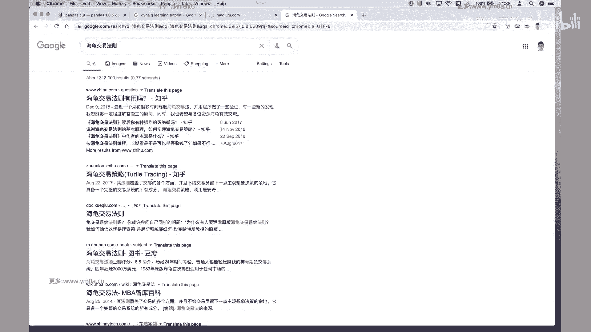

这我其实刚开始是说去入门。

就是说去尝试做CD交易的时候，可能当时什么都不知道，但是我我我我我实习的时候，leader给我第一个任务是，你把完整的海龟交易法给去实现出来，对那么那是海格交易法，可能很多人都觉得。

不就是20天跟55天均线吧，但事实上就是有一本就是海龟交易的PDF，我是把完整的那本书里面的所有讲到的，包括是folio的performer，folio的这样一些规则，所以说我到底什么时候加仓。

什么时候减仓，除了是计算，就是那除了是对，就是这这这些我可能都把它实现出来，并且是把它在呃，并且是在就是多个contract上面去进行测试，但我觉得就是说如果就是到目前为止。

大家会觉得是说对于整体搞得不是特别清楚，有概念也好，我个人的建议是可能是完整的把tural trading，整个的process是啊了解清楚对，然后去把它去implement出来。

我觉得这样可能会意义会收获大一点，因为之前可能我们讲的都是一个个，模块化的东西，不管是找印子，然后是啊，然后是design design整个回测系统，然后或者是呃再去用各种各样的，不管是用遗传算法。

还是说是用机器学习的模型去挖掘因子，那么可能大家不太知道自己所做的事情，在整个process当中是有什么样的价值或者意义，那么我觉得更为明确一点的方式是说，如果是想要去检验一下自己。

整个到目前为止学习的这样一个过程中，我我个人建议是可以尝试把turtle trading，整个的过程是不管是从前面的数据，然后还是说我们的策略implement，回测和分析，我觉得可能都不好。

然后因为其实这个人都去把它实现出来，因为其实我觉得这里面，我我当时实习就是做完整个project，最初感受是觉得，就是好像对于CC交易，是真的是有一点不一样的感觉，除了刚开始的时候。

每天就是嗯每天就是写因子，然后是做各种各样的画师回测，那么在海龟里面就说他提到的不仅有止盈，还有尺寸对，所以呃我我个人建议是，可能把那本书里面的完整内容去找出来去，然后大家就自己去测试一下。

然后我觉得可能这样收获会大一点对，然后我可以告诉大家，就是说即使到现在，他整个海龟交易还是是可以去盈利的，对，就是它作为一个我觉得是相对来说，比较初级的交易系统来说，但是最基本的是从他的入场点，出场点。

包括是组合的管理来说，我觉得还是相对来说是比较完备的，只不过说是基于现代的，就基于到当前为止，CC交易可能说是它是会有一点落后，但是它其中很多思想仍然是值得我们去借鉴的，对，然后对。

这是我觉得可能是就是说如果是觉得嗯，可能是检验自己学习效果的第一步，就是说你要去把整个海龟交易策略去input出来，对诶诶诶说实话，其实你要把完整的他的呃，整个海格策略去input出来。

其实还没有那么容易对，因为它这里面嗯涉及到一个问题，就是说这这你可能真的得要去用，就是用一般追问的这种方式，你可能简单的用呃，用就用今天用的这种灰色框架，你可能还不一定做得出来。

因为它涉及到根据我现有的这样一个它，它会依赖于我当前的一种状态，对它会依依赖有当前PFU的平均的持仓成本，价格之类的东西，对对他会有这样，它会它会根据我当前的优点来去计算。

所以所以说你真的可能得用one driven的方式，去实时track，你的就是偷偷的就是你perfolio value到底是多少，对，所以我会觉得就是说你如果能把这个project做出来。

我觉得上就是对于整个课程上，到现在，我觉得应该是，我觉得应该是会算是一个比较重要的mo stone，即使说我其他方法都没有，但是我至少知道了怎么去SYSTEMIZE，去implement问这样一个策略。

对我觉得呃应该是就是上课上到今天，每门课的就坚持到现在的每一个同学，我觉得大家应该都有能力去把这样的事情做完，呃可能就是只有这种以这种方式，就是我明确的知道。

我的目标是我要自己能够去implement的一个策略，那么以这个作为开始，我觉得接下来才能可能再去往兰花路上，走得更远，对，因为事实上从我我会觉得，就是说这样一个简单的模型。

其实我们能去改的事情是非常多的，对，不管是说是我们除了说是我们的，就是你进场的指标，实际上这个是最好最好去改变的，我可以用尝试各种各样的，我做的因子跟呃模型去尝试我的入场，然后另外一点可以改变的。

就是说是呃我们刚刚说的是日级别，但实际上是说我念大家都不知道有没有测试，或者说在分钟级别上面，是会有有什么样的表现对，然后就然后以及还有还有一点，就是说我们到现在都没有讲。

就是说呃就是策略里面我们不是有各种参数吗，事实上就是说呃，在我们平时去交易过程中去测试参数，我们不是手动去改参数，你可能得把整个策略就完全封装好，你应该让啊计算机去自动化的区域。

不管是用research网格搜索，还是说你用模拟退火，用其他的算法，可能你都要把你的策略去封装好，把你的参数作为，就是你你你要有一个参数的选择空间，然后根据我的参数的选择空间来去。

然后去就是根据这样的空间，也需要让计算机不断的去寻找到，最优的这样一个参数，对这部分可能也是大家需要自己去补齐的，但是我觉得就是说呃可能刚开始不用想太多，就是可能你需要先完整的把这样一个。

任何一个策略去加上，我们前面所有东西把整合出来，能够让它去跑起来，能够看到一个完整的回测曲线，对根据这样的曲线之后呃，首先要确保当然要确保它是正确的，对我建议还是说你做完了之后。

需要去拿你的excel表格去对应一下，就是去看一下你实际的交易的仓位，你的pl集团是不是正确，因为这部分是非常关键的，对做完之后，然后你可能再去尝试，而以此作为基础不断的去改进，对，然后对。

就是今天就是主要是跟大家扯了这样一些，然后我还是想问问大家，就是对好，OK然后大家想看一些比较成熟的策略，呃就是首先我想说一点，就是成熟的策略，就是说比如之前在公司交易的模型，那么显然是不可能说出来。

但是呃如果说呃其实怎么说呢，就是其实我们今天课上，我们课上讲到的很多思路的话，我会说是说可以说大家都是在，就是不管是说因子挖掘还是说是T，其实大家都是就是说整个的框架，似乎大家都是在这样子。

不都是在这么走，包括说用自然用自动去挖掘的因子，但是大家有没有提到，就是说我每次课上都提到，说这边我们可以做怎样的改进，怎样的改进，嗯就具体说我们课上讲到就是真正的策略，可能也就是真差距在哪里。

差距在于说我们有没有去去进行进一步的挖掘，有没有去尝试各种各样的参数改变周期，然后是不是有没有对我们的因子，作为更为严格的测试，这个距离可以实盘的测，我觉得距离可以实盘的策略。

可能就是说在这是这是我们的，我觉得是差的比较多的一个地方，是在这边对呃，然后要说一说，其实其实我们都甚至就是比如说是啊，就是说想要看到那个策略的话，我其实这边有就是有历年的，就是之前有CTA的策略。

各种各样的策略，可能几百个上千个都是规则型，各种各种各样的因子，就是完全不管是规则性的还是怎样的，其实都有既定着别人测试参数，我觉得如果想要去那个的话，我可以就是下节课可以给大家讲讲几个。

就是我觉得就是就是讲几个，就是我觉得是比较经典的这种策略，然后更多的话可以就是其实把书发给大家，大家自己去研究测试，我觉得都完全都没有问题对，就是就是我还是说归根结底量化这个事情。

就是说我并不会觉得说它存在所谓的civil，Bullet，就是所谓存在的银弹，我可以一次性的把事情做完做到位，我觉得更多的可能还是去不断的去打造自己的，就是系统，然后不断的去深入的系统化的研究。

然后然后对这两个是不断迭代，因为如果我系统不好，事实上我是做不出什么有价值有意义的研究，因为我比如说我测一个东西，我回测结果做了半天也不准确，或者说做出来的啊，或者效率比较低。

那么我可能会丧失了继续研究的这样一种兴趣，另外对，所以你我的研究的，然后另外一个说我即使有了很好的系统，结果发现可能我也没有想到什么，特别有意思的方向，也不会去尝试，那么其实你可能就浪费了这样一个系统。

对，所以对这两个可能是不断迭代的吧，然后当然就是说，可能大家会基于自己的职业发展会去选择，不同的会去选择不同的方向，因为呃在成熟的公司当中，不太可能，所有人就是不太可能一个人去cover所有的方向。

但是我会觉得是说，你至少说想要如果想要成为一个pm的话，可能还是要去把各个方向都会去了解一些，当然pm最终你是要去嗯，你是要去作为拍板去做交易，做决策，这个人你是要去决定我当前的策略。

是我应该配置哪些策略，哪些策略该停止，哪些策略该继续运行，对，然后基于当前的盈利和损失，我是否要暂停或者是启动新的策略，对这个我觉得可能是一个pm要去考虑，那这种决策能力的话呃。

我觉得可能一方面是说我去做研究，但另外一方面可能也是需要在实际的实盘交易，当中不断的得到反馈的，对，因为我自己也是处于这样一个过程当中，就是说有一些交易OK，然后有一些交易不OK，但是就是说有些人赚钱。

有时候亏钱，那么就是还是要去处于不断自己的进去，进行反思吧，对甚至会去尝试说新的方向，说这个策略如果觉得在当前不挣钱的话，是不是要去考虑我要去尝试新的策略的类别，对，然后说甚至说我做了一段时间量化交易。

然后有时候就会陷在那里，那是不是有时候会跳出来，我就考虑一下，比如说我去看一看宏观的人再去做什么事情，他们宏观交易有有没有一些东西，我可以借鉴到我的期权的交易方向上，期权上面去对。

然后比如说我之前是做CT跟期做期权为主，那么我是不是考虑一下，其实CTA跟期权是会有互补性，那么我把我期权的优势挪一部分到CCTV上面来，甚至说嗯我之前是做期权交易，那么CTA的时候。

我们可能是拿期货做标题，后来发现A，那我是不是可以考虑把期货CTA对应的商品，期货对应换成相应的商品期权，那么呃这个呃，那么这个时候我可能会发现，我比单纯做人又有一些优势，因为我能够去利用期权的特性。

即使在做出相同的方向的判断的时候，我可以选择用更优，或者说是呃成本更为低的构建构造，构造交易的这样一种方式，对，那么我觉得这个过程可能是需要大家不断的去，呃去就说建立自己的体系，然后不断地去循环。

然后拓展自己的边界，因为呃对就是拿我自己而言的话，可能刚开始的时候我记得刚入门的时候，其实呃就是包括其实C加加写的，其实还挺一般的，但是就是后来是啊，这这这这几年是不断的有在去，就是改进写代码的能力对。

然后啊包括说以前说不是很了解计算机的底层，但后来操作系统我可能也要去了解，对高频的东西也会去做一些接触，然后以前可能只懂一些期权，对，那后来还去再去看期货的模型，然后最近其实也在有去看那个。

固定收益的一些模型，对其实很多东西我觉得都会都会是怎么说呢，就是大家应该都是处于一种不断保持学习状态，然后去拓展自己的边界，然后然后关于说提升自己的决策能力，也就是说我以后想要去做什么样的策略。

做什么样的嗯，做什么样的方向，我到底是做矿还是做trader，还是做呃corn developer，还是说我就想做operation，因为啊我只想做risk，那其实我觉得这个是完全不是说有孰高孰低。

我觉得是完全是看个人的兴趣呃，一方面看转型也是看自己的，就是说能能力跟对应岗位的就是需要的要求，是不是可以match对，然后然后以及对对，然后我觉得只有这样的说，不断的在市场当中是得到反馈。

然后再去调整自己的定位，我觉得可能长期这样来说会比较好一点对，然后我相信就是说呃上课坚持到现在的同学，应该是德兰花，我觉得还是是相对来说是会有一些兴趣的吧，对那么我觉得如果咳咳大家的话。

应该还是可以说是呃不管是在学生，如果是学生的话，那么肯定是抓紧时间好好刷题，然后提升自己的数理功底，然后提升编程能力，然后争取于是找到一个好的平台，开启自己的职业，那么嗯如果是工作。

工作当中已经工作的同学呢，可能说是OK，我想去了解一下这方向，是不是可以在我的主页之余增加一份嗯，新的工作，但事实上这也是我现在自己在做的事情。

因为我之前是做corresearch and training，然后后来其实我去做了，就是做算法工程师，因为我后来发现，其实我对于，那么是为什么呢，因为我发现就是我在工作当中用到机器学习，其实还浅一点。

我自己对他不了解，但是我后来去做，在做算法工程师的过程当中，有系统的吧，呃深度学习和机器学习，这些东西都慢慢的就捡起来了，然后事实上也是说也帮助了自己，后来的就是交易当中不断去嗯。

嗯就是有就帮助了我自己的交易，因为我可以用呃更优秀的工具，然后包括说以前也不了解GPU编程，那么呃后来的话就是在工作当中也接触到了。

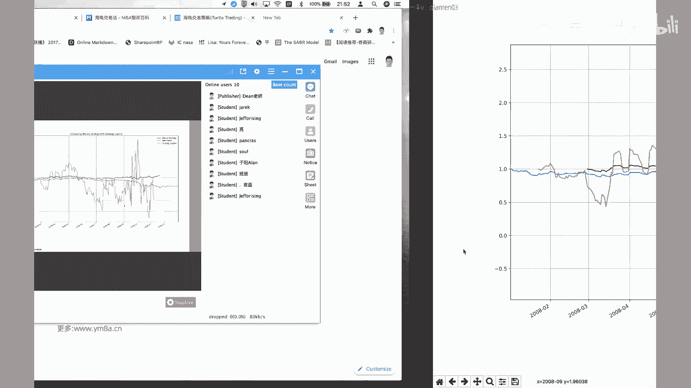

GPU编程，那么也根据，然后也会把这块知识，慢慢的去迁移到良好教育当中去，所以对我是我是我是想说，就是如果大家对于呃况确定比较感兴趣的话，其实就是说这门课，希望就是说老实人能够帮大家打开一扇大门。

然后让大家看到其实这个领域是非常不明有，我觉得在中国，至少是相对来说比较不明的一个领域，还是会比较有意思，但是当然就是说，至于说要不要完全换到这个职业方向来说，我觉得可能是看个人对，如果能有好的平台。

好的机会，我觉得OK然后如果说是对，因为因为其实相对来说，这个他的risk还是比较大的对，然后不管是啊，你肯定是顶级的头部的几家放的会好一些，那么呃其他如果是小一点的话，可能会。

我觉得就是说职业上会有相当相当的一，些风险对，所以可能得让大家自己去考虑对，当然做完矿之后也不一定说是一定要去做交易，因为事实上就是说做financial engineering，在各行各业。

尤其是我觉得还是有挺多的用途，包括大家有没有注意到，就是说呃，这事实上是我们理解说QU开始是为了做定价，做pricing而著称的，但现在其实呃price已经应用到各种各样的原因。

比如说著名的购物网站JD对吧，他们会去怎么去根据不同人群偏好去做press，然后甚至还说是p two p个人的贷款啊，美国有landing club对吧，然后中国有比如说陆金所。

那么我针对各种各样的人群，我怎么去把我的贷款卖出最优的价格，我觉得这里面其实都会有一些是会借鉴的，就是financial engineering的一些东西，所以量化我觉得不仅仅是说。

就是说不单不单纯是一种是，这仅仅是应用在交易，它更多的是一种思维方式，是是是建立是关于世界去建立一种定量可解释，可复现的一种方式，帮助我们去理解和认识这个世界，这是我觉得就是是呃。

我个人觉得是比较有意思的，我个人觉得量化比较有意思的一个地方，对嗯然后的话对，然后觉得就是说嗯，这门课程就是75%的内容已经讲完了，话就是说我觉得呃，大家还是就是说可以把，这就不管是之前有没有完成作业。

我觉得还是就是把之前的一些代码，慢慢的就是去大家就是自己去，我觉得是不断的保持深化了，因为我记得还是有几个同学我觉得还蛮不错的，就是会，但不管每次作业都会就接着会去做，自己做更多的东西。

对我希望就是大家继续保持嗯，然后的话大家还有什么问题吗，对今天对，因为我其实就是也跟大家打声招呼，因为老师确实呃也是第一次就是上这种课程，然后有时候课程的节奏，可能会把握的不是特别好。

就是有时候可能会快一点，有时候会慢一点，对，然后之前可能大家会觉得，就是说如果一节课可能讲了写不了多少代码，那可能会觉得慢点，然后现在可能采用的方式，说是我们把所有的代码都给出来呃。

对就可能大家会觉得就是大家看起来会比较爽，但实际上写代码的时候，debug还是我大家自己写代码也知道，就是不让代码跑上去，要花的时间远比讲代码时间要多得多，所以就可能有时候自己节奏把握不好。

觉得写了这么久，看了就调了这么久的代码，可能大家跑起来的话可能会很快对对，但是实际上讲的话，原原来预警说可能要讲三个小时，但后来发现两个小时也就讲完了，呃，呃不管怎样，就是我觉得就是既然是就是代码的话。

我觉得呃，这节课的话作业，可能大家还是要去去自己尝试一下，就是我觉得最基本的是把整个process给跑通，然后我们现在这边不是给了几个新的gr，或者就去给它补上去，然后去嗯。

然后去调整而去测试一下在q learning上面的表现，然后另外要做的事情就是呃就是大家要去思考，就是整个q learning的话我怎么去，就是在实际应用过程当中，我需要去做哪些调整。

因为我觉得这里给出来的呃，还是相对来说是比较简单的，对，就是我没有考虑特别复杂的空间，然后对包括我decision making的话，都是一千两千诊手术，那这里面是有比较多的空间的。

我觉得大家也是可以去思考的，但是这这这我还是说说一切是凭数据说话，对不是说我拍脑袋决定，就是说这样啊这样的划分就好，而是是就是说这里面我肯定要去，一方面说我要去做实验对。

就是我完全去尝试各种各样的策略和参数，然后凭我技巧表现，从曲线上面来看，然后另外一方面的时候呃，可能就如果你真的丰富了很，得到了很多的测试数据，然后发现某些参数确实OK，但是找不到理论解释的时候。

我觉得这个时候可能大家需要回过头来再去，就回到算法本身，再去看q learning这一块本身有什么样的缺陷，然后它有对，然后这样的缺陷，会对我整个模型造成什么样的影响，那么这个时候再去考虑。

就是你要去找新的paper，看他们有新的q learning的话，哪些我是不是可以去尝试对，然后就是我自己的一个习惯，就是说就是ARCAVE上面其实有一些新的。

就是关于flash engineering1些paper，其实我还是愿意把它抓下来的，因为有些idea其实真的是比较简单，你不管是MTB还是Python，简单跑一跑，你其实都能。

我觉得会对你考虑因子会比较有好的收获对，因为word corn，其实他们典型的思路就是就是，虽然有人说他们是人肉血汗的挖因子的工厂，但其实我觉得他们的research还是比较，就是还是比较靠谱的。

就是音还是会去说我们会去看paper，从paper里面去深挖一些因子，另一篇paper除了他给到了说这个因子之外，可能还有其他的很多很多的因子都可以去，都可以从当中去得到一些想法，对O呃。

所以就这节课主要是跟大家就扯了一些，闲的没的，那么还是希望大家就是说嗯对，用好自己的时间吧，然后对就是去不管是在各个方向，如果不管是想要去呃，做矿的，做trader，还是说是想单纯就是说增加。

或者说我想去以后做宏观交易，我都希望有这门课程能够帮助大家，如果没有接触到这个领域的同学，可能说希望帮大家打开一扇门，然后如果是想要从事这方面的学生呢，也希望呃给大家一点小小的感受。

就是知道以后的工作当中，我可能会在做什么样的事情，那么我觉得这门课程的目的就达到了好的，那如果就是没有什么问题的话，那今天的课就到这边了，那同学们还有什么问题吗，好的辛苦大家就是对。

辛苦大家每周六晚上坚持到现在。

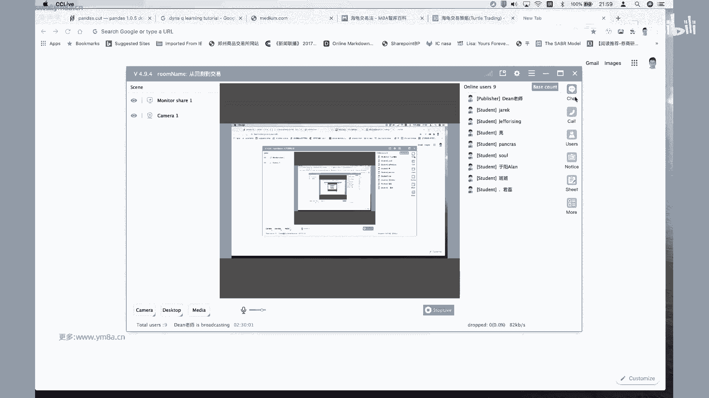