# 26集全！B站目前唯一能将【量化交易】讲清楚的教程！用AI从零开始打造你的交易机器人！大数据量化交易／机器学习／Python金融分析 - P20：第一十三章第1节： 期权定价模型 - 机器学习教程 - BV1w4421S7Zx

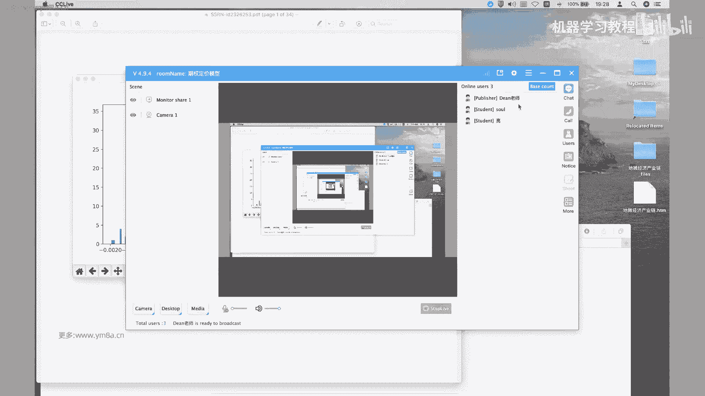

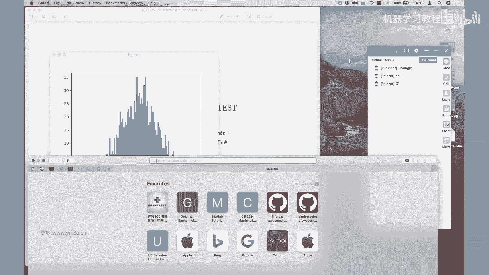

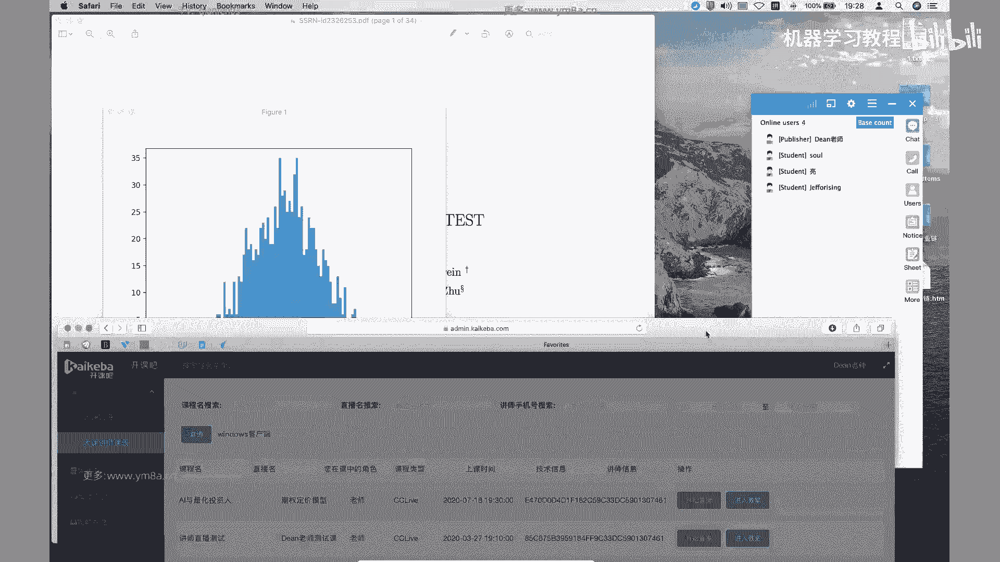

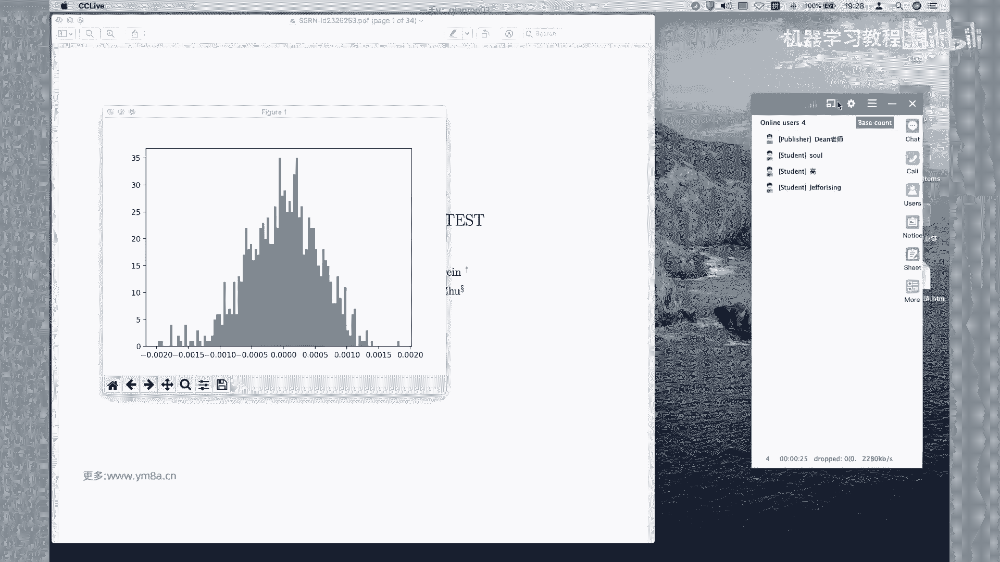

OK各位同学，我们稍等一下啊，嗯今天主要课程是给大家讲一讲，就是嗯主要是讲怎么去避免回撤当中，的过敏和现象，然后大概会有两个框架去来去描述这个事情，我们稍微等一下其他同学。

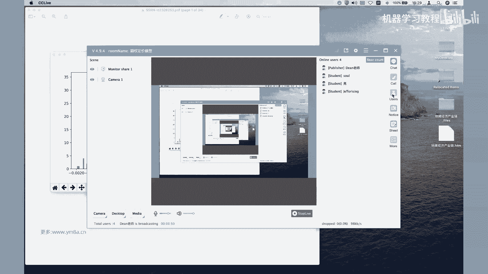

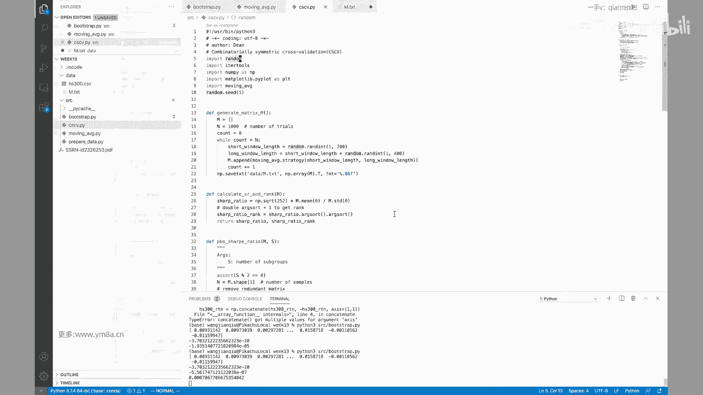

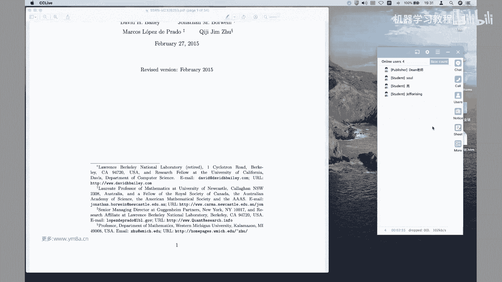

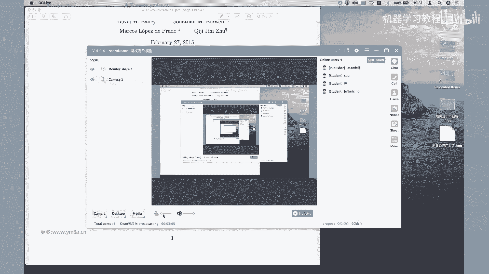

嗯好的，那我们就开始吧，我刚刚把这篇paper发到了，发到了微信群里，我不知道大家有没有收到，OK所以叫他开始之前会先讲一下，就是说我们在策略开发过程当中，常见的就是会有一些就是问题。

这第一个我们其实在这刚开始也讲到过，就说是呃大家可以听到吧，我能听到给我打个一，OK对我们在刚开始的时候有讲到，就是说所谓的就是survivor，Survivor ship bias，叫幸存者偏差。

然后呃最典型的一个例子就是说我们在统计，比如说我构建一个呃对冲基金的投资组合，比如说做一个final of hash fund这样一个组合，我选取的是到目前为止仍然存活的对冲基金。

把他们的绩效回报去进行组合，那么显然这个时候我嗯我已经淘汰掉了，在历史上由于经营不善或者等等其他原因，已经关闭掉了对冲基金，这就是典型的survivor bias，对。

然后另外一个就是说呃呃今天我们也会涉及到，就是呃所谓的long shot bs叫多空偏差，多空偏差，如果说就是说在市场环境下，是一个属于单边上涨的行情，我们不管怎样去优化策略，我们的亲，我们的策略倾向。

总总会是总会是说是倾向于去做多，那么就是说由于这样一个呃，我DATASET这样本身的收益的是不平衡的，会导致我测了优化之后呃，会出现一个多空方向上的偏差，对那之后我们再再来看怎么去解决。

然后比较典型的就是说我们在呃，在另外一个就是比较典型的是所谓的引入future，就是未来函数的问题，就在策略中引入一个呃未来的信息对啊，最典型的例子就是说我们交易的过程当中啊。

想要知道当前bar的最高价，但事实上就是说在实盘交易的过程当中，在一个班没有走完之前，我们是不知道它的最高价，但是在回撤的时候，如果是说嗯，我比如说这一个小时或者5分钟半没有走完。

我走到走到其中第3分钟的时候，已经开始用了这个bar最高价，那么就是说我显然是会引入这样一个未来数据，对嗯，所以就是说所以说这个在回车的时候，就是说我们为什么要用事件驱动，或者说是用队列的方式。

就是说我们希望把我们的呃产生信号的板，跟我们去撮合的，这样的板是进行完全的分开，免得就是说成交在这根板上面对，然后另外一个就是说有点类似于未来函数啊，但是会会有一些不一样，就是说比如说我们呃。

我不知道大家有没有试过是做小波分析，或者说是做那个empirical mode composition，就是在在engineering上面，有可能就是说很多人去做降噪的方法。

然后嗯他们存在一个所谓的端点效应，就是说这些方法就是说呃，就是说当我引入最新的市场数据的时候，会导致整个模型的历史的状态就发生变化，然后本质上来说它会有点像未来函数。

因为它是说我使用的是一个属于全局优化的，这样一个技巧，当我在进行全局优化的时候，实际上是把啊就是最近的信息已经引入过去，从而改变了历史的这样一个人历史的一种状态，对然后我们今天介绍的这篇paper呢。

呃是讲了一个今天这样一篇paper，就是说是我们来讲的是怎样去嗯，就是根据我们的回测数据怎么来去看，嗯就是说呃，就是说我们基于我们的策略参数选择，然后怎么来去说，是去计算我们回测过度拟合的这样一个概率。

对啊，所以我就是说这篇paper的话，我觉得是我觉得还是挺有意思的，但到现在也不是，他也不是特别新，也不是特别旧，对对对，就是这篇paper里面是提出了，我觉得是计算回测过过程过程当中。

这样一个过渡你和概率的一个框架，然后我们今天去看，就是嗯前两节课时间是先去把整个的paper的，它的原理去了解一下，然后接下来，然后我们去看怎么去实现它这样一个概率，对OK啊，首先就是说有一个是嗯。

大家可以可以自由自己看paper，不一定跟着我的节奏来看，但是嗯就是他会讲到就是说呃一个太重要，两个重要的两个概念，一个是in sample，还有一个是ALLOSAMPLE呃，它会把就是说。

数据就是说我们在回测过程当中过度，如果说过度拟合发生了，然后一般来说我们会在in sample之内，就是样本内，然后产生这样的一个最优性能，最佳的这样一个策略。

他可能说是在那就是说UNDERPERFORM，就是在out of sample的时候，perform什么意思，就是说我在样本内优化的很好的性能，但是在out of sample的时候就是发生了劣化。

对这种原因一般来说就是说说是是，就是说在in sample optimal strategy，就是说可能引入了过多的这样一个一个噪音对，然后呃所以呢这篇这篇这篇文章，他就说是我们建立。

他说建立一个general framework，然后来评估就是back test，OVERFITTING这个事件的这样的一个概率对，然后就是他说的还是就是说呃，就是说其实这这这样一个就是框架。

就是说它的就是now now hype hypothesis，或者原假设，他说的是说是如果是确实发生了回测过度拟合，这个是我们H0，然后对，然后说然后说我们要去计算一个。

就是说probability of dark test overfitting，就是说是将回测过度拟合这样一个概率，然后对啊，这句话看了看的有点绕啊，待会我们再具体就看一下。

他到底描述的是什么样的一个事情，可可以说他其实构造了就是说这样一个呃，嗯OK，那我们直接来看它构造了一个怎样的概率空间，你说它构造这样一个就是概率空间是，然后是就是TAO。

然后F和probability，然后这个TT或者tall它是表示说是a sample，space of pairs of in sample和out of sample。

Out of space sample，所以说就是说是就是样本类跟样本外，然后这样一个样本对形成这样一个样本空间，就是说我每每每一对是什么呢，就是我每一个pair里面，一一部分是一部分是样本内的数据。

一部分一部分是样本类的回测结果，另外一部分是样本样本外的这样一个回测结果，然后他接下来做的事情是说可以说是我们，比如说我们是有了啊，比如说我们是有了N个，N个这样的一个一个策略。

然后我们会假定一个就是given performance，比如说我们常见的衡量策略优劣的一个性能，最典型的是separation，我们今天也会拿它去做例子，所以说我们把呃。

就是说我们生成了N个这样的一个策略，然后把N个策略这样的，然后就说我们的策略，都能计算出这样的SHRATIO，然后接下来的时候他会用啊，它会用两个，就是说随机向量来表示样本。

策略的样本内跟样本外的这样一个表现，这样的嗯，大家注意同学说这个呃这个R和r bar都是都是，比如说都是长度为N，也就是说N个策略就是说呃R1是策略一的呃，样本类的表现。

R182是策略一样本外的这样一个表现对，所以说嗯，然后OK，然后就是说接下来就是说他是要就是说嗯，他这个文章其实最核心的就是说我要去比较R，就是说RC跟控制RRBC，然后就是说他们在主要。

他们其实关键的就是说是我比较这N个策略，在in sample跟all sample这样的一个排名，就是说其实说我对于他的数值不是特别关心，但是我关心他，在我我这个策略。

N个策略在in sample跟out sample，的这样一个一个排名，就是the key observation here，OK啊，那具体它是它是怎么来做的，就是说他看他这边给的是一个。

就是简单的这样一个例子啊，呃比如说是N等于三，然后就是说我是有三个策略，然后然后performance measure，就是说SEPARATIAL，然后对于一个特定的这样一个。

就是一个一个一个example，比如说就是说特别对于我特定这样一个样本，然后我知道就是说在RC呃，它的shop率是0。51。10。7，然后嗯然后RC8的话是0。60。71。3，是什么意思呢。

就是说呃策略一样本内的夏普夏普率是0。5，策略一下普呃样本外的shop率是0。6，然后策略二对是分别是一点一跟0。7，然后策略三是0。7和1。3，然后然后这个RC那小的就是little little。

RC是什么意思，表示的是他们的就是一个ranking对吧，这个就是在我组的这个排名就是呃，但注意它是从小到大排2C最小是一，然后啊然后一点一最大，所以它是rank13。

然后2C然后就是按照这个顺序来排序123，然后所以他说这个小little r的意思，就是说是我把我就是把我的，就是把我的这样一个capital r，然后映射到我的这样一个类的R对吧。

就是映射到就是我这个概率空间内，所以啊其实其实其实其实这个就是你不需要，就是说你对于他在空间不是很熟悉，没有关系，你只要明白他到底做了什么事情，他本质上做的事情，是把我衡量一个策略的这样一个呃。

我选的这样一个维度，比如说是你你这边可以用sharp ratio，你也可以用INRATIO，你也可以用con ratio，你也可以用MATTDRAWDOWN，对吧，嗯对，就是说他是把策略的一个很拼。

策略的表现转化为策略表现的排序，OK那么接下来有了这样一个就是概率空间之后，我们就可以去定义我们back test over fitting，就是回测过拟合的这样一个概率，而说他说是回测过拟合的概率。

是，就是说其实说嗯其实他描述就是说，因为我样本类可能是存在过度拟合，所以说我样本内的自由参数，不一定对应的样本外的最优参数，那么他所说的这种这样的一个事情。

就是说是那就是说呃probability就是说先说这个吧，就是说是啊，首先这边有一个二分之N2分之一，什么意思是我有N个样本，那么二分之N就是说是我这样的一个中位数，那中位数不是说我样本内的。

就是如果说什么样的什么什么情况下说啊，我过你我认为过拟合发生了，就是说我样本内最有参数的沙普比率，但是我等于是说样本类的最优样本，样本类的最优参数的下坡比例，小于我这N组参数在样本Y夏普比率的中位数。

对他其实说的就是那这样probability，就是说我把我呃，呃就是说我把我这样的一个样本，一个是样本类，一个样本类的样本内的一个最优参数，然后是M组参数在样本外夏普比率中位数，其实是这样的这两个东西。

然后就是说如果说我所选参数的样本类的表现，然后是高于全体参数参数组样本外的正能表现，那么就是说我认为说，我在我参数选择的过程当中，可能就包含了过度拟合，所以大大要注意的说是说在这样一个定义当中。

其实我们关注的是什么，我们关注的是说是在策略选择过程当中，相关的就是就是选择过程当中，然后与这个有关的过度拟合，而不是就是说我没有去考虑说，我怎么去校准我这样的一个策略参数对。

然后他就说为了要去衡量这样一个框架的话，比如说玩我为了估计就是probability of baptist，Overfitting，他就是用了一种框架。

所谓的就是呃就是combatically symmetric，Cross validation，或者叫就叫组合对称交叉验证，那那组合组合验证加上呃，就这部分可能大家看的就是不是特别明白，那没有关系。

就是我们接下来就是如果不是特别明白的话，呃我们接下来把它的整个的就是C4D，整个这个procedure走完，走完之后可能大家就会明白，就是说他做的是什么事情，OK这就是后面进来的同学，我再再讲一下。

就是说今天我们讲的是，就是怎么是衡量我们策略的，就是OVERFITTING，就是这这一部分讲的是会就是回撤过程当中，过渡你和风险的这样一个怎么这样一个框架，我们怎么去衡量，对OK嗯。

嗯OK就是大家先看对，他对这两个公式就说对对对，这个公式有一点稍微有点影响，就大概明白我们在做什么样的事情，对啊，这个这个RIN是就是out of sample的表现对吧，就是我们之前已经选了一个啊。

就是我选了一个，就是说在样本内是optimal的这样一个，就是样本内它已经是optimal的这样一个R，然后我再看它在样本外，是不是比我样本外的二分之N，就是比我一半的表现要好，对如果说比表现要好。

我认为它没有发生过拟合，但是如果说我在样本内呃，已经选了最好，但券居然是比样本外50%的要差的话，那么就是说认为这个可能发生就是过拟合对呃，那接下来怎么去衡量来做，只要来做这样一个事情呢，Okay u。

可他就是用的说是说是组合对称呃，交叉验证对CSCV这样一个框架，OK呃首先是说看见有人说pose researcher，就是说这个如果我们在开发策略过程当中。

然后他们考虑的就是a family of1系列的参数，然后就是我的我的规则或者是参数，然后接下来说是呃，就是说他这边用的是transfer moving average study。

然后我们待会也是拿就是沪深300的一个，移动平均去来去测试对吧，因为我们知道就是说在测移动平行的时候，也可能是引入就是两个参数，一个是long，一个long window。

一个是short window，就是长短的两个窗口，两个窗口，然后接下来就是说是，就是说我们比如说在这样一个策略，开发过程当中，我们引入了N组的这样一个参数，比如说我有N个pair的长短对吧，两个窗口。

两个参数，那么接下来我们怎么来去衡量，就是说怎么来做这个事情呢，做first就说我们要就是from a matrix对吧，然后matrix m是什么呢，就是说我每一列是代表啊。

vector pl就是说每一列代表是一个完整的回测，我使用一组参数进行完整的回测回测，那么我有他T就是capital tik周期的，就是啊return对吧，那么我如果有N组的话，那我就有一个呃。

首先用用手每一列嘛，当你每一行其实也OK，就是接下来我们可能会就是可能是由行变成列，也有可能是列变成行，但是我们需要明白的是，我的周期是T对吧，我总共有T的周期，然后我有N组参数。

那么我们先follow他的两个记号，就是说T乘N对吧，就是说我有T，我有T行，然后我有N列，所以这样这样这样一个矩阵就是OK我们来看。

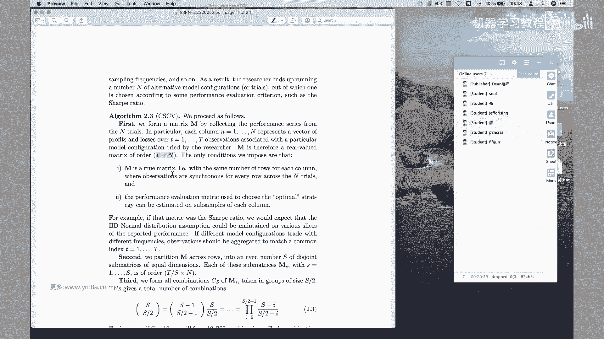

呃呃这就是我生成的这样一个，这样一个它的back testing，然后它的长度是2997，2997，是我每一列这边的时候，是我每一列跟我这边是follow他的记号，我每一列是代表一个完整的回测。

然后对每一列是代表同一个参数，那这个是怎么怎么生成的类，就是间接的就是我们这边首先是，沪深300的这样一个从06年到，应该是到1515年对嗯对，差不多是十多年的十多年的这样一个数据，十多年的一个数据。

就是从指数差不多是从1000点开始，然后对，然后一直到从就是中间也到过4000。5000点，然后就然后又回到3000点，回到3000点这样一个这样一个set story对。

然后back testing是简单来说就是就就这么几行对吧，就是说我这边parameter是shop window，然后long window，然后还记得就是a mod average怎么做来。

就是说当我的短均线，短短均线就是超过长均线的时候，我就有一个long的这样一个仓仓位，然后当长均线超过短均线的时候，就是说我们是一个shot仓位，但是因为A股是不能做空的。

所以你只要把他的position设为零就可以了，所以说我default position，就是我所有的手是仓位是零，然后当我shot ma大于等于long ma的时候，我的position是一。

但其实这我有了仓位之后，我就可以去算它的return，然后就可以得到这样一个简单的back testing，然后OK那这边要注意，就是说我们这边没有用，就是说比如说我没有说我一手是多少钱。

就是我们assume是每天都是满仓，就是说我这个我我现在就说我的我的net cital，就是我定值，从一开始如果我的仓位是多的话，那我就跟你就完全就根据指数的这样一个。

就是根据指数的index value，就能够得到它的这样一个day turn对吧，所以我这边其实用的就是一个是position的shift，然后乘以一个指数的这样一个director对吧。

其实这边还不是就daily return，我都没有去把它乘以一，但是对对，因为我这边有个position的shift对，所以就是说如果说就是这个意思，就是如果第一天如果在第二天，你在这边。

第一天我买入对吧，这position如果是一，那么到第二天我的收益率是什么呢，或者说到第二天的净值变成什么呢，我的净值就是1089。37，除以1。79。32，就是说我始终是一个满仓的状态。

如果如果说第三天我禁止，然后我到了第二天的时候，就是我position变成零，那么我的净值就保持不变对吧，那如果是净值是一的话，我只要去就是说我position是一，我第二天的净值。

其实就是说把净值去我现有的net value乘以一个哦，就是沪深300的这样一个地区对吧，第二天处于第一天，所以这个是这么来的对那么简单的测算，测算一下之后，你就可以得到的我所有的这样一个呃。

对uh daily return，我们这边这边因为用的是一个就是log turn，Ok，然后OK然后我们再回到这边来。

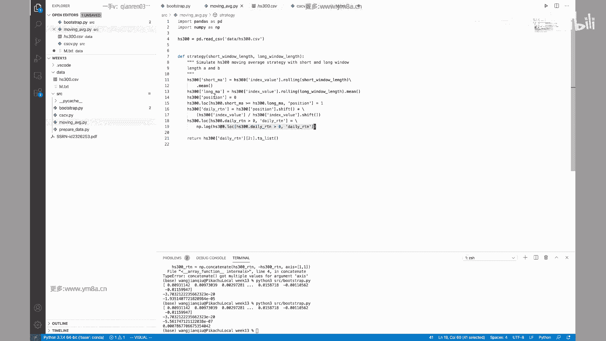

就是说那呃回到这边来说。

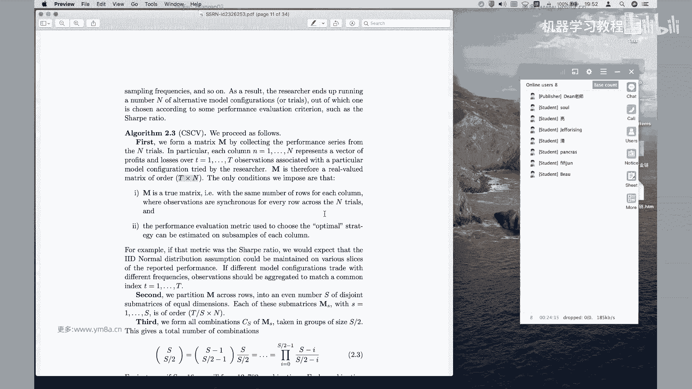

我们我们每一列是我们一个一组参数测下来的，测下来的performance对呃。

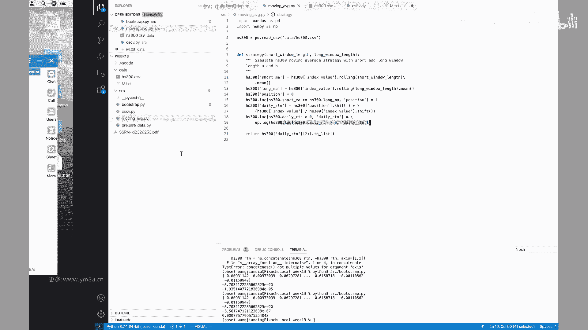

然后OK在这边的话就是我们怎么是general，也就是说我们这边用的是1000个1000组，就是number of trials，然后我shot window是属于是呃，一到200之间的一个随机数。

然后呢long window是怎么选的，是shop window加上1~400这样一个随机数对，所以也就是说我就是去生成1000组，这样的一个呃，一千一千组这样的一个组合。

然后就生成它的这样一个daily return，OK然后把它save text，就是保存到我们这边来，保存到我这边来了，然后为了可以复现的话，大家可以也可以去验证一下。

我把他的random seed都设为一，这样的话，我每次就是测下来都是都是这样，一个都是这样相同的结果对吧。

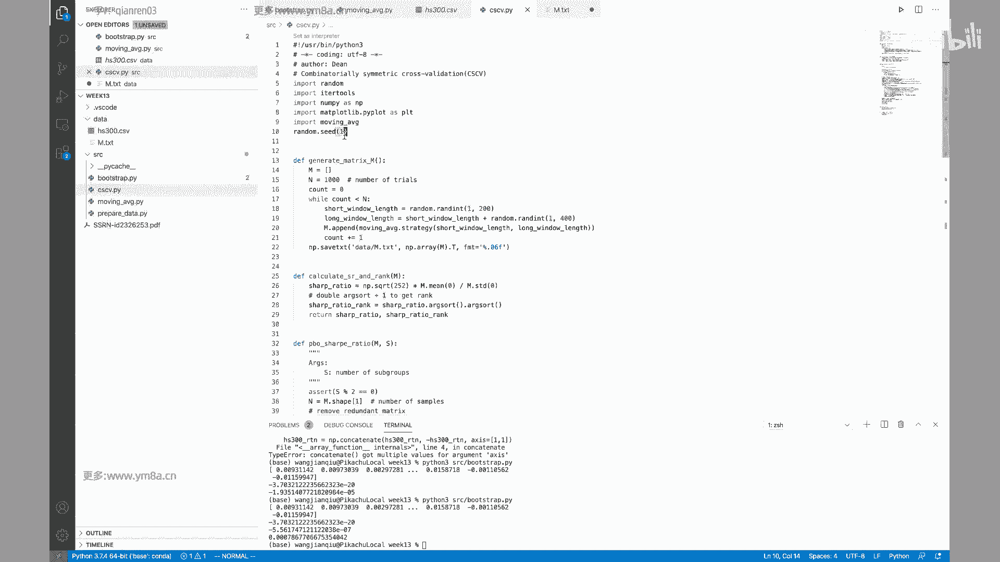

OK啊，第一步就是这部分大家明白，就是我们先生成就是matrix，然后嗯嗯然后接下来就是说如果是他这句话，什么意思，就是说我要去，比如说我要去测我的sharp ratio，那么我有1000组。

那我每一列都可以对应的是。

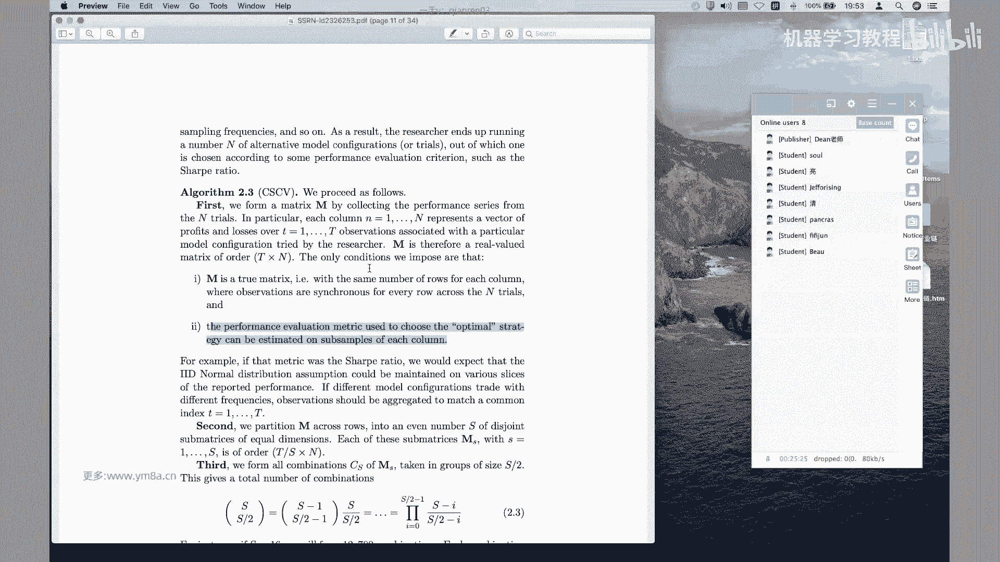

计算出一个sharp ratio，然后嗯OK好，因为他这边有一个就是说呃，他这边他这边有一个SUMPTION，是说如果是说呃，呃就是说如果这个指标是夏普比例的话，然后其实说我们预期。

就是说策略的收益是就是策略的收益的，它不是这样一个独立同分布的性质吗，那我们在各个列上都应该是保持的，就是保持有就是相同的这样一个表现对，然后OK嗯大家注意一个问题，就是说嗯他这边也强调说。

我们这边当然现在没有这个问题，就是呃我如果说我回测的，就是有交易的频率不一样的话，我需要把我的observation，全部统一到相同的频率上去对，就比如一个一分钟，一个5分钟。

那么显然这样的就是说我的规则，或者是我在回测的时候，显然是不能，就是我不能用一分钟跟5分钟都生成，首先首先他们就是实验室的长度是肯定不一样，那你要是说不管是你应该是把嗯，就是说一分钟当三跑到5分钟对吧。

变成5分钟，然后再去比较，就是构造是相同的这样一个matrix，OK就到这一步就没问题了，第一步就是说，不管就是说这个这个我们在实际去回撤，去交易的时候怎么去用的，就是说我这样一个roll。

然后我去把它，我有我测试了很多组参数，对不对，然后我要考虑说我去衡量一下，我选择了这样一个选择，接下来看就是说我选择了这样一个测试参数组，是不是，就是说是不是存在过拟合的这样一种可能，OK啊。

然后那到这一步，到这，接下来之后，大家做的事情是说嗯为petition across rose，所以说我们是把整个的matrix按照行区分，OK那现在我先问大家一个问题。

就是我们刚刚生成的1000组参数的这样一个，跟1000等参数生成了一个matrix m，它的dimension就是它的维度是多少或者是多少。

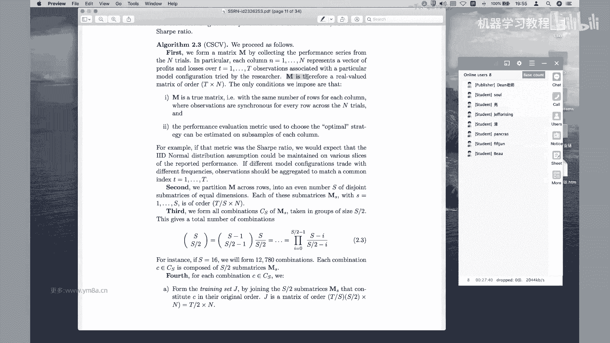

对就是大家我要先去让大家理解一下，对吧对，总共是买沪深300的数据对吧，这边是2999行，然后我这边生成的应该是return的话是呃，3号是少了两行，Ok whatever。

但就是说中间前面我肯定是前面刚开始第一天，我可能把前面的前面两行要去掉，对所以先问一下大家。

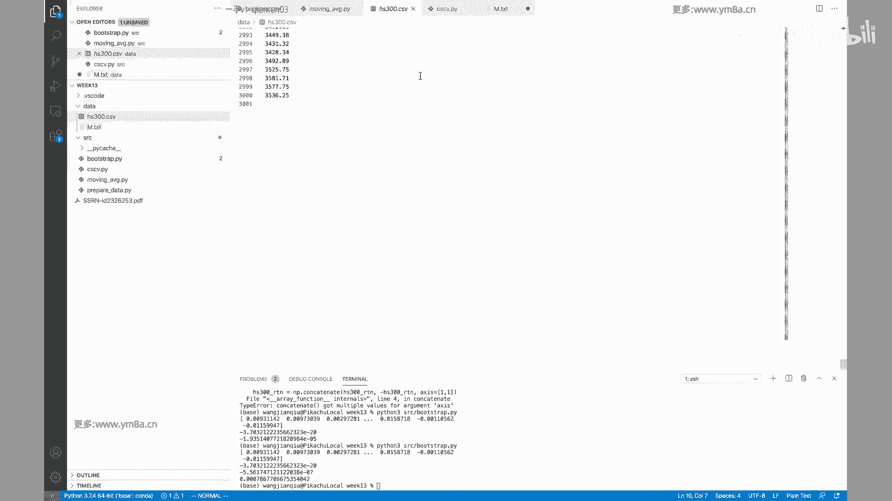

对大家跟着我一起思考，就是这样一个matrix的dimension是多少，就是刚刚的就是2998天的数据，然后拿了1000组，嗯有人回答吗，那我点名了啊啊，邵同学，OK嗯，就是DEMM的维度。

首先是其实刚刚已经说了啊，就是2998，然后乘以1000，OK就我们先follow一下这个，然后接下来就是说uh we petition and across rose into a，OK没有没有关系。

我说刚刚是说我们关注的是矩阵的维度，因为接下来就说，大家现在脑子里有这样一个概念，我们的M是一个呃T周期回撤率，日天数也可能是周期数，然后乘以N，这还是我们的策略组数。

或者你猜猜就是parameter的组数，OK那现在是petition and across rose，然后into event number of destroying sematrix。

那这个什么意思，就是说我们需要把我们的M分成S个，互不相交的SUMATRIX，记住我们是按行来分，就说我们是横着切来，我们这儿切一刀切一了对吧，那么一个简单的问题，假设我们要分成四组，我们要划分多少下。

那就注意就是说应该是equal n，就是说equal dimensions对吧，那也就是说呃我要把它画成S组，那么应该去相当于7S减一下，然后这个时候的就是SUMATRIXM，就变成了一除以S。

然后乘以N这样一个维度，那再问大家一个问题，就是说呃我肯定接下来会肯定会做一些处理啊，就是说比如说因为2998，你就不能被十整除了对吧，那我们就肯定会把左边的那个bug给去掉，变成2990。

那这时候问一下，就是说我们的SUBRIXM的这样一个维度是多少，那要不还是四位同学，你来回答吧，就我觉得大家把整个算法先follow一下，然后再去看，就会觉得OK它是怎么回事。

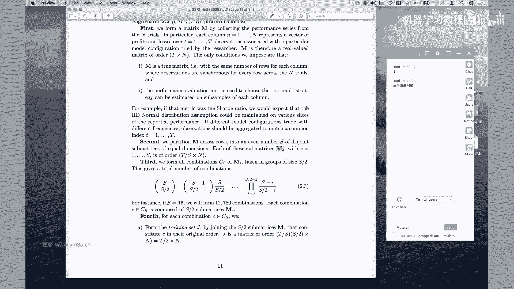

不然的话，就是其实其实就是说这边看起来会有点复杂，但是我们整个实践下来啊，对其实也就这么多行，对。

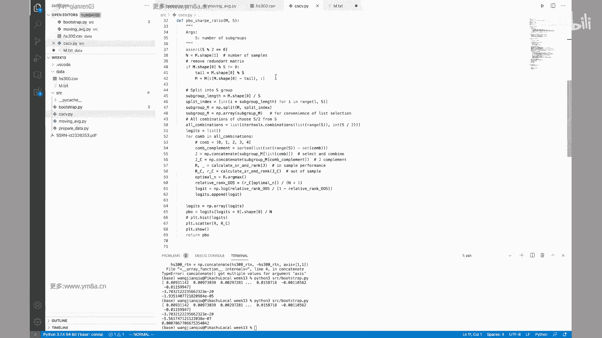

所以就是大家先去先去理解，就是说我们现在做的是什么事情，就到现在第一步我们先回测，我们测了N组，然后我们做的事情是把这N组切分切分成S组，对哦sorry，是把这对这这样一个矩阵，这样一个矩阵切分成S组。

我们是按就是按行来分，就是说横着切，横着切是什么意思，我可能会把它时间顺序给啊，这就是说会去把它给切开来，呃比如说我们这边是292990，那我肯定会把它2990，我会把它切成。

假设我们是接下来我们用的是S十十，我把它切成十组呃，那为什么要用哎，就是这边要强调是是一个even number，那为什么是even number，接下来就会明白呃，那我这边切成十组吧。

相当于说我每299个一组，然后啊对，那我怎么切成十组了，那那那其实就是299，然后598，然后是697对吧，这样去切就可以了，那么那这样的一个就是combination是多少个呢。

就是说就是说接下来他会说we from all combinations，就是说我要把接下来说的就是taking group size of s two，就是说我刚刚不是分S组吗。

那我现在去S1S的一半，大家明白，就是说为什么要问，就是我一定要是偶数才能去取一半对吧，不然我会总会多一个出来，那接下来我要问大家一个问题，就是说我在这十组当中随机的去选五组。

总共有多少个combination，大家可以回答一下，他这边说的是S等于16，那个是12780，这个是怎么来的，谁能解释一下吗，或者说我当我就是我要把整个会分成呀，扣就是C15。

就是time choose five，就是从十个里面选五个，OK那OK然后接下来说就是前面三部，其实我做的事情很简单，就是啊我先回测，就是假定我有一些策略参数，我跟你我我去。

不管是像就像我刚刚这边做的是暴力寻优嘛。

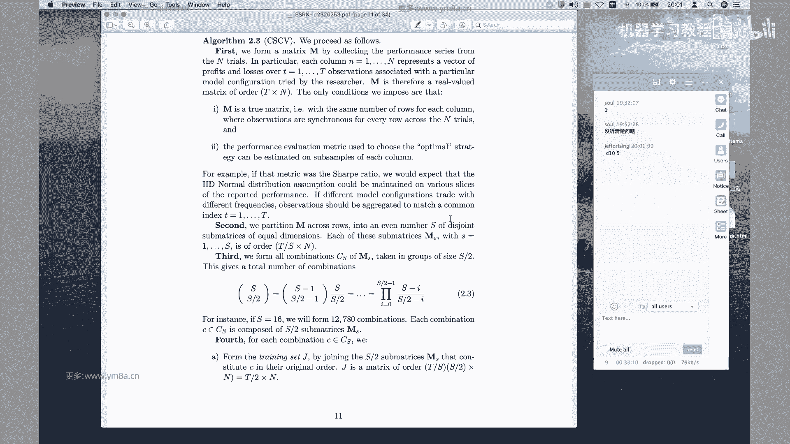

对吧，我这边做的事情是两，我这边是一种随机的方法，我还没有去去网格选用，因为因为我参数空间选的非常大，对就是说短窗短窗口可能是1~200天，任意一个，然后长窗口的话就是短窗口，再加一到一百四四百天。

所以这里面差别就是组合还是比较多的对对。

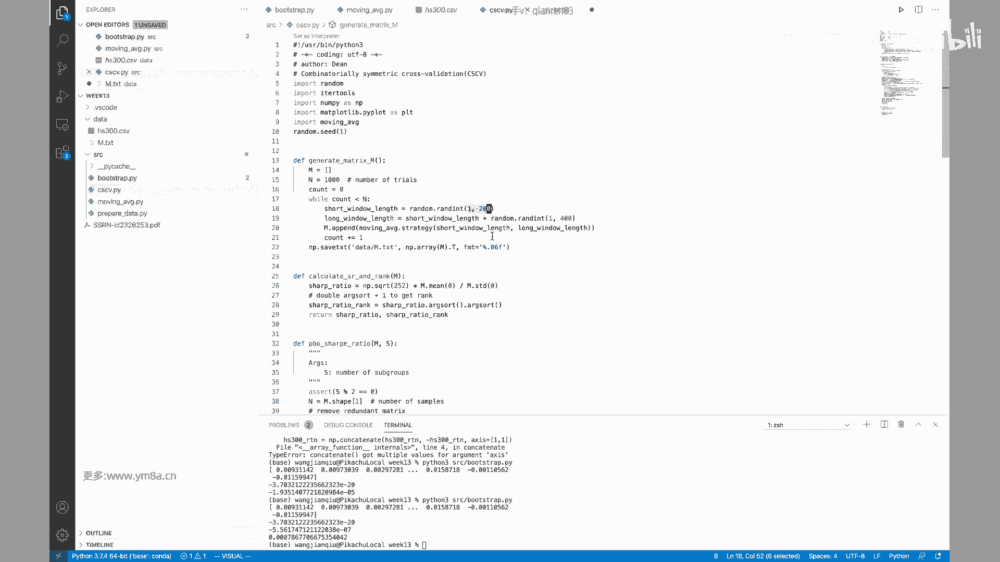

然后就是说然后做完这样的策略，回测完之后，我就把它切分，切分之后我随机的去选呃，S除以二的，OKOK然后接下来的话呃，接下来的事情就是说是我不是选了一半吗，那很简单，我刚刚选了这个。

选了选了就是十个里面我选了五个，那么我把这一部分当做我的training set对吧，by joining the divided by two subtraces对吧。

Constituency in their original order，注意这边是original order，什么意思，就是说我们刚刚选一个组合是日，就是说比如说12345，最简单的就是说总共十个。

我选12345，那我注意我再把它合成一个新的矩阵的时候，不能是12435，我一定要按照原来的顺序，其实你正常的做呃，做就是做combination的时候。

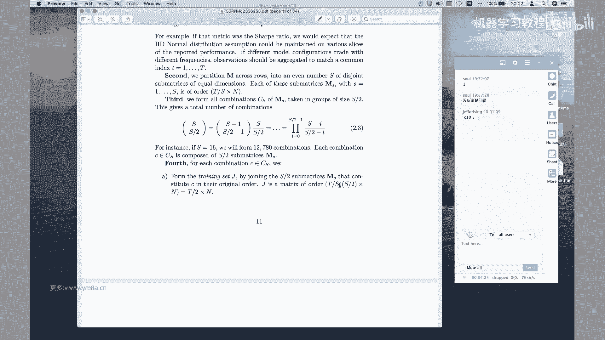

你其实是不会去打乱它的顺序的对吧。

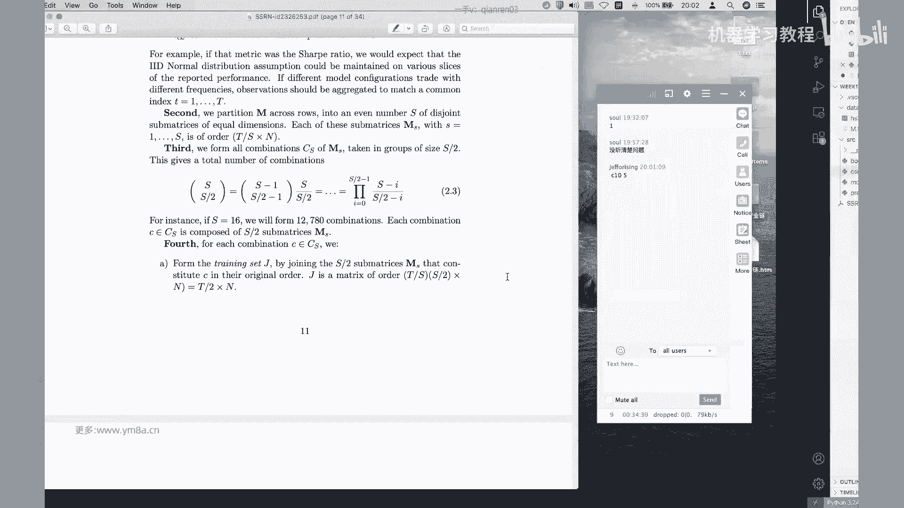

对，大家都注意我们是就是combination，就是我们是就是我们这里不涉及排呃，就是就是说排列组合，因为是组合就是没有排列，没有顺序的问题，就是12345跟43215是一样的，因为注意我们用的是C啊。

不是用的是P不是PERMITATION对吧，所以就是十个里面十个里面选五个，我们总共有这是C15是多少，Whatever，大概大概是几百个，这应该是几百个这样一个范围对。

OK然后接下来说是那我选完了十个，选完了这五个，然后比如说应该说我还保留原来的顺序，那我把这这5J选来了五个，作为我的training set j，那剩下来的就是J82，就是呃就是加了一横。

就是说代表是剩下的这，剩下的就是剩下的就是当做我们的就是testing set，OK那其实就是说我只是想了一种方式。

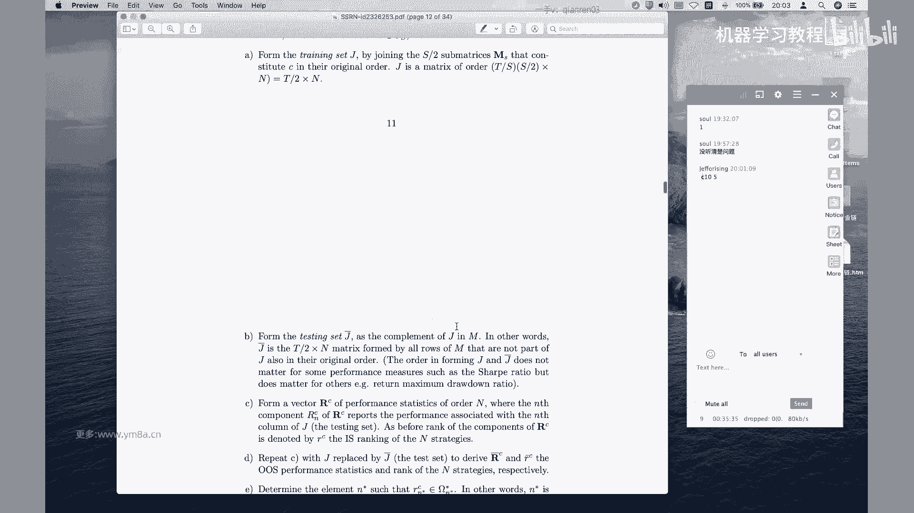

把我刚刚才的这样一种矩阵。

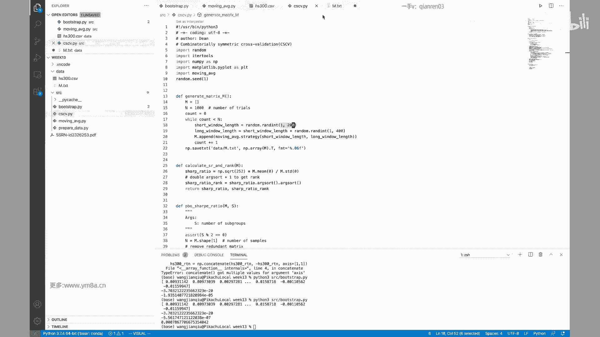

是相当于说把它去拆成了两组，但是我不是连续的拆，我是随机的去呃，随机把先把它分成N组，先把它分成S组，然后从S组上的随机选一半，把它组成一个J，然后另外一个是testing j对吧，所以到这一步都OK。

然后接下来的事情人说，那这个声音说forming a vector of ourselves，Performance statistics，那这个这个这个这个是什么意思，就是就说其实说我们刚刚。

比如说我要去算SHRATIO对吧，那我就把我现在的钱就是这个J去算一下，Sharp ratio，这就是我的performance statistics，如果大家再回到我们前面的话，就大家可以慢慢去理解。

就是对吧，哎这边这边这边N是多少呢，N当然就是三了，因为我只测了三组对吧，那这是我的sharp paratial，然后这个是R8R的话就代表我剩下的另一半，只另一半的就是我选完。

就是我testing set的SHERRATIO，所以大家慢慢的就是前后可以慢慢去对应，建立联系起来，OK我做完事情，是把我的下半部分的这样一个sharp ratio，给计算出来对吧。

所以就是然后然后要注意的是，呃这注意事就是说我下手，我不是分流算还是竖着算啊，就仍然是我每一组都要去算，最终我任何一个指标始终都是有N组对吧，因为我没有去改变我的，我的我总是测试了两个组合。

那么我每个组合不管是在测试集还是在呃，就是就是在testing还是training，在还是在训练期，我都要去去算他的performance statistics对吧。

OK然后其实C和D是做的是呃是呃一样的，OK然后然后as before i就OK，其实这边还忘了讲一个，就是说就是说我再去算嗯，嗯当然就这两个，这两部你可以理解为你先我们先看一半吧。

就是说在就在training set里面，我算完了这个performance之后，然后就是说我要去算他的lady s ladc，是什么意思呢，就是说是in sample的这样一个rank。

还记得我们在前面说是怎么来算呢，就是记住所有的R是ranking capital，R是我们的performance statistics，所以这边是它的performance是sharp ratio。

然后对应的是他的ranking0。5最小，所以排一，然后一点一最大，所以排除三对吧，然后这个时候LERRC的话就是一样的，LTRC对应的是testing set的performance ranking。

而这边是performance statistics，这边是SHERIAL，这边是ranking，所以其实C和D做了两步，是我分测试集和验证集，去分别计算我的performance statistic。

然后去对应的去排名，OK那得到了这样一个之后，C和D我得到了这样的之后，我会去做什么事情呢，我要选的是在样本内，我要去选the elements and star that uh。

我是属于the best，他是说n star，我代表的是the best performing strategy in sample，那是什么意思呢，就是说我在样本空间之内。

我选我选项目比例最高的这一组策略，这部分大家明白吗，是什么意思，就说我就说我这样的，要注意啊，所以就先强调一个前提，就是说我这边是for combination，刚刚忘了强调这一点。

就是说我们刚刚得到的，不是说是我们还记得，我们前面得到的是ten two five，十个里面选五个，那我在十个50选五个的话，我要去遍历每一个combination。

那么在对应的这样一个combination的时候，我每个combination事实上都决定了一组我的，testing set和training set。

training set跟testing set就已经决定好了，我决定好了之后，我事上都可以针对每一组，我去算in sample跟out of sample的这样一个sharp。

ratio跟它对应的rank对吧，要注意的时候，这个时候我们的in sample，就是说我不再是像我们以前做，比如说做优化的时候，我们说呃七比二比一对吧，我没有说拿70%的做in sample。

去做optimal，然后在20%去做样本外，然后就有10%做验证对，然后对我们这边做的整个事情，是我把我所有的整个数据都拿下去测了，去测这样的一个呃，能去做back testing。

去做all right，去寻找它的最优参数，然后但是呢我把我整个的dark testing的结果，进行了一定的划分，OK所以到这一部分的话，呃，大家明白就是说我们做的是什么意思，是什么事情了吗。

我们现在已经说已经划分完之后，我分别去找到了呃，我这样的一种啊，我根据我这样的一个划分，我有他的optimal的这样一个column对吧，呃大家要注意的是为什么，就是说为什么就是说每一列就是每一种。

不是每一列，是每每一种competition，我们都要去成计算的，因为很简单，就是说sharp ratio的话，我每次从这2900多个，我选了1400呃，1445个对吧，1445个的，1445行。

那么我把它随机组合，我把它1445行，按照原来的顺序去算sharp ratio啊，那么显然它是会变化的，因为嗯就最简单的，比如说我们选的是12345，前半段的CHAPARRATIO。

那前半段这sharp heal，这一前组里面最大的一个，跟后半段1000也是1445个，the sharp ratio哪一列最大，那显然这两个是不一样的，对不对。

所以这也是为什么我们要去做combination，就是说我要把所有的这种排列组合方式，都要去考虑到对，那么我是说我假设我说我们我们就在，我们combination是12345。

是作为我们的training set，然后786789十是我们的testing component，对，那么接下来要做的事情说，我要去定义就是relative，Rank。

relative rank是什么意思呢，那这个是什么，这个是呃，这个是反正我们这个加加一横加bar的，就是都是是这样的，就是呃就是是嗯是这是testing set，那个n star是我们刚刚怎么选的。

是选的是in sample的那一列，就是说我已经知道了，就是in sample那一列的，就是说哪一列它的performance最大，那就是chaparral，就是它。

那么我们要去看它对应的out of sample的sharp，ratio的ranking，大家再去理解一下，我们首先在in sample之内做到了，我们挑到了sharp rucial。

sharp ratio最大的那一列，那么这时候我们看out of sample，它对应的sharp ratio的ranking，记住我们这边不是拿sharp ratio。

是拿sharp ratial ranking，我们我们刚刚说过，所有的capital r就是大写的R都是sharp ratio，小写的R都是对应sharp，sharp ratio的这样一个排序。

所以我们刚那这边就是说那这个值就是说呃，是0~1那个很直观的，因为我排名最好的时候说我out，我样本外也是最，我样本外也打败了所有的，就是其他的样本外的参数组，那么这个时候RNC它应该就是1000呃。

其实我这边就是没有太高兴，他为什么要加一啊，当时当时就是说那加不加一无所谓，因为1000÷1001跟1000差不多，他都是一对，也有同学想到了可以控告诉我一下，也有可能他是我猜他故意加一。

是不是为了接下来算log的时候，就是这边算log的时候，就是应该是算log，防止它到E吧，因为这接下来就是我这个值衡量的是什么，就是说衡量的是我in sample比最强的那一个。

我在out of sample到底打败了百分之多少对吧，就好像它是一个塔，就是相对，所以叫RT rank，这部分大家有问题吗，就把这个先理解清楚，就是它整个核心就是说在算啊。

就我一堆的permutation，就是随机的这样一个组合组合之后，我in sample选到最佳的，那么要去看我的out of sample到底bit了多少对吧，所以这部分如果明白了之后。

那么他接下来就定义了一个是logic，logic是什么意思，就是说呃那如果这个值是，但这个值是0~1之间，那我通过了这样一个就是说呃，那显然就是说如果我是个值大于0。5，就是说我打败了我50%的。

那么如果这个值啊小于0。5的话，如果是个值，是不是就是欧米伽C82，omega b2C大于0。5的话，那这个值就是会取大于一对吧，反正他这个值是小于一，然后我取了log之后，那这个指令就是说。

如果说是他outperform就打败了百分之样本，来我也打败了50%，那这个值就是大于，反正它会小于零对吧，所以他说嗯high larger value imply implies呃。

就是a consistent consistency，Between in sample and out of sample，Performance，就是说如果这个值越大。

lambda c log越大的话，那么说我样本内跟样本来表现越一致啊，是这样的，就现在没有什么问题，就是极端情况下这个东西是零，那这个值就n sorry，解完情况下，这个这个值接近于一个值。

就会趋于无穷大对吧，OK所以大家对这部分这样有一个概念了吗，首先就是说啊我们做的是for combination，我都会去计算一个，我没有这样的一个，就是每一个combination。

我都不会去算他的样本类到底有多少的比例，去打败了这样本Y我们用这样一个log值来衡量，然后最后的话我们再去算，就是我们得到了损，就是每一个combination，我们有个拉姆达C。

那么最后就可以去算一个拉姆达C的这样一个，他这边有relative，Relative frequency，你其实对这个式子的话，你可以把它理解为就是一个呃lambda的，就是probability。

Distribute density function，就是我最终其实就是要去看，就是我们lambda c这样的一个分布，所以到这部分大家也OK吗，就是其实整个的cc v这样一个框架。

就是为了去算我们LANDC的distribution，因为这个值它衡量的是，我经过过这样一种随机的排名，就是经过特定的顺序的，就是去组合，然后我衡量了我样本内的样本外这样一个表现，Ok。

大家也可以去读一下paper，然后有什么问有什么问题吗，现在我们先休息15分钟，然后我把问题就是大家花15分钟时间，把整个的就paper发给大家，把整个流程再去理一下，然后对，然后下节课过来有什么问题。

我们把它解决掉，然后我们再来去看怎么去implement，Ok。

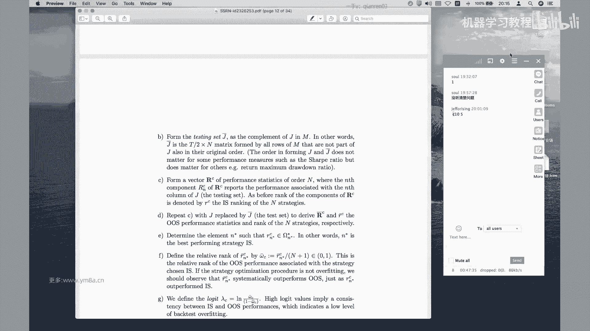

好我们先休息15分钟，然后陪对，然后paper已经发给大家了，没得在微信群里看一下。

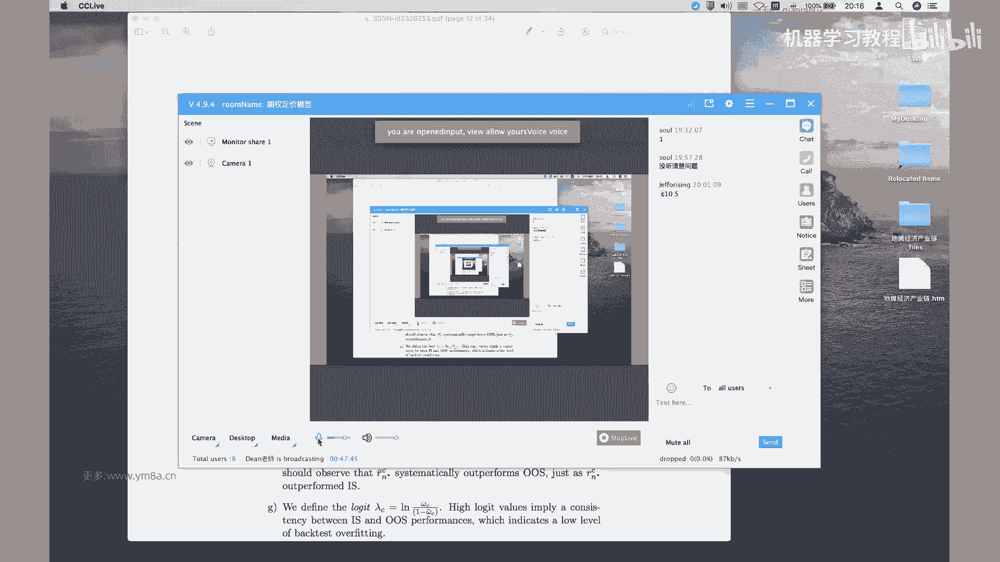

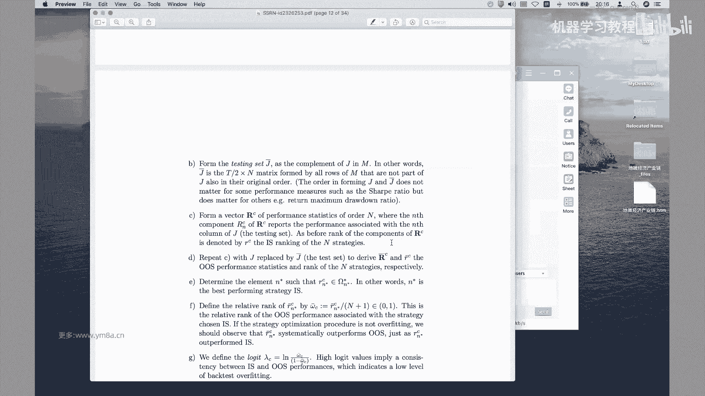

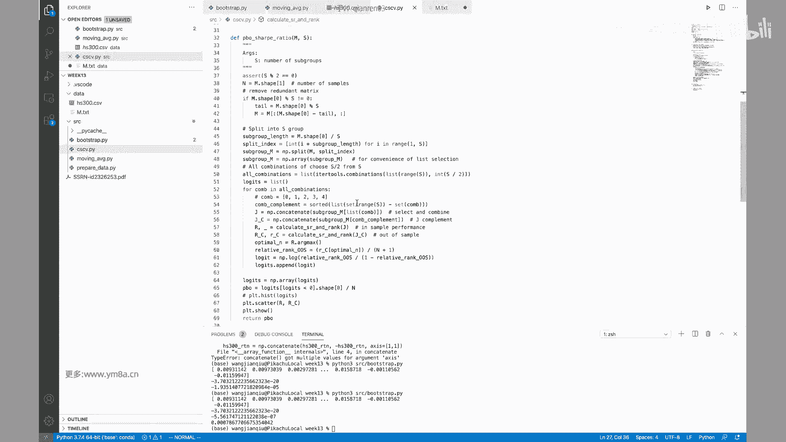

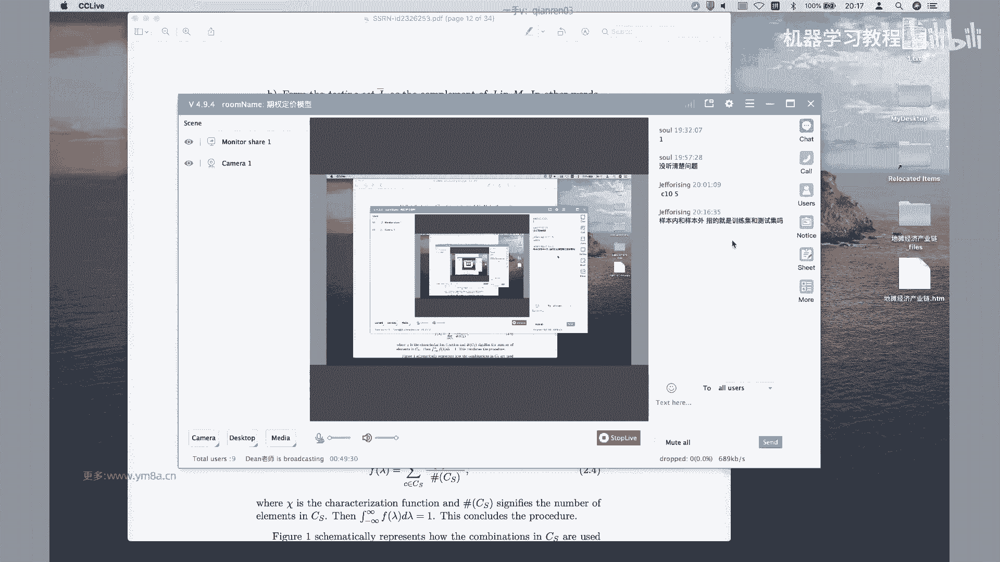

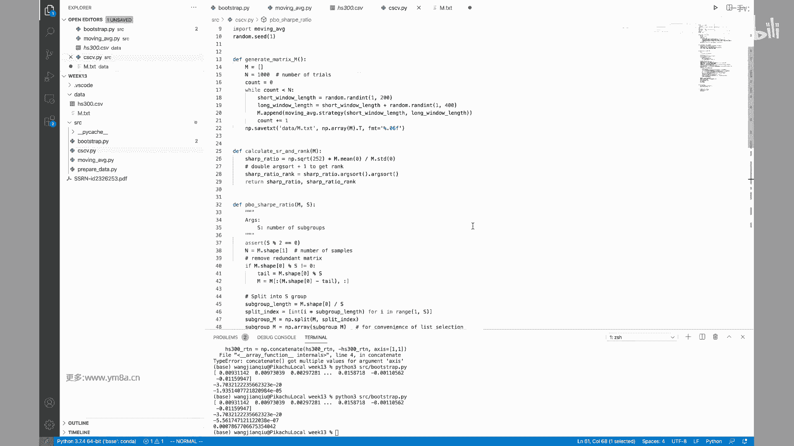

OK我来解释一下，就是嗯解释一下这个问题，就是首先第一个问题样本的一个样本外，这边他说在CSCV这个框架里面，它指的就是training和testing set，OK就这个是没有问题。

然后受同学这边说的是，那这边是肯定是说他是呃，本质上来说是把我所有的呃策略回测的结果对，记住记住这边是拿这个样本计算表现，这边我不知道你说的计算表现是什么意思，那我们这边所说的计算表现。

就是说你可以也可以就是说是呃，其实说我们这边没有去计算sharp ratio，我没有拿直接的全部样本去计算它的sharp，ratio或者max周到，我只是回撤下来得到的是daily return。

如果你们说计算样本去得到data return，我觉得这个没有问题对嗯，然后就说他是说是把呃daily return，结果随机分成两组对，那这边trick就在于它随机分，并不是说我1000里1200。

就是我这2990个随机选两组，就是随机分，它是嗯就是它分的时候会有一定的trick，我会先把它分成一小堆一小堆，因为嗯你如果是完全的去随机分的话，甚至说顺序也可能是颠倒的话，那其实没有特别大意义。

当时说是就是他当然可以说是有人，就是用就是莫斯卡罗，去把我的收益率序列去打乱，然后再去算对，那也是一种方式，但是不是不是CCV这个框架里面，想要做的事情，对他说在这边做的事情，是还是说强调一下。

他是先把它分成SUBMATRIX，Subgroups，把它分成N组，然后从N组里面再随机选一半出来，对这个时候我分别的对样本，哪个样本样本外去计算12区，就是说是去计算呃SHRATIO。

然后这个时候这个时候我再去说，然后再去算每一组的这样一个ranking的排名。

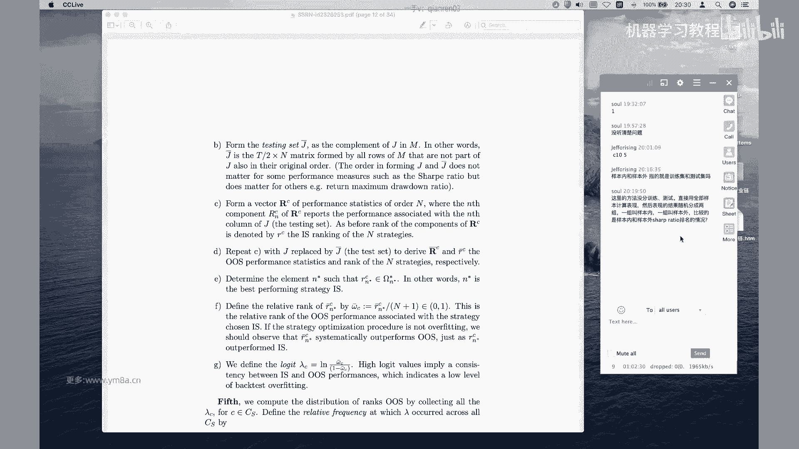

对吧，这记住是记住的时候说呃，这边就有两个就是一个是分组分组的时候。

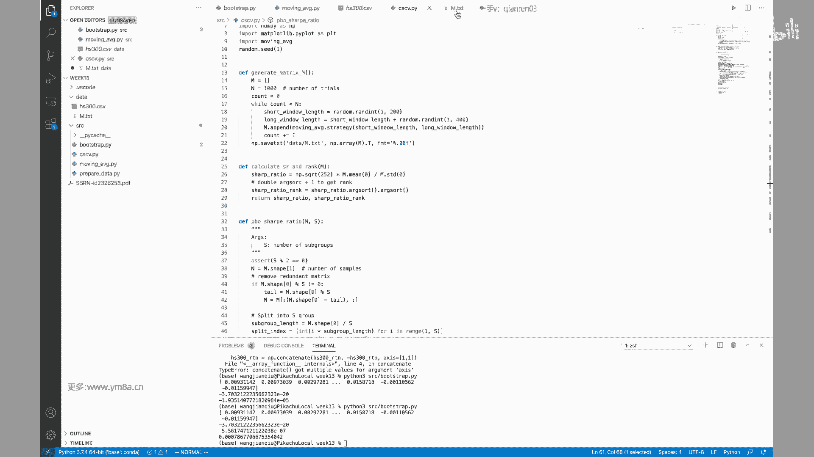

我们是横着分对，就是说我把它是就是按天数区分对吧，哪些天数是哪些天，OK但是我去比较计算啊，计算rank的时候，因为我总共是总共是1000组数据，那其实是我是横向去比较，不是纵向去比较对吧。

因为我我每一年只能算出两个sharp ratio，一个样本内，一个样本外，对前一半样本内，后一半是样本外，然后然后再去，然后再然后再去对每一行去分对K，然后呃。

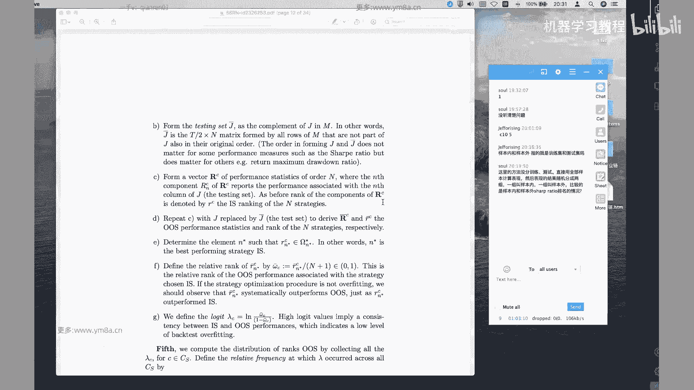

这个时候我们再来回过头来去看一下，前面这两个公式，我觉得大家可能现在会应该会清楚一点，就是说他所他所说的这个是什么意思，就是说我们首先是样本内，我选取了这样一个呃，就是说我样本内有人说第N组。

那就是说我样本类他是probability，就是说它是最优的，那这个时候我看到我对应的这一组，然后我看他样本Y的这样一个排名，它是不是小于二分之N对吧，就是说我如果比50%的差，我认为它就是过拟合。

所以然后这个时候它是它是相当于说是嗯，我要把在样本外，就是说我是所有，这个时候他说是我要把最优参数NNN星，在样本外的夏普比率，然后如果小于所有N组参数，在样本外下部比例中位数的这样一个概率对吧。

我们刚刚说小的小的R是排名，然后capital r是具体的数值对，所以再次强调的是说是我是先分组，分完组之后分别去计算SHARRATIO啊，对如果说整个过程我想问下，就是整个过程。

现在大家都明白是怎么回事情了吗，对反正佩佩也给了大家，然后啊，这其实我觉得就是说，你看这个图也是比较有意思的是，就是说如果只有呃，就是X等于负，就是怎么就呃分成四小组，然后怎么去，然后C42的话呃。

总共有六种六种方式对吧，然后ab in sample ab，然后out of sample CD，然后ACBDADBC诶，他注意其实它是两两对应的，所以说用这个框架一个优势，就是说。

首先说大家反正就是说他训练集和测试集，它是具有相同的大小对吧，因为我每次都只用了一半，那么这个时候我就说我样本内外的这下比例，可能就会具有就就具有可比性了，因为我们在正常机器学习当中。

比如说我七比三的下部比例计算的时候，其实会有一些问题，因为你一个是嗯连你一个是样本的长度是七，你是70%的长度，然后另外一个是30%的长度，你拿这两段，然后相同的参数或者是不同。

相对来说分别去计算sharper，但其实我觉得就是可比性还不是特别多，不是不是特别好比，当然嗯，因为我如果你说，我只用50%去做策略开发，50%去做验证呃，那也是那也是OK的对，但是但是这样的话。

你其实嗯你在就是要测试开发过程当中，我可能50%的数据，其实会我就会少了很多的数据进行开发，对吧嗯嗯然后大家还要注意一个特性，是说我们这边所有的in sample跟，out of sample的话。

它它是完全对称的，我会在in sample出现，我那么它对应的一定会在out of sample出现对吧，呃这是为什么呢，因为因为我就是我就是这么划分的呀，我就是说我十个里面选五组。

剩下的都会放在out of sample，那么我因为我游戏做的事就是combination，我是相当于说是全部把它排列了一点，那么我对你一定会说是全部去出现对吧，然后是嗯，然后还有一个就是说我们就是说。

也就是说我们就在这边，为什么没有说是去随机的选取，而是把它去分组对吧，因为我如果太随机的话，其实我就打断打断它，相对来说时就是实际上的这样一种相关性，那么我在这个里面说。

我仍然把它分成S的这样一个subgroup，我其实我时序上的相关性，仍然是就是说是保证了的对吧，然后另外一个，我觉得这个整个一个框架的特点是呃，其实我是一个model free的这样一个过程。

我没有E也是一个non parametric，就是我是一个非参数，然后也是一个无模型的这样一个过程，然后我其实没有依赖于任何的这样一个，assumption对吧，我们就是我没有，我没有说。

这边一定要说是有这样怎样的一个模型，也没有说引入相同的参数，你可以把S呃就是divided by any group，you want对吧，就是说其实我最终得到的是一个，拉姆达的这样一个经验分布。

然后这个时候说凡是发生过拟合，就是说我把我呃拉姆达应该是小于零的，这部分就是呃我把它从负无穷到零去积分，那么这一部分，然后接下来的这样一个比例，Percentage。

就是我的OVERFIT这样一个p BO probability of baptistic，OVERFIT对吧，OK所以对这个总结，其实说总结总结下就是四个特点，一个是说我训练集和测试集相同大小。

然后另外一个是呃，我训练集和测试集是是对称的，任何一个测试机都被当做了训练集，任何一个训练集同时也会把它当做了测试机对，然后另外一个是我保证了，第三点是我保证了这样一个时序相关性。

然后第四点它是一个np metric，那也是一个model free的这样一个过程，OK所以到现在大家还有什么问题吗。

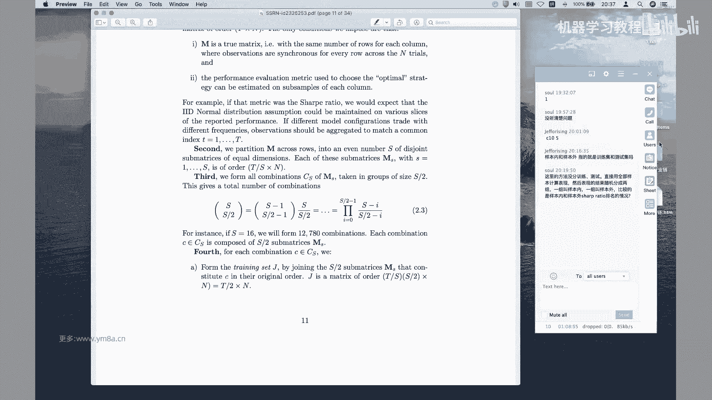

嗯OK然后我们就来看怎么去implement，其实如果把整个过程理解下来的话，实践起来应该会比较简单嗯，呃程序是呃，这边是generate generate这样一个return the matrix。

然后我刚刚说我是seed是一这样，大家去做的话可以对比一下，因为结果是完全一致的，然后呃calculate sherial和rank，这个里面有一些小trick，sharp觉得很简单。

就是我们这边model free interest，我们认为是零，然后我直接去min，然后divide by s t d station，但是这样一种方式是说嗯全是，因为因为我是沿着X0。

我去沿着每一列去算命的话，就是说你们这一列啊，这注意我们这边实际去算的时候，我给的不是吗，我给的应该是M的呃，一半对吧，我就是随机选的一半，它里面是为了方便吗，kg应该是300M。

所以JO就得到了是他的SHERIAL，就是return to a main，Return divide by，嗯嗯对呃，我这边可能我在想的话，我一般用的是log return，而不是return。

可能会有一些问题，但对于结果影响应该不是特别大，然后然后注意要把它去，我们是日级别，然后还把它转化成年画对吧，所以乘以一个，不然这个值差会很小对吧，就是日级别的sharp手机还挺难的。

然后把它把它就是SQRTO，然后呃接下来有一个就是有个骚操作，就是用了两次USD得到这样一个排名，就是这个事情是为什么呢，是我们看个，就是我给大家写个例子，大家都明白了，我们生成一个，Sorry。

就这样吧，Ok，我们生成一个就是这样一个random，这样一个序列，然后就是假设他是sharp ratio对吧，那么我们要去排序的话，我们最终desire就是理想的结果，它是一，他是二，然后他是345。

所以是和13254对吧，你要得到类似于这样一个结果，或者你加1-1都无所谓了，那么我如果第一次做的话，做arc sort得到的是202143，然后再去做一次ASHORT呃，是不是只要只要用一个就OK了。

好久不好意思，这边可能还没有必要呃，让我想想我之前为什么要做这么多，Ok，第二次之后应该是没有变化的，Ok，好所以这边是冗余的，然后这样就得到它的排序对吧，然后他是为了我们。

接下来就算整个的过程去服务的，OK然后我们再回到下，回到整个过程，首先是呃我们就算PPLSHERATION时候，我传进去，其实就一个是我的收益率序列，然后我还把它分成几组，Now we assert。

它是能够它是even number，然后number of samples，然后就是我有多少列里面是N就是1000了，然后注意做的事情是就是啊我把他这个给去掉，就是我我们把它就是就是它的余数对吧。

我们2。90，我希望他正好被S给整除，那么不能被S整除的，就把它去掉，其实应该用后面好一点哈，我正好试一下有没有什么区别，那我就从，tell到end对，从tell到and就也是一样的，我们这样选下来。

也就是总共是，如果我们这边下今天是2。90对吧，OK这部分做的是什么，就是说我们需要把我们的matrix把前面的给卡掉，只留下我们能够被X整除的部分。

那么接下来要做的事情是split into ice group，那么spit into group怎么去，那么首先知道我每一个每一个subgroup有多长，那就是有这个时候M我已经update过的。

所以我主要是shipping，我有多少行有多少天，那我除以S那我就得到每一个S有多长，然后我去生成这样一个spirit index，spring index是什么呢，就是从一到S我总共有S减一组对吧。

我我我需要在哪切呢，那是在呃一乘S1直就在1S2S，一直到S减一乘S对吧，就是就是我们这边是299598哒哒哒哒，一直往后所得到的就是spec index，然后我去把我的subgroup。

我就得到了南派去split对吧，我就split之后呃，注意这个这个这个时候是我这边得到的是呃，一系列的list，就是这边推出来应该是一个list，比如说A，One pi，He can spread a。

As index，对吧，我们就这么去分，然后，我们去split a，ok split a的话，Spirit a，这边demand，大家看到，首先是，你或者再去把它，我把它变成一个ARA。

这时候看起来清楚多了吧对吧，这个时候就是美，它是一个相当于是three dimensional，那么就是三维的这样一个，11×299，然后乘以1000对吧，就是如果是BD0个的话，就是299×1000。

那么接下来要做的事情是，我们用了一个是iter tools里面的combination，这个事情这个包就是，我们先看一下combination，他做的事情，比如说是我们把1234，然后四个里面选两个。

看来是没什么结果，它是一个生成list combination这样一个object，然后再去把它list一下，OK这样是他的排列组合全部对吧，那我们这边用的是list of ranges。

然后我要去里面选as divided by two，然后这边把它变成int，那么就得到all combination对吧，就得到了这样一个list对吧，那么如果这边是我们这边是most range t。

嗯算了，少一个，Princess，U librch，Sorry，To b，对吧，大家看的就是每一个都是我们的组合，虽然顺序来，但是这个也有好处，就是你不用去担心它的顺序。

我们我们的index就是说我们的subgroup就是M0，M 1m23，他就按顺序排好了，所以不用去担心，然后看一下他有多少个哦，这样不照可可以，嗯好吧，252个对吧，就是十选五。

OK那我们得到了这样一个all combination之后，我要去做的就是我每一个combination，是一个他的element，那我得到的就是这样combination之后。

我用一个set的方法去把他的completion，Complement，就是他的补给给求出来了，就比如说这个呗对吧，呃就是首先是set range ten，就是这个是什么，这个是这样0~9这样一个集合。

然后我再去减去这个set，对啊，然后再去把它变成一个sorted，把蓝顺序去排列，所以12678的补给就是零三，求求相当于是求补给，OK然后接下来我们得到了这样的，应该就是M的划分之后。

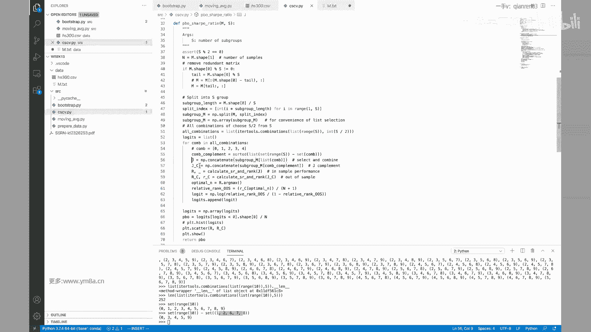

我们去就是这个是我们的step集了，我们得到了他就说我们先做这边。

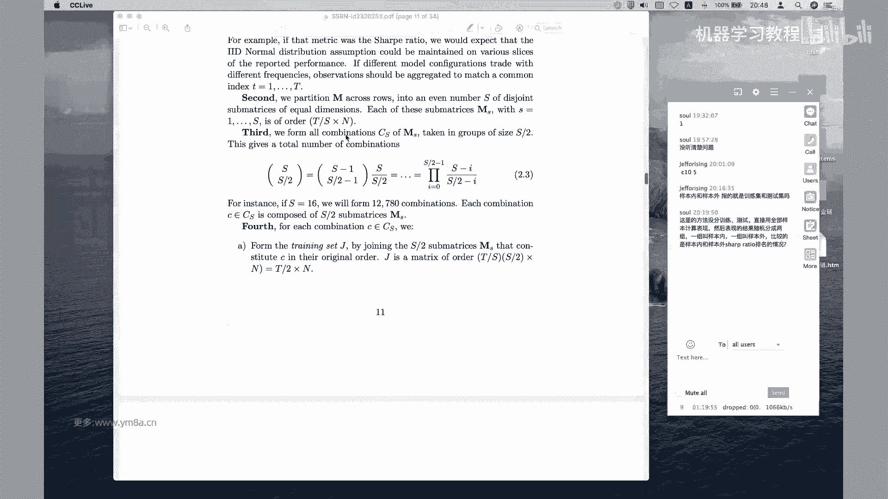

我们得到它的划分，然后我们今天是loop for combination对吧，我们是for each combination，for each combination之后，然后你要去join。

那我们这边join用的是concatenate，Npcinnate，所以刚刚我们说subgroup m是多少来着，B的size shape是十二九九一千到1000。

然后这个时候我选的就是说那subgroup，SUBGRAPM的话就是B，比如说main1234，知道是叫TNSHIP是什么，应该是5×299乘1000对吧。

就说我是五个2991000的这样一个matrix，然后再去把它can cinate，你就知道了，应该是告诉大家dimension是多少，应该就是1795×7，好意思就sorry，不好意思。

算数算错了对吧，就把五个SUBRI合到一起啊，记住这个时候就是说，我相当于说是把里面分十组，按横就是横着来切，然后从里面选了五组，拼完拼完一个对吧，OK我这样就得到了J。

然后j compliment一样的方法，然后这个时候我分别对这两个去算它的，Shratial capital r，然后他的ranking little r。

来注意说我们真正matter就是what matters，是他的ranking对吧，要注意说是，我们就是说，为什么要把在前面的rank排排出来的，其实我们我不需要全部的排名，对不对。

我只需要是optimal，就是arg max，就是在前面这一组里面哪个最大对吧，我们也可以这么去做一样的操作啊，可以啊，我们不需要了，这人不需要对，我们当然还要import它这个函数没有必要了。

我们去算它的R对吧，我们算出optimal r，然后嗯我们的omega RT rank os out of sample，怎么算呢，是我找到对应的，首先是optimal r对吧。

然后找的是他的complement set，就是在他的out of sample的那一部分，他的rank是多少，理论来说，如果最理想的情形，我in sample测出来最优的。

在out of sample也是最优，那这个值就应该是N对吧，那么这个值就应该无限接近于一，这个是1/1001对吧，那么large这是我刚刚说的是ranking，这个值如果大于零的话，我认为是没有发生。

Out of sample，就是没有发生，Oral feat，如果是小于零的话，它发生OVERFIT，因为我刚刚说过，这个值如果正好是0。5的话，代表是那这个两个都会无限接近于0。5。

所以这个除下来正好是log1，就正好是零，所以如果它大于0。5，那么他得到的就是大于零的这样一个数对吧，log下也是就得到的是大于一的这样一个数，log下也是大于零，然后我们对所有的logic去把它。

我所谓的probability啊，这样的话你其实让我想一想这个啊，OK我这边算的有点问题，我不应该是去count它有多少个，对这地方有问题，他他不是就是应该还要乘以它的概率密度。

不能仅仅简简单单算下多少个样本是小于N的，我要应该去向它的概率密度，这部分是有问题对，但大家明白我的意思，就是说我把每一个的就是large value都算出来了。

我就能得到一个他的histogram对吧，我们把它histogram去看一下就好了，对，All right pon three six words cs，他会循环的算对，有哪位同学可以试试看。

就是能不能不循环的去算，What h，让我想想这能出什么问题了，Number of things，Test video，Test video，I m ten，这边是brown force，T log。

这问什么问题，OK他不是final，我想一想，说明这边有哪个值是出现了infinite，也就是说这个值这个值出现了零，And write rank，我要把它，我想把规定的内组给找出来。

虽然我不确定是前面改了哪一步出了问题，192，我可以给他加一吧，OK这样应该make sense，OK这样应该不会出现问题，所以因呃大家注意看到paper里面，就是他rank从一开始。

而我们这边的art sort会从零开始，所以我们把它加一之后，应该就能够避免它这个值会出现哦，应该会出现避免为零的这样一个情形，其实也不能避免，呃，这块没有想清楚，可能应该是哦没有错，对我对。

因为要注意就是说刚开始没有加一，会出现什么情形，就是如果他真的是the worst scenario，就是他正好是最差的一个情况，那这个是零，对不对，那个是零的话，呃。

relative这个值就是一嗯就是一减这个的呃算了，前面这个分子就分子就会设为零，那么这个老的说就是呃就是无穷小，OK那么我把它加一之后的话，就避免这样一个问题，那么分母为什么要去加一呢。

因为如果他是加一，那么rank可能有999变成加一，就变成一千一千，如果除以N的话，还是可能会出现一，所以它分母加一是为了避免成1000的问题，当然那肯定取一个非常小的数字，我觉得可能也是OK的。

我来试一下，应该是OK的，然后我们这样画出，就是啊logic的这样一个histogram吧。

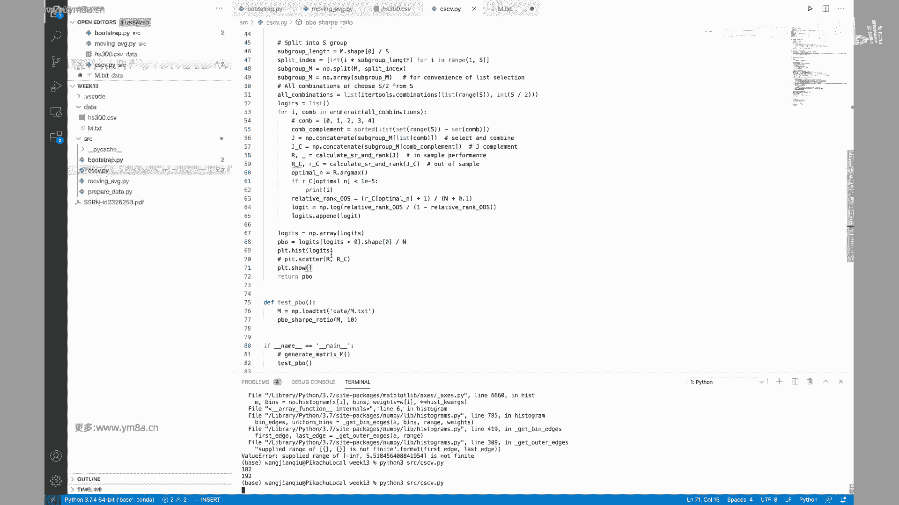

就是想近似于去把它的代谢方式画出来，好OK所以这边是会说什么意思，就是说，呃这边就是说我的large的话是呃，记住我们每一个就是那那那什么是probability of，那个呃嗯就是这是我们的。

就相当于是拉达这样一个empirical样一个distribution，那么那么你想要去看，我们刚刚说什么是probability of呃，Btesting back test overfit。

我们讲的说是说是说是是什么是呃，FLADA小于零，从从负无穷到零这样一个dispute，那么我可以说啊，因为我这边没有归一化，但显然是说如果他是一个没有去OVERFIT的话。

我的distribution应该是都是在零右边的，但是现在有人说我们什么问题，我们有一半的概率差不多是对，或者说接近一半这样一个概率应该不到一半，因为这边会大一点对，可以说是说这样的这部分面积。

占总部的面积是接近于1/2的，就是说我们这样的一个BTEST。

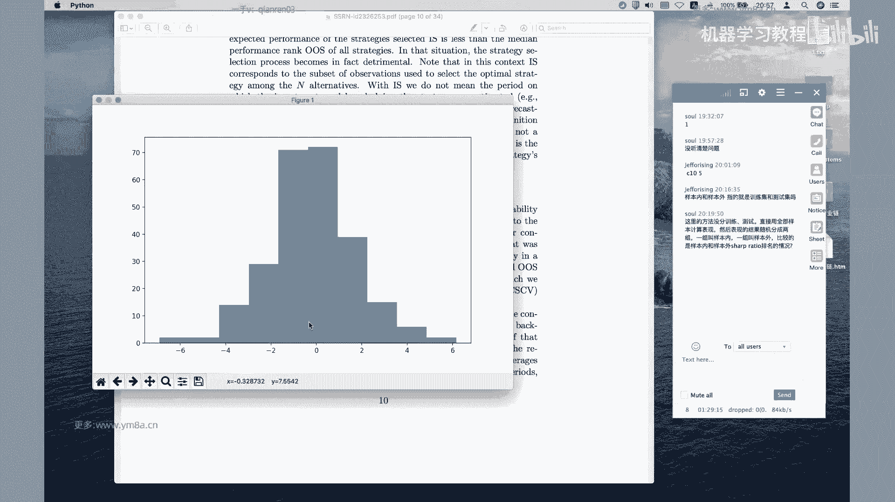

我们可以说这样的一个strategy，整个的过程有50%的概率可能会失去，就是会ORFIT，我看一下这个有多少吧，这边啊让我想一下哈，对这边不能不能简单的说是去count它对。

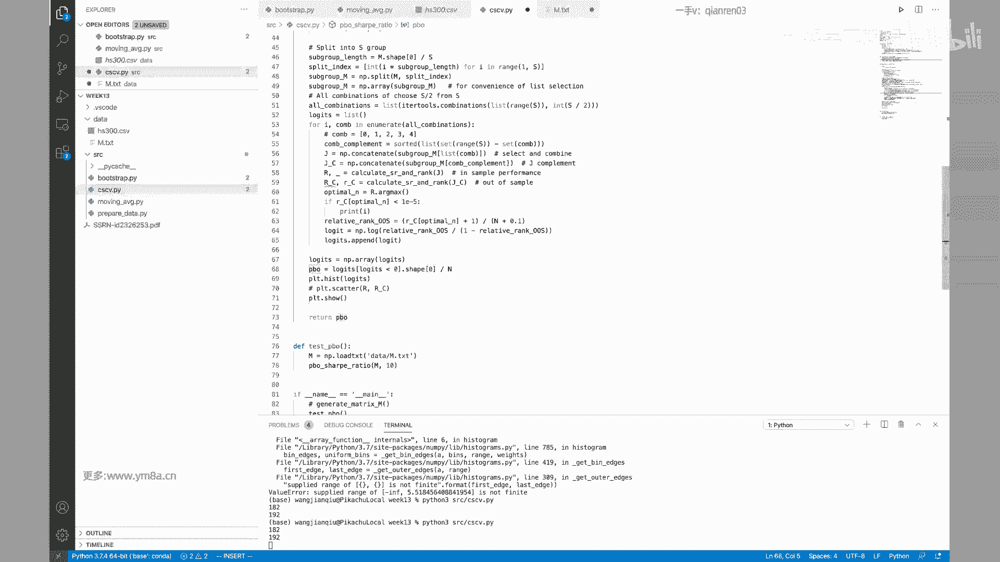

还是要去把它，就是因为我们这边的我们说的是，他是我们得到的是一个HIRAM。

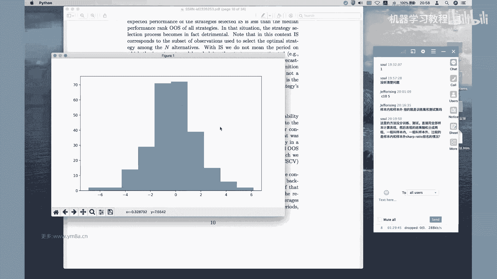

然后我们要去做的事情，是我们得到了一系列的LADA，然后我们要去把它去，你就是把它去呃去拟合对吧，因为它只是一个概率密度函数，但是你要去把它积分之后，你才能得到这样一个，得到一个它的就是概率密度。

那就得到他的概率对吧，就是说我们得到的，实际上是我们得到的是弗兰达对，嗯OK然后。

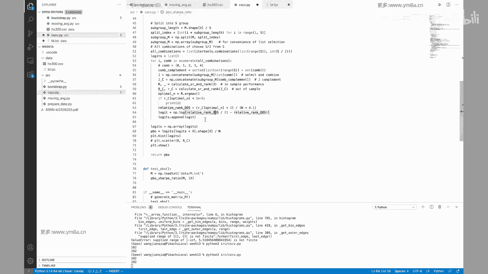

所以嗯就是指可能想一想。

为什么这个策略会出现比较大频率，就是比较大概率一个过拟合，就是嗯很很很很现实的问题，就是它就是我们OVERFIT，我们强行去构造出这样一个呃这样一个过程，对吧，我就是它本质上就是说这个策略。

这是非常简单的去moving average，我们本质上是哪一个同一组参，就是同一种同一种策略，然后只是在去试了这样一种不同的参数，对就是我们构造的过程当中，就是加了很多这样一个参数，对嗯。

当然你可以说如果说你我直觉是，就是如果你随着越来越大的话，那么，嗯我刚刚是1000对吧，Let's say，后面1万，那显然的话欧洲非概率会更大了，然后我们再。

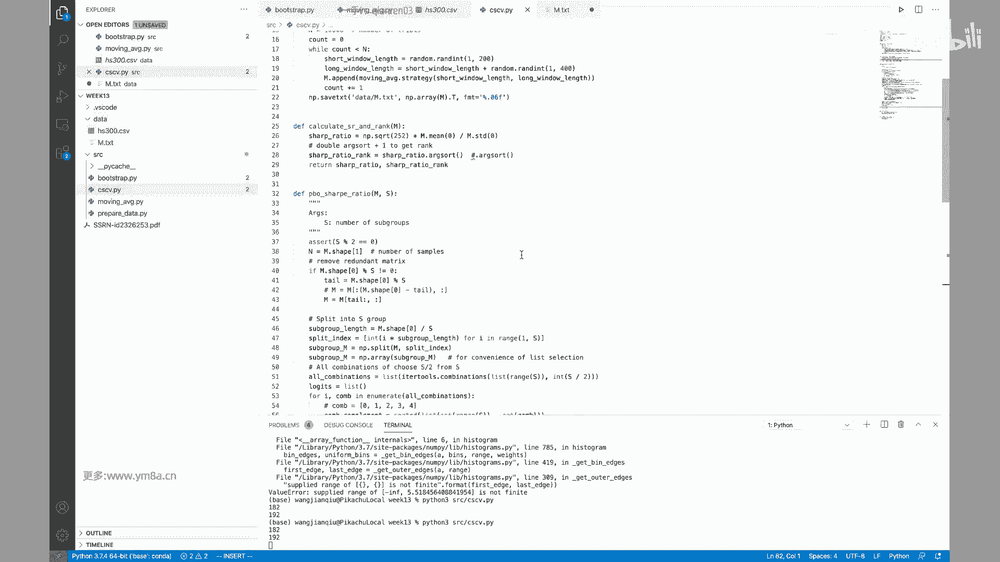

对再试一下，这样可能会慢一点，对记住这个概率分布。

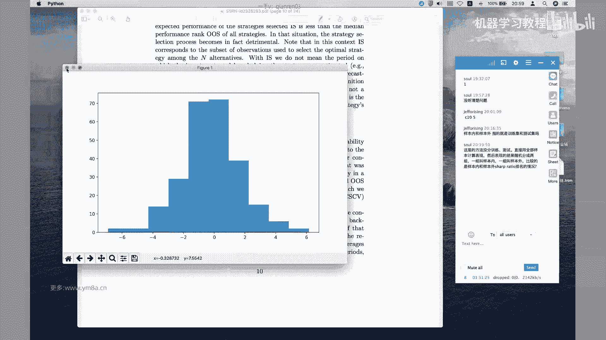

然后我们再看下一个对，就如果是1万组参数，那大概率的话对，就大家可以去明白它的这样一个意思，是什么了吧，所以说，它本质上是看如果正常说我去测试，比如说我去测试了like嗯。

我觉得大家可以测试可以做的事情是什么，比如说我同样一个策略，我放在不同品种上，是不是可以去我生成嗯，我生成多个这样一个呃M的matrix，那么我是不是也可以就是就是去做呃。

我比如说我有类似我基于同一个指标，但是我有不同的呃cut off的，根据不同的它的值有一个进出场值，你可能也会去做相同策略，那么这样一种框架，就是说他给了你一种去定量评估你的策略。

可能会发生过敏或者概率，对，看的真的是有点慢嗯，就是大家可以想一下，就是如果实际验证的话，我觉得当然有个好处是，我们一般不会真的是去生成1000组，这样1万组这样的策略参数验证。

这样的过拟合的概率是比较大的，对，可能我们自己去回测的时候，比如说我们可能也就测了20组，50组，那么那可以也可以用套路，就那套用这个框架的时候，就是在做FLOOP的时候可能就没有那么麻烦，对吧啊。

哦算一下1万3000K，3000万，3000万的这样一个矩阵，所以下可能还是会会有点慢，对就是其实尽量能避免FLOOP，还是去避免FLOOP，但是我不知道这边有没有，就是可以去向量化的方法对。

嗯对应该可能上的话会逻辑，我觉得可能会过于复杂一点，因为呃相当于说，我要把所有的COMMODATION都没加过来。

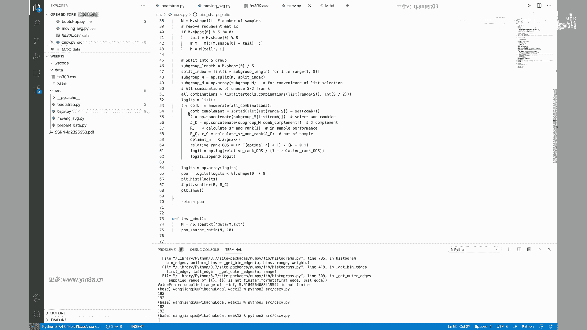

OK这是算好了吗。

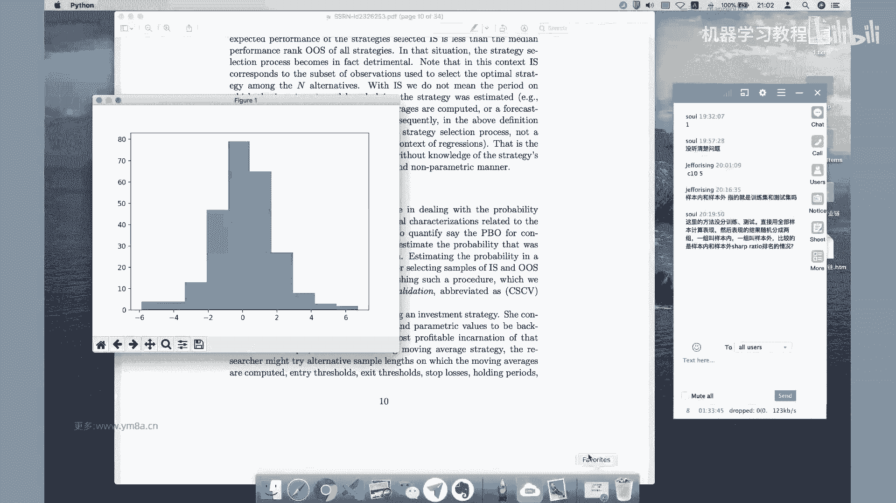

和我看一下我们的size。

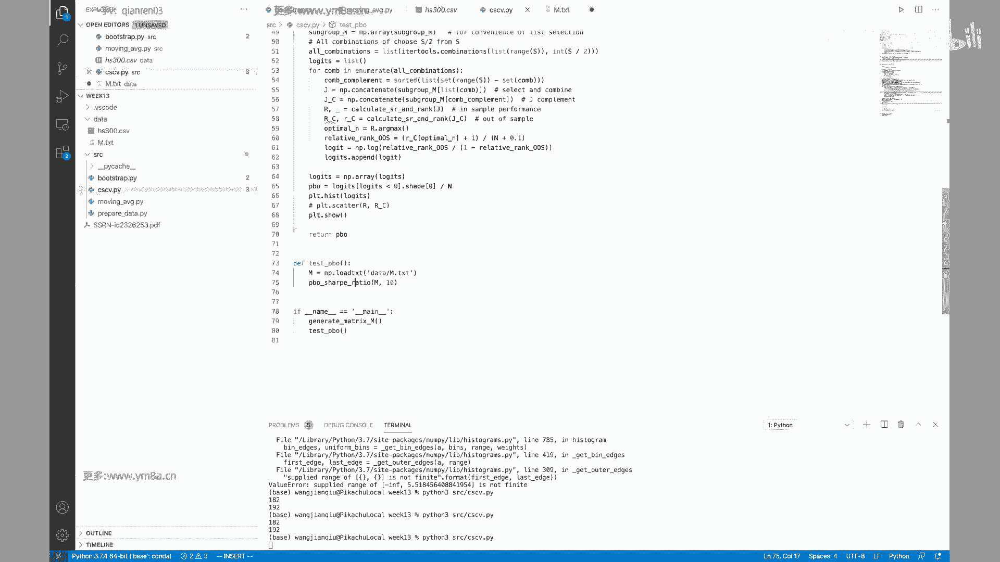

怎么跟刚刚的图，这个时候刚刚还记得，就是说我们那个风是，所以这边是比较多的，但这边显然也是在零左边。

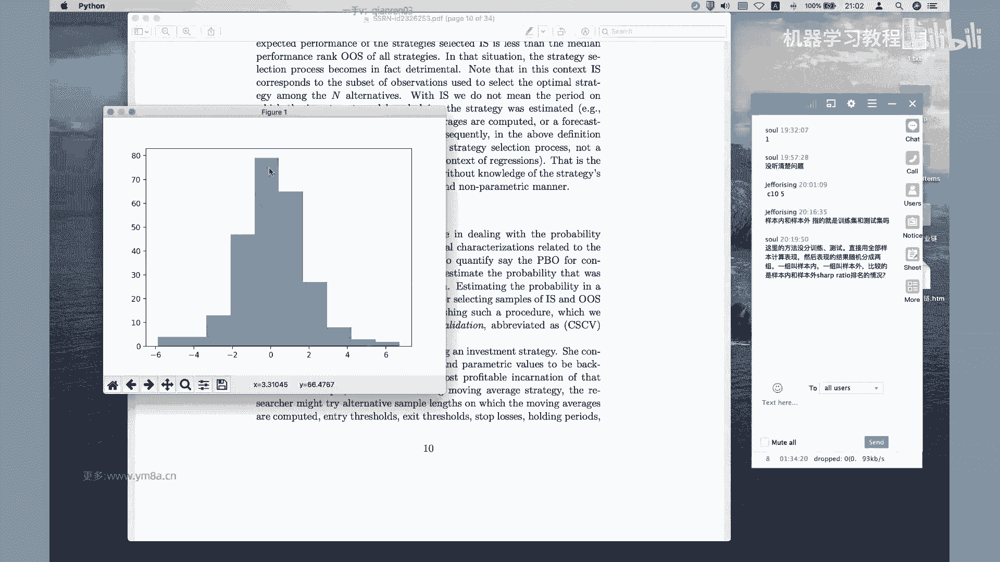

已经是高于在零右边了，OK所以嗯我再试一个小一点的wake，把它，我们是一个如果是100的话会怎样，PBOSHRITUAL同样都是把分十组，唯一的区别是在于，嗯OK，平平的什么时候，啊不能小于100。

因为好好想想，十五十场，就说是index about b，100不可以呢，OK试试，OK什么问题，我说，再试一下。

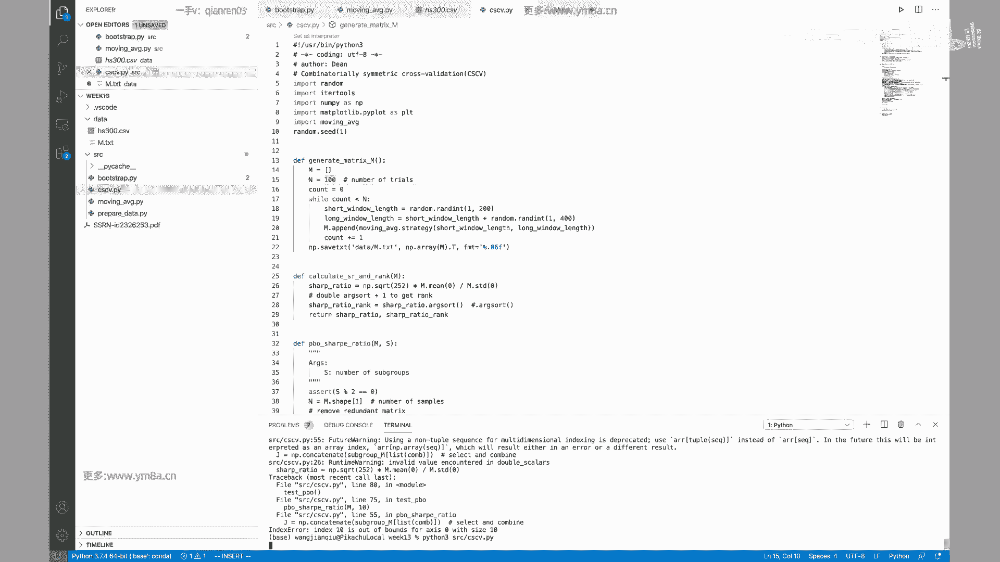

Okay u，但是还是不是特别明显。

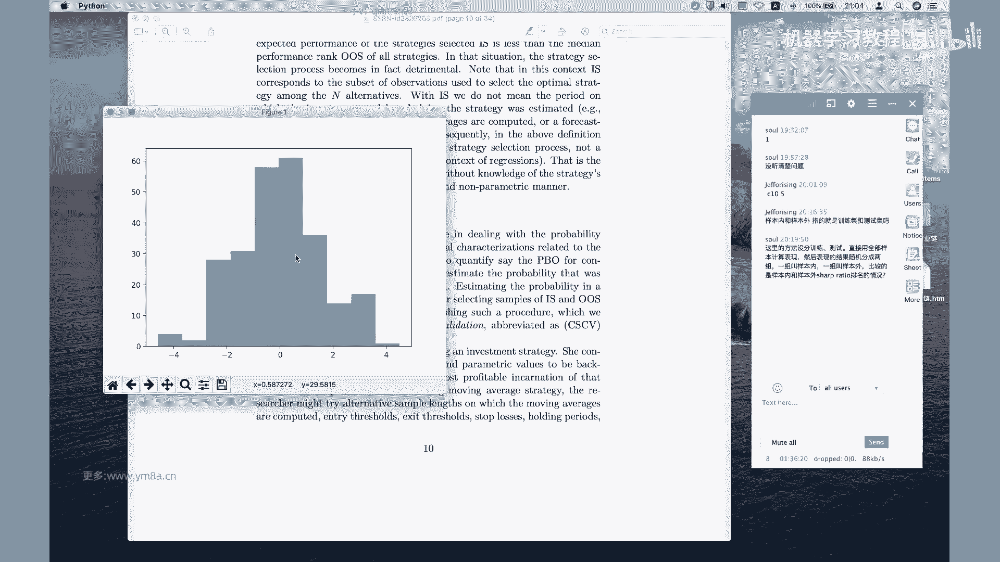

但是还是会有一些区别啊，如果再极端1。10。

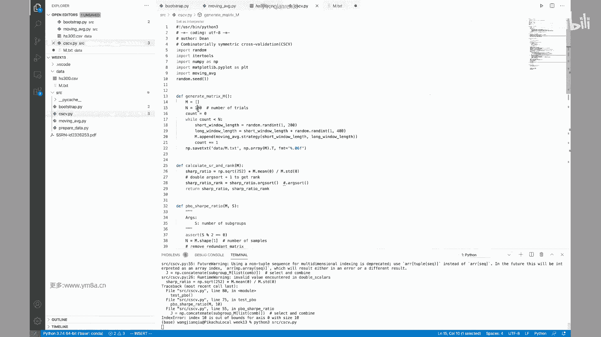

100。

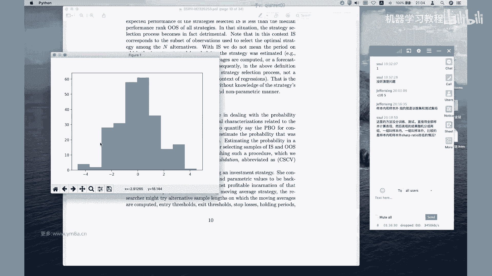

七。

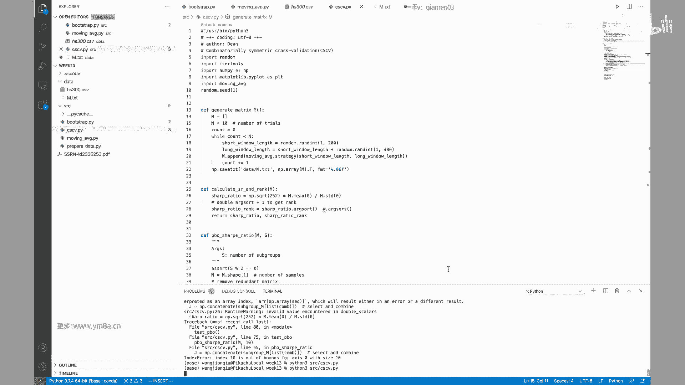

嗯哼这个时候大家看着还是会有区别了是吧。

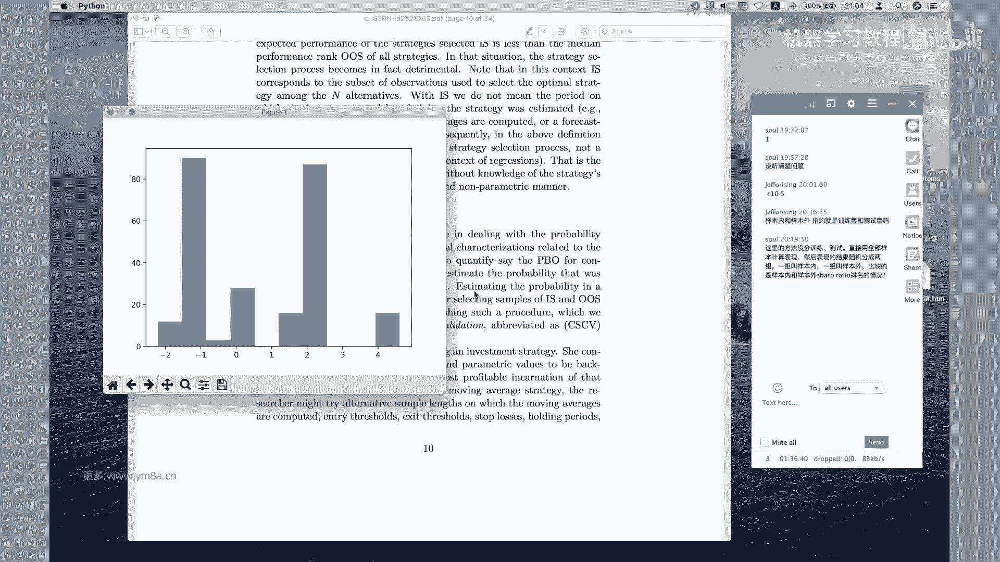

因为这个时候其实我总共就生成了对，我总共就生成了100的这样一个样本，然后然后这个时候其实呃其实是诶这是还是，对这样就对了。

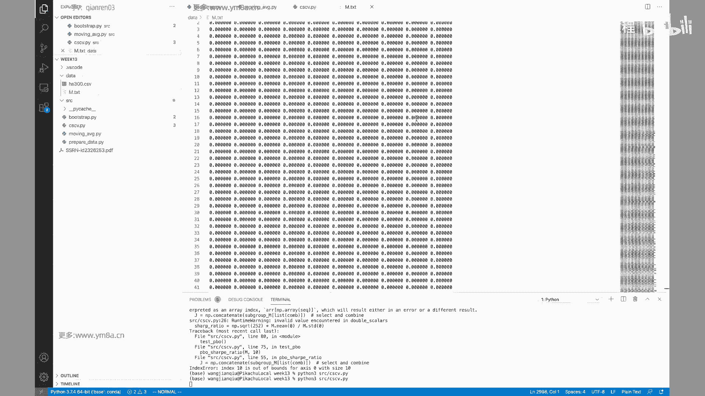

那这个时候就是显然有人说它衡量的时候，因为我只有十个，我只有十个样本的时候，12345对，如果有十个样本的时候，那么我同样的在前半部分随机选取得到的，optimal的这样一个概率啊。

那么它是会嗯在相对来说，他在就是说我们有比较高的执行度，在后期他在out of sample期间也是一个嗯，嗯就是会是相对比较一个最优的概率，然后我们刚刚极端的情况说呃放到1万的时候。

OK呃我有1万个数据，确实是从前这1万组里面选出了呃，这1万列里面，选出了前半段最优的这样一个strategy，但是在后半段能不能是ZO。

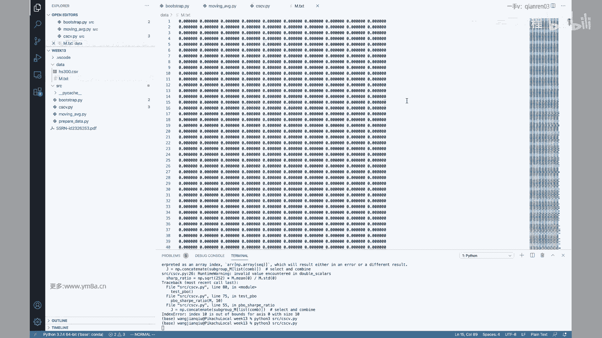

这个时候就显然就是不一定了，可能是一半一半的概率对，那这个时候很显然因为我测了有1万组参数对，所以这样直观上，我不知道大家能够对，这个就是框架会理解的清楚一点。

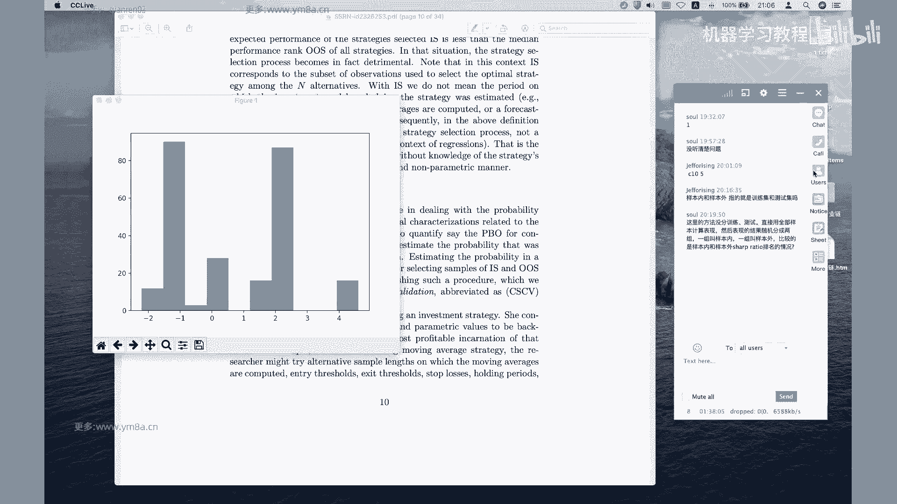

OK大家现在还有什么问题吗，所以我觉得就是说你把整个过程理清楚的时候，其实我觉得相对还是比较好去理解的对，嗯然后其实还可以做一个事情，是你看一下他的scatter策略的。

就是in sample跟auto sample，它的sharp ratio到底是有什么样的关系，对吧，呃我们这边还是用1000，我这边可能会有一个问题，就是在计算sharp ratio的时候。

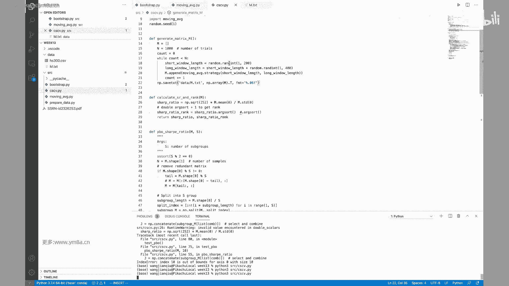

我们刚刚说LOGAN，但是让我想想，所以计算sharp ratio的时候。

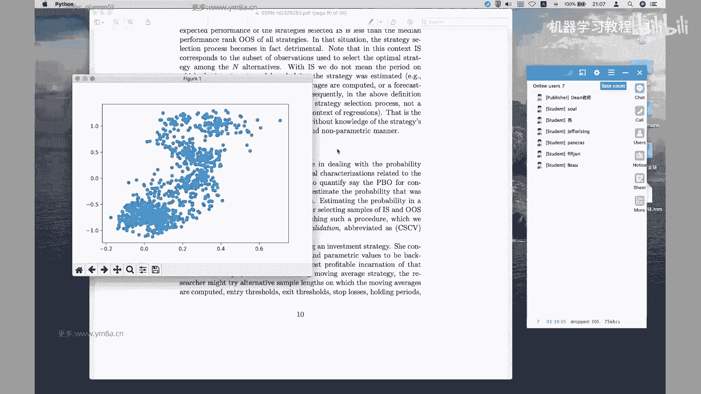

呃我需不需要把它换成daily return，就是take exponential，呃，这块没有想清楚或者，Daily meter，或者我不用这个呗，用我不用log return。

我用这个return再去，嗯减去，沪深300的DELIOR减去。

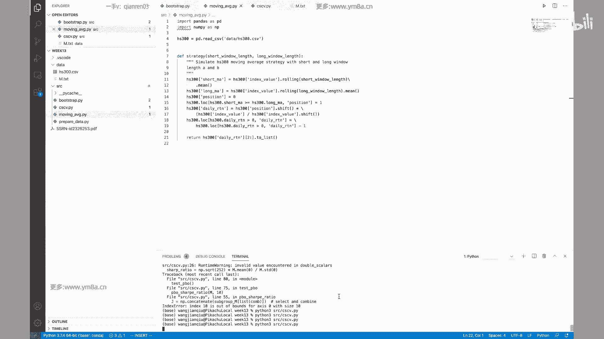

OK区别不大，我这边好像就是说是我很久是in sample的，sharp的时候，然后付的是呃out of sample sharp ratio，然后这里面会有一些就是比较奇怪，比如说是呃。

我在很多时候SHEPARTIAL大家可以看到，就是说整体的一个倾向是呃，呃要注意一下坐标轴哈，就是我在in sample separation比较嗯，本身比较低的时候，在out of sample。

很有可能就是separation都已经会可能会变得，有一部分会变成负值对吧，但是说你说in sample，SHERIAL有一些是零点，在0。2的时候，甚至最高能达到二到，sample是1。5对，所以。

其实说如果是严格的，我看到in sample跟out of sample的这样一种呃，in sample gto sample的关系，你应该看到的是，如果是没有发生过拟合，我应该是看到的是显著的。

是有一条就是从零过了这样一条直线，或者说你会会有一些shift，但是整体来说你distribution会比较清晰，而不是像现在这样对，就是你来说我in sample sherro越高。

我out of sample sharp sho也是越高，这边这块会有一些问题对，OK啊，现在大家对整个就是cs CV这样的一个，procedure还有什么问题呢，那这个东西是可以去把它。

应用到我们的BA过程当中，不管我们是自己做股票回测，或者是嗯是期权或者期货，因为看到我们这边。

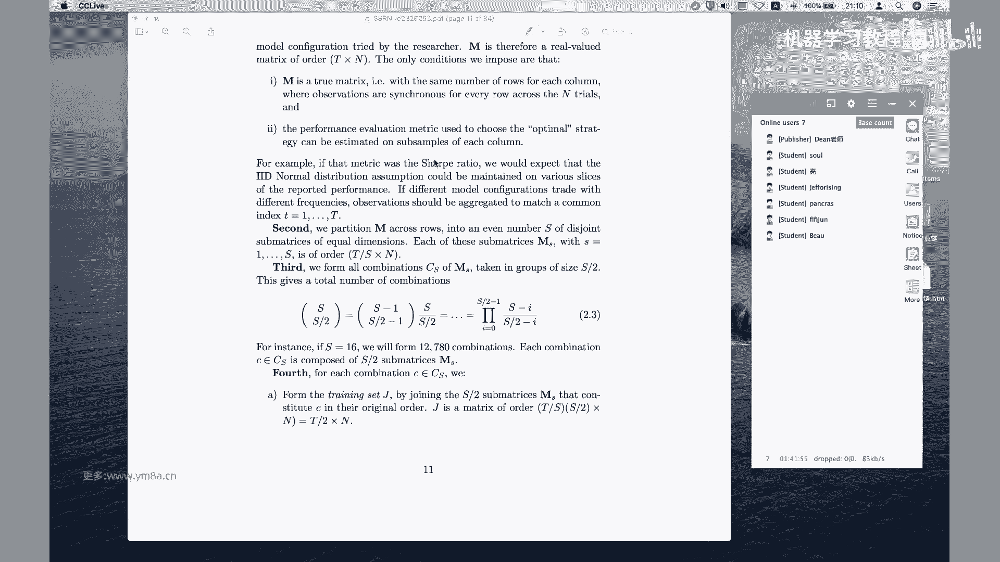

我需要的仅仅是就是我每一组策略，每一组参数算出来的这样一个呃。

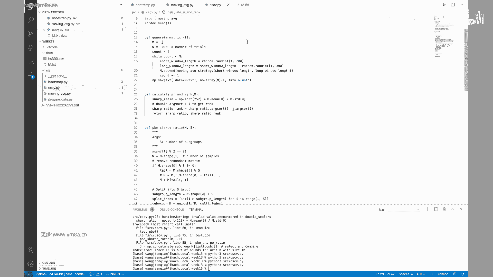

return这样一个序列对，因为这当然这个沪深300就是有一个呃，这个相对还是比较简单，因为我只是单标的对不对，所以我收益很多可是零，所以你在算standard deviation的时候。

会觉得可能会有些差别，但是如果你是真实的拿呃，就是不同的策略去算成收益率的话，那我觉得可能算出来的效果会更有说服力一些，对吧，因为我们这边其实有很多的零，它它它会有一点像系数矩阵对，OK然后的话呃。

对这篇paper我觉得还是还是比较经典的，就是大家可以去读一读，对uh for a bit of，Ok，然后这边说的是。

It's interesting to process the pairs to realize，How strong such performance dation，对吧。

啊他这边就做的比较比较比较合理一点，就是嗯他AT3pro的话，有的还真的是sharp是比较高，首先就是一个系统的观察，是in sample sharp。

sharp ratio是高于out of sample，Sharp ratio，我觉得是相对来说是会符合呃对，所以说这是过，你可以讲相对来说，你会会比较符合这样的一个逻辑，然后然后看到之后。

这里面有一个就是强烈的是一个negative，correlation的关系，就是说我在in temple shop求越高，肯定是out of sample super会越低，对这个图倾向还是挺明显的。

然后这边的时候啊，大家看的就是这个spike，它的就是峰值，就是说我们看看整个的distribution的话，他这个是0。74，就是说它是有74%的概率是F哦，对。

这时候因为他distribution logist，它值主要分布是在呃0~-2之间对吧，LOGIES分布什么意思，我们刚刚前面讲到的，就是说啊你去算log0上的一个值呃，就是说他那个值是小于一。

就是分子小于分母，就是说我在分子的out form的话是哎，我在就就是我在分母是有很多是没out perform，就是out of sample，就是我在out of sample。

ranking相对来说会比较低一些，对，嗯OK，OK这个就是一个典型的就是说嗯OVERFIT是LOGIST，大部分都是大于零的对吧，虽然就是说form a degregation里面。

可能还是会看到有这样一些镜像，但是首先是一个是斜率的问题吧，这两个斜率还是挺不一样的，这个是-0。75对吧，这是-0。75，但这个斜率是-0。35，然后这部分其实我也没有去看，就是对就是下面感兴趣的话。

大家这部分是可以自己再去把整个paper去读完的，然后我觉得我更加关注的就是，我觉得更有意思的是，他整个框架这样一个提出的建立，还是挺有意思的，然后之前我没有提到。

就是呃advances in financial machine learning，就是呃这个哥们，然后还有针对口令，有他的考量，开的有一门课的，那就是有关金融机器学习的应用。

然后有一些科研相对来说会偏理论一些对，但是我觉得从中还是会，偶尔还是会有一些比较好的一些想法对对，所以啊就是他可以去看一看，当然就是他他是相对来说会偏一些学院派一点。

就是就包括其实这边这边paper也是，但我觉得就是这个框架，是我们自己是可以考虑到去纳入到我们的，还有back testing整个这样一个过程当中去的，它并不是单纯的说我提出这个框架就OK就over。

但事实上是说玩，如果是呃就是我们做到现在应该是我测完之后，我的我的不断的策略，就是我应该是嗯我的策略的performance，应该是进入到数据库里了，然后我对这个类型的策略，我比如说我测试了这么久。

测试了这么久，然后为什么选了这一组，但其实是有必要去算一下，就是说我这个时候呃我也没有去，也没有说潜在的发生过以后，因为呃即使说是就是在策略开发过程中，即使说我知道自己说不能去过拟合，但是胡浩会有信心。

当你对这个数据太熟悉的时候，不自然的，你甚至说你只要是看过就是out of sample的表现，因为可以脑子说记得那个图像，大概知道这段时间可能是低波动率，或者说呃或者是高波动率，或者说是一个单边趋势。

那么自己在设计策略当中，无形可能就会把这样的因子去引入，去纳入去测试，那么导致无形当中会出现这样一种过拟合，所以呃这这样一种方式，我觉得是呃就是我觉得还是挺有意思的，就是这个框架对嗯。

他要注意的就是嗯还是要强调一下，就是说呃他算的是一种，就是它是呃，它是测算某一个策略过度拟合的可能性对吧，就是说但是他没有告诉我们，说是我具体的这一次回测结果，发生过拟合的可能性，这两个概念是不一样的。

所以说我测的是这一个策略过渡拟合的可能性，但是没有说我针对我这一列具体的回测结果说，OK你这个回测结果有多少啊，又有多少发生了，有多少的概率发生了过拟合，这两个概念是不一样的，要解决，我要去怎么看。

我这一次回测是不是发生过年以后，那么其实就是有两种方式，一种是用BOOSTRAP检验，然后还有一种是用monte carlo permutation，用蒙特卡罗置换的方式来去做，然后下节课我们再看一下。

就是用BOOSTRAP怎么来去做，OK然后嗯这个paper还有相关的代码。

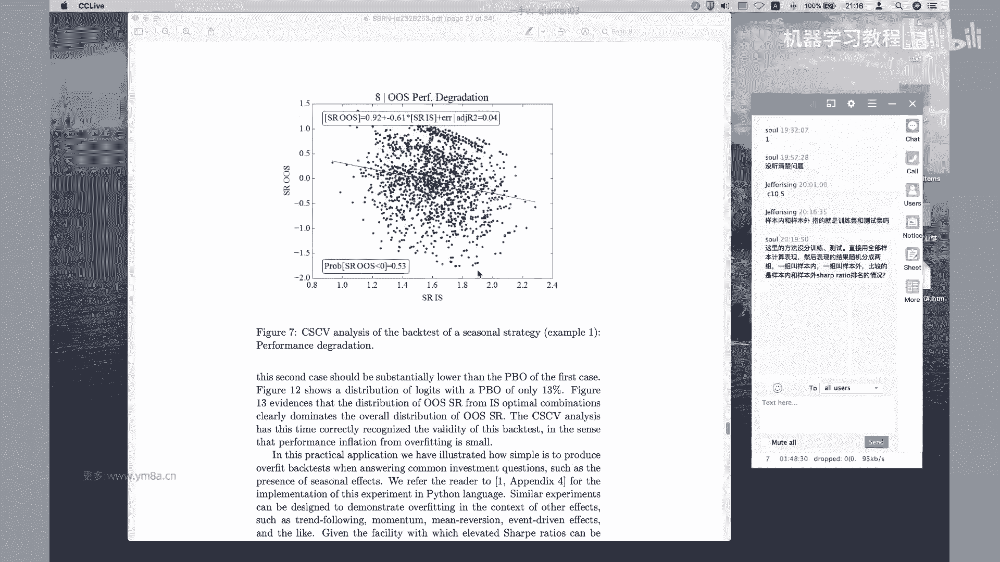

有什么问题的话，大家可以再来问我，然后我们现在休息10分钟。

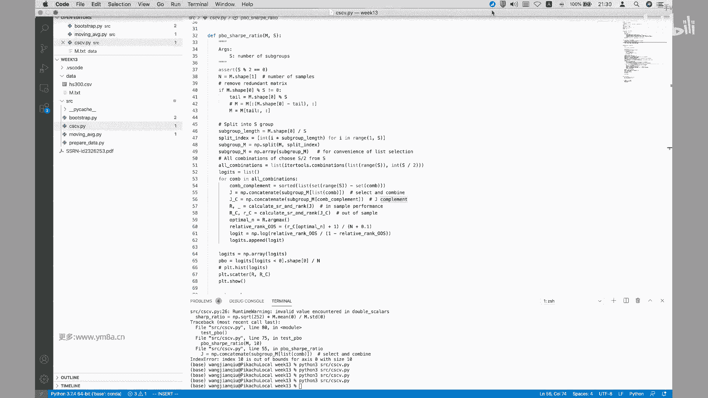

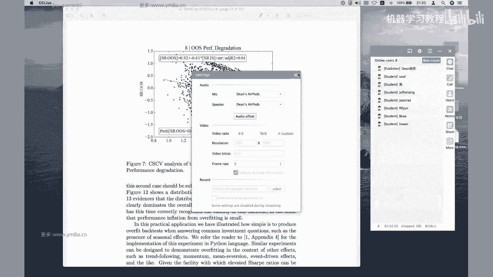

OK啊同学们，然后第三个是接下来第三节课讲的是。

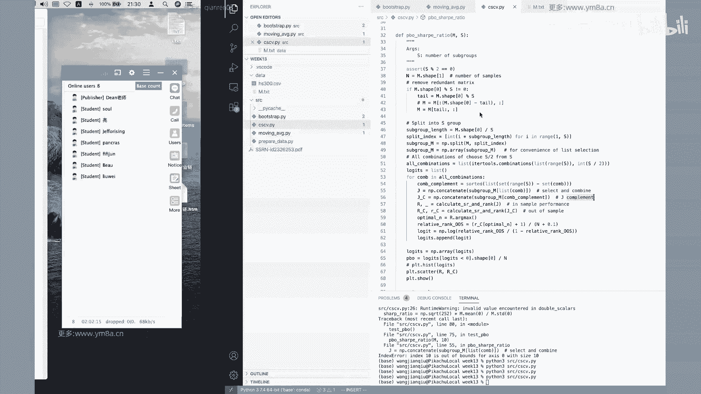

就是用bootstrap方法呃，就是说如何把BOOSTRAP方法应用到策略回测的过渡，你可检测过渡呃，过度拟合的这样一个可能性，然后我先是选了一个一组参数是一和42，然后我来去pro它一下。

就是看一下它的表现。

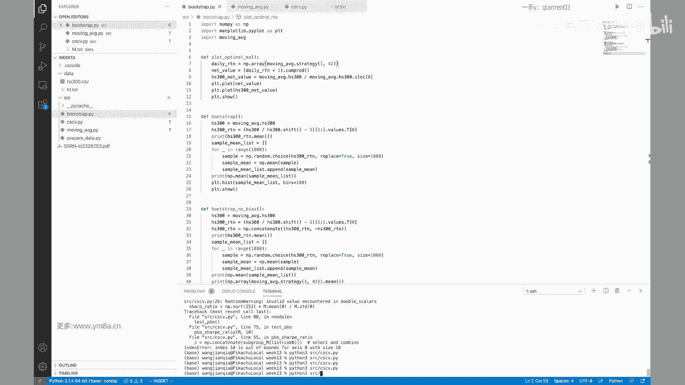

对这个这个是对啊，绿色的是沪深300的指数，然后蓝色的是呃，根据一个简单的这样一个呃测试的策略，就是一天跟42天这样一个参数对，至于这个参数是怎么来的，大家可以试一试，看看文章吧，比这更好的参数。

我提示一下，这个是用的是deficial evolution的这样一种方法，得到了这样一组参数。

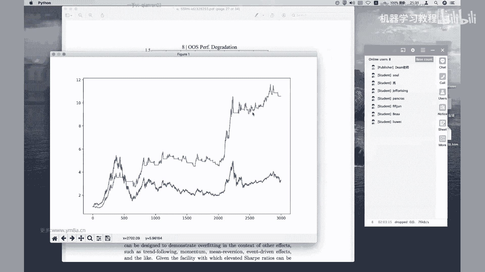

对那些不一定是global最优，就是显然如果是global最优的话，我应该是把我dream的200400。

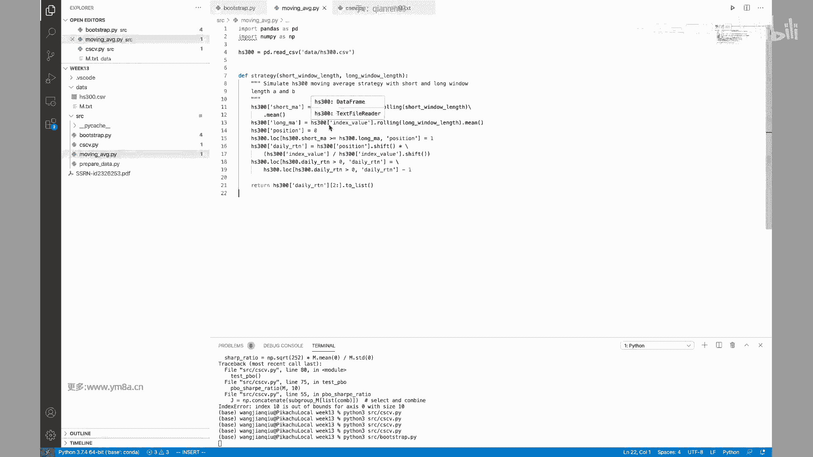

对应该是4万组参数去全部回测一遍，应该能找到比这更好的，但是我觉得这个已经是比较夸张了，说就是说在过去二十十几年内，我只要是遵循一被盗，就是一天跟42天的，就是一均线去cos。

说只要是突破42天均线我就买，然后低于42天均线我就卖，基于这样一种策略，我们可以在过去10年内，大概是得到11倍的这样一个收益，对听起来非常的promise，但是这里面会就是会去看一看。

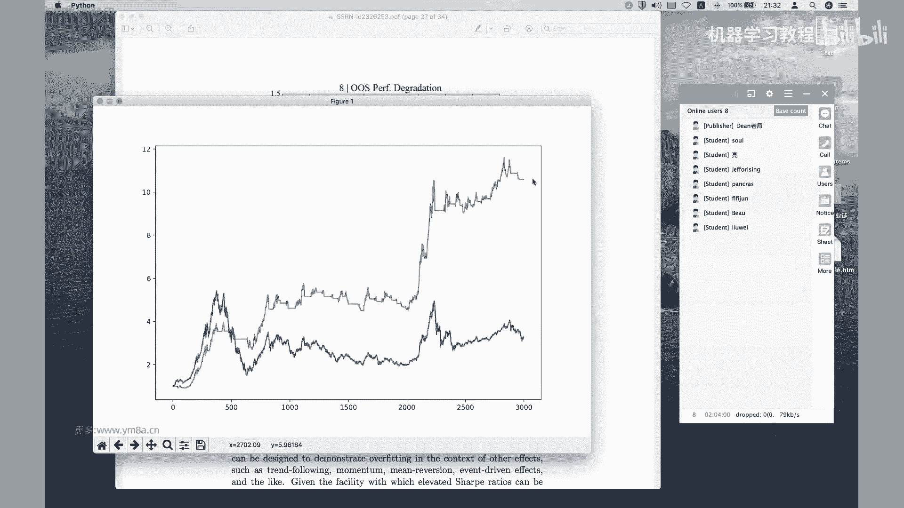

就是说有没有我们去看看是怎么看，这种策略是有没有问题，对呃这显然是有问题的。

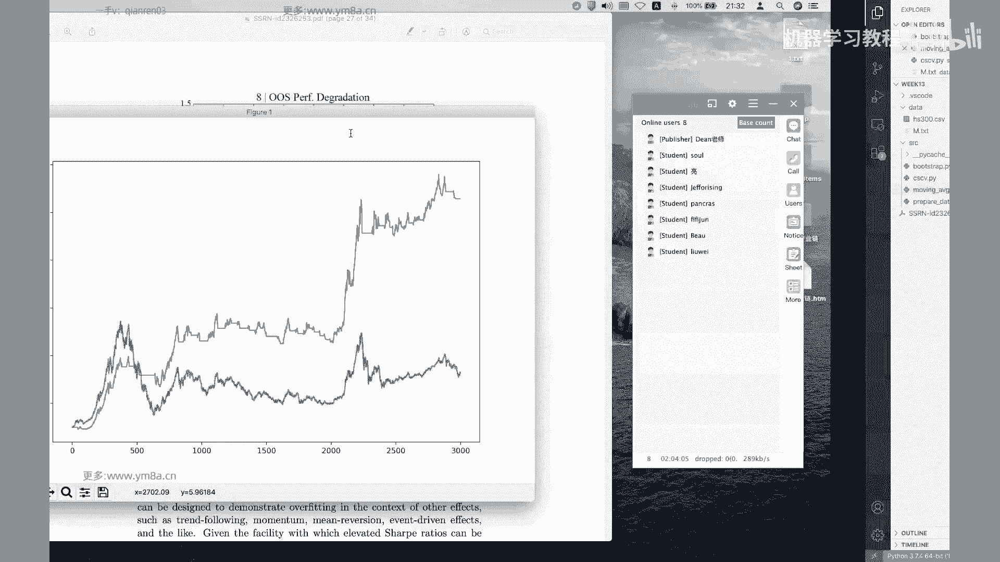

就是对显示不能拿，就是刚刚说就是说这其实会说，就是说别人给到我们这样一组参数，然后给了这样一个策略，那我怎么去判断他这个回测呃，有没有可能是去OVERFITTING呢对吧，然后就是说。

然后再就是说在假设检验的这样一个背景下，就是说BOOSTRAP它做的是什么事情呢，BOOSTRAP是说我是用使用假设检验来验证，检验统计量，比如说我们是呃我们在这边的统计量，我们是定义为回测的平均回呃。

就是平均回报，我们来就是BOOSTRAP是用假设检验来检测，来验证检验统计量是否具有统计学的意义，那么呃历史回测呢，就是说我生成的结果仅仅是代表一个sample，它没有提供有关于样本统计量的这种呃。

就我有不同的样本统计量的差异性，和它采样分布的任何信息，那么这个时候BOOSTRAP我们就可以去发挥作用了，就是说我可以通过多次在历史中，系统的随机重新采样近似，去得到采样分布的形状。

然后由此我们就可以计算检验统计量的，这样PY6P值对吧，然后对，因为我们就说我们生产的是，我们只能得到一个样本的回报，但是我们不知道这个样本，它的distribution就是它的分布是一种。

然后是有什么样的差异，所以OK这就是BOOSTRAP要去做的事情，那么在BOOSTRAP啊，我们看的zero就是它零假设是什么呢，就是说我的这个策略没有任何预测能力，那么你是说我策略的收益分布的期望。

应该是为零或者是更小，更小就是负的了对那么不rap哦，它简约的就是说，我使用的是说是使用原始资产的收益率，收益率的这样一个序列，然后再去替换进行重采样。

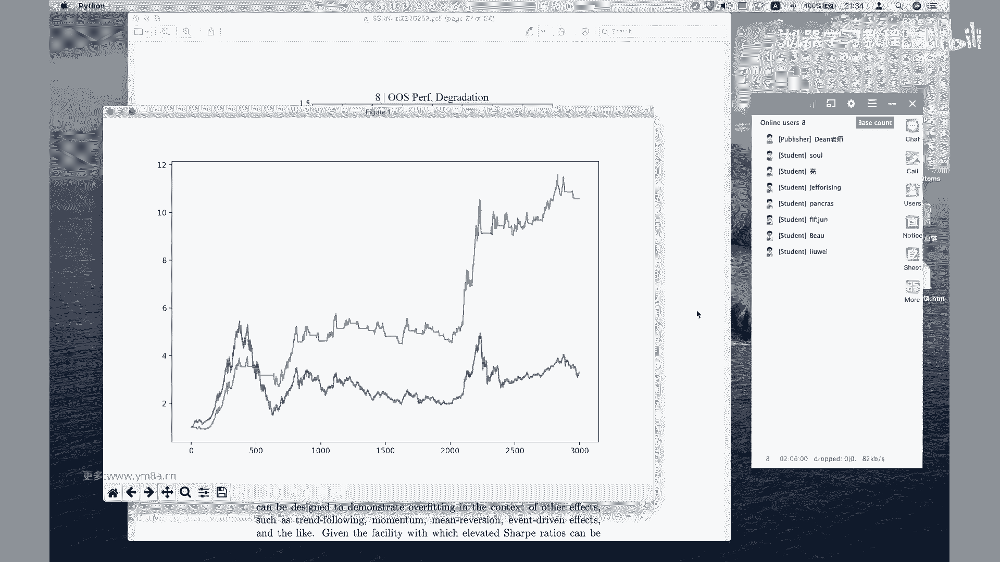

所以我要去进行做了，这样我要做整个BOOSTRAP这样的一个流程，就是说啊我会首先去算呃，去算就是策略收益率的这样一个呃，我会去算策略收益率的这样一个，平均的这样一个呃，每日的收益率对。

那就是MADARETURN，然后我还去算呃，原始资产的价格，就算原始资产的价格的收益率，然后接下来我说我要做的事情是，对原始资产就是沪深300的return，我要去做一个bootstrap采样。

那我去随机选取N个这样的一个收益率，然后我再去计算它的平均值，然后我执行我对于这样一个步骤，我去执行多次，那么就可以生成啊，生成大量的这样一个bootstrap这样一个均值。

然后我把我每一步算出来的这样一个值，我都去保存下来，那么我再去对，那这个时候我就可以去把我整个的这样一个distribution，去给它画出来了，它其实简单的意思就是说呃对。

其实呃BOOSTRAP如果大家有过了解，就是说他就是说我不知道他的，我不知我只有这一次，可就不知道他在分布，但是我可以通过仅从历史当中，就是说我多次去从中，我对于这样的一个收益率序列。

我多次的去随机采样，那么我多次随机采样之后，基于大数订阅，我就可以去得到我这样的收益率的这样一个distribution，所以他其实逻辑还是比较简单的，对呃我看一看boost rap，先看就是。

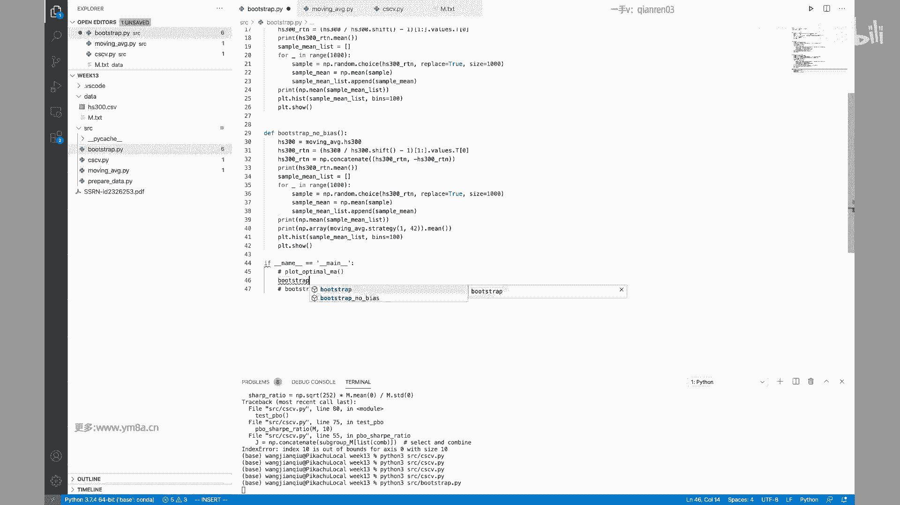

OK那我先把呃对。

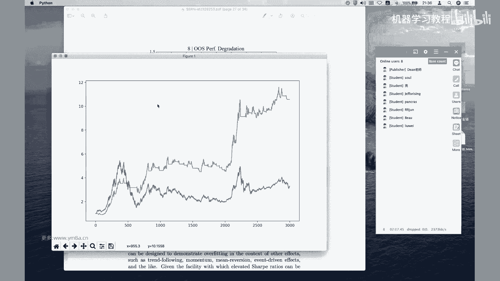

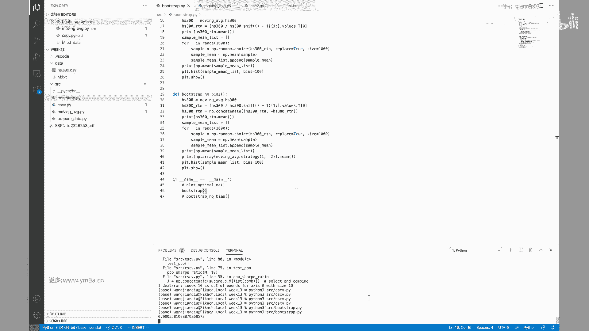

呃这边可以看一下，OK我们我们就是我们会得到了这样一个，就是收益率的这样一个呃。

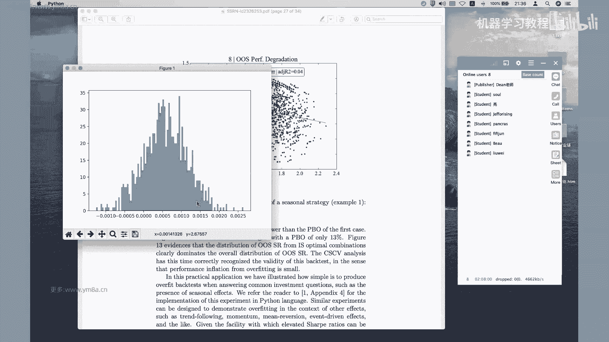

呃DISTRIBUN就是main return这样一个distribution，总共是1000个对吧。

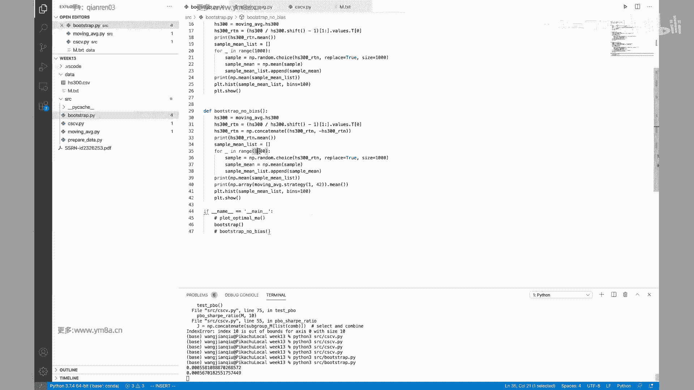

然后然后这时候我们看到就是说呃。

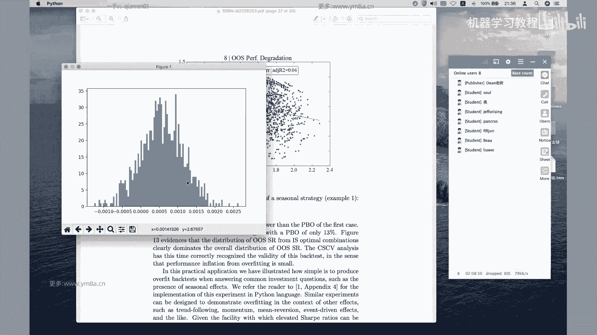

我进行了bootstrap之后，显然我可以看到它的均值是我在哪。

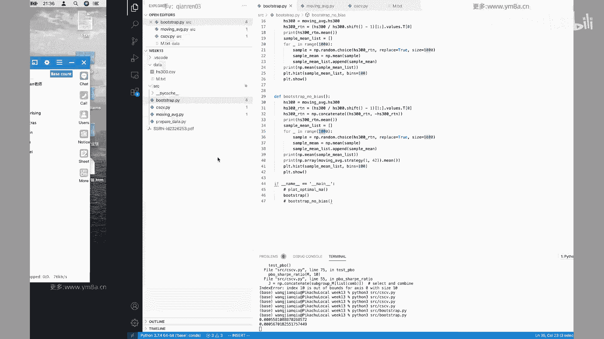

print它的均值是的第一个呃，OK它的均值是0。058，然后我们策略的均值是0。0567，两个数量接近的对吧，那这个时候嗯想说的时候说，这个时候你可能看不出什么，但是嗯有一个问题是说我们的这个里面。

我们得到的是沪深300的这样哦。

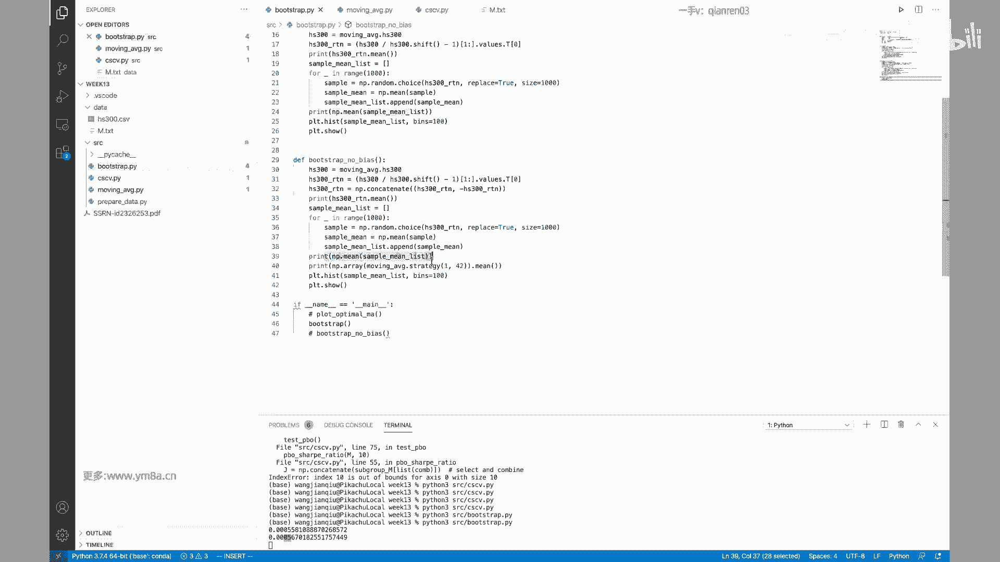

Sorry，在这边我们得到的是沪深300的这样一个，Sample m，就是说也就是说我们在整个这段过程当中，沪深300其实它是8S，它的收益率是它的均值，大概是它的均值是0。0558。

也就说沪深300本身就会是一个，在过去十几年当中，他有一个大于零的这样一个收益率，所以这个里面其实就暗含了一个BIOS。

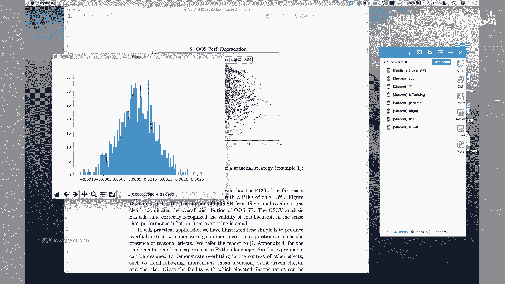

那我这个时候呃我领了，那么我得到了我的sample min，然后我得到了我的呃，我的boss rap之后的这样一个收益率，0。0556的话。

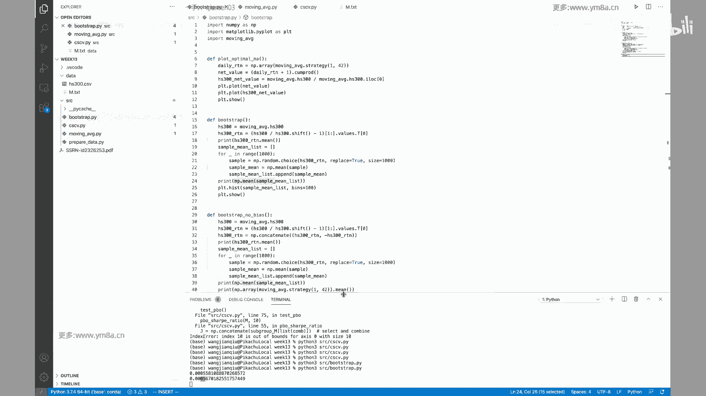

其实放在就近似于近似，于是在我这时候是在零轴的右边，这个其实你看见可能还还好，他没有特别也特别严，特别小的这样一个值，但是嗯所以说我就说我们刚刚提到，说我们这个沪深300的这样一个收益率序列。

实际上是包含了一个long shot bias，因为我整个的呃folio，整个的沪深300在过去过去十几年当中，实际上平均收益率是正的。

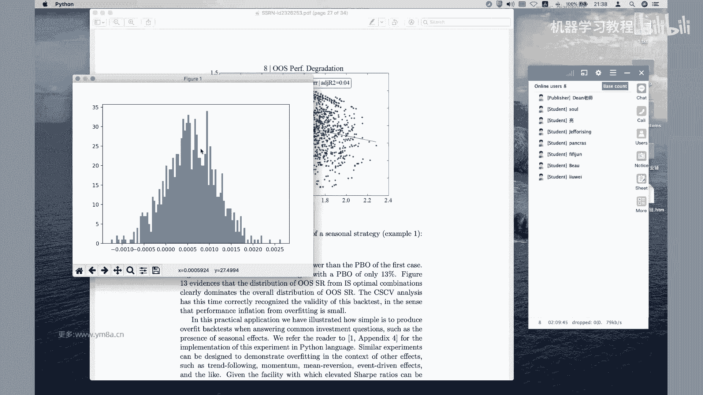

那么为了去排除这样一种可能性，我要做的一个事情是，我把他的嗯收益率我会去加一个呃negative，那这样的话就说我在我整个的收益率系列当中，完全加入了完全为相反数的这样一组序列，这个时候可以去确认它的。

这个时候他这个明显就是零了对吧，因为完全是相反数。

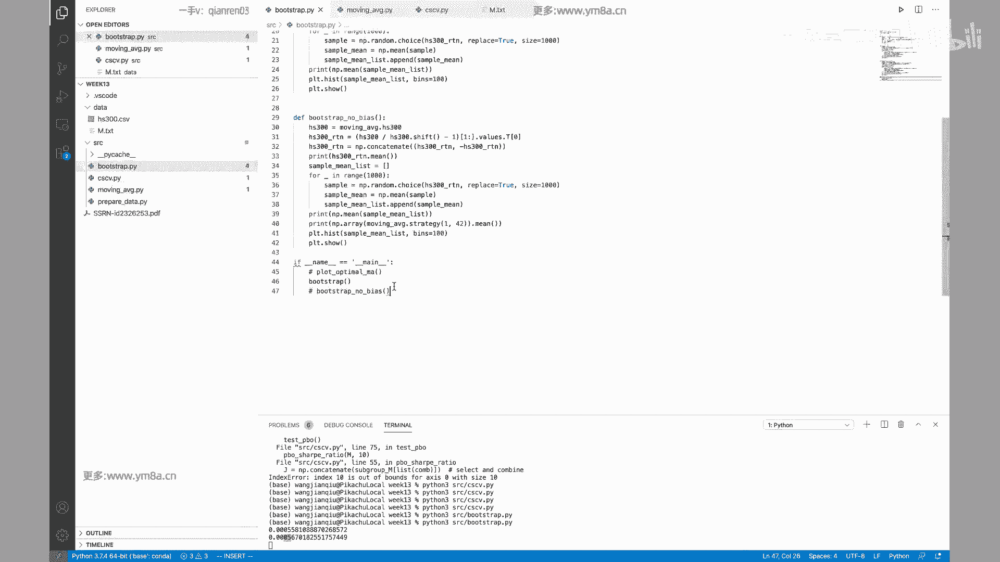

那么我这个时候再去做同样的操作。

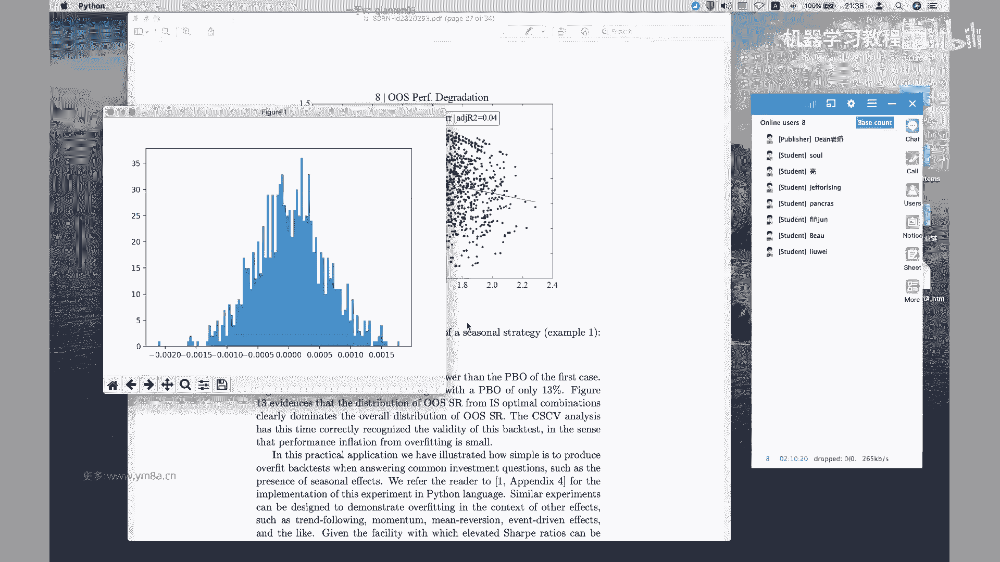

OK然后这个时候我们看到就是说这个值是十，Print，在这边historical呃，沪深300的return的均值是五，就是零啊，对然后这边然后这边还做了一个是啊，这个时候我策略的这样一个均值是0。0。

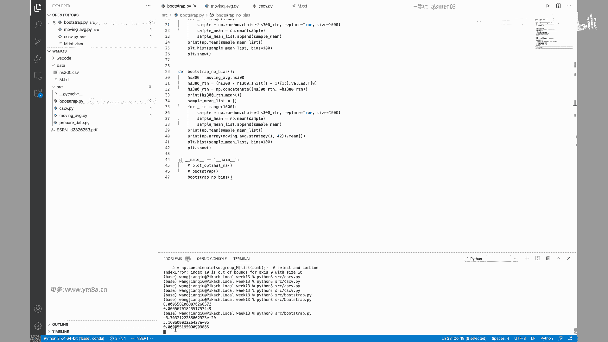

0。0008，0。0008，OK那这个是说明什么意思，也就是说当我策略了这样一个return的均值，是处于这样一个boss rap之后，distribution的这样一个右端，那这个时候就是说。

这暗示着策略有很大的可能是去过拟合，因为我们看的是一个P值对，所以，呃这部分大家都去理解一下，对我们做的是对沪深300的，这样的一个收益率序列进行bootstrap。

然后再去看我们策略收益率的这样一个呃，处于这样一个distribution，就是看我们策略得下来的就是等于return，就是average main return这样一个处于这样一个位置。

应该注意说我们的原假设是说我们的策略啊，我们的原假设是说我们的策略啊，就是没有任何的预测能力，该策略的收益分布期望值是零对吧，但是我们现在测出来说它的期望值不是零，所以我们需要去对。

就是会去有这样的一个呃，我们就是说看到他DISTBUTION，我们会说我们这样一个策略，是有一种过敏的可能性，对事实上我说过这样的一组参数是拿他的呃。

比如说是拿他的就分手evolution的算法去算出来的，所以这本身就是也是符合我们这样一个认知，OK这个这就是说那么我们以后再去做，就是算就是做boss rap，就是去如何去衡量我这样一组参数。

而每一组参数的回测结果，你可以考虑用boost rap的方式来去做。

然后还有一种方法的话是，而是说MONTECARLO置换检验，MONTECARLO置换检验会跟BOOSTRAP会有点像，但是其实是不一样的，因为就是说你说这个时候我们是得到的一个嗯。

我们得到了这样一个回撤的，这样一个收益率序列，但是呢我这个时候要做的事情，不是对我原来的沪深300的收益率序列，去进行boss rap，我接下来要做的事情是我把我当个回测。

得到这样收益率序列去生成多个的随机输出，然后我要去把我单个的收益率的序列去进行嗯，去进行重排，然后跟回测的结果进行比较，来评价它的显显著性，对我还需要再新建一个文件，so所以这边要做的事情就是说是呃。

我们会先漏的，我随机漏的，我就会我会漏的，我会漏的其中一个收益率序列，然后拿它作为example，然后在这边是，要注意说我们这边说注意它的区别是。

我们说boss jb区别是和boss战区别是我们做的不是，不是说对原来原始的收益率序列，而是说对于我策略的这样一个收益率序列进行，so看一下我们得到的应该是，OK然后print这样是对的。

我们得到的是一个收益率序列，然后再把它转折一下吧，这样好没有区别，就是一个，得到这样一个收益率序列之后呃，其实就是他是怎么说呢，就是说我们在玩，我知道我要排，我要排序的是什么呢。

就是说就是我在原始的这样一个，收益率序列的时候，我会对应说啊，我们的position，比如说是long，然后那么就是说如果我策略仓位是long的话。

然后我的markeator market return就是沪深300，这样收益率，如果沪深300收益率是0。6%，那么我们这时候我们策略的回报，也就是0。6%。

那如果说是我们是NO position的话，即使说market return是0。6%，但是我们的策略回报就是0%，因为这个时候我们没有持仓，然后我们记，然后我们就根据这样的就是一个是策略仓位。

就是一个position，然后还有一个就是说是market这样一个return，有这两个东西，我们是可以计算出我们策略的daily ator对吧，也就得到了我们所生成的我们策略的每日汇报。

然后我们就可以计算下平均收益，那么mt color permutation，他做的事情是什么呢，我是重新随机匹配市场回报和策略仓位，是什么意思呢，说我之前我我可以说，就比如说我假定我策略的仓位不变。

就是说我仍然是比如说long shot，Long shot，我仍然是保持这样的序列，但是我的市场回报变了，就是说我比如说原来第一天是0。6，第二天0。5，那我可可能变成第一天是0。5，第二天是0。6。

但我对应的long和sharp是没有变的，就是蒙特卡罗的置换，他做的是重新匹配我们的JMKET，return和策略的这样一个仓位，然后我们就可以根据，那那我知道就是说如果说这个呃。

如果说我们assume是position没有变，但是我们的策略就是我们我们的return变了，market return变了，那么是不是就可以得到一组新的david return，这样一个序列。

然后然后再去说呃，我我这样我那我用mt color之后，我就可以产生大量的这样一种随机的输出，那我们来看看怎么去做，可，但是我这样去做的话，我还需要的是position的仓位呃。

OK因为零我们也是经确定了的，但是我还需要知道的是呃，C等于零的话，C等于零，我需要知道的是，Seed that we learn，Short window length，OK哦不如这样子。

我们直接把你就拿之前的一和42去做一个，还是拿前面这样一个例子好了，shot window x等于一，long window bh等于42，然后我再去and strategy。

Import moving average，然后moving average，Strategy，The short and long，我返回的是它的收益率的序列对吧。

注意我们要做的事情是把我的daily return的，给重排，OK我再加一个吧，我还是希望得到，因为我遇到他的position对吧，我还是把我原石，我还把原始序列给出，这样可能好一点。

Daily return her dear frame，OK这样子的话，这样子的话就有了它的position，对我就有了它的position，这样我才可以这样。

我才可以接下来对它进行的做permutation，All right，所以MARKO就是说我要去计算特特定参数下，策略回测的P值，那么首先要做的事情就是说是呃，针对N组这样参与的参数的这样一个策略回测。

收集我的策略仓位，跟市场回报的这样一个时间序列，然后我要去将市场回市场回报的时间序列，与策略仓位当中的呃，每一个我进行随机配对，然后我就得到新的每日策略回报的时间序列，对吧。

so ok所以但这里还有个问题，我们需要的是，so我写一下自己，不然搞得有点乱，是一个是我们在整个的process是第一步是，所以其实我在做mart color的时候，我这是一组参数。

实际上对N组参数都要去收集收集它的，return return和position，然后接下来要做的事情是随机配对，因为随机配对本质上来说，我把我的return跟我的position。

就是说我不是前面有测了1000组吗，我把这两组，我把这1000组进行随机配对的时候，就会生成新的这样一个嗯，生生成新的这样一个时间回报序列，但这个你要注意的是说，我要对每一个策略参数组。

每一个参数组使用相同的，就是就是说我不能说我第一列，比如说是第152天，跟172天进行调换，然后第二列就变成153，跟173天不行，如果我第一列队，152天跟172天兑换的话，那么我在第二列。

我也同样的是需要进行相同的操作，我这样做的目的是，我要保持我整个1000组策略回测的参数当中，我哦我我保保留每个参数组都具有相似的，就具有相似的这样一个潜在的这样一个结构。

所以这边就是生成一个permutation，生成随机的presentation，就注意是相同对，然后然后我得到了新的这样一个呃，得到了新的就是PERMITATION。

之后我要去计算main daily return，但要注意MADARETURN肯定会失去变化的，为什么会去变化呢，大家不是说为什么我不是说简单的把呃，仅仅说是把我的就是return，是就是去换了个。

说是换了个位置吗，为什么会去变化，大家注意的是，问题是我不是说我不是说是对我的收益率，收益率的这样一个序列期去进行变化，我刚刚说我们变化的是呃，在strategy是这一部分，就是是原始兽。

也是沪深300的，它的收益率序列去进行变化哦，仍然是相同的位置，我仍然就我信号仍然是long和long和short都没有变，但是由于我underlying，就是我沪深300的收益率序列变化。

那么我原原来是浪的地方，地方可能现在是零，那么我原来是原来是零的地方，现在可能是有一个long position，那么嗯但是我long position对应的david return，事实上已经变化了。

因为被我重新排了，所以这个时候我们可以说我们的strategy，它的daily return以及它的main turn一定是会发生变化的，所以我这个时候需要去计算我的每一组计算。

U for angroup，我每一组都要去计算这个值对吧，都要去计算MADILOR，然后嗯第四步要做的事情是repeat step two and three，Two and three。

那这个事情是哦，我记下名字，然后然后然后我还记得是呃，我要去选择keep，Largest waiter，就是MIRITOR，我要把最大的这一组，我不是安卓，得到了我得到了N组的DARETURN。

我要把最大力组给K下来，保留这个数据，然后我要去把我二和三去重复，以上这样一个步骤，那么我得到repeat2和三之后会得到什么，我会得到的就是说我重复很多次。

我会得到很多次的这样一个最佳的这样一个return，然后然后这个时候我就会，然后你去，Get，然后这样就得到的是什么，是optimal strategy distribution，Ah repeat。

注意这边跟我们前面bootstrap bootstrap的区别在于，我们这边做的方式是啊，我们是对沪深300的这样一个daily return去进行重排，但是我们重排完之后，我们仍然要去算的是。

我们重排完的沪深300day turn，我会得到我新的啊，新的策略的这样一个daily return的序列，然后我再去得到它值，而在我们bootstrap这边做的事情。

是只是说是我不我sample完之后我再回去呃，bootstrap这边做的事情是我sample完之后，我做的不是说是算我现在的，不是我现在我策略的收益率的均值，我做的事情是原始资产收益率净值。

并且我在BOOSTRAP过程当中，我做的不是说是全部重排，我做的是bootstrap采样，我随机选取的pick是一一千个里面的收益，我选取的是1000个收益率，而我不是我做的事情，不是说把我的怎么不是。

我不是把我这么多，2900个收益率进行交换顺序，我选BOOSTRAP，它的意思是，我只从这一列当中选取了一部分样本，然后不断的去选，通过这部分样本去进行。

去构造出我的这样一个收益率的distribution，的这样一个状态，虽然我们去选的都是沪深300的，这样一个收益率，但是我对于沪深，一个是沪深300收益率重排，一个是沪深三百三三百。

比如说我三三千个里面每次选100，每次选100，那我重复了这1000次之后，我把这1000次的100进行distribution，进行distribution，这个是BOOSTRAP。

但是我在专门color做的事情是，我是把沪深300收益去重排，是全重排对，所以这个要注意这个区别对。

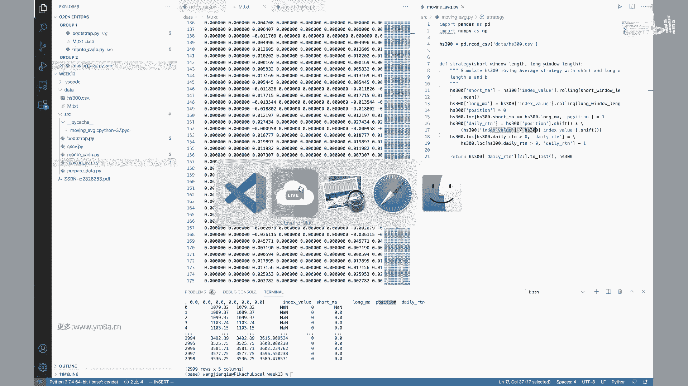

然后对这两个概念不是特别理解的同学，可以去就是去哦去查一下，就是一个是boot rap，一个是monte color，我觉得这两个方法还是就是是。

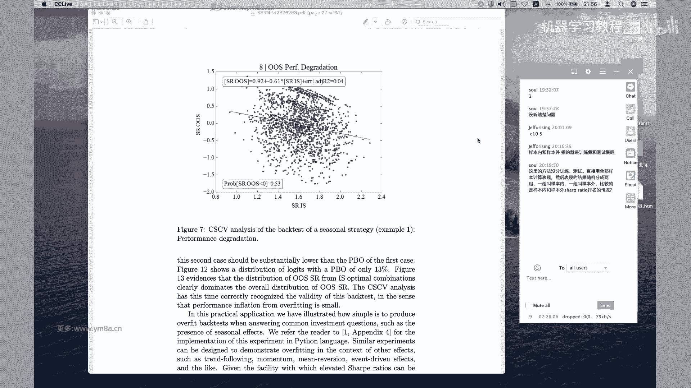

就是在金融过程当中算是比较重要的，就BOOSTRAP，可能接触机器学习的同学应该比较熟悉一点，让我们CARO的话对我看了，其实不管是在金融工程啊，还是在期权定价，还是是在就是啊物理。

物理物理学上面就是做simulation，做simulation的时候都是会应用到比较多的场景，然后尤其是对就是对一个比较奇怪的积分，可能有时候还会用mod color去算，所以我觉得就掌握这样的方法。

还是比较有必要的，那么我们再回到MOCO上面来说，我们注意说这个时候是在强调一遍，他说的是嗯，是把我之前的沪深300的收益率去进行，去permutation，但是我要注意我PERMUTATE一次完之后。

我要把1000组都要去重算，是同一个permutation算1000组对，然后然后这个时候我可以生成多个permutation，那这个时候MONICCOLO算的时候就是比较耗算力。

所以我会不断的去就我可能会在20万次，100万次都有可能对我算完之后，我再去得到得到了，我这样的就是说得到我这儿，比如说10万次distribution，对得到了100万次的。

就是他的best这样一个return之后再去看他的distribution，OK所以这个就是一个mod color这样一个过程，然后的话呃，那这个时候就是呃嗯然后我要去把我呃。

就是optimal的这样的一个策略的去嗯，把optimal这样的一个策略，这样的一个值给记下来，然后呃然后再去到最后的时候，如果那我得到一个plot这样一个图像，就是说是比如说我是算了我呃。

比如说我是去算了mart color，算了1万次，每一次我都得到了RESAMPLE，就全部去重排之后，我得到了一个呃best这样一个嗯，就是得到了一个best，就是best return。

然后把这个return加到我的这样一个，我把这个这样一个largest marron track给记下来，然后这个时候我得到了我会得到这样一个distribution，得到distribution之后。

我要做的事情是去比较我的呃，去啊去把我的，就是把我原生的原来的这样一个return，是去去跟我的这样得到的best程序比较，看它是处在整个分布，每一段和前面一样的道理。

当我处在整个distribution的右端的时候，我们认为它是有比较大的概率是呃过度拟合，然然这时候我不知道大家有没有想想，如果你想一个问题的时候，我们在做BOOSTRAP的时候。

是有一个我们考虑到了long shot bias，所以我们在整个BOOSTRAP过程当中，我们需要加一个沪深300的这样一个收益率学，但是为什么我们在蒙特卡罗的时候，没有去做这样的事情呢。

这原因是在于说我们我们比较的benchmark是什么，我们比较的benchmark是其他，就是在比如说100万次测试过程当中的嗯，策略的最佳的return。

我策略本身就是有long shot BIOS的，所以我的benchmark有呃，Long shot bios，我得到的我想要去比较的这样一个策略的RITA，也是有BIOS的，所以其实这个时候两两句抵消。

其实我就不care了，对，因为我们比较的对象是其他参数组的，这样一个收益，OK所以这部分我是想呃，就是想把这部分是留给大家去作业去测试一下，对理论来说，你应该会得到一个就是呃非常像前面的。

但是还是会不一样，因为我们这时候的，首先我们的就是他的嗯，每一个ban的就是每一个每一个histogram，我画了这样一个直方图，每一个ban的它的值应该是比较高的，因为我们蒙特卡罗会测很多次对吧。

要注意啊，对我不知道大家有没有给大家讲，我也没给大家讲清楚，就是蒙特卡罗就是置换检验，他做的是一个什么样的事情，对，嗯我不知道我给大家讲清楚了没有。

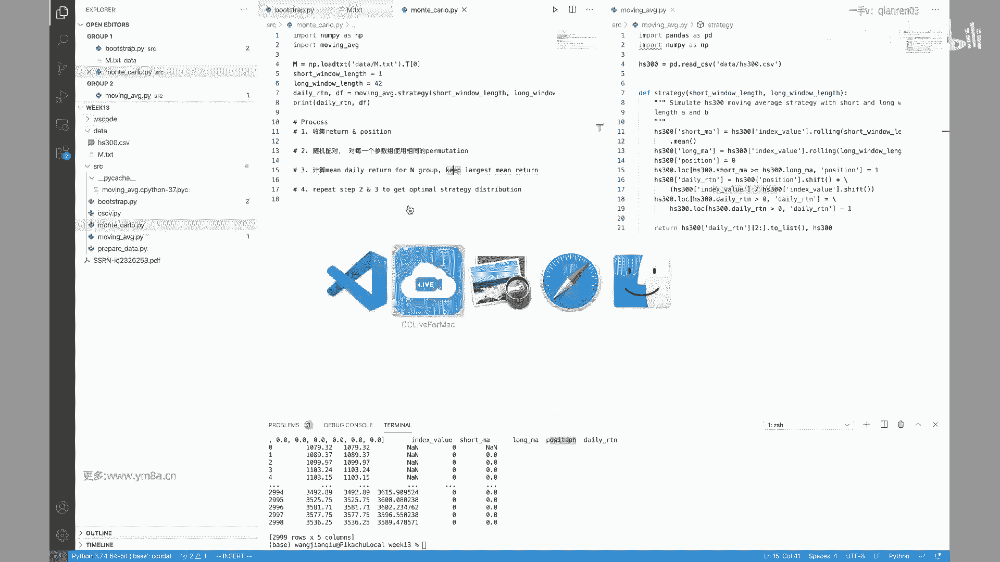

大家有什么问题吗。

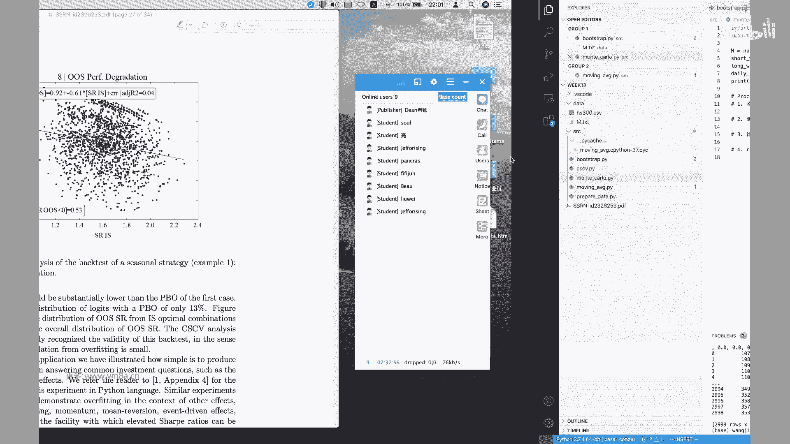

就是他其实相对来说就是他没有那么多，就是你理解一下，就仔细去理解一下整个过程啊，就是说啊就是我已经回测完了，就先做一个事情，是我们还是一样的回撤，我不是得到回撤这么多，完了。

然后我要做的事情仅仅是把沪深300的，就是我回测完了之后，你可以理解为就是什么叫position，就是说我信号已经记录下来了，什么时候多，什么时候空，我已经先记录下来了，这个是没有变的。

就是每一组参数是都记记下来了，但但我要做的事情是我在多空的时候，我每天的收益率可能不一样，就是我的我的我的沪深300收益率不一样，原来我这边是多，然后之前实际的沪深300，比如说是呃XA。

就是说比如说他这边可能，原来原来第二天是4020年八九对吧，我的第一天买了，但是但是我经过重排之后，可能把四零这边可能它会变成3。96对，可能只涨了一点点，原来我涨了很多，可能只涨了一点点。

但是注意我这边信号是没有变的，我这边是价格序列没有关系，因为我们就映射下来是一个，就是你最终还是会把它转化成一个，收益率的序列对，OK就它我就是说我重新去匹配，我对应的仓位的时候，对应的市场的回报。

仅仅是蒙特卡罗做的是这样一个事情，然后我就可以得到新的策略的这样一个DAIOR，对然后对，所以他整个过程就是这样对我去随机匹配，随机匹配新的市场的，就这么CURY的这样一个序列，然后我要去。

然后第三步要做的事情就是我要去呃去算，就是我不是我不是有N组吗，有capital n组，因为我有1000组，然后每一组都会去使用相同的PMT去计算回报，然后选择这个回报作为。

然后我选择其中就是那个就是MRT，是作为最佳值对，那就是你最大的名return，作为我整个这样一个这样一次蒙特卡洛，一次simulation当中的这样一个代表采样的，采样的这样一个值对。

然后就是我每一次都是算permutation完之后，每一组的strategy，哪一组strategy是最优的，那么很显然就是说根据我不同，每次permutation之后，不同的permutation。

我计算的计算到最优的这样一列，那可能是会去发生变动的对吧，这是这也是很正常的一个因素，因为假设说比如某一个strategy，Strategy，比如说是因为我是main return。

比如说比如说正好是在市场上涨的那几天，他是做多仓了，那么我permit permit就是把它去嗯，重排之后，那么很有可能分配到他这一天的呃，沪深300的return可能是负的，那在这个时候。

那他可能就会去亏钱，所以导致它整个的策略的呃MIRT就会变了，注意我们这边跟最刚开始啊，就是CSCV里面做的不一样的，是我们这边用的CSV用的是sharp IO，但是我们在mont cover里面考虑。

我们考虑的是main return是收益率的，也就是被return的平均值，OK然后重复以上步骤，就是可以得到就是最佳策略的这样一个，抽样的一个分布，因为你要知道，就是说嗯。

如果我们把三两千九百九十天的数据去进行，权重排，就全排列，那这个值是非常庞大的，所以我们不可能是穷尽所有的选择，我们能做的事情只是一个就是说是simulation，我们认为就是在基于大数定律啊。

对我们呃sim就是模拟的，差不多是1万次，100万次，然后我会得到这样一个收益率的分布，那这个时候如果说呃，我们还如果说就是说我们这边的return u，这个时候我们要看的就是我们的return。

在我经过了这1万次的蒙特卡罗模拟之后，他在这样的一个状态下，它是处于怎么样一个分布，如果说它仍然是处于最右端的话，那其实这个时候你就要去怀疑了，就说嗯我在历史上，经过交易日的这么多次随机的重排。

我得到的这样一个策概率，而得到这样一个策略，仍然它的它的收益率，仍然是相对来说是比较右端，那这个时候你就有可能去怀疑这是一个经过呃，经过嗯，就是经过我OVERFIT之后得到的一个结果。

对那注意说这个为什么这么说，他会有可能是OVERFIT呢，因为就是说呃我蒙特卡罗，但我做的事情说我策略没有变，对不对，但这个时候我经历了，就是说我变的是什么，我变的是市场的行情。

就是说我把我市场的行情经过历史的重拍，然后把他们的distribution给画下来，就是说零来说，相当于说我这个策略很有可能要做的事情，说是我对于历史上各种各样的行情，都我得到的最优的策略。

是可能经过历史上各种各样的行情的，过过分的拟合和优化，然后它才能survive其他这么多策略，才活到了今天，那显然这样的面试相对来说是会有一些的，这里面是暗含了一些。

就是我们的OVERFIT的可能在里面的，因为正常的策略来说，你不太可呃，如果说我只用到一部分行情，我没有说引入未来数据，没有说起过分的拟合的话，我的策略可能说是到目前为止对历史说是嗯。

就是说对于大部分历史可能是有效，但是对于对于一部分一部分数据，说是可能在一部分行情下是不可能去赚钱，一部分行情小部分行情可能不会赚钱，但是我现在这样子这样模拟下来说，我对于历史所有的行情都赚钱。

那这个时候是会暗含有一些问题的，对这这这里面其实有一个三分，说是因为我们历史相当于说我们A股，比如说就十几年的数据，那我想要去去构造这样一个策略，其实我把握历史每一段行情都考虑到。

那我是有可能去做出来这样一个策略，做出来一个就拟合过非常完美的这样的策略，然后我在蒙特卡罗，我要做的事情说，我相当于说我基于现有的这样一个历史的，收益率的分布，我去进行重排。

相当于说我去人工构造出了一个，相对来说更加大的这样一个更加长的一个，历史的这样一个行情，然后基于这样复杂的一个历史的行情，我的策略仍然是成功的survive了，打败了99%的历史上。

就是历史这些最优的策略，那么就要有理由去怀疑，我这个策略是不是已经就是不是过分离合了，所以它是这样这样一个意思，OK然后我不知道就是我给大家讲明白了没有。

然后这个MONTECARLO这部分我觉得是留给大家做作业，然后下节课我也会把答案，就是让我写的跟大家去对比一下对，然后其实这节课主要就是讲的是呃，我觉得是比较重要的一个部分。

就是说我们是怎么样去处理策略，开发过程当中的，就是防止去过分离合，因为哦我觉得尤其是作为新手，刚开始做的时候，可能经常是无意识当中，就陷入了这样一个过拟合的这样一种可能呃，因为我自己也做过。

就是那首先就是看一般来说刚开始写，所以看到一条直线往上那99%点，后面加五个酒吧，一般是自己过拟合了，就是或者是用到未来数据，应该说大部分情况下都是使用到未来数据，对啊，这个是提醒大家去注意的对啊。

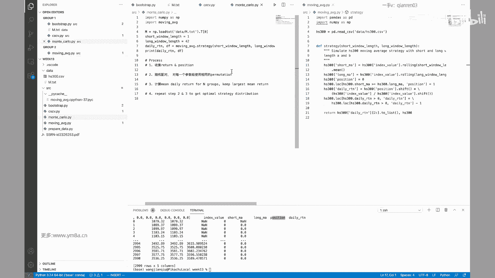

我尤其是刚开始就开发策略的时候，就是曲线呃。

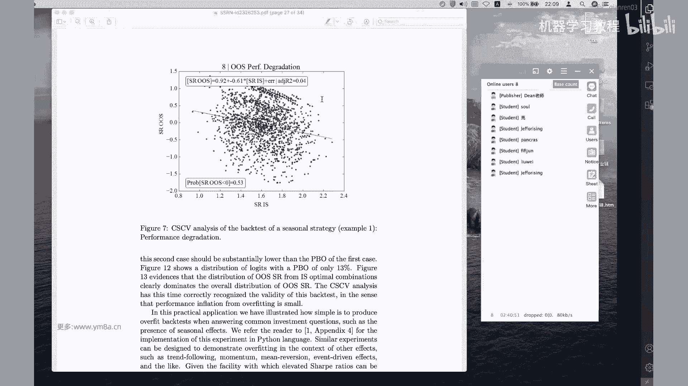

这跌跌停停，然后嗯就有上有下，我觉得反而是一种比较健康的状态，对就是我我个人还觉得就是有一点，就是说嗯就是在研究研究数据，看做看历史数据，然后想idea去做回测的时候，往往可能要想清楚一个事情。

是说我这个策略赚的是什么样的钱，对，或者是或者说考虑清楚，我这个策略在什么样的情况下赚钱，在什么样的情况下可能去亏钱，那么自己才有可能去开发出一定的，就是相对比较有价值的策略，而不是单纯的依靠。

就是data mining，对，Can get money，就是应该讲这个也是应对说我们前面讲了一些，就是挖因子，还是说遗传算法去啊去自动去挖因子，然后导致这样一个策略呃，去生去生成这样策略。

那么这个框架可能就是这几种方式，可能去帮助大家去避免，就是说我生成的生成的策略，有没有存在过拟合的这样一种情况，对，但事实上有机构是会在过去一年当中，会出现一些问题，就是对就是不管是用自动基于机器学习。

暴力挖掘的方法去挖因子，然后可能导致策略出现比较大的回撤，现在这个里面嗯，就就是说可能是说大家测试的时候，可能要尽可能严谨一些对，当然当然无论如何，就是归根结底，即使我把这些所有的方法都想到了。

那还是会有就是多多多多少少我们基于策略，就是做策略的时候会有一些过，会有一些离合，因为本质上我们仍旧在基于历史的行情去学习，对，所以只能说是尽可能避免吧，尤其说是就是做策略做的越多之后。

你会发现多多少少自己做的策略，跟之前自己做的策略都会有一定的相关性，因为可能就是跳脱不出，不能跳脱，跳脱不出，就是相同的思考方式或者是思维的框架，那这也是说为什么我还蛮鼓励大家，就是做策略的时候。

可能多多去借鉴不同方向的论文或者paper，然后去多多接触别人的想法，然后有可能去跳脱出自己的思维限制，对OK好。

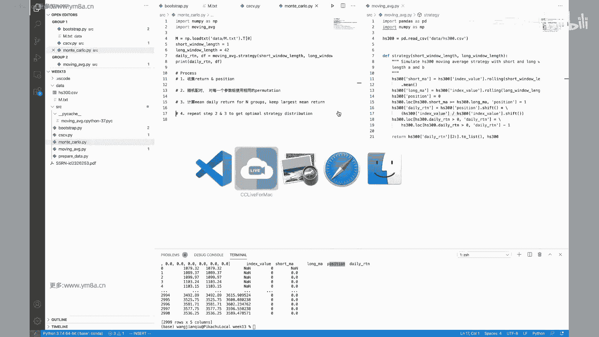

今天我想讲的内容就这么多，然后大家还有什么问题吗。

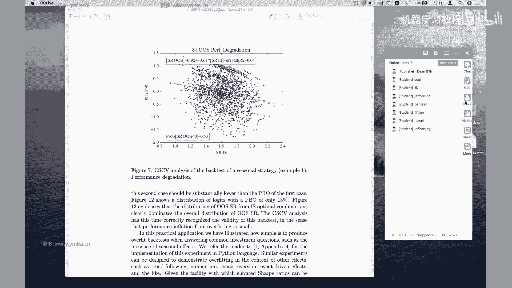

对啊就是再多讲一点，就是说呃我不知道之前前几天有没有讲过，就是当然并不是说是我们在做回测的过程当中，就不要去做优化策略嗯，对比如说优化策略是肯定是要去做的，但是呃呃优化策略就是千万不要去滥用。

你滥用的话，那可能就是过拟合对，但是事实就是说你再去优化策略的时候，你可能需要采取一定的strategy去做的对，就是就是首先我觉得就是说刚刚有同学问他说，是不是说就以后我测试策略就不要分。

样本类跟样本来不也还是要去分的，所以我们在SC无论如何，就是在最终上线之前，即使即使说我把我现在所有的拿到，历史数据都去回测了，我还是强烈建议在上线之前先做一段时间，模拟盘，相当于去做你的样本外测试。

但事实上在策略开发过程当中，还是要去留20%到30的数据，作为样本外的测试对，然后呃我个人其实比较建议，就是说你还是说先有想法再去去把它写成因子，写成交易策略，而不是说是去靠data mining。

对data mining可能第二种方式，data mining种方式容易造成过拟合，然后我们还觉得我觉得是从观察到的现象，或者是个人的想法去处罚，然后去建立策略去验证，然后策略完你建立完想法去验证。

你肯定可以得到初步的这样一个，back test的这样一个结果，然后接下来要做的事情就是这样，你要去去优化策略，对嗯嗯然后就是其实说过拟合拟合认是什么，就不是说是你完整的拟合了整个历史的行情。

而是说你可能拟合的过分过分，去拟合的这样一个噪声，因为本身呃金融市场就是一个低性价比，Low signal to noise ratio，这样一个这样一个这样一个环境，为什么它是呃低信噪比的。

并且它一定会是持续的，是低信噪比，低信噪比，因为整个市场就是一旦是信噪比高了起来，去暗示着市场有什么事情会发生，那么不仅仅是你是其他的所有市场参与者，都会去套利，把这直到把这个信号给打平。

或者打到你没有收益的这样一个，低的这样一个程度，所以一般来说就是收益都是短暂的，就是信号都是短暂的，即使是偶尔的spike有巅峰，那么一定会马上被套利者给发现，所以就是说就是说你在优化交易策略过程当中。

是要注意说你我们要做的事情是优化策略，而不是去优化策略，去拟合我们的噪声，嗯嗯对嗯，所以，就说优化的时候，你可以说是说我们比如说是像同一个模型，我用不同的参数来回测对，但这个时候呃。

呃其实就是说有时候就是说在回撤的时候，不一定说是我一定是保留样本类表现最佳的，这样一组参数，在样本来就是最佳，你还要去实际上事实上还是要去考虑，就是参数的问，就是参数的稳定性。

就是说当我把这个参数稍微的小小的调一，点范围的时候，我整个测试的表现，都应该是不太会去发生太大的变化的，就有点类似于一个hit map，假设我们的就是strategy。

是一个呃有两个参数X和Y或者A和B对，然后我们对应的performance separation还是什么东西，我们把它作为它的这样一个值，然后你可以画出一个二维的这样一个hit map。

那么你相对来说我比较理想的这样一个情形，是你的hit map有一个比较明显的一个热闹，或者一块是属于说是K这一块的范围，就是说我参数在这个范围之内都是比较稳定，我的sharp都比较高。

但这个时候其实相对来说会比较理想对嗯，然后还有一个，其实我们要做的就是在做完优化策略之后，我们就一个叫step forward annis，叫推进分析，其实这个还是蛮常见的一种方法。

就是我们在确定交易策略优化参数的时候，就说比如说我们拿第一年15年的数据，测试了一个strategy，那么接下来有了一个新的新的，比如说又来新的一个月，那么就是从2015年2月到2016年1月。

这样一个时候我们去滚动的窗口进行优化，对这样的时候就是说我始终呃，比如说我有两年的数据，但是我可以一个月一个月去滚动优化对，而不是说一下子把两个02年的数据，都拿来去做样本类。

那这种方式呢其实我个人是比较推荐，然后我们事实上也是这样去做的，然后至于在实拍的时候，我们也也是按照这样的方式，我只是始终是用，就是我加到最新的这样一个数据，然后去滚动去这样去优化对。

然后事实上我每次周期的变动，我在滚动优化的时候，每个周期的变动也是可以去得到啊，嗯就是你也可以得到我这个整个策略表现的，这样的一个时间序列，就是说在这个周期你可能可以在下个周期不。

OK那你可以去不断去track它呃，然后这种方式市场也是可以去评估一个策略的，生命周期理论来说，对于一个阿尔法来说，从他的发现到上生产，然后到decay，你应该是能够随着发现，随着他时间的变化。

阿尔法阿尔法的预测能力在不断减小，对那么嗯对，就是如果说就是说我们在测试研发过程当中，遵循就是从idea，然后到实现implement，然后再去优化，然后再去做推进分析，我觉得这个过程可能会比较OK。

然后至于到实盘的时候，嗯可能就是说我觉得把前面的做好了，其实实盘可能就会相对来说会压力小一点，然后即使说嗯偶尔的亏损，或者说不符合自己的表现，那么如果我经过前面的严格的测试和分析。

我也有比较大的信心去坚持我的策略，而不是说把我的策略给停掉啊，然后人工的去去改变我的策略，去随机的操作对，然后对，然后在这个过程当中的时候，从实盘的时候，我们还要从实盘得到结果去返回去。

看看我的回测是不是做的准确，这一步其实是比较重要的，尤其是偏日内和偏向高频的时候，就是你要去评估一下你实盘策略得到的结果，跟你回测结果是不是一致，对我们之前在机构做的时候，就是每天呃交易完之后。

会把相同的策略再放到回收系统里再走一遍，看看下单的仓位，成交的价格是不是接近一致对，Ok，然后我觉得，只有把整个以上的过程都去做完之后，然后并且注意到我们今天提到的几个，可能会出现的bias。

Survivor bias，然后long shot bias，然后使用未来函数，然后使用滤波的一些问题，我觉得可能然后这样，这样整个一个策略的开发才会选。

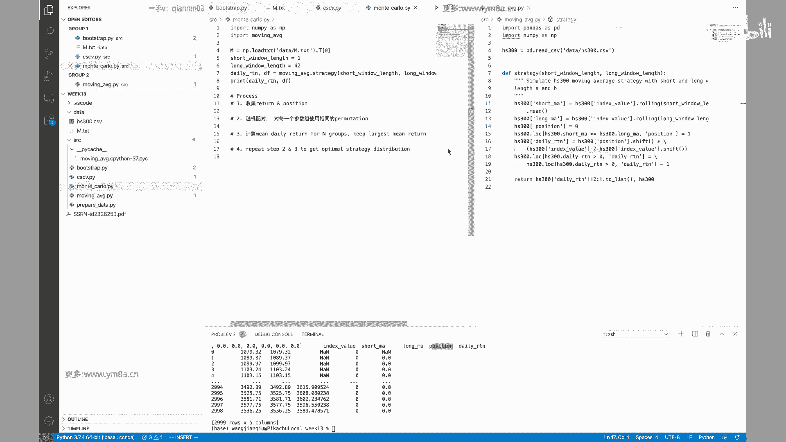

相对来说会比较完整，OK那今天我想要讲的内容就这么多了，同学们还有什么问题吗，嗯然后再说一下下节课的话，其实想讲的是，在之前有在17年的时候，其实我测试过就是第一个在线资产组合，选择的这样一个交易策略。

对下节课想给大家去去做一下这样一个事情，对，就是其实他是一篇paper，就是moving average reversion for online folio selection。

就是这个时候他不是偏向我们之前的CTA，或者是呃或者是股票多因子，但是我们做的事情是就是嗯就是我把我移动平，移动平均回归这样一个简单的这样一个。

就是我们做的是moving average reversion，这样一个策略应用在我们的这样一个online，就是一个folio selection，对下节课主要会去给大家讲这样一个策略，然后啊对。

这个是我是在17年的时候去测了一下这个paper，其实应该我不知道这paper是什么时候对，但是对17年测的时候，觉得效果还是就是没有想象中那么好，但是觉得还是挺有意思的一个方式，对。

OK然后我们会把它用在A股，然后我们会拿一些行业的指数来去测试，OK那如果没有什么问题的话，我们今天课程就到这。

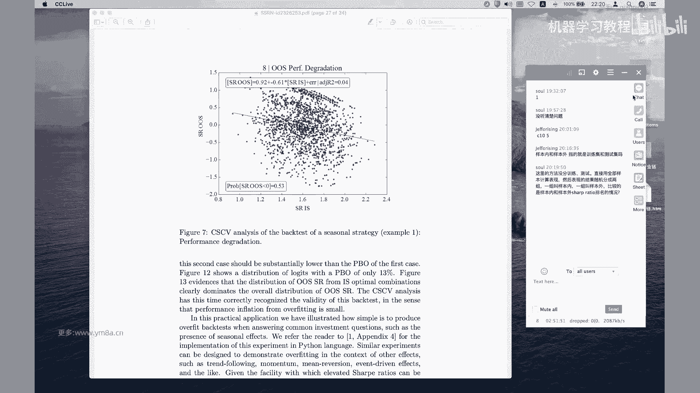

OK然后这次的作业就是呃就看吧，我觉得首先是这个框架是比较重要的，大家去最好是把paper然后跟代码自己去理解一遍，然后去实现一下，然后看一下结果怎么样，呃然后还有一个就是呃他原来这个PBO的话。

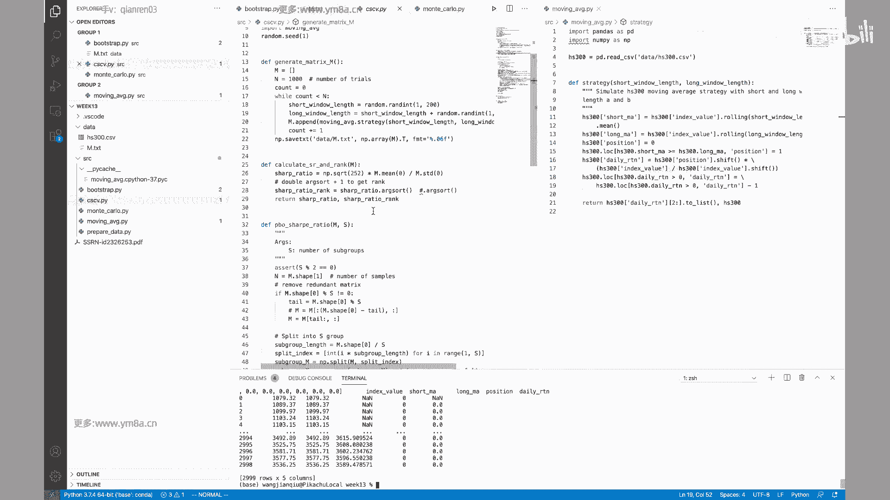

我看到就是开源的人去实现，我没有去采用，然后还是自己去写了一遍。

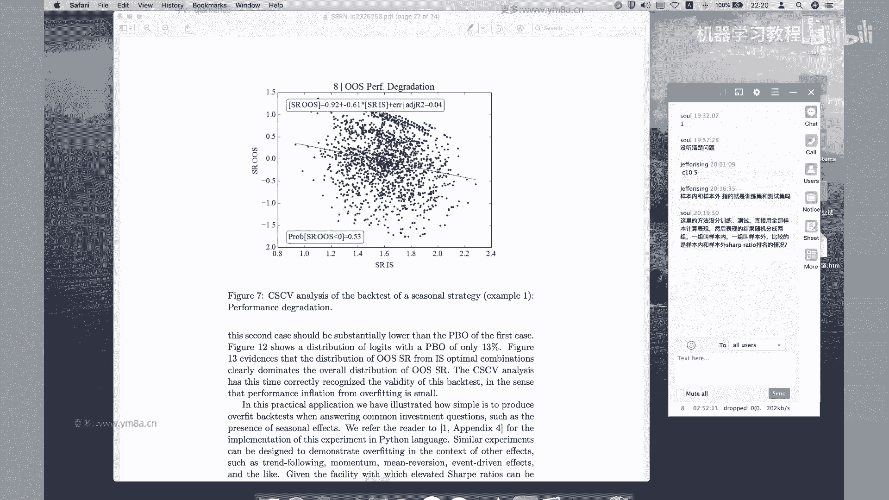

然后嗯PBO。

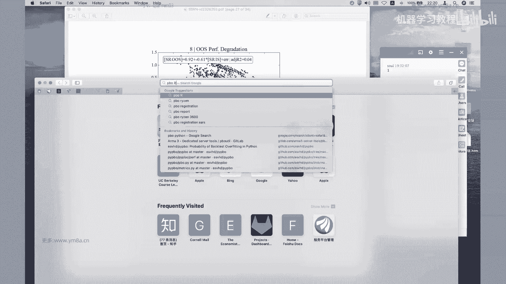

然后我知道有R对应该有RR的package，就是如果用r program的话，可以去做，然后嗯p BO package in Python对吧，这也有人去做这个可以去，你可以去参照一下。

Probability，Back test over fitting，呃PYPPO，对大家可以看一下CSV，然后对他这边就会做的考虑会比较完整一点，然后你自己去，如果是作为一个prototype的话。

可能有时候不一定这么复杂，对嗯对，对他这边写的还就还挺复杂的，可能第一次看的话看的有点，我觉得应该基本上差不多，你看看他rank对吧，然后二个max就跟我们还是应该是差不多的对，然后看CIN。

嗯我觉得大家可以去看一看别人的实现，然后自己再去理解一下，我觉得可能会比较好一点对，所以其实就是呃游戏之后，就是说现在这节课可能我们都会基于一些paper，然后再去实现一些策略。

然后如果对于相关的背景不熟悉的话，那当然最好如果不是特别熟悉，其实我觉得大家进入到现在，应该也有一定的能力，就是嗯去看paper，然后去实现策略啊，事实上就是在工作当中也会有比较多的内容。

会出于就是说有一些idea，然后可能你的leader，老板也不是特别清楚怎么去做的话，那可能需要你是去int的这样一个原型，去看看别人的paper里面先做一下，看看是不是应用到你的市场环境，是不是。

Ok，然后对去复习一下这个paper能不能得到这个结果，然后再去改进，这事上工作当中也是会比较常见的，对就是说做框的可能不一定要像读PHD一样，需要你去呃去提出原创的。

就是去原创的去提出一个崭新的理论框架，然后去对，但是要做的事情是，希望你能就是非常快的up，业界已经有的成熟的研究，对或者是学术业有研究，但因为矿就是一个比较典型的情况，是可能是业界。

有时候走的会比学术界会快一点啊，对有些是比较好的音质，可能大家应该不会去发paper，可能都会先去交易，如果真的是已经确认他已经DK了，没有用了，可能才会去把它分享出来。

对所以就是呃一个是SSR上面的网站，还有2K上面都会有一些就是发量上engineering the paper，其实大家是可以定期的去follow的，然后看多了之后。

可能就会知道它里面很多东西讲的是什么故事，然后很多东西讲的是只是对哪篇paper，稍微改进一下，但是往往是这些改进里面，可能就会给你带来新的因子的一些想法，所以我觉得这个价值是在这个里面嗯好的。

那如果没有什么问题的话，那我们今天课程就到这里啦。

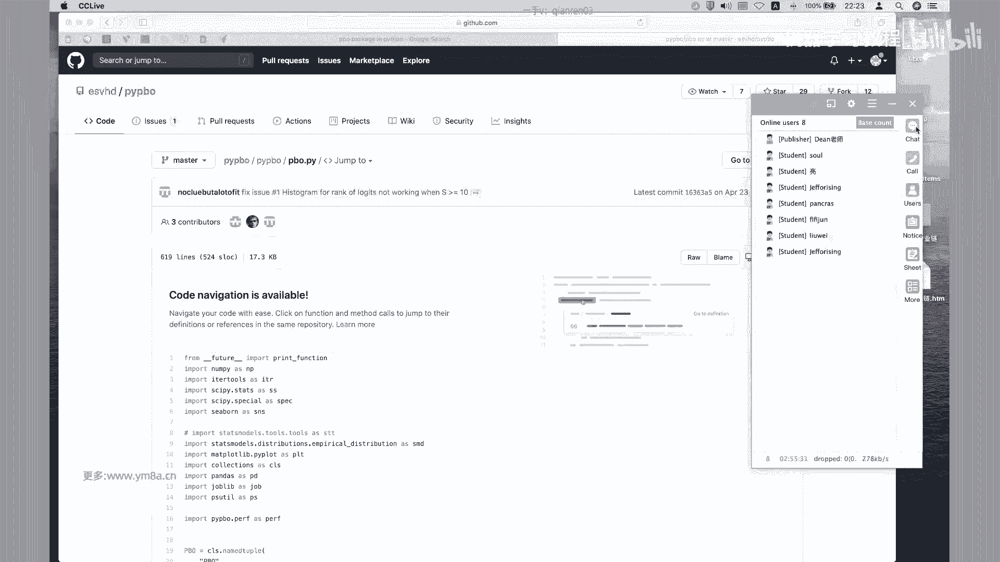

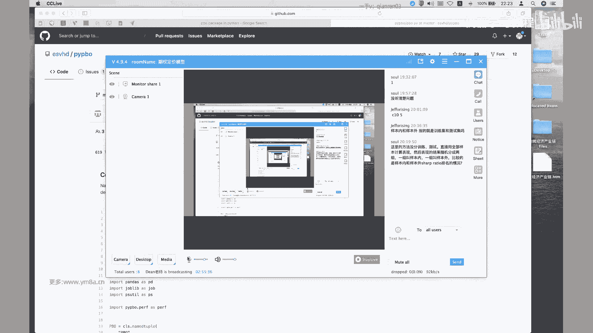