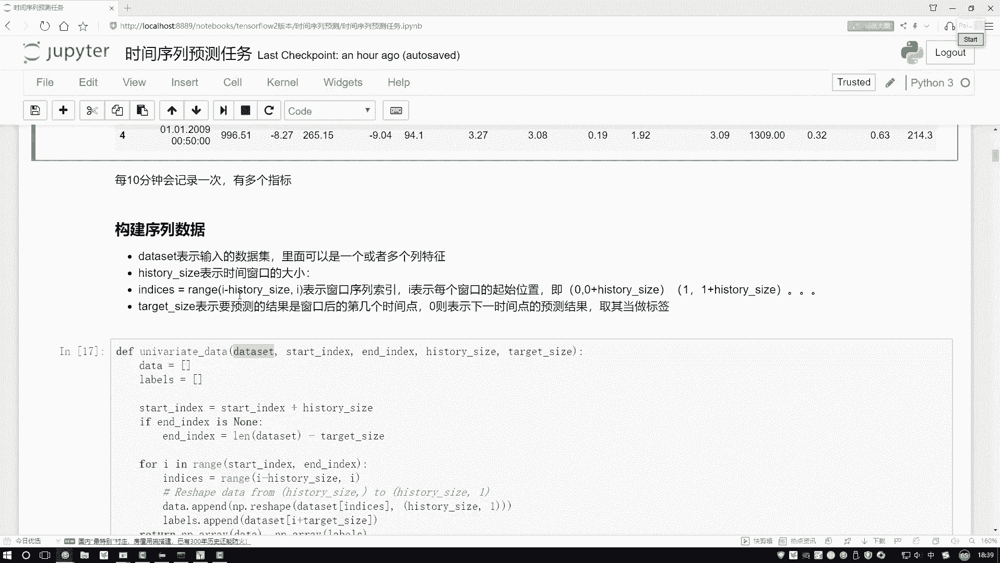
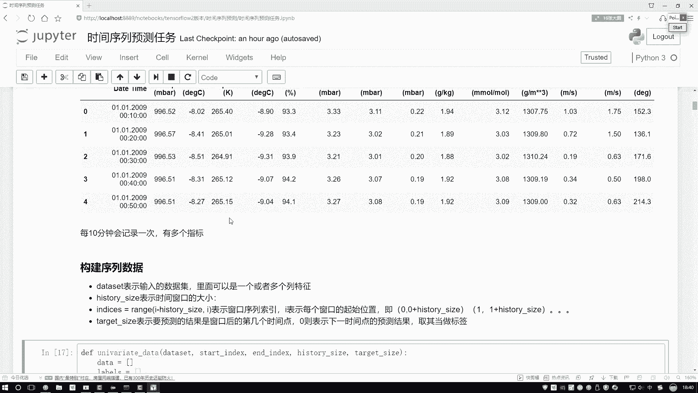
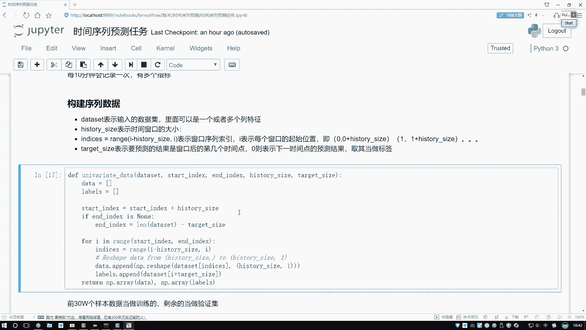
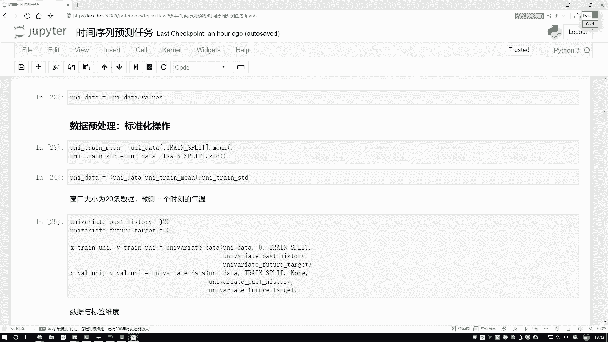
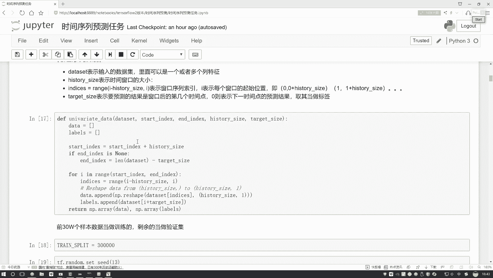
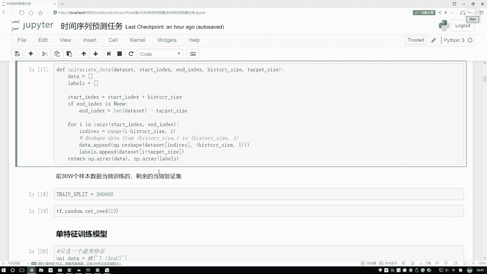
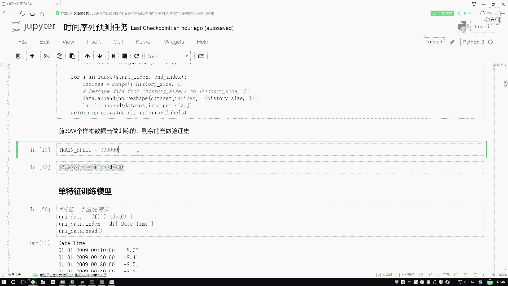
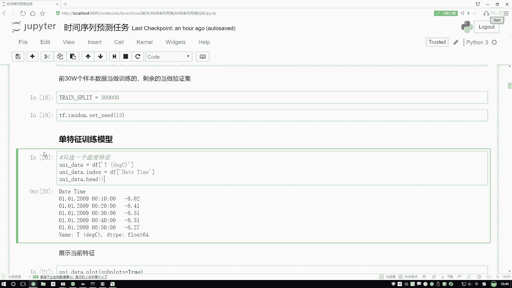
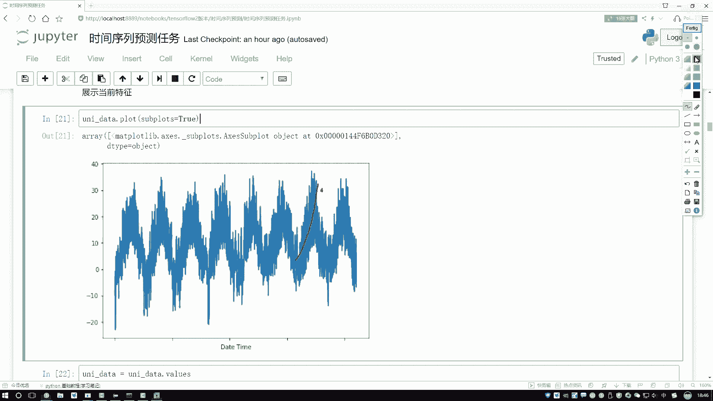
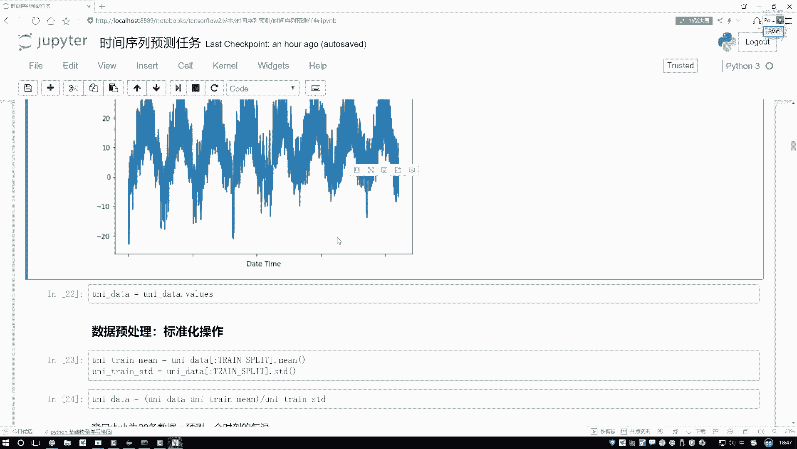

# 吹爆！这绝对2025年讲的最好的Python金融分析与量化交易实战教程！从金融时间序列分析到因子选股实战，全程干货讲解，零基础小白可学！（人工智能丨机器学习） - P58：02-2-构建时间序列数据 - 迪哥的深度学习课堂 - BV1YFcbe8E8X

接下来啊，来看一下咱们实际啊数据处理的一个流程，第一步啊，咱们还是先把我们的CSV数据啊给读进来啊。

刚才看过了，咱们实际有个数据指标，然后这里呢哎我们看一下第一个函数。

第一个函数当中啊，它就是我刚才说的，我们首先得先把数据构建成一种序列的格式，X和Y起码得配对的，并且X是序列，Y是未来的一个时间上呃，它的一个结果值，哎咱们做这样一件事啊，然后先给大家解释一下呃。

一会儿啊咱们会用到的几个输入的参数，这几个参数我先给大家解释解释啊，第一个叫data set，就是一会儿啊。

咱不是有这么多个特征吗，那你说哎咱们这个你要构建实验窗口当中啊。

用哪些个特征DESET表示着实际输入的特征呃。

一会咱们会给大家对比一下实验啊，就是我只用一个特征或用多个特征哎，咱可以多做一遍。

Data set，就是我们实际的一个数据集，然后呢start索引，start索引，这样就是咱这个数据集啊，它其中比如说呃是这么大的，然后里边可能有这么10万个数据吧，然后呢你需要去选哦，当前从哪个开始。

那一般三二索引你说为几啊，一般就为零是吧，它为零的意思，比如说在零这块，我说一开始从这儿去去去那个取序列哎，这个意思，然后呢这个history size，他的意思表示的是咱窗口的一个大小。

比如说我说这里我设置个20是20的意思，它就会从你SA索引开始哎，找这么20个好了，他们几个先当做什么，他们几个先当做我的一个X1，然后下一个值这就对应一个Y1，这个是一个窗口大小。

然后呢接下来设置一个呃index索引，这个index索引啊，它实际表示的就是窗口的一个序列了啊，因为就是呃我们要取这样一个窗口数据，你需要把这个窗口当中啊，每一个样本它的索引都告诉我吧，这是1234。

2。2，然后到九，比如取十取这么哎到十吧，比如说取十个，你是不是把它的索引都告诉我啊，这个index啊，它的意思就是说呃你在这个序列当中啊，取了哪些个索引，哎，咱得把这个所有索引全部拿到手。

然后呢再下一个呃，再下一个就是我们的一个呃target target，意思就是咱那个标签标签意思啊，就是说呃现在比如说你取了十个样本，构建一个序列，那你想预测的哎是第几个呀，是比如说第11个呢。

还是第12个呢，还是接下来的11~15这样一个片段呢，如果说它为一个值，那表示着哎咱就取下一个时间点就得了，如果说它为一个序列，那咱就预测接下来一系列的一个序列指标，这就行了，这个就是咱们的一个标签了。

也是我们要预测的一个结果行，先给大家解释了一下。

就是呃咱们这个函数当中啊，会涉及到的几个参数，然后呢再来看一下这个函数啊，构建的方法，一开始的时候我说我指定一个star索引，star索引，这样就是它这里啊，一会儿我们会做这样一件事。

我们实际啊指定的索引它是什么，从什么，它是从一个I开始，I呢是start索引。

他的意思啊，就是说呃比如说你的一个star索引吧，咱们来看一下面一下。

下面我设置了一下这个参数啊，咱可以来看一下，在这里，比如说我说呃设置一个SSTART索引是零。

再来看比如这里当前的一个结果值。

这是一个零，然后呢比如说我设置一个区域大小，它是20，那这一块它就是一个0+20是吧，所以说啊这一块会进行一个更新啊，star索引是从C开始的，是从20开始的，它的意思啊。

因为我们下面要构建一个range，range的意思，就是你这个I它是从SARA索引的开始的，我为了使得最后一个变成这个20，所以说啊在这里咱注意啊，这个引带索引它的写法稍微有点不同啊。

它是一个I值减去你的缓存序列，相当于啊是从这儿开始的，比如说啊这个SR索引诶，它是等于一个20的，然后呢我说我这个缓存序列，或者说我时间序列它也是20的，它这块是不是一个AI，相当于从12索引开始吧。

那是不是一个20-20，就又相当于从零开始了呀，所以说啊，到时候大家如果说你看这个代码，也觉得挺奇怪的，它这块其实主要就做一件事，为了使得咱这个range设置的更方便一些。

所以啊咱们看这块多了一个减法的操作，实际上如果大家自己在执行过程当中，也可以打印，结果，这里是我打印出来的这个range操作过程当中啊，第一步，第一步就是一开始的时候，它是一个02~02。

加上一个缓存序列，那就是从0~20是吧，好啦，第二个是多少，从1~21，那下一个呢就从2~22呗，这个就是咱当前实际执行过程当中啊，我拿到的一个索引的一个结果好了，拿到索引之后，这里还做了一件事。

拿到索引，那你说我取完索引，它只是像是一个一串的数吧，但是我需要的不是一串数，而是一个数据是吧，所以说这里啊给他做一个RESHARP操作，把它转换成哎一列一列，实际上可以说啊就是转换成一列。

实际当中呢可以输入的一个数据吧，啊一个二维的数据，然后接下来呢一个标签儿，标签制作方法也是一样的，在这标签当中啊，你看这个DATASET当中这个II是什么，I就是说你从哪儿开始的吧，好了，I加上什么呀。

I加上当前的一个，我们的一个就是预要预测的一个位置，一会儿呢这些参数啊都需要我们自己来指定，你希望去预测未来，就是间隔几个时间片段得到结果，你可以间隔五个，也可以间隔十个，也可以去取一个序列。

这个就是我们现在啊怎么样去构建一个X，还有一个Y的这个写法，稍微绕了一点，大家就知道这点就行了，就index它是从零二开始，然后零到这个20，然后一到二十一二到22哎，就做了这样一件事，非常简单。

我们就可以完成取X还有取Y的一个数据的。

下一个下一个就是呃，咱们这里就是做了一个训练集，还有一个验证集，训练集当中啊，这块由于咱们数据量比较多啊，训练集咱取这么前30万个样本的数据，然后呢测试集而不是验证集。

我们就取剩下所有样本数据就可以了，指定好一个随机种子，一会呢咱会取数据，我们的第一个做法就是，先选择其中的某一个指标来进行预测，哎咱这第一个指标选择比较直接，只选一个温度指标，你看这里在这个电脑当中啊。

我只选择了一个温度，基于温度要去预测一下，接下来啊咱们的一个呃十，就是接下来它的一个温度的结果值等于多少。

咱先选择一个特征来去做这样一件事，那下面呢我说我画个图吧。

展示一下我当年的特征，展示当前特征主要大家让大家看一下，就是呃实际这个指标到底跟时间有没有关系，大家可以发现一件事啊，就是随着时间的变化，这些指标浮动的差异衰还比较明显的。

所以说啊这是很明显的一个时间序列问题，一会儿呢咱们就要预测啊，比如说给了一个序列，这是给个序列，你预测下一个序列结果值，那下预测一个序列呢，预测序列拿蓝色画吧。

就是在预测接下来的一个走势诶。

