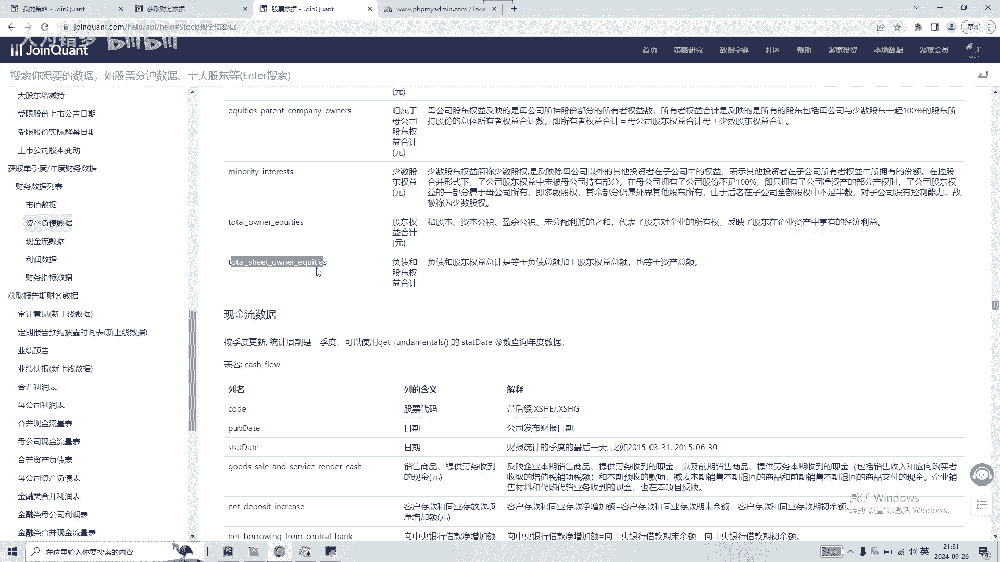
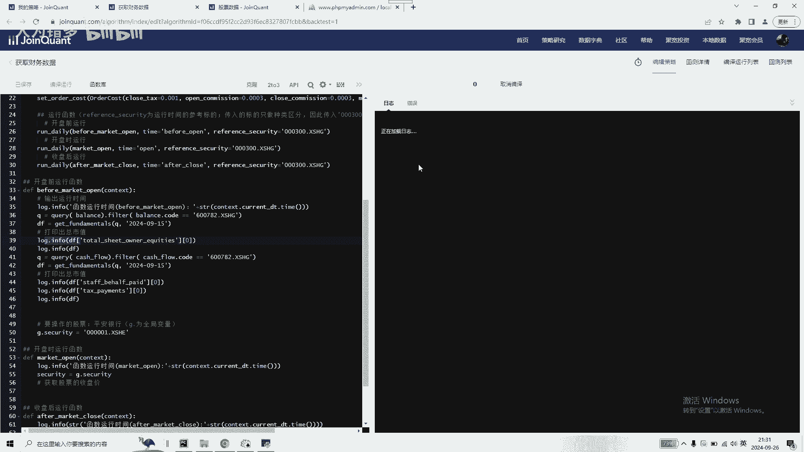
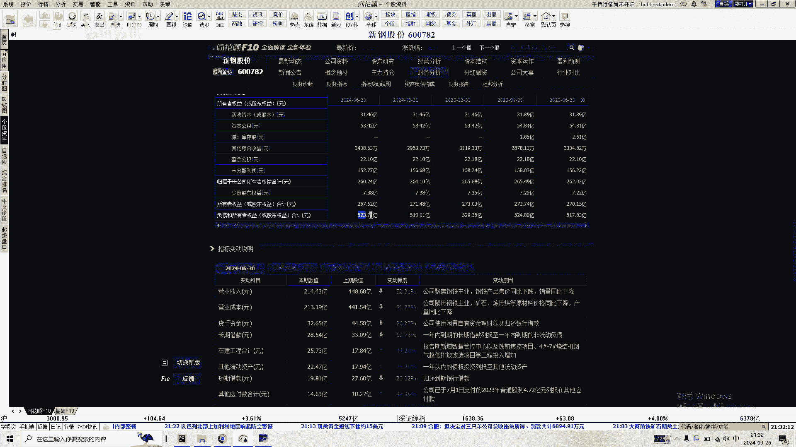
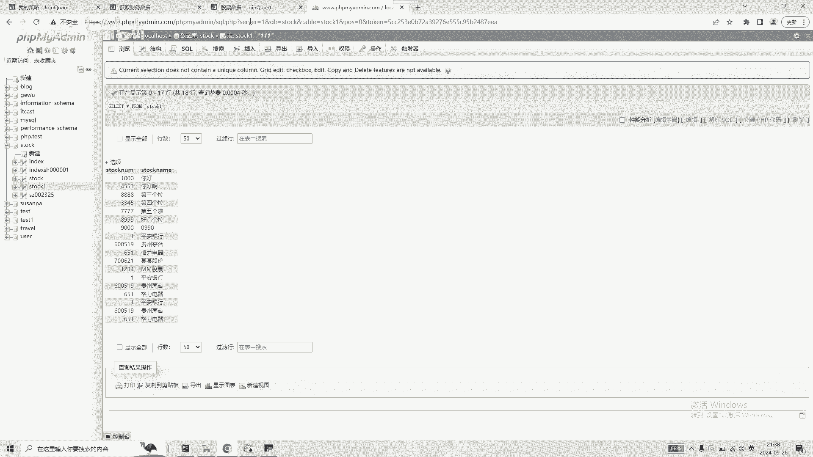

# 人工智能大语言模型执行量化分析的基础教程分享 - P1 - 人为错多 - BV1Qkx7etEYC

大家非常抱歉呃，好长时间没有更新了，嗯也是比较忙嗯没有及时更新，大家见谅，今天抽了点时间，想着把最近嗯，把最近自己就是说嗯学习到的一点呃心得吧，给大家分享一下啊，主要是啊想要分享一些。

就是对于我们嗯对某一只股票，想要获取他财务报表方面的数据，如何去获取这些数据，嗯能获取哪些数据，然后我们如何去获取这些数据之后，通过什么样的方式去获取，然后通过什么样的方式去存储成，我们自己的数据。

然后我们再对这些数据进行分析，嗯这里呢我们还是使用的是这个，距宽量化分析平台，我们目前就是说啊介绍啊，针对于财务数据使用量呃，巨宽量化交易平台是如何能获取这些财务数据，当然我也就是就是说介绍。

就是呃一些嗯皮毛的知识点嗯，抛砖引玉吧，大家感兴趣的可以啊深入的去学习和研究，嗯然后呢第二个点呢就是想给大家分享一下，我们嗯当前在我们的电脑上进行啊，这些数据查询的一些查询到的这些数据的存储。

我们能够通过什么样的方式方法，把这些数据存储到批量的存，储到我们自己的数据库里面，这样的话我们就可以啊可以进行嗯，有了数据之后，我们就可以进行嗯嗯全方位的进行分析，至于怎么分析。

就是说大家可以多学习一些数据分析的，这方面的呃知识和技巧来进行分析吧，然后我在这里分享的都是最基础的，基础数据是怎么获取，获取完之后我们怎么存储，然后这都是嗯这都是非常基础的事情。

嗯嗯大家现在现在看到的这个屏幕呢，就是这个是距宽的量化分析的一个操作的，主要的界面吧，嗯然后嗯一些基础的知识，我在这里就不再做过多的介绍了，前面有录制的一些视频，其中也有一些，这个是知识的介绍。

大家可以去看一下，在这里呢就是说呃我们只是讲将一些关键的，这个是嗯关键的点给大家分享一下，就是说呃针对于嗯一只股票的财务报表，数据巨宽给我们提供了哪些数据，我们可以获取哪些数据，如何去获取这些数据啊。

我们可以到这个是距宽的这个数据字典里面，进行这个财务数据的查询，财务财务数据一些表的查询，你比如说他在这个地方都给了一些表的名称，表的字段嗯，还有一些如何获取这些数据的方式，方法。

大家都可以通过这些说明直接去使用，比如说他的资产负债表表明就是balance现金流量表，这网网络有点卡，现金流量表就是cats flow，然后表里面具体的这个字段名，这都是给的详细的清单。

还有很多的一些财务方面的数据，大家都可以进行查询和获取，这里我们就以这个资产负债表为例，来获取他的，这个是负债和所有者权益的合计数据，以这条数据的获取为例，给大家分享一下，就是我们使用的这个是呃。

距宽给我们的标准的一些嗯查询的一些函数，查询资产负债表balance，然后查询的是嗯，查询到资产负债表的数据之后呢，他是嗯是查询600782，这只股票是以20年9月15号，这个日期的节点进去进行查询的。

查询的字段呢是这个字段，偷偷sit owner，这个是就是说呃权益合计，也就是资产负债表里面的最后一个字段，这个我们就查这个这个这个值。

就是通过距宽给的这种方式方法，我们就可以查询到并打印出来，打印出来我们可以去执行一下。

这样的话我们就获得了，他直接第一个打印出来的就是52370嗯，这个金额就是或哦就是我们查询到的呃，权益总合计嗯，当然这只是一个例子啊，还有其他的所有者权益啦，还有一些嗯利润啦，还有一些现金流量表啦。

里面所有的数据嗯，是哪个记账期间的是都可以获取得到，然后我们可以去验证一下，是600782，这只股票获取的是嗯应该是最新的一个涨期的，他的合计是523。711。

也就是我们查询到的这个数，523。70551，这个进这样的话，就是通过这种方式，就可以查询到这一只股票的嗯，任何一个账期的季度的嗯，他的一些财务数据，利润数据啦，嗯资产数据啦，嗯他的整个的营业收入啦啊。

这些方面的数据都可以进行这样的查询和获取，获取到之后呢，我们可以进行一个数据的啊，保存保存到这个是CSV文件里面，我们我们是可以可以通过Python，通过一些简单的一些代码。

就可以将一些数据保存到CSV文件里面，或者保存到电子表格的文件里面，这个前面也录过视频进行一些嗯，介绍电子表格的啊，批量的导出数据导出存入电子表格，或者将电子表格的数据批量的导入。

我们获得了这个是一只股票的嗯，相关的财务数据之后，我们就需要对这些数据存储为自己的数据，存储到自己的数据库表里面，然后这个是我在自己的电脑上安装的嗯，MYSQL数据库嗯，大家也可以。

也可以在自己的电脑上去安装MYSQL数据库呃，数据库如何安装，如何使用，网上有很多的，这个是教程和视频嗯，大家感兴趣的话也可以也可以和我呃呃不联系，就是说我虽然了解的不多。

也但但是可以能够给大家提供一点帮助的话，还是还是很乐意给大家提供帮助的，就是说我当前在自己的电脑上装上数据库之后，是建了一个数据库和数据库表的，我们就以这个是stock数据库和stock one。

这个数据库表为例，就是说进行哦，我获得的一些数据，都可以按照我建的数据库表的方式，存储到我的数据库表里面，那么是如何存呢，嗯我是使用文文心一言大语言模型，我是一个代码我都没有写，我是通过语言的描述。

然后提出了一些功能需求，然后文心一言，就是使用Python实现了我的一个需求和功能，并且呢是嗯能够是连上我的这个数据库，并往数据库里面导入批量的数据，然后我们运行运行一下，直接执行。

然后是我是默认的一个用户名和密码，登录之后，他就直接将那个数据库的信息进行展示出来了，我们可以往数据库里面写数据，比如说是，1234，然后是，MM股票，这样的话mm股票就会存入到我们的数据库里面。

我们也可以在这里刷新，刷新一下我们的数据库，MM股票，这样的话正好就写入这个数据库里面来了，然后嗯还可以就是说使用那个是文心一言，让它实现了一个批量导入功能，点击批量导入，然后我们找到需要导入的CSV。

提示数据已批量导入，点击确定，那这样的话，又又将这些数据批量的导入到数据库里面，然后我们在数据库刷新，刷新数据库，嗯这这样的话我们的可以显示50条数据，一共15行，15行数据，可以批量导入。

OK再进行一下刷新，这是18行数据，又导入了三条，那就是我们是往CSV文件里面就写了三条数据，嗯嗯这个就是展示的呢，就是一些对于额数据的获取，我们可以通过巨款来获取一些数据。

同时获取到这些数据呢，我们又可以保存到我们本地的数据库里面，然后呃保存到数据库里面之后呢，我们有了自己的数据，就可以，就就可以就可以使用，借用许多的一些大数据分析的一些工具，或者软件进行数据分析。

嗯今天就嗯分享到这里，大家如果感兴趣的话，可以和我联系沟通。