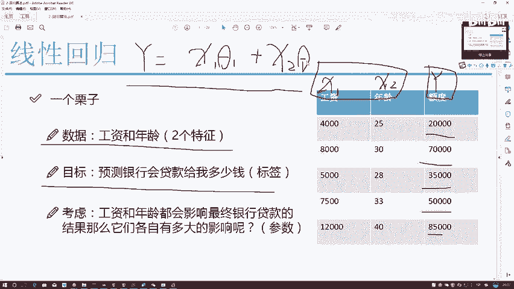
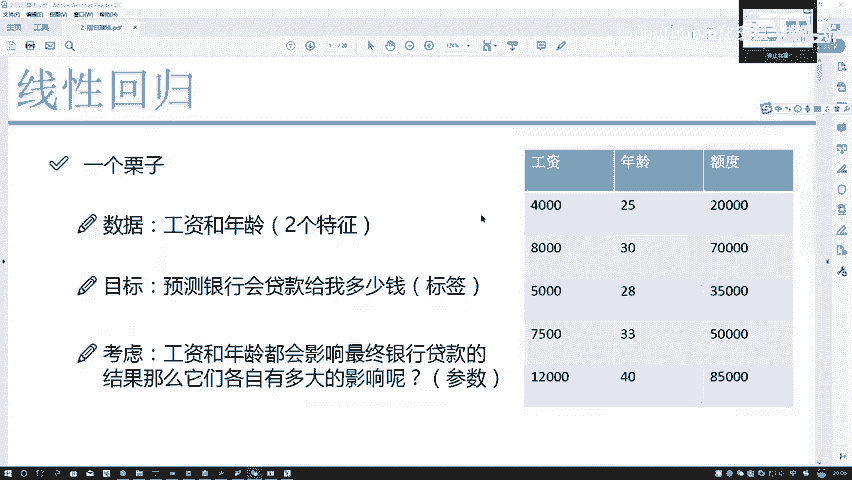
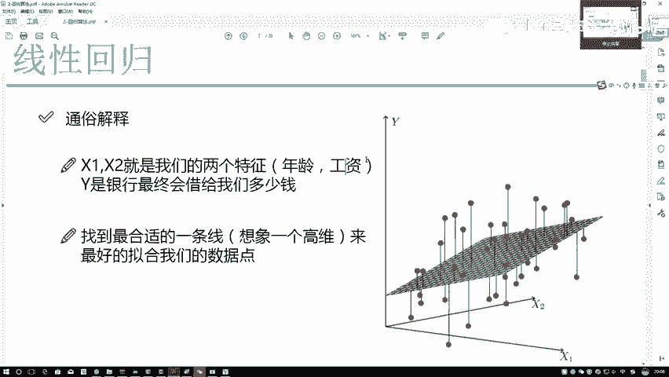

# 人生苦短，我学量化！比刷剧还爽的python金融分析与量化交易实战课程！——时间序列分析／机器学习算法／股票交易／回归算法／聚类算法 - P50：50.回归问题概述P51(P50) - 请不要关注我- - BV1Bz421y7Tu

第一点我们先来看一下它的名字叫什么线性，我们先不用去管后面写什么，写了一个回归吧，我先问大家一个事儿啊，什么叫做一个回归问题啊，我给大家举个例子啊，可能大家以前也听过机器学习当中啊，大概是有两种问题的。

就是在有监督当中吧，大概是有两种问题的，一个呢叫做分类，另外一个叫回归，分类啊，其实很简单，比如说我说现在我去银行，然后呢我想贷款，最后啊银行会告诉我他会贷给我钱，或者是不会贷给我钱吧。

所以说啊就是分类算法当中，它会有一个明确的诶几个类别，要么就是一，要么就是零，比如说一表示带给你钱，零呢表示不带给你钱，这个是一个分类问题，那什么叫做一个回归问题呢，这回我又去银行了。

直播说呢再回我去的时候，哎呦，不问银行他能不能带给我钱了，而是说我问银行，你能带给我多少钱，带给你多少钱，应该是什么具体的一个数字吧，这个具体数字可能是一个取值范围，比如说大概是从零到10万之间的。

都有可能吧，3万六千二四万八千九九万7600，所有的可能性都是存在的，也就是说在一定的一个范围区间上，我要找出来可能的一个值吧，这个问题啊就叫做一个回归了，那我们今天讲的它就是一个回归问题。

我先给大家解释一下数据啊，大概是长什么样子的，右边呢我画了这样一个表格，这个表格当中有一个工资啊，我可以写着它是我们数据当中的第一列，叫做一个X1，第二列呢我写一个X2叫做一个年龄。

第三列呢我写一个额度，叫做一个YY是什么意思啊，咱刚才说了，现在回归有个低点的要求，它是一个有监督算法，作为一个有监督算法，就是这样的，我们在训练一个模型，或者说你要想做一个事的时候，我就必须得有什么。

必须得有一个标签吧，或者说必须得有Y值，表示着你的模型在训练的过程当中，参考着什么样的一个指标，这个是我现在的一个数据，那按照咱们当前这份数据啊，我们来看一下，我说工资是X1年龄X2额度是Y。

现在呢数据已经列出来了，看起来我们就像是一个矩阵式的，在这里呢给大家解释一下数据啊，就是我们的工资和年龄表示，这一会儿呢我要做建模的时候，建模的时候干什么，建模的时候。

我要依靠着一就是参考的哪两个指标啊，这是我要参考两个指标，目标呢目标就是我回归方程，或者说呢咱这个线性回归当中啊，要做的一个结果吧，说白了就是通过X1和X2，我去预测一下最终可能的额度，它是等于多少的。

我再给他框起来，X1X21会儿呢是我要利用的特征，Y呢是我最终想要得到的一个结果，这个就是我数据当中啊，必须呈现出来的一个需求，或者说呢当咱们要去做这个回归任务的时候，你至少还得有两个东西。

一个叫数据或者叫特征，另一个叫做一个标签，在这里要分别用X和Y来给它指定出来了，那我们再来想一想，你说现在啊无非就是要预测这个Y的值哎，到底等于一个2万还是7万还是3万5，还是个5万还是8万5是吧。

我们就想预测出来这样一个值嘛，那这个值你看一下跟什么有关啊，在数据当中啊，是不是只给出来了X1和X2啊，那现在咱们来想，Y值肯定跟X1有关，也跟X2有关吧，那其实说白了。

我现在呢可能要建立这样一个方程Y啊，它既然它是跟X1和X2都相关的，那我直接把它俩加在一起可不可以啊，直接加一起好像不行，为什么，你看我这加一起相当于X1的系数是一，X2的系数也是一，表示这工资和年龄。

对我最终结果影响是一样的吧，但是我们来想一个问题，现在呢你就我就不用想问题了，你就说工资和年龄，哪个决定了你贷款的额度更大更大一些，相对来说应该是工资这一项吧，而年龄这一项呢可能稍微对他的影响更小吧。

所以说啊在这里我可以多加一些指标，比如说哎呀控制跟X1组合的，我再写个C1可以吧，跟X2组合的，我再写个C2可以吧。

在这里我就说哎比如说举个例子，我说C1是一个等于三的，C2等于一，那是不是说工资的影响是年龄的一个三倍，这样一个意思啊，那其实你说我们建立一个回归方程，我现在想要做的一个是什么，你要建立回归方程。

无非就是说X1X2和Y我现在都知道，你看咱们我先把已知量的东西都给写出来，X1它是一个已知的，X2它是个已知的Y是不是也是已知的，那你说回归方程当中，我们还差什么东西了，还差一个C1和C2吧。

所以说啊我们的整个线会方式当中，就有一个核心的目标，求解出来什么样的C1和C2它是最合适的吧，这个就是我们一会儿要求解出来，目标考虑了就是工作年龄都会对结果产生影响，但他们的影响是有多大呢。

说白了其他1THEA求出来了，这件事咱们就解决掉了，这个就是我们一会儿要做的一件事，把C1和C2要给他求出来。

然后呢我们来想这个问题啊，咱们该怎么去求啊，在这里好像有这样一件事，哎呀，现在这个C1和C2好像不能完完全全，表示所有的数据点，什么意思，来看右边这张图，右边这张图当中啊，我们来看一下。

比如说这些红色点，这些红色点表示着，我当就是刚开始给大家提供这些数据吧，这里呢是一个样本，比如说呃我写第一个样本吧，写个一，然后这是二，这是三，这是4。2点，这有很多个样本吧，那我们来看一下。

你说你现在构建回归方程，Y等于一个X1希特一，然后呢再加上一个X2CA2，它能不能覆盖掉所有的点，它能不能覆盖掉所有的点，我第一点问大家这个事儿，当前咱的方程是一个线性的还是一个非线性的。

就我现在写出来这个东西应该是一个线性的吧，那对于一个线性的方程，它没办法就是做了一些急了拐弯的东西吧，他不可能这个点是从这开始，然后我弯上去弯下来，再弯上去再下来，它不是这样的一种结果吧。

而是我在这里画出来这个平面，直接的一个线性的一个表达吧，所以说我们现在遇到了一个问题，我没办法怎么样，我的一个就是我当前这个平面没办法在干什么，没办法去拟合你所有的数据点吧。

这个现在好像是有这样一个问题，没办法解决所有数据点，那怎么办呢，那我们来想，既然你现在没办法解决数据点，满足不了所有人，那是不是应该满足尽可能多的人呐，什么意思啊，我说现在我画了多一条平面。

我说在下面画一个，在上面画一个，我是不是都可以啊，在这里，那你看哪个平面怎么样，哪个平面我应该是满足的，数据点能够更多一些吧，这个现在是我们的一个要求了，我要做的是一个线性的方程。

这个线性方程虽然它不能满足所有的数据点，但是呢它应该尽可能多的去拟合，我当前的数据吧，我说这个问题没毛病吧，然后呢我们再来想这个问题啊。

