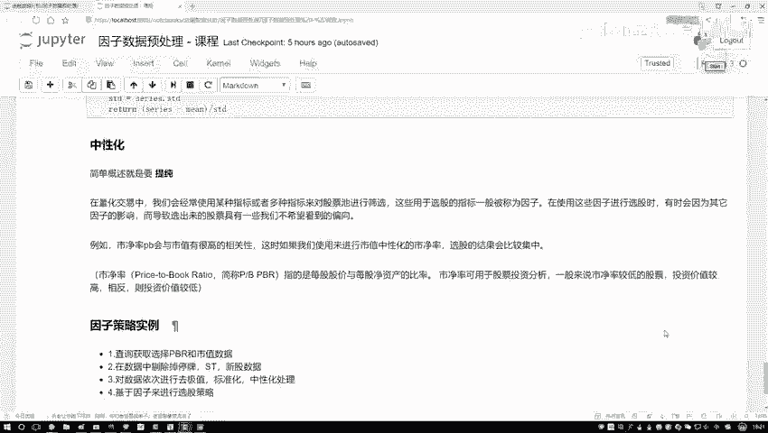
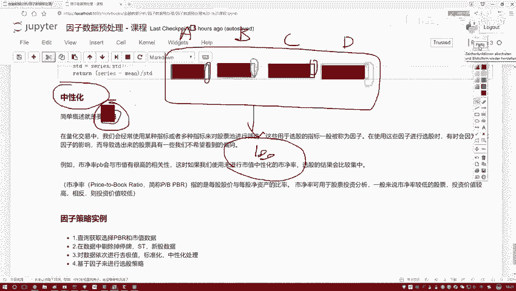
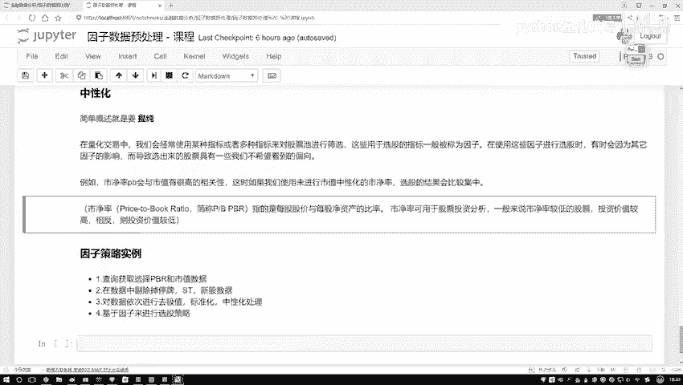

# 人生苦短，我学量化！比刷剧还爽的python金融分析与量化交易实战课程！——时间序列分析／机器学习算法／股票交易／回归算法／聚类算法 - P28：28.中性化处理方法通俗解释P29(P28) - 请不要关注我- - BV1Bz421y7Tu

接下来咱们来看最后一个知识点叫做中性化诶，先给大家解释一下，这个中性化他做了一件什么事儿，你看这里我首先对它做了一个概述啊，我说它的目的就是一个提纯，那什么叫做一个提纯呢，咱们先别看这些知识点啊。

我先给大家举个例子，哎比如说现在我说我想去设计诶，有这么一个策略吧，然后呢我说啊在这个策略当中，那比如这个策略当中我是有些因子，我说这个因子当中啊，还有第一个因子，然后呢还有这么第二个因子。

然后我再画个黑色吧，然后第三个因子再来一个，再来一个黄色吧，哎就说我们现在有四个因子，然后好像说这样一件事啊，这四个因子啊，然后都会对我的结果产生影响，然后呢我想去对比分析一下诶。

比如说这里唉咱们就说了，有一个ABCD那么四个因子啊，把线拿过来，这是一个A因子，然后呢这是B因子，这是一个C因子，这是一个D因子，我说他们都会对结果产生影响，我说A因子啊小的时候，然后B因子大的时候。

C因子这个因子那个时候对它们做一个筛选，然后呢好得到诶，咱们哪些股票吧，这个说白了我们要在股票池当中选择股票，咱要去玩儿，或者说我要去买一些股票，要通过一些指标来去观察吧，但可能有这样一件事儿。

无论这个ABCD啊，哎我怎么去选，怎么去设计，我得到的股票呢，总是那几个唉，为什么会，比如说现在我说我做一次选股选股之后，那选了这些个里边有这么100只股票吧，然后呢我想我然后啊我做了一些判断和分析吧。

我怎么选，每次诶我说这个策略在变的时候，每天在选的时候可能都是这100个，那大家可能会说哎呀，这咱们现在有这个AABCD啊，我们有四种因子诶，为什么咱总选到的都是一些相同的呢。

那是不是说ABC当中可能有一些共同点啊，来我再画一画，可能这样一件事啊，我说在这个A当中啊，你别看它是个蓝色蓝色，比如说A表示一个那个市净率吧，好了，咱们说它是市净率，然后呢在这个A当中啊。

可能绝大部分都是跟市值有关的，我现在拿这个呃，就是一个实，就是一个实体的红色表示的是一个市值，那B这个特征呢，唉你看它虽然是另一个因子，但是它可能绝大多数当中也都是跟市值有关的，C当中也是一样。

D当中也是一样，诶，给我感觉有这样一件事啊，你给我选出来的四个因子，但是呢这四个因子当中啊，绝大多数的成分都是一样的，那既然你说他们绝大多数成分都是一样的，那我怎么玩儿，那相当于都是一个事儿吧。

没法得到一个多样性吧，或者说这四个因子我没有把它自身的，或者说把它自身的一些数据吧，或者把它自身一些指标体现出来，因为什么在它的内部当中啊，绝大部分都是一样的，你看A因子跟事实关系特别大。

B因子C因子D因子都是跟市值关系特别大，那最终给我的感觉好像就是不管你用啥，那都是市值决定最后的一个结果，那好像有这样一件事吧，那什么叫中性化呢，再来看这个，我说这个意思啊，你看这里我提出什么叫提纯。

那我问大家一件事啊，哎你就把它把它也正好给盖上了，调画笔这块咱们写了要做一个提纯吧，那你说啊在这个A因子当中纯的是哪儿啊，哪块是它所特有的呀，或者说现在我说哎呀，我想去找出来四个同学，那四个同学当中啊。

我去观察他们，你说我希望找的是他们的一些共有的特性，还是他们的一些个性啊，我希望是个性吧，把个性表现出来啊，都有的东西，那有什么价值啊，你有我有他也有都知道的事，一个常识，你说对结果有什么影响吗。

没影响吧，所以此时我说点A当中，我要把他这个纯东西提出来，把它有价值的信息，B当中呢是不是也是一样啊，那C也和这个D诶，是不是方法都是一样的呀，说白了我们要做这样一件事啊，对于一些因子来说。

把它独特的部分提出来，把它有价值的部分提出来，这个叫做一个中性化啊，我先给大家就是直白的解释一下什么叫中性化。

然后呢说完这个例子之后，咱们来看一看，说啊在这个量化交易当中啊，哎我们经常会使用一些指标或者多个指标吧，对股票池进行筛选啊，说白了我经常会做一些轻仓操作，然后呢我去呃买一些不同的股票，就是股票池。

比如说固定十个，我今天买这几个，明天买那几个，我要做一些筛选吧，然后呢我们筛选过程当中，有些指标我们把这个指标叫做因子了，所以说啊在我们使用这些因子选股过程当中，有时候会因为什么。

有时候会因为一些其他的影响，比如说刚才咱们四个因子，那都跟市值有关系，那是不是指起绝大多数作用啊，从而导致咱们选出股票，还有一些可能我们不想看到的一个倾向性，没准它都是一个都没什么变化，是这样一件事啊。

比如说刚才咱们看了，我说啊这个市净率啊，这个值哎跟这个市值，那大家都知道肯定有很高的相关性吧，那如果说咱们不用不用什么，不用这个中性化的结果，那选股就会都比较集中了啊。

因为这里边儿绝大多数都跟事实相关的，没体现出来一些差异吧，啊有这样一件事，然后呢咱们说这个市盈率啊，因为一会儿我们也是拿这个市净率，然后跟那个做这个策略啊，所以这块给大家介绍一下这个市盈率啊。

他就是说每股股价，每股股价它有一个价格，这咱咱知道吧，跟什么做一个比值啊，跟美股的一个净资产啊，做比值为什么叫做净资产，就是它的一个总值减去它的一个债务啊，这叫做一个净的，是不是。

然后呢这个市盈率啊它有个特点，一般情况下就是对于我们买股票来说，有什么特点，当咱们在买股的过程当中，唉我你说我们希望市盈率大点好的，还是小点好的，理论上情况下我们希望小点好的吧。

因为小点的它的一个涨幅空间可能更大，而他给我的一个就是我付出风险，他给我的一个回报的可能性会更高一点，相对来说啊就是值得投资，哎咱赚钱可能性会更高一点，这个意思先给大家就是概述了一下诶。

中性化是一件什么事，然后一会儿咱不在这个综合部当中就写代码，因为这里边我们需要一些因子啊，比如说现在我们得知道这个市净率吧，那比如说我还想知道这个市值，你得最少把这两个东西拿出来。

我才能去做中心化这个事儿吧，但是在我notebook当中啊，没有这两个值吧，你必须在平台当中还把用人API，把数据把指标调出来吧，所以说啊一会儿在平台当中给大家进行演示，这里呢先这样。

我先给大家说我们计算方法。

一会儿呢在平台当中。