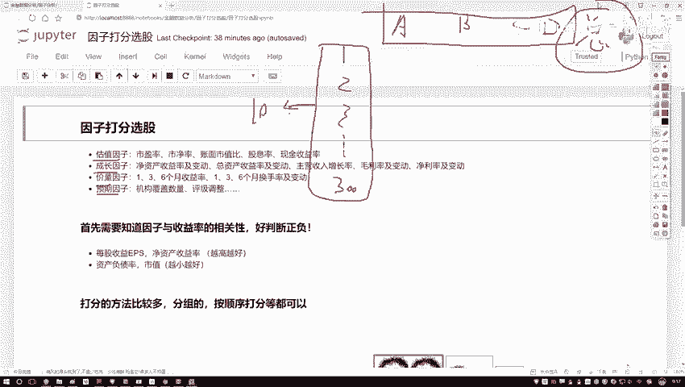
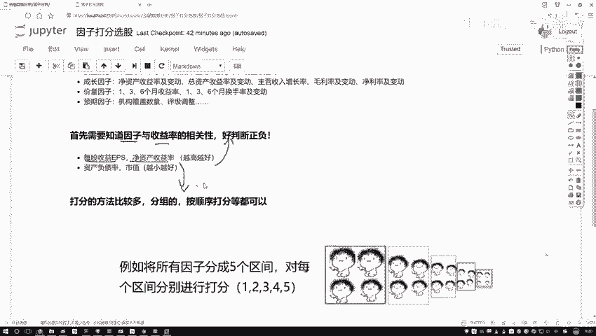

# 人生苦短，我学量化！比刷剧还爽的python金融分析与量化交易实战课程！——时间序列分析／机器学习算法／股票交易／回归算法／聚类算法 - P43：43.打分法选股策略概述P44(P43) - 请不要关注我- - BV1Bz421y7Tu

这节课咱们来说一下，就是在我们选股过程当中经常会用到一个策略，叫做因子打分选股，先从这个名字当中给大家解释一下啊，我们都要对因子啊做一件什么事儿，之前呢我们已经说了好多次。

这个因子啊估计大家都比较熟悉了，唉有些大因子像是估值的，成长的，甲量的预期的，然后呢在每个大类影子当中，还有一些具体指标，比如说咱们接着唠的市盈率啊，还有一个是净值哎，还有一些其他指标。

这些咱们之前都给大家举例说过，那我们之前讲的过程当中说说这样一件事，还有一个股票当中还有哪个因子，然后呢我可以通过一些方法，比如说算一些AC值或者一些其他的指标，来判断一下当前这个因子它是好还是不好。

那给我们的感觉好像是哎呀，你说这个好还不好，那就说一个股票还是不好，那直接是由某一个因子所决定的，之前我们讲解过程当中好像有点单一了吧，哎每个因子算一个IZ值，那这种方法好像是只看一个因子。

来去选择个股票，那今天咱们把这个策略啊再给它放大一点，再作为综合的，像这样一件事，哎比如说我给大家画一下，我们数据啊，我的数据当中有些股票，那比如说有这个1231直点点，哎，咱们说300股票吧。

然后呢300股票当中啊，我们现在有的那不仅仅是一个指标了，我说现在有这个ABCD，我有四个因子指标行吧，那好了，我说咱们要做这样一件事，在这300股票当中啊，我说咱不全用啊，我们要做一些调仓操作。

每个月做一次，这300个当中，我说你给我选出来十个或20个是不是都行，那我问大家，那这十个我们该怎么选啊，大家可能会想哎哟哪一个能让我赚的更多，我选哪一个呗，那怎么去衡量呢，我们说不说啊。

现在有这么四个因子ABCD啊，那我们得看一看ABCD这四个因子，分别对我们最终的一个收益情况，来做出什么样的影响，那我观察一下，比如说A因子当中还有选什么样的A因子，能使得收益率最高。

哎B因子DC因子D因子是不是一样的，但是呢给我感觉好像这样，你单独看A啊，单独看B单独看C和D，那好像只是一个方面，我们现在还没有说什么一个汇总的吧，一个总体，所以说这里诶我说我再加一列吧。

最后一列啊表示的是我一个总体，我就写个总得了，那好比说这样一件事，我说ABCD吧，那我呃不说你是好还不好了，说好还不好，有点太笼统了，我说这样你给我具体打上一个分，比如说哦对于跌股票来说。

哎呀A因子打十分，B因子打了15分，CD因子分别有分吧，那好比说这样就这样一件事啊，你说啊，你最终的一个考试成绩，是由你各科的成绩的一个总分来决定的行吧，A表示语文，B表示数学，C表示天文地表地理行吧。

但在最后算出来一个总分，我们把这个总分，我说我给他排个名诶，300个股票总分我一旦都算出来之后，我说排名吧，排名完之后我说我取个前十，那是不是就行了，前十哎就是整体成绩我认为最好的，那下一次调仓呢。

我就可这十个来诶，这个是不是有策略啊，这个就是我们现在所说啊因子选啊，因子打分选股，咱们大概啊要做的一件事儿，其实呢就是我们需要把最终的一个总分给它，求出来就行了啊，这个是我们最终目标。

一会儿呢咱们会到这个片当中给大家演示啊，咱们怎么样去求这个总分的。

然后这里啊咱们还得有一些条件，就是当我们在做打分的过程当中，我们得有一些已知条件，或者说得有一些知识吧，首先第一个我们只需要招一个指标，就是因此而和咱们这个收益率，我们的一个相关性吧，或者说它们之间啊。

哎是一个正的呢，还是一个负的呢，什么叫做一个正和负啊，咱之前给大家讲那个因子分析的时候，是不是说了有些因子诶越大的时候，诶的一个收益情况可能越好，原因子呢你越小的时候，你的收益情况可能越好。

那我为什么事先要知道一个越大还是越小啊，因为我们一会儿要打分啊，打分的过程当中，我们是不是说要基于因子的一个数值来看看，数值的大小，不可能是数值越大的，我越打分越高，还是数值越小的，我给他打分越高吧。

那既然我们要打分啊，所以说你的一个评判标准你得先告诉我呀，那大家可能会问诶这个指标啊，比如现在这里我随便列出几个指标，比如说每股的收益，还有呢一个净资产的收益，那对于这两个指标来说诶。

那我怎么大家可能听着这个名字，一听就越大越好啊，那我怎么知道呢，你可以通过一些研究报告，那可能各个证券公司它都有每就海了去了，各种研究报告里边，我们都有一些经验值，或者说都有一些经验值可以做参考吧。

另一方面呢咱们在讲那个因子分析的时候，我们是不是自己也能动手去计算一下诶，到底是我们的一个正的还是一个负的，诶这个相关性吧，所以说啊首先第一步唉我们得有一个经验知识，你也知道啊，当前你选因子。

那是大了好还是小了好，这个呢咱们就当做它是一个已知条件了，一会儿啊，咱们在那个实际的偏爱清平台写策略当中，我们也会选择出几个因子，那选出来因子其实都是我们已经事先知道的，比如热点哎，我们说选了两组吧。

那一组是越高越好的，一组是越小越好的，这个也是我们的一个已知条件，也是咱们所必须啊，需要去预先知道的一个先验知识好了。

