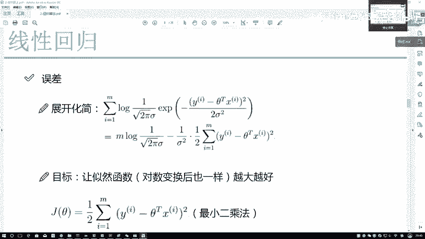
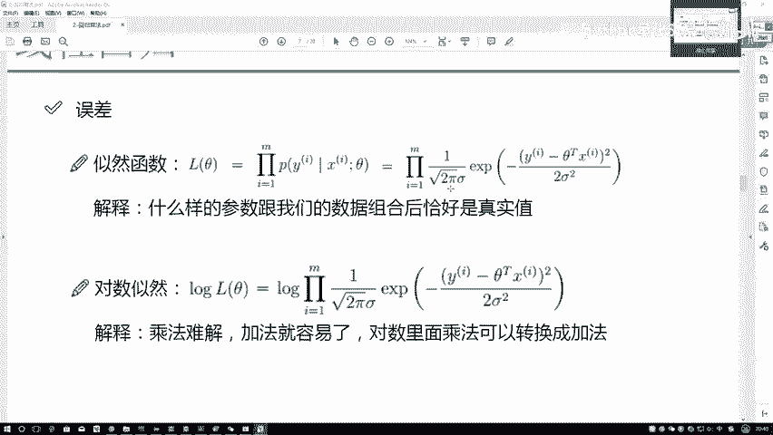
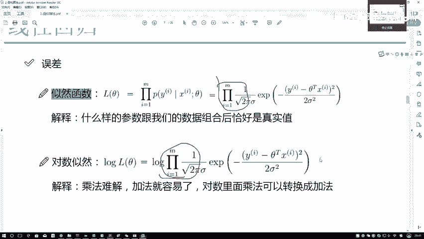
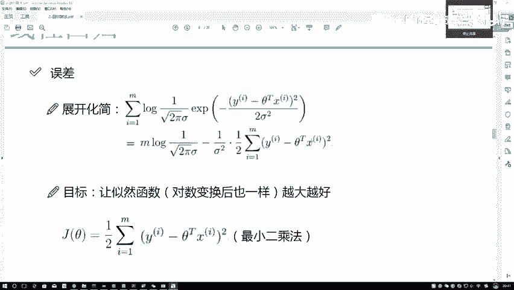
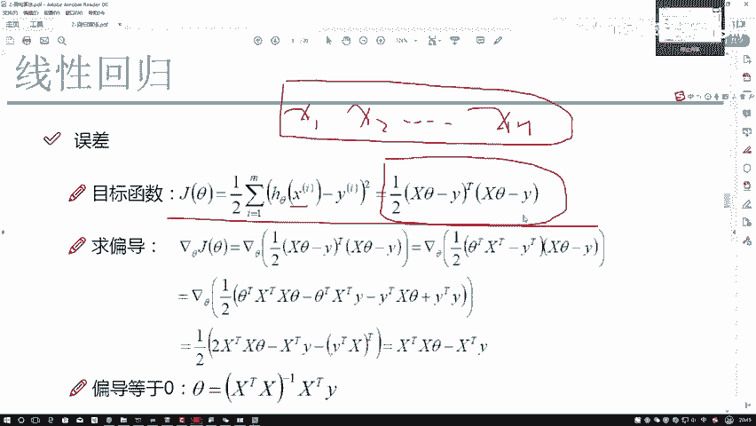
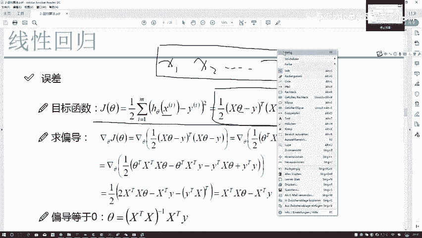
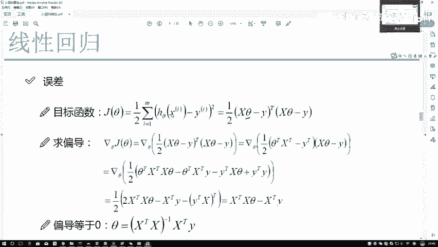
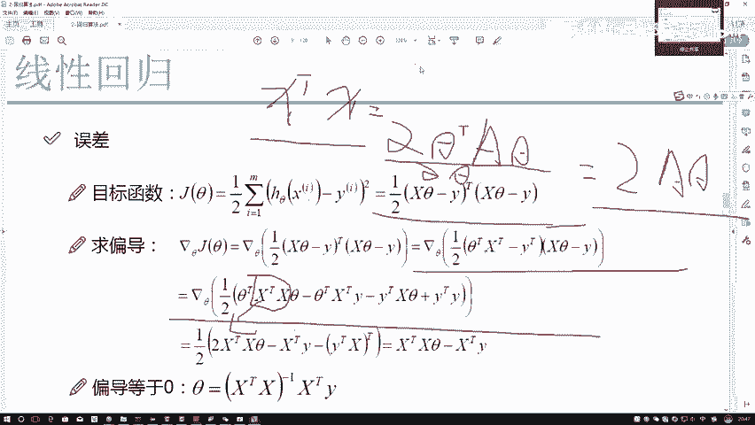
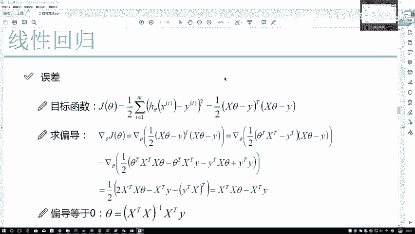
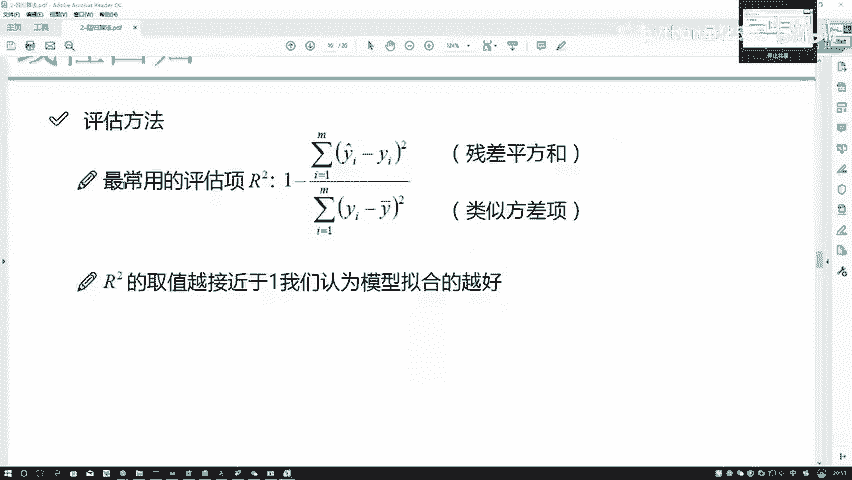

# 人生苦短，我学量化！比刷剧还爽的python金融分析与量化交易实战课程！——时间序列分析／机器学习算法／股票交易／回归算法／聚类算法 - P54：54.参数求解P55(P54) - 请不要关注我- - BV1Bz421y7Tu

在这里就是之前我是一个对数，然后呢这一块儿他是I从一开始到M，这是个里程吧，现在它是不是变成了累加了，右边的式子是不是直接落下来得了，对面一点没改吧，这是不是直接落下来了行，咱来观察一下这个式子吧。

我给大家写一下，给它分成几个部分啊，首先我说这里啊，我来框一下，我说这是一个A，然后呢这是一个B可以吧，好在这里我们来观察，首先第一点，你看啊这块有C的啊，这有C的是要求解的吧，那没C的。

我们是不是都认为它是一个常数项了呀，没有这个东西，它就都是一个常数项吧，所以说在当前这个任务当中，我可以先把常数项给它提出来吧，哎你说在这块I从一开始到M，加上了M倍的这个东西，这块这块又干什么了。

这块对数当中刚好框架这是一个A，这是一个B，这是不是还是对数里边一个A乘B啊，对数里边A乘B等于什么，对数A加上对数B吧，这个东西我不用写了吧，所以说啊当前对于这个A来说，这个A它是不是常数项。

把常数项加了M4，那是不是等于M倍的这样一个常数项，我单独列出来没毛病吧，右边这一项，右边这一项咱不看这个A了，它是不是变成了一个log，假设说我这个对数它是以E为底的，以谁为底，其实我无所谓。

为了好化简，我当成以E为底了，你加个以谁为底的，除了极值会变，极值点还是不变吧，在这一块，E的X次幂这个节点都什么X直接落下来了吧，那右边这一项是不是这东西约掉了，这个直接往下落是不是就可以了。

直接往下落的过程当中来看吧，这等于什么，是不是常数项，只要不是C的，都是常数项，常数项我是不是可以拿出来啊，然后里边里边他就不能拿出来了吧，为什么YI和xi啊，对于每一个样本来说。

它的一个YI和他的一个xi是一样的吗，肯定不一样的吧，每个人年龄能一样吗，每个人都能带多少钱，能一样吗，这不能一样吧，所以说右边这一项这个东西不可能拆开的，它是从第一个样本一直迭代到第M个样本吧。

此时我做了这样一个展开，展开完之后呢，想一想来想一想，咱之前的要求是干什么，唉我说我希望这个式子X跟其他组合完之后，成为我的一个Y的可能性是越大越好，还是越小越好，咱之前说的越大越小啊，越大越好吧。

所以说我现在要求的是什么极大值吧，极大值点啊，那在当前这个极大值点的过程当中，我们来看这东西，它是一个常数项，一个常数项减去一个值，并且要使得这个值能够越大越好，常数项是不变的，那我们应该怎么样。

我要写个A吧，它是A它是BA是不变的，B它是个横竖的，为什么说它是横竖的，就是前面减去一个横正的吧，或者管整个叫横幅的，咱说减去恒正的吧，为什么右边横正的平方1/2平方恒正的吧，常数项减去一个横正的。

我要值越大越好，只能让这个B他怎么样，只能让这个B怎么样越小越好吧，只有这个B越小越好，越小的时候整体的值它越大越好吧，所以说当前我把这个B我单独列出来，单独我把这个东西拿出来再来分析一下。

你不是说要对于这个东西要越小越好吗，常数项我压根都不用管了，1/2落下来，因为我一会儿可能要用上，把这个东西往下一落之后，我们来看一下当前这个是不是，我们就是现在的一个什么，我写了一个JCJC呢。

通常情况下可以叫做一个目标函数，或者叫做损失函数，或者叫做LOFUNCTION之类的，你叫什么都无所谓，知道是我的目标就可以了，让这个目标怎么样，此时的目标应该是越小越好吧，不是越大了吧。

这是越大到这就变越小了吧，这是你的一个已知量，这也是一个已知量，我们要求什么样的希特，在此时能够使得整体的式子越小越好吧，那这个式子还有一个通俗的叫法叫什么，最小二乘法。

可能以前大家在看一些现在回归的一些博客，或者线性回归前，老师讲解过程当中，不会给你提前面所有的一个推导过程，只有机甲会把自己二乘法拿出来告诉你，我的预测值，哎呀和你的一个真实之间，我希望在你的过程当中。

他们能越小越好，直接提这么一点没毛病，但是我希望大家怎么样，把之前这些点都穿插在一起。

因为自然函数它不是现在回归当中所特有的，它在所有的机器问题当中，很多机器学习问题当中都会涉及到这一点，我不需要大家把这些公式你都背下来，我希望大家能去理解诶，为什么咱们一步这么去做的。

比如说为什么这是个累乘啊，为什么别人说累加啊，为什么一会儿要最大最好。

一会要最小最好啊，我希望大家能把这些点明白啊，把这些总结出来就可以了，还有一项就是这个误差项怎么样通过一个定义，咱们才能得到这样一个最小二乘法的，没有这个误差项前提后面一切都是不成立的。

这些都是我们做最小二乘法，或者说对做推导最基本的一个前提了。

接下来我们来说一下，咱当前这个就是目标函数，该怎么样进行一个求解，求解过程当中啊，其实我们就把它先进行一个展开了，这里需要大家注意一点哦，X它是什么，它是一个数吗，他是个35789吗，它不是吧。

它是什么，它是你的数据吧，X1第一列特征，X2第二列特征一直SNDND特征，所以说此时对X你就不能把它当成是一个数，而当成是一个矩阵了，接下来我们要求解，所有东西都是基于矩阵去做的。

在这里呢我先做了这样的一个展开，对于军人来说，它的平方向等于转置乘上一个自身吧，我再强调大家一定要注意这个X它不是一个数。

不是135789，这个死它它也不是35789啊，而是一个矩阵这样的概念。

那此时我不要求什么样的吉他，能使得当前这个最整个的JS1越低越好吗。

这是我要求解的吧，那当前我们现在要求解这样一个问题，那你说应该怎么求啊，很简单吧，我当前你不是就要看JC在什么sat的前提下，能够最小，那是不是应该用JC对C去求一个偏导啊。

咱们是不是要做这样一个求偏导的过程，让偏导等于什么等于零吧，当偏导等于零的时候，我求出来的这个吉他，就是我当前的一个极值点吧，那此时呢咱们来看一下这里边的展开啊，就不给大家一个去写了，展开完之后。

其实展开是这样，就是XC它的一个转置等于什么，它的转置等于一个C转职，再乘X转置啊，它有这样的一个，他有这样的一个调换的一个过程，知道有这样一个事就行，不用大家再回头翻一遍线性线性代数的书。

翻一遍书可能时间比较长，咱知道它的计算过程是大概长什么样子，大家能理解就可以了，因为实际你在用代码去算的过程当中，你是不需要任何其中的中间过程的，只需要最后的结果就可以了，在这里只是给大家说一下。

我们的一个求解过程而已，那此时我们再来看，对于当前这个式子，如果说我把它展开完之后，到这里，我对此进行求偏导，咱该怎么办，注意一点，首先我给大家举个例子吧，X转置乘XX的一个一个矩阵的一个转置。

乘上一个自身，它必然是个什么，必然是一个对称阵吧，如果大家关于这些线性代数我都忘了，没关系，你就知道有这么个事就行了，实际当中你也不用去背这个矩阵，它的一个求偏导，这东西啊基本上是用不上的。

借用现场也完全来得及啊，不用完全把它背下来，X转换成X既然它是对称阵，对称阵在矩阵求当中有这样一个前提，一个矩阵的啊，C的转置，其它的一个转置乘一个A，在A是对称阵的前提下，右边一个C它会怎么样。

他在对C求上一个偏导的时候，等于什么，等于二倍的一个A1套，这是一个公式啊，公式我不给大家一个单一个去说了，直接把求解结果落下来就可以了。

咱们直接来看最后一步，最后一步的过程当中我得到什么了，让当前这个结果等于零，那是不是说这一块相当于填那个等号啊，此时怎么样了，此时我现在来看，我要求这个吉他吗，C前面左边有个X转置乘X。

右边等于X转置乘YX，它是我数据，我是已知量，Y也是已知量，我需要把左边这个X转置乘X给他，T给他，或者怎么样消掉吧，怎么样去消啊，什么时候销毁是什么意思啊，你把它怎么样变成个一呗，是不是这意思啊。

什么时候能得到一啊，一个矩阵乘上它的一个什么，能得到一个就是单位矩阵，或者得到一个，咱就说一得单位矩阵，可能听着有点麻烦，说类似得到一个一啊，什么时候应该乘上它的一个逆矩阵吧，再来看一下。

如果说左右两边同时乘上一个X转置乘X，它的一个逆是不是当前左边这一项我约掉了，这个就是我们最终得到的一个结果了，在这个基础当中，需要大家来分析一下，X是我现在要求的不是C，他是我现在要求的。

就是这个是要求的X是我已知的，Y也是我已知的，那是不是这件事咱就做完了，通过已知量我求出来这个未知量未量求完之后，这件事是不是解决了，但是大家到这里，我希望大家想一个问题。

我们所谓的一个机器学习重点是先强哪了，强调他是个机器吗，不是吧，应该是强调他的一个学习的过程吧，但是大家来看，在我们现在这个线性回归问题当中，如果说我怎么样进行一个求解，他有学习的过程吗。

哎大家你看到学习的过程了吗，好像没看到吧，直接拿X拿Y去往这里带，往这公式里带带出结果写得好，你求出来了，没有学习的过程吧，那学习的过程应该是长什么样子啊，给我的感觉好像应该是机器啊。

先看看第一个样本啊，然后他得到一个结果，看看跟真实值做的怎么样，差了一些，插了之后让我调一调，再看下个样本，咱能不能做好一点，就像你每一次考试似的，你从小到大每次考试。

你是不是都希望你的考试成绩能够越高越好啊，不是说把你从小学一年级到你高中3年级，做的东西就给你一起让你做一遍，不是这样的吧，应该是有一个渐进的一个过程吧，这个是一个学习的过程，但是呢在这个问题当中。

提到这样一个渐进的过程了吗，好像一点都没有是吧，但不光是这个问题没有提到，还有什么样的一个问题，这涉及到一个转制，也不是，这涉及到一些球迷啊，一个求逆是什么，一个求逆的过程，在这里大家可以想一想。

它一定是一个成成立的吗，首先第一点矩阵的一个穷力，谁也不敢说是百分之百成立的吧，很多条件下它是不可逆的吧，有这样的矩阵吧，那是不是一旦矩阵是不可逆的时候，我的一个X不是，或者说我最终结果的一个系统。

就没办法进行一个求解了，在这里我希望大家再来去重拾到。

我下面给大家讲的知识点，叫什么叫做评估方法，咱也不说，咱最后回来说评估方法。

