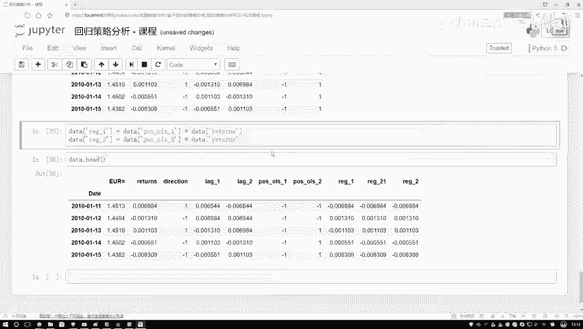
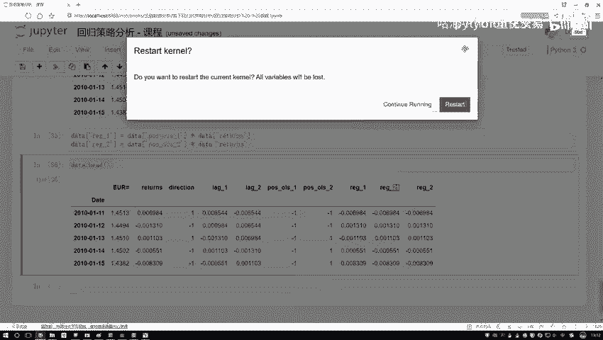
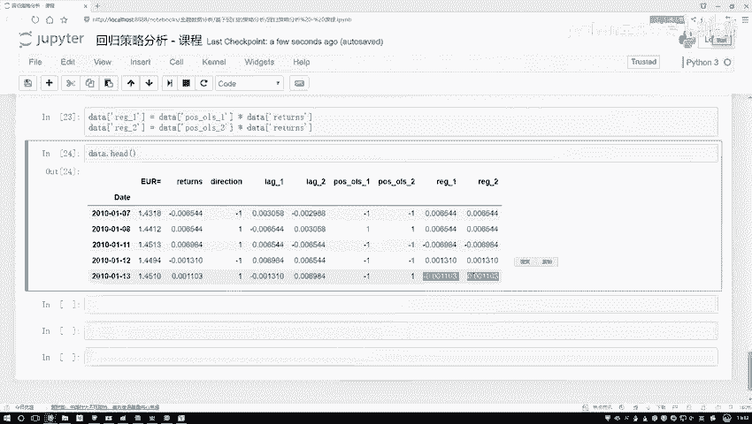

# 人生苦短，我学量化！比刷剧还爽的python金融分析与量化交易实战课程！——时间序列分析／机器学习算法／股票交易／回归算法／聚类算法 - P60：60.构建回归方程P61(P60) - 请不要关注我- - BV1Bz421y7Tu

有了一个数据之后啊，接下来咱们就可以建立一个回归方程，去帮助我们预测一下，接下来啊不是接下来就是每一天的一个走势啊，到底是一个啊涨了呢，还是一个第二呢，哎咱们来看一下，首先第一步我们要借助一些工具包了。

这个给大家选的是一个sk learn，sk learn相当于是在Python当中啊，非常常见的一个机器学习库，这里边基本这样，就是但凡你能想到的一些常规啊，机器学习算法这里边都有啊。

比如说咱们今天用的我们用一个线性回归啊，所以说它是一个leader model当中的，我们导进来vier model，当中的我们把这个现已回归给导进来，一会儿啊，咱直接用这个包来帮我们去做啊。

基本上就是一行代码就能够把这个任务诶，给他完成了啊，是这样的感觉行了，把我们的一个基本的先回归包先导进来，第二步呢，在这个sk sk learn当中啊，就是呃你要构建的所有的模型。

首先第一步啊都是先需要啊，对我们的一个就是导进这个BB，对他先做一个实例化啊，一会儿咱们才能用好了，一会儿要创建的是model啊，它是一个linear regression啊，先回归。

那接下来我们要用这个model干什么，去训练一下我们的数据训练，在这个包当中唉，它就是一个点fit操作，在这个点fir操作当中啊，你需要传递两个参数，而第一个参数是一个X，第二参数是一个Y。

就是呃你的特征是什么，你要预测的一个标签是什么，再写一下，第一个，咱们先写这个XX啊，之前是我们指定好了，就是在DNA当中DA当中，然后呢我们之前定义了一个列吧，我记得这个列名啊叫做咱当前就这里。

我存的是我的个列名吧，但是有个小问题，这个列名啊我们存在哪了，是存在这个函数当中了，是不是，那我们函数当中这个列名函数执行完了，咱就不能用了，这样给他改一改，给他改成一个global啊。

我们的一个列名哎，这就行了，一会呢就是函数外面我们也可以来调用了，然后重新执行一下吧行了，然后我这里咱也都重新执行一下得了好，然后这块我把这个列名导进来，这个是当前我们的一个xx当中。

我需要呃X当中指定特定的一些列好了，把这个列名传进去，是不是就可以了好了，这是我第一个X，然后再指定这个Y，一般来说就是你要用哪个指标了，呃在这里我们先做一个对比实验啊。

就是一个Y我们用这个returns就是实际啊，我们的报酬率它是等于多少，好了，把这个第一个歪拿到手好，既然我们要做对比实验，但这也这样吧，就是我们一个点feat x都不变啊，第2Y稍微变一变。

我们还可以用什么当做我的目标啊，你看这块什么还有direction是吧，还可以拿它当做我的目标，一会儿呢我们就来对比一下，就是看一看呃，你是拿这个returns诶，实际一天它是呃涨了还是跌了多少。

是比较合适，还是啊拿它具体的一个涨跌指标啊，当做一个标签是比较合适，反正现在我也不知道啊，咱们但凡要做任务，其实都是这样一个思路啊，尽可能多的我们去做实验吧，那反应哪个好，这也很难说，看实验结果吧。

哪个实验好，咱用哪个就可以了好了，然后呢我去点product下不代表什么啊，这就是现在好比说前面我框写这一部分，这里吧这一块我框写这一部分，相当于我们去练好一个模型，那模型干什么用的呢。

就是去帮我们去预测一下哎咱的一个结果吧，好了有了模型之后，我去预测一下我的一个结果，结果是谁啊，那就反过来去有这个数据了是吧，咱之前有模型了，那预测一下吧，你当前诶你指定这个特征，看它的结果等于什么。

是不是就行了好了，去预测一下我们这个结果，然后这个结果啊，这个就是这样，我在这里指定加上一个新的列吧，指定要加上一个新的列，就是呃我预测一下我的一个回归方程，或者叫做一个最小二乘法，然后第一种吧。

然后一会儿再指定个第二种好，然后在这里我们指定第二种方法，分别执行一下，这块还没写预测结果，预测结果都是一样的，咱执行一下，看一看我们的一个效果行了，现在我把这个结果执行完了，执行完之后呢。

咱在这个电影当中，我们去看一看当前得到的结果，你看我现有什么哦，这是一个实际值，我们的报酬率，然后他的一个CTION的前一天前两天这是什么，这是我预测的结果呃，可能这个预测结果啊。

先来看稍微的不是特别好啊，因为什么，你看现在这个direction啊，它是什么，首先第一点它是正的，是不是，但是你看我们预测值怎么样，全为负了吧，可以说咱们当前预测结果啊。

啊在某些指标上可能来说不是特别好啊，因为你看这个这一块它最终报酬率它是负的，你看这标是负吧，然后呢，我们第一个回归方程预测出来的是负的啊，这挺好的，第二回归方程预测出来反而是正的，说明不是特别好吧啊。

这点就是我们会学方程，不可能把这个趋势100%做出来的，并且咱们今天举个例子，还是一个比较简单的，我们的一个线性回归，所以说这里大家咱们举例子来看一看会不会啊，就是基于回归方程去做。

会不会比我们就是什么都不操作，就是等着它涨跌，什么都不管，咱看看效果能不能强一点，这个意思，然后这里这样，这里一出来出来一个结果，其实一会儿啊，呃我们要做一个策略，就是今天买还是不买，是不是。

那其实我不用啊，这些具体的一个正负值，你看这里等于负的那代表的是什么，咱就卖呗，是不是正的代表我就一个买，是不是，所以这里啊就是具体正负多少，就预测值当中啊，具体这个正负多少，那可能我都不关心啊。

你反正涨了就涨了还是跌了，我只需要知道知道知道这样一个指标吧，所以说此时你看这里我也写了啊，第一步咱们训练模型，并且进行一个值的预测，然后呢第二步，第二步，就是你也知道你这预测结果代表什么是吧，好了。

来写一下吧，在我们的数据当中啊，来看一下我们有两列是吧，好了，把这两列写一下，第一列就是哦就是有两两个指标啊，第一个指标就是我第一回方程的，然后还有第二回方程的，我都得需要一下，把他俩稍微处理一下。

这两个方程怎么办，我说重新的处理一下吧，处理什么处理成一个正负的，表示的是我是买还是不买，所以得了好了，然后在这里我把这个数据给拿到手，对我当前数据做一个判断，判断什么判断是否大于零吧。

大于零的时候怎么办，大于零的时候等于一，小于零的时候等于一，那是不是就完事了，执行一下吧，执行完之后看一下这个结果再讲，还得下，此时你看啊，你看上面就是为负的，这为负的怎么样，这都是一个一。

然后呢下面就是为正的，就是一个正一啊，相当于我最终预测结果啊，我只要一个标志位就行了，它表示着我今天到底该怎么样进行，实际的一个操作啊，这不就行了好了，来咱们来看最终我的一个呃。

就是基于我们的策略来去做一下吧，你看第三步，这里写了啊，基于我们这个策略来规划一下，我们是买呢还是卖呢，然后我们来试试水好了，电脑当中我们来指定一下吧，就是呃先说一下怎么去做啊，做法其实很简单。

在这个电脑当中我直接复制一下哦，还在这里把它复制过来吧，把它复制过来，我还不能整体操作，这样我只先先选其中第一个点好，下面第一个回归方程对这个结果怎么样，你看这里他不就描述着你当天到底买不买呗。

那我就来看吧，他给return当中，那如果说这个东西是个正义，那是不是说按照returns正常去做，如果是个一，那是不是正好把这个returns给它反过来啊，跟实际的一个走势行的那方法很简单。

直接冲什么，既然他是个标志位，我直接用这个标志外乘上我的returns，是表示着我的一个实际情况了，就是按照我当前这个策略得到的一个结果了呀，好了，这是我们第一步呢给它起个名字，起个名字啊。

就是啊我们现在当做的一个策略一吧，那就做一个这个方程吧，啊就是我们的一个回方程，我们的策略一啊，咱们这个结果我就按G吧，回归方程策略一的结果，然后呢不光有策略一，我还有一个策略二，从第二来说。

用第二个方程啊来去乘上一个returns是可以了，好了，做完之后，然后执行一下，追完之后我data点head一下，看看结果这里是不是多了一个结果，这不叫二一了呢，这叫一个二重新指定一下好了。

这叫一个二啊，这就是我的一个哎哦在这里这样就是我新家诶，这个notebook当中其实还有这样一个小问题，我之前没给大家去说啊，就是当你重复的执行某个cl的时候哦，它不是相当于之前那个SL就不做了。

相当于在之前的基础上又做了一遍，因为你看之前就说我这块，我猜有一个改写二一是吧，现在我把这个一去掉了，这个二一没了吗，还在吧，所以说啊他的意思不是说呃，之前你就把之前的操作给它删除掉了。

而是之前的还是执行完了，我们又执行了哪些个操作，所以说这里如果大家想去把这个二一改成二。

怎么办，那最简单的方法你就是我先保存一下。

在这里咱直接的去restart一下啊，重新的执行什么，从上往下就是我偷懒了，直接从上往下，咱直接一遍，正常可以从中间某位置支起来也行啊，好执行一下就完事了吧，啊这里就是一个第一个回归方程啊。

还有我的一个第二个回归方程，你看这里其实它还有有些地方不一样吧。

有的他买了他没买啊。