# 人生苦短，我学量化！比刷剧还爽的python金融分析与量化交易实战课程！——时间序列分析／机器学习算法／股票交易／回归算法／聚类算法 - P69：69.统计分析所需数据准备P70(P69) - 请不要关注我- - BV1Bz421y7Tu

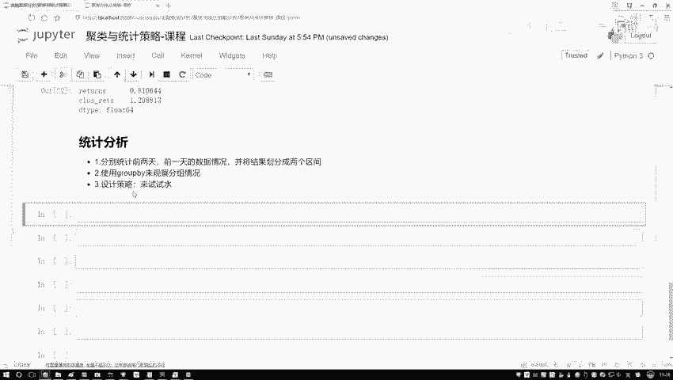

好了来说下一个下一个叫做一个统计分析啊，这个方法听起来好像更简单了一些，是不是统计分析啊，其实呃要坐在这儿也挺直接的，我说我现在这样吧，就跟那个的赌博式的，我是这样，现在不是有两天的一个指标吗。

就是有这个前一天的一个指标，然后呢我重新写一下，有这个前一天的一个指标，然后呢还有这个前两天的一个指标，我说我想基于频率去算一算行不行，什么叫频率啊，我说我看一下。

如果前两天都是都拿这个拿这个拿绿色画吧，前两天都是跌的时候，我算一算，第三天它是跌的可能性大呢，还是涨的可能性大呢，这可以在历史数据当中做统计吧，然后说我说哎呀，前一天是一个跌的，然后第二天是一个涨的。

我再要去看一看，接下来跌的可能性大呢，还是一个涨的可能性大呢，是不是也可以啊，但是不是还有其他种其他种那个方案啊，那接下来就这样，那你比如说这个前两天都是一个涨的，那第三天怎么样，但是跌的可能性大呢。

还是涨的可能性大，是不是一共还有大概也就四种吧，咱们不同的一个情况，我要分情况来去观察了啊，前两天的情况对于我最终的情况，然后呢我基于这个概率吧，看一看哪种情况下出现的概率高，那我就基于这个历史策略啊。

按这种统计方法，按照这种方法去买，看看咱能不能赚钱啊，方法其实挺简单的，跟大家说，这个方法并不是真让你用这种方法，这种方法太传统了，只是让大家去熟悉啊。

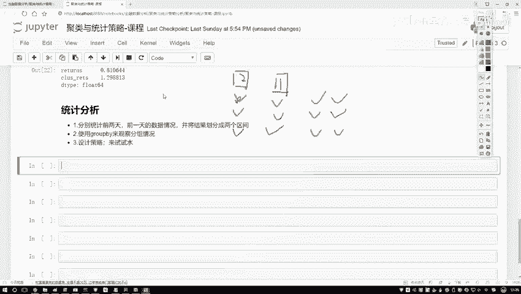

在Python当中唉，我提了这样一个需求，咱们怎么样去做啊，咱们重点是用Python把它做出来行了，在这个统计分析当中，我们来看吧，首先第一步啊，我要统计什么，我说统计啊。

这个前两天还有前一天的一个数据情况，并且呢我说按区间给它分开，唉哟这个东西咱们该怎么样去做呀。

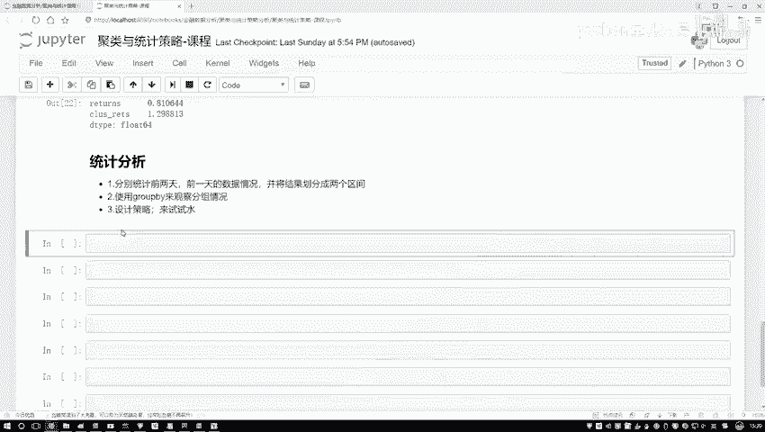

那是不是说我得看前两天还是一个涨了。

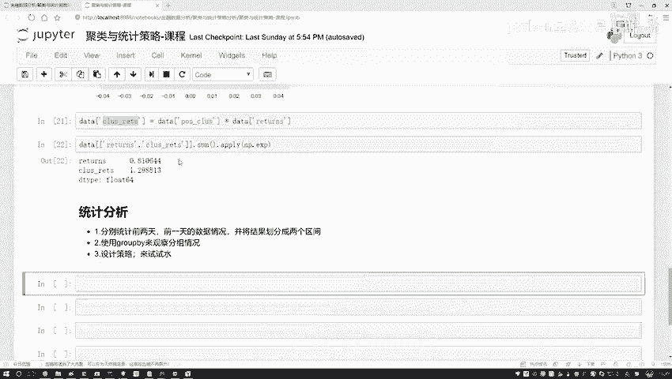

还是一个跌了，第一点，我有这样的一个数值层面上的一个判断吧。

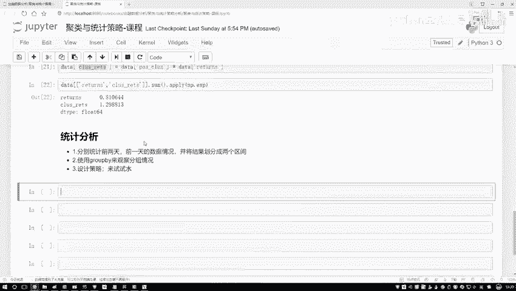

然后呢我把判断结果还列出来啊，知道前两天具体的情况吧，好了我说来咱们来写吧，写一个函数，这个函数叫做一个CP去构建一下，我刚才咱们需要的东西传进来我们的一个data。

然后BS当中就是一会儿咱们拿谁来做判断啊。

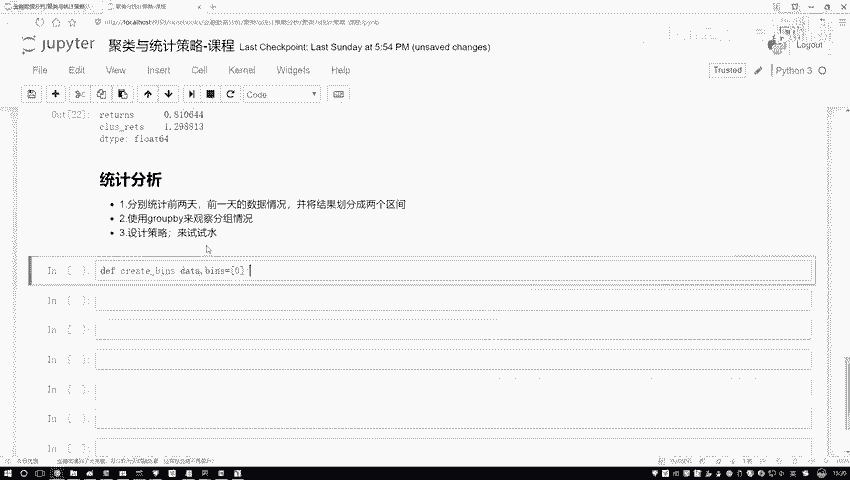

这个零现在大家可能看着不是特别明显，一会儿咱们来说啊，在这里一会儿我们要创建一个新的变量，所以说只定一个global啊。

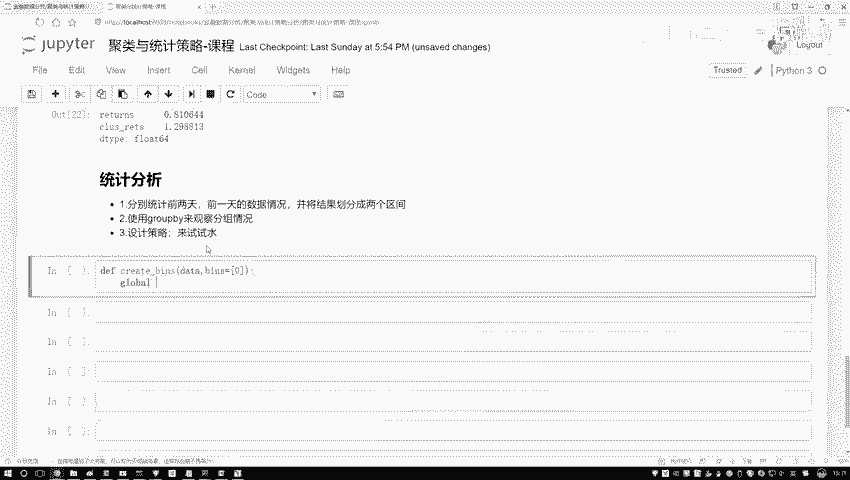

我的一个列名列名，然后把这个列名指定成一个list。

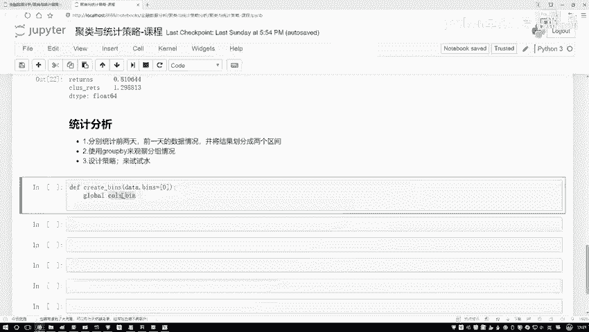

它是一个粒子结构，然后呢我说我去遍历吧，遍历一下咱们当前的一个数据啊。

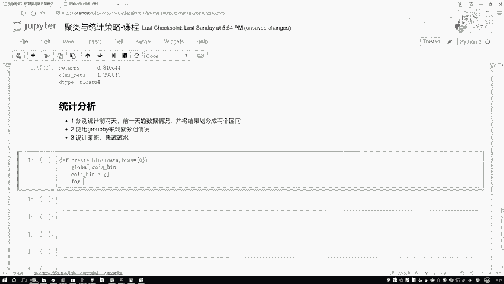

这个数据上面咱们是不是有就是前两天吧。

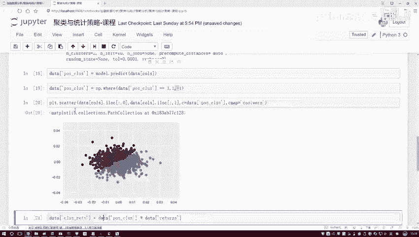

前两天指定个名字，我复制过来之前，我们定义好了吧，这是前两天的名字。

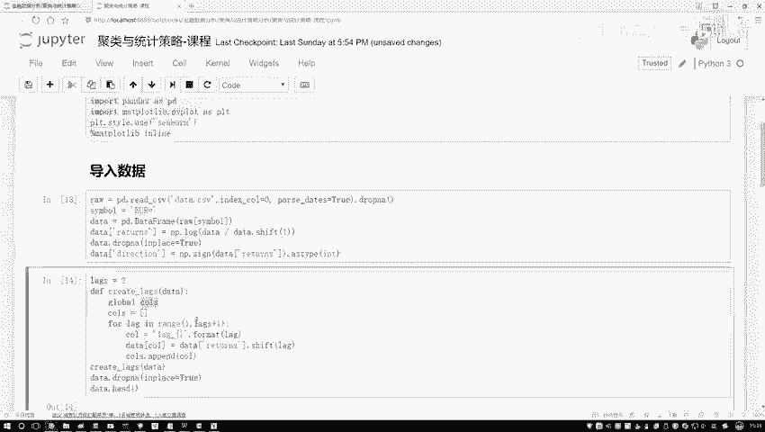

这里哎我们可以直接去用吧，函数里边这样能用完之前定一个全局了。

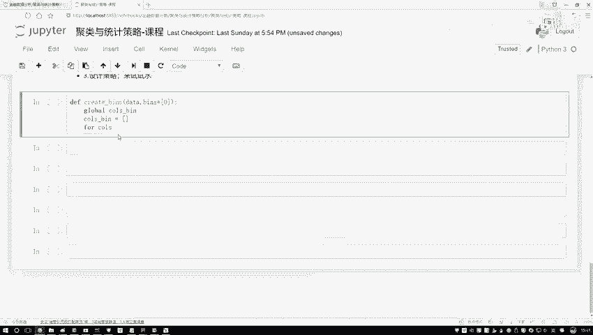

然后啊对于每一列，因为咱们刚才做好的一个特征数据。

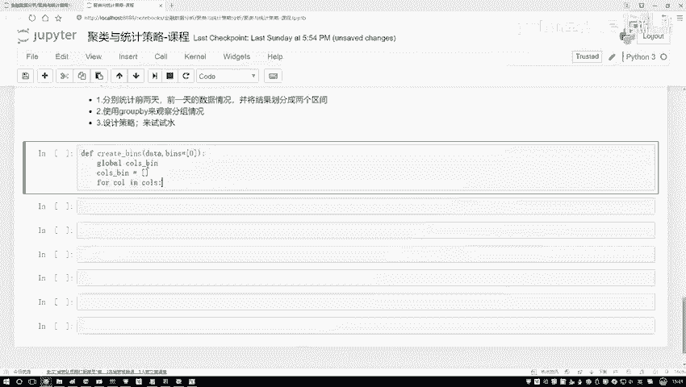

然后我说呢在这个特殊数据当中啊，我要去创建了一个B，一个B等于什么，先指定好它的一个名字吧，它的名字就是呃在原始的名字基础上，然后再加上点后缀吧。

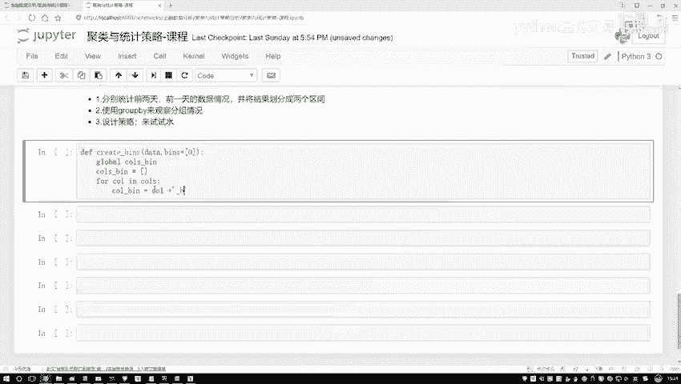

加上一个杠B就得了，然后接下来我们来执行这样一个函数啊，就是叫做谢谢大家解释什么意思，这个函数啊，就是它会帮我们去做一个分割啊，他会去帮我们去看一下当前这个数据诶，它是在零左边还是一个在零右边。

在零左边是不是代表跌了，在零右边是不是代表涨了，我们就做这样一个判断啊，就行了，就是判断一下他是在零的左边还是在零的右边，就是就是带着头这个函数去做一个判断吧，判断判断谁呢，判断数据当中我当前的这一列。

然后对当前这一列我怎么样了，我说我刚刚才不是要去做判断吗，这个BS啊，这里咱们判断的比较简单，其实不用这个函数也行，咱直接大小的判断是也行啊，这个函数点大材小用了啊。

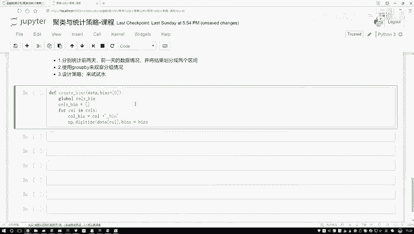

然后再看看吧，先看这个结果好了，这里我说我跟这个零做判断了，判断之后呢，我说我把这个结果啊放到我的data frame当中，指定一个新的名字这块写一个等号，做一个赋值是不是就行了。

然后呢把每一列这个名字，我说我判的进来，当前名字我看进来。

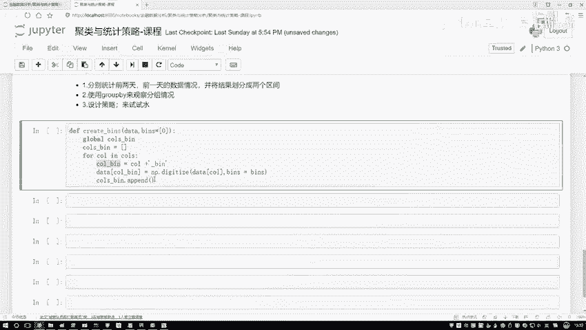

这就完事了，然后再执行一下这个函数，执行函数很简单，调用这个函数，然后去啊在这里把我们的一个data传进去，然后这就完事了，执行一下啊，执行完了，执行完之后再来这样看一下吧，看一下呃，我们这个数据啊。

它是长什么样子，我说点head一下。

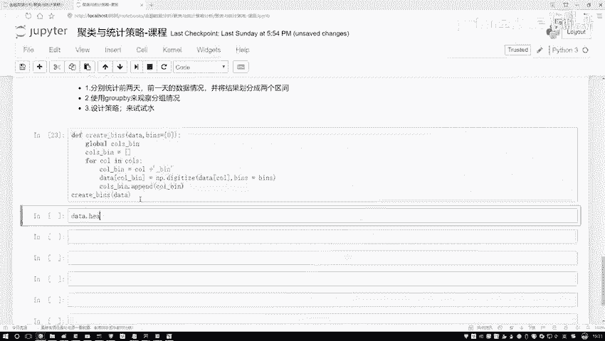

你看这里哎呦这个数据当中有点多啊，咱一会只选择其中的哎算了，我在这里直接选择其中的一部分呃，说data里边选择咱们刚才做好的。

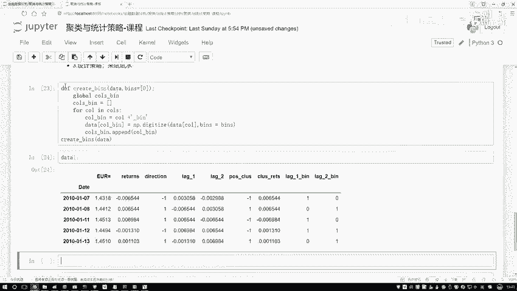

这个是我们做好的，然后呢点hit一下行了。

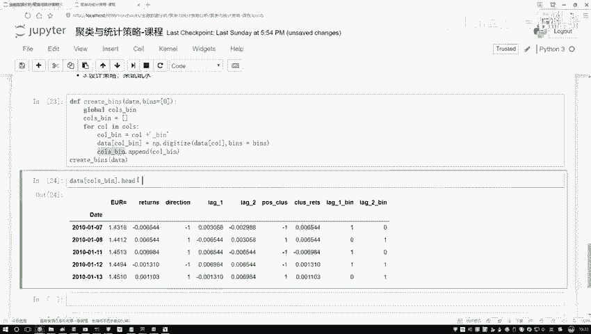

这里多什么，是不是多了一个零和一啊，像我刚说的，就是其实刚才说的挺复杂的，就是对我这个数据干了件什么事啊，对于每一列指标跟零做判断大于零啊，它就等于一小于零，怎么样。

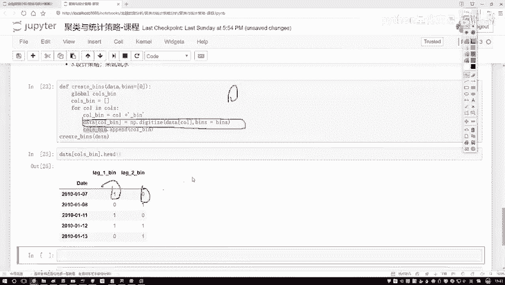

它就等于零了吧，这是咱当前判断，那就是一代表它是一个啊，涨了零代表他是个没涨吧，所以说第一行的数据的意思就是这样，前一天涨了，前两天的时候啊，没有涨，就是一个跌了这样一个感觉行了。

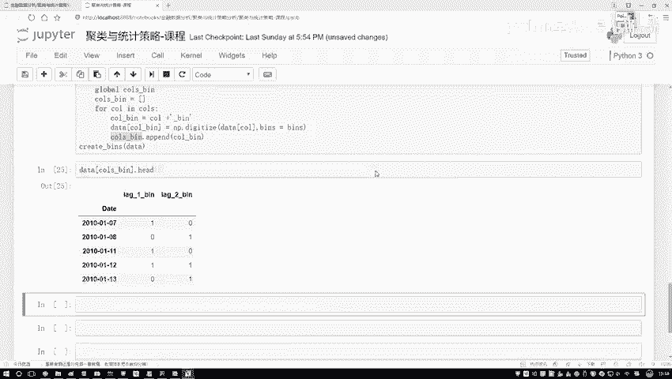

然后咱们把这个结果给画出来，画出来之后呢，哎你说哎这里还少了一个，少了个什么东西啊，咱在这个数据当中啊，呃还少了一列，就是看一下原始数据当中，原始数据当中有一个direction。

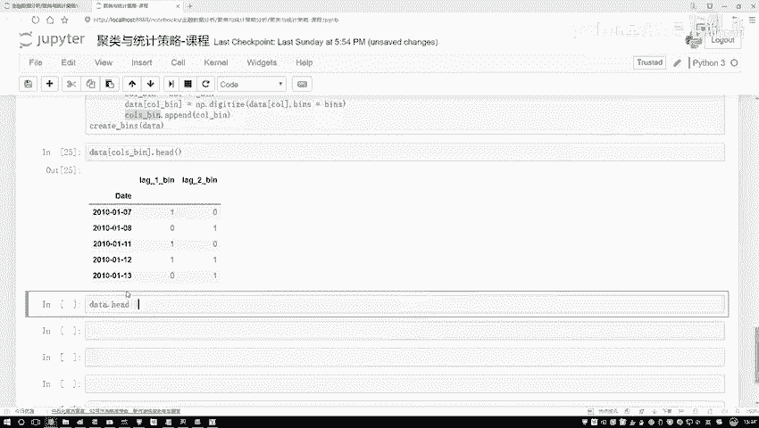

用数据当中有什么有这样实际的一个方向吧，哎咱们一会儿不要统计吗，这是不是它实际的一个方向是怎么样了。

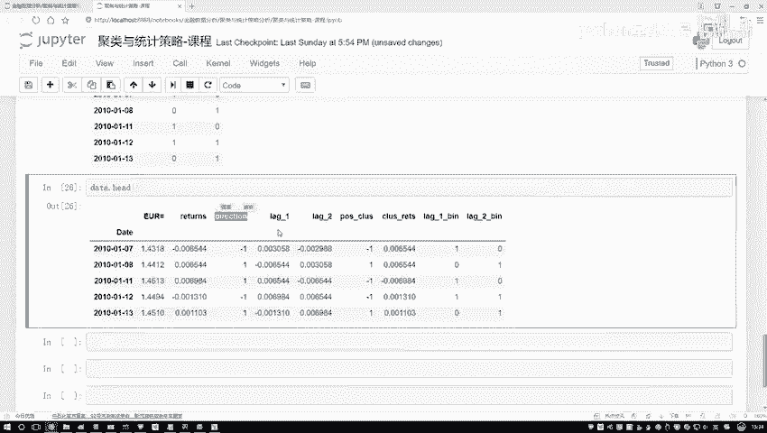

然后呢，我说我要统计这两个指标，就是呃一个L1啊，这是前一天，然后一个2L21，前两天，然后前一天什么情况，前两天什么情况的时候，我实际是什么情况。

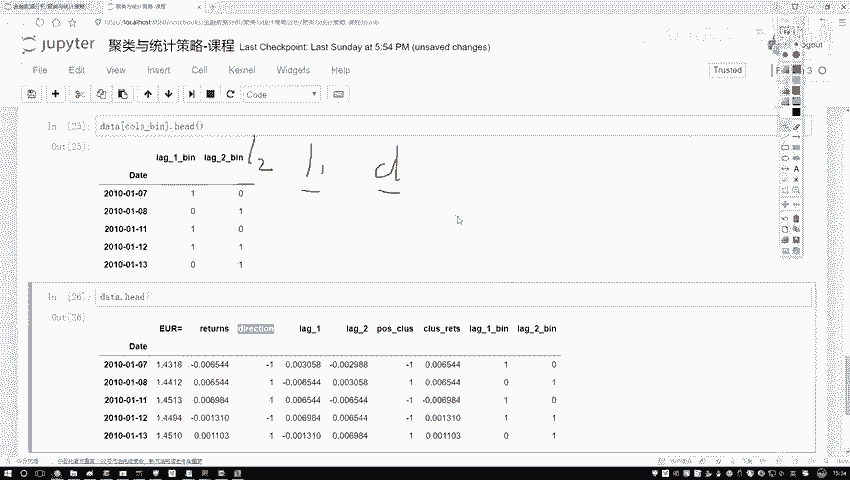

所以这里有个destruction，它表示的是一个实际的情况啊，一会儿咱得把这个给他用上行了，问问大家咋做吧，我说我现在啊想要去分组统计了，哎呀各种情况分别有多少个各种情况。

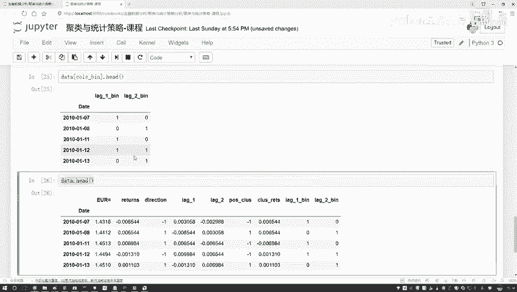

然后他们的一个组合那怎么办啊，有没有函数能帮我们去做呀。

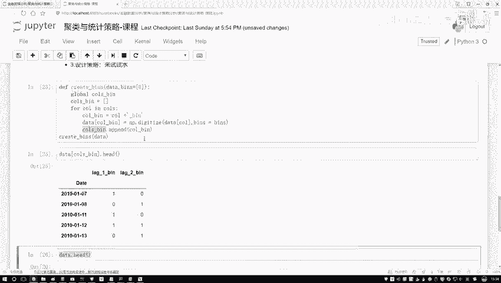

谁呀，你看这里名字都写出来了，用什么，咱之前讲那个pandas的时候。

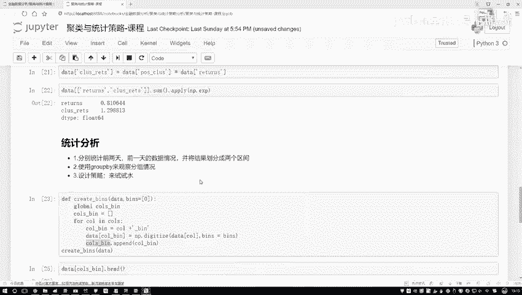

不是说有一个方法叫做一个CPBM啊，用它来做属于完事了。

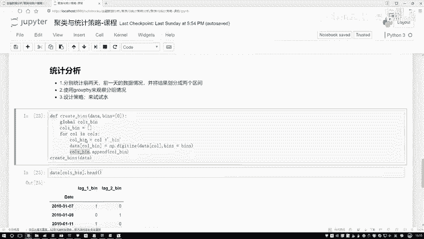

非常简单吧，算了，这直接大家去写吧，data直接干什么，直接的，我去group by一下，里边传进来一个参数不就行了。

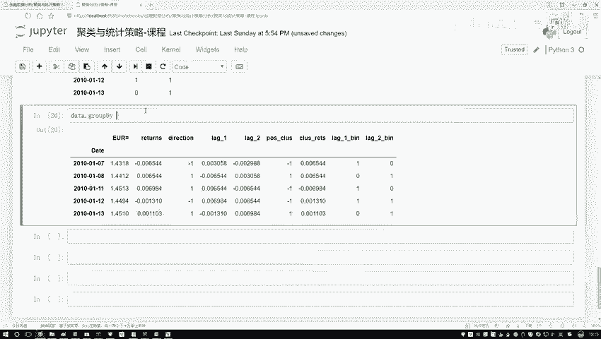

传递参数，那就是你把你需要的列名全给传进去呗。

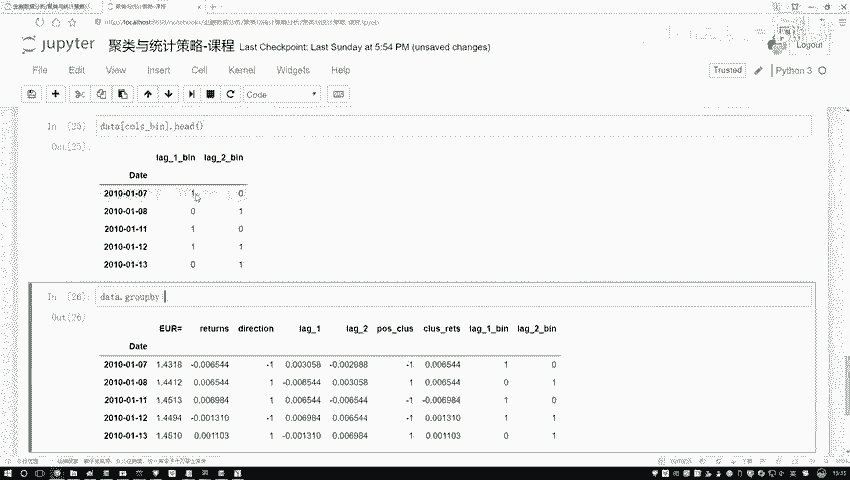

需要谁呢，按照前一天前两天那个情况，并且还要加上什么。

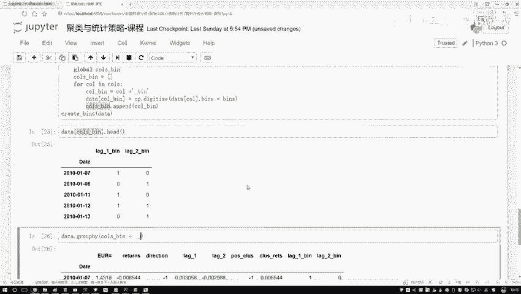

还要加上咱刚才的一个方向吧，实际的一个情况吧，好了这样我做一个googbgo by完之后啊，嗯放完之后赋一个值吧。

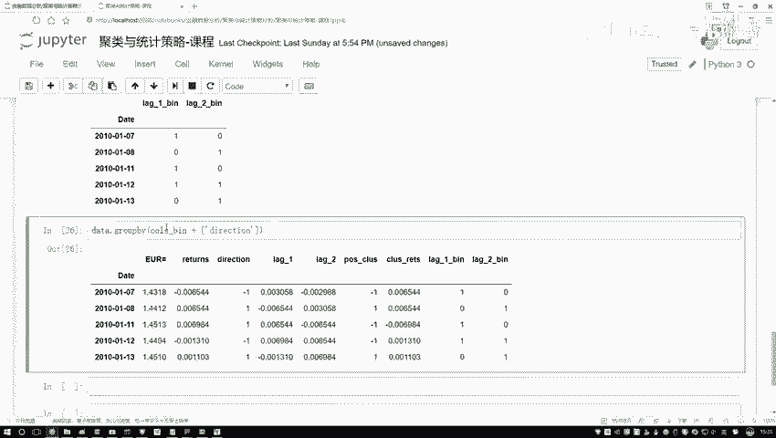

我说它等于一个group的结果，然后执行一下。

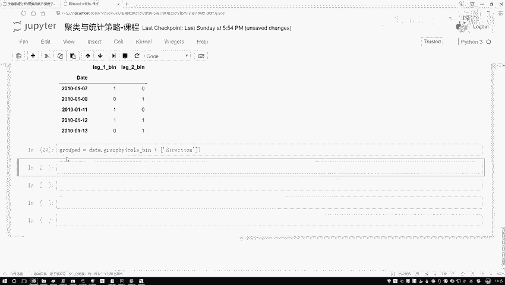

执行完之后再来看一看当前这个结果吧，其实看这个结果看不出来什么东西，你要看的就是呃各个可能性出现了多少次吧，就是比如说前一天跌了，跌二天跌了，然后第三天啊跌了涨了还是不变他这个情况吧。

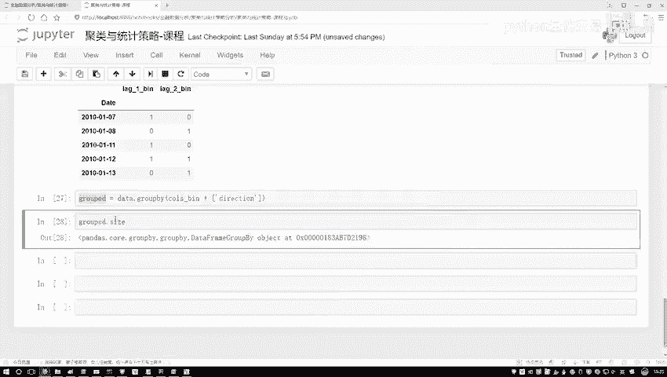

所以说我们看一个size就能打印出来这个情况了，你给我打印一下情况是不是都出来了。

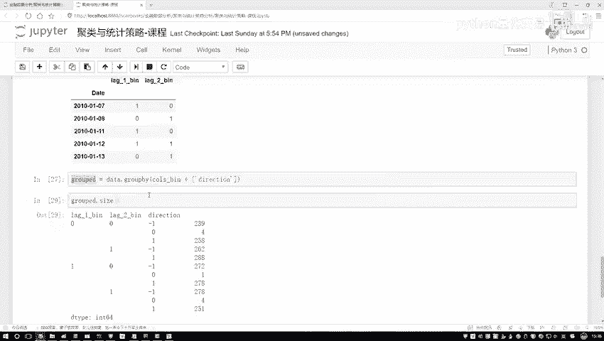

来看几个指标啊，前一天跌了，前两天跌了，然后当天的时候，然后它的一个呃它的一个情况啊，是等于一个没变，还是等一个跌了，还是等于一个涨了的情况。

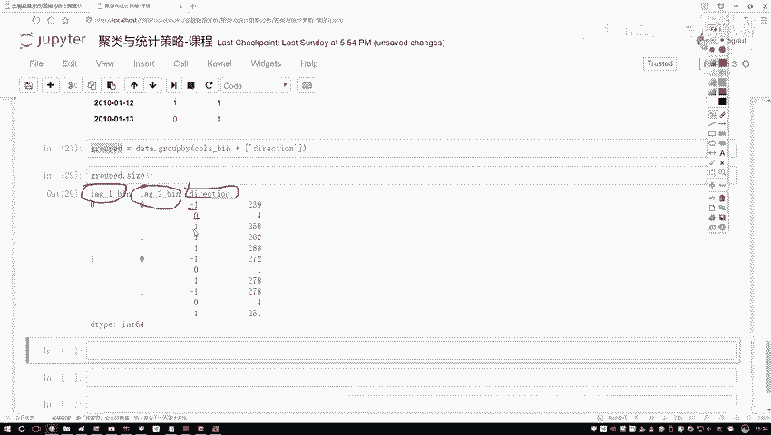

是不是有了，这是我们前三个，然后下面呢下面当中就是这前一天跌了，然后前两天的时候是涨了，然后当天的时候哎这里他因为他把这个零没写，因为这个零怎么样了，零这块他是零了，然后没有出现。

所以它自动的把这行给我过滤掉了，在这里我们一个点下完之后，是不是咱就得到了所有唉，我们想要的一个结果了。

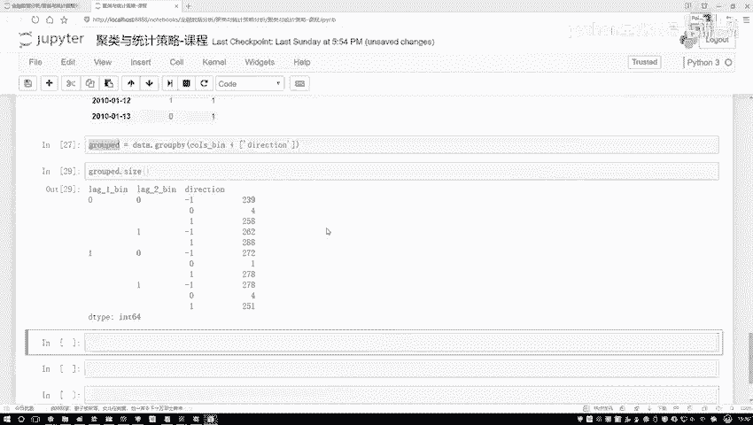