# 人生苦短，我学量化！比刷剧还爽的python金融分析与量化交易实战课程！——时间序列分析／机器学习算法／股票交易／回归算法／聚类算法 - P74：74.亚马逊股价趋势P75(P74) - 请不要关注我- - BV1Bz421y7Tu

刚才咱们已经做出来了一个基本的模型，那下面呢我们要做的就是，怎么样，让怎么样能让这个模型看起来能够更好一些，做这样一件事儿，还是那些库啊，就是这些库啊，大家之前都已经按过了，那这回呢还是把它们导进来啊。

就是啊我们继续来做这个事，然后这回呢我们换个股票吧，换一个亚马逊的股票，看一看是不是也是呈现出来这样一个事儿啊，然后这个亚马逊的这个股票就是AMZN，然后这个家伙这个股票我觉得就更牛逼了。

这个股票更牛逼了，因为他那个老总啊，毕竟也是登顶过全球首富的人嘛，现在手是谁啊，我不太清楚啊，反正之前有段时间就是亚马逊的老总吧，他们创始人然后登顶过那个首富吧，所以说这个股票还是蛮有发展的。

这股票还是蛮狠的，再来看一下他这个情况吧，这个情况他是从这个九几年，他是呃我看一下最低价，最低价是97年5月22号，然后现在呢最高价是这个123啊，这是我1月23号那天执行的。

然后呢他的收盘价是1362。54，这个反正对于股票来说啊，我我对这个股票价格的概念不太清楚，我也不知道这个1362，在这个行业当中算是个高价呢，应该算是高价吧，觉得备注是一个应应该已经登顶的价格。

这个呢就是它股票整体趋势，这个就不给大家画了。

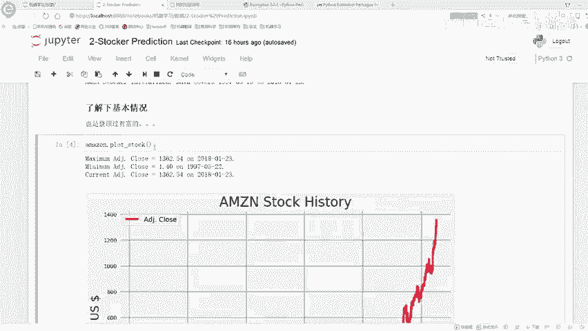

这个东西咱都看过，咱就不看了，然后呢又看了一下他的浮动的一个情况。

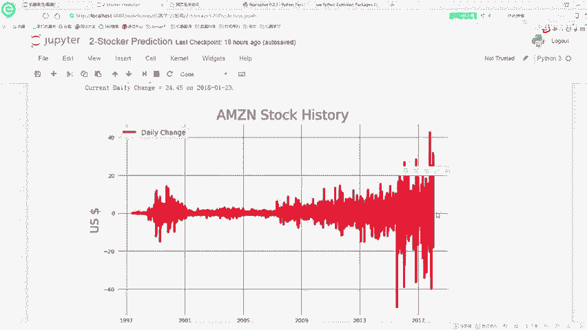

这个浮动情况看起来还是蛮大的，因为在这里你看它有时候上上升下降上升下降。

但是总幅度还是进行一个上升的趋势的。

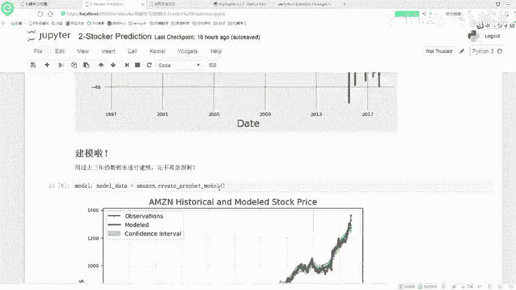

所以呢还是要构造一个基本的模型，进入模型啊，它是长这个样子的，这个样子是没什么问题的，然后呢还是啊这个黑色点是真实的。

这个这个绿色点是咱们预测的，其实大家发没发现这样一个事啊，它真实的模型啊。

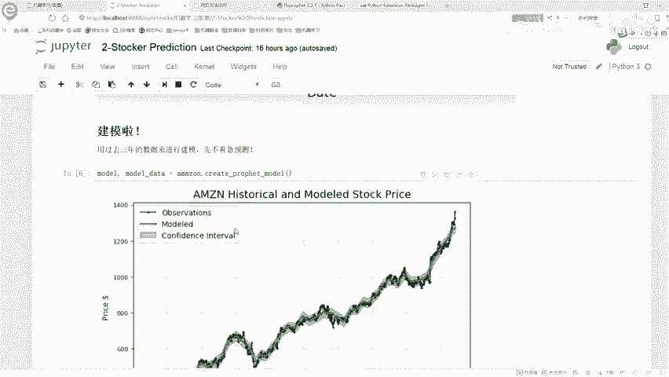

可能来说就是嗯就是那个突变点更多一些，但是咱们预测出来的模型呢，普遍来说啊都是咱们更均衡，更平稳一些，这个呀也是我们暂时希望的一个思路，就是我们希望这个模型啊别太去过拟合。

因为一旦你把所有突变的点都找到了，那可能就完全过拟合了，这个趋势可能就不太对了，我们要预测出来，模型可能还得就是朝着平稳一些，这样的一个方向更把握一些的，然后这些都是一样的，这些咱们也不详细分析了。

我们也不关心这股价到底怎么样，也不去买股票，这些就不看了，给大家主要来说它有哪些功能，然后呢我们要去预测，我要去预测未来90天的，在这里啊，就是我先随便建立一个模型，在这里我们什么参数不调。

只写一个D等于90，在这里呢当你写了一个days等于90之后。

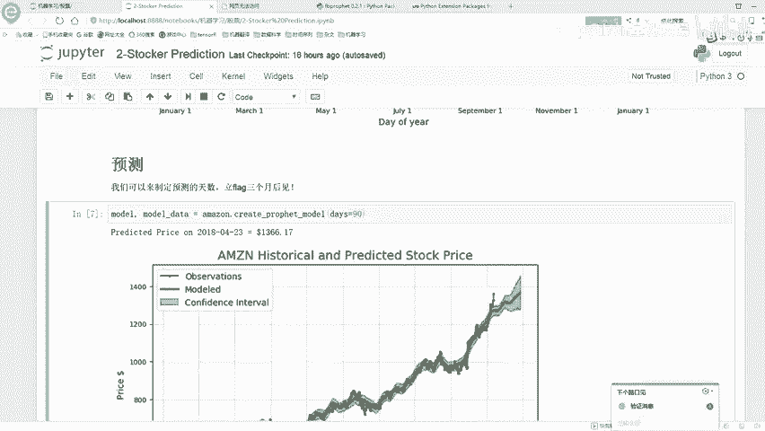

在这里啊，就是当你写了一个D等于90之后呢，我们得到的结果是什么样的，结果就是你的它明显应该是一个上升的，但是呢它这个东西啊，却是一个比较平稳上升的一个模型，你看这个绿色是他预测出来的结果。

然后呢他预测的值啊，在这个4月24号，反正今天今天是今天，反正是三个月之后吧，预测3月之后是1366，我不知道大家到时候看视频的时候是哪天，要是真超过了4月24号。

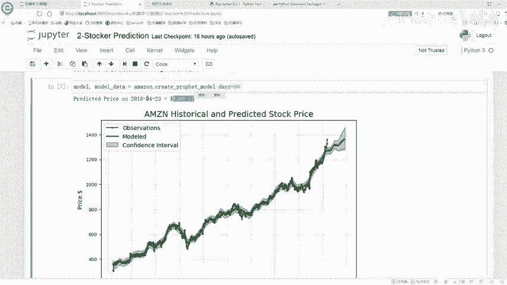

那这个时候就是你这样，你可以把那个C24号那些数据拿出来看看。

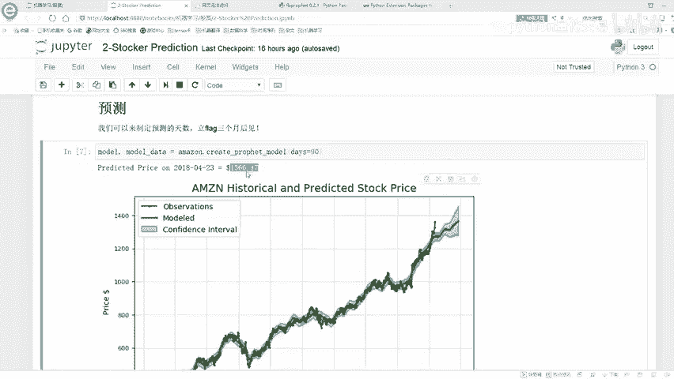

看看是不是1366，估计肯定是跟这个数有一定偏差的，现在咱们预测完这个模型之后，这是基础模型，预测完之后发现这样一个事。

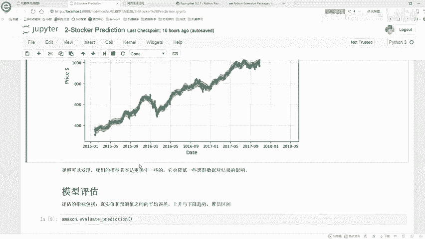

我模型怎么样更保守一些了吧，其实呢他这个应该是明显往上穿的，我估计要穿的更高一些，因为今年这个东西，它是这个公司可能越来越牛逼了吧，反正我我对这个公司也不是特别了解，没上买过东西啊。

因为国内也很难去上这些网站的，然后在这里呢就是应该明天晚上穿的，但是它更保守了，所以说我们发现模型更保守了，但是呢它会降低一些离群点，还有这样一个突变点对我结果的一个影响的，在这里呢咱们先提出来。

这一点就是我的一个模型的一个评估，模型的评估啊，咱们这里说你说我要去怎么去评估这个事啊，咱们来想现在要去评估，哎呀这里我现在就是往简单来说，咱们这种评估，比如说我预测值是一个值，真实值是一个值。

我预测值和真实之间我会有这样的一个误差吧，就会有这样一个差异，那现在呢比如说我在这里我选，我想选一部分，就选这个17年吧，17年之前我当训练机，然后一天之后当测试机。

这样我就可以看训练集它的误差是有多大，测试集它的误差右手有多大，这些误差啊，我们都是可以自己的实际算出来吧，就是真实值和咱们实际值之间误差，说白了就是这样一个绝对值嘛，这个值可以可以看出来，这是第一点。

我们要看一个误差，第二点要看什么，第二点我要看的就是当前这个指标啊，如果说它实际的是一个上升趋势，那我们预测的它是不是一个上升的趋势，如果说它实际它是一个下降的趋势，我域名预测出来它这个下降的趋势。

也就是说在我评估的时候，第二点要考虑的就是这个趋势，我们预测没预测对。

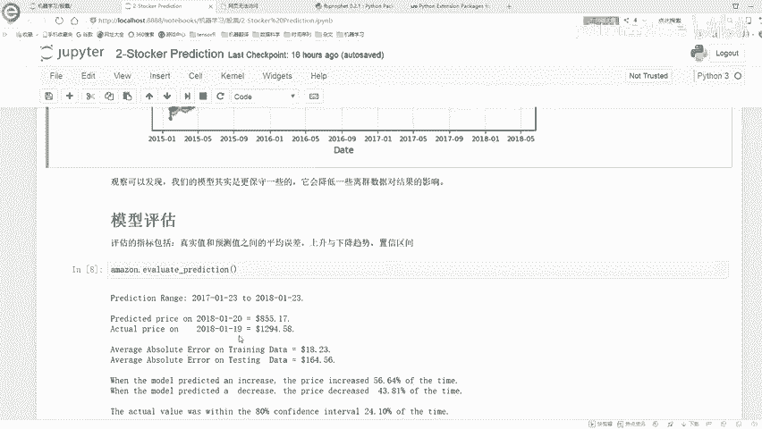

在这里呢有上升趋势，还有下降的趋势，我要看一下上升和下降趋势。

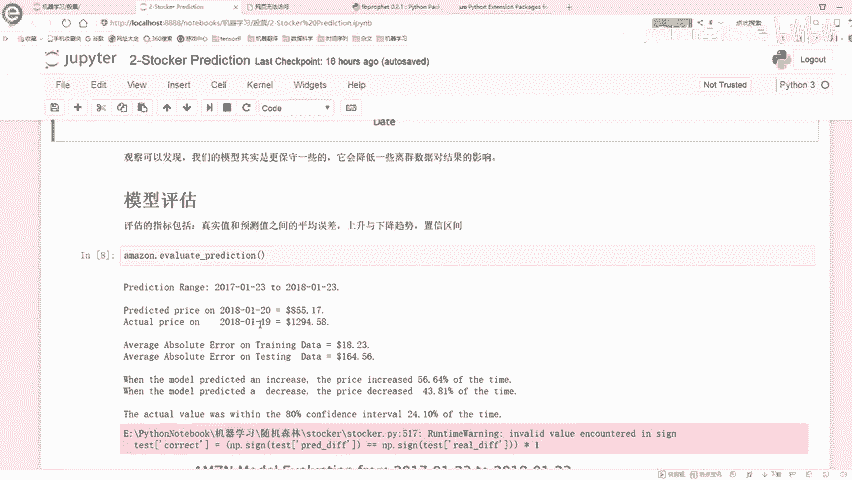

分别都做没做对这个事儿，然后在这里我们还是来debug。

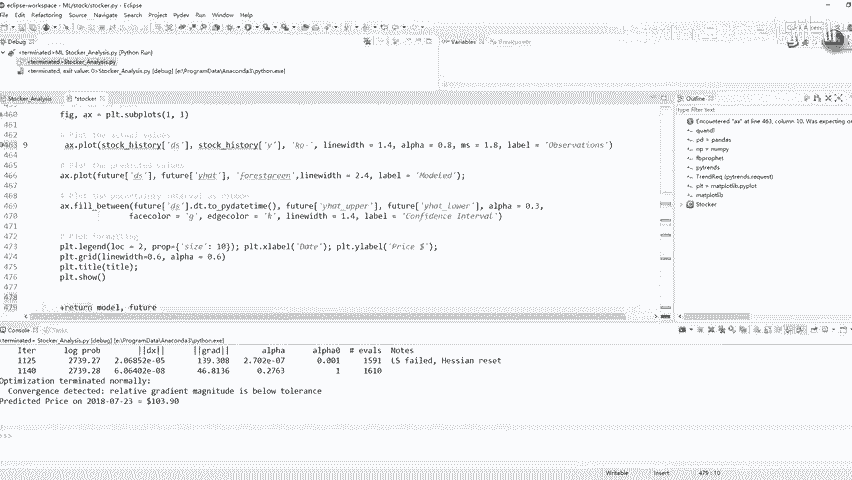

debug完了，然后这里呢这里写的比较少。

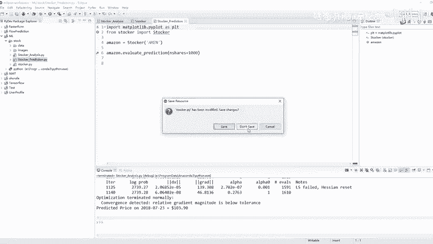

这里我写的比较少，来看一下哦，我先看一下，这里我看一下，把这个直接复制过来吧。

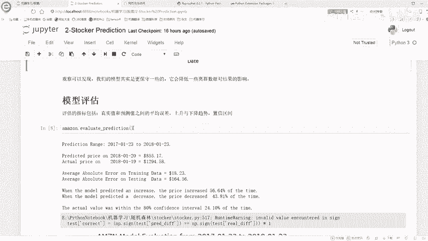

这里我先去构造一个模型。

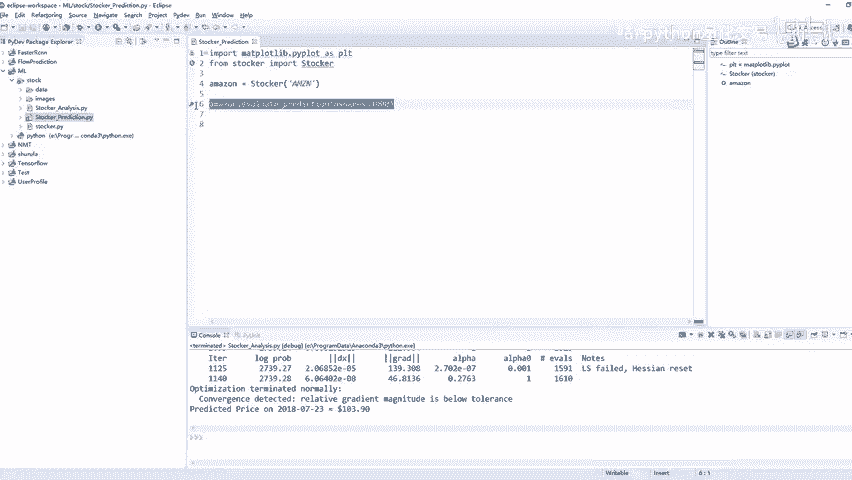

哎我看直接跳，直接跳，这里可以吧，前面的东西又复制过来吗，前面东西不行。

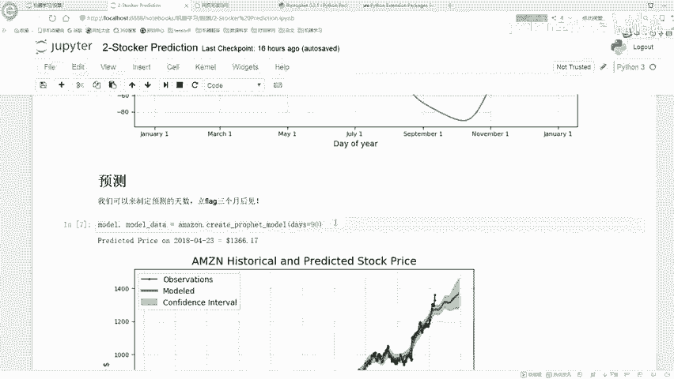

前面的东西我还得去把这个东西啊，模型先构造出来，把股票拿到手，然后构建模型，然后去评估这个没问题了，然后这个第二第二咱就不看了，建模一样的，咱们直接来看评估这块还是第八个项，这个这个利普斯已经帮我帮。

完全当成是我的一个，就是嗯讲课给大家去演示了一个debug的功能了，因为我都是这么觉得的，就是你自己看他的代码，其实我之前我我带过一些线下班，我在线下班的时候，之前同学去看代码的时候。

他们一般情况下都是从头到尾去看，然后看我觉着这东西还能看出什么，还是觉得比较难理解吧，最好呢就是能debug1遍，你看debug的时候，你看一下这个值是多少，那个值多少，本来这个代码其实挺难懂的。

那你就是你看代码，你不知道啥意思，那你看值我觉得十有八九你也才能猜出来的吧，因为我去看别人代码的时候也是这样的，别人代码其实很多啊，也不一定我第一遍直接看函数，你直接看函数啊，也不一定能看懂吧。

一般情况下从头到尾debug1遍，自己走一遍，走一遍之后，心里差不多就有个数了，给大家尬聊这么长时间，他还没有去给我跑完，咱咱咱还得再尬聊尬聊一分钟，这东西看起来蛮慢的，然后我这个CPU是8700K啊。

已经8000，但我估计大家可能没有我这个高一些，因为我当时是我这个不是辅助，我这个还不是专门因为当服务器的，只是放到我这个家里啊，给大家做这样的一个演示的一个功能的，哎呀又尬了又尬。

聊了这么半天还是没有，还是没有跑完，这里面可能就是这个数据嗯，怎么说呢，怎么说呢，怎么说我也不知道怎么说，他就是比较慢，还没有到我这个断点上，那咱再稍微等会儿吧，哎我看这块这块怎么已经预测出来的结果了。

最后打印出来预测那天结果。

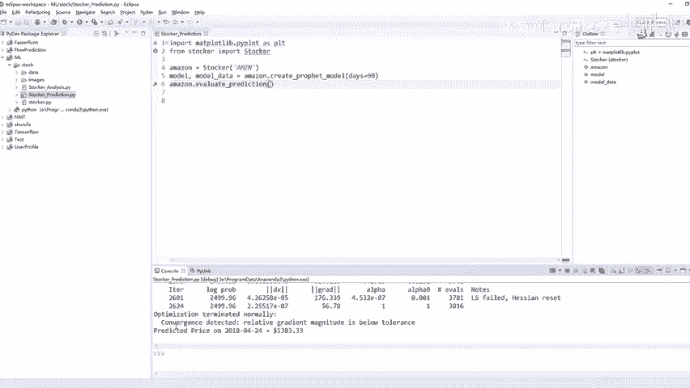

但是没有给我跳到这个评估里边，这么的吧，咱先看看结果吧。

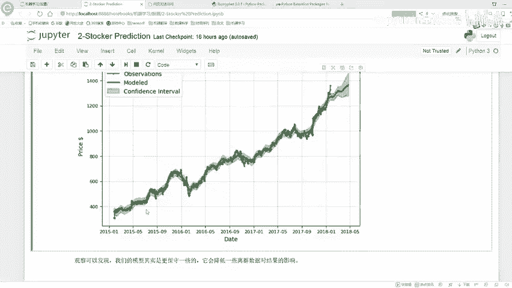

咱先看结果，然后再来说他这个模型哦，哎呀我玩二了这块专业店，这样就是他会给你画出个图，你需要先把这个图给它关上，它会才能继续往下给你运行，我这个图一直没关，我还傻等呢。

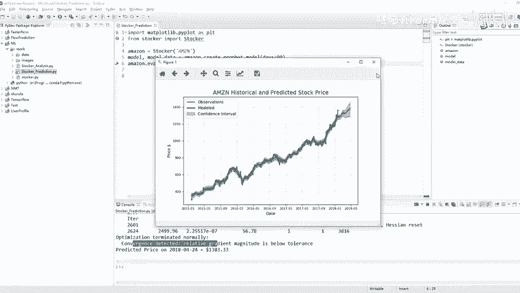

尬聊了半天，然后给关上，这个他就进来了是吧，大家注意一点，就是在list里边，他是至于这块它会跳出来图，跳出来图之后，他会等着等着你把这个图关上，关完之后，他才会给你往下跳，我就说这个尬聊这么长时间。

怎么还没给我读完，首先一样啊，还是给你找这个起始和终止日期啊，你看17年诶，star起止日期怎么怎么怎么这么钱，其实日期啊它是一个一级，我看一下这块啊，因为这块我只我只选择了一个一年啊。

这块一个我只选了years等于一年，所以说我现在起始时间是2017年，1月24号，终止时间是2018年1月24号，那部分是jr当成是我的日期，然后呢对于我的一个训练数据，训练数据是取的是3年的。

就是14年到17年，然后测试就是训练数据，14年到17年这3年，然后测试数据啊，是这个17年到18年，这一年就是3年三年的时间来当成是一个训练，一年时间当成测试，但不要忘记点啊。

这个测试集一定是要有真实的一个指标的，所以说测试结只能是从今天开始，往前推这么一年，然后训练集呢就是往前推，那么4年往前推4年，代表人取3年吧，这个意思，然后分别把我的测试数据按照日期都拿到好吧。

拿好这里，我还是先去建立一个模型，来feat一下我当前的一个训练数据，分列完单元数据之后呢，然后接下来预测吧，接下来预测的时候，你在这里指定365，什么意思啊，你要预测出来接下来的365天吧。

所以说这块feature我们把这个东西拿到手，他是从17年一直到这个18年的1月23，所以说这是咱们当前的一个指标，然后呢我去在这里有去project一下，就是实际的去进行一个预测，这块这块又稍微等诶。

这个蛮快的，是预测错，预测预测完了，然后最终呢我就得了18年的结果了，然后呢把我当前预测完的结果给他word进来，就是把我的结果拿到手串的，结果呢也给他拿到手，这回呢咱们就来看吧，咱们先算这个东西啊。

先算一个这个difference，这个difference，他的意思就是说嗯，我按照我前就是按照今天减去昨天这样的一个，这样的一个指标去进行一个计算，他这个意思说白了就是我这么一减，得到一个正数。

说明就是我是一个上升的预测，是上升的趋势，我一减它这个负数，那不就是预测它是一个下降的趋势吗，这里就是通过这个函数啊，帮我去看一下，在当前这个当前咱这个幅度啊，它是一个上升还是下降的一个幅度的这块呢。

我没有去打印值啊，如果说大家不清楚的情况下，你可以去打印一下differ之后，结果说白了就是我拿今天跟昨天去比较，然后把每一天和前一天的差异值拿到手，拿到的是这样的一个差异值啊，然后这块SIGN啊。

这个函数它的意思就是说大于零的情况下，它是就是等于一的，小于零的情况下，它就是等于零。

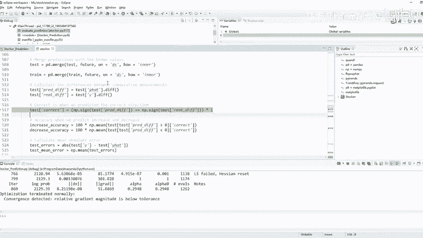

就是的就是等于零的，它是这个意思，给大家来看一下这个函数吧，这个函数大家当大家就是读的时候。

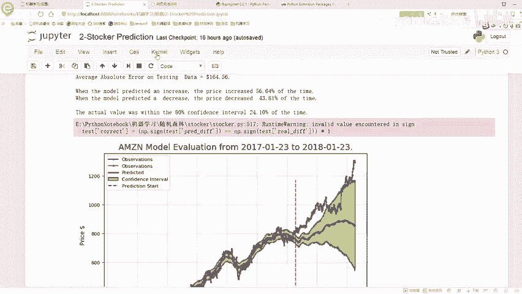

如果说你遇到哪个函数，你不太了解不了解的时候怎么办呢。

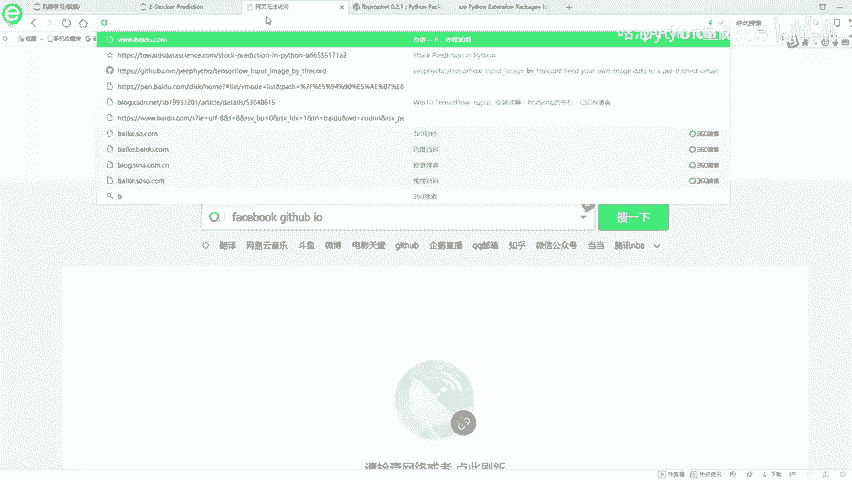

比如这个函数啊，我现在也不会了，我这个函数也不会了，我就百度一下吧是吧，这个南派直接定它的文档当中，他就会告诉你，如果说当前它小于零的时候，它是等于一的，大于零的时候呢，它是大于零的时候，它是等于一的。

等于零的时候等于零的，忘了不要紧啊，这些我也忘，忘了之后怎么办呢，忘了就代表不确定，你看刚才我刚才我刚才我想什么来着，我被误认为它是小于零时等于零呢，那不确定自己查一下，查一下这个函数啊。

你就查这个南派的一个官方文档，你在这里啊去查一些函数，我们都可以找一个结果吧，这里就是说遇到哪些东西啊。

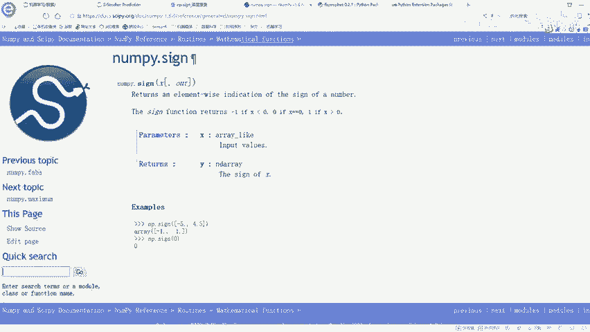

不会了，实际查一下，我也经常查，你说整这么多东西啊，我一天记的东西其实也蛮多的，我能记住吗，大部分情况下都记不住的，记不住怎么办啊，用的时候现查呗，但你知道这个东西它是怎么一回事。

然后一看你就会明白起来，这就是我们得反复去查，因为每天都在忘一些东西的啊，这块我看什么，这块算是我的一个上升的趋势来说，我预测对了百分之多少，预测对了56%吧，这块区域又统计了一下上升的趋势。

你预测对了多少，这块呢就是在我的一个预测点啊，我看了一下他的一个大于零，然后算了一下他的create值，然后它的实际情况，你看这里是算的实际情况吧，实际情况就是预测的和真实的是不是一样的。

如果说他俩是一样的，那你预测对了不一样，预测错了吧，道理一样的，这里呢就是你这个增幅预测对了多少个，然后这个降幅预测对的百分之多少，你看这56%，这个43%，这看起来很低是吧，相当于就是50%左右。

就是相当于蒙嘛，这个数你蒙大概能蒙对多少，我估计现在来说，对于股票咱现在当前这个模型来说，做的其实还不好，还是在蒙，然后test error，然后算他那个mi error值。

然后train error算个命error值，这些都好算吧，就是一个Y它真实值减y head的值，就是真实值和预测值之间的差异值，然后你可以选，你可以看这个train的error。

还有test error，这两个我们都可以去给他指定的，然后呢指定完之后啊，这里我们最终要干什么，最终我们要算一个range值吧，这个range值啊，就是我的一个对up值和lg之间的一个。

就是中间的一个差异值，最后呢我们再来看，最后就是我去打印这些指标了，打印这些指标，然后我去画这个图，画这个图比较简单，直接跳到最后了，我去搜一下这个图就完事了，那这块呢直接干没了，直接干没了。

这块没法去粘代码。

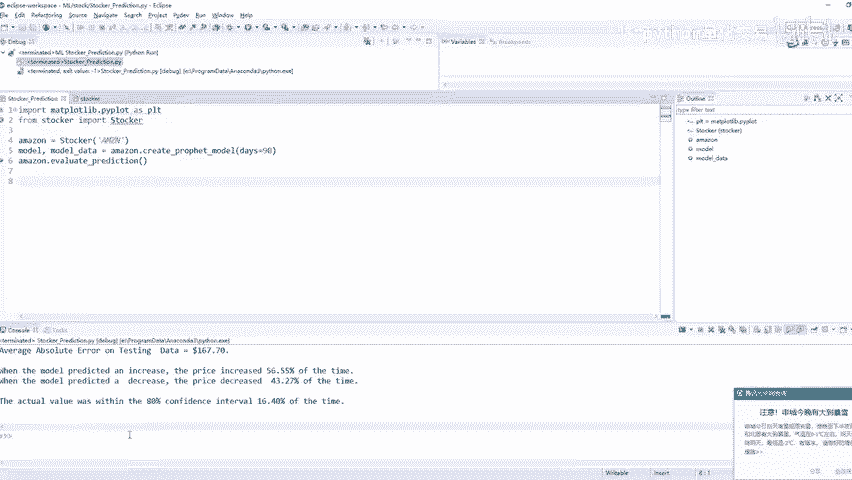

这么的吧，咱回来看吧，回来看这个图，你看这块就显示出来结果了，然后再来看一下吧，我预测的是这个从17年1月23，到这个18年1月23，预测这么一年啊，然后预测到的1月20号的一个值是800多。

但是这么一天啊，它实际的一个值是1000多的，1200多，所以说就是预测值和真实值之间啊，在咱们当前这个模型上是差异比较大的，咱们来看这里咱们平均的一个差异啊。

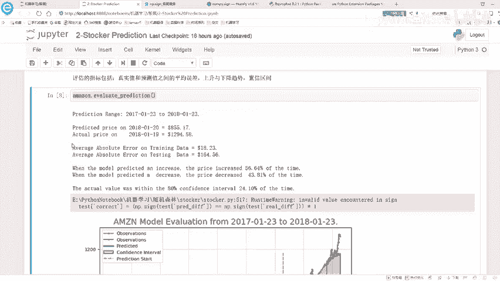

平均的一个差异就是我训练集，它平均的一个差异大概是18块多，然后测试结它平均的差异大概是160多，那看起来这个东西还是蛮大的是吧，然后呢下面打印刚刚那张值啊，就是你上升的有多大，有56%预测出来了。

下降的趋势有43。81%预测出来了。

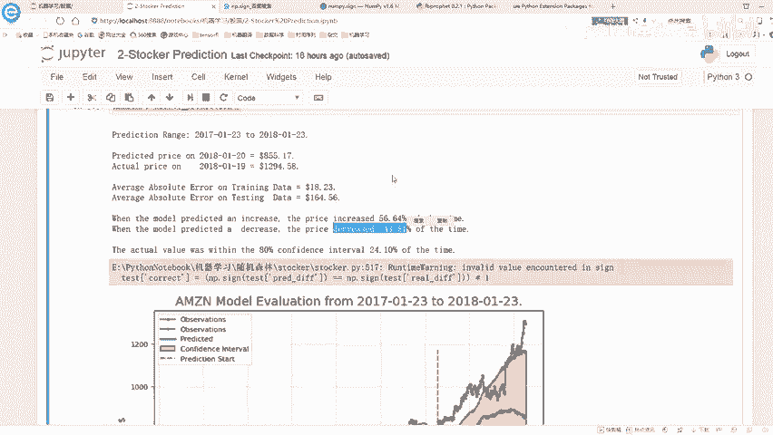

然后呢在我这执行区间上，大概是有20%多的数据，那下面就是我当前这个图，当前这个图啊，红色这条线就是说我从哪开始去预测到，从2017年1月份开始预测到这条红色线，表示这个意思，然后呢再来看吧。

这里有几条线啊，这条蓝色深蓝色能看清吧，这深蓝色对于深蓝色线是我实际的预测值，然后对于这个黑色的是它真实的一个走势，那这里咱们来看现在这个情况来说，是一个明显趋势，什么预测值和真实之间差的比较大吧。

这差的太多了，其实差了好几百了，那这里明显趋势是什么，你看咱这个模型走的，稍微来说是看起来有些平缓是吧，但是上面的实际情况它没那么平缓，那我们怎么样能够捕捉到这个信息啊，所以说接下来我们的目标就是。

现在这个模型不太好，那我该怎么调参，能让这个模型做得更好呢，它能抓到它这个上升的趋势啊，能把这些突变点，能把这些上升下降预测得更准确一些，这个呢就是我们一会儿要做的一件事。

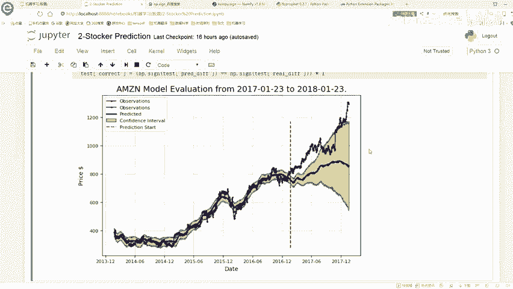

怎么把这个模型啊进行一个调整啊。

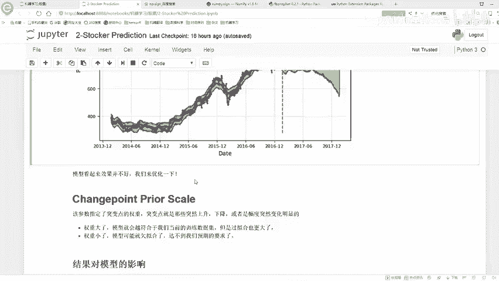