# 什么策略是每个人都接触过的？一个指数就是一个量化交易策略？【量化交易邢不行啊】 - P1 - 量化交易邢不行啊 - BV1MoqzYZEA7

论量化模型。

它不是人脑来决定交易的品种方向，时机和数量，这样形成的策略就是一个量化投资策略。

很多人都觉得量化投资很复杂，自己学不会，但如果我说，其实90以上的交易者早就交易过量化策略了。

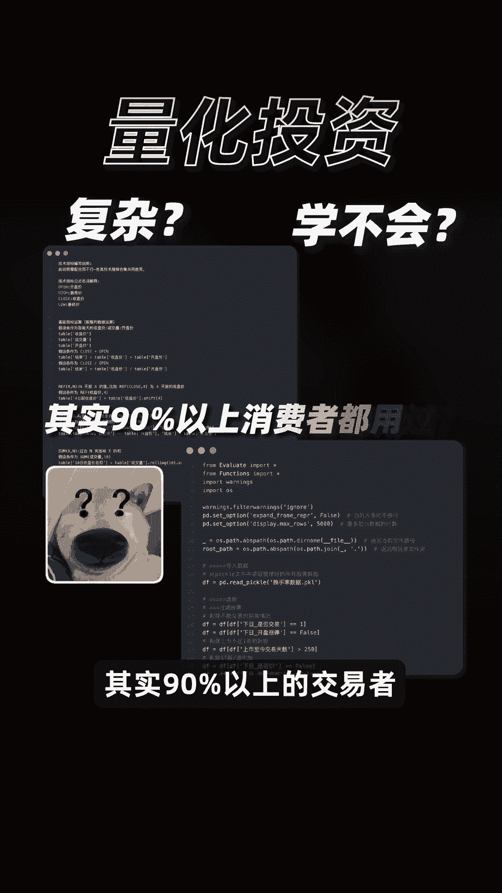

你信吗，比如绝大部分指数，它本质上可以算一个量化策略。

举个简单的例子，比如今年最火的红利指数，我们去看看比较有代表性的中证红利。

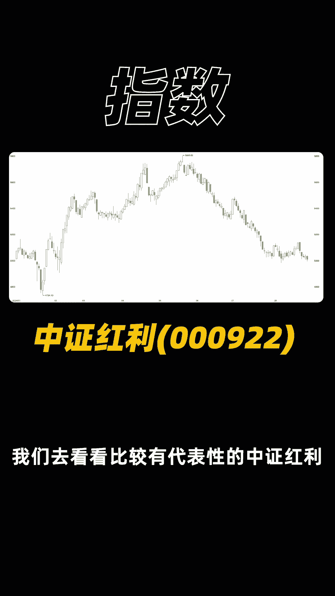

翻译一下他的选股要求，不就是先按照过去3年连续现金分红。

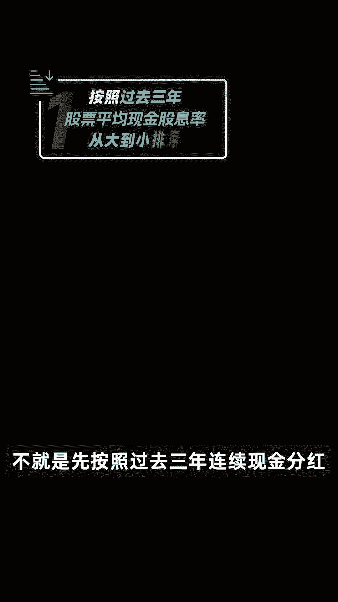

过去3年股利支付率均值，和过去一年股利支付率大于零，且小于一，这几个条件去选出一批股票。

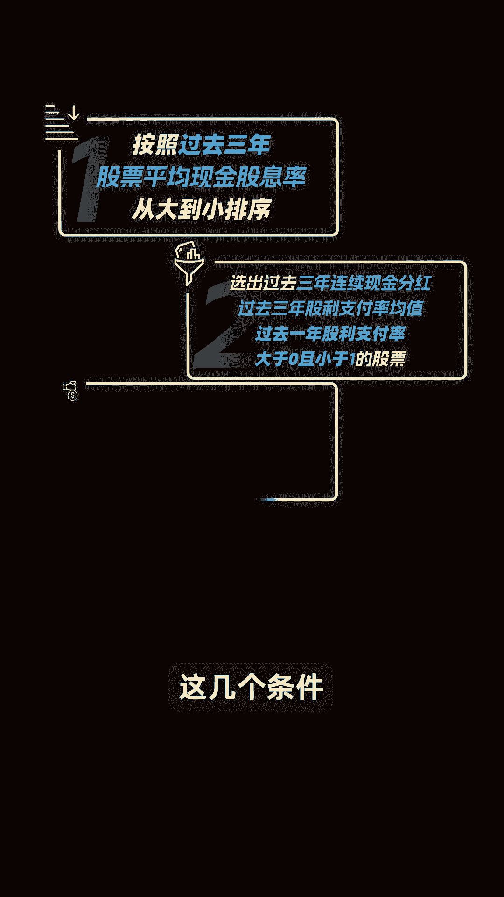

并在这些股票中买入，过去3年平均现金股息率最大的100个码。

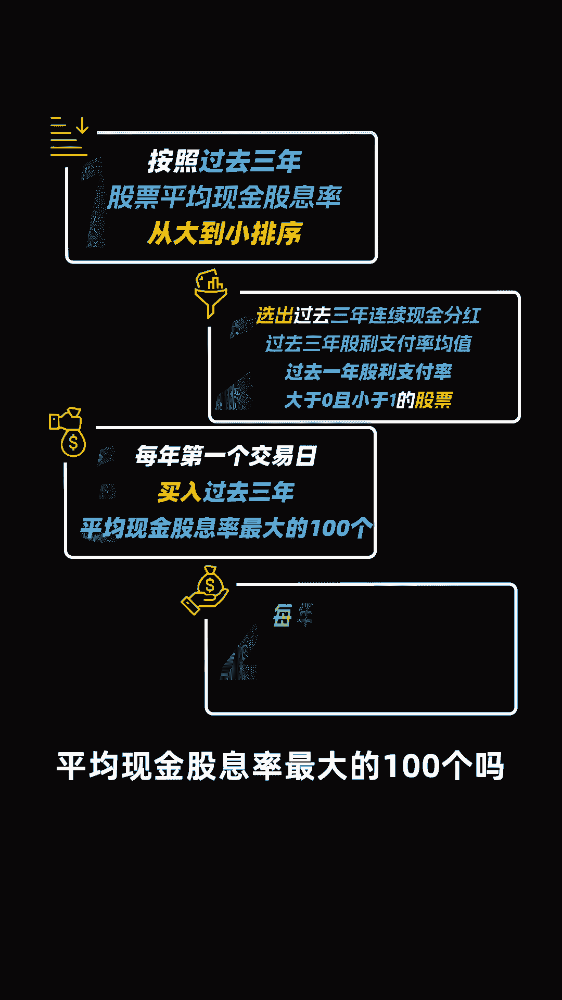

然后一直持有，在固定的时间去卖出不再符合条件的股票，并重新买入。

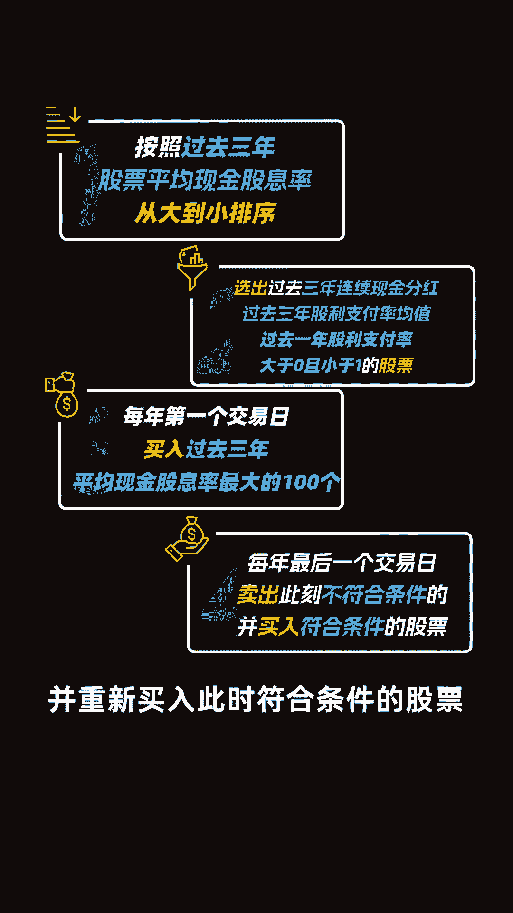

此时符合条件的股票，我们量化投资中很多选股策略，本质上和它也是一个逻辑。

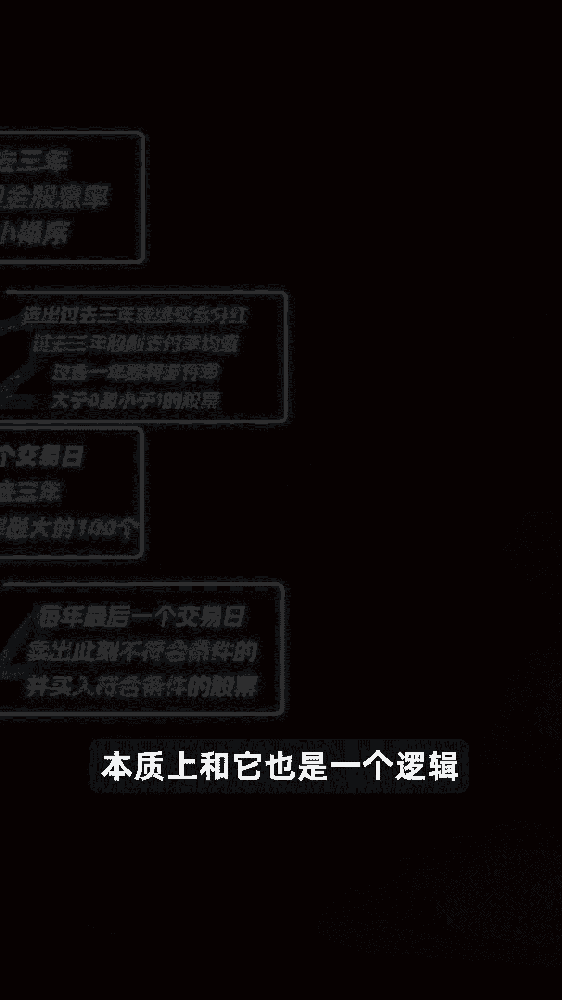

比如经典的小市值策略就是如此，也是用指标去选股，并按照模型买入卖出，仅此而已。

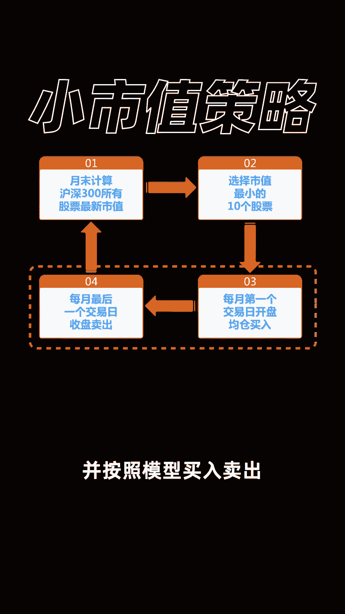

再看其他的红利指数，虽然要求不一，但本质上其实都是变形的，选出分红股的量化策略。

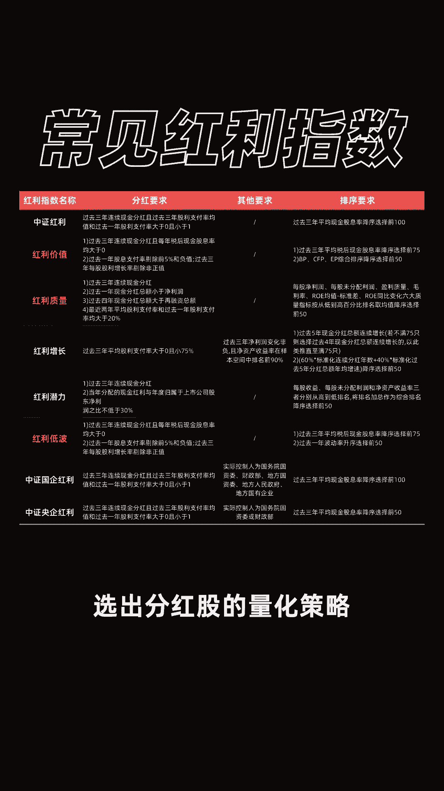

甚至啊我们最常用的上证指数，沪深300，这些也都是按照固定规则选股。

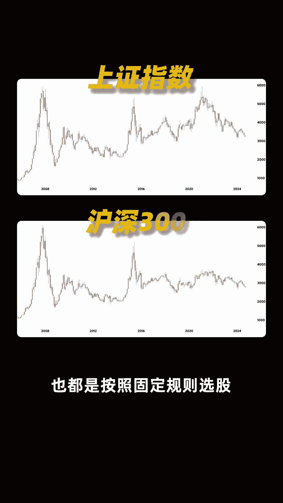

定期调仓，这其实就是国家帮你制定好的量化选股策略，只不过某个策略一直在3000点横跳。

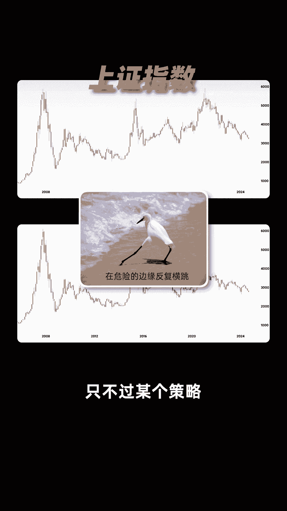

表现不太好而已，我们交易指数，在本质上其实也是在交易一个策略，只不过这个策略的股票，他已经帮我们买好了而已，现在你还觉得量化交易复杂或者高深莫测吗。

其实你早就已经接触过量化投资的模式，而不自知了，想了解更多量化投资相关内容。

大家可以在评论区留言和我一起交流探讨，我是行不行。

