# 从谁都能用到机构专用，自动交易在大A经历了什么？300W才能开通,A股自动交易公平吗？散户如何实现程序化交易？附程序化交易实盘演示｜量化投资邢不行啊 - P1 - 量化投资邢不行啊 - BV15x4y1b7q6

2023年。

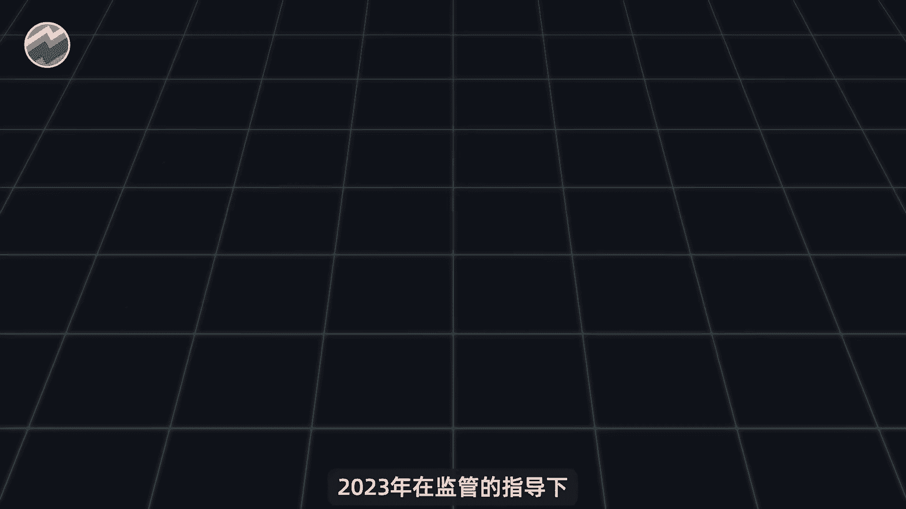

在监管的指导下，三大交易所连发两文，对量化交易进行规范和限制。

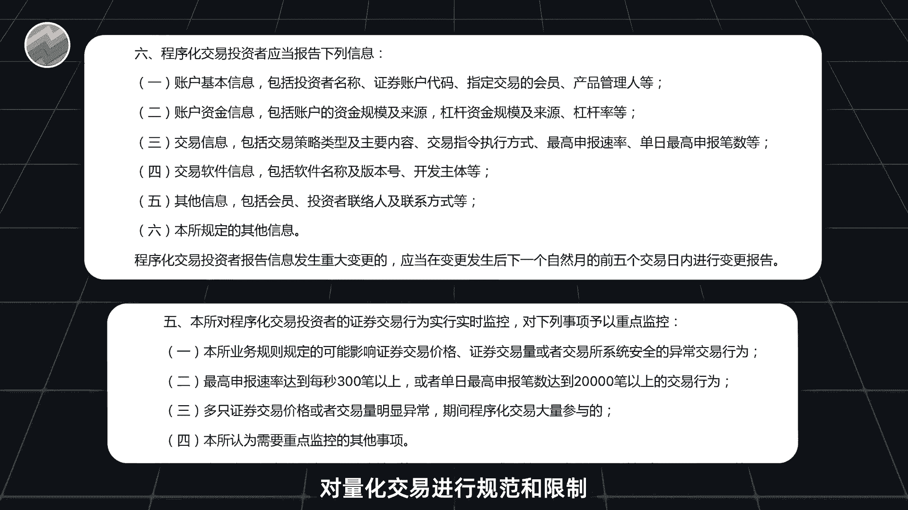

这在网络上引发了一片叫好之声，我看大家的讨论主要是，大家普遍认为量化交易可以实现自动交易。

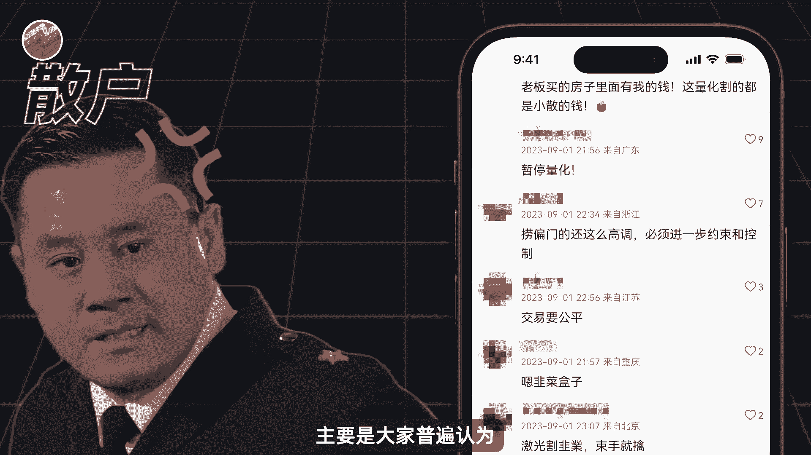

而散户不行，这一点呢有违市场，确实啊，很多对量化交易不甚了解的朋友，在他们想象中，量化交易就是那些戴着面具藏头露尾的极客，他们都有一台超级计算机，用鼠标点击了一个像核按钮一样的按键。

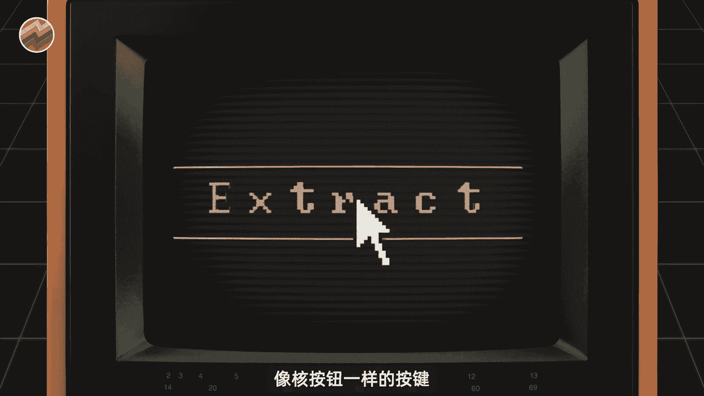

预先设定的电脑程序就会飞速运转，交易订单呢就会雪花般的生成，并实现短时间内来来回回做了巨大的交易。

买卖了数不清的股票，精准的收割了所有的散户，本期视频呢，我们不会对量化交易的好坏去做过多的评价，毕竟啊A股即使禁止了量化交易，你的股票也不一定会涨，在隔壁的美股呢，交易大行其道，也不见得美股一定会跌。

我们本期视频呢只讲量化交易当中的自动交易，比如说我们到底怎么在A股去实现自动下单，我们普通人没有任何资源，又能不能在A股实现自动下单，难度会不会很大，是不是所有人都有公平的机会。

只要学习就能够做到自动交易呢，本期视频呢我们就来做解答，除此以外啊，我们还会就大A的自动交易历史。

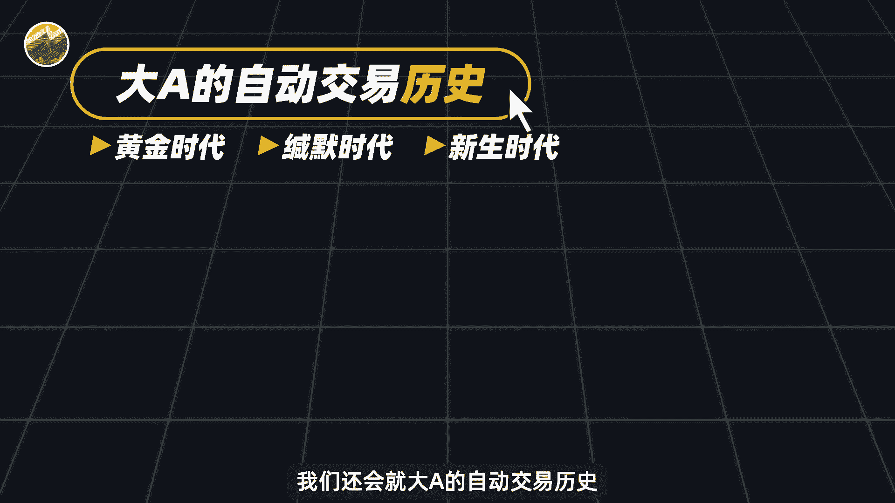

自交易软件的选择和我们自己实盘的体会，一一做相关的介绍，并会在视频的末尾演示，我们自己自动交易的实盘流程，本期视频啊，应该全网介绍大A自动交易最详细的一个了。

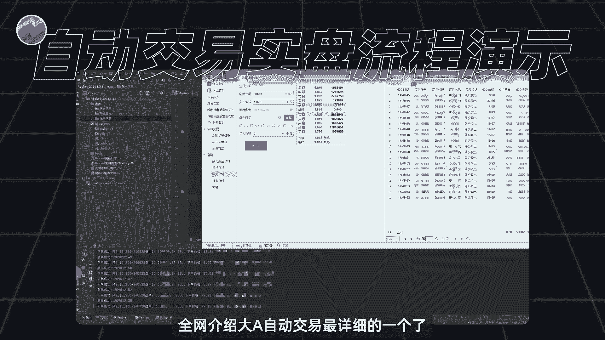

视频内容全程干货满满，要个免费的三连不过分吧，想了解更多自动交易的内容，也可以加置顶评论区，我的微信和我交流。

大家好，我是专注于量化投资的行不行，首先呢我们来介绍一下自动交易的流程，在这之前我们先做一个相关的调研，在自动交易的整个流程当中，你认为以下选项中哪个是最重要的，给大家三秒钟的时间进行选择。

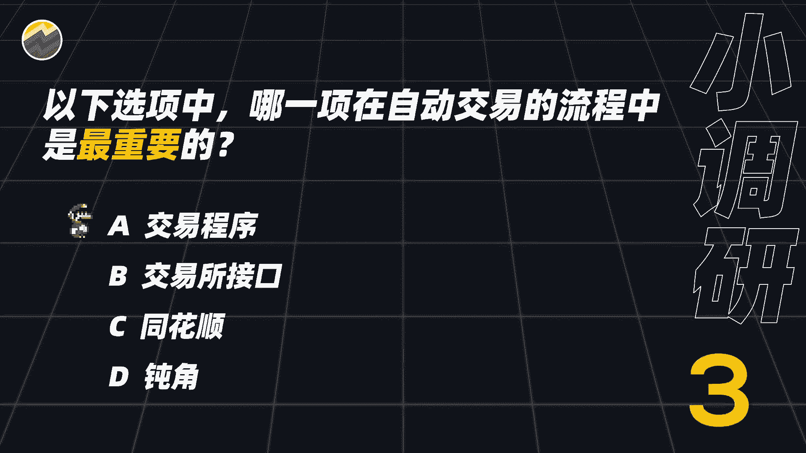

好时间到，那么想在大A实现自动交易，各个环节还是很多的，把相关的流程呢列了下来，感兴趣的可以暂停截图观看，那么在这个所有的流程当中，最最最核心的环节，就在去申请到自动交易的API接口。

开通了这个接口之后，你才能实现后面所有这些功能，那么什么是自动交易接口呢，其实啊就是交易所，比如说上交所和深交所，他们对你发了一个自动交易的许可证，有了这个许可证之后呢，你可以通过它去对交易所的服务器。

下达相应的指令，比如说从交易所服务器获取最新的股票价格，数据，获取你账户当中持有了哪些股票。

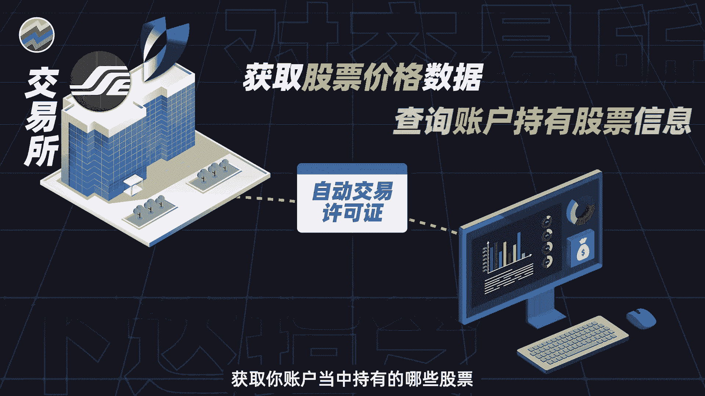

以及现在有的现金是多少，以及去做相应的下单，也就相当于对于交易所给你开了一扇门，邀请你进去玩，没有这扇门啊，让你编程水平再厉害，也只能是巧妇难为无米之炊，著名五星上将麦克阿瑟曾经说过。

自动交易不能没有交易接口，就像西方不能没有耶路撒冷，然后呢，一般当你满足一定的开头条件之后啊，你就可以在自己的券商那里申请到这个接口，你可以通过它来完成和交易所的交互。

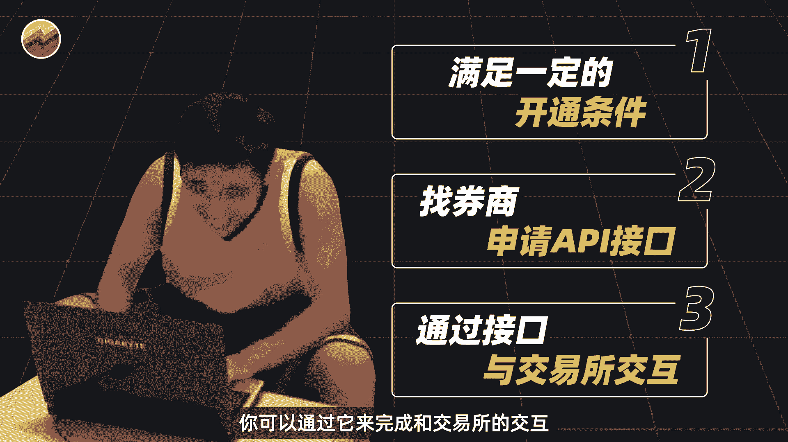

举个最简单的例子，如果有了接口之后，我们就可以通过这个程序，批量去提交交易所指令，比如说同时以市价的价格，买入指定的100只股票，这些信息呢就会通过接口传到交易所。

我们就可以在短时间内完成批量购买的操作，这个对我们做量化交易其实还是比较重要的。

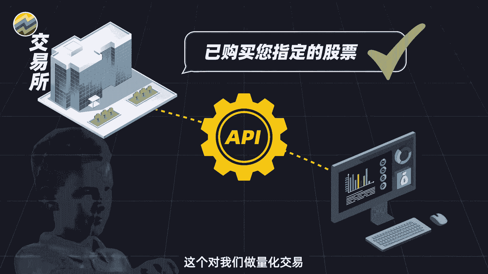

因为我们之前给大家分享过很多策略，我们做量化呢一般不会只买入一只股票。

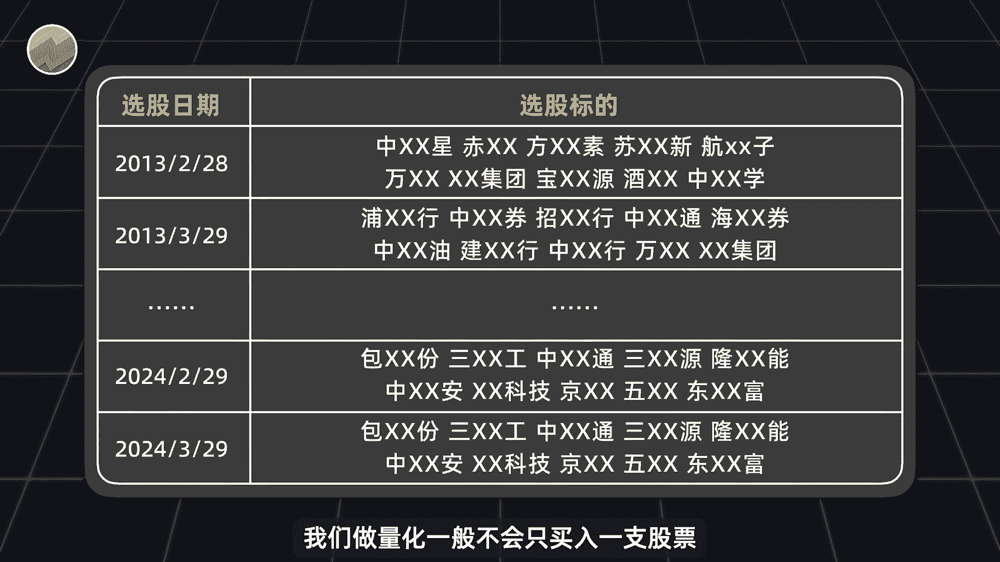

我们是对一整批股股票进行交易，如果没有接口的话，我们就只能在券商软上面，一个一个的去手工下单，也不知道要买到猴年马月，所以啊如果你想要实现自动交易，达到财务自由，迎娶白富美，走上人生巅峰的话。

你首先需需要申请一个交易所的接口，否则后面一切的都是一场梦，听到这里，你是不是想马上放下手机，去找自己的券商客户经理，让他帮你开通交易所的接口了，但是先冷静冷静，仔细的想象，炒股这么多年。

你听说过交易所接口这个东西吗。

不同于欧美，在上世纪80年代就已经有人尝试自动交易了。

大A的自动交易呢起步比较晚，大概到2008年09年年。

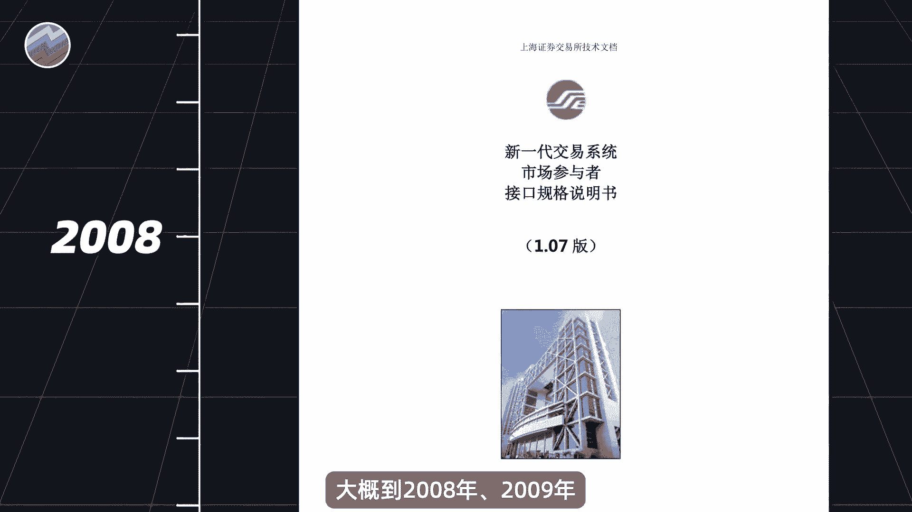

交易所发布了市场参与者接口规格的说明书，并且上线了新一代的交易平台，在此之后的几年当中呢，自动交易算真正飞入了寻常百姓家，任何人啊。

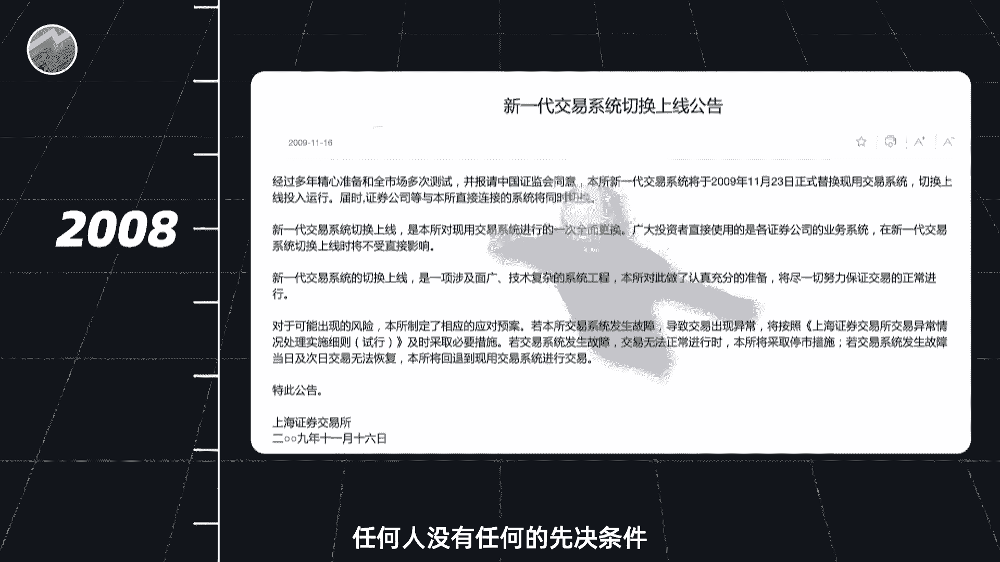

没有任何的先决条件，只要你会写代码，都可以直接或者间接的通过这个交易所接口，去实现自动交易，我自己刚开始做量化的时候，也享受过这么一段时间的红利期，我还印象很深的，记得当我自己第一遍运行程序。

根据程序的结果买入第一只股票的时候，其实还是蛮激动的，但是呢随着自动交易接口的普及，就有人打起了坏主意啊，他们利用自动交易的接口，去开发了一些配资的软件。

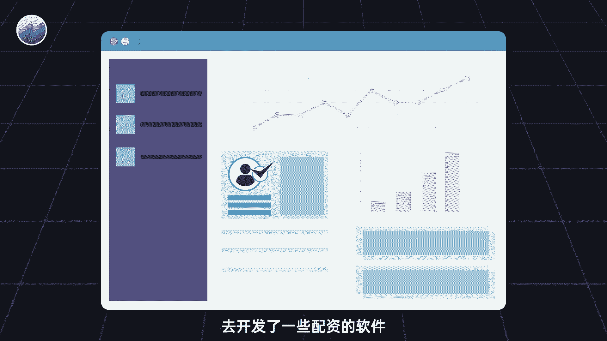

这些软件啊他会借你一个可以自动交易的账户，账户里面呢通常有一笔钱，比如说90万，如果你自己又打了90万进这个账户，那就相当于两倍杠杆来交易，如果你只打了10万进去，那么总资金就是100万。

就相当于加了十倍的杠杆，你只要一个跌停，就会让你整个爆仓，然后呢，这些配资软件就会赚取，借你那90万的利息费用，一般你加的杠杆越高啊，利息就越贵，我甚至见过30%的年化利息。

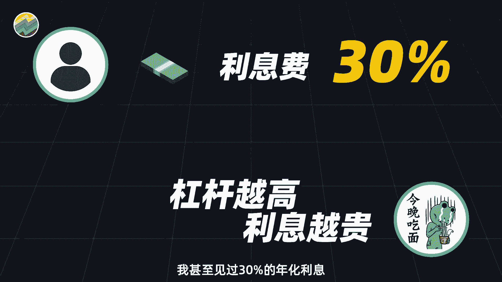

这是妥妥的高利贷了，而到了2015年呢，随着新一轮的牛市出现，越来越多的人通通过这些配资账户去进行交易，在杠杆的作用下，市场的波动与成交量也被进一步放大，直接将指数推到了前所未有的高度。

所以那一轮牛市呢也被称作为配资牛市，但也正是因为大家普遍店家的杠杆太高，导致市场时常大涨大跌。

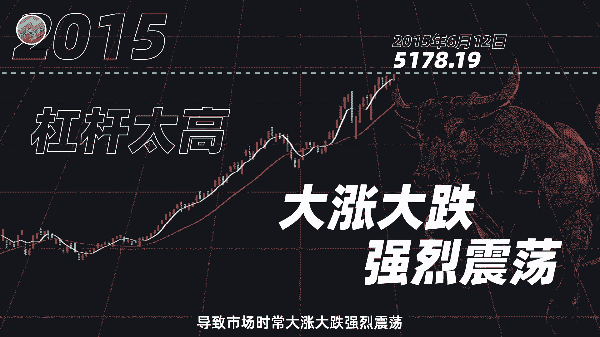

强烈震荡，监管呢也察觉到了相关的问题，所以直接下场叫停了自动交易，关闭了自动交易接口，直接从根子上让这些配资软件无法越行，并且还宣布开始整顿配资账户。

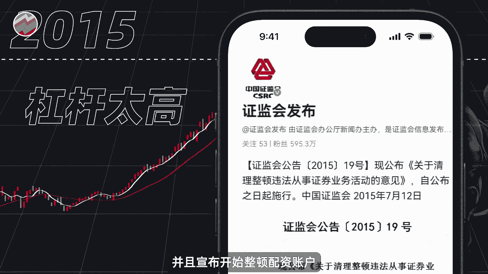

在这之后呢，配资账户开始出清，引发了一系列的断崖式狂跌。

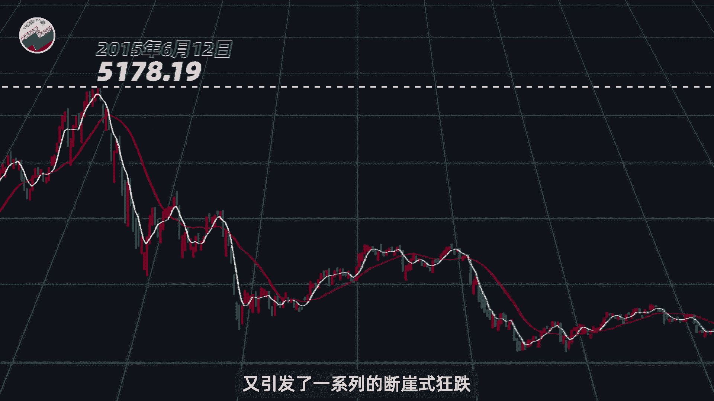

再后来的事情啊，经历过的想必都知道了，我自己呢是完全支持打击配资乱象的，这个真的是无法无天了，停掉自动交易接口，这个举措呢也真的是釜底抽薪，一下子就可以停掉所有配资账户，我是监管啊，我也会这么做。

但是呢这确实也是让我们这些用自动交易接口，正经做量化的人受到了很大的影响，我记得很清楚啊，2015年的当时某一天。

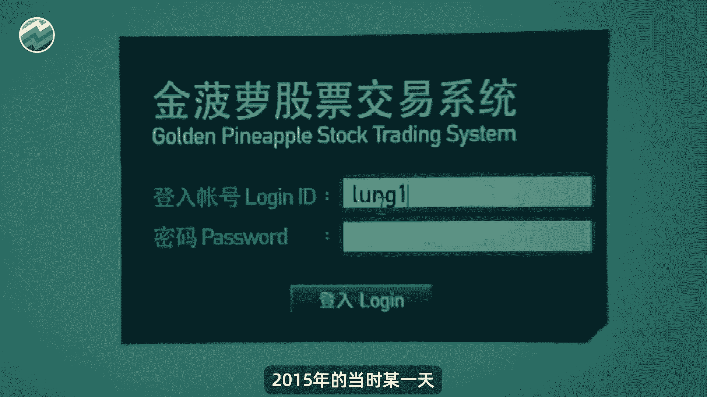

我的程序还正在帮我下着单，一个一个的买入股票呢，但是下着下着程序就报错了，我被交易所拔了网线，一开始还以为是我的程序出了问题。

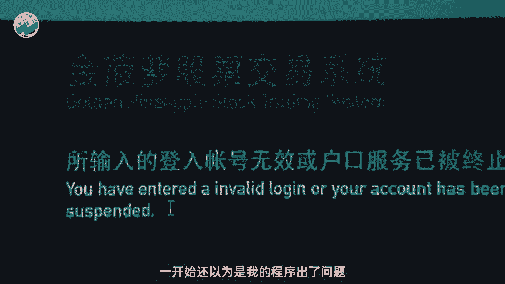

后来反复查找才知道是交易所关停了接口，没有任何提前的通知啊，这个接口呢直到现在也没有恢复，所以呢属于自动交易，野蛮生长的黄金时代就此落下了帷幕，在之后的几年当中呢。

监管对大A的自动交易一直是有严格的限制，那个时候啊。

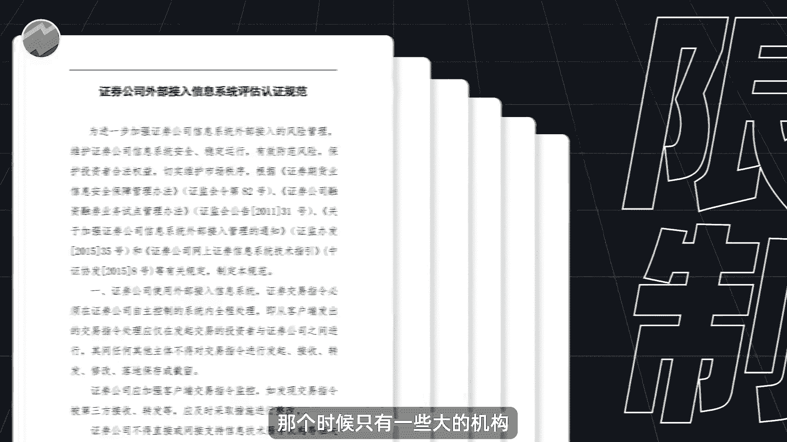

只有一些大的机构还可以正常的去使用，我们自己呢也因为没有接口，只能自己写代码去模拟鼠标键盘点击操作，同花顺来进行下单，原理有点像按键精灵这个软件。

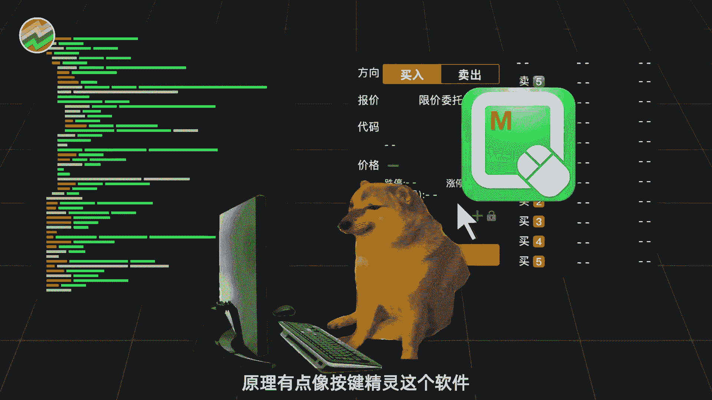

这样呢会比我们人工一个个去下单更快一点，算是间接的实现了自动交易，但这个过程啊是真的很痛苦，速度非常的慢，买入一个股票大概需要花一秒钟的时间。

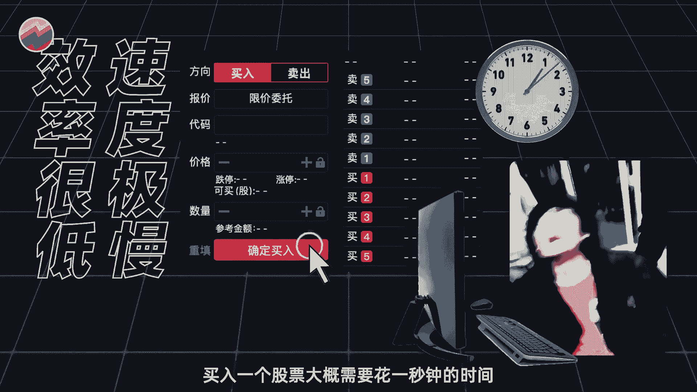

就像几年前我发过的这期视频中，演示的这个技术啊，除了免费，其他优点真的是一概没有。

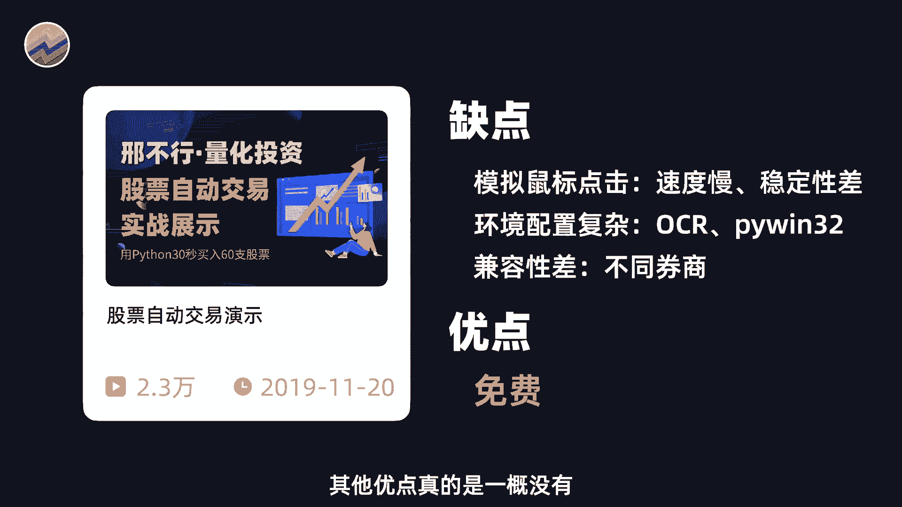

然后呢在漫长的煎熬之后，大概在一八到19年之间啊，虽然监管呢还是没有直接提供自动交易的接口，但是呢各方都在朝前做一点点的摸索，比如说出现了一些提供接口的第三方软件，比如说司提供的p trader。

某公司提供的QMT等等，我们呢可以通过这些软件提供的接口去下单，那至于为什么这些软件，他们能够获得到这些接口，其他软件不行，这个我就不知道了。

那么在这些软件出现之后呢，我自己也都去用过，做过相应的考察，用下来给我的感觉是各有千秋啊。

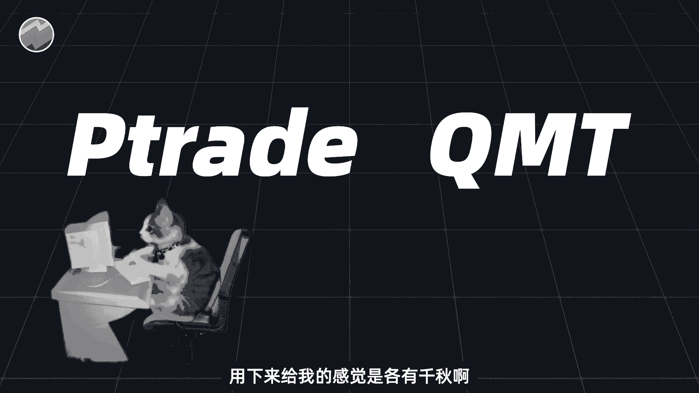

具体的对比呢我都列了出来，感兴趣的可以截图观看。

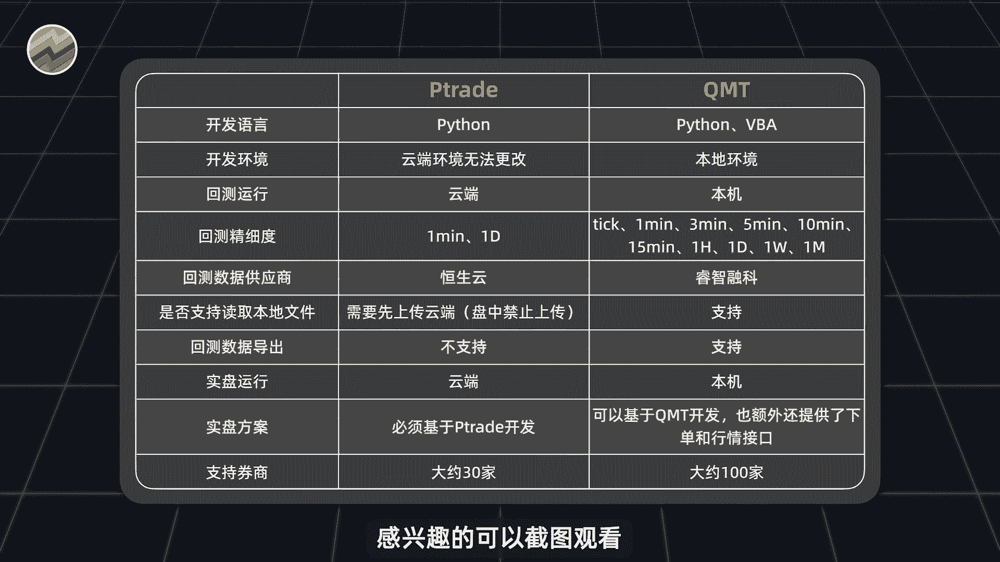

现在我们自己呢是使用T来实现自动交易的，本期视频开头演示的呢。

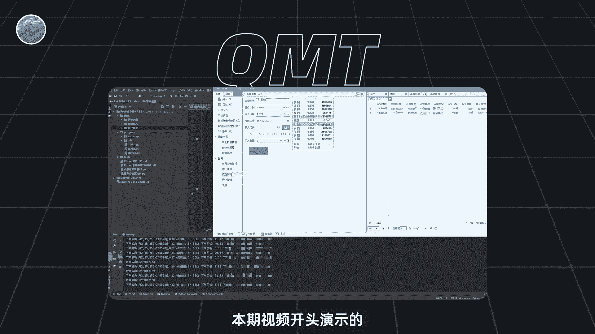

就是基于CRIMT实现的自动交易，讲到这里啊，我不禁想吐槽一下，在某个远不如大成熟的马赛克市场。

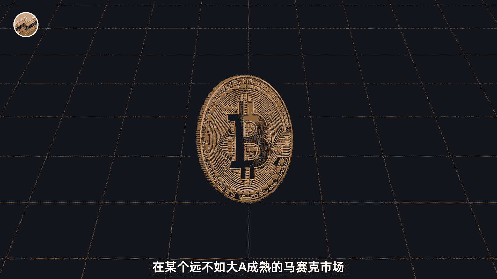

自动交易的实现就要简单太多了，所有人都可以通过几行代码。

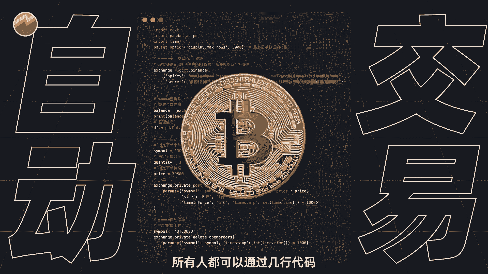

非常简单，完全免费的实现自动交易，我们之前也出过一期视频，当时发布在了小号上，感兴趣的朋友可以去看一看，那言归正传，现在普通人想要实现自动交易，最好的办法就是使用CREMT或者p train。

因为我们自己用的是CREMT，所以接下来呢我们就给大家介绍一下。

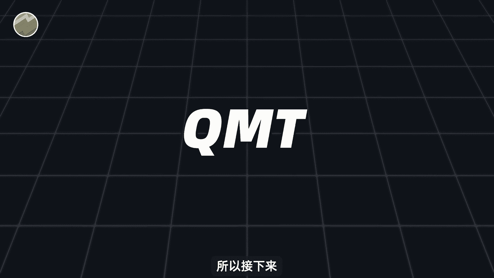

CREMT这个软件。

q mt呢我们可以把它理解成一个中间商，他对接并封装了交易所的自动交易接口。

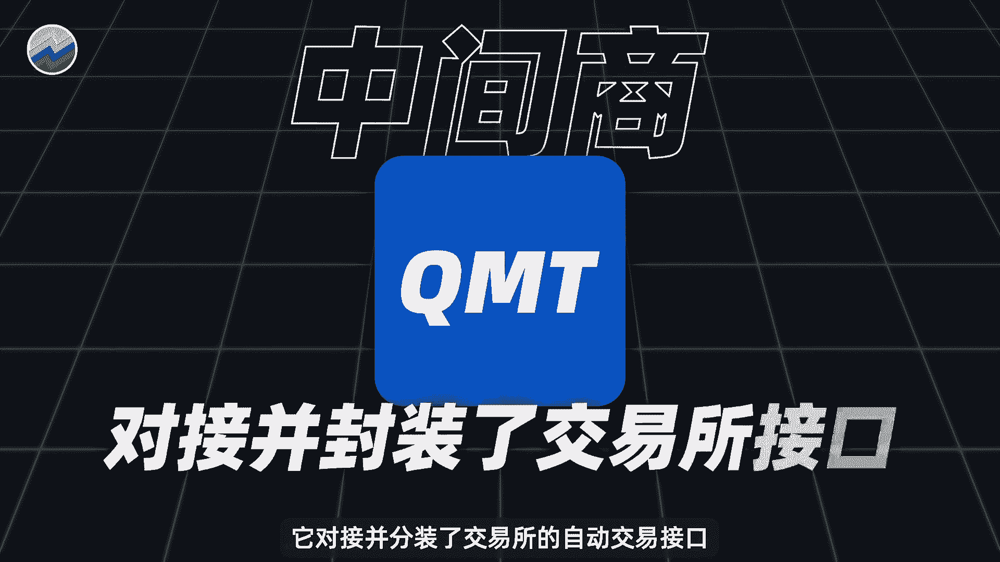

我们只需要将自己的券商申请CREMT的权限，就可以通过它来实现自动交易，当然前提啊是你的券商购买了QMT的服务，使用CREMT的时候，只需要将你的策略，最终生成的买卖信号反馈给他，他就会帮你去自动下单。

包括你要买什么股票，什么数量，以现价单还是市价单去下都可以指定啊，然后CREMT会把这些信息提交给券商，券商呢再把信息提交给交易所，这样就形成了一个完整的自动交易流流程，相当于多了一道赚差价的中间商。

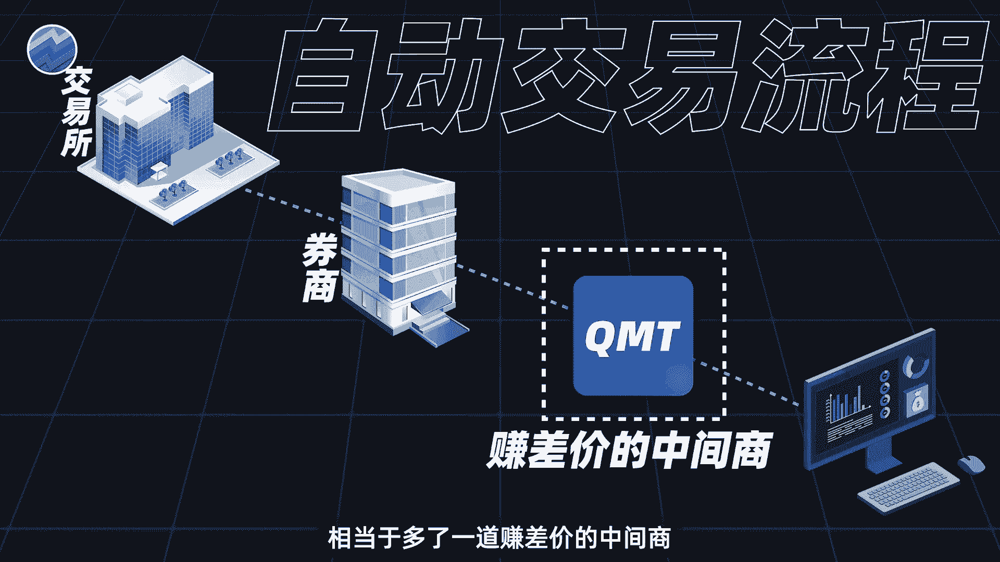

你呢也可以通过CREMT来查询，你账户的信息和持仓的信息，也可以接收一些这行情的数据。

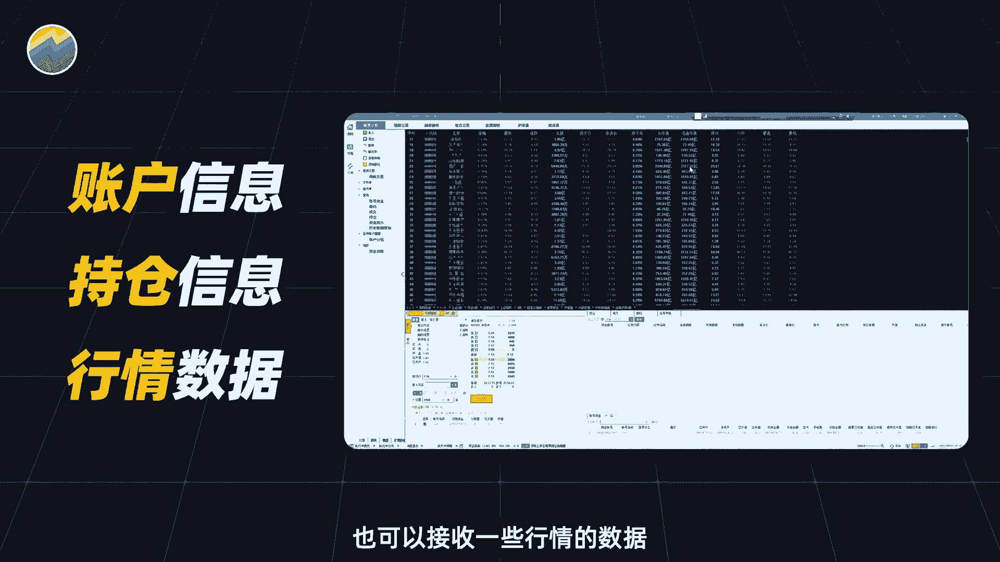

总体来说啊，你不能说功能做的多完善，但是肯定是可以用的是啊，现在券商呢会把它当做一个增值服务提供给你，所以呢会要求你有一些门槛，一般来说呢是需要你达到一定的资金量。

券商的门槛不一样啊，有的券商的要求你有30万，有的券商甚至要求你有300万，甚至还有的券商会因此调高你账户的手续费，可能我们有的观众觉得30万也不是很多啊，但是你要知道有一半的股民。

他们的账户资金是连10万都没有的，所以说呢还是有一定的资金门槛，当然啊这个问题也是有一定的解决办法，这个就不能公开讲了。

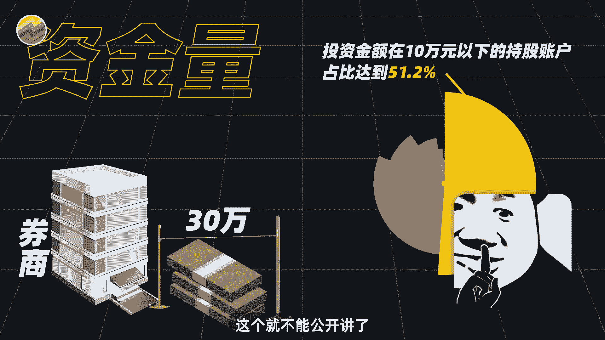

感兴趣的可以加置顶评论区，我的微信可以私聊找我，最后呢说实话啊，q mt这样的软件，它的使用体验只能说是过得去，并不能说很优秀，很多时候呢也是我们没得选，没有其他的办法对吧。

那将来是不是可以有更多的进入这个行业，提高这样的服务的质量呢，或者说这个行业本身就受到相应的监管，这个就是题外话了，我们也不做展开好，不管怎么样呢，这次我们也就大致介绍完了，大A自动交易的历史和现代。

实现自动交易的方法，视频的最后啊，也就给大家演示一下，我们自己平时用实现自动交易的实盘的流程，有任何自动交易相关的问题呢，也欢迎加置顶评论区。

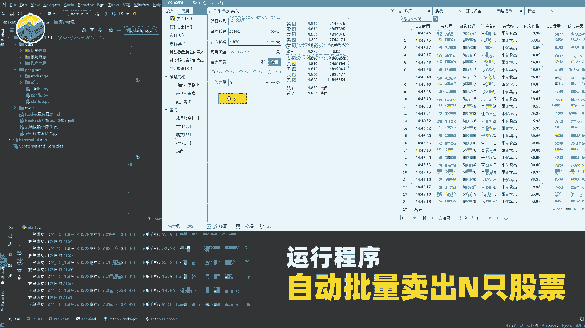