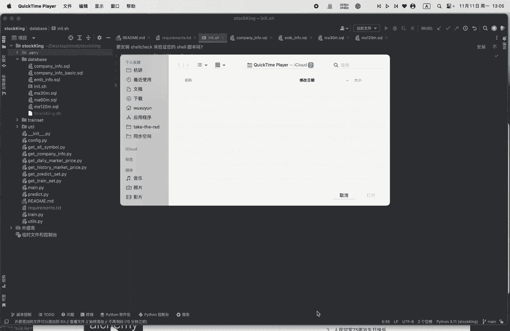
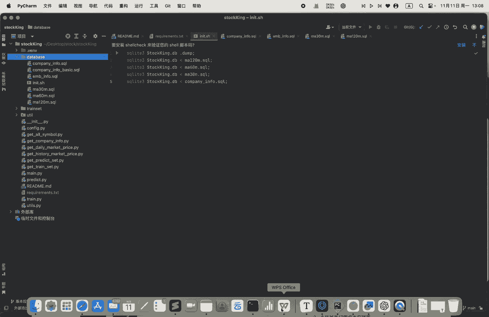
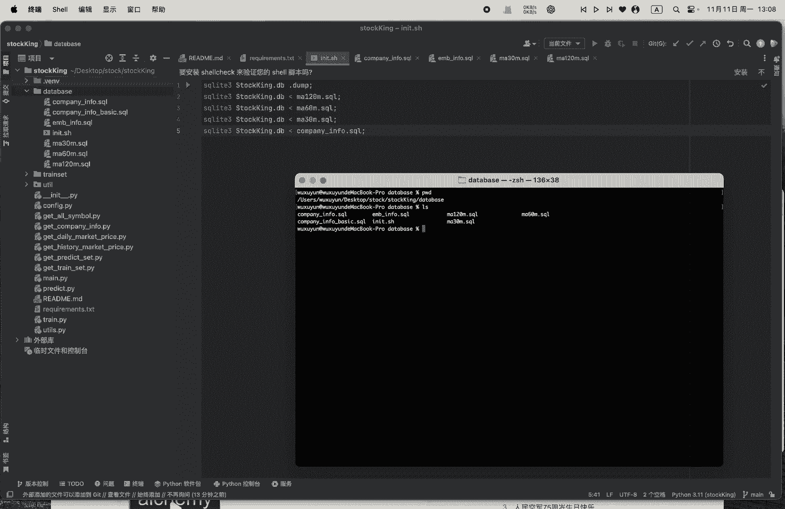
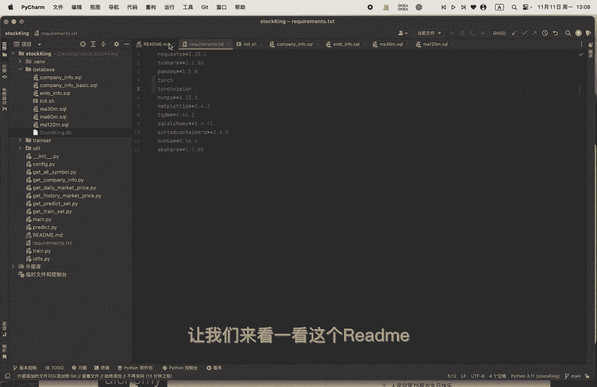
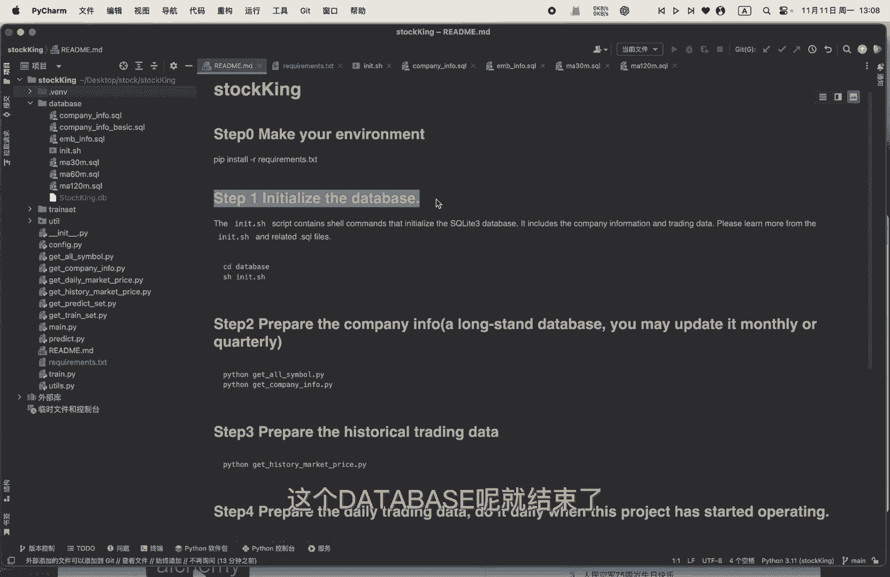
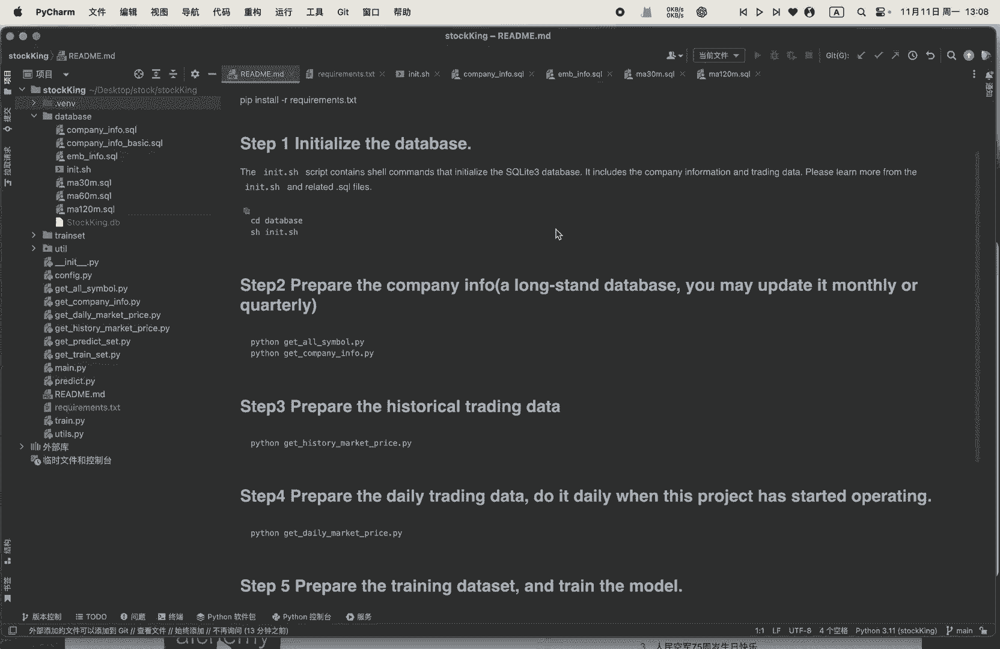

# 从零开始做量化｜1 数据库的搭建 - P1 - 小蓝帽go - BV1CrmpYcEkF

大家好，今天想跟大家分享一下我做的一个小项目，用Python搭建的量化交易模型，嗯虽然他现在还不能支持实时交易，但是可以给你提供个股的啊买卖的一个参考，我这个项目中呢会用到Python开源数据集。

还有深度学习模型等技术，最后我会把这个模型的啊，把这个项目开源到GITHUB上，方便大家参考和使用，因为我并非金融专业出身，所以在量化方面的知识呢可能不够全面，把这个项目开源，是希望和大家多多交流。

共同学习，OK我们先从第一步开始，额股票数据库的搭建，在这之前呢，我先来介绍一下我的这个requirements，也就是说这个Python环境的一个依赖呃。

他这里面会用到tu shell和ak shell，这两个是国内比较有名的呃，量化数据的一个开源的一个数据库，他当然他当当然他也有收费的一个呃版本，这个就更加多了，但这里我只会用到它开源的一个呃。

一一些数据呃，从那个这边pandas一直到这边，当派的是他的一个额数据处理，额数据清洗，包括touch的话，是用来建建立深度学习模型的一些呃依赖，还有这个circle，ARCHEY呢，是呃。

用来支持我的SQL light3的一个数据库的一个搭建，这个项目呢会用到SQL light3作为这个基础数据库，好的我们这个点开这个database的这个领地使用的shell，我们可以看到呢。

我主要是建立了三个滑动窗口的一个呃数据库，Ma120 m，也就是说moving average，ma呢是它这个时间序列预测，或者说是量化交易里面一个比较重要的概念，就说滑动平均的一个概念啊。

120M呢就是两个小时，120分钟吧，然后这边有60分钟的，还要到30分钟的，还有这个company iphone的话，它是它有一个公司，上市公司的一个嗯基本的一个介绍吧。

点开这个ma30M可以看到他这里有哦，store code也就是股票的一个交易的代码好，open price是它的一个开盘的价格，high price是它最高价格最低价啊，这个是它这个结束的一个价格嗯。

这个period volume，是他的整个期间的一个交易的量，OK这个company info的话是啊，同样的这个stock code是它的一个呃，股票的一个代码，一直到从这个introduction。

一直到它下面的main business，是他的一个公司的一个介绍呃，包括他的一个整体的介绍，他业务的一个嗯，scope就是说它的业一个业务范围啊，Employees，他雇员的数量。

还有main business，也就是它的主营业务等等，那我们把它一个建立一个初始化，我这边已经建立好了，先把它删掉嗯。

好了，我们这一步呢就是已经结束了，让我们来看一看这个read read me。

而我们第一步的初始化这个database呢就结束了。

