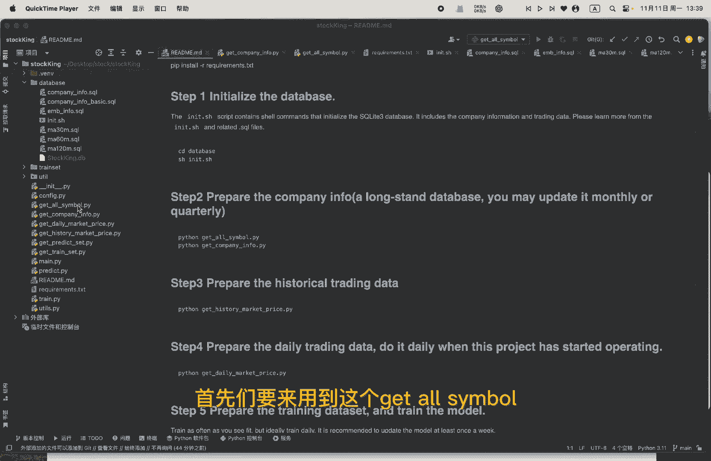
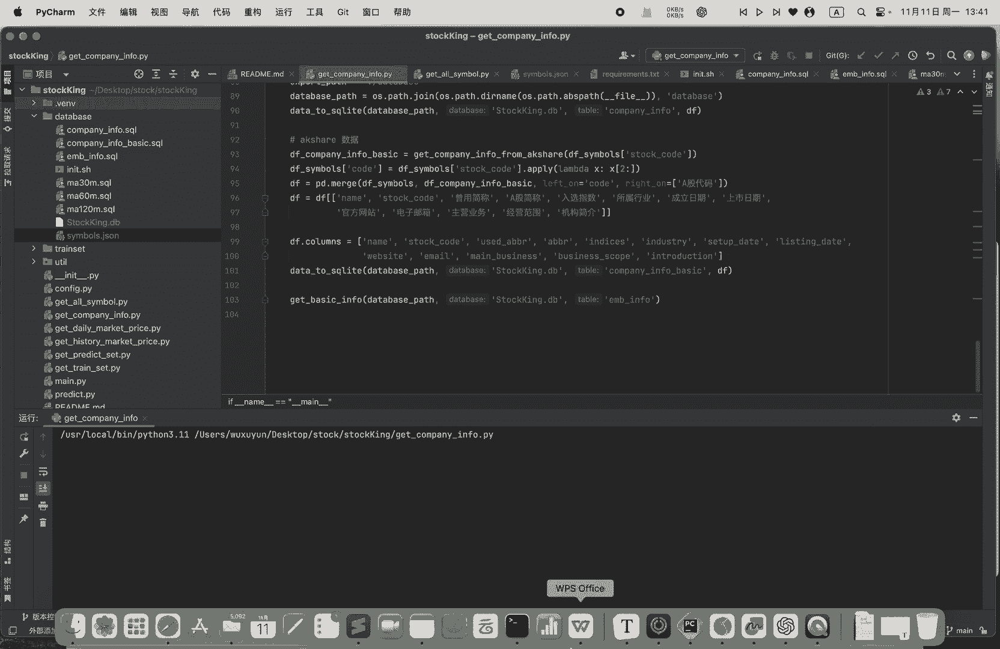
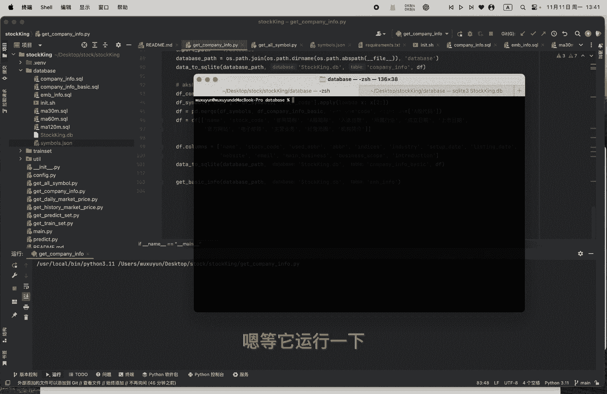
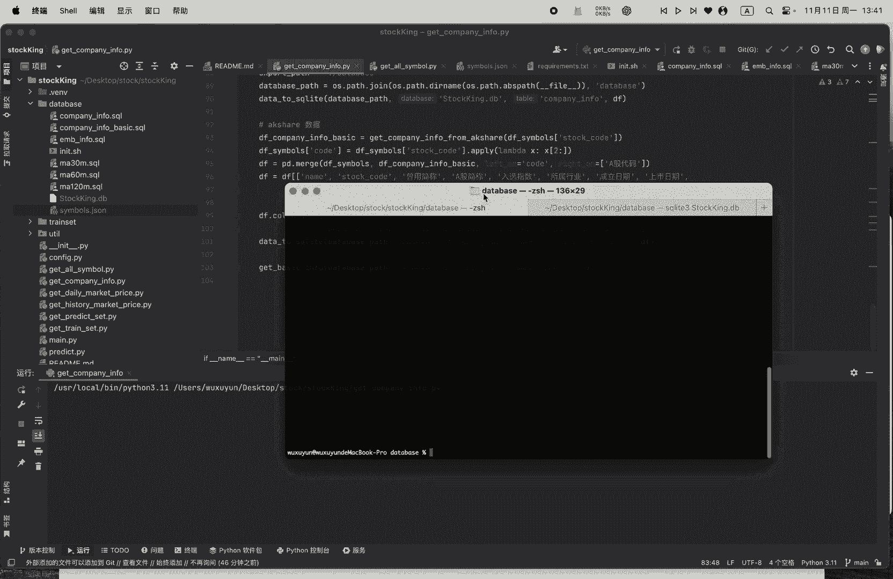
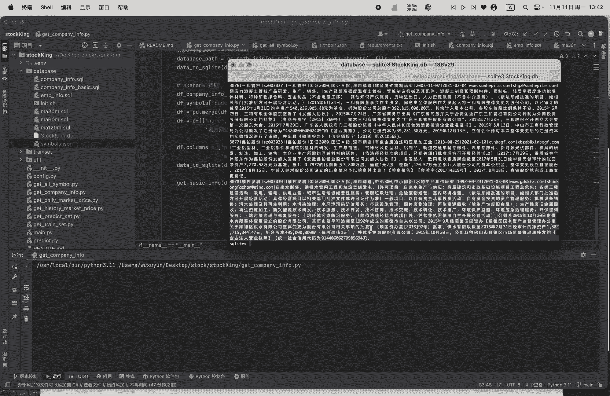
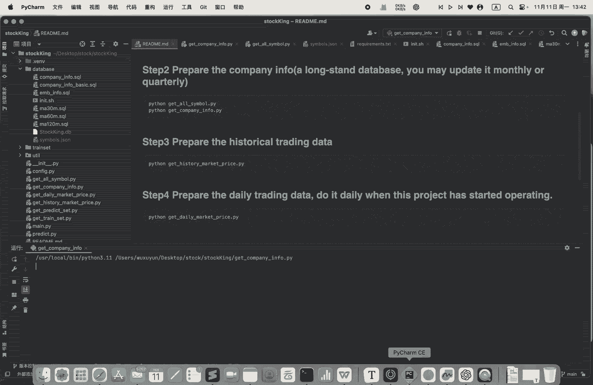
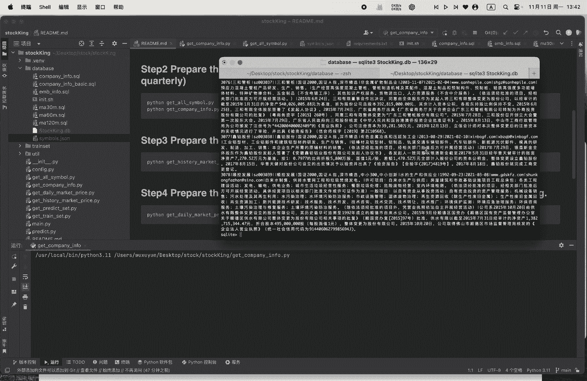

# 从零开始做量化｜2 上市公司数据 - P1 - 小蓝帽go - BV1CCmpYfEup

好的嗯，我们把那个基础数据库搭建好了，那我们现在就要开始来准备嗯这个company info，这company info呢应该是一个长期的数据库，你应该就是嗯如果不用大改的话，就是不用经常去更新它。

一个月或者是一个季度去更新它一次就行了，首先呢我们要来用到这个get all symbo。

这个Python代码呢，它是会从这个新浪的金融这边去拿到，所有的一个股票的代码，好我们可以去运行一下它，运行一下，OK啊，那这边呢我们会拿到所有的这个额股票的一个，上市公司的一个代码，比如说SH哦。

六五个零，那它就是一个浦发银行啊，比如说这个SH600556是这个天下秀，这指上市公司，那我们啊回过来看这个，OK我们就是拿到所有的股票代码呢，我们就要是要准备的那个呃，公司的一个上市公司的一个介绍了。

我们来到这个get company info这一个Python代码，可以看到他有两个，一个是呃get company info from tu share这个API这个key呢，这是我自己的。

大家用的时候呢，就可以自己去那个TU下申请一个那个API key嗯，把它放上去，然后这个是从那个AK42里面去拿到一个嗯，股票的一个嗯基础数据啊，比如说它的一个行业指数，它的一个工业是一个什么。

是它的一个工业啊，也说它的行业是一个什么样的行业等等等等哦，OK我们可以看到这边有他的一个啊，TAK的AK上的一个数据呃，采用采用简称A股，简称入选指数行业等等等等等等。

这是他的一个basic info，这是他的一个company info，我们待会都可以去看一下。

等它运行一下哎。

哦我们先不等了，我们这边可能比较慢，我这是一个我已经做好的一个一个一个数据库，我们可以看一下啊，Flexing from company info，我们可以看到这个是他的一个公司一个介绍啊。

这是他的一个introduction，还有它的一个行业等等，包括他的一个嗯，看一下这个company info basic，看一下，哦差不多basic可能跟那个TU赛，可能跟AK赛差不多嗯。

都是一些那个商业公司的一个基础，一个介绍。

这些介绍呢我们会用那个AOP的一些方法，比如说把它分词，然后把它那个嵌入，把它embedding掉，然后和我们的那个呃交易数据一起结合，放到那个深度学习的一个模型里面，OK这一步比较慢。

那我们就先结束了，这个你运行以后最终会得到一个结果。

结果应该是像我刚才的一个这样子的一个结果。

