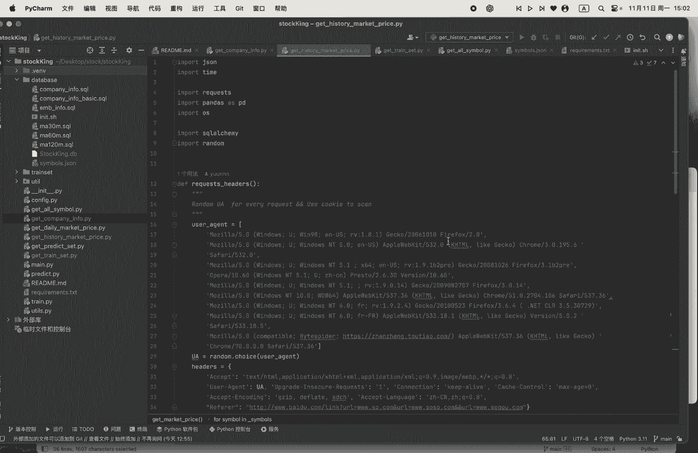
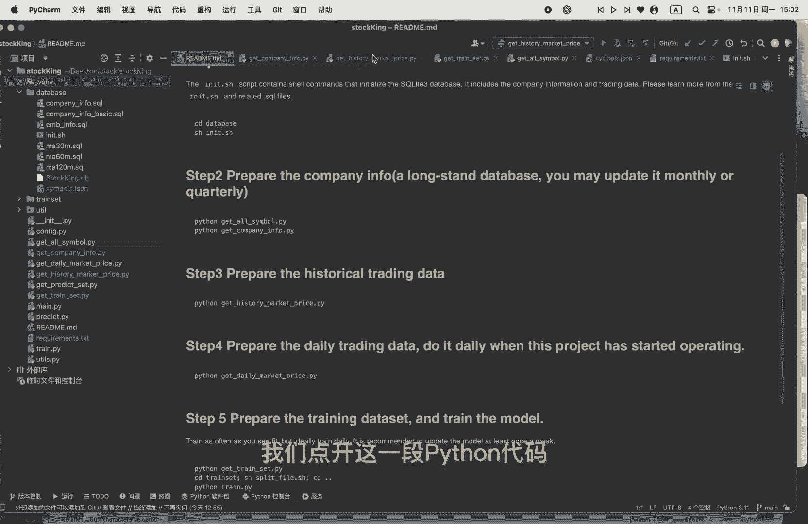
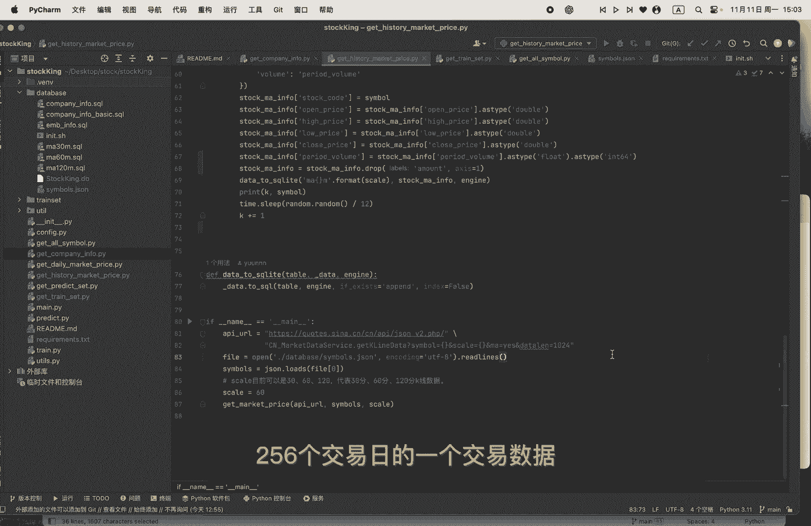
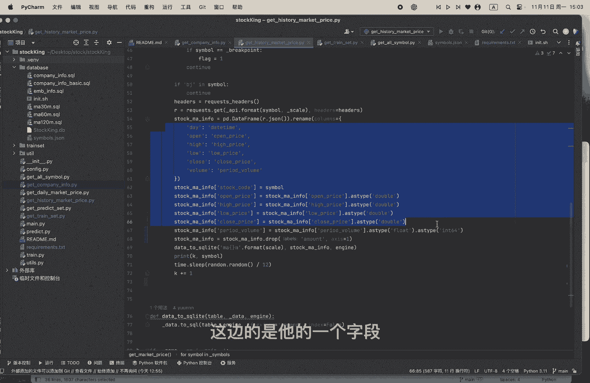
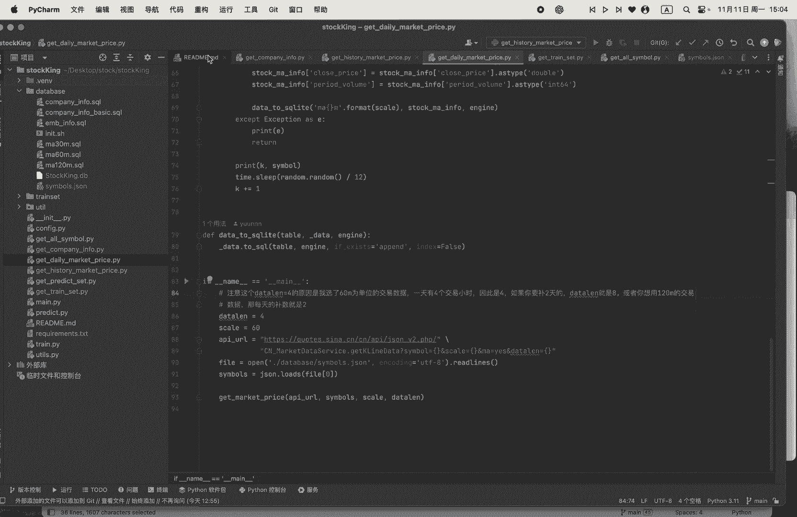
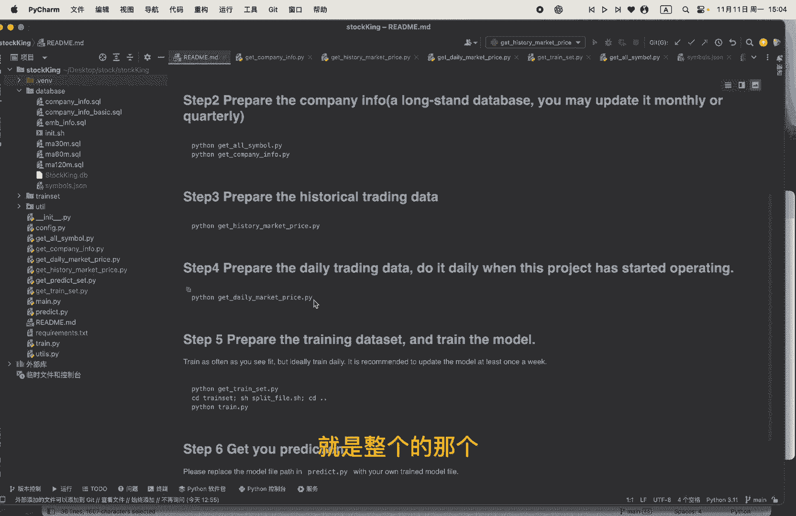
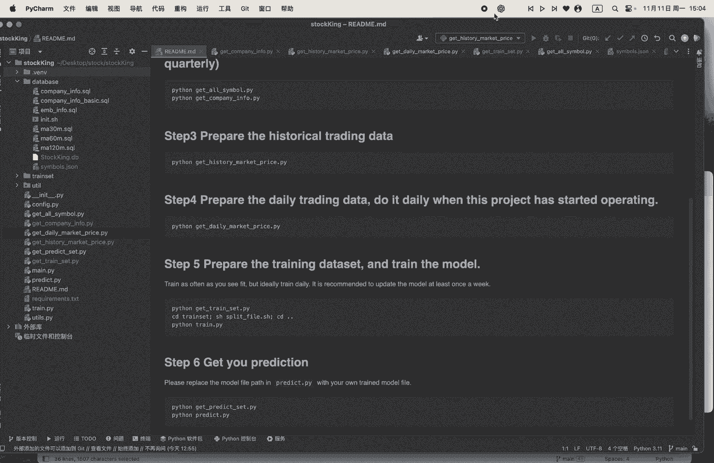

# 从零开始做量化｜3 历史交易数据 - P1 - 小蓝帽go - BV1YmmxYXEM4

OK然后我们来到了一个第三部，第三部的话，也就是说准备他这个历史的一个交易数据哦，我们点开这一段Python代码嗯。

可以看到我还是从这个新浪财经的这个接口，拿到他的那个历史的一个交易情况，他这个接口的话，这个simple的话，其实就是那个上市公司的那个股票代码skill呢，他这里可以选择三十六十，120。

就分别是代表30分钟还是60分钟，一拍120分钟的那个呃，K线的一个交易情况，交易数据，然后他的1024呢，应该最大，就最多最多能获取到过去1024个时间，窗口的一个额交易的一个情况。

那也就是说如果你选择60那一天，按照四个小时的交易时间的话，1024就相当于呃256个呃，交易日的一个交易数据。

然后我们可以看到这边的是他的一个字段。

字段的话，有那个有时间，然后有这个额开盘的价格，最高价格，最低价格，还有一个收盘的价格嗯，还有一个额交易量，他这个新浪这边的话还有一个amount的字段，amount字段其实就是一个交易金额。

交易金额其实就是交易量乘以它的一个价格，的一个一个数据，我认为那个模型可以自己学到这个。

amount的一个字段，所以我就给把它给去掉了，呃，然后你可以这个是历史的一个交易的一个情况。

然后你每天呢可以去运行一下，就是每天去运行一下定时任务，去运行一下这个daily market price，然后把它设置成四，也就是说其实就是呃四四天吧，因为一天有四个交一小时的话。

如果你选择scale是60分钟的话，那就是data l length就选择四，那你如果补数要哦八的话，补两天的话，那你这个data length就是八。

所以我们到这一步的话，就是整一个的那个哦。

基础的一个数据都已经准备好了，那我们接下去呢就是要去准备这个训练数据了。

